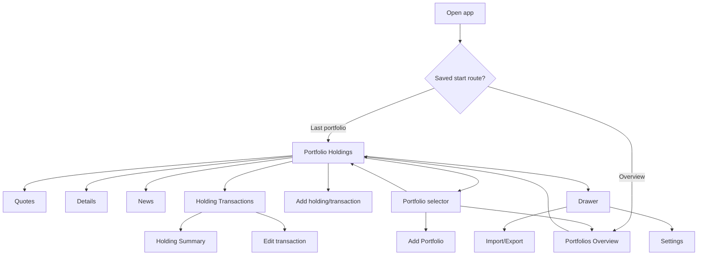

# 1. Screen inventory and navigation specification

## 1.1 Source-to-target decisions

The following explicit target decisions override the source Android interface:

| Source behaviour | Target decision |
|---|---|
| Portfolio tabs are **Quotes / Holdings / Details**. | Add a fourth **News** tab. Preserve the compact tab strip. |
| A currency button appears in the lower-right of summary panels. | Omit it. Currency remains a portfolio/user setting rather than a persistent action button. |
| A three-dot overflow action appears in several app bars. | Do not reproduce it unless a required action has no clearer home. Use a contextual back action on child screens and explicit actions for add/edit/delete. |
| Holding detail has **Profile / Summary / Transactions / Details**. | The source **Details** tab is not required in the rebuild. Profile content was not observed; do not build it merely to match a label. Recommended target holding tabs are **Summary / Transactions / News**. |
| Source contains advertising, Premium and Server Sync entries. | Omit advertising, Premium upsell and source-specific server sync. The web app is already server-backed. |
| Source Market News is a drawer destination. | Reuse the useful behaviour as the requested per-portfolio **News** tab; a separate global news screen can be deferred. |
| Source export targets Google Drive, SD card, email and clipboard. | Use browser/iPhone-native file import, download/share and clipboard actions. |
| Android confirmation-on-exit, keep-screen-alive and widget settings exist. | These are not core PWA requirements and can be omitted or deferred. |

## 1.2 Screen ID map

| ID | Screen or state | Primary evidence | Target status |
|---|---|---|---|
| P-HOLD | Portfolio — Holdings | `01.png`; `Video.mp4` 00:00, 00:28, 00:33, 01:41 | Essential |
| P-QUOTE | Portfolio — Quotes | `02.png`; video 00:01, 00:46 | Essential |
| P-DETAIL | Portfolio — Details/Analysis | `03.png`; video 00:05–00:09, 00:49–00:53 | Essential top graph; advanced sections staged |
| P-NEWS | Portfolio — News | User requirement; source Market News provides partial analogue | Stage 2, but route/tab scaffold in v1 |
| P-SELECT | Portfolio selector popup | Video 00:29–00:33 | Essential |
| H-TXN | Holding — Transactions | `04.png`; video 00:11–00:14, 00:19–00:21 | Essential |
| H-SUM | Holding — Summary | `05.png`; video 00:14–00:19, 00:36–00:44 | Essential |
| H-DETAIL | Holding — source Details | `06.png`; video 00:21–00:27, 00:42 | Explicitly omitted from target |
| H-PROFILE | Holding — source Profile | Tab label visible only | Do not build until requirements exist |
| O-PORT | Overview — Portfolios | `07.png`; video 01:40–01:42 | Essential |
| O-DETAIL | Overview — all-portfolios Details | User description; no direct capture | Stage 2 after portfolio history |
| NAV | Navigation drawer/menu | `08.png`; video 00:53, 00:57–01:07, 01:38–01:40 | Essential, simplified |
| NEWS-GLOBAL | Market News | Video 00:55–01:07, 01:37–01:39 | Deferred or absorbed into P-NEWS |
| PF-ADD | Add Portfolio form | Video 00:59–01:00 | Essential |
| SET-INDEX | Settings index | `10.png`; video 01:07–01:09, 01:14–01:17, 01:34–01:36 | Essential, simplified |
| SET-GEN | General settings | `11.png`; video 01:15–01:21 | Essential subset |
| SET-DISPLAY | Display settings | `12.png`; video 01:22–01:34 | Essential density/precision subset |
| IO-INDEX | Import/Export | `09.png`; video 01:09–01:12 | Essential |
| IO-EXPORT | CSV export preview/actions | Video 01:12–01:13 | Essential |
| HOLD-ADD | Add holding/transaction | Entry icon observed; form not shown | Essential proposed screen |
| TXN-EDIT | Edit/delete transaction | Not shown | Essential proposed screen |
| DIV-LIST | Dividend forecast/receipts | Only aggregate dividend fields observed | Stage 2 proposed screen/panel |
| ALERTS | Manage alerts | Drawer entry and holding bell visible | Stage 2 |

---

# 1.3 Detailed screen inventory

## P-HOLD — Portfolio Holdings

**Evidence:** `01.png`; video opening state and repeated returns.

### Purpose

Provide the highest-density operational view of one selected portfolio: each open holding's current price, value, cost, daily movement and total unrealised performance, plus portfolio-wide realised and all-time results.

### Entry

- App start when the configured starting screen is the last selected portfolio and starting tab is Holdings.
- Tap **Holdings** in the portfolio tab strip.
- Select a portfolio from the title selector or drawer.
- Tap a portfolio row from Overview; the video shows this navigating to that portfolio's Holdings tab at approximately 01:41.

### App bar

Observed left to right:

1. hamburger/menu button;
2. selected portfolio name and downward caret;
3. manual refresh icon;
4. `+` action;
5. source overflow menu.

Target interpretation:

- The portfolio title is a selector, not merely a heading.
- Refresh requests current quote data for the active portfolio and updates dependent calculations.
- `+` opens the add-holding/add-transaction flow with the current portfolio preselected.
- Omit the unneeded overflow action.

### Tab strip

Source tabs: **Quotes / Holdings / Details**. Holdings is visually active through brighter text and an underline. Target adds **News**.

### Sort/header row

Four tappable columns:

- **Ticker**
- **Value/Cost**
- **Daily**
- **Total**

Each displays a compact sort indicator. The active sort indicator is coloured; inactive indicators are grey. `01.png` appears sorted by daily percentage descending: 3.02%, 1.98%, 1.85%, 1.72%, 1.66%, 1.09%, rather than by absolute daily dollars. This is a strong inference, not a fully proven rule.

Required target behaviour:

- Tap a header to select that sort key.
- Tap the active header again to reverse direction.
- Persist sort key/direction per user, portfolio and tab.
- Explicitly define whether the **Daily** and **Total** columns sort on the first-line amount or second-line percentage. Recommended default is percentage because that matches `01.png`; offer amount/percentage as distinct sort keys in a compact sort sheet if both are needed.

### Holding row

Each holding is a three-line, four-column record, not a card.

**Line 1**

| Column | Meaning |
|---|---|
| Ticker | Provider/security symbol, e.g. `PLS.AX` |
| Value/Cost | Current market value |
| Daily | Daily gain/loss amount |
| Total | Total unrealised gain/loss amount |

**Line 2**

| Column | Meaning |
|---|---|
| Ticker | Current/last calculated price |
| Value/Cost | Remaining cost base |
| Daily | Daily percentage movement |
| Total | Total unrealised percentage return |

**Line 3**

`<average cost per share> x <open share count> shares`, spanning the left portion of the row.

Examples directly reconciled against the CSV:

- `PLS.AX`: A$1.965 × 20,000 shares; cost base A$39,300.
- `MIN.AX`: approximately A$48.324 × 2,100 shares; cost base A$101,481.
- `RIO.AX`: approximately A$93.756 × 800 shares; cost base A$75,004.40.
- `DRO.AX`: approximately A$0.79798 × 60,000 shares; cost base A$47,879.
- `CLW.AX`: approximately A$4.2071 × 33,000 shares; cost base A$138,833.22.

Positive amounts and percentages are green and include `+`. Negative values are red and include `-`. Neutral values are white/grey.

### Row actions

- Tapping a holding row opens its holding detail, initially on the configured/default tab. In the video, tapping IXJ.AX from Holdings opens the Transactions view.
- No swipe, long-press or inline menu behaviour was demonstrated.

### Bottom portfolio summary

A sticky summary panel remains at the bottom of the viewport above the source ad. The ad is not part of the target.

Observed expanded content:

1. **Unrealized** — current portfolio value; daily gain amount; total unrealised gain amount.
2. **Hide Details** action — open cost base; daily percentage; total unrealised percentage.
3. **All-Time** — all-time gain amount and percentage, including closed sales.
4. **Realized** — realised gain amount and percentage.

The source currency button is explicitly excluded from the target.

Recommended target states:

- Expanded, matching the four lines above.
- Collapsed, retaining only line 1 and a `Show details` affordance.
- Content receives bottom padding equal to the expanded panel so the final holding is never hidden behind it.

### Calculated information

Current value, open quantity, cost base, average cost, daily amount/percentage, unrealised amount/percentage, portfolio totals, realised and all-time results. Formulas are specified in `03_CALCULATIONS_AND_INTERFACE.md`.

### Ambiguities

- Whether Daily/Total sorting uses amount or percentage.
- Whether cash positions appear as holdings, and whether cash is included in percentage returns; the source has settings controlling this.
- Whether a fully sold security remains in this list or moves to a sold-only portfolio/view.
- Whether dividend income is included in All-Time.
- Refresh error/loading indication and whether refresh applies only to active symbols or all user securities.

---

## P-QUOTE — Portfolio Quotes

**Evidence:** `02.png`; video around 00:01 and 00:46.

### Purpose

Show current quotes for every security associated with the selected portfolio, including watch-only instruments, currencies and commodities that may have no transactions.

The CSV confirms that a portfolio-security association exists independently of transactions: `US watch` contains `EPR` with no transaction row; `Aus Stocks` includes currency and metal quote symbols without holdings.

### Entry

Tap **Quotes** in the portfolio tab strip. The current portfolio remains selected.

### Header

Three sortable columns:

- **Ticker**
- **Last Price**
- **Change**

### Quote row

Two lines:

**Line 1:** symbol; last price; absolute price change.  
**Line 2:** company/instrument name or currency pair; last update time/date; percentage change.

Observed examples include:

- `AUDUSD=X` with `AUD/USD` beneath;
- `USDAUD=X` with `USD/AUD` beneath;
- `XAUUSD=X` and `XAGUSD=X`;
- ASX securities with truncated company names.

### Behaviour

- Names truncate with ellipsis rather than wrapping into a third line.
- Update time is shown in compact local format, e.g. `2:05 pm`; stale data can show a date, e.g. `Jul 14`.
- Positive/negative semantic colours match Holdings.
- No portfolio summary panel is shown.

### Ambiguities

- Tapping a quote was not demonstrated. Likely outcomes are holding Summary for held securities and a quote-only Summary for watchlist entries.
- Sort semantics and persistence were not demonstrated.
- No filter/search UI was observed.
- Extended-hours values and labels are configurable in source settings but were not visible in the captured quote list.

---

## P-DETAIL — Portfolio Details / Analysis

**Evidence:** `03.png`; video approximately 00:05–00:09 and 00:49–00:53.

### Purpose

Analyse one portfolio over time and show allocation and performance summaries.

### Entry

Tap **Details** in the portfolio tab strip.

### Top controls

- **Calculate history** button.
- Metric selector currently labelled **Portfolio Value**; the user reports that this can switch between percentage and total value.

The explicit Calculate button suggests historical values may be cached and recalculated after transaction changes rather than generated on every render.

### Time-series chart

- Compact line chart on dark background.
- Range annotation includes absolute and percentage movement for the selected period.
- Right-side value axis and bottom date axis.
- Presets: **1W, MTD, 1M, 3M, 6M, YTD, 1Y, 2Y, 5Y, Max**.
- Active period is accent-coloured.
- **+ Compare** action.

### Allocation controls and chart

Visible in `03.png` and video:

- **Inner: None** selector with caret.
- settings gear.
- labelled donut chart showing portfolio weights by ticker and percentage.
- **VIEW ACTIVITY** button below the donut in the video.

### Performance detail sections revealed by video scrolling

**YTD**

- Realized
- Dividends
- Interests
- YTD Start

**All-Time — All Positions**

- Change
- Annualized XIRR
- Unannualized XIRR
- Unannualized 2Y
- Unannualized 5Y
- Unannualized 10Y
- Value
- Cost Basis
- Dividends
- Interests
- Commissions

**Realized — Closed/Sold Positions**

- Change
- Value
- Cost Basis

**Unrealized — Open Positions**

- Change
- Value
- Cost Basis

**Calculations/settings summary**

The video exposes settings such as whether dividends are reflected in totals and whether cash is omitted from totals or percentage returns.

### Target scope

Essential v1:

- value chart;
- period selector;
- value/percentage selector;
- clear range result;
- history recalculation status.

Stage 2:

- allocation donut;
- dividend forecast panel beneath the chart;
- cash-flow-aware performance and XIRR;
- compare function;
- activity ledger.

### Ambiguities

- Exact metric options in the Portfolio Value selector.
- How deposits, withdrawals, buys, sells and cash are handled in the chart.
- What Compare can compare against.
- Meaning of the Inner selector.
- Whether range percentage is pure value change or cash-flow-adjusted return.
- The exact relationship between All Positions, Open Positions and Closed/Sold Positions values.

---

## P-NEWS — Portfolio News (target addition)

**Evidence:** explicit user requirement; source analogue is NEWS-GLOBAL.

### Purpose

Show compact, relevant news for securities in the selected portfolio without leaving the main portfolio navigation.

### Proposed v1 scaffold

- Fourth tab exists and deep-links correctly.
- Empty/coming-soon state is acceptable until a provider is connected.

### Proposed stage-2 content

Each row should remain denser than a conventional news card:

- headline;
- source and published time;
- one-line excerpt;
- ticker tags;
- optional small thumbnail controlled by Display settings;
- read/unread state;
- filter: all portfolio securities / selected holding / macro-market.

Opening an article should use an in-app browser route or external Safari according to a setting. News content is externally retrieved and should not be mixed into portfolio calculation tables.

---

## P-SELECT — Portfolio selector popup

**Evidence:** video around 00:29–00:33.

### Purpose

Switch portfolios without leaving the current portfolio screen.

### Entry

Tap the portfolio name/caret in the main app bar.

### Visible items

The popup lists portfolio names in a compact vertical menu, followed by:

- `+ Add`
- `Overview`

The captured names are Aus Sold, Aus Stocks, Aus Super, US watch and USA. General settings state that menu order is Alphabetical.

### Behaviour

- Selecting another portfolio changes the title and data while preserving the active tab; the video switches from Aus Super Holdings to Aus Stocks Holdings.
- `+ Add` opens PF-ADD.
- `Overview` opens O-PORT.
- Tapping outside should dismiss the popup; this was not explicitly tested.

### Target implementation

Use an anchored popover that fits within iPhone width. Avoid a large full-screen portfolio chooser for the common switch action.

---

## H-TXN — Holding Transactions

**Evidence:** `04.png`; video approximately 00:11–00:14 and 00:19–00:21.

### Purpose

Show the transaction lots that comprise a holding, their individual cost bases and returns, and holding-wide totals.

### Entry

Tap a holding in P-HOLD. The source setting can choose the starting quote-detail tab; the recorded IXJ.AX entry opens Transactions.

### App bar

- back arrow;
- ticker and company name;
- portfolio name as subtitle;
- contextual `+` action in Transactions, strongly suggesting add transaction;
- overflow in source, omitted/replaced with explicit actions in target.

On Summary, the action changes to a bell-with-plus, which appears to be add price alert.

### Holding tabs

Source: **Profile / Summary / Transactions / Details**.  
Target: **Summary / Transactions / News**, unless a later requirement justifies Profile.

### Quote header

A compact highlighted panel shows:

- current price;
- quote time;
- absolute daily change;
- daily percentage change.

### Transaction header

- Shares
- Value/Cost
- Daily
- Total

### Transaction/lot row

Three lines, shown newest first in `04.png`, while the CSV stores the same PLS buys oldest first.

**Line 1:** parcel shares; current parcel value; parcel daily change amount; parcel total gain/loss amount.  
**Line 2:** `@` acquisition price; parcel cost base; daily percentage; total percentage.  
**Line 3:** transaction date and type, e.g. `Apr 3, 2025 - Buy`.

`04.png` validates that each open buy lot is rendered separately:

- 10,000 @ A$1.43
- 5,000 @ A$2.50
- 5,000 @ A$2.50

All parcels share the same daily percentage but have daily dollar gains proportional to open parcel quantity.

### Bottom holding summary

Sticky expanded panel:

1. **Unrealized** — current holding value; holding daily amount; total unrealised amount.
2. **Hide Details** — remaining cost base; daily percentage; total unrealised percentage.
3. **All-Time** — all-time gain and percentage.
4. **Realized** — realised gain and percentage.
5. An additional observed line: `Unrealized: <shares> Shares @ <average cost>`.

The fifth line was not called out in the user's four-line description but is visible in `04.png`; preserve it unless deliberately removed during design review.

### Required target actions

- Add buy or sell transaction.
- Tap a transaction to edit it.
- Delete a transaction through the edit screen with confirmation.
- Recompute lots, realised gain, open cost basis and history after mutation.
- Display closed/sold activity as well as open lots; exact source presentation is unknown.

### Ambiguities

- How sell rows are displayed and whether matched buy lots are split visually.
- Whether a transaction tap currently opens edit, details or a context menu.
- Whether commissions appear inline.
- How dividends, interest, transfers, splits and cash entries appear in this tab.
- Which accounting methods beyond FIFO are supported.

---

## H-SUM — Holding Summary

**Evidence:** `05.png`; video approximately 00:14–00:19 and 00:36–00:44.

### Purpose

Combine current quote, price history, public market statistics, notes and security-specific news.

### Quote header

Same compact price/change panel as H-TXN. It remains visible while the content below scrolls in the recording.

### Price chart

- Line/volume chart.
- Periods: **1D, 5D, 1M, 3M, 6M, YTD, 1Y, 2Y, 5Y, Max**.
- Active period accent-coloured.
- Range gain text above chart.
- Controls below: chart type (`Line`), tick interval (`Tick: 1 Day`), **+ Compare**, settings gear.

### Public market data

The source renders two compact label/value columns. Fields vary according to instrument/provider availability. Across `05.png` and the video, visible fields include:

- High, Low, Previous Close, Open
- Bid, Ask, Bid Size, Ask Size
- 52-week High, 52-week Low
- P/E, Forward P/E
- EPS, Forward EPS
- Dividend/Yield
- Market Cap, Beta
- Volume, average 3-month volume
- 1-year target
- Book Value, Price/Book, Price/Sales
- Shares outstanding

**User-required target subset:** High, Low, Previous Close, P/E, 52-week High/Low, regular and forward EPS, dividend percentage/yield and franking percentage.

Franking percentage is not visible in the source capture and will need a provider or user override.

### Notes

The video shows:

- Notes section heading;
- pencil/edit icon;
- field reading `Tap to enter notes`.

### News

The video shows a security News section with refresh/filter icons and article content. The target can move this material to the proposed holding News tab while retaining a small preview on Summary if desired.

### Actions

- Bell-with-plus in app bar appears to add a price alert.
- Back returns to the parent portfolio.
- Tab selection persists while on the holding.

### Ambiguities

- Whether chart prices are adjusted for splits/dividends.
- Provider and refresh cadence for fundamentals.
- Which fields are hidden when null versus shown as `-`.
- Whether notes are per security globally or per portfolio-security association; the latter is safer because the same ticker can be held for different reasons in different portfolios.

---

## H-DETAIL — Holding source Details (omit from target)

**Evidence:** `06.png`; video approximately 00:21–00:27 and 00:42.

### Source purpose

Shows the historical value of the user's position in one security, rather than the public price chart. It mirrors P-DETAIL:

- current quote header;
- Calculate history;
- Portfolio Value selector;
- value chart and range change;
- period presets;
- Compare;
- YTD realised/dividends/interests/start date;
- all-time metrics when scrolled.

### Target decision

Do not recreate this tab. Position-value history can later be incorporated into H-SUM as a chart-mode toggle if it proves useful.

---

## H-PROFILE — Holding Profile tab label only

The Profile tab is visible in `04.png`–`06.png`, but its content was never opened. No requirements should be inferred from the label. Omit from the first rebuild.

---

## O-PORT — Portfolio Overview, Portfolios tab

**Evidence:** `07.png`; video approximately 01:40–01:42.

### Purpose

Aggregate every portfolio and provide a single entry point into each one.

### Entry

- Drawer → **Portfolios Overview**.
- Portfolio selector popup → **Overview**.

### App bar and tabs

- Hamburger/menu.
- Title **Overview** with selector caret in source.
- Refresh and add actions.
- Source overflow.
- Tabs: **Portfolios / Details**.

### Header

- Name
- Value/Cost
- Daily
- Total

### Portfolio row

Four lines:

1. portfolio name; current value; daily gain; total unrealised gain;
2. transaction count; cost base; daily percentage; total unrealised percentage;
3. All-Time gain amount and percentage;
4. Realized gain amount and percentage.

A portfolio with no priced holdings shows dashes or zeroes rather than disappearing.

### Actions

Tapping a portfolio row selects it and navigates to its Holdings screen. The video demonstrates this with Aus Super.

### Bottom all-portfolios summary

Same pattern as P-HOLD, aggregated across portfolios:

1. total current unrealised value; daily gain; unrealised gain;
2. total open cost base; daily percentage; unrealised percentage;
3. All-Time gain;
4. Realized gain.

### Data caveat

Displayed transaction counts do not consistently equal transaction rows in the supplied CSV. Aus Sold and USA match exactly, while Aus Stocks and Aus Super do not. This may reflect non-contemporaneous files, additional transaction types or a source counting rule. Do not reproduce the count until its definition is tested.

---

## O-DETAIL — All-portfolios Details

**Evidence:** user description only.

The user states that this screen is almost identical to P-DETAIL but graphs all portfolios summed together. Treat this as a target requirement rather than a direct observation.

Required when implemented:

- value/percentage selector;
- aggregate historical chart;
- period presets 1W through Max;
- future analysis below, including predicted dividends.

The aggregation must convert each portfolio to a common display currency at each historical date, not merely use today's FX rate for the whole series.

---

## NAV — Navigation drawer

**Evidence:** `08.png`; multiple video openings.

### Entry and transition

Tap the hamburger. The drawer slides from the left over a darkened scrim. Tapping an item closes it and navigates. This is the clearest animation in the recording.

### Source items

- Market News
- Portfolios Overview
- Manage Alerts
- Generate Portfolio Report
- Top Daily Movers (US)
- Add Portfolio
- each named portfolio
- Server Sync
- Premium
- Settings
- Help & Feedback

### Target menu

Keep only high-value destinations:

- Overview
- Alerts, when implemented
- Add Portfolio
- named portfolios
- Import / Export
- Settings
- optional global News

Omit ads, Premium, Server Sync and source-specific help destinations. The selected portfolio should be visually identified.

---

## NEWS-GLOBAL — Market News

**Evidence:** video approximately 00:55–01:07 and 01:37–01:39.

### Visible structure

- app bar with hamburger, title, filter icon, settings icon and source overflow;
- vertically scrolling article list;
- article headline, source, relative time and excerpt;
- sponsored card with thumbnail;
- bottom advertising banner.

### Target decision

Do not copy the sponsored/ad treatment. Reuse only the useful article-list concepts for P-NEWS or a later global News screen.

---

## PF-ADD — Add Portfolio

**Evidence:** video approximately 00:59–01:00.

### Entry

- Drawer → Add Portfolio.
- Portfolio selector → + Add.
- Overview app-bar add action is likely another route, though not demonstrated.

### Visible form

- back arrow;
- title Add Portfolio;
- checkmark/save action;
- focused **Name** text field; keyboard opens automatically;
- **Transactions** section;
- **Default accounting method** select, shown as FIFO;
- toggle: **Add commission for new transactions (excluding dividends and interests)**;
- **Display** section heading below the visible area.

### Behaviour observed

The user leaves the form without entering a name. No validation, dirty-state confirmation or saved result is demonstrated.

### Target requirements

- Name required and unique per user after trimming, preferably case-insensitive.
- Base currency required, defaulting to user display currency.
- Default accounting method, initially FIFO.
- Optional default commission.
- Save disabled until valid or produces inline validation.
- Back prompts only if the user changed data.

---

## SET-INDEX — Settings index

**Evidence:** `10.png`; video.

### Source groups and items

Top-level:

- Generate Portfolio Report
- Premium
- Account / Sign in / Sign out

**Backup**

- Server Sync
- Import / Export

**Settings**

- General
- Display
- Calculations
- Notifications
- Widget
- Security

**More**

- View Help Guide and FAQ
- Send Feedback
- About App

### Target index

Recommended initial items:

- General
- Display
- Calculations
- Import / Export
- Security & privacy information

Notifications/alerts can appear when implemented. Widget, Premium, account sign-in and server sync are not needed because Cloudflare Access and server storage are integral to the app.

---

## SET-GEN — General settings

**Evidence:** `11.png`; video scroll from approximately 01:15–01:21.

### Visible settings and captured values

- Auto-refresh when app is open: **30 seconds**
- Display Currency: **AUD — Australian Dollar**
- Starting screen: **Last Selected Portfolio**
- Starting portfolio screen tab: **Holdings (if any)**
- Starting quote details tab: **Based on portfolio tab**
- Keep screen alive: toggle off
- Confirm when exiting: toggle off
- Portfolios sort order in menus: **Alphabetical**
- Open news in external browser: toggle off

### Target subset

Essential:

- display currency;
- start route/last portfolio;
- default portfolio tab;
- default holding tab;
- manual/automatic refresh policy;
- portfolio menu sort.

Defer or omit Android-specific exit and screen-awake options.

---

## SET-DISPLAY — Display settings

**Evidence:** `12.png`; video scroll approximately 01:22–01:34.

### General display

- Theme: Dark
- Font Size
- Language
- Percentages on top toggle
- Daylight font colour toggle; source description says negative red changes to yellow in dark theme

### News

- Show Thumbnails toggle

### Quotes

- Single-line mode
- Show currency symbol on Quotes tab
- 1st Line: Quote Symbol
- 2nd Line: Quote Name
- Extended hours
- Label for extended hours
- Show notes below Quote
- Minimum precision, auto-increasing; captured as 2 decimal places

### Holdings/transactions

- 1st Line: Quote Symbol
- 2nd Line: Last Calculated Price
- Inline shares and average price per share
- Inline all-time and realised returns
- Inline YTD realised returns
- Show Quote notes below Holding
- Show Transaction notes below Transaction
- Precision: 2 decimal places
- Average price per share minimum precision: 2 decimal places
- Number of shares minimum precision: 2 decimal places

### Target display model

Preserve the useful controls that affect density and precision:

- compact/comfortable density;
- font scale within a bounded range;
- show/hide third holding line;
- show/hide realised/all-time lines;
- currency symbol display;
- price, quantity and percentage precision;
- thumbnail setting for news;
- colour-accessibility mode.

Avoid exposing every source option before the underlying behaviour exists.

---

## IO-INDEX — Import/Export and Sync Data

**Evidence:** `09.png`; video around 01:09–01:12.

### Entry

Settings → Import / Export. The user also requests a direct drawer entry; that is recommended.

### Source sections

**Import / Export Portfolio Data**

- Export as CSV
- Import Portfolios from CSV

**Import / Export Price Alerts**

- Export as CSV
- Import from CSV

**Import / Export Custom Prices**

- Export as CSV
- an import action likely continues below the captured area

### Target scope

V1 needs portfolio data import/export only. Alerts and custom prices can use separate schema sections later.

### Target import states

- file picker;
- parse/validate progress;
- preview summary;
- mapping/warnings;
- duplicate strategy;
- commit result;
- downloadable error report on partial failure.

No import execution was shown in the video, so these are proposed behaviours.

---

## IO-EXPORT — Export Portfolios as CSV

**Evidence:** video approximately 01:12–01:13.

### Visible screen

- back arrow;
- title Export Portfolios as CSV;
- help icon;
- scrollable Preview CSV text area;
- buttons:
  - Export to File
  - Export to Email
  - Copy to Clipboard

### Target actions

- Download CSV file.
- Invoke Web Share where supported; otherwise download.
- Copy CSV to clipboard.
- Show row/portfolio counts and a schema version before export.

### Schema inconsistency

The video preview shows columns `Purchase Exchange Currencies` and `Outgoing CashLink`; these are not present in `portfolio.csv`. The new importer must therefore accept optional/unknown columns and the new exporter should publish an explicit schema version.

---

## HOLD-ADD — Add holding or transaction (proposed; entry only observed)

The `+` on P-HOLD is visible but never tapped. A target screen is nevertheless required for MVP.

### Recommended flow and fields

1. Search/select a security, or enter a custom symbol.
2. Choose **Add to Quotes only**, **Buy**, **Sell**, or **Cash adjustment**.
3. Transaction fields:
   - portfolio;
   - symbol/security;
   - type;
   - quantity;
   - unit price;
   - commission;
   - transaction date and optional time;
   - transaction currency;
   - acquisition FX rate when different from portfolio currency;
   - accounting method for a sell, default FIFO;
   - notes.
4. Preview resulting open quantity/cost basis.
5. Save and return to H-TXN or P-HOLD.

Use a full-page mobile form rather than a narrow modal. Numeric fields must use appropriate iPhone keyboards.

---

## TXN-EDIT — Edit/delete transaction (proposed)

### Entry

H-TXN → tap a transaction row.

### Required behaviour

- Same fields as add transaction.
- Save recalculates all subsequent lot allocations and historical snapshots for that portfolio/security.
- Delete requires a confirmation naming the transaction and describing affected calculations.
- If deleting the final transaction, ask whether to retain the security as a quote/watchlist item or remove it from the portfolio.
- A sell may not leave negative open quantity unless short positions are deliberately supported.

---

## DIV-LIST — Dividends (proposed)

Only aggregate `Dividends` values are observed in P-DETAIL/H-DETAIL; there is no captured dividend list or entry form.

### Recommended navigation

- Portfolio Details → compact **Predicted Dividends** panel → View all.
- Holding Summary → dividend yield/franking fields → View dividends.
- Optional dedicated route `/portfolios/:id/dividends`.

### Recommended compact list fields

- ticker;
- status: announced / estimated / paid;
- ex-date and payment date;
- dividend per share;
- expected eligible shares;
- expected cash amount;
- franking percentage;
- currency and converted amount;
- source/confidence or user override marker.

This is stage 2, but the data model should be present from the outset.

---

# 1.4 Navigation model

## Recommended URL routes

The web rebuild should use real routes so browser back, PWA restoration and deep links are deterministic.

```text
/                                   -> redirect to last route or overview
/overview                           -> O-PORT
/overview/details                   -> O-DETAIL
/portfolios/:portfolioId/holdings   -> P-HOLD
/portfolios/:portfolioId/quotes     -> P-QUOTE
/portfolios/:portfolioId/details    -> P-DETAIL
/portfolios/:portfolioId/news       -> P-NEWS
/portfolios/:portfolioId/securities/:portfolioSecurityId/summary
/portfolios/:portfolioId/securities/:portfolioSecurityId/transactions
/portfolios/:portfolioId/securities/:portfolioSecurityId/news
/portfolios/new                     -> PF-ADD
/portfolios/:portfolioId/transactions/new
/transactions/:transactionId/edit   -> TXN-EDIT
/import-export                      -> IO-INDEX
/import-export/export               -> IO-EXPORT
/settings                           -> SET-INDEX
/settings/general                   -> SET-GEN
/settings/display                   -> SET-DISPLAY
/settings/calculations
/alerts
```

Every route containing a user-owned identifier must be authorised by the Worker against the authenticated user.

## High-level flow



## Back behaviour

- Child screen back returns to the exact parent route and preserves scroll/sort/tab state.
- Browser/system back should not silently discard a dirty form.
- Closing P-SELECT or NAV returns to the unchanged screen rather than adding a history entry.
- A tab change should update route/history in a way that browser back behaves predictably; recommended approach is replace-state for rapid sibling-tab changes and push-state for entry into a holding.

## State retention

Persist locally and server-side where appropriate:

- last selected portfolio;
- last portfolio tab;
- default holding tab;
- sort key/direction per list;
- expanded/collapsed summary state;
- selected chart period;
- display density and precision.

Do not persist private API responses in an unauthenticated service-worker cache by default.

---

# 1.5 Required user flows

## Viewing a portfolio

1. Open the installed PWA.
2. Cloudflare Access session is validated; if valid, restore the last selected route.
3. P-HOLD renders cached/server values immediately.
4. A background quote refresh may update prices and the visible timestamp.
5. User can tap Quotes, Details or News without reselecting the portfolio.
6. Bottom summary remains available on Holdings.

## Adding a holding

**Observed entry:** P-HOLD `+`. Form not captured.

**Proposed target flow:**

1. Tap `+`.
2. Search for or enter the security.
3. Select Buy or Add to Quotes only.
4. Enter quantity, unit price, date/time, commission, currency/FX and notes.
5. Show a compact preview: resulting shares, cost base and average price.
6. Save.
7. Worker validates ownership and transaction consistency, commits, recalculates lots/history and returns the updated holding.
8. Navigate to H-TXN with the new row highlighted briefly.

## Editing a holding

A holding itself consists of the portfolio-security association plus transactions.

- Edit symbol/name/display metadata and notes from a clear `Edit holding` action on H-SUM.
- Edit financial facts by editing the underlying transactions, not by overwriting a stored share total or cost base.
- Changing a provider symbol should require confirmation because it changes external quotes/history.

This workflow is proposed; the source edit action was not demonstrated.

## Deleting a holding

1. H-SUM → Edit holding → Remove from portfolio, or delete all transactions through H-TXN.
2. Confirmation distinguishes:
   - **Remove from Holdings but keep in Quotes**;
   - **Remove security and all associated transactions**.
3. The destructive option should name transaction count and cannot be undone unless soft-delete/audit recovery is implemented.
4. Recalculate portfolio summaries/history.

The source behaviour is unknown.

## Switching portfolios

**Observed:**

1. Tap the title/caret.
2. Select a portfolio from P-SELECT.
3. Current tab is retained; title and rows update.

Alternative observed paths:

- Drawer → named portfolio.
- Overview → tap portfolio row; video lands on Holdings.

## Importing a CSV

1. Drawer or Settings → Import / Export.
2. Tap Import Portfolios from CSV.
3. Choose file using iPhone file picker.
4. Parse locally or upload to Worker over authenticated same-origin API.
5. Show preview: portfolios, securities, transaction counts, ignored blank rows, warnings and duplicates.
6. Choose strategy:
   - create new portfolios;
   - merge by portfolio name and security identity;
   - replace selected portfolios.
7. Confirm import.
8. Stage rows, validate references and lot consistency, then commit.
9. Show results and link to imported portfolio.

Only steps 1–2 are source-observed; the rest are required proposed behaviour.

## Exporting a CSV

1. Drawer or Settings → Import / Export.
2. Tap Export as CSV.
3. Review CSV preview and schema version.
4. Download, share or copy.
5. Export only data owned by the authenticated user.

The source preview/actions are directly observed.

## Viewing dividends

Source evidence exposes only aggregate dividend metrics. Proposed target flow:

1. Portfolio → Details.
2. Scroll to Predicted Dividends summary.
3. Tap View all for monthly/yearly forecast and announced payments.
4. Tap a row for source assumptions and eligible-share calculation.
5. From H-SUM, tap the dividend yield/franking row to filter to that security.

## Sorting and filtering holdings

**Sorting observed conceptually:** tap a column header; active direction is coloured.  
**Filtering:** no filter UI observed.

Target:

- Header tap sorts.
- A compact filter/search control may be added to the app bar in stage 2.
- Filters should include open holdings, all securities, gains, losses and stale/missing price.
- Current sort/filter state appears in an accessible label and persists per portfolio.

## Updating prices

Observed controls/settings:

- manual refresh icon in portfolio/overview app bars;
- auto-refresh setting of 30 seconds while app is open;
- quote update times in P-QUOTE;
- no refresh tap or loading state was recorded.

Target flow:

1. Tap refresh.
2. Icon changes to a busy state without blocking navigation.
3. Worker fetches/caches quotes, deduplicating concurrent requests.
4. Rows update atomically enough that value, amount and percentage remain internally consistent.
5. Show `Updated <time>` or stale/error state.
6. Do not erase last known prices on provider failure.

