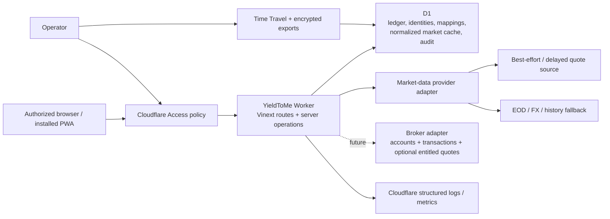
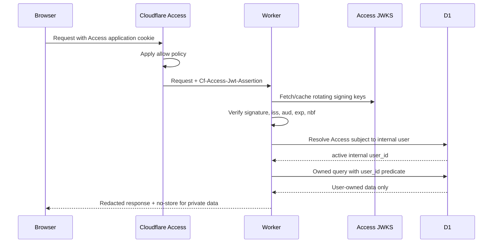

# YieldToMe architecture

Status: foundation decision  
Date: 2026-07-28

## 1. Executive decision

Build a single Cloudflare Worker application using Vinext’s Next-compatible App Router, React, and TypeScript. Use D1 as the system of record and initial normalized market-data cache. Put Cloudflare Access in front of the deployment, then validate its JWT again inside the Worker and map it to an internal user. Keep all portfolio operations server-side and owner-scoped.

Do not add R2, KV, Queues, Durable Objects, Images transformations, or an independent auth vendor in the first implementation slice. Add each only when its documented trigger occurs.

## 2. Context



Trust boundaries:

1. The browser is untrusted, including IDs and calculated values it submits.
2. Cloudflare Access is the outer gateway, not the application authorization layer.
3. The Worker is the policy and calculation boundary.
4. D1 constraints protect relational integrity but do not provide tenant row-level security.
5. Provider data is untrusted external input and may be stale, corrected, delayed, incomplete, or malformed.

## 3. Application stack

### Runtime and UI

- Vinext `0.0.50` foundation using the Next-compatible App Router.
- React `19.2` and TypeScript `5.9` in strict mode.
- Cloudflare Workers runtime and static assets.
- Server-rendered pages for initial navigation; client components only for interaction that needs browser state.
- CSS design tokens and responsive layout derived from the supplied visual style guide.
- Progressive web app metadata plus a deliberately limited service worker.

Version pins describe the scaffold date, not a perpetual latest-version promise. Dependency upgrades require build/test confirmation and a task.

Vinext is under active development and does not promise full Next.js parity. Every routing, middleware/header, Server Action, binding, and cache behavior used by this product must pass `vinext check`, the production Worker build, and a runtime smoke test. Next.js documentation alone is not proof that a feature works in this stack.

### Persistence

- Cloudflare D1 / SQLite-compatible SQL.
- Drizzle schema and migrations for type-safe application access.
- Decimal financial values stored as canonical decimal text and parsed by a decimal library when calculation work begins.
- Pure financial arithmetic, including FIFO and ledger projections, uses the exact-pinned, zero-transitive-dependency `decimal.js` `10.6.0` ESM package behind a string-only bounded domain wrapper. Its broad runtime compatibility, TypeScript declarations, half-even rounding support, and absence of native/Node-only dependencies make it suitable for the Cloudflare Worker build; direct `number` construction and parallel arithmetic engines are not exposed.
- UTC ISO-8601 instants for events; separate `local_date` and IANA timezone where market/accounting dates matter.
- Public opaque IDs (UUIDv7/ULID-style text) rather than sequential row IDs in URLs.
- User settings define a home currency. Native transaction/security facts remain native; home-currency cost/value projections and snapshots are the canonical reporting amounts.

### Server operations

- Route handlers or server actions only behind the shared authenticated request context.
- A repository/service boundary receives the derived internal `user_id`; data functions do not accept a free-form owner ID from the client.
- Financial calculations live in pure domain modules with deterministic fixtures.
- Provider adapters normalize into domain records before persistence.

## 4. Request and authorization flow



### What Cloudflare Access provides

- Authentication through configured identity providers or one-time PIN.
- Administrator-controlled allow/deny policies and session gateway.
- An application JWT containing authenticated identity claims.
- Useful coarse offboarding at the edge.

### What it does not provide

- Application registration, account recovery, profile administration, acceptance of product terms, deletion workflow, household membership, or billing.
- Row-level portfolio authorization.
- Protection against a Worker/origin that trusts spoofable headers.
- A stable application data model by email alone.

Conclusion: Access is enough for a private, administrator-invited first version. It is not enough for a public or self-service SaaS. If the product later needs public registration or organization membership, introduce an application identity/session layer behind Access or replace the outer-only model through a recorded decision.

### Identity rules

- Validate `Cf-Access-Jwt-Assertion`, not merely the cookie or email header.
- Fetch JWKS from the configured team domain and support signing-key rotation.
- Validate the application audience, configured issuer, timestamps, and `type = app`; an interactive principal also requires a non-empty subject.
- Construct the JWKS URL only from the configured Access team domain/issuer. Never follow an unverified JWT `iss` value.
- Map `(access_issuer, access_subject)` to an internal user. Email is contact/display metadata.
- Treat subject reuse/change defensively. Cloudflare documents that a subject can change if a user is removed/re-added or authenticates through a different organization.
- Reject service-token identities from interactive flows.
- After identity verification, check internal status (`active`, `disabled`, `deletion_pending`) on each session/request boundary.
- Disable and deletion-request actions revoke all active internal identities in the same bounded write as their immutable, idempotent lifecycle request and redacted audit event.

### Local development

The development identity adapter may accept an explicit local fixture only when all of these are true:

- runtime is local development;
- an opt-in `LOCAL_AUTH_USER` value is set;
- host is loopback;
- production/preview environment markers are absent.

It must fail closed in preview and production. Tests use signed fixture JWTs or a test identity object injected below the verification boundary.

### CSRF and browser security

- Prefer same-origin mutations.
- Check `Origin` and `Sec-Fetch-Site` for state-changing browser requests.
- Use POST/PATCH/DELETE with JSON/form content types; GET is read-only.
- Add a synchronizer/double-submit CSRF token if the final Access cookie policy permits cross-site credential attachment.
- Require idempotency keys for import commit, reversal, provider refresh, and deletion jobs.
- Set private pages/API responses to `Cache-Control: private, no-store`.
- Use a restrictive Content Security Policy, `frame-ancestors 'none'`, `Referrer-Policy`, MIME sniffing protection, and a permissions policy.

## 5. Tenant isolation pattern

D1 has no application row-level-security policy. Isolation is enforced by query shape, schema relationships, and tests:

- `users.id` is the internal tenant principal.
- `portfolios` contains `user_id`.
- High-risk child tables also denormalize `user_id` and use composite foreign keys such as `(portfolio_id, user_id) -> portfolios(id, user_id)`.
- Any child-to-child relationship that can influence financial results—import row to transaction, reversal to transaction, transaction to portfolio security, cash entry to transaction, lot allocation to sale/lot, receipt to transaction/cash entry—carries enough owner/portfolio columns for a composite foreign key. A service check is not a substitute where D1 can enforce the relationship.
- Owned repositories require `{ userId, resourceId }`.
- Queries join/predicate by both values in one SQL statement, avoiding a check-then-use race.
- Unique/index keys begin with `user_id` or `portfolio_id` where access patterns do.
- Audit and logs record actor and target opaque IDs, not full financial payloads.

Shared reference tables (`currencies`, `exchanges`, canonical securities) contain no user financial state. User-specific mappings, watch status, overrides, and transactions remain owned.

## 6. Domain module boundaries

```text
app/
  (public)/                 metadata/offline-safe shell
  (protected)/              authenticated portfolio routes
  api/                      narrow HTTP boundaries
domain/
  auth/                     Access verification + identity mapping
  ledger/                   transactions, cash, reversals
  lots/                     FIFO projections and matches
  market-data/              provider interfaces + normalization
  calculations/             pure decimal calculations
  imports/                  versioned parsers and staged workflow
  snapshots/                deterministic daily projections
db/
  schema.ts                 Drizzle schema
  repositories/             owner-scoped persistence
  migrations/               generated/reviewed SQL
worker/
  index.ts                  Cloudflare entry/bindings
```

This is the intended boundary, not a requirement to create empty directories now.
Add a separate dividend module only when the deferred event, actual-receipt, and forecast tasks are promoted.

## 7. Market-data architecture

The technical provider comparison, first-provider decision, cache/refresh lifecycle, FX rules, and adapter contract are normative in `MARKET_DATA_STRATEGY.md`. External provider-use matters are handled separately by the operator and create no application gate or schema.

### Capability interface

```ts
interface MarketDataProvider {
  capabilities(): ProviderCapabilities;
  searchSecurities(query: SecurityQuery): Promise<SecurityCandidate[]>;
  getDailyPrices(request: DailyPriceRequest): Promise<PriceObservation[]>;
  getLatestObservation(
    request: LatestRequest,
  ): Promise<PriceObservation | null>;
  getFxRates(request: FxRequest): Promise<FxObservation[]>;
  getDividendEvents(request: DividendRequest): Promise<DividendEventInput[]>;
  getSplitEvents(request: SplitRequest): Promise<SplitEventInput[]>;
  getFundamentals?(
    request: FundamentalRequest,
  ): Promise<FundamentalSnapshot | null>;
}
```

Adapters return normalized values and provenance, never UI-ready totals. Capabilities declare supported exchanges, history depth, delay class, adjustment support, and rate limits.

### Initial provider decision

Implement normalized observation selection first against deterministic fixtures, with best-effort/EOD/manual states. The first network adapter is a server-only Yahoo Finance-compatible best-effort source. Another provider remains optional until measured coverage, reliability, capability, or cost justifies it.

`yfinance` is a Python library and does not run in the Worker. The Worker adapter calls corresponding Yahoo Finance endpoints only from server code, with bounded requests, circuit breaking, response validation, and explicit best-effort provenance. Provider enablement is ordinary server configuration with no user-count, owner-binding, deployment-mode, monetization, redistribution, or external-use gate.

Technical alternatives as of 2026-07-28:

| Provider                 | Useful capability                                                                         | Material technical constraint                     | Decision                    |
| ------------------------ | ----------------------------------------------------------------------------------------- | ------------------------------------------------- | --------------------------- |
| Yahoo Finance-compatible | Broad international latest/daily prices, FX, dividends, and splits when endpoints respond | No SLA; endpoint and response shapes can change   | Preferred v1 adapter        |
| EODHD                    | Broad delayed/EOD/history, adjusted prices, splits/dividends, and FX                      | Requires separate adapter/fixture work            | Optional future alternative |
| Marketstack              | Global EOD and corporate actions                                                          | FX is not a complete pricing feed                 | Not sufficient alone        |
| Twelve Data              | Global series, dividends, FX, and documented ASX capability                               | Capability/rate behavior needs fixture validation | Optional future alternative |
| FMP                      | Global prices, fundamentals, FX, and dividends                                            | Fundamentals exceed core-release need             | Deferred                    |
| Alpha Vantage            | Low-volume daily global/FX and adjusted-history APIs                                      | Quota and ASX depth require measurement           | Deferred fallback candidate |

Technical behavior changes. Revalidate before implementation:

- Cloudflare Access authorization cookie: <https://developers.cloudflare.com/cloudflare-one/access-controls/applications/http-apps/authorization-cookie/>
- Cloudflare Access JWT validation: <https://developers.cloudflare.com/cloudflare-one/access-controls/applications/http-apps/authorization-cookie/validating-json/>
- yfinance project: <https://github.com/ranaroussi/yfinance>
- EODHD ASX exchange coverage: <https://eodhd.com/financial-apis/exchanges-api-list-of-tickers-and-trading-hours>
- Marketstack product documentation: <https://marketstack.com/product>
- Twelve Data ASX support: <https://support.twelvedata.com/en/articles/13001919-australian-equities-market-data>
- FMP developer documentation: <https://site.financialmodelingprep.com/developer/docs>
- Alpha Vantage support: <https://www.alphavantage.co/support/>

### Ingestion and cache

- Normalize and upsert by provider, mapping, interval, observation timestamp/date, and adjustment state.
- Keep raw payload only transiently for parsing diagnostics; persist a payload hash and selected normalized provenance. Retain raw payloads only under a bounded diagnostic policy.
- Apply provider rate limiting and bounded exponential retry with jitter.
- Cache negative lookups briefly to prevent storms.
- Manual user refresh enqueues/request-coalesces a refresh operation; it does not fan out one request per row.
- Scheduled backfill/refresh starts with Cron Triggers calling a bounded worker. Add Queues when a run cannot reliably finish within Worker execution/subrequest limits or needs durable fan-out.
- Do not store provider results in browser/service-worker caches.

The v1 adapter is one source plus manual override, not a multi-provider aggregator. Adding another provider requires measured technical need, deterministic adapter tests, and a backlog task.

### Durable job and concurrency pattern

- Persist a job before returning success for import backfill, market refresh, snapshot rebuild, export, or deletion work.
- Give each logical operation a deterministic idempotency key and at most one active job row for that key/window.
- Workers acquire a bounded lease with a conditional D1 update over status/version/lease expiry; expired leases may be reclaimed.
- Process bounded chunks, commit a high-water mark, and make every retry safe from that mark.
- Import commit reconstructs and digests the complete owner-scoped review state before a guarded `ready` → `committing` transition. It freezes mapping writes, persists only validated durable row targets with each ledger chunk, processes one chunk per invocation, and finalizes portfolio-specific rebuild jobs using actual ledger high-water transaction IDs.
- `ctx.waitUntil` may finish short logging/cache work but is not the sole durability mechanism for financially material work.
- Cron claims ready jobs and respects provider/Worker query budgets. Add Queues only after measurement shows that bounded Cron/request processing cannot meet reliability or latency.
- Concurrent recalculations use calculation version + affected range and coalesce overlapping invalidations; a stale run cannot publish a high-water mark over newer ledger facts.
- Use D1 prepared-statement batches for each bounded atomic unit. Do not assume an interactive transaction can span application round trips.
- Manual security mutations stream chronological quantity events in fixed pages, then use an ephemeral D1 check-constraint guard to assert the owner/portfolio/security transaction count and version total inside the same batch as the ledger write. This rejects concurrent oversells without trusting a bounded projection view. Client-shaped prefixes were rejected for correction retries; persisted server-issued grants bind owner, portfolio, purpose, and target and are consumed with the immutable result.
- Bound every chunk for D1’s 100 parameters per query, 2 MB row/value limit, and the Worker’s 128 MB memory limit. Free D1 permits 50 queries per invocation and paid D1 permits more, but neither removes the need for resumable chunks.
- The 10 MiB/100,000-row v1 upload contract is a Workers Paid production capability. Workers Free has a 10 ms CPU limit and cannot safely guarantee the bounded parser, normalization, hashing, and validation workload. V1 fails closed on CSV upload when configured for Free rather than silently timing out; a smaller Free import profile requires a separate measured benchmark and documented limit.

### Price selection

Selection is deterministic:

1. active user manual override for the requested instant/date;
2. approved validated best-effort/delayed observation within its applicable staleness window;
3. approved EOD observation matching adjustment mode and security mapping;
4. prior valid trading-day observation within the permitted staleness window;
5. unavailable.

The chosen observation and fallback reason are included in the calculation explanation. Compact views generally suppress timestamps and routine source/fallback labels; the explanation remains available on demand, and inline status is reserved for action-required conditions.

### Home-currency presentation

- `user_settings.home_currency_code` is the default reporting currency.
- A portfolio stores the effective reporting/home currency used by its projections so calculation versions remain reproducible.
- Security price observations and transaction amounts remain in native currency.
- Holding projections and portfolio snapshots store home-currency basis/value plus the selected FX evidence.
- The native/home menu toggle selects presentation fields only. It never mutates transactions, price observations, quantities, lots, or security currency.
- A historical/native price converted to home currency uses the FX observation selected for that price date.
- Changing home currency is an explicit rebase operation that invalidates/rebuilds derived projections and snapshots; it does not rewrite native ledger facts.

## 8. Future broker synchronization boundary

Broker sync is deferred from v1 but fits the same architecture:

```ts
interface BrokerAdapter {
  authorize(input: BrokerAuthorizationInput): Promise<BrokerConnectionGrant>;
  listAccounts(connection: BrokerConnection): Promise<BrokerAccount[]>;
  syncTransactions(request: BrokerSyncRequest): Promise<BrokerTransactionPage>;
  syncPositions(request: BrokerSyncRequest): Promise<BrokerPositionSnapshot>;
  syncCash(request: BrokerSyncRequest): Promise<BrokerCashSnapshot>;
  getEntitledQuotes?(request: BrokerQuoteRequest): Promise<PriceObservation[]>;
}
```

- `broker_connections` belongs to one internal user and stores only encrypted OAuth/token material. A Worker secret/KMS-style key encrypts credentials; plaintext never enters D1 logs, client code, CSVs, or audit metadata.
- `broker_accounts` maps an external account to one owned portfolio through a composite owner constraint.
- `broker_sync_runs` stores cursor, range, status, lease, counts, and idempotency.
- `external_record_mappings` keys each broker transaction/cash event by broker, account, external ID, and provider version. Corrections create ledger reversals/supersessions.
- Broker transactions enter the same staging/validation/reconciliation path as CSV/manual sources with `source_type = broker_sync`.
- Position snapshots are reconciliation evidence. They flag drift; they do not silently replace ledger-derived holdings.
- Broker quotes exposed by a connected account normalize through `MarketDataProvider` and remain scoped to that user/connection.
- Revoking a connection stops sync and deletes/invalidates credentials without deleting already committed ledger facts.

This boundary prevents a later broker integration from requiring a new ledger, holdings model, or UI calculation path.

## 9. Historical-data strategy

Use a hybrid of normalized observations and derived daily snapshots:

- Ledger is source of truth for quantity, cost, and cash.
- Provider daily history is fetched from the earliest relevant transaction date, cached in D1, and refreshed for corrections.
- FX history follows the same date range.
- `portfolio_daily_snapshots` stores reproducible derived totals and coverage, keyed by portfolio, local date, and calculation version.
- Snapshot rebuild rows are run-scoped; `snapshot_publications` atomically selects the completed run for each portfolio/version so retries never replace a readable series early.
- A run persists both its market-data ingestion cutoff and a bounded, canonical trading-calendar session envelope. The envelope is validity-dated, provenance/versioned, keyed by exchange/MIC, and records session close instants; historical selectors map each portfolio-local cutoff to the latest completed session and retries never consult mutable process-local calendar state.
- A ledger, mapping, corporate-action, override, or historical-data change invalidates the affected date range.
- Recent dates can recompute eagerly; long ranges recompute in bounded chunks.
- Snapshots are disposable projections. They can be rebuilt from ledger + normalized observations + calculation version.

In v1, history is a value series, not a performance claim. It is honest only from the earliest date with complete transactions/cash and sufficient market/FX data. Incomplete imported history receives a visible boundary.

## 10. Cloudflare binding decisions

### D1 — use now

System of record, normalized cache, import staging metadata/rows, projections, audit events, and job state.

### R2 — defer

Do not store original CSVs in v1. Keep file hash, metadata, normalized source rows, and validation results in D1. This minimizes sensitive-file retention. Add encrypted R2 objects only if users require downloadable originals, files exceed practical D1 row staging, or long-term encrypted D1 exports are automated. Use short object retention and per-user object keys.

### KV — defer

Not needed for correctness-sensitive data. Consider only for non-sensitive, eventually consistent configuration/reference caches after measurement. Never use it for authorization, ledgers, idempotency, or current balances.

### Queues — defer

Add for durable provider fan-out, long imports, snapshot backfills, or deletion jobs once synchronous/Cron bounded jobs no longer meet reliability limits.

### Durable Objects — defer

Only consider for strong coordination such as provider-wide rate-limit serialization or collaborative real-time state. D1 idempotency and job leases are sufficient initially.

### Images transformations — defer

The release uses public static raster/SVG assets and does not require the Cloudflare Images binding. Remove the scaffold’s custom `IMAGES` optimization path unless a later image-heavy feature, measured bandwidth need, and cost decision approve it. No generated Worker may reference an undeclared binding.

## 11. PWA and offline architecture

- Web manifest identifies the app and standalone display mode.
- Service worker caches an allowlist of public versioned icon/offline assets.
- Navigation requests use the network; on network failure they return a static offline information page.
- `/api/*`, protected HTML, uploaded content, and any response with authorization/private cache directives are never cached.
- Mutations are not queued offline.
- UI listens for online/offline changes and disables server mutations with an explanation.
- Staleness is data-specific and uses timestamps, not merely browser connectivity.

This intentionally avoids leaving private financial data in a broadly accessible Cache Storage database on a shared device.

## 12. Operational design

### Environments

- Local: local D1, explicit development identity, provider fixtures by default.
- Preview: separate Access application/policy, separate D1, sandbox provider keys, production auth validation.
- Production: least-privilege Access policy, production D1, Worker secrets, and the configured provider.

Never bind preview to production data.

The private v1 deployment may contain multiple administrator-invited users. Provider access follows normal authenticated application access and has no separate deployment mode or owner binding.

### Secrets

Worker secrets include Access team issuer/audience and provider API keys. Public environment variables contain only non-sensitive display configuration. Secret values are redacted at logging boundaries and never serialized to client components.

### Observability

Structured events:

- request/auth result and latency;
- owned resource operation outcome;
- import stage counts and failure category;
- provider request capability/status/latency/rate-limit metadata;
- price/FX coverage and staleness aggregate;
- snapshot invalidation/rebuild range;
- calculation version and error category.

Do not log transaction amounts, quantities, CSV contents, tokens, emails, API keys, or full provider payloads. Use request IDs and opaque internal IDs.

### Recovery

- D1 production Time Travel is automatic; current documentation provides up to 30 days on Workers Paid and 7 days on Free.
- Capture a Time Travel bookmark before and after production migrations.
- Encrypted D1 exports to a separate controlled store are required for retention beyond Time Travel. A documented operator-run export is sufficient initially. Automating this with R2, Workflows, or another service requires its architecture trigger and a separate approval/task.
- Quarterly restore drill: restore into a non-production database when supported by the workflow, apply/verify schema, check ownership counts and hashes, and run representative calculation fixtures.
- Target initial RPO: 24 hours for long-term export plus Time Travel for recent changes. Target RTO: 4 hours for operator-led restore. Revisit after real usage.

Sources:

- <https://developers.cloudflare.com/d1/reference/time-travel/>
- <https://developers.cloudflare.com/d1/platform/limits/>
- <https://developers.cloudflare.com/d1/sql-api/foreign-keys/>
- <https://developers.cloudflare.com/workers/platform/limits/>

### Retention

- Ledger/audit: retained while account is active; correction history retained with the fact.
- Original CSV bytes: not retained in v1.
- Normalized import rows and batch evidence: retained until account deletion, subject to a later user-configurable policy.
- Provider cache: retain only within contract; purge on provider termination as required.
- Application logs: short operational window, initially 30 days, redacted.
- Exports: encrypted, access-logged, 35-day rotating operational retention unless a regulatory/business requirement changes it.
- OPS-003A keeps temporary export artifacts inside D1: Cloudflare documents D1 AES-256-GCM encryption at rest and TLS encryption in transit. Downloaded pages rely on HTTPS; no external long-term export store or new binding/product is introduced. (<https://developers.cloudflare.com/d1/reference/data-security/>)
- Account deletion: disable immediately, offer/export if requested, then purge owned D1 rows and derived exports within the documented window; retain only legally required minimal audit tombstone.
- OPS-003B applies a 24-hour cooling-off period. Typed final confirmation
  creates one D1-first purge job bound to the immutable deletion request, its
  idempotency-key digest, and its exact completed, unexpired OPS-003A manifest.
  Validation, FK-ordered deletion, and absence checks advance in guarded
  batches of at most 100 rows/chunks; mismatch is terminal and fail-closed.
- Migration-enforced source locks reject owner-row mutations once a purge job
  exists unless the statement carries the exact live owner/job/version guard.
  This closes the gap between bounded validation requests without an
  interactive transaction. Artifact and unrelated lifecycle cleanup is also
  bounded to 100 rows per checkpoint.
- UPDATE locks authorize `OLD` and `NEW` ownership independently, preventing a
  row from moving out of a locked owner or into another locked owner. Purge
  job/guard tables are schema-classified but excluded from OPS-003A manifest
  inputs, so exports completed before the purge schema remain valid.
- Completion retains the immutable deletion intent, redacted revoked
  issuer/subject linkage for exact-key status retries, an anonymized user row,
  durable purge proof, and one payload-free audit. Provider mappings referenced
  by another scope are shared and are not modified.
- Audit ownership follows `target_owner_user_id`, not the actor. Evidence where
  the deleting actor operated on another owner remains byte-for-byte unchanged.
- Recovery is a separate operator decision before purge starts. After
  completion, Time Travel and backups remain disaster-recovery controls and
  must not selectively resurrect a purged account into production.
- OPS-003A export manifests classify every schema table as owned, user-scoped observation, shared reference, or operational (`operational-35-days`), and retain exact row/object counts. It does not purge financial rows; the verified purge workflow consumes this manifest later.
- Schema completeness excludes only D1-reserved `_cf_*` and `d1_*` namespaces. These are platform metadata rather than application data (`_cf_KV` is reserved and cannot be queried); every other non-SQLite table still fails export startup unless explicitly classified. (<https://developers.cloudflare.com/d1/best-practices/import-export-data/>)
- Export completion is a resumable `finalize` phase. Each guarded D1 checkpoint folds at most 100 ordered chunk records into a persisted SHA-256 chain; oversized source rows emit at most four 12,000-character fragments per checkpoint. This avoids an invocation-wide chunk scan or an unbounded D1 batch while retaining deterministic independent verification.
- The operational audit manifest freezes an explicit audit `rowid` high-water before finalization. Later process/download access events remain owner-attributable operational records, but are beyond that cutoff and therefore do not falsify the completed OPS-003B purge input.

## 13. Threat summary

| Threat                        | Primary controls                                                              |
| ----------------------------- | ----------------------------------------------------------------------------- |
| Spoofed Access header         | Verify JWT signature/JWKS, issuer, audience, time claims                      |
| Cross-tenant ID guessing      | Opaque IDs, composite ownership predicates/FKs, denial tests                  |
| CSRF                          | Same-origin design, Origin/Sec-Fetch checks, CSRF token as needed             |
| XSS/data exfiltration         | React escaping, CSP, no raw HTML, HttpOnly Access cookie, no SW private cache |
| CSV formula/malware payload   | Parse as data, size/type limits, escape exports, never execute content        |
| Provider poisoning/stale data | Validation, provenance, staleness, outlier flags, manual versioned override   |
| Precision drift               | Decimal strings/library, deterministic rounding, fixtures                     |
| Accidental destructive edit   | Immutable ledger, reversal, audit, idempotency, Time Travel                   |
| Secret leakage                | Worker secrets, redaction, server-only adapters, dependency review            |
| Supply-chain compromise       | Lockfile, pinned dependencies, automated audit/review, minimal packages       |

## 14. Architecture decision triggers

- Add an application auth provider when public signup, delegated invitations, organizations, or user-managed recovery is approved.
- Add R2 when original uploads or long-term encrypted exports are required.
- Add Queues when provider/import/snapshot work cannot complete reliably in bounded requests/Cron.
- Add KV only for measured, non-authoritative read caching.
- Add Durable Objects only for demonstrated strong coordination needs.
- Add Images transformations only for a measured dynamic-image requirement and approved binding/cost; static release assets do not qualify.
- Change market provider when measured coverage, accuracy, reliability, capability, or cost warrants it.
- Revisit D1 sharding/partitioning only as database size, write contention, or regional latency approaches measured limits.
- Add broker adapters only through documented OAuth/API integrations with owner-scoped encrypted connections and staged ledger reconciliation; never by screen scraping or storing broker passwords.

## 15. Architecture decision log

This log records durable architecture decisions previously maintained in `AGENTS.md`. The detailed sections above remain the normative architecture description; this log preserves the dated decision history and should be updated when future durable architecture decisions are made.

` section below into the existing file rather than overwriting it.

## Decision log

- `2026-07-28`: Vinext/Next-compatible App Router on Cloudflare Workers is the application foundation.
- `2026-07-28`: D1 is the system of record and initial cache; no R2/KV/Queues at scaffold stage.
- `2026-07-28`: Cloudflare Access is acceptable for a private, administrator-invited first release, but is not an in-app account-management system.
- `2026-07-28`: active quote views prefer the freshest validated observation allowed by the configured source, with EOD/manual fallback. Compact views generally suppress timestamps and routine source/delay/fallback labels; provenance remains inspectable and no value is called live without evidence.
- `2026-07-28`: the supplied 17-column CSV header is the complete supported import contract; fields visible only in other references are not inferred.
- `2026-07-28`: v1 uses a server-only Yahoo Finance/yfinance-compatible best-effort source at zero cost. `yfinance` itself is not used in the Worker. Endpoint stability, coverage, delay, and response-shape changes remain explicit operational risks.
- `2026-07-29`: all source-specific user-count, deployment-mode, public, paid, redistribution, owner-binding, and alternative-provider prerequisite gates are removed. External provider-use matters are handled separately by the operator. Provider enablement is ordinary server configuration; normal application authentication, privacy, provenance, and rate controls still apply.
- `2026-07-28`: the documented 10 MiB/100,000-row CSV contract and recovery objective require a Workers Paid production profile. Workers Free fails closed on CSV import unless a smaller limit is separately benchmarked and approved.
- `2026-07-28`: v1 uses public static image/PWA assets and does not approve a Cloudflare Images transformation binding. The scaffold’s undeclared `IMAGES` path is removed by FND-002A.
- `2026-07-28`: FIFO is the first cost-basis method; the stored accounting method remains explicit for future alternatives.
- `2026-07-28`: Offline v1 is a safe static shell only, not offline access to private portfolio data or offline mutations.
- `2026-07-28`: sample screens/video and the sample CSV are independent layout/schema fixtures; differences in their portfolio contents are expected and must not be reconciled or carried as product uncertainty.
- `2026-07-28`: user settings define home currency. Native ledger/market facts remain native, while holding projections/snapshots store home-currency reporting values; the native/home menu changes display only.
- `2026-07-28`: future broker sync must enter through owner-scoped encrypted connections and staged/idempotent ledger and market-data adapters; broker positions never silently overwrite holdings.
- `2026-08-03`: financial calculation primitives, FIFO allocation, and ledger projections use exact-pinned `decimal.js` `10.6.0` behind a canonical-string-only wrapper with bounded input/result precision and explicit half-even rounding boundaries; parallel arithmetic engines and JavaScript `number` are not part of the financial API.
- `2026-08-03`: Import commit is gated by an exact owner-scoped reconciliation digest and a conditional review-state transition. Mapping decisions freeze at `committing`, validated durable targets commit with bounded ledger chunks, and final rebuild requests are per affected portfolio at real ledger high-water transaction IDs.
- `2026-08-03`: Manual ledger mutations use persisted server-issued owner/portfolio/purpose/target grants for durable retries. Security quantity changes stream bounded chronological ledger pages and use an ephemeral D1 count/version assertion in the same batch as posting, so concurrent sells fail and re-evaluate without relying on a truncated projection view.
