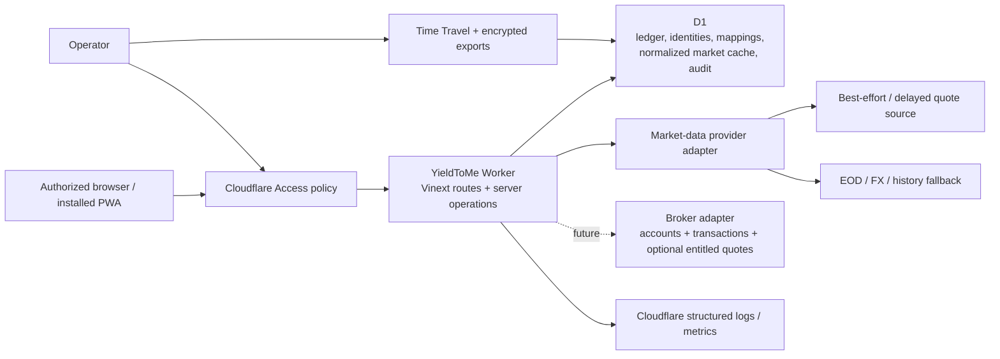
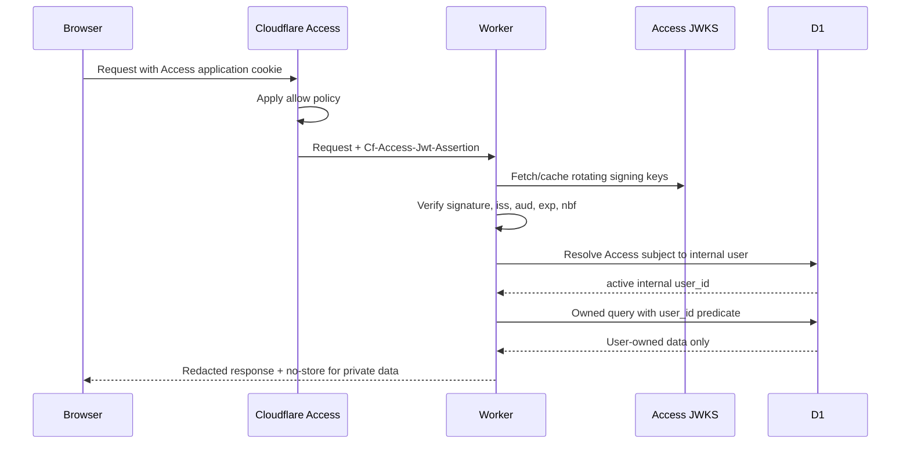

# YieldToMe architecture

Status: foundation decision  
Date: 2026-07-28

## 1. Executive decision

Build a single Cloudflare Worker application using Vinext’s Next-compatible App Router, React, and TypeScript. Use D1 as the system of record and initial normalized market-data cache. Put Cloudflare Access in front of the deployment, then validate its JWT again inside the Worker and map it to an internal user. Keep all portfolio operations server-side and owner-scoped.

Do not add R2, KV, Queues, Durable Objects, Images transformations, or an independent auth vendor in the first implementation slice. Add each only when its documented trigger occurs.

## 2. Context



Trust boundaries:

1. The browser is untrusted, including IDs and calculated values it submits.
2. Cloudflare Access is the outer gateway, not the application authorization layer.
3. The Worker is the policy and calculation boundary.
4. D1 constraints protect relational integrity but do not provide tenant row-level security.
5. Provider data is untrusted external input and may be stale, corrected, delayed, incomplete, or malformed.

## 3. Application stack

### Runtime and UI

- Vinext `0.0.50` foundation using the Next-compatible App Router.
- React `19.2` and TypeScript `5.9` in strict mode.
- Cloudflare Workers runtime and static assets.
- Server-rendered pages for initial navigation; client components only for interaction that needs browser state.
- CSS design tokens and responsive layout derived from the supplied visual style guide.
- Progressive web app metadata plus a deliberately limited service worker.

Version pins describe the scaffold date, not a perpetual latest-version promise. Dependency upgrades require build/test confirmation and a task.

Vinext is under active development and does not promise full Next.js parity. Every routing, middleware/header, Server Action, binding, and cache behavior used by this product must pass `vinext check`, the production Worker build, and a runtime smoke test. Next.js documentation alone is not proof that a feature works in this stack.

### Persistence

- Cloudflare D1 / SQLite-compatible SQL.
- Drizzle schema and migrations for type-safe application access.
- Decimal financial values stored as canonical decimal text and parsed by a decimal library when calculation work begins.
- Pure financial arithmetic, including FIFO and ledger projections, uses the exact-pinned, zero-transitive-dependency `decimal.js` `10.6.0` ESM package behind a string-only bounded domain wrapper. Its broad runtime compatibility, TypeScript declarations, half-even rounding support, and absence of native/Node-only dependencies make it suitable for the Cloudflare Worker build; direct `number` construction and parallel arithmetic engines are not exposed.
- UTC ISO-8601 instants for events; separate `local_date` and IANA timezone where market/accounting dates matter.
- Public opaque IDs (UUIDv7/ULID-style text) rather than sequential row IDs in URLs.
- User settings define a home currency. Native transaction/security facts remain native; home-currency cost/value projections and snapshots are the canonical reporting amounts.

### Server operations

- Route handlers or server actions only behind the shared authenticated request context.
- A repository/service boundary receives the derived internal `user_id`; data functions do not accept a free-form owner ID from the client.
- Financial calculations live in pure domain modules with deterministic fixtures.
- Provider adapters normalize into domain records before persistence.

## 4. Request and authorization flow



### What Cloudflare Access provides

- Authentication through configured identity providers or one-time PIN.
- Administrator-controlled allow/deny policies and session gateway.
- An application JWT containing authenticated identity claims.
- Useful coarse offboarding at the edge.

### What it does not provide

- Application registration, account recovery, profile administration, acceptance of product terms, deletion workflow, household membership, or billing.
- Row-level portfolio authorization.
- Protection against a Worker/origin that trusts spoofable headers.
- A stable application data model by email alone.

Conclusion: Access is enough for a private, administrator-invited first version. It is not enough for a public or self-service SaaS. If the product later needs public registration or organization membership, introduce an application identity/session layer behind Access or replace the outer-only model through a recorded decision.

### Identity rules

- Validate `Cf-Access-Jwt-Assertion`, not merely the cookie or email header.
- Fetch JWKS from the configured team domain and support signing-key rotation.
- Validate the application audience, configured issuer, timestamps, and `type = app`; an interactive principal also requires a non-empty subject.
- Construct the JWKS URL only from the configured Access team domain/issuer. Never follow an unverified JWT `iss` value.
- Map `(access_issuer, access_subject)` to an internal user. Email is contact/display metadata.
- Treat subject reuse/change defensively. Cloudflare documents that a subject can change if a user is removed/re-added or authenticates through a different organization.
- Reject service-token identities from interactive flows.
- After identity verification, check internal status (`active`, `disabled`, `deletion_pending`) on each session/request boundary.
- Disable and deletion-request actions revoke all active internal identities in the same bounded write as their immutable, idempotent lifecycle request and redacted audit event.

### Local development

The development identity adapter may accept an explicit local fixture only when all of these are true:

- runtime is local development;
- an opt-in `LOCAL_AUTH_USER` value is set;
- host is loopback;
- production/preview environment markers are absent.

It must fail closed in preview and production. Tests use signed fixture JWTs or a test identity object injected below the verification boundary.

### CSRF and browser security

- Prefer same-origin mutations.
- Check `Origin` and `Sec-Fetch-Site` for state-changing browser requests.
- Use POST/PATCH/DELETE with JSON/form content types; GET is read-only.
- Add a synchronizer/double-submit CSRF token if the final Access cookie policy permits cross-site credential attachment.
- Require idempotency keys for import commit, reversal, provider refresh, and deletion jobs.
- Set private pages/API responses to `Cache-Control: private, no-store`.
- Use a restrictive Content Security Policy, `frame-ancestors 'none'`, `Referrer-Policy`, MIME sniffing protection, and a permissions policy.

## 5. Tenant isolation pattern

D1 has no application row-level-security policy. Isolation is enforced by query shape, schema relationships, and tests:

- `users.id` is the internal tenant principal.
- `portfolios` contains `user_id`.
- High-risk child tables also denormalize `user_id` and use composite foreign keys such as `(portfolio_id, user_id) -> portfolios(id, user_id)`.
- Any child-to-child relationship that can influence financial results—import row to transaction, reversal to transaction, transaction to portfolio security, cash entry to transaction, lot allocation to sale/lot, receipt to transaction/cash entry—carries enough owner/portfolio columns for a composite foreign key. A service check is not a substitute where D1 can enforce the relationship.
- Owned repositories require `{ userId, resourceId }`.
- Queries join/predicate by both values in one SQL statement, avoiding a check-then-use race.
- Unique/index keys begin with `user_id` or `portfolio_id` where access patterns do.
- Audit and logs record actor and target opaque IDs, not full financial payloads.

Shared reference tables (`currencies`, `exchanges`, canonical securities) contain no user financial state. User-specific mappings, watch status, overrides, and transactions remain owned.

## 6. Domain module boundaries

```text
app/
  (public)/                 metadata/offline-safe shell
  (protected)/              authenticated portfolio routes
  api/                      narrow HTTP boundaries
domain/
  auth/                     Access verification + identity mapping
  ledger/                   transactions, cash, reversals
  lots/                     FIFO projections and matches
  market-data/              provider interfaces + normalization
  securities/               provider-identity match rule for the security master's verification write path
  calculations/             pure decimal calculations
  imports/                  versioned parsers and staged workflow
  snapshots/                deterministic daily projections
db/
  schema.ts                 Drizzle schema
  repositories/             owner-scoped persistence
  migrations/               generated/reviewed SQL
worker/
  index.ts                  Cloudflare entry/bindings
```

This is the intended boundary, not a requirement to create empty directories now.
Add a separate dividend module only when the deferred event, actual-receipt, and forecast tasks are promoted.

## 7. Market-data architecture

The technical provider comparison, first-provider decision, cache/refresh lifecycle, FX rules, and adapter contract are normative in `MARKET_DATA_STRATEGY.md`. External provider-use matters are handled separately by the operator and create no application gate or schema.

### Capability interface

```ts
interface MarketDataProvider {
  capabilities(): ProviderCapabilities;
  searchSecurities(query: SecurityQuery): Promise<SecurityCandidate[]>;
  getDailyPrices(request: DailyPriceRequest): Promise<PriceObservation[]>;
  getLatestObservation(
    request: LatestRequest,
  ): Promise<PriceObservation | null>;
  getFxRates(request: FxRequest): Promise<FxObservation[]>;
  getDividendEvents(request: DividendRequest): Promise<DividendEventInput[]>;
  getSplitEvents(request: SplitRequest): Promise<SplitEventInput[]>;
  getFundamentals?(
    request: FundamentalRequest,
  ): Promise<FundamentalSnapshot | null>;
}
```

Adapters return normalized values and provenance, never UI-ready totals. Capabilities declare supported exchanges, history depth, delay class, adjustment support, and rate limits.

### Initial provider decision

Implement normalized observation selection first against deterministic fixtures, with best-effort/EOD/manual states. The first network adapter is a server-only Yahoo Finance-compatible best-effort source. Another provider remains optional until measured coverage, reliability, capability, or cost justifies it.

`yfinance` is a Python library and does not run in the Worker. The Worker adapter calls corresponding Yahoo Finance endpoints only from server code, with bounded requests, circuit breaking, response validation, and explicit best-effort provenance. Provider enablement is ordinary server configuration with no user-count, owner-binding, deployment-mode, monetization, redistribution, or external-use gate.

Technical alternatives as of 2026-07-28:

| Provider                 | Useful capability                                                                         | Material technical constraint                     | Decision                    |
| ------------------------ | ----------------------------------------------------------------------------------------- | ------------------------------------------------- | --------------------------- |
| Yahoo Finance-compatible | Broad international latest/daily prices, FX, dividends, and splits when endpoints respond | No SLA; endpoint and response shapes can change   | Preferred v1 adapter        |
| EODHD                    | Broad delayed/EOD/history, adjusted prices, splits/dividends, and FX                      | Requires separate adapter/fixture work            | Optional future alternative |
| Marketstack              | Global EOD and corporate actions                                                          | FX is not a complete pricing feed                 | Not sufficient alone        |
| Twelve Data              | Global series, dividends, FX, and documented ASX capability                               | Capability/rate behavior needs fixture validation | Optional future alternative |
| FMP                      | Global prices, fundamentals, FX, and dividends                                            | Fundamentals exceed core-release need             | Deferred                    |
| Alpha Vantage            | Low-volume daily global/FX and adjusted-history APIs                                      | Quota and ASX depth require measurement           | Deferred fallback candidate |

Technical behavior changes. Revalidate before implementation:

- Cloudflare Access authorization cookie: <https://developers.cloudflare.com/cloudflare-one/access-controls/applications/http-apps/authorization-cookie/>
- Cloudflare Access JWT validation: <https://developers.cloudflare.com/cloudflare-one/access-controls/applications/http-apps/authorization-cookie/validating-json/>
- yfinance project: <https://github.com/ranaroussi/yfinance>
- EODHD ASX exchange coverage: <https://eodhd.com/financial-apis/exchanges-api-list-of-tickers-and-trading-hours>
- Marketstack product documentation: <https://marketstack.com/product>
- Twelve Data ASX support: <https://support.twelvedata.com/en/articles/13001919-australian-equities-market-data>
- FMP developer documentation: <https://site.financialmodelingprep.com/developer/docs>
- Alpha Vantage support: <https://www.alphavantage.co/support/>

### Ingestion and cache

- Normalize and upsert by provider, mapping, interval, observation timestamp/date, and adjustment state.
- Keep raw payload only transiently for parsing diagnostics; persist a payload hash and selected normalized provenance. Retain raw payloads only under a bounded diagnostic policy.
- Apply provider rate limiting and bounded exponential retry with jitter.
- Cache negative lookups briefly to prevent storms.
- Manual user refresh enqueues/request-coalesces a refresh operation; it does not fan out one request per row.
- Scheduled backfill/refresh starts with Cron Triggers calling a bounded worker. Add Queues when a run cannot reliably finish within Worker execution/subrequest limits or needs durable fan-out.
- Do not store provider results in browser/service-worker caches.

The v1 adapter is one source plus manual override, not a multi-provider aggregator. Adding another provider requires measured technical need, deterministic adapter tests, and a backlog task.

### Durable job and concurrency pattern

- Persist a job before returning success for import backfill, market refresh, snapshot rebuild, export, or deletion work.
- Give each logical operation a deterministic idempotency key and at most one active job row for that key/window.
- Workers acquire a bounded lease with a conditional D1 update over status/version/lease expiry; expired leases may be reclaimed.
- Process bounded chunks, commit a high-water mark, and make every retry safe from that mark.
- Import commit reconstructs and digests the complete owner-scoped review state before a guarded `ready` → `committing` transition. It freezes mapping writes, persists only validated durable row targets with each ledger chunk, processes one chunk per invocation, and finalizes portfolio-specific rebuild jobs using actual ledger high-water transaction IDs.
- `ctx.waitUntil` may finish short logging/cache work but is not the sole durability mechanism for financially material work.
- Cron claims ready jobs and respects provider/Worker query budgets. Add Queues only after measurement shows that bounded Cron/request processing cannot meet reliability or latency.
- Concurrent recalculations use calculation version + affected range and coalesce overlapping invalidations; a stale run cannot publish a high-water mark over newer ledger facts.
- Use D1 prepared-statement batches for each bounded atomic unit. Do not assume an interactive transaction can span application round trips.
- Manual security mutations stream chronological quantity events in fixed pages, then use an ephemeral D1 check-constraint guard to assert the owner/portfolio/security transaction count and version total inside the same batch as the ledger write. This rejects concurrent oversells without trusting a bounded projection view. Client-shaped prefixes were rejected for correction retries; persisted server-issued grants bind owner, portfolio, purpose, and target and are consumed with the immutable result.
- Bound every chunk for D1’s 100 parameters per query, 2 MB row/value limit, and the Worker’s 128 MB memory limit. Free D1 permits 50 queries per invocation and paid D1 permits more, but neither removes the need for resumable chunks.
- The 10 MiB/100,000-row v1 upload contract is a Workers Paid production capability. Workers Free has a 10 ms CPU limit and cannot safely guarantee the bounded parser, normalization, hashing, and validation workload. V1 fails closed on CSV upload when configured for Free rather than silently timing out; a smaller Free import profile requires a separate measured benchmark and documented limit.

### Price selection

Selection is deterministic:

1. active user manual override for the requested instant/date;
2. approved validated best-effort/delayed observation within its applicable staleness window;
3. approved EOD observation matching adjustment mode and security mapping;
4. prior valid trading-day observation within the permitted staleness window;
5. unavailable.

The chosen observation and fallback reason are included in the calculation explanation. Compact views generally suppress timestamps and routine source/fallback labels; the explanation remains available on demand, and inline status is reserved for action-required conditions.

### Security-master verification write path

IMP-004B added the first owner-triggered production write into the shared `securities` master. An owner-facing action (`app/security-verification-service.ts`, gated by the same CSRF/owner-scoping pattern as every other mutation route) re-derives the requested symbol/exchange/currency from the server's own current, database-backed import preview -- never trusting client-supplied fields -- calls the configured `MarketDataProvider`'s `searchSecurities`, and only publishes when exactly one result agrees on currency (and exchange, when supplied). Publication is creation-only and atomic (`db/repositories/security-verification.ts`): it never mutates an existing canonical row, and a concurrent verification of the same provider identity is resolved by re-reading after the attempt rather than by holding a lock. See `docs/MARKET_DATA_STRATEGY.md` §9 for the ingestion-lifecycle steps this fills in and `docs/DATA_MODEL.md` §4/§11 for the schema and atomic-write technique.

### Home-currency presentation

- `user_settings.home_currency_code` is the default reporting currency.
- A portfolio stores the effective reporting/home currency used by its projections so calculation versions remain reproducible.
- Security price observations and transaction amounts remain in native currency.
- Holding projections and portfolio snapshots store home-currency basis/value plus the selected FX evidence.
- The native/home menu toggle selects presentation fields only. It never mutates transactions, price observations, quantities, lots, or security currency.
- A historical/native price converted to home currency uses the FX observation selected for that price date.
- Changing home currency is an explicit rebase operation that invalidates/rebuilds derived projections and snapshots; it does not rewrite native ledger facts.

## 8. Future broker synchronization boundary

Broker sync is deferred from v1 but fits the same architecture:

```ts
interface BrokerAdapter {
  authorize(input: BrokerAuthorizationInput): Promise<BrokerConnectionGrant>;
  listAccounts(connection: BrokerConnection): Promise<BrokerAccount[]>;
  syncTransactions(request: BrokerSyncRequest): Promise<BrokerTransactionPage>;
  syncPositions(request: BrokerSyncRequest): Promise<BrokerPositionSnapshot>;
  syncCash(request: BrokerSyncRequest): Promise<BrokerCashSnapshot>;
  getEntitledQuotes?(request: BrokerQuoteRequest): Promise<PriceObservation[]>;
}
```

- `broker_connections` belongs to one internal user and stores only encrypted OAuth/token material. A Worker secret/KMS-style key encrypts credentials; plaintext never enters D1 logs, client code, CSVs, or audit metadata.
- `broker_accounts` maps an external account to one owned portfolio through a composite owner constraint.
- `broker_sync_runs` stores cursor, range, status, lease, counts, and idempotency.
- `external_record_mappings` keys each broker transaction/cash event by broker, account, external ID, and provider version. Corrections create ledger reversals/supersessions.
- Broker transactions enter the same staging/validation/reconciliation path as CSV/manual sources with `source_type = broker_sync`.
- Position snapshots are reconciliation evidence. They flag drift; they do not silently replace ledger-derived holdings.
- Broker quotes exposed by a connected account normalize through `MarketDataProvider` and remain scoped to that user/connection.
- Revoking a connection stops sync and deletes/invalidates credentials without deleting already committed ledger facts.

This boundary prevents a later broker integration from requiring a new ledger, holdings model, or UI calculation path.

### 8.1 SPK-003 spike: candidate archetype, contract, and rejected alternatives

`SPK-003` validated this boundary with a concrete, promotion-ready contract before any broker-specific dependency, network call, or credential store was introduced. `domain/broker-sync/` holds the result: `contracts.ts` (adapter/record/mapping types), `reconciliation-plan.ts` (pure idempotency, correction, and position-drift planning functions with no ledger write), `redaction.ts` (defensive payload redaction), and `fixtures.ts` (sanitized static fixtures and a fixture `BrokerAdapter` implementation). Its contract test suite is `tests/spk-003.test.ts`.

**Broker candidate — assumption, not observation.** No routed product evidence (`docs/CONSOLIDATED_PRODUCT_SPEC.md`, `docs/REQUIREMENTS_AND_ACCEPTANCE_CRITERIA.md`, `docs/source-evidence/`) names a specific broker; `docs/source-evidence/04_VIDEO_UNKNOWNS_AND_REBUILD_PLAN.md:970` only lists "Brokerage integrations and automatic trade ingestion" as an unscoped future capability. The spike therefore defines a **generic archetype, marked explicitly as an assumption**: an AU CHESS-sponsored, OAuth-capable retail broker, chosen for consistency with the AUD/ASX-only holdings in `docs/Example_Portfolio.csv` (e.g. `IXJ.AX`, `WHC.AX`, all `Currency = AUD`, `Exchange = ASX`). The fixture provider code `au-chess-oauth-generic` (`domain/broker-sync/fixtures.ts`) is invented test data, not a real provider identifier, and must not be read as a vendor selection. Selecting an actual broker/API requires its own future task with the vendor's real API/OAuth documentation, rate limits, and entitlement terms.

**Contract decisions:**

- Token material is modelled only as `TokenEnvelopeRef` — an opaque `envelopeId` plus expiry/status. No contract type anywhere in `domain/broker-sync/` can hold a raw token/secret value, so there is nothing for an adapter implementation to accidentally log; `redactBrokerPayload` is a secondary, belt-and-braces guard for any raw upstream payload an adapter might otherwise pass through verbatim.
- Idempotent staging plans one of eight effects per broker record (`create`, `skip_duplicate`, `skip_stale_version`, `skip_deleted_unseen`, `skip_reversed_history`, `reverse_and_replace`, `reverse_only`, `deny_cross_user`). Persisted mapping rows are unique per the documented 6-tuple `(userId, providerCode, brokerAccountId, externalType, externalId, externalVersion)` (`docs/DATA_MODEL.md` §8) — one row per reported version, kept for audit history — but the planner looks up the 5-tuple WITHOUT `externalVersion` and resolves it to the single currently-`active` row (never by array order, which an unordered D1 `SELECT` cannot guarantee), then compares the incoming record's version against it numerically. A version at or below the active version is always a no-op (`skip_duplicate` if equal, `skip_stale_version` if older — covers both an exact cursor-page replay and a cursor restart re-serving an already-superseded page); only a strictly newer version can plan `reverse_and_replace` (never an in-place rewrite of ledger facts) or, for a deletion, `reverse_only`. A `reverse_only` leaves every mapping row for that identity `"reversed"` — never `"active"` — so a group with history but no active row always means "already fully reversed," never "never seen"; the planner then compares against that group's highest known version regardless of row status, planning `skip_reversed_history` at or below it and only allowing a fresh `create` (a genuine broker re-issue) strictly above it. Only a truly empty group plans `skip_deleted_unseen`/`create` as genuinely unseen. See §8.1's data-model note and `docs/DATA_MODEL.md` §8.1 for the full idempotency-key and persistence-invariant rationale.
- Position reconciliation (`planPositionReconciliation`) only ever produces a drift report (`match` | `drift` | `broker_only` | `ledger_only` | `unresolved_security` | `unparseable_quantity`), using the same exact-decimal comparison as the rest of the codebase (`domain/calculations/decimal.ts`) rather than string equality, so differently-formatted equal quantities never report a false drift. A broker position whose security hasn't been resolved to an internal ID is never silently dropped; it always contributes a flagged `unresolved_security` entry. A non-canonical adapter-boundary quantity string (`""`, `"N/A"`, exponent notation, thousands separators) is flagged `unparseable_quantity` instead of throwing and losing the whole report. No code path in this module can emit a ledger mutation from a position snapshot.
- Account-mapping ownership (`validateBrokerAccountMapping`) treats the caller-supplied `actingUserId` as the only trusted owner and independently checks the connection, account, and portfolio against it plus the account/connection relationship, so a cross-user row is denied even if a caller mistakenly hands it mismatched records. The same check rejects a revoked or expired connection, so disconnection takes effect at the validation layer.
- Optional quotes reuse `PriceObservation`/`MarketDataProvider` from `domain/market-data/contracts.ts` rather than a parallel quote shape, satisfying the BRK-001 requirement that broker-supplied quotes enter through the existing market-data abstraction with entitlement/provenance.

**Rejected alternatives:**

- _Direct positions-as-source-of-truth sync_ (broker position snapshot overwrites `portfolio_securities`/holdings directly) — rejected because it would let an unvalidated or stale broker feed silently rewrite ledger-derived truth, contradicting the immutable-ledger and reconciliation-only rules in `AGENTS.md` and BRK-001's acceptance criteria.
- _Broker password/screen-scraping adapter_ — rejected outright; BRK-001 and `AGENTS.md` require a documented OAuth/API integration with encrypted, owner-scoped connections.
- _Storing raw token values in the contract/fixture types "for now, encrypt later"_ — rejected; modelling only a `TokenEnvelopeRef` reference from the start removes an entire class of accidental-leak defects (fixtures, test snapshots, error payloads) rather than relying on discipline to redact them later.
- _A parallel broker-specific FIFO/valuation engine_ — rejected; reconciliation planning here is intentionally shallow (quantity comparison only) and must call into the existing ledger/FIFO/valuation code once promoted, not duplicate it.
- _Generic multi-broker abstraction layer up front_ — rejected for this spike; one archetype is enough to validate the boundary, and a second broker is a documented future decision (`docs/IMPLEMENTATION_PLAN.md` §10), not a default.

See `docs/SPK-003_THREAT_MODEL.md` for the security threat model and `docs/DATA_MODEL.md` §8 for the data-model extension this contract assumes.

### 8.2 BRK-003: Sharesight GET-only client foundation

`BRK-002` selected **Sharesight** (User API v3) as the real broker/portfolio-tracker candidate, replacing the SPK-003 generic archetype above for implementation purposes (SPK-003's contract/reconciliation-plan/redaction code still applies unmodified once promoted). Sharesight holds the owner's tax data and its API is read-write with **no granular OAuth scopes** — a client-credentials token is valid for both read and write endpoints. Read-only therefore cannot be enforced by requesting a narrower scope; it must be enforced structurally, in code. `BRK-003` (`domain/sharesight/`) is that structural layer, built before any schema, sync, or live-access work.

**Read-only rule, enforced structurally, not by convention:**

- `domain/sharesight/transport.ts` exports exactly one request primitive, `sharesightGet`, and it has no `method` parameter — GET is hard-coded into the call it makes. There is no generic `request(method, ...)` export anywhere in `domain/sharesight/` or its barrel; that surface must not exist — a test scans every module's actual exports for a non-GET-shaped name (`post|put|patch|delete|request`, case-insensitive) so this stays true even if a future change adds an export. Because `RequestInit["method"]` can still be smuggled past the type system (a widened/`as any` cast), `sharesightGet` also defensively inspects its `init` argument at runtime and throws `SharesightNonGetAttemptError` — synchronously, before `fetcher` is ever invoked — if a `method` key is present at all, regardless of its value. The same check rejects method-override-shaped headers (`X-HTTP-Method-Override`, `X-Method-Override`, `_method`, case-insensitive) before sending, since several HTTP frameworks/proxies treat one of these as "run this request as a different method." `sharesightGet` itself is package-internal: `domain/sharesight/index.ts`'s barrel does not re-export it (or `SharesightNonGetAttemptError`), since it takes a caller-controlled URL with no host pin of its own — `createSharesightClient` (via `createSharesightTokenProvider`) is the sole public entry point, and the barrel's exact export-name set is pinned by a test so any future addition is a conscious, reviewed change. The seal is now ALSO lint-enforced — `eslint.config.mjs`'s `no-restricted-imports` rule bars importing `domain/sharesight/transport` from anywhere outside `domain/sharesight/` itself and `tests/brk-003.test.ts` — though that rule only inspects static `import`/`export … from` specifiers, not a dynamic `import()` call, a gap recorded as a `BRK-004` carry-over rather than closed here.
- `domain/sharesight/client.ts` (the data client: `listPortfolios`, `getPortfolioHoldings`, `listTrades`, `listPayouts`) only ever reaches Sharesight through `sharesightGet`. It never imports or holds anything capable of sending a POST. Its `baseUrl` host is pinned to `api.sharesight.com` at client creation (throwing `SharesightBaseUrlRejectedError`, before any request can be sent, on any other host) so a misconfigured `baseUrl` can't ship the Bearer token to an arbitrary host; overriding the pin requires an explicit `unsafeAllowOtherHost` flag documented as BRK-008 spike/mock-tooling only. If a structural GET-only rejection is ever thrown from within the request path, the client maps it to its own `non_get_rejected` error kind — never folds it into `timeout`.
- `tests/brk-003.test.ts` proves this is structural, not just documented: attempting any non-GET request through the module's surface fails the suite, and the fetch mock is asserted to never be called on a rejected attempt.

**The token-endpoint exception, and why it's safe:**

- OAuth 2.0 client-credentials token acquisition (`domain/sharesight/token.ts`) is a POST — the SOLE non-GET request this package ever issues. It is auth infrastructure (Sharesight's OAuth token endpoint), not the Sharesight data API, so it does not violate the read-only rule; it is the mechanism by which the data client obtains a credential to make GET requests at all. It is never exported (a stronger guarantee than exporting-and-documenting it), so `client.ts` only ever consumes a `SharesightTokenProvider.getAccessToken()` result (a string), never a reference to `token.ts`'s internal fetcher or POST function.
- **The real safety control is SHAPE validation, not URL-equality pinning.** A configured `tokenUrl` is validated exactly once, at `createSharesightTokenProvider` creation, by `validateSharesightTokenUrlShape`:
  - it must use `https:` (an `http:` exception exists only for a loopback host — `127.0.0.1`/`localhost`/`::1` — reserved for future BRK-008 local mock tooling; a non-loopback host must never send credentials in cleartext);
  - it must not carry userinfo (username/password) components — never permitted, even to a loopback host, since credentials belong solely in the client-credentials POST body, never embedded in the URL (BRK-003 review finding F10; the data client's `baseUrl` is checked the same way, unconditionally, in `client.ts`);
  - its hostname must be `sharesight.com` or a subdomain of it, matched by exact-label suffix (the full `sharesight.com` label pair as either the whole hostname or preceded by a `.`) — not a bare substring check, which a confusable host like `evilsharesight.com` or `api.sharesight.com.evil.com` would pass — unless the host is loopback (the http exception above) or the caller explicitly set `unsafeAllowOtherHost` (BRK-008 spike tooling only; mirrors the data client's `unsafeAllowOtherHost` for `baseUrl`) (BRK-003 review finding F8);
  - its path, after being lowercased and percent-decoded once up front (BRK-003 review finding F9 — otherwise an uppercase `/API/v3/...` or percent-encoded `/api%2Fv3/...` variant could evade the next check; a malformed percent-escape rejects cleanly rather than throwing uncaught), must NOT contain `/api/` (the data-API shape);
  - and must end with `/oauth2/token` or contain `/oauth` (the token-endpoint shape).

  Any violation throws `SharesightTokenUrlRejectedError` synchronously, before the provider object — and therefore its fetcher — even exists, so no request can ever be sent against a misconfigured endpoint. (An earlier version of this control only compared a candidate URL against itself, which a review found tautological — it could never reject anything, including a `tokenUrl` pointed straight at Sharesight's data API. `assertSharesightTokenUrl` remains as a separate, secondary consistency pin — it guarantees every POST targets the exact URL object that already passed shape validation, rather than one reconstructed on the fly — but it is not itself a shape check.) The request is also sent with `redirect: "manual"` so a 3xx response is treated as a typed error rather than silently followed to a different host.

- **BRK-008 diagnostic exception to "never read a body":** on a non-2xx TOKEN endpoint response only (never the data client), `token.ts`'s `readOAuthErrorCode` reads at most 4KB of the body, tolerating any non-JSON/oversized/unreadable body by returning nothing, and surfaces only a top-level `error` value that exactly matches the closed RFC 6749 §5.2 allowlist (`SharesightError.oauthErrorCode`) — everything else, including `error_description` (which can reflect request data such as an echoed-back code or secret), is discarded unread, so distinguishing `invalid_client` from `invalid_grant` never reopens the module's leak discipline.

- **Token endpoint URL is unverified.** BRK-002's decision cites `portfolio.sharesight.com/api/3/authentication_flow` and `/api/3/configuring_oauth` as the v3 OAuth sources, but implementation had no live network access to re-confirm the exact token URL from those docs. `DEFAULT_SHARESIGHT_TOKEN_URL` (`https://api.sharesight.com/oauth2/token`) is the owner task's stated best-known value and is therefore fully configurable via `tokenUrl` so `BRK-008`'s live spike can correct it without a code change (any replacement must still pass `validateSharesightTokenUrlShape`).
- Access tokens expire after 30 minutes (BRK-002); `createSharesightTokenProvider` refreshes before expiry using an injected clock (epoch-millisecond `now`, this repo's injectable-clock convention adapted for expiry arithmetic) rather than wall-clock time, so refresh timing is deterministic in tests. A refresh failure returns a typed unavailable result and no data GET is ever attempted.

**No account-level write barrier — this module is the sole protection.** BRK-002's original design authenticated the app as a separate, free, read-only-shared guest Sharesight account, so even a bypass of this module's GET-only enforcement would still hit a second, independent control (Sharesight itself rejecting a write against the guest account's read-only share). That plan changed: the owner now authenticates via their **main, paid Sharesight account's** own client credentials — a credentials-grant that Sharesight will honor for read AND write, with no read-only share to fall back on. There is consequently no account-level write barrier at Sharesight's end at all; `domain/sharesight/`'s structural GET-only enforcement, plus the token-endpoint host/shape/userinfo checks above (F8/F9/F10) and the data client's `baseUrl` host pin (F6), are the **entire** defense for the owner's tax data, not one layer of two. This makes correctness of this module — not defense-in-depth from the account type — the load-bearing control, and is why BRK-003's review follow-ups were treated as mandatory before live credentials are used rather than deferred as polish.

**Secrets/evidence discipline:** client ID/secret are constructor-only options (a caller passes Worker env/secrets — `domain/sharesight/` never reads them from a client-supplied value); no thrown or returned value from this module (token errors, data errors, or the smuggled-method rejection) ever contains a credential, token, or raw response body — `tests/brk-003.test.ts` greps every such value for the fixture secret/token as a regression check. Fetch evidence follows the MKT-002 `payloadSha256` convention (a hash of the response body plus an ingestion timestamp, via an optional `onFetchEvidence` hook) rather than logging or persisting the body itself; durable evidence storage is out of scope here (tokens are held in-memory per invocation) and is `BRK-004`'s concern.

**Parsing discipline — absent vs malformed:** `domain/sharesight/parse.ts`'s `optionalDecimal` distinguishes a genuinely absent/null optional money field (an honest `null` "unknown") from one that is PRESENT but fails to parse as a decimal. The latter fails the whole item closed (`invalid_response`), never silently collapsing to the same `null` "unknown" state, because several of these optional fields (franked/unfranked payout amounts, withheld tax) feed downstream tax assumptions — a silently-dropped corrupt value there would be worse than an explicit failure. The same absent-vs-malformed discipline now also covers optional STRING fields (`optionalStringField`), used by `listPortfolios` and (as of the 2026-08-15 live pass below) trades parsing. Whether decimal-from-number conversion can ever produce exponential notation for a realistic money/quantity magnitude was an open question at this point — resolved below.

**BRK-008 live shape evidence — `listPortfolios` (2026-08-15).** A live call against the owner's real Sharesight account confirmed the `portfolios` envelope item shape (key names/types only; no field values retained — see the shape-evidence privacy contract below). `id` is a numeric integer (not a string as BRK-003 had assumed) — this resolves the former `TODO(BRK-008)` id-shape assumption for portfolios only; `parse.ts`'s `requiredIntegerIdDecimalString` normalizes it to a canonical decimal string via `String(value)` (exact for any non-negative safe integer, per this repo's decimal-string discipline), rejecting non-integer, negative, non-finite, or unsafe (beyond `Number.MAX_SAFE_INTEGER`) values. `name` and `currency_code` (ISO 4217-shaped, exactly 3 uppercase letters) are the other two REQUIRED fields. Eight further fields the live response carries are OPTIONAL and modelled on `SharesightPortfolio` (`inception_date`, `tz_name`, `access_level`, `financial_year_end`, `cg_discount`, `country_code`, `owner_name`, `tax_entity_type`): present-but-null and genuinely-absent both parse as `null`; a present-but-wrong-type value fails the whole item closed, mirroring the optional-decimal discipline above. `cg_discount` is deliberately treated as an OPAQUE string, never interpreted as a number or percentage. Remaining live fields this contract does not model (`consolidated`, `default_sale_allocation_method`, `disable_automatic_transactions`, `external_identifier`, `holding_id`, `interest_method`, `payout_sync_cash_account_id`, `rwtr_rate`, `trader`, `trade_sync_cash_account_id`, `user_id`) are ignored for forward-compatibility, not validated or retained.

**BRK-008 live shape evidence — holdings/trades (2026-08-15); payouts endpoint fix pending re-confirmation.** A further live pass against the owner's real account (18 holdings, 107 trades) confirmed those two endpoints' shapes and resolved the former `TODO(BRK-008)` exponent-notation question. Payouts is NOT part of this confirmed evidence — its live call returned a non-JSON body (see below); its endpoint path is corrected here, but its shape remains unobserved pending a re-run against the corrected path.

- **Exact double round-trip, exponent notation rejected (resolves the exponent TODO).** Sharesight emits money/quantity fields as JSON floats. `parse.ts`'s `decimalString` converts via `String(value)`, which ECMA-262 guarantees is the shortest string that round-trips back to the exact same double — so this never fabricates precision the wire didn't carry. The one output `String()` can produce that is not a valid decimal string is exponential notation for a very large/small magnitude (e.g. `"1e+21"`); that is now REJECTED (`null`, fail-closed) rather than reformatted, since reformatting would itself invent a representation Sharesight never sent. `NaN`/`Infinity` are rejected the same way. Net effect: our precision is bounded by exactly what Sharesight's own float emission carries on the wire — we preserve it exactly, we never extend or reformat it.
- **Instrument resolution keys corrected — CONFIRMED for holdings/trades, INFERRED (not yet observed) for payouts.** The nested `instrument` object's keys are `code`, `market_code`, `currency_code` — not `market`/`currency` as BRK-003 originally assumed. This is live-confirmed for holdings and trades. `parse.ts`'s `instrumentFields` is shared code, so all three keys are now REQUIRED there too (payouts has never returned a parseable body, live or otherwise — see below) — this is an INFERENCE that payouts' `instrument` sub-object is shaped the same as the other two endpoints', not an observation, and is explicitly expected to either parse correctly or fail closed with a shape diagnostic once the corrected payouts path is re-run; either outcome is treated as the intended next step, not a bug.
- **Holdings (`HoldingPortfolioList`, confirmed v3-native, no format suffix — `/portfolios/:id/holdings`).** `id` (numeric, portfolios technique) and a top-level `symbol` field are REQUIRED, alongside the instrument resolution keys. `quantity`/`average_cost`/`market_value` are all OPTIONAL — the confirmed live response carries **no quantity or value field at all** on this endpoint (an honest finding, not an oversight): `SharesightHolding.quantityDecimal` is `string | null`, matching `averageCostDecimal`/`marketValueDecimal`. `BRK-005` scoping must account for this: holding quantity is not available from this endpoint and will need to come from trades reconciliation or a different endpoint/params combination.
- **Trades.** `id` is numeric (like portfolios/holdings, not the string BRK-003 assumed). REQUIRED: `id`, `transaction_date`, `quantity`, `price`, `holding_id`, `portfolio_id` (both numeric, normalized the same way as `id`). The trade's own `portfolio_id` is validated for presence, shape, AND equality against the caller-supplied `portfolioId` this fetch was scoped to — a mismatch fails the whole item closed (envelope fail-close convention), never silently re-attributing a mis-scoped record to the queried portfolio, which would otherwise be a provenance lie downstream. `value` is nullable-tolerant (an optional decimal, not required) since other fields on the same live item (`paid_on`, `market_price`) are confirmed null, and a hard requirement risked failing real trades closed unnecessarily. `transaction_type` is now OPTIONAL — the live item's first record did not carry it at all; absent is an honest `null`, while a present-but-unrecognized value (outside `buy`/`sell`/`other`) still fails the item closed (absent-vs-malformed discipline). New optional fields modelled: `brokerage_currency_code`, `exchange_rate`(_pair), `state`, `unique_identifier`, `paid_on`, `description_code`, `source_category`. **RESTATED below (item #46/107, same-day third pass): `quantityDecimal`/`valueDecimal` are now both parsed SIGNED (`allowNegative: true`), not non-negative as originally stated here — but only `valueDecimal`'s signedness is LIVE-CONFIRMED; `quantityDecimal`'s is an inference pending confirmation** — see that entry for the evidence and for why the "no recoverable direction" claim in this paragraph still holds for `quantity` alone, even though `value`'s sign now supplies a confirmed direction signal.
- **Payouts endpoint path corrected (superseded below — the `.json` suffix was right, the API VERSION was not).** The live `listPayouts` call returned `invalid_response` with **no** shape diagnostic. At the time, this was attributed to a body that was not valid JSON at all (the un-suffixed `/portfolios/:id/payouts` path returning something other than JSON) — **that attribution was an INFERENCE, not a directly observed fact**: no diagnostic of any kind fired at the time, so nothing actually confirmed WHY the response failed to parse (see the 2026-08-15 follow-up below, which found a second, equally-plausible mechanism that produces the identical symptom). A third-party Rust client generated from Sharesight's published Swagger/API documentation (`markcatley/sharesight.rs`) was read at the time as documenting the portfolio-payouts endpoint at `/portfolios/:portfolio_id/payouts.json`; `client.ts` at this point requested that path against the `v3` prefix — this reading turned out to be incomplete (it missed the endpoint's documented API VERSION), corrected below. The path suffix itself was correct; what was still wrong — found by the same-day third pass below — was requesting it under `v3` at all, when the route only ever existed under `v2`. The payout field contract itself (`SharesightPayout`) is deliberately left AS-IS pending confirmation against a real response on the corrected version — it will either parse or, if the assumed shape is wrong, fail closed with a shape diagnostic on the next run, which is the intended outcome either way.
- **`onBodyParseDiagnostic` (introduced 2026-08-15, extended 2026-08-15 follow-up below).** The `listPayouts` symptom above — invalid_response with zero diagnostic evidence — is a distinct failure class from a parsed-but-invalid domain shape (`onShapeEvidence` only fires when there IS parsed JSON to derive a shape from). `client.ts` originally exposed `onBodyParseDiagnostic` fired ONLY from the `JSON.parse` failure branch (a body read successfully but did not parse as JSON at all). The follow-up below found and closed a second, previously diagnostic-less branch that produces the exact same symptom.

**BRK-008 follow-up (2026-08-15, same day): the `listPayouts` symptom's confirmed root cause, and closing the diagnostic gap.** A repeat live pass against the corrected `.json`-suffixed payouts path still returned `invalid_response` with NEITHER diagnostic firing (`onShapeEvidence` above, nor the original `onBodyParseDiagnostic`) — this is the fact this follow-up actually confirmed, as distinct from the still-unconfirmed original inference above. Root-cause investigation of `client.ts`'s `getJson` found the real gap: the `!response.ok` branch (ANY non-2xx HTTP status — 400/404/406/etc., not only the specific statuses already mapped to `authentication`/`entitlement`/`rate_limit`/`transient_upstream`) returned its typed `invalid_response` result WITHOUT reading the body or invoking any diagnostic callback at all — a structural gap independent of, and never exercised by, either `onShapeEvidence` (which requires parsed JSON) or the original `onBodyParseDiagnostic` (which only fired from the `JSON.parse`-throw branch, itself only reachable on a 2xx response). This is a confirmed structural fact about the pre-follow-up code, not an inference about what Sharesight actually returned for payouts specifically — the live payload itself (JSON with an unexpected shape, non-JSON, or a non-2xx status entirely) remains unobserved.

Three changes close this gap:

- **`onBodyParseDiagnostic` now also fires from the `!response.ok` branch**, for every non-2xx status, not only the `JSON.parse`-throw branch. On this branch, `bodyParseable: false` means "the response never reached JSON parsing at all because its HTTP status disqualified it" — a different reason than on the `JSON.parse`-throw branch, where a body WAS handed to `JSON.parse`, which then threw. The field's shape is identical (`bodyParseable` is always the literal `false`) but callers should not read it as "we attempted and failed to parse JSON" universally; it means "no usable JSON reached the domain parser," for either reason.
- **`SharesightBodyParseDiagnostic` gained a `redirected: boolean` field** (`Response.redirected`) on both firing branches, so a request whose URL 302's to an HTML login/error page — landing on either a non-2xx final status or a 2xx HTML body — is distinguishable from a direct non-2xx/non-JSON response with no redirect involved.
- **Review fix (B1): the non-2xx body read is opt-in, bounded, and independently timed.** An initial version of this fix read the full non-2xx body unconditionally (to size `bodyBytes`) whenever ANY caller reached this branch, even with no `onBodyParseDiagnostic` registered, and with no byte cap or dedicated timeout of its own — review found this could turn a call that previously returned promptly into one that hangs on a slow-drip or stalled error body (the outer per-request timeout only bounds the initial response, not a body read performed afterward). The shipped version: (1) skips the read entirely, with zero body access, when no caller has registered `onBodyParseDiagnostic` — a caller that never opts into this diagnostic gets exactly the same prompt-return behavior as before this diagnostic existed; (2) when a callback IS registered, reads via a bounded `ReadableStreamDefaultReader` loop capped at 4,096 bytes — the same technique and bound `token.ts`'s `readOAuthErrorCode` already uses for the token endpoint's non-2xx body — raced against its own short timeout independent of the outer request timeout, so a stalled body can never hang the call; the read is best-effort only (any failure, cap, or timeout yields `bodyBytes: 0` or a truncated count) and never load-bearing for the typed error result, which is returned regardless of how the read went. The pre-existing 2xx success-path body read (`await response.text()`, used to obtain the actual response for domain parsing) previously remained unbounded and untimed beyond the outer request timeout — closed by `BRK-004` below, since it is the actual response data (not a diagnostic) and so can't be capped at a byte bound the way the two reads above are.
- **Failing-item diagnostics.** `parse.ts` now identifies WHICH item in a response list and WHICH field failed validation (`SharesightError.itemFailure: {itemIndex, fieldName, reason}` — a closed `SharesightItemFailureReason` enum: `missing`/`wrong_type`/`invalid_decimal`/`invalid_format`/`mismatch`; names and enums only, never a value), attached only for an item-level failure, never an envelope-level one (e.g. the list key itself missing/not an array). The client's opt-in `onItemFailureEvidence(endpoint, {itemIndex, fieldName, reason, itemShape})` additionally reports that one failing item's own `deriveShapeEvidence` shape — kept as a separate, explicitly-opted-into callback (mirroring `onShapeEvidence`'s existing whole-payload/opt-in split) rather than folded into `SharesightError` itself, so the FULL item shape never flows to ordinary error handling/logging that doesn't ask for it.

Wired into `sharesight-read-spike.mjs` alongside the existing diagnostics.

**BRK-008 same-day third pass (2026-08-15): trades item #46/107 confirmed a signed `value` (quantity's sign is an inference, not yet confirmed), and `listPayouts`'s real 404 root cause — a legacy v2-only route requested under v3.**

- **Signed `value`, CONFIRMED; signed `quantity`, an INFERENCE pending confirmation (item #46/107 of the live 107-trade pass).** That item's `itemFailure` diagnostic reported `fieldName: "value"`, `reason: "invalid_decimal"` — its `value` was a negative decimal-shaped number, which the previously non-negative-only `decimalString` regex rejected outright (not a corrupt value; a well-formed negative one the parser refused to accept). Because `parse.ts`'s `parseTradeItem` parses `quantity` BEFORE `value`, item #46 reaching the `value` check at all PROVES its `quantity` had already passed the then-unsigned-only parse — the diagnostic disproves, not confirms, that this specific item's `quantity` was negative. So: Sharesight SIGNS `value` to carry trade direction (a sell is negative) — this is LIVE-CONFIRMED. `parse.ts` also now parses `quantity` with `allowNegative: true`, but that is an INFERENCE extrapolated from `value`'s confirmed signedness (plausible — the two would ordinarily carry the same sign — and kept fail-open deliberately, so a genuinely signed live `quantity` does not re-block the whole list the way item #46 did), not itself a live observation; `quantity`'s sign remains pending confirmation, on the same evidentiary footing as `price`/`brokerage` below. **The trades paragraph above and its `BRK-005` scoping note are RESTATED, not superseded**: an absent `transaction_type` still leaves no recoverable direction from `quantity` alone — but `value`'s CONFIRMED sign is a recoverable direction signal `BRK-005` should use; `quantity`'s sign should not yet be relied on the same way. `price`/`brokerage` remain unsigned (a per-unit price or fee is a magnitude, not a direction carrier); this is an inference from the absence of contrary evidence, not a live-confirmed negative-price/-brokerage observation, and should be revisited the same way if evidence ever shows otherwise. The same item also carried `comments: null` (a live item #1 carried `comments` as a string) — `comments` was previously unmodelled entirely (silently ignored, forward-compatibility discipline) and is now a modelled OPTIONAL string field (`optionalStringField`, null-tolerant per the existing sentinel discipline), since evidence now shows it is a real, populated field on some items.
- **`listPayouts`'s real root cause: a legacy `v2`-only route requested under `v3`, not a body/format problem.** Investigation of `markcatley/sharesight.rs` — a THIRD-PARTY Rust client generated from Sharesight's PUBLISHED Swagger/API documentation, itself documentation-derived evidence, not a live Sharesight response and not an artifact Sharesight itself publishes — at `crates/sharesight-generate/assets/api_data_2.json` vs `api_data_3.json` found the actual mechanism: the portfolio-scoped `ListPortfolioPayouts` route (`GET /portfolios/:portfolio_id/payouts.json`) is documented ONLY under `User_API_Payouts`, `version: "2.0.0"` (`api_data_2.json`, entry index 35) — **v3 has no portfolio-scoped payouts route at all per this documentation.** `api_data_3.json`'s only `payouts`-list entry is `PayoutList` (`User_API_V3_Payouts`, `GET /holdings/{holding_id}/payouts`, no `.json` suffix) — scoped to a single HOLDING, not a portfolio, and not a substitute for this client's portfolio-scoped call shape. This is a strictly cleaner explanation for the previously-investigated 404 (a JSON error body, 35 bytes, `content-type: application/json`) than either of the two earlier body/format inferences: Sharesight's v3 router simply has no matching route to 404 against, independent of path suffix or body shape, IF this third-party documentation is accurate. `client.ts` now derives a `payoutsBaseUrl` by substituting the `v3` segment of the client's already host-pinned `baseUrl` for `v2` (`withPayoutsApiVersion` — a pure string transform of an ALREADY-validated URL, so no second host or re-validation is introduced) and requests `listPayouts` alone against it; `listPortfolios`/`getPortfolioHoldings`/`listTrades` are unaffected and remain on `v3`, confirmed live. **This finding remains UNCONFIRMED against a real v2 response** (the third-party client is generated from Sharesight's published API documentation, not from a live payload) — the next live pass is expected to either parse successfully or fail closed with a shape diagnostic, either of which is the intended next step.
- **Open follow-up, not fixed this round: the third-party client's v2 example response shape does not match `SharesightPayout`'s assumed nested `instrument` object.** The same `api_data_2.json` entry's example response shows FLAT top-level `symbol`/`market`/`currency` fields on each payout item, not a nested `instrument.code`/`instrument.market_code`/`instrument.currency_code` object (the shape `holdings`/`trades` confirmed live and `parsePayoutItem` currently assumes via the shared `instrumentFields` helper). This is the third-party client's DOCUMENTED example only — itself derived from Sharesight's published docs, not a live-observed real response — so `SharesightPayout`/`parsePayoutItem` are deliberately left unchanged pending a real v2 payload — changing the parser now, without live confirmation, would risk guessing a shape from stale, third-party-relayed API docs rather than the account's actual response. Recorded here so the next live pass is interpreted correctly: an `instrument`-shaped item-failure diagnostic on the corrected v2 path is the EXPECTED outcome if this documentation's older example is accurate, not evidence of a new bug.

**BRK-008 live shape evidence — payouts (2026-08-15, corrected v2 route, 118 items): LIVE-CONFIRMED, superseding the open follow-up above.** A live pass against the owner's real account, against the v2-corrected `listPayouts` path, returned 118 payout items and confirmed the third-party documentation's example was right: payout items carry FLAT top-level `symbol`/`market`/`currency` fields, **not** a nested `instrument` object — the shared `instrumentFields` helper (used by holdings/trades) does not apply to payouts; `parsePayoutItem` now reads these fields directly. `id`, `holding_id`, and `portfolio_id` are all numeric integers (the same `requiredIntegerIdDecimalString` technique portfolios/holdings/trades already use), resolving payouts' own `TODO(BRK-008)` id-shape question. REQUIRED fields: `id`, `holding_id`, `portfolio_id` (the item's own `portfolio_id` is validated for presence, shape, AND equality against the caller-supplied `portfolioId` this fetch was scoped to — a mismatch fails the item closed, the same cross-check `parseTradeItem` performs), `paid_on`, `symbol`, `market`, `currency` (ISO 4217-shaped, exactly 3 uppercase letters), and `amount`/`gross_amount` (both parsed UNSIGNED — no live item was observed carrying a negative payout amount, unlike trades' `value`; sign tolerance here remains an explicit open question, not assumed). RELEVANT OPTIONAL fields, present-vs-absent-vs-malformed per this module's established discipline: `franked_amount`, `unfranked_amount`, `franking_credits`, `resident_withholding_tax`, `non_resident_withholding_tax` (decimals — tax-relevant, so present-but-corrupt fails the item closed, never silently "unknown"), `goes_ex_on`, `state`, `comments` (strings), `confirmed`, `trust`, `non_taxable` (booleans, via a new `optionalBooleanField` helper mirroring the existing optional-string/-decimal sentinel discipline), and `exchange_rate` (decimal, unsigned). IGNORED, forward-compatibility only (present on the live item, not modelled or validated): `instrument_id`, `company_event_id`, `links` (navigation, not domain data), and the tax-component fields `interest_payment`, `deferred_income`, `foreign_source_income`, `other_net_fsi`, `cgt_concession_amount`, `discounted_capital_gains`, `non_discounted_capital_gains`, `lic_capital_gain`, `amit_increase_amount`, `amit_decrease_amount` — available on the wire but out of scope for this contract; a future `BRK-005`/`DIV` integration needing full tax-return fidelity will need to model these explicitly.

**Franking-data significance.** Sharesight payouts carry REAL per-payout `franking_credits`, alongside `franked_amount`/`unfranked_amount` — this is a direct feed candidate for `DIV-001` dividend-receipt ingestion, closing the franking-unavailable seam `docs/MARKET_DATA_STRATEGY.md` records for `MKT-005` (`dividend_events.franking_percent_decimal`/`franking_credit_per_share_decimal` are always written `null` there, since no current quote provider supplies franking data — see that document's "Franking is never populated" note). Whether and how to wire this feed into `DIV-001` ingestion is a future decision, not made here; this entry only confirms the data itself is now known to be available from Sharesight.

**BRK-008 live evidence — a null payout `id` (2026-08-15, same 118-item pass above).** Item #2/118 of that pass carried an explicit `id: null`, with every other field otherwise complete (franking/withholding fields decimal-shaped, `paid_on`/`goes_ex_on`/`state`/`confirmed` all present). **INFERENCE, not directly observed:** Sharesight likely lists an announced/unconfirmed payout with a null id until it is confirmed — its analogue of this codebase's declared-not-paid concept; `confirmed`/`state` likely discriminate this case, but that discrimination is not itself confirmed here. `SharesightPayout.id` is now `string | null`; `parse.ts`'s new `optionalIntegerIdDecimalString` tolerates a null id (only for payouts — portfolios/holdings/trades ids remain REQUIRED, unchanged) and, since there is no live evidence distinguishing the two cases for an id specifically, tolerates a genuinely ABSENT id identically as `null` too (a documented choice, not an observation; a present-but-malformed id — wrong type, non-integer, negative, or unsafe — still fails the item closed, unchanged). Identity handling for a null-id payout downstream (e.g. falling back to `(symbol, paidOnDate, state)` for dedupe/upsert) is an explicit `BRK-005`/`DIV` wiring decision, NOT made here.

`sharesight-read-spike.mjs`'s generic `printOutcome` helper (first-item field shape, `id` `typeof`, exponential-notation regression tripwire) is not payouts-specific — it already runs identically across all four endpoints (`listPortfolios`/`getPortfolioHoldings`/`listTrades`/`listPayouts`), driven only by each `SharesightPayout`/etc. field's own name (the exponential-notation tripwire matches any field name ending in `Decimal`, which this fit's new payout fields — `grossAmountDecimal`, `frankingCreditsDecimal`, etc. — follow) — no script change was needed to extend that evidence to payouts' success path.

Sharesight is not a quote provider under this contract (`BRK-007` is deferred unless a real entitlement need appears), so `docs/MARKET_DATA_STRATEGY.md` is intentionally unchanged by this module.

**BRK-008: three OAuth grants, added for the live spike.** The owner's Sharesight app registration uses the authorization-code flow with an out-of-band redirect (Sharesight displays a short-lived, one-time code in the browser rather than redirecting a callback URL); whether `client_credentials` is also enabled for this app registration was unknown ahead of time, so `token.ts` supports three grants and the spike script tries `client_credentials` first, falling back only on a typed grant-rejection. Grant selection is always the caller's explicit `grantType` option (default `client_credentials`, unchanged from BRK-003) — never inferred. `client_credentials` behaves exactly as before, UNCONDITIONALLY: a `client_credentials` provider never transitions to a different grant and never fires `onRefreshTokenRotated`, even if a response happens to carry a `refresh_token` — the grant a caller configured must never silently drift based on response shape alone (BRK-003/BRK-008 review B1; this matters because a drifted grant on the SECOND request would corrupt the live spike's own evidence about which grant Sharesight actually accepted). `authorization_code` exchanges the one-time `code` plus the exact configured `redirectUri` for the first token only — the redirect URI is either the documented OOB literal (`SHARESIGHT_OOB_REDIRECT_URI`, `urn:ietf:wg:oauth:2.0:oob` — not a URL, so it is checked as an exact-match allowed constant) or a validated `https:` URL with no userinfo (`validateSharesightRedirectUri`), trimmed of surrounding whitespace and then sent exactly as configured so it matches the app registration. `refresh_token` renews using a refresh token the provider holds only in memory, for the lifetime of that provider instance — never persisted by this module itself. Because an authorization code is single-use by definition, a provider created with `authorization_code` transitions its own internal state after the first exchange: to `refresh_token` if the response included one, or to a terminal "exhausted" state (a typed, non-retryable `authentication` result on the next refresh attempt, with zero further requests) if it did not — the code is never resent. For the `authorization_code` and `refresh_token` grants, whenever an exchange response includes a `refresh_token`, the provider invokes an optional `onRefreshTokenRotated` callback with it, exactly once per exchange even under concurrent `getAccessToken()` callers, so the CALLER may persist it; this module never logs it, catches (and discards) any exception the callback itself throws so a caller-side persistence failure can never fail the token acquisition or discard the just-issued access token (BRK-008 review F1), and durable server-side storage remains out of scope until `BRK-004` designs it. The spike script (`scripts/sharesight-read-spike.mjs`) persists it nowhere on its own — on a successful exchange that returns one, it prints a single, clearly marked `SHARESIGHT_REFRESH_TOKEN=<value>` line instructing the owner to add it to their local, gitignored `.dev.vars`; this is the one deliberate, documented exception to the script's otherwise-absolute no-values rule, since without it every run would require fetching a brand-new one-time code by hand. The pure grant-selection/fallback logic (`decideInitialGrant`, `isGrantRejection`, `shouldFallBackToAuthorizationCode`) lives in `domain/sharesight/token-strategy.ts`, deliberately outside the barrel (it never itself reaches Sharesight) so it is unit-testable without network I/O. Every grant still goes through the SAME token-URL shape/host validation described above — BRK-008 adds no new way to reach a request past `validateSharesightTokenUrlShape`.

**BRK-004: connection config, bounded 2xx body-read timeout, closed dynamic-import lint gap (2026-08-15).** BRK-008 simplified this task materially: the real Worker wiring uses `client_credentials` only, so there is no token custody to design — client id/secret live as Worker secrets and the negotiated access token stays in-memory for one `SharesightTokenProvider`'s lifetime, matching the "Secrets/evidence discipline" paragraph above. Three things remained:

- **Config model: env-driven, inert-when-absent, no overrides plumbed.** `worker/sharesight-config.ts`'s `createSharesightIntegrationConfig` takes a local `SharesightConfigEnvInput` type (`SHARESIGHT_CLIENT_ID`/`SHARESIGHT_CLIENT_SECRET`, both optional `unknown`) — deliberately its OWN type, decoupled from the generated ambient Cloudflare `Env`, mirroring `worker/runtime-config.ts`'s `RuntimeEnvInput` convention for `CLOUDFLARE_ACCESS_*`. Both secrets absent returns a typed `{ enabled: false, reason: "not_configured" }` — never a thrown error — so the rest of the Worker can check `.enabled` and skip Sharesight entirely until the owner configures it; a HALF-configured pair (one secret present, one missing) is also disabled, with a distinct `reason: "incomplete_configuration"`, rather than guessing which secret to trust. This factory hardcodes Sharesight's real token/data endpoints via `createSharesightTokenProvider`/`createSharesightClient`'s own defaults and passes NEITHER module's host-pinning override flag nor a custom endpoint URL — the BRK-003/BRK-004 hardening review's standing carry-over (`unsafeAllowOtherHost` and a caller-supplied `tokenUrl`/`baseUrl` must never be plumbed from env/config into the real wiring). `tests/brk-004.test.ts` greps the factory's own source text for those exact option names, so a future edit that reintroduces one fails that test rather than silently reappearing; the factory's own doc comment deliberately avoids spelling those names out in prose, so the grep has nothing benign of its own to match. No route/cron wires this factory yet — that is `BRK-005`'s job, along with adding the actual Cloudflare Worker secret/binding declaration once there is a real consumer.
- **Bounded 2xx body-read timeout, closing the BRK-008 review follow-up above.** `domain/sharesight/client.ts`'s success-path body read is the actual response data, not a diagnostic, so unlike the two 4KB-capped diagnostic reads above it can never be truncated at a byte bound — the fix is a TIMEOUT, not a byte cap. `readResponseTextWithTimeout` races a `ReadableStreamDefaultReader` loop against its own independent timer (reusing `getJson`'s configured `timeoutMs`, the same duration already budgeted for receiving the response, as this read's OWN separate timer) — mirroring the non-2xx diagnostic reads' race-against-a-timer technique, but reading the FULL body rather than capping it at 4,096 bytes, since a real payload's size is not itself suspicious the way an oversized diagnostic body would be. A stalled body now yields a typed, retryable `timeout` result (the same `SharesightErrorKind` the outer per-request timeout already uses) instead of hanging past the point the outer `AbortController`'s timer was already cleared (that timer only bounds time-to-first-response, not a body read performed afterward on a response already received — the exact gap the BRK-008 follow-up identified).
- **Dynamic-`import()` lint gap closed.** `eslint.config.mjs` gained a `no-restricted-syntax` rule matching an `ImportExpression` whose source argument is a string literal ending in `sharesight/transport` (optionally `.ts`) — the same path shape the pre-existing `no-restricted-imports` patterns bar for static specifiers, extended to the dynamic-call form the BRK-003/BRK-004 review found reachable around it. The same `domain/sharesight/**/*.ts`/`tests/brk-003.test.ts` exemption glob applies to both rules. Verified with a temporary probe file (a throwaway file under `app/` doing `import("../domain/sharesight/transport.ts")`, confirmed to fail `eslint`, then deleted — not left in the tree as a permanent fixture) plus a second probe confirming the alias form (`@/domain/sharesight/transport`) and the in-package exemption both behave correctly.
- **Sync-cursor schema for `BRK-005`.** `sharesight_sync_state` (`db/schema.ts`) is a small owner-scoped table, one row per `(user_id, portfolio_id, sharesight_portfolio_id)`, holding only `enabled`, `last_synced_at`, and a semantics-TBD `last_trade_watermark` text column — `BRK-005` decides what the watermark actually encodes. Added as a CREATE-only migration (`drizzle/0034_fast_moon_knight.sql`, checked for the rebuild-drops-triggers hazard the same way every DB-005-era migration was) with hand-appended `account_purge_lock_*` triggers in the SAME migration, following the established pattern (see `drizzle/0030_ambitious_wiccan.sql`'s comment). Classified `owned` in `ACCOUNT_EXPORT_TABLE_CLASSIFICATIONS` and placed in `PURGE_TABLES_IN_FK_ORDER` (`db/repositories/account-lifecycle.ts`); the shared `tests/fixtures/ops-003.ts` fixture gained one row per owner so the existing generic export/purge walk exercises it. `db/repositories/sharesight-sync-state.ts` is a deliberately minimal owner-scoped `get`/`list`/`upsert` repository, version-guarded like every other single-row-per-key owner table in this layer — `BRK-005` extends it with the actual bounded/resumable sync-run machinery rather than this task guessing at that shape ahead of time.

## 9. Historical-data strategy

Use a hybrid of normalized observations and derived daily snapshots:

- Ledger is source of truth for quantity, cost, and cash.
- Provider daily history is fetched from the earliest relevant transaction date, cached in D1, and refreshed for corrections.
- FX history follows the same date range.
- `portfolio_daily_snapshots` stores reproducible derived totals and coverage, keyed by portfolio, local date, and calculation version.
- Snapshot rebuild rows are run-scoped; `snapshot_publications` atomically selects the completed run for each portfolio/version so retries never replace a readable series early.
- A run persists both its market-data ingestion cutoff and a bounded, canonical trading-calendar session envelope. The envelope is validity-dated, provenance/versioned, keyed by exchange/MIC, and records session close instants; historical selectors map each portfolio-local cutoff to the latest completed session and retries never consult mutable process-local calendar state.
- A ledger, mapping, corporate-action, override, or historical-data change invalidates the affected date range.
- Recent dates can recompute eagerly; long ranges recompute in bounded chunks.
- Snapshots are disposable projections. They can be rebuilt from ledger + normalized observations + calculation version.

In v1, history is a value series, not a performance claim. It is honest only from the earliest date with complete transactions/cash and sufficient market/FX data. Incomplete imported history receives a visible boundary.

## 10. Cloudflare binding decisions

### D1 — use now

System of record, normalized cache, import staging metadata/rows, projections, audit events, and job state.

### R2 — defer

Do not store original CSVs in v1. Keep file hash, metadata, normalized source rows, and validation results in D1. This minimizes sensitive-file retention. Add encrypted R2 objects only if users require downloadable originals, files exceed practical D1 row staging, or long-term encrypted D1 exports are automated. Use short object retention and per-user object keys.

### KV — defer

Not needed for correctness-sensitive data. Consider only for non-sensitive, eventually consistent configuration/reference caches after measurement. Never use it for authorization, ledgers, idempotency, or current balances.

### Queues — defer

Add for durable provider fan-out, long imports, snapshot backfills, or deletion jobs once synchronous/Cron bounded jobs no longer meet reliability limits.

### Durable Objects — defer

Only consider for strong coordination such as provider-wide rate-limit serialization or collaborative real-time state. D1 idempotency and job leases are sufficient initially.

### Images transformations — defer

The release uses public static raster/SVG assets and does not require the Cloudflare Images binding. Remove the scaffold’s custom `IMAGES` optimization path unless a later image-heavy feature, measured bandwidth need, and cost decision approve it. No generated Worker may reference an undeclared binding.

## 11. PWA and offline architecture

- Web manifest identifies the app and standalone display mode.
- Service worker caches an allowlist of public versioned icon/offline assets.
- Navigation requests use the network; on network failure they return a static offline information page.
- `/api/*`, protected HTML, uploaded content, and any response with authorization/private cache directives are never cached.
- Mutations are not queued offline.
- UI listens for online/offline changes and disables server mutations with an explanation.
- Staleness is data-specific and uses timestamps, not merely browser connectivity.

This intentionally avoids leaving private financial data in a broadly accessible Cache Storage database on a shared device.

## 12. Operational design

### Environments

- Local: local D1, explicit development identity, provider fixtures by default.
- Preview: separate Access application/policy, separate D1, sandbox provider keys, production auth validation.
- Production: least-privilege Access policy, production D1, Worker secrets, and the configured provider.

Never bind preview to production data.

The private v1 deployment may contain multiple administrator-invited users. Provider access follows normal authenticated application access and has no separate deployment mode or owner binding.

### Secrets

Worker secrets include Access team issuer/audience and provider API keys. Public environment variables contain only non-sensitive display configuration. Secret values are redacted at logging boundaries and never serialized to client components.

### Observability

Structured events:

- request/auth result and latency;
- owned resource operation outcome;
- import stage counts and failure category;
- provider request capability/status/latency/rate-limit metadata;
- price/FX coverage and staleness aggregate;
- snapshot invalidation/rebuild range;
- calculation version and error category.

Do not log transaction amounts, quantities, CSV contents, tokens, emails, API keys, or full provider payloads. Use request IDs and opaque internal IDs.

### Recovery

- D1 production Time Travel is automatic; current documentation provides up to 30 days on Workers Paid and 7 days on Free.
- Capture a Time Travel bookmark before and after production migrations.
- Encrypted D1 exports to a separate controlled store are required for retention beyond Time Travel. A documented operator-run export is sufficient initially. Automating this with R2, Workflows, or another service requires its architecture trigger and a separate approval/task.
- Quarterly restore drill: restore into a non-production database when supported by the workflow, apply/verify schema, check ownership counts and hashes, and run representative calculation fixtures.
- Target initial RPO: 24 hours for long-term export plus Time Travel for recent changes. Target RTO: 4 hours for operator-led restore. Revisit after real usage.

Sources:

- <https://developers.cloudflare.com/d1/reference/time-travel/>
- <https://developers.cloudflare.com/d1/platform/limits/>
- <https://developers.cloudflare.com/d1/sql-api/foreign-keys/>
- <https://developers.cloudflare.com/workers/platform/limits/>

### Retention

- Ledger/audit: retained while account is active; correction history retained with the fact.
- Original CSV bytes: not retained in v1.
- Normalized import rows and batch evidence: retained until account deletion, subject to a later user-configurable policy.
- Provider cache: retain only within contract; purge on provider termination as required.
- Application logs: short operational window, initially 30 days, redacted.
- Exports: encrypted, access-logged, 35-day rotating operational retention unless a regulatory/business requirement changes it.
- OPS-003A keeps temporary export artifacts inside D1: Cloudflare documents D1 AES-256-GCM encryption at rest and TLS encryption in transit. Downloaded pages rely on HTTPS; no external long-term export store or new binding/product is introduced. (<https://developers.cloudflare.com/d1/reference/data-security/>)
- Account deletion: disable immediately, offer/export if requested, then purge owned D1 rows and derived exports within the documented window; retain only legally required minimal audit tombstone.
- OPS-003B applies a 24-hour cooling-off period. Typed final confirmation
  creates one D1-first purge job bound to the immutable deletion request, its
  idempotency-key digest, and its exact completed, unexpired OPS-003A manifest.
  Validation, FK-ordered deletion, and absence checks advance in guarded
  batches of at most 100 rows/chunks; mismatch is terminal and fail-closed.
- Migration-enforced source locks reject owner-row mutations once a purge job
  exists unless the statement carries the exact live owner/job/version guard.
  This closes the gap between bounded validation requests without an
  interactive transaction. Artifact and unrelated lifecycle cleanup is also
  bounded to 100 rows per checkpoint.
- UPDATE locks authorize `OLD` and `NEW` ownership independently, preventing a
  row from moving out of a locked owner or into another locked owner. Purge
  job/guard tables are schema-classified but excluded from OPS-003A manifest
  inputs, so exports completed before the purge schema remain valid.
- Completion retains the immutable deletion intent, redacted revoked
  issuer/subject linkage for exact-key status retries, an anonymized user row,
  durable purge proof, and one payload-free audit. Provider mappings referenced
  by another scope are shared and are not modified.
- Audit ownership follows `target_owner_user_id`, not the actor. Evidence where
  the deleting actor operated on another owner remains byte-for-byte unchanged.
- Recovery is a separate operator decision before purge starts. After
  completion, Time Travel and backups remain disaster-recovery controls and
  must not selectively resurrect a purged account into production.
- OPS-003A export manifests classify every schema table as owned, user-scoped observation, shared reference, or operational (`operational-35-days`), and retain exact row/object counts. It does not purge financial rows; the verified purge workflow consumes this manifest later.
- Schema completeness excludes only D1-reserved `_cf_*` and `d1_*` namespaces. These are platform metadata rather than application data (`_cf_KV` is reserved and cannot be queried); every other non-SQLite table still fails export startup unless explicitly classified. (<https://developers.cloudflare.com/d1/best-practices/import-export-data/>)
- Export completion is a resumable `finalize` phase. Each guarded D1 checkpoint folds at most 100 ordered chunk records into a persisted SHA-256 chain; oversized source rows emit at most four 12,000-character fragments per checkpoint. This avoids an invocation-wide chunk scan or an unbounded D1 batch while retaining deterministic independent verification.
- The operational audit manifest freezes an explicit audit `rowid` high-water before finalization. Later process/download access events remain owner-attributable operational records, but are beyond that cutoff and therefore do not falsify the completed OPS-003B purge input.

## 13. Threat summary

| Threat                        | Primary controls                                                              |
| ----------------------------- | ----------------------------------------------------------------------------- |
| Spoofed Access header         | Verify JWT signature/JWKS, issuer, audience, time claims                      |
| Cross-tenant ID guessing      | Opaque IDs, composite ownership predicates/FKs, denial tests                  |
| CSRF                          | Same-origin design, Origin/Sec-Fetch checks, CSRF token as needed             |
| XSS/data exfiltration         | React escaping, CSP, no raw HTML, HttpOnly Access cookie, no SW private cache |
| CSV formula/malware payload   | Parse as data, size/type limits, escape exports, never execute content        |
| Provider poisoning/stale data | Validation, provenance, staleness, outlier flags, manual versioned override   |
| Precision drift               | Decimal strings/library, deterministic rounding, fixtures                     |
| Accidental destructive edit   | Immutable ledger, reversal, audit, idempotency, Time Travel                   |
| Secret leakage                | Worker secrets, redaction, server-only adapters, dependency review            |
| Supply-chain compromise       | Lockfile, pinned dependencies, automated audit/review, minimal packages       |

## 14. Architecture decision triggers

- Add an application auth provider when public signup, delegated invitations, organizations, or user-managed recovery is approved.
- Add R2 when original uploads or long-term encrypted exports are required.
- Add Queues when provider/import/snapshot work cannot complete reliably in bounded requests/Cron.
- Add KV only for measured, non-authoritative read caching.
- Add Durable Objects only for demonstrated strong coordination needs.
- Add Images transformations only for a measured dynamic-image requirement and approved binding/cost; static release assets do not qualify.
- Change market provider when measured coverage, accuracy, reliability, capability, or cost warrants it.
- Revisit D1 sharding/partitioning only as database size, write contention, or regional latency approaches measured limits.
- Add broker adapters only through documented OAuth/API integrations with owner-scoped encrypted connections and staged ledger reconciliation; never by screen scraping or storing broker passwords.

## 15. Architecture decision log

This log records durable architecture decisions previously maintained in `AGENTS.md`. The detailed sections above remain the normative architecture description; this log preserves the dated decision history and should be updated when future durable architecture decisions are made.

` section below into the existing file rather than overwriting it.

## Decision log

- `2026-07-28`: Vinext/Next-compatible App Router on Cloudflare Workers is the application foundation.
- `2026-07-28`: D1 is the system of record and initial cache; no R2/KV/Queues at scaffold stage.
- `2026-07-28`: Cloudflare Access is acceptable for a private, administrator-invited first release, but is not an in-app account-management system.
- `2026-07-28`: active quote views prefer the freshest validated observation allowed by the configured source, with EOD/manual fallback. Compact views generally suppress timestamps and routine source/delay/fallback labels; provenance remains inspectable and no value is called live without evidence.
- `2026-07-28`: the supplied 17-column CSV header is the complete supported import contract; fields visible only in other references are not inferred.
- `2026-07-28`: v1 uses a server-only Yahoo Finance/yfinance-compatible best-effort source at zero cost. `yfinance` itself is not used in the Worker. Endpoint stability, coverage, delay, and response-shape changes remain explicit operational risks.
- `2026-07-29`: all source-specific user-count, deployment-mode, public, paid, redistribution, owner-binding, and alternative-provider prerequisite gates are removed. External provider-use matters are handled separately by the operator. Provider enablement is ordinary server configuration; normal application authentication, privacy, provenance, and rate controls still apply.
- `2026-07-28`: the documented 10 MiB/100,000-row CSV contract and recovery objective require a Workers Paid production profile. Workers Free fails closed on CSV import unless a smaller limit is separately benchmarked and approved.
- `2026-07-28`: v1 uses public static image/PWA assets and does not approve a Cloudflare Images transformation binding. The scaffold’s undeclared `IMAGES` path is removed by FND-002A.
- `2026-07-28`: FIFO is the first cost-basis method; the stored accounting method remains explicit for future alternatives.
- `2026-07-28`: Offline v1 is a safe static shell only, not offline access to private portfolio data or offline mutations.
- `2026-07-28`: sample screens/video and the sample CSV are independent layout/schema fixtures; differences in their portfolio contents are expected and must not be reconciled or carried as product uncertainty.
- `2026-07-28`: user settings define home currency. Native ledger/market facts remain native, while holding projections/snapshots store home-currency reporting values; the native/home menu changes display only.
- `2026-07-28`: future broker sync must enter through owner-scoped encrypted connections and staged/idempotent ledger and market-data adapters; broker positions never silently overwrite holdings.
- `2026-08-03`: financial calculation primitives, FIFO allocation, and ledger projections use exact-pinned `decimal.js` `10.6.0` behind a canonical-string-only wrapper with bounded input/result precision and explicit half-even rounding boundaries; parallel arithmetic engines and JavaScript `number` are not part of the financial API.
- `2026-08-03`: Import commit is gated by an exact owner-scoped reconciliation digest and a conditional review-state transition. Mapping decisions freeze at `committing`, validated durable targets commit with bounded ledger chunks, and final rebuild requests are per affected portfolio at real ledger high-water transaction IDs.
- `2026-08-03`: Manual ledger mutations use persisted server-issued owner/portfolio/purpose/target grants for durable retries. Security quantity changes stream bounded chronological ledger pages and use an ephemeral D1 count/version assertion in the same batch as posting, so concurrent sells fail and re-evaluate without relying on a truncated projection view.
- `2026-08-12`: `SPK-003` validates the broker-sync adapter boundary with a pure `domain/broker-sync/` contract (no dependency, network call, or credential store). No evidence names a real broker, so an AU CHESS-sponsored OAuth-capable archetype is adopted as an explicit assumption, consistent with the AUD/ASX-only `Example_Portfolio.csv`. Token material is modelled only as an opaque envelope reference; broker records stage through the same idempotent create/skip/reverse/reverse-and-replace plan as CSV/manual sources; positions are reconciliation-only. Numeric `external_version` ordering — not payload-hash equality or persisted-row array order — is the sole staging determinant: a record's version is compared against the target identity's highest known version (from its active row, or, absent one, from its full history regardless of status) to decide skip/reverse/create, which is what keeps replay, out-of-order cursor restarts, and post-deletion resurrection all safe. Selecting a real broker/API remains a separate future decision.
- `2026-08-14`: `BRK-002` selects Sharesight (User API v3) for real broker/portfolio-tracker integration, replacing SPK-003's generic archetype for implementation. Because Sharesight's API has no granular OAuth scopes, `BRK-003` enforces read-only structurally in `domain/sharesight/`: the data client's sole request primitive (`sharesightGet`) has no `method` parameter and defensively rejects a smuggled one (or a method-override-shaped header) before ever sending; the one non-GET exception (OAuth client-credentials token POST) is isolated in `token.ts`, never exported, and never exposes its POST capability to the data client. The token endpoint URL is validated for its SHAPE (https-only except loopback, not data-API-path-shaped, token-endpoint-path-shaped) once at provider creation — a first implementation's URL-equality-only pin was found tautological by review and replaced with this real shape check. The data client's `baseUrl` host is similarly pinned to `api.sharesight.com` at creation. The token endpoint URL default is an unverified best-known value pending `BRK-008`'s live spike, and is fully configurable. See §8.2.
- `2026-08-14`: BRK-002's guest-account access path is superseded — the owner will authenticate Sharesight sync with their **main, paid account's** own client credentials, removing the account-level write barrier the original guest-account plan relied on as a second, independent control. `domain/sharesight/`'s BRK-003 review follow-ups (F8/F9/F10) are treated as mandatory, not optional polish, as a direct consequence: `validateSharesightTokenUrlShape` now additionally pins the token endpoint's hostname to `sharesight.com` (or a subdomain, exact-label suffix match — no substring/prefix confusable host accepted) unless a caller explicitly sets `unsafeAllowOtherHost` (BRK-008 local-mock-only, mirroring the data client's existing `unsafeAllowOtherHost` for `baseUrl`) or the host is loopback (F8); the path is lowercased and percent-decoded once before either path-shape check reads it, so an uppercase or percent-encoded `/api/` variant can't evade the data-API rejection, with a malformed percent-escape rejecting cleanly rather than throwing uncaught (F9); and a token URL or `baseUrl` carrying userinfo (username/password) components is rejected unconditionally at creation in both `token.ts` and `client.ts`, since credentials belong solely in the POST body/Authorization header, never the URL (F10). See §8.2.
- `2026-08-15`: `BRK-008`'s live spike confirmed the real `listPortfolios` response shape against the owner's Sharesight account. Portfolio `id` is a numeric integer, not a string as originally assumed — `domain/sharesight/parse.ts` now normalizes it to a decimal string via `String(value)`, rejecting non-integer/negative/unsafe values, resolving that `TODO(BRK-008)` for portfolios. `SharesightPortfolio` gained the confirmed-live REQUIRED `currency_code` (ISO 4217-shaped) and eight OPTIONAL fields (`inception_date`, `tz_name`, `access_level`, `financial_year_end`, `cg_discount` — kept opaque, never interpreted — `country_code`, `owner_name`, `tax_entity_type`), each following the existing absent-vs-malformed discipline (present-but-wrong-type fails the item closed; absent/null is an honest `null`). Holdings/trades/payouts parsing is unchanged pending their own live evidence. See §8.2.
- `2026-08-15`: `BRK-008`'s live spike confirmed holdings (18) and trades (107) shapes and resolved the exponent-notation TODO: money/quantity numbers convert via an exact double round-trip, now REJECTING exponential-notation output (a magnitude too large/small to render as a plain decimal) as invalid rather than reformatting it, so precision stays bounded by exactly what Sharesight's wire float carries. The nested `instrument` object's real keys are `code`/`market_code`/`currency_code` (not `market`/`currency`), all now REQUIRED across holdings/trades/payouts. `SharesightHolding` gained a REQUIRED numeric `id` and top-level `symbol`; `quantityDecimal` became OPTIONAL (`string | null`) since the confirmed live response carries no quantity/value field at all on this endpoint. `SharesightTrade` gained a numeric `id` (was string), REQUIRED `holdingId`/validated-but-not-trusted `portfolio_id`, a nullable-tolerant `valueDecimal`, and made `transactionType` OPTIONAL (the live item omitted it) plus several new optional fields (`brokerageCurrencyCode`, `exchangeRateDecimal`/`exchangeRatePair`, `state`, `uniqueIdentifier`, `paidOnDate`, `descriptionCode`, `sourceCategory`). The `listPayouts` endpoint path was corrected to `/portfolios/:id/payouts.json` (its live call had returned `invalid_response` with no shape diagnostic, initially attributed — as an inference, not a confirmed observation — to a non-JSON body); a new `onBodyParseDiagnostic` client option now surfaces metadata (content-type/HTTP status/byte count, never the body) for that failure class, which `onShapeEvidence` structurally cannot cover since there is no parsed JSON to derive a shape from. See §8.2.
- `2026-08-15` (same-day follow-up): a repeat live `listPayouts` pass against the corrected path still returned `invalid_response` with NEITHER diagnostic firing. The confirmed root cause: `client.ts`'s `getJson` had a `!response.ok` branch (any non-2xx HTTP status) that returned its typed error with zero diagnostic evidence — a structural gap independent of, and never exercised by, `onShapeEvidence` or the original JSON.parse-only `onBodyParseDiagnostic`. `onBodyParseDiagnostic` now also fires from that branch (gated on a caller actually registering it, and read via a bounded/timed reader — see review finding B1 below — so a stalled non-2xx error body can never hang a call that used to return promptly) and gained a `redirected` field (`Response.redirected`); `parse.ts`/`client.ts` also gained failing-item diagnostics (`SharesightError.itemFailure: {itemIndex, fieldName, reason}`, a closed names/enums-only `SharesightItemFailureReason`, plus the client's opt-in `onItemFailureEvidence` reporting that one item's own derived shape). See §8.2.
- `2026-08-15` (same-day third pass): item #46/107's `itemFailure` diagnostic (`fieldName: "value"`, `reason: "invalid_decimal"`) LIVE-CONFIRMED Sharesight SIGNS trade `value` to carry direction (a sell is negative) — `parse.ts` now parses `value` `allowNegative: true`, restating (not superseding) the earlier "no recoverable direction" `BRK-005` scoping note for `quantity`. Because `quantity` parses before `value`, item #46 reaching the `value` check proves nothing about that item's `quantity` sign; `parse.ts` also parses `quantity` `allowNegative: true`, but only as an INFERENCE extrapolated from `value`'s confirmed signedness, kept fail-open pending its own live confirmation. `price`/`brokerage` remain unsigned. The same item's `comments: null` (vs. a string on item #1) is now a modelled OPTIONAL null-tolerant string field on `SharesightTrade`. Separately, re-deriving evidence from `markcatley/sharesight.rs` — a third-party Rust client generated from Sharesight's published Swagger/API documentation, not Sharesight's own artifact — found `listPayouts`'s real 404 root cause: `ListPortfolioPayouts` (`GET /portfolios/:portfolio_id/payouts.json`) is documented as a **v2-only** legacy route (`api_data_2.json`, `User_API_Payouts`, version `2.0.0`) — v3 has no portfolio-scoped payouts route at all per this documentation, only a holding-scoped `PayoutList` (`api_data_3.json`, `GET /holdings/{holding_id}/payouts`). `client.ts` now derives a `payoutsBaseUrl` by substituting the `v3` segment of the already host-pinned `baseUrl` for `v2` (pure string transform, no second host, no re-validation) and requests `listPayouts` alone against it; `listPortfolios`/`getPortfolioHoldings`/`listTrades` remain on `v3`. This third-party client's v2 example response also shows a FLAT `symbol`/`market`/`currency` shape (not the nested `instrument` object `holdings`/`trades` confirmed) — left as an open, unconfirmed follow-up rather than changing `SharesightPayout` without a live v2 payload. See §8.2.
- `2026-08-15` (same-day, payouts null-id follow-up): the live 118-item payouts pass's item #2 carried an explicit `id: null` with every other field otherwise complete — an INFERENCE (not directly observed) reads this as Sharesight's analogue of an announced/unconfirmed payout. `SharesightPayout.id` is now `string | null`; `parse.ts`'s new `optionalIntegerIdDecimalString` tolerates an explicit null AND a genuinely absent id identically as `null` (payouts only — portfolios/holdings/trades ids remain REQUIRED, unchanged; a present-but-malformed id still fails the item closed). Downstream identity handling for a null-id payout is an explicit `BRK-005`/`DIV` wiring decision, not made here. See §8.2.
- `2026-08-15`: `BRK-004` adds the env-driven, inert-when-absent Sharesight connection factory (`worker/sharesight-config.ts`, `client_credentials`-only — no token table, per BRK-008's simplification), closes the BRK-008 review follow-up on the client's unbounded 2xx body read (now raced against its own timer, not a byte cap, since it's the real response data), closes the dynamic-`import()` gap in the `domain/sharesight/transport` ESLint seal (`no-restricted-syntax`, mirroring the existing `no-restricted-imports` patterns), and adds the `sharesight_sync_state` owner-scoped sync-cursor table (CREATE-only migration, purge-lock triggers, minimal version-guarded repository) that `BRK-005` will extend. See §8.2.
