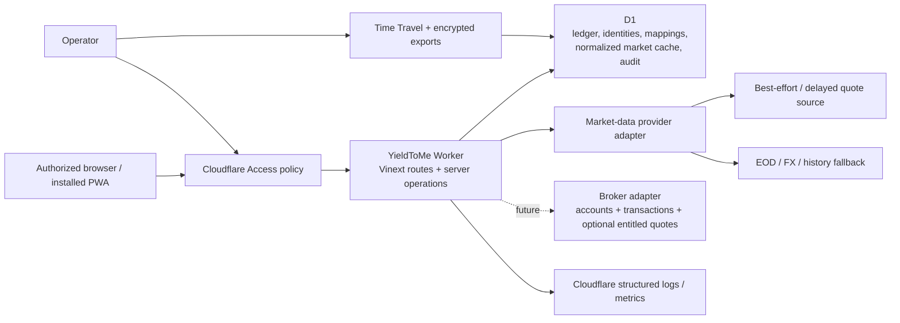
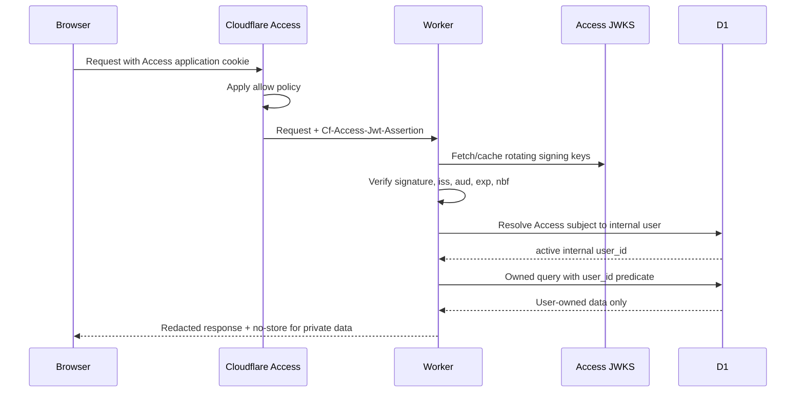

# YieldToMe architecture

Status: foundation decision  
Date: 2026-07-28

## 1. Executive decision

Build a single Cloudflare Worker application using Vinext’s Next-compatible App Router, React, and TypeScript. Use D1 as the system of record and initial normalized market-data cache. Put Cloudflare Access in front of the deployment, then validate its JWT again inside the Worker and map it to an internal user. Keep all portfolio operations server-side and owner-scoped.

Do not add R2, KV, Queues, Durable Objects, Images transformations, or an independent auth vendor in the first implementation slice. Add each only when its documented trigger occurs.

## 2. Context



Trust boundaries:

1. The browser is untrusted, including IDs and calculated values it submits.
2. Cloudflare Access is the outer gateway, not the application authorization layer.
3. The Worker is the policy and calculation boundary.
4. D1 constraints protect relational integrity but do not provide tenant row-level security.
5. Provider data is untrusted external input and may be stale, corrected, delayed, incomplete, or malformed.

## 3. Application stack

### Runtime and UI

- Vinext `0.0.50` foundation using the Next-compatible App Router.
- React `19.2` and TypeScript `5.9` in strict mode.
- Cloudflare Workers runtime and static assets.
- Server-rendered pages for initial navigation; client components only for interaction that needs browser state.
- CSS design tokens and responsive layout derived from the supplied visual style guide.
- Progressive web app metadata plus a deliberately limited service worker.

Version pins describe the scaffold date, not a perpetual latest-version promise. Dependency upgrades require build/test confirmation and a task.

Vinext is under active development and does not promise full Next.js parity. Every routing, middleware/header, Server Action, binding, and cache behavior used by this product must pass `vinext check`, the production Worker build, and a runtime smoke test. Next.js documentation alone is not proof that a feature works in this stack.

### Persistence

- Cloudflare D1 / SQLite-compatible SQL.
- Drizzle schema and migrations for type-safe application access.
- Decimal financial values stored as canonical decimal text and parsed by a decimal library when calculation work begins.
- Pure financial arithmetic, including FIFO and ledger projections, uses the exact-pinned, zero-transitive-dependency `decimal.js` `10.6.0` ESM package behind a string-only bounded domain wrapper. Its broad runtime compatibility, TypeScript declarations, half-even rounding support, and absence of native/Node-only dependencies make it suitable for the Cloudflare Worker build; direct `number` construction and parallel arithmetic engines are not exposed.
- UTC ISO-8601 instants for events; separate `local_date` and IANA timezone where market/accounting dates matter.
- Public opaque IDs (UUIDv7/ULID-style text) rather than sequential row IDs in URLs.
- User settings define a home currency. Native transaction/security facts remain native; home-currency cost/value projections and snapshots are the canonical reporting amounts.

### Server operations

- Route handlers or server actions only behind the shared authenticated request context.
- A repository/service boundary receives the derived internal `user_id`; data functions do not accept a free-form owner ID from the client.
- Financial calculations live in pure domain modules with deterministic fixtures.
- Provider adapters normalize into domain records before persistence.

## 4. Request and authorization flow



### What Cloudflare Access provides

- Authentication through configured identity providers or one-time PIN.
- Administrator-controlled allow/deny policies and session gateway.
- An application JWT containing authenticated identity claims.
- Useful coarse offboarding at the edge.

### What it does not provide

- Application registration, account recovery, profile administration, acceptance of product terms, deletion workflow, household membership, or billing.
- Row-level portfolio authorization.
- Protection against a Worker/origin that trusts spoofable headers.
- A stable application data model by email alone.

Conclusion: Access is enough for a private, administrator-invited first version. It is not enough for a public or self-service SaaS. If the product later needs public registration or organization membership, introduce an application identity/session layer behind Access or replace the outer-only model through a recorded decision.

### Identity rules

- Validate `Cf-Access-Jwt-Assertion`, not merely the cookie or email header.
- Fetch JWKS from the configured team domain and support signing-key rotation.
- Validate the application audience, configured issuer, timestamps, and `type = app`; an interactive principal also requires a non-empty subject.
- Construct the JWKS URL only from the configured Access team domain/issuer. Never follow an unverified JWT `iss` value.
- Map `(access_issuer, access_subject)` to an internal user. Email is contact/display metadata.
- Treat subject reuse/change defensively. Cloudflare documents that a subject can change if a user is removed/re-added or authenticates through a different organization.
- Reject service-token identities from interactive flows.
- After identity verification, check internal status (`active`, `disabled`, `deletion_pending`) on each session/request boundary.
- Disable and deletion-request actions revoke all active internal identities in the same bounded write as their immutable, idempotent lifecycle request and redacted audit event.

### Local development

The development identity adapter may accept an explicit local fixture only when all of these are true:

- runtime is local development;
- an opt-in `LOCAL_AUTH_USER` value is set;
- host is loopback;
- production/preview environment markers are absent.

It must fail closed in preview and production. Tests use signed fixture JWTs or a test identity object injected below the verification boundary.

### CSRF and browser security

- Prefer same-origin mutations.
- Check `Origin` and `Sec-Fetch-Site` for state-changing browser requests.
- Use POST/PATCH/DELETE with JSON/form content types; GET is read-only.
- Add a synchronizer/double-submit CSRF token if the final Access cookie policy permits cross-site credential attachment.
- Require idempotency keys for import commit, reversal, provider refresh, and deletion jobs.
- Set private pages/API responses to `Cache-Control: private, no-store`.
- Use a restrictive Content Security Policy, `frame-ancestors 'none'`, `Referrer-Policy`, MIME sniffing protection, and a permissions policy.
- Deliberate CSP exception (UI-023B, owner directive 2026-08-22; extended by UI-025, owner ruling 2026-08-22): `frame-src 'self' https://greeninvestments.au` so both the per-holding News tab and the primary News tab (rendered in every owned workspace state, including before a portfolio exists) can embed the owner's own news site. This widens only what the app may embed; `frame-ancestors 'none'` (nobody may embed the app) is unchanged, the allowance is a single explicit origin with no wildcards, and the iframe itself is sandboxed with `referrerpolicy="no-referrer"` so portfolio URLs never reach the embedded site's logs. The primary tab's embed URL carries no portfolio/security identifiers, so rendering it before a portfolio exists introduces no additional exposure. The two embeds' visible CHROME is deliberately not identical (UI-028, owner ruling 2026-08-22, product choice): the per-holding embed keeps its source-attribution paragraph beneath the frame at its original height budget, unchanged; the primary tab's embed is chrome-less (no attribution paragraph, frame fills the full viewport left below the sticky app bar/tabs) — attribution remains reachable via the per-holding tab or the site itself. Same origin, same sandbox/referrer policy, same CSP allowance either way; only the presentation differs.

## 5. Tenant isolation pattern

D1 has no application row-level-security policy. Isolation is enforced by query shape, schema relationships, and tests:

- `users.id` is the internal tenant principal.
- `portfolios` contains `user_id`.
- High-risk child tables also denormalize `user_id` and use composite foreign keys such as `(portfolio_id, user_id) -> portfolios(id, user_id)`.
- Any child-to-child relationship that can influence financial results—import row to transaction, reversal to transaction, transaction to portfolio security, cash entry to transaction, lot allocation to sale/lot, receipt to transaction/cash entry—carries enough owner/portfolio columns for a composite foreign key. A service check is not a substitute where D1 can enforce the relationship.
- Owned repositories require `{ userId, resourceId }`.
- Queries join/predicate by both values in one SQL statement, avoiding a check-then-use race.
- Unique/index keys begin with `user_id` or `portfolio_id` where access patterns do.
- Audit and logs record actor and target opaque IDs, not full financial payloads.

Shared reference tables (`currencies`, `exchanges`, canonical securities) contain no user financial state. User-specific mappings, watch status, overrides, and transactions remain owned.

## 6. Domain module boundaries

```text
app/
  (public)/                 metadata/offline-safe shell
  (protected)/              authenticated portfolio routes
  api/                      narrow HTTP boundaries
domain/
  auth/                     Access verification + identity mapping
  ledger/                   transactions, cash, reversals
  lots/                     FIFO projections and matches
  market-data/              provider interfaces + normalization
  securities/               provider-identity match rule for the security master's verification write path
  calculations/             pure decimal calculations
  imports/                  versioned parsers and staged workflow
  snapshots/                deterministic daily projections
db/
  schema.ts                 Drizzle schema
  repositories/             owner-scoped persistence
  migrations/               generated/reviewed SQL
worker/
  index.ts                  Cloudflare entry/bindings
```

This is the intended boundary, not a requirement to create empty directories now.
Add a separate dividend module only when the deferred event, actual-receipt, and forecast tasks are promoted.

## 7. Market-data architecture

The technical provider comparison, first-provider decision, cache/refresh lifecycle, FX rules, and adapter contract are normative in `MARKET_DATA_STRATEGY.md`. External provider-use matters are handled separately by the operator and create no application gate or schema.

### Capability interface

```ts
interface MarketDataProvider {
  capabilities(): ProviderCapabilities;
  searchSecurities(query: SecurityQuery): Promise<SecurityCandidate[]>;
  getDailyPrices(request: DailyPriceRequest): Promise<PriceObservation[]>;
  getLatestObservation(
    request: LatestRequest,
  ): Promise<PriceObservation | null>;
  getFxRates(request: FxRequest): Promise<FxObservation[]>;
  getDividendEvents(request: DividendRequest): Promise<DividendEventInput[]>;
  getSplitEvents(request: SplitRequest): Promise<SplitEventInput[]>;
  getFundamentals?(
    request: FundamentalRequest,
  ): Promise<FundamentalSnapshot | null>;
}
```

Adapters return normalized values and provenance, never UI-ready totals. Capabilities declare supported exchanges, history depth, delay class, adjustment support, and rate limits.

### Initial provider decision

Implement normalized observation selection first against deterministic fixtures, with best-effort/EOD/manual states. The first network adapter is a server-only Yahoo Finance-compatible best-effort source. Another provider remains optional until measured coverage, reliability, capability, or cost justifies it.

`yfinance` is a Python library and does not run in the Worker. The Worker adapter calls corresponding Yahoo Finance endpoints only from server code, with bounded requests, circuit breaking, response validation, and explicit best-effort provenance. Provider enablement is ordinary server configuration with no user-count, owner-binding, deployment-mode, monetization, redistribution, or external-use gate.

Technical alternatives as of 2026-07-28:

| Provider                 | Useful capability                                                                         | Material technical constraint                     | Decision                    |
| ------------------------ | ----------------------------------------------------------------------------------------- | ------------------------------------------------- | --------------------------- |
| Yahoo Finance-compatible | Broad international latest/daily prices, FX, dividends, and splits when endpoints respond | No SLA; endpoint and response shapes can change   | Preferred v1 adapter        |
| EODHD                    | Broad delayed/EOD/history, adjusted prices, splits/dividends, and FX                      | Requires separate adapter/fixture work            | Optional future alternative |
| Marketstack              | Global EOD and corporate actions                                                          | FX is not a complete pricing feed                 | Not sufficient alone        |
| Twelve Data              | Global series, dividends, FX, and documented ASX capability                               | Capability/rate behavior needs fixture validation | Optional future alternative |
| FMP                      | Global prices, fundamentals, FX, and dividends                                            | Fundamentals exceed core-release need             | Deferred                    |
| Alpha Vantage            | Low-volume daily global/FX and adjusted-history APIs                                      | Quota and ASX depth require measurement           | Deferred fallback candidate |

Technical behavior changes. Revalidate before implementation:

- Cloudflare Access authorization cookie: <https://developers.cloudflare.com/cloudflare-one/access-controls/applications/http-apps/authorization-cookie/>
- Cloudflare Access JWT validation: <https://developers.cloudflare.com/cloudflare-one/access-controls/applications/http-apps/authorization-cookie/validating-json/>
- yfinance project: <https://github.com/ranaroussi/yfinance>
- EODHD ASX exchange coverage: <https://eodhd.com/financial-apis/exchanges-api-list-of-tickers-and-trading-hours>
- Marketstack product documentation: <https://marketstack.com/product>
- Twelve Data ASX support: <https://support.twelvedata.com/en/articles/13001919-australian-equities-market-data>
- FMP developer documentation: <https://site.financialmodelingprep.com/developer/docs>
- Alpha Vantage support: <https://www.alphavantage.co/support/>

### Ingestion and cache

- Normalize and upsert by provider, mapping, interval, observation timestamp/date, and adjustment state.
- Keep raw payload only transiently for parsing diagnostics; persist a payload hash and selected normalized provenance. Retain raw payloads only under a bounded diagnostic policy.
- Apply provider rate limiting and bounded exponential retry with jitter.
- Cache negative lookups briefly to prevent storms.
- Manual user refresh enqueues/request-coalesces a refresh operation; it does not fan out one request per row.
- Scheduled backfill/refresh starts with Cron Triggers calling a bounded worker. Add Queues when a run cannot reliably finish within Worker execution/subrequest limits or needs durable fan-out.
- Do not store provider results in browser/service-worker caches.

The v1 adapter is one source plus manual override, not a multi-provider aggregator. Adding another provider requires measured technical need, deterministic adapter tests, and a backlog task.

**Local development has no cron (MKT-015, 2026-08-22).** `wrangler dev` does not deliver scheduled events by default, so neither the hourly Sharesight/Yahoo/corporate-action/calculation sweep nor MKT-011A's intraday capture sweep ever fires locally on its own — every day's price accretion in local dev therefore depends entirely on a read-time trigger (BRK-012C's gate) actually being exercised. To manually invoke a Worker's `scheduled` handler against a running `wrangler dev` instance, use `wrangler dev --test-scheduled`, which exposes a local `/__scheduled?cron=<pattern>` endpoint (a `curl`/browser hit against that endpoint invokes `scheduled(controller, env, ctx)` exactly as a real Cron Trigger would, letting a developer exercise MKT-011A/BRK-012B's cron paths locally without waiting for or faking a production schedule). This is a development-only affordance; it changes nothing about production's real `triggers.crons` entries.

**MKT-015 decision note (2026-08-22): the read gate's day-boundary guarantee does not depend on cron at all.** Given the above, day-change display (needing two consecutive comparable-basis `price_observations` days) cannot rely on cron alone locally, and even in production a cron sweep can simply miss the narrow window before Sharesight's own feed rolls its `current_price` over to the next trading day. The fix keeps the guarantee entirely within BRK-012C's existing read-time gate (`app/sharesight-price-gate-service.ts`) rather than adding a third trigger: before the gate's fresh fetch overwrites the delayed-price cache, it reads that cache's PRE-refresh row and backfills into `price_observations` any market date it still evidences that never got a row — see `docs/MARKET_DATA_STRATEGY.md` §17's day-change-guarantee bullet for the mechanism and its honesty limits (only the single still-cached date recovers; a genuinely unobserved gap of more than one day stays honestly missing). **Review round (2026-08-22, BLOCKING fixes):** migration `0052` adds `market_date`/`market_timezone` columns directly to `sharesight_delayed_prices` (plain `ADD COLUMN`, no rebuild) so the backfilled date is the cache's own verbatim-stored value, never re-derived from its UTC-normalized `quote_at` (re-slicing that would reintroduce the exact date-shift bug `deriveMarketDateFromTimestamp` exists to avoid); a legacy pre-migration row with both columns `NULL` is skipped honestly rather than approximated. The backfill write additionally uses a strictly-newer-guarded upsert (`upsertSharesightPriceObservations`'s `noDowngrade` option, the same pattern `app/watchlist-actions.ts`'s priming upsert already uses) so a stale cache snapshot can never overwrite an already-fresher `price_observations` row for that same prior day; the ordinary same-day refresh write is unaffected.

**MKT-011A decision note (2026-08-22): a SECOND Cron Trigger pattern, and a NEW ephemeral intraday cache table, distinct from the hourly refresh's durable job queue above.** Owner-uploaded price history (MKT-008) seeds observations up to the upload day; without a daily mechanism the gap to "today" grows forever. The fix is a second `triggers.crons` entry (`25,55 * * * *`, alongside the existing `0 * * * *`) rather than a shorter interval on the existing hourly job: the two crons serve genuinely different purposes at genuinely different cadences (hourly hard refresh/accretion vs. a market-hours-only intraday sweep bounded to 10:25-16:25 local per security), and folding them into one job would force every other hourly consumer (corporate actions, Sharesight accretion, the calculation sweep) onto a 30-minute cadence it does not need. `worker/index.ts`'s `scheduled` handler dispatches on `controller.cron` (the fired pattern string) so the two schedules never double-run each other's work; `:25` vs `:55` (both sharing the SAME pattern string) is disambiguated from `controller.scheduledTime`'s actual fired minute, since a 60-minute-cadence owner must skip the `:55` tick entirely. **Retention decision**: the sweep's own cache, `intraday_price_points`, is DELIBERATELY not `price_observations` — it is a small, ephemeral, TODAY-ONLY table (purged immediately after a successful end-of-day rollup), existing solely to give `MKT-011B`'s "today" graph something to draw from before the day's close. This keeps `price_observations`'s existing shape/selection semantics (`docs/CALCULATIONS.md`) completely unchanged: the rollup write is an ORDINARY `interval = 'delayed'` observation, entering the existing freshest-wins ranking exactly like any other delayed observation, needing no selection-layer change. Rejected alternative: writing every intraday tick directly into `price_observations` with `interval = 'intraday'` (a value that column's CHECK already allows) — rejected because it would make that table's per-day row count unbounded and provider-cadence-dependent, and would require the selection layer to learn a THIRD interval's ranking semantics for what is fundamentally a display-only, ephemeral series.

### Durable job and concurrency pattern

- Persist a job before returning success for import backfill, market refresh, snapshot rebuild, export, or deletion work.
- Give each logical operation a deterministic idempotency key and at most one active job row for that key/window.
- Workers acquire a bounded lease with a conditional D1 update over status/version/lease expiry; expired leases may be reclaimed.
- Process bounded chunks, commit a high-water mark, and make every retry safe from that mark.
- Import commit reconstructs and digests the complete owner-scoped review state before a guarded `ready` → `committing` transition. It freezes mapping writes, persists only validated durable row targets with each ledger chunk, processes one chunk per invocation, and finalizes portfolio-specific rebuild jobs using actual ledger high-water transaction IDs. The manual commit route (`POST /api/import/commit/:batchId`) keeps this invariant exactly: one chunk, one invocation. The atomic accept route (`POST /api/import/preview/:batchId/accept`) is a dated, measured exception — see the `2026-08-18` (UI-013 review round) decision log entry below.
- `ctx.waitUntil` may finish short logging/cache work but is not the sole durability mechanism for financially material work.
- Cron claims ready jobs and respects provider/Worker query budgets. Add Queues only after measurement shows that bounded Cron/request processing cannot meet reliability or latency.
- Concurrent recalculations use calculation version + affected range and coalesce overlapping invalidations; a stale run cannot publish a high-water mark over newer ledger facts.
- Use D1 prepared-statement batches for each bounded atomic unit. Do not assume an interactive transaction can span application round trips.
- Manual security mutations stream chronological quantity events in fixed pages, then use an ephemeral D1 check-constraint guard to assert the owner/portfolio/security transaction count and version total inside the same batch as the ledger write. This rejects concurrent oversells without trusting a bounded projection view. Client-shaped prefixes were rejected for correction retries; persisted server-issued grants bind owner, portfolio, purpose, and target and are consumed with the immutable result.
- Bound every chunk for D1’s 100 parameters per query, 2 MB row/value limit, and the Worker’s 128 MB memory limit. Free D1 permits 50 queries per invocation and paid D1 permits more, but neither removes the need for resumable chunks.
- As of `IMP-010B` (2026-08-25), the 10 MiB/100,000-row ledger CSV upload contract's byte decode/BOM-strip/row-splitting work runs in the BROWSER, not the Worker (`domain/imports/strict-versioned-parser.ts`'s `splitStrictVersionedCsvRows`, imported directly by `app/components/import-review.tsx`); the server's remaining work is per-row grammar/enum/decimal classification over already-split rows (`classifyImportRows`), the same weight category `IMP-010A` already judged plan-agnostic for the price-CSV path. Production no longer requires Workers Paid for CSV import — see the `IMP-010B` decision-log entry below and `CSV_IMPORT_SPEC.md`'s IMP-010B section for the full ruling. (Historical note, preserved per this file's never-rewrite-history convention: the original v1 design below, superseded by this correction, required Workers Paid because the FULL parse — decode, normalize, hash, validate — ran server-side.)

### Price selection

Selection is deterministic:

1. active user manual override for the requested instant/date;
2. **(MKT-009B, `user_settings.price_source_preference`)** narrow candidates to the owner's preferred provider(s), but ONLY when that narrowing leaves at least one candidate — an empty preferred subset falls straight through to step 3 against the full candidate set, never `unavailable` merely because the preferred source is silent while another source has a valid observation;
3. approved validated best-effort/delayed observation within its applicable staleness window;
4. approved EOD observation matching adjustment mode and security mapping;
5. prior valid trading-day observation within the permitted staleness window;
6. unavailable.

The chosen observation and fallback reason are included in the calculation explanation. Compact views generally suppress timestamps and routine source/fallback labels; the explanation remains available on demand, and inline status is reserved for action-required conditions.

**MKT-009B decision note (2026-08-21): price-source preference is a read-time RANKING INPUT, not a second activation gate.** `domain/market-data/selection.ts`'s `selectPriceObservation` gained an optional `preferredProviderIds` parameter (backward compatible — `undefined` is the exact pre-existing behaviour, exercised by every call site that does not pass it). `app/owned-holdings.ts` is the only wired call site (per its own "single choke point" design, `owned-income-projection.ts`/`owned-dividend-assumptions.ts` build on its output rather than calling selection independently); `app/owned-quotes.ts` was deliberately NOT wired — it excluded Sharesight entirely (deployment-scope-only reads, pre-dating BRK-012C) and extending the preference there would have been a separate, unscoped decision. (UI-028 review round 2 fold, 2026-08-22: `app/owned-quotes.ts` is retired — WLT-001 replaced the owned-mode Quotes tab with the user-scoped watchlist, `app/owned-watchlist.ts`, which DOES wire `preferredProviderIds` from the owner's `priceSourcePreference` setting; this historical note is preserved as the record of the decision at the time, past tense only.) `MARKET_DATA_PROVIDER` (`worker/runtime-config.ts`) remains the ONLY deployment-level kill switch for Yahoo; the preference cannot re-enable a disabled provider. **Default value `sharesight_delayed`, rejected alternative `yahoo_anonymous`**: the column must default to something for every existing row (the owner explicitly wants exactly three choices, no "none"/"auto" option), and `yahoo_anonymous` was rejected because it would have been a real, silent behaviour regression for any owner with an existing Sharesight link — BRK-012C's entire purpose is keeping a Sharesight observation ≤10 minutes fresh at read time specifically so it wins today's freshest-wins ranking, and a hard Yahoo preference would override that even when Sharesight is fresher. `sharesight_delayed` is a no-op for an owner with no link (Sharesight never writes a row, so selection falls straight through to Yahoo, identical to pre-MKT-009B behaviour) and reinforces, rather than fights, BRK-012C's existing intent for an owner who does have one.

### Security-master verification write path

IMP-004B added the first owner-triggered production write into the shared `securities` master. An owner-facing action (`app/security-verification-service.ts`, gated by the same CSRF/owner-scoping pattern as every other mutation route) re-derives the requested symbol/exchange/currency from the server's own current, database-backed import preview -- never trusting client-supplied fields -- calls the configured `MarketDataProvider`'s `searchSecurities`, and only publishes when exactly one result agrees on currency (and exchange, when supplied). Publication is creation-only and atomic (`db/repositories/security-verification.ts`): it never mutates an existing canonical row, and a concurrent verification of the same provider identity is resolved by re-reading after the attempt rather than by holding a lock. See `docs/MARKET_DATA_STRATEGY.md` §9 for the ingestion-lifecycle steps this fills in and `docs/DATA_MODEL.md` §4/§11 for the schema and atomic-write technique.

### Home-currency presentation

- `user_settings.home_currency_code` is the default reporting currency.
- A portfolio stores the effective reporting/home currency used by its projections so calculation versions remain reproducible.
- Security price observations and transaction amounts remain in native currency.
- Holding projections and portfolio snapshots store home-currency basis/value plus the selected FX evidence.
- The native/home menu toggle selects presentation fields only. It never mutates transactions, price observations, quantities, lots, or security currency.
- A historical/native price converted to home currency uses the FX observation selected for that price date.
- Changing home currency is an explicit rebase operation that invalidates/rebuilds derived projections and snapshots; it does not rewrite native ledger facts.
- **Display formatting (UI-026, owner directive):** on screen, an amount in the ACTIVE PORTFOLIO's own base/home currency renders as a bare symbol ("$4.21", "£4.21"); an amount in any other currency renders flagged so it can never be mistaken for a base-currency figure -- dollar-family currencies (AUD/USD/NZD/CAD/SGD/HKD) get the standard AU-style country-flagged prefix ("US$4.21", "A$4.21", ...) since "$" alone is shared across all of them, while £/€/¥ are already unambiguous and render the same symbol whether base or foreign; a currency with no well-known symbol keeps the "CODE 4.21" fallback form in either direction. One module, `app/currency-display.ts`, owns the currency→symbol map and this rule; every money formatter derives its prefix from it. This is display-only -- stored values, CSV/backup exports, and import-preview persisted values keep their ISO codes untouched, and the full ISO code stays reachable via titles/aria or existing explain surfaces where precision matters. The user-scoped watchlist (WLT-001) has no portfolio of its own to compare against; it treats "AUD" as the base unless a portfolio happens to be active, an explicit documented fallback (`WATCHLIST_NO_PORTFOLIO_BASE_CURRENCY`), never a silent guess.

## 8. Future broker synchronization boundary

Broker sync is deferred from v1 but fits the same architecture:

```ts
interface BrokerAdapter {
  authorize(input: BrokerAuthorizationInput): Promise<BrokerConnectionGrant>;
  listAccounts(connection: BrokerConnection): Promise<BrokerAccount[]>;
  syncTransactions(request: BrokerSyncRequest): Promise<BrokerTransactionPage>;
  syncPositions(request: BrokerSyncRequest): Promise<BrokerPositionSnapshot>;
  syncCash(request: BrokerSyncRequest): Promise<BrokerCashSnapshot>;
  getEntitledQuotes?(request: BrokerQuoteRequest): Promise<PriceObservation[]>;
}
```

- `broker_connections` belongs to one internal user and stores only encrypted OAuth/token material. A Worker secret/KMS-style key encrypts credentials; plaintext never enters D1 logs, client code, CSVs, or audit metadata.
- `broker_accounts` maps an external account to one owned portfolio through a composite owner constraint.
- `broker_sync_runs` stores cursor, range, status, lease, counts, and idempotency.
- `external_record_mappings` keys each broker transaction/cash event by broker, account, external ID, and provider version. Corrections create ledger reversals/supersessions.
- Broker transactions enter the same staging/validation/reconciliation path as CSV/manual sources with `source_type = broker_sync`.
- Position snapshots are reconciliation evidence. They flag drift; they do not silently replace ledger-derived holdings.
- Broker quotes exposed by a connected account normalize through `MarketDataProvider` and remain scoped to that user/connection.
- Revoking a connection stops sync and deletes/invalidates credentials without deleting already committed ledger facts.

This boundary prevents a later broker integration from requiring a new ledger, holdings model, or UI calculation path.

### 8.1 SPK-003 spike: candidate archetype, contract, and rejected alternatives

`SPK-003` validated this boundary with a concrete, promotion-ready contract before any broker-specific dependency, network call, or credential store was introduced. `domain/broker-sync/` holds the result: `contracts.ts` (adapter/record/mapping types), `reconciliation-plan.ts` (pure idempotency, correction, and position-drift planning functions with no ledger write), `redaction.ts` (defensive payload redaction), and `fixtures.ts` (sanitized static fixtures and a fixture `BrokerAdapter` implementation). Its contract test suite is `tests/spk-003.test.ts`.

**Broker candidate — assumption, not observation.** No routed product evidence (`docs/CONSOLIDATED_PRODUCT_SPEC.md`, `docs/REQUIREMENTS_AND_ACCEPTANCE_CRITERIA.md`, `docs/source-evidence/`) names a specific broker; `docs/source-evidence/04_VIDEO_UNKNOWNS_AND_REBUILD_PLAN.md:970` only lists "Brokerage integrations and automatic trade ingestion" as an unscoped future capability. The spike therefore defines a **generic archetype, marked explicitly as an assumption**: an AU CHESS-sponsored, OAuth-capable retail broker, chosen for consistency with the AUD/ASX-only holdings in `docs/Example_Portfolio.csv` (e.g. `IXJ.AX`, `WHC.AX`, all `Currency = AUD`, `Exchange = ASX`). The fixture provider code `au-chess-oauth-generic` (`domain/broker-sync/fixtures.ts`) is invented test data, not a real provider identifier, and must not be read as a vendor selection. Selecting an actual broker/API requires its own future task with the vendor's real API/OAuth documentation, rate limits, and entitlement terms.

**Contract decisions:**

- Token material is modelled only as `TokenEnvelopeRef` — an opaque `envelopeId` plus expiry/status. No contract type anywhere in `domain/broker-sync/` can hold a raw token/secret value, so there is nothing for an adapter implementation to accidentally log; `redactBrokerPayload` is a secondary, belt-and-braces guard for any raw upstream payload an adapter might otherwise pass through verbatim.
- Idempotent staging plans one of eight effects per broker record (`create`, `skip_duplicate`, `skip_stale_version`, `skip_deleted_unseen`, `skip_reversed_history`, `reverse_and_replace`, `reverse_only`, `deny_cross_user`). Persisted mapping rows are unique per the documented 6-tuple `(userId, providerCode, brokerAccountId, externalType, externalId, externalVersion)` (`docs/DATA_MODEL.md` §8) — one row per reported version, kept for audit history — but the planner looks up the 5-tuple WITHOUT `externalVersion` and resolves it to the single currently-`active` row (never by array order, which an unordered D1 `SELECT` cannot guarantee), then compares the incoming record's version against it numerically. A version at or below the active version is always a no-op (`skip_duplicate` if equal, `skip_stale_version` if older — covers both an exact cursor-page replay and a cursor restart re-serving an already-superseded page); only a strictly newer version can plan `reverse_and_replace` (never an in-place rewrite of ledger facts) or, for a deletion, `reverse_only`. A `reverse_only` leaves every mapping row for that identity `"reversed"` — never `"active"` — so a group with history but no active row always means "already fully reversed," never "never seen"; the planner then compares against that group's highest known version regardless of row status, planning `skip_reversed_history` at or below it and only allowing a fresh `create` (a genuine broker re-issue) strictly above it. Only a truly empty group plans `skip_deleted_unseen`/`create` as genuinely unseen. See §8.1's data-model note and `docs/DATA_MODEL.md` §8.1 for the full idempotency-key and persistence-invariant rationale.
- Position reconciliation (`planPositionReconciliation`) only ever produces a drift report (`match` | `drift` | `broker_only` | `ledger_only` | `unresolved_security` | `unparseable_quantity`), using the same exact-decimal comparison as the rest of the codebase (`domain/calculations/decimal.ts`) rather than string equality, so differently-formatted equal quantities never report a false drift. A broker position whose security hasn't been resolved to an internal ID is never silently dropped; it always contributes a flagged `unresolved_security` entry. A non-canonical adapter-boundary quantity string (`""`, `"N/A"`, exponent notation, thousands separators) is flagged `unparseable_quantity` instead of throwing and losing the whole report. No code path in this module can emit a ledger mutation from a position snapshot.
- Account-mapping ownership (`validateBrokerAccountMapping`) treats the caller-supplied `actingUserId` as the only trusted owner and independently checks the connection, account, and portfolio against it plus the account/connection relationship, so a cross-user row is denied even if a caller mistakenly hands it mismatched records. The same check rejects a revoked or expired connection, so disconnection takes effect at the validation layer.
- Optional quotes reuse `PriceObservation`/`MarketDataProvider` from `domain/market-data/contracts.ts` rather than a parallel quote shape, satisfying the BRK-001 requirement that broker-supplied quotes enter through the existing market-data abstraction with entitlement/provenance.

**Rejected alternatives:**

- _Direct positions-as-source-of-truth sync_ (broker position snapshot overwrites `portfolio_securities`/holdings directly) — rejected because it would let an unvalidated or stale broker feed silently rewrite ledger-derived truth, contradicting the immutable-ledger and reconciliation-only rules in `AGENTS.md` and BRK-001's acceptance criteria.
- _Broker password/screen-scraping adapter_ — rejected outright; BRK-001 and `AGENTS.md` require a documented OAuth/API integration with encrypted, owner-scoped connections.
- _Storing raw token values in the contract/fixture types "for now, encrypt later"_ — rejected; modelling only a `TokenEnvelopeRef` reference from the start removes an entire class of accidental-leak defects (fixtures, test snapshots, error payloads) rather than relying on discipline to redact them later.
- _A parallel broker-specific FIFO/valuation engine_ — rejected; reconciliation planning here is intentionally shallow (quantity comparison only) and must call into the existing ledger/FIFO/valuation code once promoted, not duplicate it.
- _Generic multi-broker abstraction layer up front_ — rejected for this spike; one archetype is enough to validate the boundary, and a second broker is a documented future decision (`docs/IMPLEMENTATION_PLAN.md` §10), not a default.

See `docs/SPK-003_THREAT_MODEL.md` for the security threat model and `docs/DATA_MODEL.md` §8 for the data-model extension this contract assumes.

### 8.2 BRK-003: Sharesight GET-only client foundation

`BRK-002` selected **Sharesight** (User API v3) as the real broker/portfolio-tracker candidate, replacing the SPK-003 generic archetype above for implementation purposes (SPK-003's contract/reconciliation-plan/redaction code still applies unmodified once promoted). Sharesight holds the owner's tax data and its API is read-write with **no granular OAuth scopes** — a client-credentials token is valid for both read and write endpoints. Read-only therefore cannot be enforced by requesting a narrower scope; it must be enforced structurally, in code. `BRK-003` (`domain/sharesight/`) is that structural layer, built before any schema, sync, or live-access work.

**Read-only rule, enforced structurally, not by convention:**

- `domain/sharesight/transport.ts` exports exactly one request primitive, `sharesightGet`, and it has no `method` parameter — GET is hard-coded into the call it makes. There is no generic `request(method, ...)` export anywhere in `domain/sharesight/` or its barrel; that surface must not exist — a test scans every module's actual exports for a non-GET-shaped name (`post|put|patch|delete|request`, case-insensitive) so this stays true even if a future change adds an export. Because `RequestInit["method"]` can still be smuggled past the type system (a widened/`as any` cast), `sharesightGet` also defensively inspects its `init` argument at runtime and throws `SharesightNonGetAttemptError` — synchronously, before `fetcher` is ever invoked — if a `method` key is present at all, regardless of its value. The same check rejects method-override-shaped headers (`X-HTTP-Method-Override`, `X-Method-Override`, `_method`, case-insensitive) before sending, since several HTTP frameworks/proxies treat one of these as "run this request as a different method." `sharesightGet` itself is package-internal: `domain/sharesight/index.ts`'s barrel does not re-export it (or `SharesightNonGetAttemptError`), since it takes a caller-controlled URL with no host pin of its own — `createSharesightClient` (via `createSharesightTokenProvider`) is the sole public entry point, and the barrel's exact export-name set is pinned by a test so any future addition is a conscious, reviewed change. The seal is now ALSO lint-enforced — `eslint.config.mjs`'s `no-restricted-imports` rule bars importing `domain/sharesight/transport` from anywhere outside `domain/sharesight/` itself and `tests/brk-003.test.ts` — though that rule only inspects static `import`/`export … from` specifiers, not a dynamic `import()` call, a gap recorded as a `BRK-004` carry-over rather than closed here.
- `domain/sharesight/client.ts` (the data client: `listPortfolios`, `getPortfolioHoldings`, `listTrades`, `listPayouts`) only ever reaches Sharesight through `sharesightGet`. It never imports or holds anything capable of sending a POST. Its `baseUrl` host is pinned to `api.sharesight.com` at client creation (throwing `SharesightBaseUrlRejectedError`, before any request can be sent, on any other host) so a misconfigured `baseUrl` can't ship the Bearer token to an arbitrary host; overriding the pin requires an explicit `unsafeAllowOtherHost` flag documented as BRK-008 spike/mock-tooling only. If a structural GET-only rejection is ever thrown from within the request path, the client maps it to its own `non_get_rejected` error kind — never folds it into `timeout`.
- `tests/brk-003.test.ts` proves this is structural, not just documented: attempting any non-GET request through the module's surface fails the suite, and the fetch mock is asserted to never be called on a rejected attempt.

**The token-endpoint exception, and why it's safe:**

- OAuth 2.0 client-credentials token acquisition (`domain/sharesight/token.ts`) is a POST — the SOLE non-GET request this package ever issues. It is auth infrastructure (Sharesight's OAuth token endpoint), not the Sharesight data API, so it does not violate the read-only rule; it is the mechanism by which the data client obtains a credential to make GET requests at all. It is never exported (a stronger guarantee than exporting-and-documenting it), so `client.ts` only ever consumes a `SharesightTokenProvider.getAccessToken()` result (a string), never a reference to `token.ts`'s internal fetcher or POST function.
- **The real safety control is SHAPE validation, not URL-equality pinning.** A configured `tokenUrl` is validated exactly once, at `createSharesightTokenProvider` creation, by `validateSharesightTokenUrlShape`:
  - it must use `https:` (an `http:` exception exists only for a loopback host — `127.0.0.1`/`localhost`/`::1` — reserved for future BRK-008 local mock tooling; a non-loopback host must never send credentials in cleartext);
  - it must not carry userinfo (username/password) components — never permitted, even to a loopback host, since credentials belong solely in the client-credentials POST body, never embedded in the URL (BRK-003 review finding F10; the data client's `baseUrl` is checked the same way, unconditionally, in `client.ts`);
  - its hostname must be `sharesight.com` or a subdomain of it, matched by exact-label suffix (the full `sharesight.com` label pair as either the whole hostname or preceded by a `.`) — not a bare substring check, which a confusable host like `evilsharesight.com` or `api.sharesight.com.evil.com` would pass — unless the host is loopback (the http exception above) or the caller explicitly set `unsafeAllowOtherHost` (BRK-008 spike tooling only; mirrors the data client's `unsafeAllowOtherHost` for `baseUrl`) (BRK-003 review finding F8);
  - its path, after being lowercased and percent-decoded once up front (BRK-003 review finding F9 — otherwise an uppercase `/API/v3/...` or percent-encoded `/api%2Fv3/...` variant could evade the next check; a malformed percent-escape rejects cleanly rather than throwing uncaught), must NOT contain `/api/` (the data-API shape);
  - and must end with `/oauth2/token` or contain `/oauth` (the token-endpoint shape).

  Any violation throws `SharesightTokenUrlRejectedError` synchronously, before the provider object — and therefore its fetcher — even exists, so no request can ever be sent against a misconfigured endpoint. (An earlier version of this control only compared a candidate URL against itself, which a review found tautological — it could never reject anything, including a `tokenUrl` pointed straight at Sharesight's data API. `assertSharesightTokenUrl` remains as a separate, secondary consistency pin — it guarantees every POST targets the exact URL object that already passed shape validation, rather than one reconstructed on the fly — but it is not itself a shape check.) The request is also sent with `redirect: "manual"` so a 3xx response is treated as a typed error rather than silently followed to a different host.

- **BRK-008 diagnostic exception to "never read a body":** on a non-2xx TOKEN endpoint response only (never the data client), `token.ts`'s `readOAuthErrorCode` reads at most 4KB of the body, tolerating any non-JSON/oversized/unreadable body by returning nothing, and surfaces only a top-level `error` value that exactly matches the closed RFC 6749 §5.2 allowlist (`SharesightError.oauthErrorCode`) — everything else, including `error_description` (which can reflect request data such as an echoed-back code or secret), is discarded unread, so distinguishing `invalid_client` from `invalid_grant` never reopens the module's leak discipline.

- **Token endpoint URL is unverified.** BRK-002's decision cites `portfolio.sharesight.com/api/3/authentication_flow` and `/api/3/configuring_oauth` as the v3 OAuth sources, but implementation had no live network access to re-confirm the exact token URL from those docs. `DEFAULT_SHARESIGHT_TOKEN_URL` (`https://api.sharesight.com/oauth2/token`) is the owner task's stated best-known value and is therefore fully configurable via `tokenUrl` so `BRK-008`'s live spike can correct it without a code change (any replacement must still pass `validateSharesightTokenUrlShape`).
- Access tokens expire after 30 minutes (BRK-002); `createSharesightTokenProvider` refreshes before expiry using an injected clock (epoch-millisecond `now`, this repo's injectable-clock convention adapted for expiry arithmetic) rather than wall-clock time, so refresh timing is deterministic in tests. A refresh failure returns a typed unavailable result and no data GET is ever attempted.

**No account-level write barrier — this module is the sole protection.** BRK-002's original design authenticated the app as a separate, free, read-only-shared guest Sharesight account, so even a bypass of this module's GET-only enforcement would still hit a second, independent control (Sharesight itself rejecting a write against the guest account's read-only share). That plan changed: the owner now authenticates via their **main, paid Sharesight account's** own client credentials — a credentials-grant that Sharesight will honor for read AND write, with no read-only share to fall back on. There is consequently no account-level write barrier at Sharesight's end at all; `domain/sharesight/`'s structural GET-only enforcement, plus the token-endpoint host/shape/userinfo checks above (F8/F9/F10) and the data client's `baseUrl` host pin (F6), are the **entire** defense for the owner's tax data, not one layer of two. This makes correctness of this module — not defense-in-depth from the account type — the load-bearing control, and is why BRK-003's review follow-ups were treated as mandatory before live credentials are used rather than deferred as polish.

**Secrets/evidence discipline:** client ID/secret are constructor-only options (a caller passes Worker env/secrets — `domain/sharesight/` never reads them from a client-supplied value); no thrown or returned value from this module (token errors, data errors, or the smuggled-method rejection) ever contains a credential, token, or raw response body — `tests/brk-003.test.ts` greps every such value for the fixture secret/token as a regression check. Fetch evidence follows the MKT-002 `payloadSha256` convention (a hash of the response body plus an ingestion timestamp, via an optional `onFetchEvidence` hook) rather than logging or persisting the body itself; durable evidence storage is out of scope here (tokens are held in-memory per invocation) and is `BRK-004`'s concern.

**Parsing discipline — absent vs malformed:** `domain/sharesight/parse.ts`'s `optionalDecimal` distinguishes a genuinely absent/null optional money field (an honest `null` "unknown") from one that is PRESENT but fails to parse as a decimal. The latter fails the whole item closed (`invalid_response`), never silently collapsing to the same `null` "unknown" state, because several of these optional fields (franked/unfranked payout amounts, withheld tax) feed downstream tax assumptions — a silently-dropped corrupt value there would be worse than an explicit failure. The same absent-vs-malformed discipline now also covers optional STRING fields (`optionalStringField`), used by `listPortfolios` and (as of the 2026-08-15 live pass below) trades parsing. Whether decimal-from-number conversion can ever produce exponential notation for a realistic money/quantity magnitude was an open question at this point — resolved below.

**BRK-008 live shape evidence — `listPortfolios` (2026-08-15).** A live call against the owner's real Sharesight account confirmed the `portfolios` envelope item shape (key names/types only; no field values retained — see the shape-evidence privacy contract below). `id` is a numeric integer (not a string as BRK-003 had assumed) — this resolves the former `TODO(BRK-008)` id-shape assumption for portfolios only; `parse.ts`'s `requiredIntegerIdDecimalString` normalizes it to a canonical decimal string via `String(value)` (exact for any non-negative safe integer, per this repo's decimal-string discipline), rejecting non-integer, negative, non-finite, or unsafe (beyond `Number.MAX_SAFE_INTEGER`) values. `name` and `currency_code` (ISO 4217-shaped, exactly 3 uppercase letters) are the other two REQUIRED fields. Eight further fields the live response carries are OPTIONAL and modelled on `SharesightPortfolio` (`inception_date`, `tz_name`, `access_level`, `financial_year_end`, `cg_discount`, `country_code`, `owner_name`, `tax_entity_type`): present-but-null and genuinely-absent both parse as `null`; a present-but-wrong-type value fails the whole item closed, mirroring the optional-decimal discipline above. `cg_discount` is deliberately treated as an OPAQUE string, never interpreted as a number or percentage. Remaining live fields this contract does not model (`consolidated`, `default_sale_allocation_method`, `disable_automatic_transactions`, `external_identifier`, `holding_id`, `interest_method`, `payout_sync_cash_account_id`, `rwtr_rate`, `trader`, `trade_sync_cash_account_id`, `user_id`) are ignored for forward-compatibility, not validated or retained.

**BRK-008 live shape evidence — holdings/trades (2026-08-15); payouts endpoint fix pending re-confirmation.** A further live pass against the owner's real account (18 holdings, 107 trades) confirmed those two endpoints' shapes and resolved the former `TODO(BRK-008)` exponent-notation question. Payouts is NOT part of this confirmed evidence — its live call returned a non-JSON body (see below); its endpoint path is corrected here, but its shape remains unobserved pending a re-run against the corrected path.

- **Exact double round-trip, exponent notation rejected (resolves the exponent TODO).** Sharesight emits money/quantity fields as JSON floats. `parse.ts`'s `decimalString` converts via `String(value)`, which ECMA-262 guarantees is the shortest string that round-trips back to the exact same double — so this never fabricates precision the wire didn't carry. The one output `String()` can produce that is not a valid decimal string is exponential notation for a very large/small magnitude (e.g. `"1e+21"`); that is now REJECTED (`null`, fail-closed) rather than reformatted, since reformatting would itself invent a representation Sharesight never sent. `NaN`/`Infinity` are rejected the same way. Net effect: our precision is bounded by exactly what Sharesight's own float emission carries on the wire — we preserve it exactly, we never extend or reformat it.
- **Instrument resolution keys corrected — CONFIRMED for holdings/trades, INFERRED (not yet observed) for payouts.** The nested `instrument` object's keys are `code`, `market_code`, `currency_code` — not `market`/`currency` as BRK-003 originally assumed. This is live-confirmed for holdings and trades. `parse.ts`'s `instrumentFields` is shared code, so all three keys are now REQUIRED there too (payouts has never returned a parseable body, live or otherwise — see below) — this is an INFERENCE that payouts' `instrument` sub-object is shaped the same as the other two endpoints', not an observation, and is explicitly expected to either parse correctly or fail closed with a shape diagnostic once the corrected payouts path is re-run; either outcome is treated as the intended next step, not a bug.
- **Holdings (`HoldingPortfolioList`, confirmed v3-native, no format suffix — `/portfolios/:id/holdings`).** `id` (numeric, portfolios technique) and a top-level `symbol` field are REQUIRED, alongside the instrument resolution keys. `quantity`/`average_cost`/`market_value` are all OPTIONAL — the confirmed live response carries **no quantity or value field at all** on this endpoint (an honest finding, not an oversight): `SharesightHolding.quantityDecimal` is `string | null`, matching `averageCostDecimal`/`marketValueDecimal`. `BRK-005` scoping must account for this: holding quantity is not available from this endpoint and will need to come from trades reconciliation or a different endpoint/params combination.
- **Trades.** `id` is numeric (like portfolios/holdings, not the string BRK-003 assumed). REQUIRED: `id`, `transaction_date`, `quantity`, `price`, `holding_id`, `portfolio_id` (both numeric, normalized the same way as `id`). The trade's own `portfolio_id` is validated for presence, shape, AND equality against the caller-supplied `portfolioId` this fetch was scoped to — a mismatch fails the whole item closed (envelope fail-close convention), never silently re-attributing a mis-scoped record to the queried portfolio, which would otherwise be a provenance lie downstream. `value` is nullable-tolerant (an optional decimal, not required) since other fields on the same live item (`paid_on`, `market_price`) are confirmed null, and a hard requirement risked failing real trades closed unnecessarily. `transaction_type` is now OPTIONAL — the live item's first record did not carry it at all; absent is an honest `null`, while a present-but-unrecognized value (outside `buy`/`sell`/`other`) still fails the item closed (absent-vs-malformed discipline). New optional fields modelled: `brokerage_currency_code`, `exchange_rate`(_pair), `state`, `unique_identifier`, `paid_on`, `description_code`, `source_category`. **RESTATED below (item #46/107, same-day third pass): `quantityDecimal`/`valueDecimal` are now both parsed SIGNED (`allowNegative: true`), not non-negative as originally stated here — but only `valueDecimal`'s signedness is LIVE-CONFIRMED; `quantityDecimal`'s is an inference pending confirmation** — see that entry for the evidence and for why the "no recoverable direction" claim in this paragraph still holds for `quantity` alone, even though `value`'s sign now supplies a confirmed direction signal.
- **Payouts endpoint path corrected (superseded below — the `.json` suffix was right, the API VERSION was not).** The live `listPayouts` call returned `invalid_response` with **no** shape diagnostic. At the time, this was attributed to a body that was not valid JSON at all (the un-suffixed `/portfolios/:id/payouts` path returning something other than JSON) — **that attribution was an INFERENCE, not a directly observed fact**: no diagnostic of any kind fired at the time, so nothing actually confirmed WHY the response failed to parse (see the 2026-08-15 follow-up below, which found a second, equally-plausible mechanism that produces the identical symptom). A third-party Rust client generated from Sharesight's published Swagger/API documentation (`markcatley/sharesight.rs`) was read at the time as documenting the portfolio-payouts endpoint at `/portfolios/:portfolio_id/payouts.json`; `client.ts` at this point requested that path against the `v3` prefix — this reading turned out to be incomplete (it missed the endpoint's documented API VERSION), corrected below. The path suffix itself was correct; what was still wrong — found by the same-day third pass below — was requesting it under `v3` at all, when the route only ever existed under `v2`. The payout field contract itself (`SharesightPayout`) is deliberately left AS-IS pending confirmation against a real response on the corrected version — it will either parse or, if the assumed shape is wrong, fail closed with a shape diagnostic on the next run, which is the intended outcome either way.
- **`onBodyParseDiagnostic` (introduced 2026-08-15, extended 2026-08-15 follow-up below).** The `listPayouts` symptom above — invalid_response with zero diagnostic evidence — is a distinct failure class from a parsed-but-invalid domain shape (`onShapeEvidence` only fires when there IS parsed JSON to derive a shape from). `client.ts` originally exposed `onBodyParseDiagnostic` fired ONLY from the `JSON.parse` failure branch (a body read successfully but did not parse as JSON at all). The follow-up below found and closed a second, previously diagnostic-less branch that produces the exact same symptom.

**BRK-008 follow-up (2026-08-15, same day): the `listPayouts` symptom's confirmed root cause, and closing the diagnostic gap.** A repeat live pass against the corrected `.json`-suffixed payouts path still returned `invalid_response` with NEITHER diagnostic firing (`onShapeEvidence` above, nor the original `onBodyParseDiagnostic`) — this is the fact this follow-up actually confirmed, as distinct from the still-unconfirmed original inference above. Root-cause investigation of `client.ts`'s `getJson` found the real gap: the `!response.ok` branch (ANY non-2xx HTTP status — 400/404/406/etc., not only the specific statuses already mapped to `authentication`/`entitlement`/`rate_limit`/`transient_upstream`) returned its typed `invalid_response` result WITHOUT reading the body or invoking any diagnostic callback at all — a structural gap independent of, and never exercised by, either `onShapeEvidence` (which requires parsed JSON) or the original `onBodyParseDiagnostic` (which only fired from the `JSON.parse`-throw branch, itself only reachable on a 2xx response). This is a confirmed structural fact about the pre-follow-up code, not an inference about what Sharesight actually returned for payouts specifically — the live payload itself (JSON with an unexpected shape, non-JSON, or a non-2xx status entirely) remains unobserved.

Three changes close this gap:

- **`onBodyParseDiagnostic` now also fires from the `!response.ok` branch**, for every non-2xx status, not only the `JSON.parse`-throw branch. On this branch, `bodyParseable: false` means "the response never reached JSON parsing at all because its HTTP status disqualified it" — a different reason than on the `JSON.parse`-throw branch, where a body WAS handed to `JSON.parse`, which then threw. The field's shape is identical (`bodyParseable` is always the literal `false`) but callers should not read it as "we attempted and failed to parse JSON" universally; it means "no usable JSON reached the domain parser," for either reason.
- **`SharesightBodyParseDiagnostic` gained a `redirected: boolean` field** (`Response.redirected`) on both firing branches, so a request whose URL 302's to an HTML login/error page — landing on either a non-2xx final status or a 2xx HTML body — is distinguishable from a direct non-2xx/non-JSON response with no redirect involved.
- **Review fix (B1): the non-2xx body read is opt-in, bounded, and independently timed.** An initial version of this fix read the full non-2xx body unconditionally (to size `bodyBytes`) whenever ANY caller reached this branch, even with no `onBodyParseDiagnostic` registered, and with no byte cap or dedicated timeout of its own — review found this could turn a call that previously returned promptly into one that hangs on a slow-drip or stalled error body (the outer per-request timeout only bounds the initial response, not a body read performed afterward). The shipped version: (1) skips the read entirely, with zero body access, when no caller has registered `onBodyParseDiagnostic` — a caller that never opts into this diagnostic gets exactly the same prompt-return behavior as before this diagnostic existed; (2) when a callback IS registered, reads via a bounded `ReadableStreamDefaultReader` loop capped at 4,096 bytes — the same technique and bound `token.ts`'s `readOAuthErrorCode` already uses for the token endpoint's non-2xx body — raced against its own short timeout independent of the outer request timeout, so a stalled body can never hang the call; the read is best-effort only (any failure, cap, or timeout yields `bodyBytes: 0` or a truncated count) and never load-bearing for the typed error result, which is returned regardless of how the read went. The pre-existing 2xx success-path body read (`await response.text()`, used to obtain the actual response for domain parsing) previously remained unbounded and untimed beyond the outer request timeout — closed by `BRK-004` below, since it is the actual response data (not a diagnostic) and so can't be capped at a byte bound the way the two reads above are.
- **Failing-item diagnostics.** `parse.ts` now identifies WHICH item in a response list and WHICH field failed validation (`SharesightError.itemFailure: {itemIndex, fieldName, reason}` — a closed `SharesightItemFailureReason` enum: `missing`/`wrong_type`/`invalid_decimal`/`invalid_format`/`mismatch`; names and enums only, never a value), attached only for an item-level failure, never an envelope-level one (e.g. the list key itself missing/not an array). The client's opt-in `onItemFailureEvidence(endpoint, {itemIndex, fieldName, reason, itemShape})` additionally reports that one failing item's own `deriveShapeEvidence` shape — kept as a separate, explicitly-opted-into callback (mirroring `onShapeEvidence`'s existing whole-payload/opt-in split) rather than folded into `SharesightError` itself, so the FULL item shape never flows to ordinary error handling/logging that doesn't ask for it.

Wired into `sharesight-read-spike.mjs` alongside the existing diagnostics.

**BRK-008 same-day third pass (2026-08-15): trades item #46/107 confirmed a signed `value` (quantity's sign is an inference, not yet confirmed), and `listPayouts`'s real 404 root cause — a legacy v2-only route requested under v3.**

- **Signed `value`, CONFIRMED; signed `quantity`, an INFERENCE pending confirmation (item #46/107 of the live 107-trade pass).** That item's `itemFailure` diagnostic reported `fieldName: "value"`, `reason: "invalid_decimal"` — its `value` was a negative decimal-shaped number, which the previously non-negative-only `decimalString` regex rejected outright (not a corrupt value; a well-formed negative one the parser refused to accept). Because `parse.ts`'s `parseTradeItem` parses `quantity` BEFORE `value`, item #46 reaching the `value` check at all PROVES its `quantity` had already passed the then-unsigned-only parse — the diagnostic disproves, not confirms, that this specific item's `quantity` was negative. So: Sharesight SIGNS `value` to carry trade direction (a sell is negative) — this is LIVE-CONFIRMED. `parse.ts` also now parses `quantity` with `allowNegative: true`, but that is an INFERENCE extrapolated from `value`'s confirmed signedness (plausible — the two would ordinarily carry the same sign — and kept fail-open deliberately, so a genuinely signed live `quantity` does not re-block the whole list the way item #46 did), not itself a live observation; `quantity`'s sign remains pending confirmation, on the same evidentiary footing as `price`/`brokerage` below. **The trades paragraph above and its `BRK-005` scoping note are RESTATED, not superseded**: an absent `transaction_type` still leaves no recoverable direction from `quantity` alone — but `value`'s CONFIRMED sign is a recoverable direction signal `BRK-005` should use; `quantity`'s sign should not yet be relied on the same way. `price`/`brokerage` remain unsigned (a per-unit price or fee is a magnitude, not a direction carrier); this is an inference from the absence of contrary evidence, not a live-confirmed negative-price/-brokerage observation, and should be revisited the same way if evidence ever shows otherwise. The same item also carried `comments: null` (a live item #1 carried `comments` as a string) — `comments` was previously unmodelled entirely (silently ignored, forward-compatibility discipline) and is now a modelled OPTIONAL string field (`optionalStringField`, null-tolerant per the existing sentinel discipline), since evidence now shows it is a real, populated field on some items.
- **`listPayouts`'s real root cause: a legacy `v2`-only route requested under `v3`, not a body/format problem.** Investigation of `markcatley/sharesight.rs` — a THIRD-PARTY Rust client generated from Sharesight's PUBLISHED Swagger/API documentation, itself documentation-derived evidence, not a live Sharesight response and not an artifact Sharesight itself publishes — at `crates/sharesight-generate/assets/api_data_2.json` vs `api_data_3.json` found the actual mechanism: the portfolio-scoped `ListPortfolioPayouts` route (`GET /portfolios/:portfolio_id/payouts.json`) is documented ONLY under `User_API_Payouts`, `version: "2.0.0"` (`api_data_2.json`, entry index 35) — **v3 has no portfolio-scoped payouts route at all per this documentation.** `api_data_3.json`'s only `payouts`-list entry is `PayoutList` (`User_API_V3_Payouts`, `GET /holdings/{holding_id}/payouts`, no `.json` suffix) — scoped to a single HOLDING, not a portfolio, and not a substitute for this client's portfolio-scoped call shape. This is a strictly cleaner explanation for the previously-investigated 404 (a JSON error body, 35 bytes, `content-type: application/json`) than either of the two earlier body/format inferences: Sharesight's v3 router simply has no matching route to 404 against, independent of path suffix or body shape, IF this third-party documentation is accurate. `client.ts` now derives a `payoutsBaseUrl` by substituting the `v3` segment of the client's already host-pinned `baseUrl` for `v2` (`withPayoutsApiVersion` — a pure string transform of an ALREADY-validated URL, so no second host or re-validation is introduced) and requests `listPayouts` alone against it; `listPortfolios`/`getPortfolioHoldings`/`listTrades` are unaffected and remain on `v3`, confirmed live. **This finding remains UNCONFIRMED against a real v2 response** (the third-party client is generated from Sharesight's published API documentation, not from a live payload) — the next live pass is expected to either parse successfully or fail closed with a shape diagnostic, either of which is the intended next step.
- **Open follow-up, not fixed this round: the third-party client's v2 example response shape does not match `SharesightPayout`'s assumed nested `instrument` object.** The same `api_data_2.json` entry's example response shows FLAT top-level `symbol`/`market`/`currency` fields on each payout item, not a nested `instrument.code`/`instrument.market_code`/`instrument.currency_code` object (the shape `holdings`/`trades` confirmed live and `parsePayoutItem` currently assumes via the shared `instrumentFields` helper). This is the third-party client's DOCUMENTED example only — itself derived from Sharesight's published docs, not a live-observed real response — so `SharesightPayout`/`parsePayoutItem` are deliberately left unchanged pending a real v2 payload — changing the parser now, without live confirmation, would risk guessing a shape from stale, third-party-relayed API docs rather than the account's actual response. Recorded here so the next live pass is interpreted correctly: an `instrument`-shaped item-failure diagnostic on the corrected v2 path is the EXPECTED outcome if this documentation's older example is accurate, not evidence of a new bug.

**BRK-008 live shape evidence — payouts (2026-08-15, corrected v2 route, 118 items): LIVE-CONFIRMED, superseding the open follow-up above.** A live pass against the owner's real account, against the v2-corrected `listPayouts` path, returned 118 payout items and confirmed the third-party documentation's example was right: payout items carry FLAT top-level `symbol`/`market`/`currency` fields, **not** a nested `instrument` object — the shared `instrumentFields` helper (used by holdings/trades) does not apply to payouts; `parsePayoutItem` now reads these fields directly. `id`, `holding_id`, and `portfolio_id` are all numeric integers (the same `requiredIntegerIdDecimalString` technique portfolios/holdings/trades already use), resolving payouts' own `TODO(BRK-008)` id-shape question. REQUIRED fields: `id`, `holding_id`, `portfolio_id` (the item's own `portfolio_id` is validated for presence, shape, AND equality against the caller-supplied `portfolioId` this fetch was scoped to — a mismatch fails the item closed, the same cross-check `parseTradeItem` performs), `paid_on`, `symbol`, `market`, `currency` (ISO 4217-shaped, exactly 3 uppercase letters), and `amount`/`gross_amount` (both parsed UNSIGNED — no live item was observed carrying a negative payout amount, unlike trades' `value`; sign tolerance here remains an explicit open question, not assumed). RELEVANT OPTIONAL fields, present-vs-absent-vs-malformed per this module's established discipline: `franked_amount`, `unfranked_amount`, `franking_credits`, `resident_withholding_tax`, `non_resident_withholding_tax` (decimals — tax-relevant, so present-but-corrupt fails the item closed, never silently "unknown"), `goes_ex_on`, `state`, `comments` (strings), `confirmed`, `trust`, `non_taxable` (booleans, via a new `optionalBooleanField` helper mirroring the existing optional-string/-decimal sentinel discipline), and `exchange_rate` (decimal, unsigned). IGNORED, forward-compatibility only (present on the live item, not modelled or validated): `instrument_id`, `company_event_id`, `links` (navigation, not domain data), and the tax-component fields `interest_payment`, `deferred_income`, `foreign_source_income`, `other_net_fsi`, `cgt_concession_amount`, `discounted_capital_gains`, `non_discounted_capital_gains`, `lic_capital_gain`, `amit_increase_amount`, `amit_decrease_amount` — available on the wire but out of scope for this contract; a future `BRK-005`/`DIV` integration needing full tax-return fidelity will need to model these explicitly.

**BRK-009A (2026-08-18): payouts' `instrument_id` is no longer ignored — the "IGNORED, forward-compatibility only" listing above is SUPERSEDED for that one field.** It is now captured optionally as `sharesightInstrumentId` (via `parse.ts`'s `optionalIntegerIdDecimalString`, the same numeric-id technique `id`/`holding_id`/`portfolio_id` already use — see the F1 tolerance note below for a deliberate loosening of that technique for this specific field), so a payout's instrument can resolve against `domain/securities/resolve-security.ts`'s `sharesight_instrument` tier the same way a holding/trade's nested `instrument.id` can. `company_event_id`, `links`, and the tax-component fields remain ignored, unchanged. Separately, holdings/trades' nested `instrument.id`/`instrument.name`/`instrument.isin` are now ALSO captured optionally — but unlike payouts' `instrument_id`, this is an INFERENCE, not an observation: no live pass has ever confirmed these three keys are present on the real `instrument` object (the BRK-008 live evidence above only confirms `code`/`market_code`/`currency_code`), so presence AND shape are both UNCONFIRMED. **F1 tolerance (reviewer ruling, 2026-08-18):** because `instrument.id`/payouts' `instrument_id` are auxiliary matching aids (Sharesight's own record id for the instrument), not financial data, a present-but-malformed value must never be able to fail a whole live sync closed the way a corrupt franking figure does — `instrumentMetadataFields`/the payout `instrument_id` read now accept either a numeric integer OR an integer-shaped string (trimmed, digits-only, safe-integer range, normalized to the same decimal-string form) and treat any OTHER present value (boolean, object, float, non-digit string) as `null` rather than failing the item — a malformed id simply degrades that instrument to ticker-tier resolution instead of blocking the import. `instrument.name`/`instrument.isin` are unaffected by this loosening and keep the module's ordinary fail-closed optional-string discipline (present-but-wrong-type still fails the item).

**Franking-data significance.** Sharesight payouts carry REAL per-payout `franking_credits`, alongside `franked_amount`/`unfranked_amount` — this is a direct feed candidate for `DIV-001` dividend-receipt ingestion, closing the franking-unavailable seam `docs/MARKET_DATA_STRATEGY.md` records for `MKT-005` (`dividend_events.franking_percent_decimal`/`franking_credit_per_share_decimal` are always written `null` there, since no current quote provider supplies franking data — see that document's "Franking is never populated" note). Whether and how to wire this feed into `DIV-001` ingestion is a future decision, not made here; this entry only confirms the data itself is now known to be available from Sharesight.

**BRK-008 live evidence — a null payout `id` (2026-08-15, same 118-item pass above).** Item #2/118 of that pass carried an explicit `id: null`, with every other field otherwise complete (franking/withholding fields decimal-shaped, `paid_on`/`goes_ex_on`/`state`/`confirmed` all present). **INFERENCE, not directly observed:** Sharesight likely lists an announced/unconfirmed payout with a null id until it is confirmed — its analogue of this codebase's declared-not-paid concept; `confirmed`/`state` likely discriminate this case, but that discrimination is not itself confirmed here. `SharesightPayout.id` is now `string | null`; `parse.ts`'s new `optionalIntegerIdDecimalString` tolerates a null id (only for payouts — portfolios/holdings/trades ids remain REQUIRED, unchanged) and, since there is no live evidence distinguishing the two cases for an id specifically, tolerates a genuinely ABSENT id identically as `null` too (a documented choice, not an observation; a present-but-malformed id — wrong type, non-integer, negative, or unsafe — still fails the item closed, unchanged). Identity handling for a null-id payout downstream (e.g. falling back to `(symbol, paidOnDate, state)` for dedupe/upsert) is an explicit `BRK-005`/`DIV` wiring decision, NOT made here.

`sharesight-read-spike.mjs`'s generic `printOutcome` helper (first-item field shape, `id` `typeof`, exponential-notation regression tripwire) is not payouts-specific — it already runs identically across all four endpoints (`listPortfolios`/`getPortfolioHoldings`/`listTrades`/`listPayouts`), driven only by each `SharesightPayout`/etc. field's own name (the exponential-notation tripwire matches any field name ending in `Decimal`, which this fit's new payout fields — `grossAmountDecimal`, `frankingCreditsDecimal`, etc. — follow) — no script change was needed to extend that evidence to payouts' success path.

Sharesight is not a quote provider under this contract (`BRK-007` is deferred unless a real entitlement need appears), so `docs/MARKET_DATA_STRATEGY.md` is intentionally unchanged by this module.

**BRK-008: three OAuth grants, added for the live spike.** The owner's Sharesight app registration uses the authorization-code flow with an out-of-band redirect (Sharesight displays a short-lived, one-time code in the browser rather than redirecting a callback URL); whether `client_credentials` is also enabled for this app registration was unknown ahead of time, so `token.ts` supports three grants and the spike script tries `client_credentials` first, falling back only on a typed grant-rejection. Grant selection is always the caller's explicit `grantType` option (default `client_credentials`, unchanged from BRK-003) — never inferred. `client_credentials` behaves exactly as before, UNCONDITIONALLY: a `client_credentials` provider never transitions to a different grant and never fires `onRefreshTokenRotated`, even if a response happens to carry a `refresh_token` — the grant a caller configured must never silently drift based on response shape alone (BRK-003/BRK-008 review B1; this matters because a drifted grant on the SECOND request would corrupt the live spike's own evidence about which grant Sharesight actually accepted). `authorization_code` exchanges the one-time `code` plus the exact configured `redirectUri` for the first token only — the redirect URI is either the documented OOB literal (`SHARESIGHT_OOB_REDIRECT_URI`, `urn:ietf:wg:oauth:2.0:oob` — not a URL, so it is checked as an exact-match allowed constant) or a validated `https:` URL with no userinfo (`validateSharesightRedirectUri`), trimmed of surrounding whitespace and then sent exactly as configured so it matches the app registration. `refresh_token` renews using a refresh token the provider holds only in memory, for the lifetime of that provider instance — never persisted by this module itself. Because an authorization code is single-use by definition, a provider created with `authorization_code` transitions its own internal state after the first exchange: to `refresh_token` if the response included one, or to a terminal "exhausted" state (a typed, non-retryable `authentication` result on the next refresh attempt, with zero further requests) if it did not — the code is never resent. For the `authorization_code` and `refresh_token` grants, whenever an exchange response includes a `refresh_token`, the provider invokes an optional `onRefreshTokenRotated` callback with it, exactly once per exchange even under concurrent `getAccessToken()` callers, so the CALLER may persist it; this module never logs it, catches (and discards) any exception the callback itself throws so a caller-side persistence failure can never fail the token acquisition or discard the just-issued access token (BRK-008 review F1), and durable server-side storage remains out of scope until `BRK-004` designs it. The spike script (`scripts/sharesight-read-spike.mjs`) persists it nowhere on its own — on a successful exchange that returns one, it prints a single, clearly marked `SHARESIGHT_REFRESH_TOKEN=<value>` line instructing the owner to add it to their local, gitignored `.dev.vars`; this is the one deliberate, documented exception to the script's otherwise-absolute no-values rule, since without it every run would require fetching a brand-new one-time code by hand. The pure grant-selection/fallback logic (`decideInitialGrant`, `isGrantRejection`, `shouldFallBackToAuthorizationCode`) lives in `domain/sharesight/token-strategy.ts`, deliberately outside the barrel (it never itself reaches Sharesight) so it is unit-testable without network I/O. Every grant still goes through the SAME token-URL shape/host validation described above — BRK-008 adds no new way to reach a request past `validateSharesightTokenUrlShape`.

**BRK-004: connection config, bounded 2xx body-read timeout, closed dynamic-import lint gap (2026-08-15).** BRK-008 simplified this task materially: the real Worker wiring uses `client_credentials` only, so there is no token custody to design — client id/secret live as Worker secrets and the negotiated access token stays in-memory for one `SharesightTokenProvider`'s lifetime, matching the "Secrets/evidence discipline" paragraph above. Three things remained:

- **Config model: env-driven, inert-when-absent, no overrides plumbed.** `worker/sharesight-config.ts`'s `createSharesightIntegrationConfig` takes a local `SharesightConfigEnvInput` type (`SHARESIGHT_CLIENT_ID`/`SHARESIGHT_CLIENT_SECRET`, both optional `unknown`) — deliberately its OWN type, decoupled from the generated ambient Cloudflare `Env`, mirroring `worker/runtime-config.ts`'s `RuntimeEnvInput` convention for `CLOUDFLARE_ACCESS_*`. Both secrets absent returns a typed `{ enabled: false, reason: "not_configured" }` — never a thrown error — so the rest of the Worker can check `.enabled` and skip Sharesight entirely until the owner configures it; a HALF-configured pair (one secret present, one missing) is also disabled, with a distinct `reason: "incomplete_configuration"`, rather than guessing which secret to trust. This factory hardcodes Sharesight's real token/data endpoints via `createSharesightTokenProvider`/`createSharesightClient`'s own defaults and passes NEITHER module's host-pinning override flag nor a custom endpoint URL — the BRK-003/BRK-004 hardening review's standing carry-over (`unsafeAllowOtherHost` and a caller-supplied `tokenUrl`/`baseUrl` must never be plumbed from env/config into the real wiring). `tests/brk-004.test.ts` greps the factory's own source text for those exact option names, so a future edit that reintroduces one fails that test rather than silently reappearing; the factory's own doc comment deliberately avoids spelling those names out in prose, so the grep has nothing benign of its own to match. No route/cron wires this factory yet — that is `BRK-005`'s job, along with adding the actual Cloudflare Worker secret/binding declaration once there is a real consumer.
- **Bounded 2xx body-read timeout, closing the BRK-008 review follow-up above.** `domain/sharesight/client.ts`'s success-path body read is the actual response data, not a diagnostic, so unlike the two 4KB-capped diagnostic reads above it can never be truncated at a byte bound — the fix is a TIMEOUT, not a byte cap. `readResponseTextWithTimeout` races a `ReadableStreamDefaultReader` loop against its own independent timer (reusing `getJson`'s configured `timeoutMs`, the same duration already budgeted for receiving the response, as this read's OWN separate timer) — mirroring the non-2xx diagnostic reads' race-against-a-timer technique, but reading the FULL body rather than capping it at 4,096 bytes, since a real payload's size is not itself suspicious the way an oversized diagnostic body would be. A stalled body now yields a typed, retryable `timeout` result (the same `SharesightErrorKind` the outer per-request timeout already uses) instead of hanging past the point the outer `AbortController`'s timer was already cleared (that timer only bounds time-to-first-response, not a body read performed afterward on a response already received — the exact gap the BRK-008 follow-up identified).
- **Dynamic-`import()` lint gap closed.** `eslint.config.mjs` gained a `no-restricted-syntax` rule matching an `ImportExpression` whose source argument is a string literal ending in `sharesight/transport` (optionally `.ts`) — the same path shape the pre-existing `no-restricted-imports` patterns bar for static specifiers, extended to the dynamic-call form the BRK-003/BRK-004 review found reachable around it. The same `domain/sharesight/**/*.ts`/`tests/brk-003.test.ts` exemption glob applies to both rules. Verified with a temporary probe file (a throwaway file under `app/` doing `import("../domain/sharesight/transport.ts")`, confirmed to fail `eslint`, then deleted — not left in the tree as a permanent fixture) plus a second probe confirming the alias form (`@/domain/sharesight/transport`) and the in-package exemption both behave correctly.
- **Sync-cursor schema for `BRK-005`.** `sharesight_sync_state` (`db/schema.ts`) is a small owner-scoped table, one row per `(user_id, portfolio_id, sharesight_portfolio_id)`, holding only `enabled`, `last_synced_at`, and a semantics-TBD `last_trade_watermark` text column — `BRK-005` decides what the watermark actually encodes. Added as a CREATE-only migration (`drizzle/0034_fast_moon_knight.sql`, checked for the rebuild-drops-triggers hazard the same way every DB-005-era migration was) with hand-appended `account_purge_lock_*` triggers in the SAME migration, following the established pattern (see `drizzle/0030_ambitious_wiccan.sql`'s comment). Classified `owned` in `ACCOUNT_EXPORT_TABLE_CLASSIFICATIONS` and placed in `PURGE_TABLES_IN_FK_ORDER` (`db/repositories/account-lifecycle.ts`); the shared `tests/fixtures/ops-003.ts` fixture gained one row per owner so the existing generic export/purge walk exercises it. `db/repositories/sharesight-sync-state.ts` is a deliberately minimal owner-scoped `get`/`list`/`upsert` repository, version-guarded like every other single-row-per-key owner table in this layer — `BRK-005` extends it with the actual bounded/resumable sync-run machinery rather than this task guessing at that shape ahead of time.

**BRK-005: owner-initiated read-sync into the STAGED IMPORT pipeline (2026-08-15), no cron, no parallel commit path.** Rather than wiring `domain/broker-sync/reconciliation-plan.ts`'s generic cursor/reconciliation contract (SPK-003), the Orchestrator ruled that Sharesight's read-sync should feed the SAME staged-import pipeline `IMP-004A`/`IMP-006` already built and three review rounds already hardened, rather than duplicating preview/mapping/readiness/commit/reversal in a second code path. `domain/sharesight-sync/transform.ts` is the sole new domain module: a PURE function (no I/O) that turns a `SharesightTrade[]`/`SharesightPayout[]` fetch into the exact `ParsedImportRow[]`/`NormalizedImportRow` shape `domain/imports/strict-versioned-parser.ts` already produces from a CSV, so `db/repositories/import-staging.ts`'s `persistParsedResult` stores it identically either way and everything downstream (reconciliation, review, ready, commit, reversal) runs completely unmodified. `NormalizedImportRow` gained two optional fields, `totalCashDecimal`/`totalFrankingDecimal` (always `null` for a CSV row — see `docs/DATA_MODEL.md`'s `dividend_manual_records` entry for the schema/derivation consequence); `import_batches.parser_format` gained a second accepted value, `sharesight_sync` (`parser_version` `sharesight-sync-v1`) — `app/import-ready-service.ts` and `db/repositories/import-commit.ts` each widen their own `(parserFormat, parserVersion)` allowlist by exactly this one pair (`isSupportedImportBatchFormat`), the ONLY change either module needed; no other line of the review/ready/commit/reversal machinery changed.

**Flow.** A one-time owner action (`POST /api/portfolios/:id/sharesight-link`) links a Sharesight portfolio (chosen from `GET /api/portfolios/:id/sharesight-portfolios`, a live `listPortfolios()` call) by storing its id in `sharesight_sync_state`. `POST /api/portfolios/:id/sharesight-sync` (CSRF-first, owner-scoped) then: loads the integration config (`worker/sharesight-config.ts`; a typed-disabled result is a 409 with a clear message, never a throw); requires an existing link (409 if absent — link-before-sync, no implicit linking from a sync call); fetches `listTrades`/`listPayouts` for the linked portfolio via the sealed GET-only client; transforms; and stages through `startUpload`/`recordParseResult` exactly like a CSV upload, with `target_portfolio_id` set to the ALREADY-linked local portfolio (no free-text portfolio-name mapping step is needed — `normalized.portfolio` is set to that portfolio's own real name, which `domain/imports/reconciliation.ts`'s existing exact-name-match fallback resolves automatically). `sharesight_sync_state.last_synced_at` updates on successful STAGING (never on commit, which stays the owner's separate, later, unmodified `ready`/`commit` action). `app/sharesight-sync-service.ts` holds this business logic as `*WithContext` functions depending only on a plain `SqlClient` and an injectable `SharesightClient` — never `app/portfolio-actions.ts` (which pulls in `next/headers`/the D1 binding resolver) — so `tests/brk-005.test.ts` exercises the full link→sync→stage→ready→commit→reverse round trip against a sqlite-backed client and a fake Sharesight client, no live network; `app/sharesight-sync-actions.ts` is the thin wrapper resolving owner context for the three routes.

**Idempotency.** Two independent mechanisms, matching CSV's own two-level scheme: (1) batch-level — `canonicalFetchDigestSource` hashes the LOCAL `portfolioId`, the linked `sharesightPortfolioId`, and each transformed row's own canonical VALUE-BEARING normalized fields (identity, type, quantity, price, commission, dates, franking/totals — never bare trade/payout ids) into `file_sha256` (rows sorted before hashing, so two fetches returning the same set in a different order still hash identically); a no-op resync of the SAME local portfolio (nothing new since last sync) therefore hashes identically and `startUpload`'s existing `(user_id, file_sha256, parser_format, parser_version)` uniqueness resolves to the SAME batch (`reused: true`), never a duplicate — folding `portfolioId` into the digest (BRK-005B review finding B2) is what stops two DIFFERENT local portfolios linked to the SAME Sharesight portfolio from colliding on an identical digest and silently reusing each other's batch (whose `target_portfolio_id` would then belong to the wrong portfolio); (2) row-level — each row's `source_reference` derives from the Sharesight trade/payout's own stable numeric id (`import-fingerprint:sharesight-trade:<id>` / `import-fingerprint:sharesight-payout:<id>`), so even a DIFFERENT batch (e.g. a corrected re-fetch) that happens to contain a previously-committed trade/payout is caught by the existing cross-batch `source_reference` uniqueness at commit time and skipped, not double-posted. This task always re-fetches the FULL trade/payout list rather than filtering by `last_trade_watermark` — narrowing the fetch by watermark is an unplanned incremental-sync design explicitly left for a future task, not attempted here.

**Trade mapping.** Direction is confirmed from `valueDecimal`'s sign (negative = sell, LIVE-CONFIRMED per the BRK-008 evidence above), cross-checked against `transactionType` (when `buy`/`sell`, never `other`) and a small, explicitly-ASSUMED `descriptionCode` allowlist (`BUY`/`SELL` only — no live evidence confirms Sharesight's actual `description_code` enum; extend only from confirmed evidence, mirroring `domain/sharesight/parse.ts`'s own discipline). Any disagreement among the signals that are actually available, or no signal at all, produces an `unsupported`-kind staged row carrying an error-severity `TRANSACTION_TYPE_UNKNOWN` issue — visible in preview, never guessed.

**Payout mapping: totals only, never a fabricated per-share amount.** Sharesight payouts report a TOTAL cash amount and total franking credits, no share count. A confirmed-id payout becomes a `type: "dividend"` row with `sharesOwned`/`costPerShare`/`frankingPerShare` all `null` and `totalCashDecimal`/`totalFrankingDecimal` carrying the reported totals; `db/repositories/dividends.ts`'s `buildDividendManualRecordImportInsertStatements` gained a totals-mode branch (mutually exclusive with the existing per-share mode, enforced by both a DB CHECK and repository-level validation — see `docs/DATA_MODEL.md`), and `domain/dividends/history.ts`'s derivation (`computeCashGrossOrTotals`) reads the total directly for cash/franking while leaving per-share/`amountUnknown` honest (see `docs/CALCULATIONS.md` §11). A null-id payout was ORIGINALLY believed to be SKIPPED entirely — never staged — with a batch-level warning-severity `SHARESIGHT_PAYOUT_UNCONFIRMED` issue disclosing the omission. **See the BRK-005C correction directly below: this turned out to be wrong for a PAST-dated null-id payout — only a FUTURE-dated one is actually skipped.**

**BRK-005C CORRECTION (2026-08-16, owner-confirmed against live data) — the BRK-008 "declared-not-paid" inference above was WRONG in practice, not merely incomplete.** That inference assumed a null-id payout was an announced-but-unpaid distribution, so skipping every one of them seemed safe. The owner's REAL Sharesight account showed 99 of 118 payouts carrying a null id, and the owner confirmed the actual mechanism: Sharesight auto-creates a payout row from every dividend ANNOUNCEMENT and leaves it "unconfirmed" (`id: null`) until the owner manually confirms it there — but Sharesight's OWN tax reports already count an unconfirmed payout as received income once its `paid_on` date has passed. Owner, verbatim: "Unconfirmed payouts go into the tax calculations and should be kept." Skipping every null-id payout therefore silently dropped the large majority of the owner's real dividend income, not a handful of not-yet-paid distributions — a correctness defect, not a conservative simplification.

Corrected rule (`domain/sharesight-sync/transform.ts`, `buildPayoutRow`): a null-id payout whose `paidOnDate` is on or before the sync's own injected `now` (calendar-date comparison; `now` is REQUIRED on `SharesightTransformInput`, threaded from `app/sharesight-sync-service.ts`'s existing now-injection seam — never `Date.now()`/`new Date()` inside this pure domain module) stages exactly like a confirmed payout: same totals-only shape, same commit/reversal path, plus a provenance note appended to the row's own notes so the owner can still see it was never manually confirmed there. Only a FUTURE-dated (not-yet-due) null-id payout still skips, with `SHARESIGHT_PAYOUT_UNCONFIRMED`'s message reworded to say "future-dated (not yet paid)" rather than the old wording, which implied every unconfirmed payout was skipped. `app/sharesight-sync-panel-helpers.ts`'s `formatSyncResultMessage` copy changed the same way ("N future-dated payout(s) skipped"). See `docs/CSV_IMPORT_SPEC.md`'s Sharesight-sync section and `TASKS.md`'s BRK-005 completion note for the same correction, labelled there rather than silently rewritten. **This paragraph's ORIGINAL identity scheme is further corrected by the review-round fix directly below — read that paragraph for the scheme actually shipped.**

**BRK-005C REVIEW-ROUND CORRECTION (2026-08-16, same day) — the identity/collision scheme in the paragraph above FAILED review and was replaced, not patched.** That first attempt kept confirmed payouts on their pre-existing `sharesight-payout:<id>` key while giving an unconfirmed payout a DIFFERENT natural key (`sharesightPortfolioId`/symbol/market/`paidOnDate`), and disambiguated a same-key collision with a content-sorted `:<ordinal>` suffix. Three findings failed it: **B1** — a payout synced+committed while unconfirmed, then CONFIRMED by Sharesight before the next sync, flipped from the natural key to the id key on that next sync; that is a DIFFERENT `source_reference` the cross-batch dedupe had never seen, so the confirmed version committed AGAIN as a duplicate income record for the same real-world distribution. **B2** — the content-sorted ordinal was an invented disambiguation mechanism with no basis in anything Sharesight actually guarantees; the review found it unwarranted regardless of whether it happened to be technically stable. **B3** — a genuinely byte-identical duplicate payout pair (not two economically different distributions, but the same one reported twice) would silently stage as two separate accepted facts under that scheme, exactly like a real collision would.

Replacement scheme, shipped (`domain/sharesight-sync/transform.ts`'s `payoutIdentityKey`): **one identity key for EVERY payout, confirmed or not** — `sharesight-payout:<sharesightPortfolioId>:<holdingId>:<paidOnDate>`. `holdingId` is Sharesight's own required, stable per-holding identifier (never a ticker, which can be renamed/reused — this also closes a reviewer follow-up about durable security identity that the symbol/market-based first attempt left open). The Sharesight `id`, when present, plays NO part in identity at all — it is confirmation-transition-proof by construction, closing B1 (verified by a dedicated test: a payout synced+committed unconfirmed, then re-synced after Sharesight assigns it a real id, produces zero new records — same `source_reference`, matched by the existing cross-batch dedupe). Collision handling (B2/B3 closed together): when two or more payouts in one fetch share the identical key (same holding, same `paid_on` — an interim and a special dividend, or a genuine duplicate report), there is NO ordinal, NO content-sort, no auto-disambiguation of any kind. Every row in the colliding group stages (visible, never silently dropped) but ALSO carries its own error-severity `SHARESIGHT_PAYOUT_KEY_COLLISION` issue naming the holding, the date, and the collision count — which blocks `markImportReadyWithContext`'s `hasUnresolvedPersistedIssue` check, so THIS batch can never reach `ready`/commit at all: an uncommitted batch has no reverse/discard path (`import-commit.ts`'s reversal only ever applies to an already-COMMITTED batch), so it simply sits, harmless and permanently un-committable, in import history. **The block also persists across every SUBSEQUENT sync**, since each one re-fetches the identical colliding pair from Sharesight and blocks its own newly-staged batch the exact same way — reviewer-verified: neither "reverse this batch" (impossible, it was never committed) nor "enter the dividend(s) manually" (does not stop the next sync from re-staging the same ambiguity) actually resolves anything, so the collision-issue copy no longer suggests either. **The only remedy that actually works is outside this pipeline**: resolve/deduplicate the payout inside Sharesight itself (merge or remove the duplicate so the holding reports exactly one payout for that date), then re-sync. A byte-identical duplicate pair hits this exact same path — this module makes no attempt to distinguish "two different distributions that happen to collide" from "one distribution reported twice," since both are equally unsafe to auto-resolve and both require the same Sharesight-side fix. Residual, documented rather than solved (reviewer follow-up): if Sharesight ever RE-CREATES a holding (a merge or a delete-then-re-add, as opposed to editing the existing one) its `holdingId` changes, so that holding's already-committed payouts would re-commit ONCE MORE under the new id on the next sync — a rare, bounded, one-time re-commit distinct from the collision failure mode above, not a repeating drift.

**One-time consequence of the identity-scheme change, documented per policy even though it has zero practical impact right now.** Any payout row committed under the FIRST BRK-005C attempt's id-key-for-confirmed/natural-key-for-unconfirmed scheme would, after this fix, compute a DIFFERENT `source_reference` on its next sync and therefore re-stage/re-commit as an apparently-new record — the same one-time-reindex consequence `BRK-005B`'s digest fix already documented and accepted for its own key change. In this specific case the consequence is moot: the owner's database was reset the same day this correction shipped, and nothing had been committed anywhere under the first attempt's scheme before the fix landed, so there is no stale committed row to reconcile. Recorded here as the honest general statement of what the change implies, not as a claim that any cleanup was actually required.

**Follow-up, not resolved here (documented, not silently assumed away).** `buildPayoutRow`'s past/future comparison is UTC-calendar-date-only (`input.now`'s own timezone) against `paidOnDate`, which is the security's OWN market-local date (e.g. an ASX holding's Sydney-local `paid_on`). For a market ahead of UTC (ASX is UTC+10/+11), a payout that is already "today" locally can still read as "tomorrow" in UTC for roughly the first 10–11 local hours of that day, holding a genuinely-already-paid distribution as future-dated (skipped) slightly longer than strictly necessary. This is a FAIL-SAFE direction only — a payout is never staged too EARLY, only possibly held back a few hours too LATE — and self-heals on the very next sync once UTC catches up; it is accepted as a documented approximation rather than plumbed through a per-security market timezone this module does not otherwise model. See `docs/CSV_IMPORT_SPEC.md`'s Sharesight-sync section for the same note.

**Follow-up, corrected here: the provenance note's reach.** The original correction paragraph above implied the "unconfirmed in Sharesight" note travels with the record; in fact `dividend_manual_records` has no notes/comments column at all (see `db/schema.ts`'s header note), so `normalized.notes` — like a CSV dividend row's own `Notes` field — is visible only at the STAGED import-preview layer, never after commit. The `source_reference` (`payoutIdentityKey`) is the only durable, post-commit signal that a payout came from Sharesight, confirmed or not. To keep the Sharesight `id` visible at least while the row is still staged (now that it is no longer part of identity), `payoutProvenanceNote` also appends it for a confirmed payout (`"Sharesight payout id <id> (confirmed there)."`).

**Scope explicitly NOT done in this task:** no cron/scheduled sync (owner-initiated only, matching `BRK-002`'s binding read-only-and-owner-driven constraints); no automatic re-sync; no position reconciliation (`BRK-006`, still blocked); `domain/broker-sync/`'s generic `planBrokerLedgerSync`/`broker_sync_runs` contract from the original SPK-003 split is NOT wired here — the Orchestrator's staged-import-pipeline ruling supersedes that task's original text for Sharesight specifically (SPK-003's contract remains available for a future non-Sharesight broker candidate that needs genuine ledger-side reconciliation, which Sharesight-as-portfolio-tracker does not).

**BRK-012A (2026-08-20): price-endpoint evidence spike — EVIDENCE ONLY, no schema, no pipeline.** Owner directive: move pricing from Yahoo to Sharesight. This task establishes which Sharesight API endpoints expose (a) historical DAILY prices per instrument and (b) the CURRENT ~20-minute-delayed price for a holding, with BRK-008-discipline live evidence. Method, per the task ruling: documentation first, then a narrow live read through the sealed GET-only client.

_Documentation evidence (`markcatley/sharesight.rs`, a third-party Rust client generated from Sharesight's published Swagger/API docs — the SAME documentation-derived source BRK-008 used for the payouts-endpoint correction; fetched directly from `raw.githubusercontent.com/markcatley/sharesight.rs/main/crates/sharesight-generate/assets/api_data_{2,3}.json`, 73 v2 entries + 81 v3 entries)._ A full keyword sweep of both files (`price`, `instrument`, `valuation`, `quote`, `holding`) surfaced exactly three real candidates — no fourth exists in either documented API surface:

- **`GET /instruments/:instrument_id/prices.json`** (`InstrumentPrices`, `User_API_Instruments`, versions `2.0.0-mobile`/`2.1.0-mobile`) — the ONLY documented time-series route for a real (non-custom) instrument in either v2 or v3. Params: `instrument_id` (required, single instrument — no multi-instrument batch shape), `start_date`/`end_date` (optional date range), `to_currency` (optional, FX-market-only), `num_points` (optional, default 1000 — documented as "the days between prices will be set to produce this number of points," i.e. the endpoint THINS returned points across the requested range rather than guaranteeing one point per calendar day; this is a documentation claim, not yet live-confirmed either way). Documented response: `{instrument_id, instrument_prices: [{id, last_traded_value, volume, value, high, low, last_traded_on}]}` — note NO currency field anywhere in the point shape, a documented gap. The `-mobile` version qualifier is a genuinely distinguishing tag: only 3 of the v2 doc's 73 entries carry it (this route plus `Instrument_News_List`), unlike the `m0`/`m1` filename-path segments every v2 endpoint has (those track the `2.0.0`/`2.1.0` minor-version split, not a mobile/non-mobile split) — so this was flagged from the outset as a candidate whose accessibility to a third-party OAuth app registration (vs. Sharesight's own first-party mobile app) was UNCONFIRMED pending a live pass, not assumed.
- **`GET /user_instruments.json`** (`ListUserInstruments`, `User_API_Instruments`, versions `2.0.0`/`2.1.0`, no mobile/internal qualifier) — a flat list of every instrument across the user's portfolios. Documented item shape includes `id`, `code`, `market_code`, `currency_code`, `current_price`, `current_price_updated_at`, plus fundamentals (`pe_ratio`, `nta`, `eps`, sector/industry classification, `security_type`, `registry_name`) not relevant here. No documented pagination/params at all (a plain, unparameterized GET).
- **`GET /portfolios/:portfolio_id/valuation.json`** (`Valuation`, `User_API_Reports`, versions `2.0.0`/`2.1.0`) — a portfolio valuation report. Documented example shows `portfolio_valuation_holdings[].instrument_price` alongside `value`/`quantity`, with an optional `balance_date` param (server-side default: today).

(`GET /holdings/{holding_id}/valuation`, v3.0.0-internal, and `GET /portfolios/{portfolio_id}/overview`, v3.0.0-internal, were also found but are tagged `-internal` in the v3 doc — a distinct qualifier from `-mobile`, apparently Sharesight's own private frontend API rather than a documented third-party-consumable route; not probed live, given the `-mobile` probe below already needed to test third-party-app accessibility and two simultaneous unconfirmed-entitlement probes would confound each other's evidence. The only other `prices`-URL routes in the v3 doc are `Custom_Investment_Price{Create,Show,Update,Delete}`/`Bulk_Price{Create,Delete}` — CRUD for manually-entered CUSTOM investments the owner types in themselves, structurally unrelated to a real listed instrument's market price feed, and explicitly not applicable here.)

_Live confirmation (`scripts/sharesight-price-spike.mjs`, owner's real account, `client_credentials` grant — worked on the first attempt, no authorization-code fallback needed, confirming the credentials in `.dev.vars` remain valid)._ Portfolio id `473924` (AUD base), 18 holdings, all 18 resolving a `sharesightInstrumentId` via the already-confirmed `getPortfolioHoldings`. Three probes, ~7 live GET requests total (bounded, narrow):

- **Probe A — `listUserInstruments`: LIVE-CONFIRMED, full match to documentation, on a SAMPLED basis — see the exact basis below, not a full-list claim.** 200 OK; envelope `{instruments: [...], links: {}}`; the first item's derived shape (`deriveShapeEvidence`, structural key-names/typeof only) shows every documented field present (`id` numeric, `code`, `market_code`, `currency_code`, `current_price` decimal-shaped number, `current_price_updated_at` ISO-8601 with a UTC offset, plus the fundamentals fields, all ignorable for this contract). The spike printed 8 of the 18 returned instruments (its `MAX_PRINTED_POINTS` bound) with their actual `currency_code`/`current_price`/`current_price_updated_at` values; **the basis for "every sampled item carries these fields" is those 8 directly-observed items plus the first item's derived shape — NOT all 18, which were never individually printed/inspected.** All 8 sampled items carry `currency_code: "AUD"` (consistent with an ASX-heavy, AUD-base portfolio — matches the pattern `docs/Example_Portfolio.csv` and this owner's account already establish elsewhere in this document); the remaining 10 returned-but-unprinted items were not individually confirmed. **Freshness is INCONCLUSIVE, not confirmed either way.** `current_price_updated_at` values observed clustered around `16:10:03+10:00` and `14:50:41+10:00` (Sydney time) — 56–137 minutes before the spike ran. ASX's trading session is 10:00–16:00 AEST (closing single-price auction to ~16:10); the spike ran AFTER that close, so this staleness is fully explained by "the market is currently shut, nothing has traded since," and says NOTHING about whether `current_price` refreshes on a true ~20-minute intraday cadence DURING trading hours versus only once at/near close. **Re-confirming the owner's "~20-minute-delayed" expectation requires a same-day re-run of this spike during ASX market hours (10:00–16:00 AEST, a weekday) — not attempted here, and explicitly left open rather than guessed at.**
- **Probe B — `listInstrumentPrices` (the `-mobile`-tagged historical route): LIVE-FAILED, HTTP 406, for all 3 probed instrument ids (`1730`, `2090`, `18257`), consistently.** `onBodyParseDiagnostic` (the same BRK-008 transport-metadata-only diagnostic used to originally root-cause the mis-versioned `listPayouts` 404) confirms: `httpStatus=406`, `contentType=application/json; charset=utf-8`, `bodyBytes=50`, `redirected=false` — a real, small, well-formed JSON error response, not a routing/redirect artifact. Per this module's established no-arbitrary-body-content discipline (the same discipline that keeps `token.ts`'s `readOAuthErrorCode` to a closed RFC 6749 code allowlist rather than reading arbitrary error text), the 50-byte body was deliberately NOT read, so the EXACT rejection reason (a missing `Accept`/API-version header this OAuth client doesn't send vs. a hard mobile-app-only gate vs. something else entirely) is UNCONFIRMED. **This is the task's designated STOP condition: the ONLY documented route for real-instrument historical daily prices in either the v2 or v3 published API surface is confirmed, live, structurally rejected (HTTP-layer, before any JSON body was even attempted to be parsed as a domain shape) for this app registration, on 3/3 tries. No alternative was invented — see the client-method contract note below for what this blocks.**
- **Probe C — `getPortfolioValuation`: LIVE-CONFIRMED, but the response shape materially DIFFERS from the third-party documentation's example.** Real envelope: top-level `balance_date` (`"2026-08-20"`, not nested under a `portfolio_valuation` object as documented), `holdings[]` (not `portfolio_valuation_holdings`), each item carrying `id`, `instrument_id`, `symbol`, `name`, `market`, `quantity`, `value`, `grouping` — **no `instrument_price` field at all, and no currency field**, despite both being present in the third-party doc's example. A per-share price DERIVED as `value / quantity` (never the raw `value`/`quantity` pair itself, which reveals position size — kept within the same narrow price-only print exception documented in the spike script's header) matched Probe A's `current_price` for the SAME instrument id EXACTLY across all 8 sampled holdings (e.g. instrument `2090`: `17.95` both ways; `18257`: `148.5` both ways; `1737340`: `3.58` both ways). This is strong corroborating evidence that Probes A and C read the SAME underlying Sharesight price cache, not two independently-refreshed sources — so `getPortfolioValuation` adds no INDEPENDENT freshness signal beyond what `listUserInstruments` already provides, and lacks a currency field `listUserInstruments` has.

**Pagination/limits.** Probe B never returned a body, so nothing could be evidenced about `num_points`'s actual day-density behavior over a long range — the documentation's "thins the points" claim (relevant to the owner's ~2020-to-present, ~19-security backfill) remains UNCONFIRMED. Probes A and C each returned their full, un-paginated list in one response (18 and 13 items). A `links` object IS present in both envelopes, but neither carries any cursor/next-page member: Probe A's `links` is present-but-EMPTY (`{}`); Probe C's `links` carries exactly two navigation-only keys, `portfolio` and `self` (both point back to the current resource, not to another page). Corrected from an earlier draft of this entry that inaccurately said no `links` field was observed at all. For an owner-scale account (~19 securities, one portfolio) the absence of any cursor/next-page member suggests no pagination scheme is needed for the CURRENT-price probes, but this is inferred from one small account, not confirmed as a documented limit.

**Proposed client-method contract for BRK-012B (evidence-derived, not implemented as production/typed code here — `domain/sharesight/client.ts` currently exposes these three as RAW, UNPARSED `SharesightResult<unknown>` evidence-probe methods only, per this task's no-schema/no-pipeline scope):**

- `listUserInstruments(): Promise<SharesightResult<SharesightUserInstrument[]>>` — promote to a typed, validated contract (mirroring `parseSharesightPortfolios`/etc.'s absent-vs-malformed discipline): `id` (numeric id technique), `code`, `marketCode`, `currencyCode` (required-on-observed-sample — 8/18 items directly observed, first item's shape confirms structurally; confirm across all items in BRK-012B), `currentPriceDecimal`, `currentPriceUpdatedAt` (required-on-observed-sample, same 8/18 basis — confirm across all items in BRK-012B), remaining fundamentals fields ignored for forward-compatibility. This is the primary candidate for BRK-012C's delayed-price cache/read-gate, live-confirmed on the sampled basis above.
- Historical daily prices: **NOT AVAILABLE from this API client — CONFIRMED, not merely suspected, after the exhaustive follow-up sweep below.** `listInstrumentPrices` is live-blocked (HTTP 406, and 404 on the one path variant expected to 404) across every header/path/query combination that is policy-compliant to try (see the dated follow-up entry immediately below). BRK-012B's historical-daily backfill CANNOT be sourced from Sharesight as things stand; see that entry's accretion-note fallback.
- `getPortfolioValuation` — keep as a secondary cross-check only if promoted at all (BRK-012B's call): it exactly reproduces Probe A's price in this sample, adds no currency field, requires derived arithmetic, and its own documentation was already found to be materially wrong about its shape once — lower confidence than `listUserInstruments` for the same data.

`scripts/sharesight-price-spike.mjs` is committed as the evidence trail (mirrors `sharesight-fx-rate-spike.mjs`'s structure/header discipline; its header documents the narrow price/date/currency/timestamp value-printing exception, consistent with — and no broader than — the FX spike's own precedent). `domain/sharesight/client.ts` gained the three probe methods as OPTIONAL `SharesightClient` members (`listUserInstruments?`/`listInstrumentPrices?`/`getPortfolioValuation?`) specifically so the many existing fixture/fake `SharesightClient` implementations across `tests/brk-005.test.ts`/`brk-009a.test.ts`/`brk-009b.test.ts`/`brk-010.test.ts`/`ui-013.test.ts` did not need to change for an evidence-only task — BRK-012B, when it promotes any of these to REQUIRED, typed methods, should update those fixtures deliberately at that point.

**BRK-012A follow-up (2026-08-20, same day): exhaustive content-negotiation/path/query sweep on `listInstrumentPrices` — CONCLUSION: historical daily prices are NOT available to this API client.** The Probe B HTTP 406 above is, by HTTP semantics, a content-negotiation status (the server cannot produce a representation matching what the client asked for) — cheap and policy-compliant to test further before concluding it is a hard gate. The `-mobile` documentation tag itself was re-examined first: `InstrumentPrices`'s full doc entry (`api_data_2.json`) documents ONLY the standard `Authorization: Bearer {access_token}` header — the same header every other v2/v3 endpoint in this codebase already uses — and its `filename` path (`apidoc/docs/v2/m1/generated/...`) follows the SAME `m0`/`m1` minor-version-folder convention every other v2 endpoint's doc entry uses (confirmed by cross-checking `Valuation`'s filenames, which carry no `-mobile` tag but the identical `m0`/`m1` split) — so `m0`/`m1` tracks the `2.0.0`/`2.1.0` version split, not a mobile/non-mobile split, and nothing in the documentation names a mobile-specific header, user-agent, or OAuth scope. **Per the coordinator's explicit boundary, no client impersonation was attempted** (no fabricated mobile user-agent, no undocumented scope) — only the plain, policy-compliant knobs content negotiation and routing actually inspect were varied, all through the sealed GET-only transport (method always GET; `domain/sharesight/client.ts`'s new `acceptOverride`/`pathSuffix`/`apiVersion`/`limit` probe-only params, see that file's `listInstrumentPrices` doc comment).

Every variant below was probed against the SAME instrument (`instrument_id=1730`, one of the owner's real holdings), via `client.listInstrumentPrices`'s new follow-up params, with `onBodyParseDiagnostic` wired to capture the exact HTTP status/content-type/body size (never the body's content) for each:

| #   | Variant                                                                                                                   | Result                                                                                                                 |
| --- | ------------------------------------------------------------------------------------------------------------------------- | ---------------------------------------------------------------------------------------------------------------------- |
| 1a  | `Accept: application/json` (baseline, same as Probe B)                                                                    | **406**, `application/json`, 50 bytes                                                                                  |
| 1b  | `Accept: */*`                                                                                                             | **406**, `application/json`, 50 bytes                                                                                  |
| 1c  | `Accept` header omitted entirely                                                                                          | **406**, `application/json`, 50 bytes                                                                                  |
| 1d  | `Accept: application/vnd.api+json`                                                                                        | **406**, `application/json`, 50 bytes                                                                                  |
| 2a  | Path without the `.json` suffix (`/instruments/1730/prices`, v2)                                                          | **406**, `application/json`, 50 bytes                                                                                  |
| 2b  | v3 base instead of v2 (`/api/v3/instruments/1730/prices.json`, undocumented — v3 has no such route per the documentation) | **404**, `application/json`, 35 bytes — the EXPECTED outcome, confirming v3 genuinely has no matching route, not a fix |
| 3a  | `start_date=2026-08-01&end_date=2026-08-20` (small explicit range, as directed)                                           | **406**, `application/json`, 50 bytes                                                                                  |
| 3b  | Same range plus an undocumented guessed `limit=20` param                                                                  | **406**, `application/json`, 50 bytes                                                                                  |

**Every variant on the v2 route returned the IDENTICAL 406, regardless of Accept header value, `.json` suffix presence, or query params — the response is content-negotiation-shaped but behaves as if content negotiation is not actually the mechanism (a real Accept-header mismatch would typically respond differently to at least one of `*/*` vs a specific unsupported media type; here NONE differ).** This is now read as a deliberate, unconditional rejection of this specific route for this app/token — either an entitlement gate Sharesight expresses via 406 rather than 401/403, or the endpoint has been fully disabled server-side for non-mobile-app callers while still routing (unlike v3, which cleanly 404s as a genuinely absent route) — not a fixable request-shape mismatch. The 50-byte 406 error body was, per this module's established no-arbitrary-body-content discipline (the same discipline `token.ts`'s `readOAuthErrorCode` and the rest of this section already document), never read, so the exact server-side reason string remains unknown — but the exhaustive, consistent, non-varying result across every policy-compliant axis available (header, path, params) is itself the conclusive evidence: there is no remaining knob this client can turn.

**CONCLUSION, stated plainly per the task's STOP ruling: historical daily prices are UNAVAILABLE from Sharesight's API to this client, full stop.** `listInstrumentPrices`/`InstrumentPrices` is the ONLY documented route for a real instrument's historical price series in either the v2 or v3 published API surface (re-confirmed by the original sweep above), and it is unconditionally blocked. **BRK-012B fallback (accretion, no backfill):** BRK-012B's historical-price coverage from Sharesight can only ACCRETE forward from whenever the hourly refresh (BRK-012B's own future design) starts recording `listUserInstruments`'s `current_price`/`current_price_updated_at` into `price_observations` — there is no mechanism to backfill the owner's ~2020-to-present history from Sharesight itself. The owner's existing pre-Sharesight price history (however it was populated before this owner directive) is NOT superseded or deleted by this finding; it simply is not extendable backward via Sharesight. Whether a different source should backfill history, or the owner accepts the gap, is an Orchestrator/owner decision, not made here.

**`listUserInstruments` undocumented date/history-overload probe (Probe A2): confirmed NOT an overload.** Four undocumented, guessed extra query params (`start_date`/`end_date`, `as_of_date`, `date`, `history=true`) were each tried against `listUserInstruments` — every call returned 200 OK with the identical 18-instrument CURRENT snapshot (same shape, same count as the un-parametrized Probe A call), i.e. the server silently ignores unrecognized params rather than erroring OR changing behavior. This route is CURRENT-only; it does not overload into a historical list under any of these guessed names.

**The ~20-minute-delay claim: STILL UNCONFIRMED, and freshness rests entirely on `current_price_updated_at`.** This follow-up ran at the same time of day as the original Probe A pass (both well after ASX's 16:00–16:10 AEST close), so it adds no new evidence either way on intraday delay — the market-hours re-run flagged in the original entry above is still outstanding and still required before the owner's "~20-minute-delayed" expectation can be confirmed or refuted. Whatever BRK-012B/BRK-012C build MUST derive freshness solely from `listUserInstruments`'s own `current_price_updated_at` timestamp (live-confirmed present on each of the 8 sampled items of the 18 returned — see the sampling-basis correction in Probe A above; not individually confirmed on all 18) — never from a fixed assumed delay, and never labelled "live" per AGENTS.md, since this evidence has not established a bounded delay, only that a real update timestamp exists to display honestly.

**BRK-012B (2026-08-20): Sharesight becomes a price source — typed client contract, `price_observations` accretion, hourly refresh.** Implements the RESCOPE this task's TASKS.md entry documents (BRK-012A's 406-dead historical route means backfill is impossible; dailies ACCRETE forward instead). Summary — full mechanics in `docs/MARKET_DATA_STRATEGY.md` §17 and `docs/DATA_MODEL.md`'s `price_observations`/`sharesight_sync_state` entries:

- `domain/sharesight/client.ts`'s `listUserInstruments` is promoted from BRK-012A's raw `SharesightResult<unknown>` evidence probe to a REQUIRED, typed `SharesightResult<SharesightUserInstrument[]>` method (`domain/sharesight/parse.ts`'s `parseSharesightUserInstruments`, mirroring the other four endpoints' absent-vs-malformed discipline) — EVERY returned item is now validated, not just the BRK-012A 8/18 directly-sampled basis; a later item missing e.g. `currency_code` fails that item closed via the existing `itemFailure` diagnostic. `listInstrumentPrices` is REMOVED entirely (not left as inert dead code) along with its probe-only params (`acceptOverride`/`pathSuffix`/`apiVersion`/`limit`) and the `getJson` plumbing that existed solely to support them — the 406-dead route is not re-attempted, per BRK-012A's own STOP ruling. `getPortfolioValuation` stays unpromoted/raw (lower-confidence secondary cross-check, unchanged). Because `listUserInstruments` moved from optional (`?`) to required, the five existing `fakeSharesightClient` test fixtures (`tests/brk-005.test.ts`/`brk-009a.test.ts`/`brk-009b.test.ts`/`brk-010.test.ts`/`ui-013.test.ts`) each gained a trivial stub implementation, exactly as this file's earlier BRK-012A entry anticipated.
- `domain/sharesight/price-accretion.ts` (new, pure, no I/O): `deriveMarketDateFromTimestamp` reads the trading-day calendar date directly out of `current_price_updated_at`'s own text (never via a UTC round-trip, which would misdate a late-evening positive-offset or early-morning negative-offset observation); `extractOffsetSuffix` captures the raw numeric offset (or `Z`) for `market_timezone`; `buildSharesightPriceAccretionPlan` matches instruments against a caller-supplied `sharesight_instrument -> security_id` map, producing write candidates plus disclosed matched/unmatched counts (an unmatched instrument is ignored, never guessed onto a nearest-ticker security).
- `db/repositories/sharesight-price-refresh.ts` (new): owner-scoped, bounded (`SHARESIGHT_PRICE_REFRESH_LIMITS.maxSecuritiesPerChunk = 25`, documented ~2 statements/security, comfortable headroom under D1's `batch()` ceiling — the BRK-012A live account (18 holdings) fits in one chunk), idempotent accretion upsert. Required a NEW schema decision, found only while implementing, not anticipated by the task text: `price_observations`'s ORIGINAL unique index is keyed on the exact `observation_at` timestamp, which is right for the Yahoo-compatible eod/corrections model (two rows for the SAME `market_date` with a DIFFERENT `observation_at` is a legitimate same-day correction, `tests/calc-002-repository.test.ts` exercises this) but wrong for Sharesight's accretion model (a later same-day write must OVERWRITE, never accumulate). An UNSCOPED `market_date`-keyed unique index was tried first and broke that exact Yahoo correction fixture with a real UNIQUE-constraint violation; the fix is a SECOND, PARTIAL unique index (`price_observations_provider_scope_mapping_date_unique`, `WHERE provider_id = 'sharesight'`) — index-only, no rebuild, every other provider unaffected. SQLite additionally requires an `ON CONFLICT` clause's own `WHERE` to repeat a partial index's condition verbatim before it will match that index at all (a second real error hit and fixed during implementation, not anticipated). `price_observations.mapping_id`'s hard FK into `security_provider_mappings` (unavoidable — that FK predates this task) is satisfied by a guard-created `status = 'candidate'` mapping row on a security's first accretion write, reusing `security-resolution.ts`'s established `INSERT ... SELECT ... WHERE NOT EXISTS` technique. `market_data_providers` gained a second seeded row (`sharesight`, migration `0044`, hand-authored `--custom` file, mirroring MKT-007's `0037` seed exactly) — required since `price_observations.provider_id` is itself an FK into that table.
- `sharesight_sync_state` gained three nullable watermark columns (`last_price_refresh_at`/`_status`/`_error_kind`, migration `0043`, plain `ADD COLUMN`, no rebuild, no new DB `CHECK` — a `CHECK` cannot be added via SQLite `ALTER TABLE ADD COLUMN` at all, and drizzle-kit's only way to add one is a genuine rebuild that would drop this table's three purge-lock triggers; status validity is enforced in application code instead) rather than a new table, since the hourly refresh calls `listUserInstruments` ONCE per Sharesight account and records the same attempt's outcome on every ENABLED link belonging to that owner.
- `app/sharesight-price-refresh-service.ts` (new) orchestrates one run: dual-gated (credentials configured AND at least one enabled link — either absence is a `skipped: true` no-op, zero DB reads, zero Sharesight requests), one `listUserInstruments` call per run, per-owner scope resolution (never ticker text, never cross-user), and an explicit `status = 'failed'` + error-kind watermark on every enabled link on a fetch failure (never partial-silent). `worker/scheduled-refresh.ts`'s `runScheduledSharesightPriceRefresh` and `worker/index.ts`'s `scheduled` handler wire this into the EXISTING hourly cron sweep (`0 * * * *`) alongside the pre-existing Yahoo/corporate-action/calculation sweeps — no new cron trigger.
- Read-path scope: `app/owned-holdings.ts`'s `loadOwnedHoldings` (also the shared base `app/owned-income-projection.ts`/`app/owned-dividend-assumptions.ts` build on) and `db/repositories/snapshots.ts`'s snapshot-rebuild fact loader both genuinely read `access_scope = 'deployment' OR access_scope = 'user'` rows (pre-existing) — CORRECTION (BRK-012B review, 2026-08-20): an earlier draft of this note incorrectly claimed these paths were `deployment`-scope-only and therefore already safe; they are not. Both now carry an explicit `provider_id <> 'sharesight'` predicate so a Sharesight accretion row cannot change valuation/holdings/income/snapshot behavior for THIS storage-only slice; `app/owned-quotes.ts`'s Quotes-page read is the one query that genuinely IS `access_scope = 'deployment'`-only and needed no predicate. BRK-012C (the delayed-price cache/10-minute read gate) removes those predicates as its own deliberate decision, alongside its own separate cache table and a `docs/CALCULATIONS.md` update.
- Tests: `tests/brk-012b.test.ts` (43 tests — typed parse all-items validation including the closed 8/18 caveat, market-date/offset derivation incl. midnight-boundary and UTC-divergent-date cases, accretion upsert idempotency/same-day-convergence/cross-day-accumulation, scope filter and cross-user isolation, chunk-boundary correctness, refresh-service cron gating and failure honesty, migration chain); `tests/brk-003.test.ts` updated in place for the client contract change (barrel export-name pin updated deliberately); `tests/calc-002-repository.test.ts` needed no changes once the index was made partial (confirms the fix, not a new gap). `npm run check` fully green.

**BRK-012B review round (2026-08-20): FAIL — four blockers, five follow-ups, all closed.** Reviewer drilled the first-write path against the real `mapPrice`/`loadOwnedHoldings` code, not just this module's own tests.

- **B1 (severe, BLOCKING): the FIRST hourly write blanked the owner's holdings view.** Root cause: `observation_at` was stored as Sharesight's raw offset string (e.g. `...+10:00`); `app/owned-holdings.ts`'s `mapPrice` validates it against a Z-only ISO regex, failed closed, and the caller's `catch` silently turned that into an "unavailable" holdings view — with `app/owned-income-projection.ts`/`app/owned-dividend-assumptions.ts` inheriting the blank state since both build on `loadOwnedHoldings`. Two-part fix, both BINDING and both tested end-to-end (not just unit-level): (a) `domain/sharesight/price-accretion.ts`'s `normalizeTimestampToUtcIso` converts `observation_at` to UTC `...Z` at write time, independently of (never chained into) `deriveMarketDateFromTimestamp`'s market-date derivation, which still reads the ORIGINAL offset string — order is load-bearing and directly tested; (b) `app/owned-holdings.ts` (both the count and row SELECTs) and `db/repositories/snapshots.ts` (both the count and row SELECTs) gained an explicit `po.provider_id <> 'sharesight'` predicate — this slice is pure storage, valuation must not change until BRK-012C. `tests/ui-003.test.ts` gained the literal reviewer drill (`"BRK-012B x UI-003 regression (B1 drill): a REAL Sharesight accretion write (raw +10:00 timestamp, through the actual production pipeline) leaves the owner's holdings view completely intact"` — resolves scope, builds the accretion plan, upserts, then asserts `loadOwnedHoldings` is byte-identical to the pre-existing baseline) plus a second test proving a Sharesight row with a deliberately wild value is never selected even when present; `tests/calc-002-repository.test.ts` gained the equivalent snapshot-side drill (a same-owner/day/security Sharesight row with an absurd `close_decimal` never displaces the Yahoo-compatible published total).
- **B2: three doc claims were flatly wrong** ("`loadOwnedHoldings` is `deployment`-scope-only, therefore already safe") — corrected in `docs/MARKET_DATA_STRATEGY.md` §17, `docs/DATA_MODEL.md`'s `price_observations` entry, and this file (§8.2, above) to state the truth: those paths read BOTH scopes and need the explicit exclusion B1(b) adds; `app/owned-quotes.ts` is the one path that genuinely is `deployment`-only.
- **B4: `scripts/sharesight-price-spike.mjs` fixed.** Probe A (`listUserInstruments`) updated to read the NEW typed array shape (it previously inspected a raw `{instruments: [...]}` envelope that no longer exists post-promotion, which would have falsely printed "documentation assumption not confirmed" on a live re-run). Probes B/B2 (`listInstrumentPrices` recent/deep-history + content-negotiation sweep) and Probe A2 (`listUserInstruments`'s undocumented-param overload probe) DELETED, not disabled: B/B2 probed a route the client no longer exposes at all (confirmed dead, re-running only burns Sharesight API budget); A2 called `listUserInstruments({ extraParams })`, but the promoted method takes no parameters and silently ignores the extra argument — every "variant" would have collapsed into the SAME single request, mislabelled as four distinct param overloads tested, exactly the "fabricated-looking result" hazard the ruling named. Now-orphaned helpers (`summarizeDateGaps`, `MAX_PROBED_INSTRUMENTS`) removed with them.
- **F2: a per-user DB-write failure now still writes an honest failure watermark, never partial-silent for ANY failure class.** `app/sharesight-price-refresh-service.ts`'s per-user loop wraps the resolve/write phase in `try/catch`; a caught failure records `status = 'failed'`/`errorKind = 'database'` for that user (itself best-effort, so a watermark-write failure can't crash the loop for other users) and processing continues. New `usersFailed` field on the run result; `tests/brk-012b.test.ts` drills it with a `SqlClient` whose `batch()` throws while `run()` (the watermark path) keeps working.
- **F3: `written` now counts rows the database actually affected, and scope resolution is deterministic.** `db/repositories/sharesight-price-refresh.ts`'s price_observations upsert gained `RETURNING id`, counted via `results[i].results.length` — NOT `changes` (verified the local `createSqliteSqlClient` test harness's `batch()` hardcodes `changes: 0` per statement, unlike real D1, so a `changes`-based count would have silently reported zero in every test while looking correct against real D1). `resolveScopedSharesightInstrumentSecurities` gained `ORDER BY si.value ASC, ps.security_id ASC` for reproducible output.
- **F4: `sharesight_sync_state.last_price_refresh_status`'s `'ok' | 'failed'` validity is now enforced at RUNTIME**, not merely by the TypeScript union — `recordSharesightPriceRefreshWatermark` throws on any other value, matching what `docs/DATA_MODEL.md` already (and now accurately) claims.
- **F5: `deriveMarketDateFromTimestamp` (and the new `normalizeTimestampToUtcIso`) fail CLOSED (`null`) on an unparseable timestamp**, never echoing a sliced/garbage value forward. `buildSharesightPriceAccretionPlan` excludes a matched-but-invalid-timestamp instrument from `candidates` and reports it under a new `invalidTimestampCount`/`invalidTimestampInstrumentIds` pair, distinct from `unmatchedCount` (a different failure class: identity resolved, timestamp did not).
- **Follow-up 1 (documented, not changed — fail-safe, not a defect):** the guard-created `security_provider_mappings` row's `provider_exchange` becomes STATUS-AGNOSTIC exchange evidence for `domain/securities/resolve-security*.ts`'s ticker-fallback tiers (never filtered to `status = 'verified'`), so a security that previously resolved cleanly on ticker+currency alone can start surfacing a `SECURITY_RESOLUTION_CONFLICT` if a later independent resolution's own exchange evidence disagrees textually with Sharesight's `market_code`. In-code note at the guard-create site in `db/repositories/sharesight-price-refresh.ts`; one-line pointer in `docs/DATA_MODEL.md`'s `security_provider_mappings` note.
- Verification: `node --experimental-strip-types --test tests/brk-012b.test.ts tests/brk-003.test.ts tests/db-schema.test.ts tests/calc-002-repository.test.ts tests/ui-003.test.ts tests/div-003.test.ts` (203/203) and `npm run check` fully green (1400-suite, 0 fail, 10 env-gated skips).

**BRK-012C (2026-08-20): the delayed-price cache + 10-minute read gate — this is the slice that finally shows Sharesight prices.** Depends on BRK-012B (above). Full mechanics in `docs/MARKET_DATA_STRATEGY.md` §17 and `docs/DATA_MODEL.md`'s `sharesight_delayed_prices`/`sharesight_sync_state` entries; selection-semantics note in `docs/CALCULATIONS.md` §2.

- **New table, `sharesight_delayed_prices`** (migration `0045`, `db/schema.ts`): one row per (user, security) — latest price/currency, Sharesight's own `quote_at`, and `fetched_at` (ingestion time, the ONLY column the gate compares). ADD-only; hand-appended `account_purge_lock_*` triggers in the same migration (the `sharesight_sync_state`/`0034` precedent). Classified `owned` for export/purge.
- **Single-flight lease reuses `sharesight_sync_state`**, not a second new table: two plain `ADD COLUMN`s (`price_refresh_lease_owner`/`price_refresh_lease_expires_at`), CAS-claimed via the identical conditional-`UPDATE` pattern `calculation_runs.claim()` established — considered and rejected a dedicated lease table as unnecessary duplication for a single boolean-ish claim, consistent with this codebase's "adapt an existing owner-scoped row" pattern (the same one BRK-012B's watermark trio already used on this table).
- **Design decision: the cache table does NOT feed holdings display directly.** Two options were weighed: (a) `app/owned-holdings.ts` reads `sharesight_delayed_prices` directly for current value, labelled delayed with its own `quote_at`; (b) the gate's refresh piggybacks the EXISTING `price_observations` accretion write (BRK-012B's `buildSharesightPriceAccretionPlan`/`upsertSharesightPriceObservations`, already reused unmodified by the cron), and holdings keeps reading `price_observations` through the EXISTING, unmodified selection machinery (`domain/market-data/selection.ts`). Chose (b): it reuses 100% of the existing price-selection/evidence/explanation machinery (fallback windows, staleness classification, previous-price/daily-movement comparability, manual overrides) with zero new display-side logic, and the "hours-old accretion" staleness risk this ruling flagged is closed by the read gate itself — since the SAME refresh call that updates the cache's `fetched_at` also updates `price_observations.observation_at` in the same request, `price_observations` is bounded to the SAME ≤10-minute freshness the cache enforces whenever a portfolio is actively viewed (the hourly cron remains the honest outer bound otherwise). The cache table's job is therefore narrower than a display feed: it is the cheap freshness-check store (one indexed row per security vs. `price_observations`' potentially-multi-row daily history) plus an honest "latest quote" audit record a future surface could read directly. `app/owned-holdings.ts` lifted its `provider_id <> 'sharesight'` exclusion for CURRENT-holding selection only; `db/repositories/snapshots.ts`'s identical exclusion for historical/snapshot valuation STAYS (a separate, explicit ruling — EOD semantics for history, unchanged).
- **Four-gate read path** (`app/sharesight-price-gate-service.ts`'s `ensureSharesightPriceFreshness`, called from `app/owned-holdings.ts`'s single `loadOwnedHoldings` choke point, ahead of its price-observation reads): (1) credentials configured (no DB query — resolves from Worker env, test-injectable exactly like `app/sharesight-sync-service.ts`'s `resolveIntegration`); (2) owner has an enabled Sharesight link (one `EXISTS` query — "no link → no fetch", same rule the cron enforces); (3) this owner's PER-OWNER attempt watermark is genuinely stale (one single-row read; the 9m59s/10m01s boundary is a plain `>` comparison — see the review round below for why this is per-owner, not per-security); (4) single-flight lease claim. Every gate's "no" outcome is a typed, non-throwing result (`{ action: "not_configured" | "not_linked" | "cache_fresh" | "lease_contended" }`) — the read path never blocks on Sharesight, and `app/owned-holdings.ts` additionally wraps the whole call in `.catch(() => undefined)` (the identical pattern CALC-003's `advanceCalculationRuns` read-time self-heal already uses) so a genuine DB error during the write phase still never blocks the page; a fetch failure specifically serves the stale cache/observations with their honest, unchanged age.
- **Display labelling:** `app/owned-holdings.ts`'s row explanation (the accessible detail-panel text, per AGENTS.md's compact-views-may-suppress-but-explanations-must-remain-accessible rule) renders a `delayed`-interval selection as `Delayed (Sharesight) as of <observation_at>` rather than the bare interval name every other provider gets. The word "live" is never used to describe this data anywhere in the codebase — grep-asserted by `tests/brk-012c.test.ts`.
- Tests: `tests/brk-012c.test.ts` (gate boundaries at 9m59s/10m01s with a zero-fetch assertion inside the window; a missing watermark triggers a refresh; a fetch failure serves the stale cache/observations with age intact AND stamps the watermark so a broken fetch is not retried on every render; two concurrent loads produce exactly one `listUserInstruments` call via the lease; the "Delayed (Sharesight)" label + timestamp render and "live" never appears in any non-comment source; `Price unavailable` unchanged where no data exists; cross-user isolation on both the watermark and the lease; the migration chain applies cleanly with the new purge/export classification wired; a pinned end-to-end assertion that `price_observations`, not the cache table, is what `loadOwnedHoldings` actually reads for current value; the snapshot/EOD path is unchanged (re-run from `tests/calc-002-repository.test.ts`).
- Verification: `node --experimental-strip-types --test tests/brk-012c.test.ts tests/brk-012b.test.ts tests/ui-003.test.ts tests/calc-002-repository.test.ts tests/db-schema.test.ts tests/ops-002.test.ts` and `npm run check` fully green.

**BRK-012C review round (2026-08-20): FAIL — three blockers, all reviewer-drilled, all fixed here.**

- **B1 (severe, BLOCKING): the zero-Sharesight-call window was broken for any mixed portfolio.** Root cause: Gate 3 originally computed staleness PER-SECURITY off the `sharesight_delayed_prices` cache table — a held security Sharesight never matches (no `sharesight_instrument` identifier) can structurally never have a cache row, so that check reported "stale" on EVERY load for a portfolio holding even one unmatched security, collapsing the 10-minute window down to only the 2-minute single-flight lease's own bound. **Fix**: staleness is now a PER-OWNER fact — one `listUserInstruments()` call refreshes everything fetchable for that owner in a single shot, so Gate 3 reads a single-row watermark instead of scanning the cache. Deliberately REUSES `sharesight_sync_state.last_price_refresh_at`/`_status`/`_error_kind` — the exact column trio BRK-012B's hourly cron already stamps on every attempt for an owner — rather than adding a second, near-duplicate "gate watermark" column set: both the cron and the read gate represent the identical fact ("when did we last attempt a Sharesight fetch for this owner, and did it succeed"), and sharing the field means an hourly cron run automatically "resets the gate clock" (review follow-up 2) with no second column to ever risk drifting from the first — the cron (`app/sharesight-price-refresh-service.ts`) now ALSO upserts the delayed-price cache from the same candidates it already derives, so cache and `price_observations` both benefit. The cache table's shape/purpose is otherwise unchanged (still one row per security, still the audit/freshness-display store); a held-but-unmatched security simply never gets a cache row and its price stays whatever `price_observations` already offers, exactly as before. Reviewer's pin tests re-driven: a held-but-unmatched-security portfolio + two loads inside the window now makes exactly ONE call; three simulated call sites (`app/owned-holdings.ts`/`app/owned-income-projection.ts`/`app/owned-dividend-assumptions.ts`, each independently invoking `loadOwnedHoldings`) in one window still make ≤1 fetch total.
- **B2 (BLOCKING): an unbounded `IN (...)` clause, swallowed.** `loadSharesightDelayedPriceCache`'s query bound one parameter per requested held security in ONE statement — unbounded up to `MAX_HELD` (500), a real bind-parameter-ceiling risk the existing try/catch discipline would have silently swallowed rather than surfaced. **Fix**: chunked to ≤50 security ids per statement (`db/repositories/sharesight-delayed-price-cache.ts`'s `CACHE_READ_CHUNK_SIZE`), merging results across chunks; a new budget test drives a 150-security portfolio through the gate-enabled read path and asserts `maxParams` stays bounded throughout. Folded into this same fix (reviewer follow-up 1): a fetch FAILURE now stamps the shared watermark with `status = 'failed'` + the error kind (`app/sharesight-price-gate-service.ts`'s `refreshAndCache`) instead of relying on the caller's outer `.catch()` alone for observability — the catch remains the page-never-blocks backstop, but the failure itself is now a recorded, queryable fact, and (per the B1 fix) is exactly what holds the window closed so a persistently broken fetch cannot be retried on every render.
- **B3 (BLOCKING): daily movement regressed to a falsely-generic "Price unavailable" for an honestly-different cause.** When a holding's current price and previous price come from different bases (e.g. today Sharesight-delayed, yesterday Yahoo-compatible EOD — exactly the day the exclusion first lifts), `priceClassComparable` correctly stays STRICT and refuses to compute a cross-basis movement — but the resulting `unavailable` value fell through to the generic `missing_previous_fx`/`zero_previous_value` reasons, which `app/components/portfolio-shell.tsx` rendered as "Price unavailable" — falsely implying no price data existed at all, when the CURRENT price was known and displayed correctly; only the day-over-day comparison wasn't valid. **Fix**: a new reason, `price_basis_changed`, fires ONLY when both days' prices are genuinely known but their selection class differs (never when a previous price/FX is actually missing, which keeps its pre-existing honest reasons) — `app/components/portfolio-shell.tsx` rendered it as "Movement unavailable (price basis changed)", a distinct string from "Price unavailable"/"Basis unavailable". Self-healing is a property of the existing comparability check, not new code: once Sharesight has accreted a SECOND daily observation (today vs. yesterday both `delayed`/`sharesight`), `priceClassComparable` is true again and the real movement computes normally — pinned by a day-1 (basis-changed, honest reason)/day-2 (real movement) test pair, alongside the restored baseline (pure-Yahoo movement stays a plain value, unaffected). Documented in `docs/CALCULATIONS.md` §2. (Renderer note, superseded: this text now lives in `app/owned-holding-format.tsx`, extracted from `portfolio-shell.tsx` by UI-023.)
  - **`2026-08-22` (MKT-016 supersession, owner ruling):** the STRICT rule this B3 entry describes no longer covers the cross-basis pairing named above — a previous-day `eod` close (from `owner-import`, Yahoo-compatible, or any other provider) is now ALWAYS an acceptable baseline for the current price, so Sharesight-delayed-today vs. Yahoo/owner-import-eod-yesterday now computes a real movement instead of `price_basis_changed`. The strict rule still applies to every pairing outside that relaxed shape (e.g. cross-provider `delayed`-vs-`delayed`). See `docs/CALCULATIONS.md`'s MKT-016 paragraph for the full rule and `app/owned-holdings.ts`'s `priceClassComparable`/`priceClassBasisComparable` for the implementation.
- Wording corrections folded into this round: `docs/CALCULATIONS.md` no longer describes the delayed path as "live" anywhere outside its explicit "never 'live'" negation, and no longer claims "exactly one call site" (there are three call sites reaching one shared selection implementation; the watermark, not the call-site count, is what keeps the gate idempotent).
- Verification (re-run in full): `node --experimental-strip-types --test tests/brk-012c.test.ts tests/brk-012b.test.ts tests/ui-003.test.ts tests/calc-002-repository.test.ts tests/db-schema.test.ts tests/ops-002.test.ts` and `npm run check` fully green.

## 9. Historical-data strategy

Use a hybrid of normalized observations and derived daily snapshots:

- Ledger is source of truth for quantity, cost, and cash.
- Provider daily history is fetched from the earliest relevant transaction date, cached in D1, and refreshed for corrections.
- FX history follows the same date range.
- `portfolio_daily_snapshots` stores reproducible derived totals and coverage, keyed by portfolio, local date, and calculation version.
- Snapshot rebuild rows are run-scoped; `snapshot_publications` atomically selects the completed run for each portfolio/version so retries never replace a readable series early.
- A run persists both its market-data ingestion cutoff and a bounded, canonical trading-calendar session envelope. The envelope is validity-dated, provenance/versioned, keyed by exchange/MIC, and records session close instants; historical selectors map each portfolio-local cutoff to the latest completed session and retries never consult mutable process-local calendar state.
- A ledger, mapping, corporate-action, override, or historical-data change invalidates the affected date range.
- Recent dates can recompute eagerly; long ranges recompute in bounded chunks.
- Snapshots are disposable projections. They can be rebuilt from ledger + normalized observations + calculation version.

In v1, history is a value series, not a performance claim. It is honest only from the earliest date with complete transactions/cash and sufficient market/FX data. Incomplete imported history receives a visible boundary.

### 9.1 HIST-001: read-time historical valuation supersedes the persisted pipeline for the graph/Multi-Year baseline (2026-08-25)

Investigation (owner-reported: no portfolio-value-over-time graph, and the Multi-Year tab showing "unavailable" for historical portfolio value plus "incorrect" future-year numbers, filed after an 18-file owner price-history CSV import) found the `portfolio_daily_snapshots`/`snapshot_publications` pipeline described above (CALC-003/CALC-004) had never published for the real account under review. Direct inspection of the local D1 file showed: `snapshot_publications` empty; one `calculation_runs` row (`pipeline='snapshot'`, `reason='import_commit'`) still `running` after 241 resumable claims, having advanced only from `2020-01-15` to `2022-09-08` of a `2020-01-15`..`2026-08-21` range, with `processed_holding_count` at `0` for its ENTIRE progress. Root cause: this run started (2026-08-21) before the owner's 18-file price-history import landed (rows ingested 2026-08-24/25) -- for every date it had already advanced through, no price observation existed yet at that point in time, so it correctly (and permanently) recorded zero priced holdings for those dates. Because the rebuild is cursor-based and resumable rather than replayed, it does not revisit already-processed dates once new price history becomes available; a fresh queued run would need to start over from the earliest date, and no trigger in the codebase invalidates/requeues the snapshot pipeline on an MKT-008 price-history-only import (only ledger mutations and import commits do). Given the pipeline's own measured cadence (roughly 4 calendar days advanced per read-time/post-commit claim against a multi-year range), full backfill for a real multi-year account is impractical without either fixing that invalidation gap or accepting a very long convergence tail -- a separate, deeper concern than this task's scope (recorded here, not filed as a task without an Orchestrator scoping pass).

Decision: the Overview "portfolio value over time" graph and the Multi-Year tab's historical FY-end values are now served by a NEW, independent, READ-TIME derivation (`domain/snapshots/historical-portfolio-value.ts` + `app/historical-portfolio-value.ts`) rather than by driving more engineering into the persisted pipeline. Rationale, weighed explicitly against the D1 free-plan 100,000-rows/day WRITE budget:

- The persisted pipeline's entire purpose is a durable, gap-audited, coverage-typed daily series suitable for a full historical audit trail -- a legitimate goal, but not what "show a chart" or "populate ten Multi-Year cells" needs, and its multi-invocation resumable-rebuild model means a fresh backfill (or a re-derive-after-new-price-history backfill, per the root cause above) can take many trigger cycles before a reader ever sees a published row.
- A view must never trigger thousands of writes. The read-time derivation performs ZERO writes (no `calculation_runs` row, no snapshot table row) -- it computes straight from `price_observations`/ledger facts on every read, bounded by explicit query LIMITs (documented MAX+1 fail-closed caps in `app/historical-portfolio-value.ts`) and a ~3,660-distinct-date cap on the actual per-date derivation, matching the existing `MAX_OVERVIEW_HISTORY_POINTS` precedent. Because it never writes, the 100k-rows/day WRITE budget is irrelevant to it by construction; the binding cost is bounded READS and Worker CPU. **Measured** (review fold, `tests/hist-001.test.ts`'s B1 compute-bound pin, an 18-security/~1,500-shared-trading-date fixture -- the owner's real security count against ~6 years of daily EOD history): a full Overview graph load reads **27,036 total rows** (securities/transactions/price/fx combined -- BUG-002 owner ruling, below, later made this securities-only, dropping cash from that combination) in **~1.0-1.3s wall-clock** on a plain dev machine (Worker CPU is a separate, smaller budget than wall-clock; this number bounds the READ side). Against Cloudflare's documented D1 free-tier ~5,000,000-rows/day READ allowance, that is **~185 such loads per day of headroom** (5,000,000 / 27,036) -- comfortably above a single owner's real usage pattern, and the read side was never the constrained resource this decision weighed against (the 100k-rows/day figure above is the WRITE budget, always irrelevant here by construction).
- **Performance fix (review B1, BLOCKING)**: the first version of this module called `selectPriceObservation` once per (date, security) pair against that security's ENTIRE observation history -- O(dates x securities x observations-per-security) -- measured at ~35s-CPU-class cost at the realistic 1,500-date/18-security scale above, which would never complete within a Worker's CPU budget on ANY plan, free or paid (the Overview would simply never render; Workers Paid's cap is 30s, still below the measured cost). Fixed by indexing every security's/FX pair's observations by exact `marketDate` ONCE per request (`indexByMarketDate`, O(rows)), then looking up a bounded window of date-buckets per requested date (O(priceToleranceDays) bucket lookups, not a re-scan) -- see `domain/snapshots/historical-portfolio-value.ts`'s own header for the mechanism. The 27,036-row/~1s measurement above is POST-fix. **CALCULATIONS review nit (resolved by §9.2 below, 2026-08-25)**: this bullet's original wording left "within a Worker's CPU budget" unqualified by plan -- the indexed fix alone still measured ~578ms of pure derivation CPU at this scale (§9.2), which clears Workers Paid's 30s cap comfortably but NOT the FREE tier's ~10ms-per-request CPU allowance; §9.2's persisted series is what actually closes that free-tier gap, by removing the derivation from the steady-state read path entirely rather than by making the derivation itself fast enough to fit 10ms.
- One derivation serves both surfaces (the graph's full bounded series and Multi-Year's ~10 FY-end-date lookups share the same bounded fact-load function and the same pure per-date valuation rule, differing only in `priceToleranceDays` -- see below), avoiding a second divergent calculation path.
- Provider scope (review B2a, BLOCKING correction): valuation reads use the SAME observation classes `app/owned-holdings.ts`'s CURRENT-value read uses -- every owner-visible provider (Sharesight included) via `selectPriceObservation`'s established selection semantics. An earlier version of this module borrowed the sibling persisted-pipeline's BRK-012C EOD-only exclusion (`provider_id <> 'sharesight'`), which produced up-to-$48k phantom step-downs on dates only a Sharesight quote existed and a ~$47k disagreement against the CURRENT-value figure on the same screen -- corrected; that exclusion does NOT apply to this module. `adjustment_state = 'raw'` still applies (matches `owned-holdings.ts` identically).
- Valuation rule (also recorded in `docs/CALCULATIONS.md`): a security contributes to a date's total only when it is held (non-zero quantity via `deriveSharesHeldAtDate`) AND a price observation exists for it EITHER exactly on that date OR within a caller-chosen `priceToleranceDays` window of calendar days before it (never after -- no look-ahead). The graph uses `priceToleranceDays: 0` (exact-date only -- sparse monthly pre-2018 history is shown honestly as sparse, never smoothed). Multi-Year's FY-end lookups use `priceToleranceDays: 7` (review B3 ruling -- the last observation on-or-before the FY end within a bounded 7-calendar-day lookback, covering a weekend/holiday landing exactly on an FY-end date; beyond that window the date stays an honest gap, never a stale carried-forward figure). A date with no priceable component within tolerance reports `valueDecimal: null` (a genuine gap), and a date where only SOME held components resolved reports the real partial sum with `completeness: "partial"`, never a fabricated full or zero total.
- **BUG-002 owner ruling (2026-08-25, verbatim: "How is cash handled. First step is to make it work for the stocks, give the value of the stock portfolio. No magic negative cash or anything."): this derivation is SECURITIES-ONLY.** An interim version (BUG-002 investigation) added `deriveCashBalanceAtDate` cash replay to this module, mirroring the security-side logic, plus threading `cash_accounts.completeness` through to match `app/owned-holdings.ts`'s `loadCash` (which degrades the CURRENT-value read's confidence when an account is flagged `'incomplete'`). Investigation on the real account found a deeper problem than a missing confidence label: that account's ledger has NO reliable opening balance at all (107 ledger entries, ALL debits, net -$830,082.54 as of the investigation date, zero deposits ever recorded) -- replaying it at any past date produces a since-import-start NET FLOW, not a true historical balance, and that flow only grows more negative further back the read goes. No confidence label fixes a number that is simply wrong; the owner ruled cash out of this derivation entirely rather than accept it. Concretely traced on the real account: FY2020's OLD cash-inclusive figure of $30,774.07 (already reviewed as "genuinely available") decomposed to $381,144.20 of correctly-priced securities minus $350,370.13 of accumulated cash debits with no offsetting deposits -- the arithmetic was correct, the CASH INPUT was not trustworthy. Under the securities-only rule, that same FY now reads $381,144.20 available. **The cash ledger itself is retained** -- no migration, no data deletion, no change to `cash_accounts`/`cash_ledger_entries`, `app/owned-holdings.ts`'s `loadCash`, or any other current-value consumer. `app/historical-portfolio-value.ts` simply no longer queries those two tables at all, and `domain/snapshots/historical-portfolio-value.ts` no longer accepts a cash-shaped input or performs a cash-only-negative guard (that guard is now unreachable by construction, since cash can never be the sole contributor -- deleted rather than left dead). Cash valuation for this feature is a planned FUTURE step, once real deposit/opening-balance data exists to reconstruct a trustworthy balance from.
- **BUG-002 extension, same day**: reviewed feedback caught that the ruling above, applied ONLY to history, produced an owner-visible incoherence -- the Multi-Year table's CURRENT-FY row (still cash-inclusive) could sit BELOW an earlier, securities-only past-FY row purely because of the phantom negative cash, and the Overview graph's own endpoint would contradict the current-value headline on the same screen. The owner's ruling ("give the value of the stock portfolio... no magic negative cash") was read to cover the CURRENT figure too, not just historical points. `app/owned-income-projection.ts`'s `currentPortfolioValueDecimal` (feeding the Multi-Year current-FY row, the forward-year projection baseline, and `computeIncomeBreakdown`'s Next-12-Months headline) now sources `app/owned-holdings.ts`'s `holdings.cash.securitiesSubtotal` (a field that module already computed internally) instead of `.knownTotal` (which additionally summed cash) -- a repo-wide grep confirmed `.knownTotal` had exactly ONE consumer, this one. `portfolioValueStatus` now degrades only for a security value-conversion gap, never a cash `completeness` flag/conversion failure/basis gap (basis affects cost, not this total) -- both the cash-shaped and the generic "other data incomplete" disclosure clauses in `currentPortfolioValuePartialReason` are dead code now and were removed. A genuinely zero-securities (cash-only) portfolio's figure was found to regress to `null`/unavailable under the naive fix: `loadOwnedHoldings` has an EARLY `heldCount === 0` return path (a cash-only portfolio takes it) that bypasses the later securities/cash combiner entirely, returning `loadCash`'s own raw result -- whose `securitiesSubtotal` field is unconditionally `null` (that function knows nothing about securities). Fixed there directly: that early-return path now overrides `securitiesSubtotal: "0"`, since zero held securities is a known DB-count fact on that path, not a coverage gap. Separately (a review-round correction, 2026-08-25: the ORIGINAL note here wrongly credited this fix to a `securitiesKnown` predicate change instead), `loadOwnedHoldings`'s `securitiesKnown` flag was also simplified from `converted > 0 || (total > 0 && nonZero === 0)` to `converted > 0 || nonZero === 0` -- but `total > 0` always holds on the LATER combiner path the flag actually gates (the `heldCount === 0` case already returned above), so this is a harmless simplification/defensive correctness improvement, not what fixed the cash-only regression. `loadCash` itself, `OwnedCashSummary.knownTotal`/`.cashSubtotal`, and every other cash-specific consumer (the ledger, `app/owned-holdings-summary.ts`'s footer -- already securities-only per UI-031) are untouched. **Verified on the real account**: `currentPortfolioValueDecimal` moved from $513,960.46 (partial, cash-degraded) to $1,337,203.50 (available, 13/13 securities priced) -- EXACTLY matching the Overview graph's own latest point once both reads see data ingested as of the same instant (see the reconciliation-timing finding two bullets below); derived Next-12-Months yield moved from a cash-deflated ~7.6% to an honest ~2.9% ($38,552.58 ÷ $1,337,203.50) -- a MORE honest figure, not a regression.
- **Reconciliation-timing finding (BUG-002 extension, a separate, pre-existing, NOT-cash-related gap surfaced while verifying the bullet above)**: `app/owned-holdings.ts`'s CURRENT-value price query bounds `ingested_at <= now`, correctly refusing a quote not yet ingested as of the instant being valued. `app/historical-portfolio-value.ts`'s own query has NO such bound, and `selectPriceObservation` (the shared selection function both paths use) never inspects `ingestedAt` at all. Reproduced on the real account: valuing "as of" an instant just BEFORE a Sharesight delayed-quote batch's `ingested_at` timestamp, the current-value read correctly held at the prior day's price ($1,344,043.00, matching the graph's OWN prior-day point exactly) while the graph's "today" point had already picked up the not-yet-ingested-as-of-that-instant quote ($1,337,203.50) -- a real, narrow look-ahead gap in HIST-001's own derivation, invisible for any date other than "today" (ingestion has always long since caught up by the time a real past date is read), and independent of the cash-scope decision above. Recorded rather than fixed in this task; a documented follow-up candidate for TASKS.md is to add the same `ingested_at <= now` bound to `app/historical-portfolio-value.ts`'s price query.
- **BUG-002 hydration half (2026-08-26): per-request "now" is now stamped ONCE at the Worker boundary and carried with the Request, not recomputed with `new Date()` inside the page render.** Root cause investigation (recorded in the task's own history) found Vinext v0.0.50 invokes a page's async Server Component TWICE per request (a discarded probe pass for redirect/`notFound()` detection, then the real render, ~13ms apart); `app/authenticated-workspace.ts`'s `loadAuthenticatedWorkspace` computed a fresh `new Date()` on every call, so the two passes of the SAME request could read different instants if a second/minute boundary fell between them, and any formatted output derived from that value (FY-window math feeding rendered text) could then disagree between the server-rendered HTML and the RSC flight payload -- a React hydration mismatch on refresh, matching the owner's report. Two request-scoping alternatives were REJECTED: `React.cache` and `AsyncLocalStorage`, because their request-scoping semantics for this Vinext version are undocumented -- getting the scoping wrong risks silently leaking one request's memoized value into a DIFFERENT request/user, a strictly worse failure than the display bug being fixed. Instead, `worker/index.ts` stamps a single `new Date().toISOString()` onto an internal `x-yieldtome-request-now` header on the authenticated `Request` it hands to the Vinext handler, deleting any client-supplied copy of that header first (same strip-before-stamp discipline already used for `VERIFIED_PRINCIPAL_HEADER`, so a client can never inject the "now" a server render anchors on). `domain/observability/request-correlation.ts`'s `resolveRequestNow` reads and strictly validates that header (exact `toISOString()` shape, finite date) in `loadAuthenticatedWorkspace`, falling back to a fresh `new Date()` only when the header is absent or malformed (tests, dev paths that bypass the Worker entry) -- never throwing on a missing header. Because both RSC invocations of one request read the same `Request` object's headers, they now resolve the identical instant by construction, independent of wall-clock time elapsed between the two passes. Evidence status, marked explicitly: the double invocation is PROVEN (instrumented counter, two calls ~13ms apart); the leak of the discarded pass's value into visible output was never reproduced in isolation (the minimal repro's HTML and flight payload both came from the second pass), so this change is determinism hardening against the identified mechanism, not a confirmed-symptom fix -- if the owner's hydration mismatch recurs, the next candidate is already recorded in TASKS.md (client-render-time `new Date()` seeding what-if capital-event month/year defaults in `income-multi-year.tsx`, which diverges across the local-vs-UTC year boundary).
- The existing `portfolio_daily_snapshots`/`snapshot_publications` pipeline and its Overview "Published value" panel are left in place, unmodified and untouched by this decision -- they remain a real, separately-useful audit-trail feature once (or if) driven to a working state; this task does not remove or repair them, only stops depending on them for the graph/Multi-Year baseline. `app/owned-income-projection.ts`'s Multi-Year read and `app/authenticated-workspace.ts`'s new `portfolioValueHistory` field both call the new module instead.

### 9.2 HIST-002: persisted incremental value-history series (2026-08-25) -- supersedes §9.1's "read-time only" framing

Owner ruling (2026-08-25, "go" on the two-layer recommendation; framing verbatim: "Do we want to do some of it browser side, or do we want to interpolate... should we store it once done or generate it each time. We definitely need to do it at least once a year for the income tab."). Two options were explicitly REJECTED before this design: browser-side compute (ships raw input data to the client for a single-valuation-authority feature -- a strictly worse privacy/architecture trade for a CPU win already achievable server-side) and interpolation (never fabricate a point between two real observations -- sparse CANDIDATE dates plus display downsampling are the only honest levers this codebase uses). PERSIST-ONCE + INCREMENTAL is the read path this section documents.

**Layer 1 (CPU, unconditional -- serves every derivation, persisted or not):**

- `domain/market-data/selection.ts`'s `availableByPortfolioCutoff`/`localDateAt` built a fresh `Intl.DateTimeFormat` per candidate observation check -- measured ~15,000 constructions for one realistic Overview load. Fixed with a module-level `Map<timezone, Intl.DateTimeFormat>` cache (a portfolio has finitely many distinct timezones in play per request); a construction that throws for an invalid zone is deliberately NOT cached, preserving the existing honest `null` fallback.
- `domain/dividends/shares-held.ts`'s `deriveSharesHeldAtDate` re-filtered and re-sorted a security's ENTIRE transaction list on every call -- called once per (date, security) pair by the historical-value derivation's date loop. Hoisted to `buildSharesHeldTimeline`/`sharesHeldAtDateFromTimeline`: one filter+sort+fold per security (`applyTransactionEffect`, the SAME per-transaction math both functions now share -- not a second implementation), producing checkpoints an O(log n) binary search answers per query date. Equivalence is PROVEN, not assumed: `deriveSharesHeldAtDate`'s per-date result is always some SUBSEQUENCE of the fixed `tradeAt`-ordered ledger walk (filtering by `localTradeDate <= asOfDate` never reorders survivors); that subsequence is only a simple PREFIX -- what makes the binary search valid -- when `localTradeDate` is non-decreasing along `tradeAt` order. `tradeAt` and `localTradeDate` are independently supplied at the ledger boundary (`app/manual-ledger-contract.ts`), so this is checked ONCE, over the real data, at timeline-build time; when it holds (the overwhelmingly common case -- the two fields describe the same event), every date lookup is exact-by-construction. When it does NOT hold for some pathological security, `buildSharesHeldTimeline` reports `checkpoints: null` and `sharesHeldAtDateFromTimeline` transparently falls back to calling `deriveSharesHeldAtDate` directly for that one security -- slower, never wrong. `tests/hist-002.test.ts` pins both the fast-path parity (buys/sells/a split/a reversed pair, every query date) and the fallback path (a deliberately non-monotonic fixture).
- **Measured on a read-only copy of the owner's real D1** (18 securities, ~2,600 candidate dates over the portfolio's full history -- the exact scale `tests/hist-001.test.ts`'s B1 fixture models; copy verified byte-identical via `md5` before/after, never the live file): the full series derivation (`computeHistoricalPortfolioValueSeries` alone, excluding the DB read) fell from **~578ms to ~131ms** (~4.4x) after Layer 1; the full read-through-derive call (`loadHistoricalPortfolioValueSeries`, including the D1 read) fell from **~680ms to ~230ms**. Neither number is "tens of ms" -- Layer 1 alone does NOT fit the Workers FREE tier's ~10ms-per-request CPU allowance at this realistic scale, which is exactly why Layer 2 exists: it removes the derivation from the STEADY-STATE read path entirely (a trivial stored `SELECT`) rather than trying to make the formula itself fast enough.

**Layer 2 (persisted incremental series):**

- New table `portfolio_value_history` (`docs/DATA_MODEL.md`; CREATE-only migration `drizzle/0054_hist_002_portfolio_value_history.sql`, purge-lock triggers + OPS-003 export/purge registration per the `income_whatif_scenarios`/`0053` precedent) -- one row per (portfolio, date) the HIST-001 derivation resolved a value for, SECURITIES-ONLY (BUG-002 owner ruling: cash stays out of valuation everywhere, including this cache). Rows are the derivation's OWN typed output copied verbatim (`value_decimal`, `completeness`, `held_security_count`, `priced_security_count`) -- never a display string, never a second formula.
- **Backfill + incremental append are the SAME mechanism**, not two code paths: `app/historical-portfolio-value.ts`'s `loadHistoricalPortfolioValueSeries` computes the candidate-date set exactly as before, diffs it against what is already stored, and derives+persists only the newest `MAX_DERIVE_DATES_PER_READ` (400) MISSING dates on each read -- whether "missing" means "never backfilled" (a brand-new portfolio, ~1,700 candidate dates on the owner's real account -- honest count logged via `tests/hist-001.test.ts`'s B1 backfill-to-completion drill, which measures `ceil(1500/400) = 4` reads to fully populate its own realistic-scale fixture) or "one new day's price just landed" (the steady-state case, 1-3 missing dates, one bounded read). A fully-covered range skips derivation entirely, serving stored rows directly.
- **Honesty under bounded backfill**: dates beyond one read's 400-date bound are simply ABSENT from that read's `points` -- never a null-value placeholder, the identical shape this feature already uses for a genuine sparse-history gap (visually indistinguishable from real sparseness, self-heals over the next few reads, newest dates first). `HistoricalPortfolioValueResult.backfillPending` discloses the fact at the data-model level rather than silently thinning the series.
- **Write avoidance**: `db/repositories/portfolio-value-history.ts`'s `upsertStoredValueHistory` reuses EFF-001's `ON CONFLICT ... DO UPDATE ... WHERE <col> IS NOT excluded.<col>` guard verbatim -- a re-derivation landing on an unchanged value performs zero writes (`tests/hist-002.test.ts` pins `written: 0` on an identical re-upsert).
- **Invalidation (the CALC-005 lesson, applied deliberately this time -- review B2, BLOCKING: the FIRST version of this task wired invalidation into the price-upload confirm path only, leaving ledger mutations and the non-CSV price writers able to freeze a portfolio's graph on a stale figure forever; fixed at every write path that can make a stored row wrong):**
  - Price-history imports: `app/price-upload-service.ts`'s `confirmSinglePriceUpload`/`confirmBackupPriceUpload` (MKT-008 single-CSV and backup-restore; MKT-020's OHLCV variant reuses the same confirm path, covered for free) call `invalidateStoredValueHistoryForSecurity`, ONE ranged `BETWEEN [MIN(date), MAX(date)]` DELETE per affected owner-scoped portfolio (not one DELETE per date -- a few untouched dates inside that span may be conservatively invalidated too, safely: they are cheaply re-derived, free if unchanged).
  - Ledger mutations: `db/repositories/ledger.ts`'s `persist` (post/reverse/supersede) and `buildLedgerPostingStatements` (the ledger-CSV per-row posting path), plus `db/repositories/import-commit.ts`'s `finalize` (the whole-commit batch-level queueing, one ranged delete per affected portfolio using the commit's own already-computed `MIN(local_trade_date)`) each push `valueHistoryInvalidationFromDateStatement(userId, portfolioId, fromDate)` into the SAME atomic `client.batch()` as the mutation itself -- `value_date >= fromDate`, since a share-quantity change is never confined to one date, it changes every LATER date's held-quantity too. `supersede` passes the EARLIER of the original/new `local_trade_date` (a supersession can move a fact to a different date; both the vacated old date and the new date's forward history must be covered).
  - Non-CSV price writers: `db/repositories/market-data-refresh.ts`'s Yahoo-compatible rollup (`commitChunk`) and `db/repositories/intraday-price-capture.ts`'s MKT-011A capture (`rollupIntradayPricePoint`) call `buildValueHistoryInvalidationStatementsForSecurities`, which can invalidate ANY owner holding the affected security (a deployment-scope write is not owner-specific) -- ownership is still derived only from `portfolio_securities`'s own `user_id` column, never a client-supplied id, so this never crosses the AGENTS.md ownership boundary. Bounded per chunk (`maxInvalidationPortfoliosPerChunk: 20`, `maxStatementsPerChunk` raised from 6 to 26 to make room) to stay well under D1's practical per-batch statement ceiling.
  - **Recorded follow-up (deliberately not solved by this task)**: the read path's price scope does not filter by `interval` (matches `app/owned-holdings.ts`'s CURRENT-value read, per the B2a decision above) -- combined with the third bullet, TODAY's stored point can be invalidated and re-derived repeatedly as intraday ticks accrete through the day, converging on whatever was captured last before the next read. Whether the store should exclude `delayed`/`intraday` rows entirely (matching the OTHER persisted pipeline's BRK-012C EOD-only exclusion) is a real open product question, not addressed here.
  - In every case, a deleted stored row is indistinguishable from a never-backfilled one to the read path above, so invalidation needs no recompute logic of its own -- the next read re-derives it honestly through the ONE existing mechanism, with the SAME zero-write guarantee if the re-derived value is unchanged. Tests: `tests/hist-002.test.ts` (price-import correction end-to-end; a back-dated buy and a reversal via `createOwnedLedgerRepository`, each proven to invalidate and correctly re-derive with the new share count; the ledger-CSV import-commit path end-to-end via the real staging/validate/commit pipeline), `tests/mkt-011a.test.ts` (rollup invalidation), `tests/mkt-003b.test.ts` (Yahoo-compatible commit-chunk cross-owner invalidation).
- **Purge interaction (review follow-up)**: this read path now WRITES (the bounded backfill upsert), so it is subject to the SAME `account_purge_lock_portfolio_value_history_*` triggers (purge-lock migration precedent, `tests/hist-002.test.ts` pins both trigger existence and firing) every other owner-scoped table already has. An in-flight account purge makes an as-yet-uncovered graph read THROW (the trigger's `RAISE(ABORT)`) rather than silently serve a wrong or half-written series; `app/authenticated-workspace.ts`'s existing best-effort `.catch()` around this read turns that into the SAME honest "unavailable" fallback it already uses for any other failure here -- pinned by `tests/hist-002.test.ts`'s dedicated purge-fallback test.
- **Free-tier arithmetic (owner's stated deployment target)**: backfill writes ~1,700 rows once per portfolio (~2% of D1 free tier's 100k-rows/day write budget); steady-state writes are 0-3 rows/day per portfolio (new trading days only, further reduced to zero on days nothing actually changed); a fully-backfilled read is a single bounded `SELECT` (tens of rows for a typical Overview range, not thousands); derivation CPU, when it runs at all, is bounded to ~20ms/read (400 dates x the Layer-1-optimized ~0.05ms/date) rather than the ~578ms unbounded cost Layer 1 alone left in place. Not universal: a date the derivation genuinely cannot resolve is never stored, so it is re-attempted (cheaply) on every read until it resolves.
- **Read-time derivation stays the ONE formula. Review B1 (BLOCKING correction, reproduced): Multi-Year's tolerance-7 FY-end lookups (`loadHistoricalPortfolioValueAtDates`) do NOT consult the store at all, ever** -- an EARLIER version of this task had them check the store for an EXACT date match first, which review reproduced as a real bug (a 3x understatement and a complete->partial->unavailable flip on real fixture data): a stored tolerance-0 row can silently UNDER-count a tolerance-7 answer for the identical date, because different securities can each resolve their OWN nearest-within-tolerance price on a DIFFERENT calendar date, so no single stored aggregate row is ever a valid substitute -- proven, not merely a theoretical concern. At ~10 dates/read the tolerance-7 derivation's own cost is negligible, so there was never an efficiency reason to risk that bug class; it is now the SOLE authority for every FY-end value, unconditionally. See `docs/CALCULATIONS.md`'s HIST-002 subsection for the full mathematical argument.
- Tests: `tests/hist-001.test.ts`'s B1 pin (backfill-to-completion drill: bounded reads, exact 400-point cap, idempotent final read); `tests/hist-002.test.ts` (Layer 1 memoization construction-count pin, Layer 1b timeline parity incl. the non-monotonic fallback, backfill write counts, EFF-001-style zero-write idempotency, incremental append leaving prior rows' `computed_at` untouched, import/ledger/import-commit invalidation end-to-end, purge-lock migration + purge-fallback, owner-scoping, stored-TABLE round-trip parity read directly against `portfolio_value_history`); `tests/mkt-011a.test.ts`/`tests/mkt-003b.test.ts` (non-CSV writer invalidation). Every pre-existing HIST-001/DIV-011 suite re-run unregressed.

### 9.3 CALC-005: the persisted snapshot pipeline is RETIRED (2026-08-31, owner-reported production impact)

CALC-005 was recorded (2026-08-25, alongside HIST-001's investigation) as a known latent defect: an MKT-008/MKT-020 price-history-only import never invalidates or requeues a cursor-based snapshot run, so a run started before such an import permanently misses the new prices. By 2026-08-31 this had become an active production problem, escalated by the owner: every hourly cron sweep logged `calculation.sweep … {"portfolios":1,"advanced":1,"completed":0}` -- the ONE snapshot run for the real account was permanently `running`, endlessly re-claimed and re-advanced without ever completing (a real committed run, started before the owner's 18-file price-history import, that had already permanently recorded zero priced holdings for its entire progress -- see §9.1's HIST-001 root-cause entry for the original discovery), `snapshot_publications` stayed empty, and ~211 terminal/superseded rows had accumulated in `calculation_runs` from repeated ledger-mutation/import-commit queueing. Measured cost: the read-time self-heal this pipeline drove on every Overview page load (`app/authenticated-workspace.ts`) cost ~80 D1 calls / ~156 statements PER LOAD (`tests/prf-002.test.ts`'s census), on top of the hourly cron sweep's ~500-statement pass and every other page read -- together the account hit 8.5M D1 row-reads/24h against Cloudflare's 5M/day free-plan allowance, surfacing as intermittent `Worker exceeded CPU time limit` (error 1102) kills on the root page and bursts of 1102s across tabs after a load triggered the self-heal.

**Decision: retire the persisted snapshot pipeline explicitly, rather than fix the requeue/invalidation gap.** Two options were on the table: (a) add a requeue-on-price-import trigger plus cursor invalidation for the snapshot pipeline (closing CALC-005's originally-recorded gap), or (b) retire the pipeline outright. (b) was chosen because:

- **Nothing reads its output.** HIST-001 (2026-08-25) already made the Overview graph, hero, and Multi-Year baseline read-time derivations from `price_observations`/ledger facts directly, explicitly BECAUSE this same pipeline had never published for the real account. Production is direct proof: every user-visible surface renders correctly today with `snapshot_publications` permanently empty. The only consumer of a completed snapshot run was the Overview page's own self-heal trigger -- a pipeline whose sole purpose had become feeding a self-heal loop that existed only to try to feed itself.
- **The requeue-fix option would have made the burn BIGGER, not smaller.** Fixing the invalidation gap (option a) would let the stuck run and its many resumable claims actually start completing -- multiplying the very statement/CPU spend already exceeding the free-plan budget, in service of populating a publication nothing reads. There is no honesty or product reason to spend MORE free-plan quota making a genuinely unused output finally exist.
- **Free-plan CPU/read quota is the scarce, owner-visible resource**, not engineering complexity of the requeue fix. Retiring the trigger sites is a smaller, safer change than adding new invalidation plumbing to a pipeline about to be stopped anyway.

**What changed:**

1. **Queueing stopped at every site.** `db/repositories/ledger.ts`'s `buildLedgerPostingStatements` (ledger-CSV per-row posting) and `persist` (manual post/reverse/supersede) no longer call the removed `snapshotCalculationRunStatement` helper; `db/repositories/import-commit.ts`'s `finalize` no longer computes or inserts a sibling `snapshot`-pipeline row per affected portfolio (the query that resolved each portfolio's timezone/`history_complete_from`/earliest-trade-date purely to feed that insert is gone too). `db/repositories/market-data.ts`'s `manual_override` queueing was already projection-only (a pre-existing, documented CALC-004 follow-up) and is untouched. Projection-pipeline queueing at every one of these sites is byte-identical.
2. **Execution stopped at the two triggers that used to claim/advance it.** `app/authenticated-workspace.ts`'s Overview loader now only calls `snapshotRepo.loadPublishedOverview` -- the CALC-004 self-heal block (claim-if-null, advance within `READ_TIME_SNAPSHOT_CALCULATION_BUDGET`, re-read) is removed entirely; a null publication (production's permanent state) falls straight through to the same honest unavailable-overview fallback as before. `app/calculation-executor-service.ts`'s `sweepCalculationRuns` (the cron backstop) bulk-terminates snapshot-pipeline rows (next point) BEFORE calling `listClaimablePortfolios`, so that discovery query naturally yields projection-pipeline work only -- the sweep never claims or advances a snapshot run again. The post-commit trigger (`advanceCalculationRunsForCommit`) also dropped its unconditional per-portfolio snapshot-pipeline advance call (and the now-meaningless `snapshotBudget` parameter) -- with queueing stopped, that call would only ever have found nothing to claim, so removing it fully closes the third trigger site rather than leaving a permanent no-op. `app/owned-holdings.ts`'s projection-pipeline self-heal (a DIFFERENT trigger, for a DIFFERENT pipeline) is untouched.
3. **Terminal cleanup for existing/legacy rows.** `db/repositories/calculation-runs.ts`'s new `terminatePipeline(pipeline, now)` bulk-UPDATEs every `queued`/`running` row for one pipeline -- regardless of lease state, since no code will ever renew or complete a snapshot-pipeline lease again -- to `status = 'abandoned'`, `failure_category = 'pipeline_retired'`, clearing lease fields. `abandoned` is a PRE-EXISTING value in `calculation_runs_status_check` (`db/schema.ts`) that no code path had ever written before this task -- chosen deliberately over `failed` (nothing about these runs failed; the pipeline was retired out from under them) and over inventing a new status value (the task's own instruction: check the CHECK constraint before adding one; `abandoned` already fit). `sweepCalculationRuns` calls `terminatePipeline("snapshot", now)` unconditionally at the start of every invocation -- one cheap UPDATE that matches production's exact stuck-run shape (a `running` row, 241+ attempts, real partial cursor progress, `lease_expires_at` that may or may not have expired at sweep time) and the ~211 accumulated `queued` rows in one statement, without ever touching the cursor/checkpoint columns (a status transition, never a rebuild step). After the first post-deployment sweep this UPDATE matches zero rows on every subsequent invocation -- no manual migration ever touches run rows as data. Proven in `tests/calc-004.test.ts`: a legacy queued row and a legacy running row (attempt=241, processed_snapshot_count=967, live lease) are both driven to `abandoned` with their cursor columns byte-unchanged, in one sweep that ALSO advances a genuine projection-pipeline run for the same portfolio untouched by the cleanup; a second sweep terminates zero (idempotent).
4. **Honesty preserved.** The Overview page's rendered output is unchanged: it already handled a null `snapshot_publications` read as the honest unavailable state (that was production's reality before this task, since the pipeline had never published), and still does -- retiring the pipeline changes nothing about what renders, only removes the self-heal attempt that used to run before falling back to that SAME state. `tests/calc-004.test.ts`/`tests/calc-003.test.ts`/`tests/imp-003a.test.ts`/`tests/led-001b.test.ts` were flipped to assert one `calculation_runs` row per mutation/commit (not two) and `snapshotPublicationCount` staying 0 forever; `tests/prf-002.test.ts`'s root-overview page census dropped from a ~250-statement ceiling (baseline + the 150-statement self-heal budget) back to the same 60-statement ceiling every other page uses, and gained a dedicated regression test asserting the fixture's legacy stuck-run row is left completely untouched (no statement ever mentions `pipeline = 'snapshot'`) by a real root-overview page load.
5. **Left in place, unmodified:** `db/repositories/snapshots.ts`'s `createHistoricalSnapshotRepository` (its `rebuild`/`request`/`claim` functions, `loadPublishedOverview`) and its `resolveSnapshotRunRange`/`computeSnapshotRunRange` pure date-math helpers -- all now unreachable from any production trigger, matching the precedent HIST-001 already set for this exact pipeline ("left in place, unmodified and untouched by this decision"). `pipeline` remains a column on `calculation_runs` (dropping it would be a destructive migration for no behavioural gain, and the projection pipeline still uses it as a discriminator) and `app/calculation-executor-service.ts`'s pipeline-parametrized executor (`advanceCalculationRuns`, `step`) still technically accepts `pipeline: "snapshot"` if invoked directly -- nothing in production ever does.

Rejected alternative (recorded per the never-rewrite-history convention): fixing CALC-005's originally-recorded requeue/invalidation gap (add an MKT-008/MKT-020 confirm-path trigger to requeue/invalidate the snapshot pipeline's cursor, mirroring HIST-002's own invalidation design). Rejected because it would have made the exact resource burn driving this task's urgency LARGER, in service of a publication nothing reads -- see the bulleted rationale above.

**PRF-006 CORRECTION (2026-08-31, owner-directed final pass, verbatim: "Do one last pass and look for any more issues or optimisations across the whole site.") -- points 2 and 4 above are now FALSE, not merely stale; never edited in place per the never-rewrite-history convention.** Point 2's claim that "`app/authenticated-workspace.ts`'s Overview loader now only calls `snapshotRepo.loadPublishedOverview`" is no longer true: the call itself is REMOVED, not narrowed. Point 4's claim that "it already handled a null `snapshot_publications` read as the honest unavailable state... and still does" describes a read that no longer runs at all.

**Why removal is safe: `snapshot_publications` has no reachable production writer, not merely an empty table today.** Its sole writer, `db/repositories/snapshots.ts`'s `completeAndPublish`, is reached only through `snapshots.rebuild`, itself reached only when `app/calculation-executor-service.ts`'s `advanceCalculationRuns` is invoked with `pipeline: "snapshot"` -- and no production caller passes that value: `advanceCalculationRunsForCommit` hardcodes `pipeline: "projection"`, and `sweepCalculationRuns`'s claim loop only ever receives `"projection"` from `listClaimablePortfolios` (`db/repositories/calculation-runs.ts`), which has no `pipeline` filter of its own -- it relies entirely on the SAME sweep's own unconditional `terminatePipeline("snapshot", now)` call running BEFORE it (point 3 above), driving every `queued`/`running` snapshot-pipeline row to `abandoned` first, so none survive to be discovered. `snapshots.request` (the other entry point that could queue a snapshot-pipeline run) has no production caller at all -- `db/repositories/ledger.ts` and `db/repositories/import-commit.ts` never call `createHistoricalSnapshotRepository` (point 1 above). A full-system restore cannot reintroduce rows either: `SystemBackupV1` (`domain/exports/system-backup.ts`) carries no `snapshot_publications`/`calculation_runs` data at all. With all four paths closed, `loadPublishedOverview` was provably, permanently going to resolve `null` on every future call -- removing it is a safe simplification, not an assumption resting on today's empty table alone.

**Measured:** root `/` overview page census (`tests/prf-002.test.ts`) dropped from 20 D1 calls/20 statements to 19/19; critical-path depth unchanged at 6 (this read was concurrent with two siblings, never the bottleneck).

**Error-path behavior change (deliberate, an improvement -- not preserved byte-for-byte):** before this change, a genuine `loadPublishedOverview` D1 failure (a transient connectivity error; `createOverviewData` itself cannot throw on the `null` this call was always going to resolve to) reached `.catch(() => createUnavailableOverviewData(...))`, rendering `OwnedOverviewScreen`'s `data.status === "unavailable"` branch (`app/components/portfolio-shell.tsx`): an "Overview unavailable / Published valuation data could not be loaded. Try again shortly." banner, shown alongside the independently-rendering HIST-001 graph. With the read removed, that failure mode is gone -- the screen always takes the SAME `data.status === "empty"` path it already took on every successful call, which shows only the chart plus (only if the chart itself also has nothing to plot) a "No valuation history yet" empty state, never the "could not be loaded" banner. A transient D1 hiccup against a permanently unwritable table can no longer disrupt the Overview screen at all.

**What a future re-enable of the snapshot pipeline would have to restore:** re-add a `createHistoricalSnapshotRepository(client).loadPublishedOverview` call (left in place unmodified per point 5 above) into `app/authenticated-workspace.ts`'s `includeOverview` branch, feeding `createOverviewData`/`createUnavailableOverviewData` (`app/overview-read-model.ts`, also unmodified) back into the returned workspace's `overview` field; and re-add whichever production trigger(s) are meant to call `advanceCalculationRuns` with `pipeline: "snapshot"` (a self-heal, a cron claim, or both), plus a way for `sweepCalculationRuns` to stop having its own `terminatePipeline("snapshot", ...)` unconditionally abandon every candidate row before `listClaimablePortfolios` can discover it.

## 10. Cloudflare binding decisions

### D1 — use now

System of record, normalized cache, import staging metadata/rows, projections, audit events, and job state.

### R2 — defer

Do not store original CSVs in v1. Keep file hash, metadata, normalized source rows, and validation results in D1. This minimizes sensitive-file retention. Add encrypted R2 objects only if users require downloadable originals, files exceed practical D1 row staging, or long-term encrypted D1 exports are automated. Use short object retention and per-user object keys.

### KV — defer

Not needed for correctness-sensitive data. Consider only for non-sensitive, eventually consistent configuration/reference caches after measurement. Never use it for authorization, ledgers, idempotency, or current balances.

### Queues — defer

Add for durable provider fan-out, long imports, snapshot backfills, or deletion jobs once synchronous/Cron bounded jobs no longer meet reliability limits.

### Durable Objects — defer

Only consider for strong coordination such as provider-wide rate-limit serialization or collaborative real-time state. D1 idempotency and job leases are sufficient initially.

### Images transformations — defer

The release uses public static raster/SVG assets and does not require the Cloudflare Images binding. Remove the scaffold’s custom `IMAGES` optimization path unless a later image-heavy feature, measured bandwidth need, and cost decision approve it. No generated Worker may reference an undeclared binding.

## 11. PWA and offline architecture

- Web manifest identifies the app and standalone display mode.
- Service worker caches an allowlist of public versioned icon/offline assets.
- Navigation requests use the network; on network failure they return a static offline information page.
- `/api/*`, protected HTML, uploaded content, and any response with authorization/private cache directives are never cached.
- Mutations are not queued offline.
- UI listens for online/offline changes and disables server mutations with an explanation.
- Staleness is data-specific and uses timestamps, not merely browser connectivity.

This intentionally avoids leaving private financial data in a broadly accessible Cache Storage database on a shared device.

## 12. Operational design

### Environments

- Local: local D1, explicit development identity, provider fixtures by default.
- Preview: separate Access application/policy, separate D1, sandbox provider keys, production auth validation.
- Production: least-privilege Access policy, production D1, Worker secrets, and the configured provider.

Never bind preview to production data.

The private v1 deployment may contain multiple administrator-invited users. Provider access follows normal authenticated application access and has no separate deployment mode or owner binding.

### Secrets

Worker secrets include Access team issuer/audience and provider API keys. Public environment variables contain only non-sensitive display configuration. Secret values are redacted at logging boundaries and never serialized to client components.

### Observability

Structured events:

- request/auth result and latency;
- owned resource operation outcome;
- import stage counts and failure category;
- provider request capability/status/latency/rate-limit metadata;
- price/FX coverage and staleness aggregate;
- snapshot invalidation/rebuild range;
- calculation version and error category.

Do not log transaction amounts, quantities, CSV contents, tokens, emails, API keys, or full provider payloads. Use request IDs and opaque internal IDs.

### Recovery

- D1 production Time Travel is automatic; current documentation provides up to 30 days on Workers Paid and 7 days on Free.
- Capture a Time Travel bookmark before and after production migrations.
- Encrypted D1 exports to a separate controlled store are required for retention beyond Time Travel. A documented operator-run export is sufficient initially. Automating this with R2, Workflows, or another service requires its architecture trigger and a separate approval/task.
- Quarterly restore drill: restore into a non-production database when supported by the workflow, apply/verify schema, check ownership counts and hashes, and run representative calculation fixtures.
- Target initial RPO: 24 hours for long-term export plus Time Travel for recent changes. Target RTO: 4 hours for operator-led restore. Revisit after real usage.

Sources:

- <https://developers.cloudflare.com/d1/reference/time-travel/>
- <https://developers.cloudflare.com/d1/platform/limits/>
- <https://developers.cloudflare.com/d1/sql-api/foreign-keys/>
- <https://developers.cloudflare.com/workers/platform/limits/>

### Retention

- Ledger/audit: retained while account is active; correction history retained with the fact.
- Original CSV bytes: not retained in v1.
- Normalized import rows and batch evidence: retained until account deletion, subject to a later user-configurable policy.
- Provider cache: retain only within contract; purge on provider termination as required.
- Application logs: short operational window, initially 30 days, redacted.
- Exports: encrypted, access-logged, 35-day rotating operational retention unless a regulatory/business requirement changes it.
- OPS-003A keeps temporary export artifacts inside D1: Cloudflare documents D1 AES-256-GCM encryption at rest and TLS encryption in transit. Downloaded pages rely on HTTPS; no external long-term export store or new binding/product is introduced. (<https://developers.cloudflare.com/d1/reference/data-security/>)
- Account deletion: disable immediately, offer/export if requested, then purge owned D1 rows and derived exports within the documented window; retain only legally required minimal audit tombstone.
- OPS-003B applies a 24-hour cooling-off period. Typed final confirmation
  creates one D1-first purge job bound to the immutable deletion request, its
  idempotency-key digest, and its exact completed, unexpired OPS-003A manifest.
  Validation, FK-ordered deletion, and absence checks advance in guarded
  batches of at most 100 rows/chunks; mismatch is terminal and fail-closed.
- Migration-enforced source locks reject owner-row mutations once a purge job
  exists unless the statement carries the exact live owner/job/version guard.
  This closes the gap between bounded validation requests without an
  interactive transaction. Artifact and unrelated lifecycle cleanup is also
  bounded to 100 rows per checkpoint.
- UPDATE locks authorize `OLD` and `NEW` ownership independently, preventing a
  row from moving out of a locked owner or into another locked owner. Purge
  job/guard tables are schema-classified but excluded from OPS-003A manifest
  inputs, so exports completed before the purge schema remain valid.
- Completion retains the immutable deletion intent, redacted revoked
  issuer/subject linkage for exact-key status retries, an anonymized user row,
  durable purge proof, and one payload-free audit. Provider mappings referenced
  by another scope are shared and are not modified.
- Audit ownership follows `target_owner_user_id`, not the actor. Evidence where
  the deleting actor operated on another owner remains byte-for-byte unchanged.
- Recovery is a separate operator decision before purge starts. After
  completion, Time Travel and backups remain disaster-recovery controls and
  must not selectively resurrect a purged account into production.
- OPS-003A export manifests classify every schema table as owned, user-scoped observation, shared reference, or operational (`operational-35-days`), and retain exact row/object counts. It does not purge financial rows; the verified purge workflow consumes this manifest later.
- Schema completeness excludes only D1-reserved `_cf_*` and `d1_*` namespaces. These are platform metadata rather than application data (`_cf_KV` is reserved and cannot be queried); every other non-SQLite table still fails export startup unless explicitly classified. (<https://developers.cloudflare.com/d1/best-practices/import-export-data/>)
- Export completion is a resumable `finalize` phase. Each guarded D1 checkpoint folds at most 100 ordered chunk records into a persisted SHA-256 chain; oversized source rows emit at most four 12,000-character fragments per checkpoint. This avoids an invocation-wide chunk scan or an unbounded D1 batch while retaining deterministic independent verification.
- The operational audit manifest freezes an explicit audit `rowid` high-water before finalization. Later process/download access events remain owner-attributable operational records, but are beyond that cutoff and therefore do not falsify the completed OPS-003B purge input.

## 13. Threat summary

| Threat                        | Primary controls                                                              |
| ----------------------------- | ----------------------------------------------------------------------------- |
| Spoofed Access header         | Verify JWT signature/JWKS, issuer, audience, time claims                      |
| Cross-tenant ID guessing      | Opaque IDs, composite ownership predicates/FKs, denial tests                  |
| CSRF                          | Same-origin design, Origin/Sec-Fetch checks, CSRF token as needed             |
| XSS/data exfiltration         | React escaping, CSP, no raw HTML, HttpOnly Access cookie, no SW private cache |
| CSV formula/malware payload   | Parse as data, size/type limits, escape exports, never execute content        |
| Provider poisoning/stale data | Validation, provenance, staleness, outlier flags, manual versioned override   |
| Precision drift               | Decimal strings/library, deterministic rounding, fixtures                     |
| Accidental destructive edit   | Immutable ledger, reversal, audit, idempotency, Time Travel                   |
| Secret leakage                | Worker secrets, redaction, server-only adapters, dependency review            |
| Supply-chain compromise       | Lockfile, pinned dependencies, automated audit/review, minimal packages       |

## 14. Architecture decision triggers

- Add an application auth provider when public signup, delegated invitations, organizations, or user-managed recovery is approved.
- Add R2 when original uploads or long-term encrypted exports are required.
- Add Queues when provider/import/snapshot work cannot complete reliably in bounded requests/Cron.
- Add KV only for measured, non-authoritative read caching.
- Add Durable Objects only for demonstrated strong coordination needs.
- Add Images transformations only for a measured dynamic-image requirement and approved binding/cost; static release assets do not qualify.
- Change market provider when measured coverage, accuracy, reliability, capability, or cost warrants it.
- Revisit D1 sharding/partitioning only as database size, write contention, or regional latency approaches measured limits.
- Add broker adapters only through documented OAuth/API integrations with owner-scoped encrypted connections and staged ledger reconciliation; never by screen scraping or storing broker passwords.

## 15. Architecture decision log

This log records durable architecture decisions previously maintained in `AGENTS.md`. The detailed sections above remain the normative architecture description; this log preserves the dated decision history and should be updated when future durable architecture decisions are made.

` section below into the existing file rather than overwriting it.

## Decision log

- `2026-08-28` (`EXP-003`): keep the full-system backup as one portable
  `SystemBackupV1` JSON artifact, but never make its largest section one
  Worker invocation on the owner-facing path. The browser assembles export
  price pages and restores price rows sequentially through the existing
  idempotent MKT-008 write path. Resume state is non-financial browser-local
  metadata keyed by the file SHA-256; no new Cloudflare product, binding, or
  persistence layer is introduced. This directly targets Workers Free's
  10 ms CPU ceiling and permits an honest multi-day resume when D1's daily
  indexed-row write allowance is exhausted.
- `2026-07-28`: Vinext/Next-compatible App Router on Cloudflare Workers is the application foundation.
- `2026-07-28`: D1 is the system of record and initial cache; no R2/KV/Queues at scaffold stage.
- `2026-07-28`: Cloudflare Access is acceptable for a private, administrator-invited first release, but is not an in-app account-management system.
- `2026-07-28`: active quote views prefer the freshest validated observation allowed by the configured source, with EOD/manual fallback. Compact views generally suppress timestamps and routine source/delay/fallback labels; provenance remains inspectable and no value is called live without evidence.
- `2026-07-28`: the supplied 17-column CSV header is the complete supported import contract; fields visible only in other references are not inferred.
- `2026-07-28`: v1 uses a server-only Yahoo Finance/yfinance-compatible best-effort source at zero cost. `yfinance` itself is not used in the Worker. Endpoint stability, coverage, delay, and response-shape changes remain explicit operational risks.
- `2026-07-29`: all source-specific user-count, deployment-mode, public, paid, redistribution, owner-binding, and alternative-provider prerequisite gates are removed. External provider-use matters are handled separately by the operator. Provider enablement is ordinary server configuration; normal application authentication, privacy, provenance, and rate controls still apply.
- `2026-07-28`: the documented 10 MiB/100,000-row CSV contract and recovery objective require a Workers Paid production profile. Workers Free fails closed on CSV import unless a smaller limit is separately benchmarked and approved.
- `2026-07-28`: v1 uses public static image/PWA assets and does not approve a Cloudflare Images transformation binding. The scaffold’s undeclared `IMAGES` path is removed by FND-002A.
- `2026-07-28`: FIFO is the first cost-basis method; the stored accounting method remains explicit for future alternatives.
- `2026-07-28`: Offline v1 is a safe static shell only, not offline access to private portfolio data or offline mutations.
- `2026-07-28`: sample screens/video and the sample CSV are independent layout/schema fixtures; differences in their portfolio contents are expected and must not be reconciled or carried as product uncertainty.
- `2026-07-28`: user settings define home currency. Native ledger/market facts remain native, while holding projections/snapshots store home-currency reporting values; the native/home menu changes display only.
- `2026-07-28`: future broker sync must enter through owner-scoped encrypted connections and staged/idempotent ledger and market-data adapters; broker positions never silently overwrite holdings.
- `2026-08-03`: financial calculation primitives, FIFO allocation, and ledger projections use exact-pinned `decimal.js` `10.6.0` behind a canonical-string-only wrapper with bounded input/result precision and explicit half-even rounding boundaries; parallel arithmetic engines and JavaScript `number` are not part of the financial API.
- `2026-08-03`: Import commit is gated by an exact owner-scoped reconciliation digest and a conditional review-state transition. Mapping decisions freeze at `committing`, validated durable targets commit with bounded ledger chunks, and final rebuild requests are per affected portfolio at real ledger high-water transaction IDs.
- `2026-08-03`: Manual ledger mutations use persisted server-issued owner/portfolio/purpose/target grants for durable retries. Security quantity changes stream bounded chronological ledger pages and use an ephemeral D1 count/version assertion in the same batch as posting, so concurrent sells fail and re-evaluate without relying on a truncated projection view.
- `2026-08-12`: `SPK-003` validates the broker-sync adapter boundary with a pure `domain/broker-sync/` contract (no dependency, network call, or credential store). No evidence names a real broker, so an AU CHESS-sponsored OAuth-capable archetype is adopted as an explicit assumption, consistent with the AUD/ASX-only `Example_Portfolio.csv`. Token material is modelled only as an opaque envelope reference; broker records stage through the same idempotent create/skip/reverse/reverse-and-replace plan as CSV/manual sources; positions are reconciliation-only. Numeric `external_version` ordering — not payload-hash equality or persisted-row array order — is the sole staging determinant: a record's version is compared against the target identity's highest known version (from its active row, or, absent one, from its full history regardless of status) to decide skip/reverse/create, which is what keeps replay, out-of-order cursor restarts, and post-deletion resurrection all safe. Selecting a real broker/API remains a separate future decision.
- `2026-08-14`: `BRK-002` selects Sharesight (User API v3) for real broker/portfolio-tracker integration, replacing SPK-003's generic archetype for implementation. Because Sharesight's API has no granular OAuth scopes, `BRK-003` enforces read-only structurally in `domain/sharesight/`: the data client's sole request primitive (`sharesightGet`) has no `method` parameter and defensively rejects a smuggled one (or a method-override-shaped header) before ever sending; the one non-GET exception (OAuth client-credentials token POST) is isolated in `token.ts`, never exported, and never exposes its POST capability to the data client. The token endpoint URL is validated for its SHAPE (https-only except loopback, not data-API-path-shaped, token-endpoint-path-shaped) once at provider creation — a first implementation's URL-equality-only pin was found tautological by review and replaced with this real shape check. The data client's `baseUrl` host is similarly pinned to `api.sharesight.com` at creation. The token endpoint URL default is an unverified best-known value pending `BRK-008`'s live spike, and is fully configurable. See §8.2.
- `2026-08-14`: BRK-002's guest-account access path is superseded — the owner will authenticate Sharesight sync with their **main, paid account's** own client credentials, removing the account-level write barrier the original guest-account plan relied on as a second, independent control. `domain/sharesight/`'s BRK-003 review follow-ups (F8/F9/F10) are treated as mandatory, not optional polish, as a direct consequence: `validateSharesightTokenUrlShape` now additionally pins the token endpoint's hostname to `sharesight.com` (or a subdomain, exact-label suffix match — no substring/prefix confusable host accepted) unless a caller explicitly sets `unsafeAllowOtherHost` (BRK-008 local-mock-only, mirroring the data client's existing `unsafeAllowOtherHost` for `baseUrl`) or the host is loopback (F8); the path is lowercased and percent-decoded once before either path-shape check reads it, so an uppercase or percent-encoded `/api/` variant can't evade the data-API rejection, with a malformed percent-escape rejecting cleanly rather than throwing uncaught (F9); and a token URL or `baseUrl` carrying userinfo (username/password) components is rejected unconditionally at creation in both `token.ts` and `client.ts`, since credentials belong solely in the POST body/Authorization header, never the URL (F10). See §8.2.
- `2026-08-15`: `BRK-008`'s live spike confirmed the real `listPortfolios` response shape against the owner's Sharesight account. Portfolio `id` is a numeric integer, not a string as originally assumed — `domain/sharesight/parse.ts` now normalizes it to a decimal string via `String(value)`, rejecting non-integer/negative/unsafe values, resolving that `TODO(BRK-008)` for portfolios. `SharesightPortfolio` gained the confirmed-live REQUIRED `currency_code` (ISO 4217-shaped) and eight OPTIONAL fields (`inception_date`, `tz_name`, `access_level`, `financial_year_end`, `cg_discount` — kept opaque, never interpreted — `country_code`, `owner_name`, `tax_entity_type`), each following the existing absent-vs-malformed discipline (present-but-wrong-type fails the item closed; absent/null is an honest `null`). Holdings/trades/payouts parsing is unchanged pending their own live evidence. See §8.2.
- `2026-08-15`: `BRK-008`'s live spike confirmed holdings (18) and trades (107) shapes and resolved the exponent-notation TODO: money/quantity numbers convert via an exact double round-trip, now REJECTING exponential-notation output (a magnitude too large/small to render as a plain decimal) as invalid rather than reformatting it, so precision stays bounded by exactly what Sharesight's wire float carries. The nested `instrument` object's real keys are `code`/`market_code`/`currency_code` (not `market`/`currency`), all now REQUIRED across holdings/trades/payouts. `SharesightHolding` gained a REQUIRED numeric `id` and top-level `symbol`; `quantityDecimal` became OPTIONAL (`string | null`) since the confirmed live response carries no quantity/value field at all on this endpoint. `SharesightTrade` gained a numeric `id` (was string), REQUIRED `holdingId`/validated-but-not-trusted `portfolio_id`, a nullable-tolerant `valueDecimal`, and made `transactionType` OPTIONAL (the live item omitted it) plus several new optional fields (`brokerageCurrencyCode`, `exchangeRateDecimal`/`exchangeRatePair`, `state`, `uniqueIdentifier`, `paidOnDate`, `descriptionCode`, `sourceCategory`). The `listPayouts` endpoint path was corrected to `/portfolios/:id/payouts.json` (its live call had returned `invalid_response` with no shape diagnostic, initially attributed — as an inference, not a confirmed observation — to a non-JSON body); a new `onBodyParseDiagnostic` client option now surfaces metadata (content-type/HTTP status/byte count, never the body) for that failure class, which `onShapeEvidence` structurally cannot cover since there is no parsed JSON to derive a shape from. See §8.2.
- `2026-08-15` (same-day follow-up): a repeat live `listPayouts` pass against the corrected path still returned `invalid_response` with NEITHER diagnostic firing. The confirmed root cause: `client.ts`'s `getJson` had a `!response.ok` branch (any non-2xx HTTP status) that returned its typed error with zero diagnostic evidence — a structural gap independent of, and never exercised by, `onShapeEvidence` or the original JSON.parse-only `onBodyParseDiagnostic`. `onBodyParseDiagnostic` now also fires from that branch (gated on a caller actually registering it, and read via a bounded/timed reader — see review finding B1 below — so a stalled non-2xx error body can never hang a call that used to return promptly) and gained a `redirected` field (`Response.redirected`); `parse.ts`/`client.ts` also gained failing-item diagnostics (`SharesightError.itemFailure: {itemIndex, fieldName, reason}`, a closed names/enums-only `SharesightItemFailureReason`, plus the client's opt-in `onItemFailureEvidence` reporting that one item's own derived shape). See §8.2.
- `2026-08-15` (same-day third pass): item #46/107's `itemFailure` diagnostic (`fieldName: "value"`, `reason: "invalid_decimal"`) LIVE-CONFIRMED Sharesight SIGNS trade `value` to carry direction (a sell is negative) — `parse.ts` now parses `value` `allowNegative: true`, restating (not superseding) the earlier "no recoverable direction" `BRK-005` scoping note for `quantity`. Because `quantity` parses before `value`, item #46 reaching the `value` check proves nothing about that item's `quantity` sign; `parse.ts` also parses `quantity` `allowNegative: true`, but only as an INFERENCE extrapolated from `value`'s confirmed signedness, kept fail-open pending its own live confirmation. `price`/`brokerage` remain unsigned. The same item's `comments: null` (vs. a string on item #1) is now a modelled OPTIONAL null-tolerant string field on `SharesightTrade`. Separately, re-deriving evidence from `markcatley/sharesight.rs` — a third-party Rust client generated from Sharesight's published Swagger/API documentation, not Sharesight's own artifact — found `listPayouts`'s real 404 root cause: `ListPortfolioPayouts` (`GET /portfolios/:portfolio_id/payouts.json`) is documented as a **v2-only** legacy route (`api_data_2.json`, `User_API_Payouts`, version `2.0.0`) — v3 has no portfolio-scoped payouts route at all per this documentation, only a holding-scoped `PayoutList` (`api_data_3.json`, `GET /holdings/{holding_id}/payouts`). `client.ts` now derives a `payoutsBaseUrl` by substituting the `v3` segment of the already host-pinned `baseUrl` for `v2` (pure string transform, no second host, no re-validation) and requests `listPayouts` alone against it; `listPortfolios`/`getPortfolioHoldings`/`listTrades` remain on `v3`. This third-party client's v2 example response also shows a FLAT `symbol`/`market`/`currency` shape (not the nested `instrument` object `holdings`/`trades` confirmed) — left as an open, unconfirmed follow-up rather than changing `SharesightPayout` without a live v2 payload. See §8.2.
- `2026-08-15` (same-day, payouts null-id follow-up): the live 118-item payouts pass's item #2 carried an explicit `id: null` with every other field otherwise complete — an INFERENCE (not directly observed) reads this as Sharesight's analogue of an announced/unconfirmed payout. `SharesightPayout.id` is now `string | null`; `parse.ts`'s new `optionalIntegerIdDecimalString` tolerates an explicit null AND a genuinely absent id identically as `null` (payouts only — portfolios/holdings/trades ids remain REQUIRED, unchanged; a present-but-malformed id still fails the item closed). Downstream identity handling for a null-id payout is an explicit `BRK-005`/`DIV` wiring decision, not made here. See §8.2.
- `2026-08-15`: `BRK-004` adds the env-driven, inert-when-absent Sharesight connection factory (`worker/sharesight-config.ts`, `client_credentials`-only — no token table, per BRK-008's simplification), closes the BRK-008 review follow-up on the client's unbounded 2xx body read (now raced against its own timer, not a byte cap, since it's the real response data), closes the dynamic-`import()` gap in the `domain/sharesight/transport` ESLint seal (`no-restricted-syntax`, mirroring the existing `no-restricted-imports` patterns), and adds the `sharesight_sync_state` owner-scoped sync-cursor table (CREATE-only migration, purge-lock triggers, minimal version-guarded repository) that `BRK-005` will extend. See §8.2.
- `2026-08-15`: `BRK-005` wires the Sharesight read-sync into the EXISTING staged-import pipeline (Orchestrator ruling) rather than `domain/broker-sync/`'s generic cursor/reconciliation contract — a new pure `domain/sharesight-sync/transform.ts` turns trades/payouts into the same `ParsedImportRow` shape a CSV upload produces, so preview/mapping/readiness/commit/reversal run unmodified except for one additive `(parserFormat, parserVersion)` allowlist entry each in `app/import-ready-service.ts` and `db/repositories/import-commit.ts`. Owner-initiated only (link via `POST /api/portfolios/:id/sharesight-link`, sync via `POST /api/portfolios/:id/sharesight-sync`, both CSRF-first); no cron, no automatic re-sync, no position reconciliation (`BRK-006` still blocked). Trade direction: `valueDecimal`'s live-confirmed sign, cross-checked against `transactionType` and a small ASSUMED `descriptionCode` allowlist (`BUY`/`SELL` — no live evidence names the full enum); any disagreement or absence of every signal stages an `unsupported` row with an error issue, never guessed. Payouts: Sharesight reports only TOTAL cash/franking amounts, never a share count, so `dividend_manual_records` gained a mutually-exclusive TOTALS mode (`total_cash_decimal`/`total_franking_decimal`, migration `0035`) alongside the existing per-share mode, enforced by both a DB CHECK and repository validation; this required relaxing `shares_decimal`/`dividend_per_share_decimal` to nullable via a genuine table rebuild (not a plain `ADD COLUMN`), with all three purge-lock triggers and every index hand-recreated in the same migration. A null-id (unconfirmed/declared) payout is skipped, never staged, with a visible warning issue. `domain/dividends/history.ts`'s derivation reads the total directly for cash/franking while keeping per-share honestly unknown (`computeCashGrossOrTotals`) — see `docs/DATA_MODEL.md` and `docs/CALCULATIONS.md` §11. Idempotency: a batch-level file-fingerprint hash of the fetched trade/payout id set (a no-op resync resolves to the same batch) plus row-level `source_reference` keyed to each Sharesight trade/payout's own stable id (cross-batch dedupe at commit time, exactly like a re-uploaded CSV row). See §8.2.
- `2026-08-15`: `BRK-005B` lands the import-screen UI wiring for BRK-005's backend (link/list/sync), consuming the three existing routes unmodified — no new page or route. Review round 2 found and fixed one BLOCKING UI defect (B1) and one BLOCKING backend defect reachable only through the new UI (B2): B1 — `SharesightSyncPanel` previously seeded its `link` state once from a one-time prop, so switching the import screen's target portfolio away and back silently discarded a link created earlier in the same session; fixed by hoisting the link map into `ImportReview`'s own state (`sharesightLinkOverrides`, merged over the server-seeded snapshot), which survives the panel's per-portfolio remount. B2 — `canonicalFetchDigestSource` (`app/sharesight-sync-service.ts`) omitted the LOCAL `portfolioId` from the hashed digest, so two different local portfolios linked to the SAME Sharesight portfolio produced a byte-identical digest and silently collided on `startUpload`'s user-scoped (not portfolio-scoped) `ON CONFLICT` key — the second portfolio's sync resolved to the first's already-staged batch, whose `target_portfolio_id` belongs to the OTHER portfolio, invisible before commit. Fixed by folding `portfolioId` into the digest (see the Idempotency paragraph above, updated to match). **One-time operational consequence of the B2 fix:** post-deploy, the identical fetched trade/payout data now hashes DIFFERENTLY than it did pre-fix (the digest's shape changed), so any batch that was already staged-but-not-yet-committed from a PRE-fix sync will not fingerprint-match a post-fix re-sync — the next sync for that portfolio stages a genuinely NEW batch rather than reusing the old one. This is a one-time, harmless divergence (the stale staged batch remains reachable/reversible in import history, just no longer auto-reused): already-COMMITTED rows stay fully protected regardless, since commit-time dedupe keys on each row's own `source_reference` (the Sharesight trade/payout's stable id), which the digest change does not touch. See §8.2.
- `2026-08-16` (owner decision, live-data corrected): `BRK-005C` CORRECTS the BRK-005 null-id-payout inference above — it was WRONG, not merely conservative. The owner's real Sharesight account had 99 of 118 payouts null-id, all real dividend income Sharesight's own tax reports already count once paid; skipping every one of them silently dropped the large majority of the owner's dividend income. A null-id payout whose `paidOnDate` is on or before the sync's injected `now` now stages exactly like a confirmed payout ("unconfirmed in Sharesight" provenance note). Only a FUTURE-dated null-id payout still skips, reworded (`SHARESIGHT_PAYOUT_UNCONFIRMED`, UI copy) to say future-dated/not-yet-paid rather than implying every unconfirmed payout is dropped.
- `2026-08-16` (same day, review-round correction): the FIRST `BRK-005C` attempt's identity/collision scheme FAILED review (B1 double-commit on confirmation, B2 unwarranted ordinal, B3 silent duplicate staging) and was replaced with a single scheme for every payout regardless of confirmation: `sharesight-payout:<sharesightPortfolioId>:<holdingId>:<paidOnDate>` (the Sharesight `id`, when present, moves to a notes-only provenance annotation). A same-key collision now fails CLOSED and VISIBLY — every colliding row stages with its own blocking `SHARESIGHT_PAYOUT_KEY_COLLISION` error issue, never auto-disambiguated. See the BRK-005C correction paragraphs above (§8.2) for the full mechanism, the one-time consequence note, and the UTC-boundary/notes-reach follow-ups.
- `2026-08-18`: `BRK-009A` adds ADDITIVE, absent-tolerant instrument-metadata capture to the parse layer — holdings/trades' nested `instrument.id`/`instrument.name`/`instrument.isin` (UNCONFIRMED presence; the BRK-008 live pass only confirmed `code`/`market_code`/`currency_code`) and payouts' flat `instrument_id` (LIVE-CONFIRMED present, previously ignored) are now captured optionally via the same absent-vs-malformed sentinel discipline every other optional field in `domain/sharesight/parse.ts` already follows — never required, never invented — except the auxiliary instrument ids, which degrade to null on any non-integer-shaped present value; see §8.2's F1 note. `domain/sharesight-sync/transform.ts` carries the resulting `sharesightInstrumentId`/`instrumentName`/`isin` through to `NormalizedImportRow` (optional fields, mirroring `totalCashDecimal`/`totalFrankingDecimal`'s BRK-005 precedent) so a later review/resolution step can use them, but deliberately keeps them OUT of `canonicalRowDigestFields`/every row's own `fingerprint` — both stay keyed on exactly the same fields as before, so a Sharesight batch's digest and every row's fingerprint are byte-identical to pre-BRK-009A when the new fields are null (verified against a fixture built from the pre-change field list). A new pure resolver, `domain/securities/resolve-security.ts`, matches a candidate instrument identity against caller-supplied `security_identifiers` rows in priority order (`sharesight_instrument` → `isin` → `figi` → active ticker+exchange → historical ticker+exchange → no match), enforcing currency agreement at every tier (disagreement is a `conflict`, never a silent skip) and never merging on ticker text alone (exchange agreement required on both the active and historical ticker tiers). Three new `security_identifiers` scheme values (`sharesight_instrument`/`isin`/`figi`) get their own partial unique active-row indexes (migration `0039`, index-only, no rebuild — mirrors IMP-009's `owner_attested` index pattern, scoped by `scheme` instead of `source`). This task wires parsing/carriage/schema/the pure resolver only; it does not create securities or touch the import pipeline — see `BRK-009B`. See §8.2 and `docs/DATA_MODEL.md`'s `security_identifiers` entry.
- `2026-08-18`: `BRK-009B` wires BRK-009A's resolver into the Sharesight import pipeline (scoped to `sharesight_sync` batches only — CSV keeps its pre-existing owner-driven candidate/verify/attest/skip flow untouched) and collapses mark-ready + commit into one atomic owner action. `app/security-resolution-service.ts` runs automatically right after a sync stages a batch, and again idempotently as the first step of the new atomic accept action, grouping staged rows by distinct instrument and resolving each through the strict resolver wrapped by a same-user dedupe pre-pass (`domain/securities/resolve-security-candidate.ts`, closing BRK-009A's carried F2 finding: this codebase's ticker identifiers carry no exchange evidence, so without a same-owner fallback a sync would silently duplicate a security the owner already verified/attested via CSV). A `no_match` outcome auto-creates a `securities` row plus `source = 'sharesight'` identifiers (ticker always, `sharesight_instrument` when present) via the same creation-only guarded-`batch()` technique IMP-004B/IMP-009 already established — never a `security_provider_mappings` row, so the security remains eligible for the same later provider-verify/attest upgrade path. A genuine conflict (strict or same-user) stages a new blocking `SECURITY_RESOLUTION_CONFLICT` persisted issue naming the disagreeing tiers; `domain/imports/reconciliation.ts` needed no changes at all — a resolved/created candidate's `portfolio_securities.security_id` already suppresses `SECURITY_MAPPING_REQUIRED` through the existing logic. The new atomic accept action (`POST /api/import/preview/:batchId/accept`, `app/import-accept-service.ts`) takes no client-supplied version/preview fields — every step re-derives its own expected state fresh from the database — and generates commit's idempotency key server-side, deterministically per batch, so retried/duplicate accept calls converge on the same commit attempt rather than racing. See §8.2, `docs/CSV_IMPORT_SPEC.md`'s Sharesight-sync section, and `docs/DATA_MODEL.md`'s `security_identifiers` entry.
- `2026-08-18` (same-day review round, BLOCKING findings B1/B2/B3 fixed): the FIRST `BRK-009B` implementation's create-fallback path resolved a "winner" security purely on `scheme = 'ticker' AND UPPER(value) = ?` — no currency, no exchange semantics at all — so a metadata-less row (e.g. AGL/NYSE/USD, no `sharesightInstrumentId`) could silently resolve onto an unrelated pre-existing security sharing only the ticker TEXT under a DIFFERENT currency (e.g. AGL/ASX/AUD), reproduced by review against the real schema: a USD trade would have committed against an AUD security, and the same currency-blind guard also made a genuinely distinct-currency identity permanently uncreatable behind a misleading "concurrent update" message (B3), while the `portfolio_securities` link statement could persist that wrong link even when the guarded creates themselves correctly no-op'd (B2). **Fix**: `db/repositories/security-resolution.ts` now resolves through THREE explicit priority tiers before ever creating anything — (1) the strict resolver plus its existing same-user fallback, (2) a NEW cross-owner `global_ticker_currency` fallback tier (`domain/securities/resolve-security-candidate.ts`'s `resolveGlobalTickerCurrencyCandidate`, extracted to share the identical "no contradiction = match" evaluation the same-user tier already used, applied instead to GLOBAL evidence — legitimate cross-owner dedupe, IMP-004B precedent, but only with agreeing identity), (3) creation, guarded on ticker+CURRENCY (never ticker text alone). Every SQL predicate this repository uses to decide "does a ticker match already exist" — both creation guards, the winner-resolution subquery, and tier (2)'s own pre-check — now shares that EXACT SAME ticker+currency join, so a link statement can only ever persist a security satisfying that identical predicate; a pre-existing `portfolio_securities` link is also re-validated for currency agreement before being trusted (never laundering a bad prior link into a committed batch). Three follow-up rulings applied in the same round: (F1) a `SECURITY_RESOLUTION_CONFLICT` issue now self-clears (`resolved_at`, audited) when a re-run resolves the same instrument successfully, with its message rewritten to state the real unblock path; (F2) the auto-created `canonical_name` is now sanitized (control-character-stripped, 120-character-capped — TRUNCATE + STRIP, not REJECT, since Sharesight data has no interactive owner to correct it inline the way IMP-009's attest form does); (F4) the atomic accept action now rejects a non-`sharesight_sync` batch with an honest `400` before attempting anything, rather than silently no-op'ing resolution and proceeding through ready/commit for a CSV batch. See §8.2, `docs/CSV_IMPORT_SPEC.md`'s Sharesight-sync section, and `docs/DATA_MODEL.md`'s `security_identifiers` entry (B1/B2/B3/F1/F2 notes).
- `2026-08-18` (`UI-013` review round, BLOCKING B3 correction — dated amendment to the "processes one chunk per invocation" statement above): the atomic accept route (`POST /api/import/preview/:batchId/accept`, `app/import-accept-service.ts`) is a bounded, MEASURED exception to that invariant for that one route only — the manual commit route (`POST /api/import/commit/:batchId`, `db/repositories/import-commit.ts`) keeps it exactly as originally stated, one chunk per invocation, unmodified. `acceptImportWithContext` loops the existing idempotent `commit()` chunk step up to `ACCEPT_COMMIT_LOOP_MAX_ITERATIONS` times within a single accept invocation, so realistically-sized batches finish in one owner action instead of returning `committing` and requiring the owner to manually re-click a commit button once per 2-row chunk (the original defect this task fixes). The cap is not a guess: reviewing an unbounded-looking first attempt (25 iterations) against a realistic 225-row Sharesight batch measured ~1000-1083 D1 statements emitted per accept call — over budget and against the spirit of the per-invocation bound this loop is meant to respect — which works out to ~40-43 statements per 2-row chunk (each committed row's own ledger posting is itself several statements, plus the fixed per-chunk chunk-tracking/audit inserts). The cap is now 8 iterations (~350 statements measured, comfortable headroom). A batch large enough to still exceed the cap is NOT a dead end: `import-review.tsx`'s `submitAccept` re-POSTs the identical idempotent accept request client-side until the batch reports `committed` (a 225-row batch needs roughly 15 such client-side calls, each cheap), and `isResumableReviewStatus` (`import-history-detail.tsx`) now additionally allows reopening a batch's review from import history while it is `committing` (exclusion mutations remain gated on the unchanged `isMutableExclusionStatus`) specifically so a batch stranded `committing` between client retries (e.g. a closed tab) is always reachable again, rather than requiring the ~100 manual clicks the pre-fix defect did. See TASKS.md's UI-013 entry for the full review round (B1 committed-status-line accuracy, B2 cross-batch commit-state scoping, B4 this entry).
- `2026-08-18` (`CALC-003`, execution model + triggers + budgets): `db/repositories/projections.ts`'s `createOwnedProjectionRepository` (the sole writer of `projection_publications`, §9's ledger-projection/holdings machinery — distinct from the historical-chart `snapshot_publications` machinery this same section describes) had zero non-test callers before this task: import commits and ledger postings correctly queued `calculation_runs` rows, but nothing ever claimed/advanced them, so `owned-holdings.ts` reads (and everything composed from them — income projection) stayed permanently in the honest "not yet calculated" state. `app/calculation-executor-service.ts`'s `advanceCalculationRuns` is the bounded production executor: it claims the OLDEST claimable run (`queued`, or `running` with an expired lease) for one user/portfolio via the EXISTING lease/claim repository methods, advances it in chunked `projections.rebuild()` calls, and publishes on completion — reusing the CALC-002/LED-002B resumable machinery unchanged; no calculation logic lives in the executor. **Ordering/coalescing model**: every `calculation_runs` row carries `ledger_high_water_start`, the id of the ledger transaction current when the run was queued (`db/repositories/ledger.ts`, `import-commit.ts`); `projections.rebuild` unconditionally recomputes the FULL FIFO ledger regardless of the run's own `range_from`/`range_to`, so only the run whose `ledger_high_water_start` matches the portfolio's ACTUAL current high-water mark can ever succeed — an older, superseded run's rebuild call would return `stale_ledger`. Runs are therefore claimed and checked oldest-first (`nextClaimable`'s `ORDER BY created_at ASC`); a superseded run is detected via one cheap high-water comparison at claim time and failed immediately (`superseded_by_newer_run`) rather than attempting a full, doomed rebuild. **Discovered (out of scope to fix here)**: every committed row's own ledger posting independently queues its own `ledger_mutation` run IN ADDITION to `import-commit.ts`'s aggregate `import_commit` run for the same batch — both non-stale by the time the batch finishes, so a batch commit can legitimately advance/complete more than one run per portfolio (harmless: the second completion redundantly republishes the identical result via the same idempotent `ON CONFLICT (portfolio_id) DO UPDATE`, never incorrect, just wasteful). **Triggers**: (1) post-commit, wired at the end of a successful commit in both the manual commit route (`app/import-commit-actions.ts`) and the atomic accept service (`app/import-accept-service.ts`) via `advanceCalculationRunsForCommit`, budget 50 steps, best-effort (a failure here never turns a successful commit into an error response) — continuation, if the budget exhausts before every queued run finishes, is triggers (2)/(3); the accept client's UI-013 progress loop was not extended to poll calculation-run state, since the read-time trigger already covers the "Holdings looked empty" symptom without adding a second polling loop. (2) read-time, wired as the single choke point inside `app/owned-holdings.ts`'s `loadOwnedHoldings` (every caller — the holdings page, `owned-income-projection.ts`, `owned-dividend-assumptions.ts` — benefits automatically) immediately before its `projection_publications` count check: when the count isn't exactly 1, it calls `advanceCalculationRuns` with a smaller budget (15 steps) and re-reads ONCE; lease semantics prevent stampedes (a second concurrent reader that fails to claim just falls through to the existing honest failure). (3) cron backstop, `worker/scheduled-refresh.ts`'s `runScheduledCalculationSweep`, invoked alongside the existing hourly price/FX and corporate-action sweeps in `worker/index.ts`'s `scheduled` handler — `sweepCalculationRuns` discovers up to 10 (user, portfolio) pairs with claimable work via a bookkeeping-only cross-user query (`listClaimablePortfolios`, ids/ownership columns only) and then advances each through the SAME per-user-scoped `advanceCalculationRuns` the request-path triggers use (budget 50 steps/portfolio) — no ownership check is ever widened. **Budgets**: a "step" is one `claim`/`fail`/one `projections.rebuild` chunk; MEASURED against the migrated schema (instrumented `SqlClient` counting every `get`/`all`/`run`/batch-statement) at ~9 statements per rebuild chunk (flat regardless of portfolio size — verified at 30 distinct securities, 278 total statements) and ~2 statements per claim/fail, so all three budgets keep an invocation to a few hundred D1 statements — comfortable headroom under the same ~1000-statement-per-invocation assumption UI-013's accept loop above was calibrated against. **Honesty preserved**: publications only ever flip atomically through the existing, unmodified repository semantics (`projections.publish`'s guarded UPDATE+INSERT); a portfolio with queued-but-unfinished runs keeps showing the pre-existing "not yet calculated" state, never a partial/fabricated figure; a genuinely poisoned run (bad decimal/scale, oversell, oversized per-security event count) is marked `failed` with its reason as `failure_category` (a new `calculation-runs.ts` `fail` method, mirroring the existing `complete`) so it stops consuming future invocations' budget, while a transient failure (lost lease, one-off D1 write conflict) is left `running` for the existing lease-expiry retry path to pick up. **Scope note — the historical-chart pipeline remains unwired**: `db/repositories/snapshots.ts`'s `createHistoricalSnapshotRepository` (§9's `snapshot_publications`/Overview-chart machinery) is NOT driven by this executor. Investigation found its checkpoint columns are mutually exclusive with the projection pipeline's on one `calculation_runs` row (snapshots.rebuild writes `processed_snapshot_count`/`processed_holding_count` as absolute values keyed off `range_from`/`range_to`; projections.rebuild increments `processed_holding_count` and drives the `projection_cursor_security_id`/`projection_active_security_id`/`projection_output_offset` cursor instead) and, more fundamentally, `claim`/`complete` transition a run to a terminal `completed` status once — whichever pipeline finishes a given run first permanently forecloses the other from ever claiming that same row. Since production queues exactly one run per ledger mutation/import commit today, wiring the chart pipeline needs its own run-queueing story (a second queued row, or a discriminating column) — a real, separate gap this task's bug report and required tests were not scoped to (they name `owned-holdings` quantities/basis, not the Overview chart), tracked as follow-up work rather than silently expanded into this task.
- `2026-08-18` (`CALC-003`, adjacent defect fixed): `app/owned-holdings.ts`'s cash-balance summation validated `cash_ledger_entries.signed_amount_decimal` — a genuinely SIGNED value (a withdrawal, e.g. paying for a buy, is negative by construction) — against the module's unsigned-only `DECIMAL` pattern, so any portfolio with a real cash-affecting transaction threw `invalid_signed_amount_decimal` on every holdings read. Latent and unrelated to run execution (a read-layer validation bug, pre-existing, never previously exercised end-to-end by a test that drove a real committed buy through to `loadOwnedHoldings`), but directly blocking verification of this task's own required end-to-end test and — more importantly — the owner's real bug report once this task's fix lands, since a real committed import's buys carry exactly this shape of cash effect. Fixed narrowly: a dedicated `SIGNED_DECIMAL` pattern and `signedSourceDecimal` helper, used ONLY at this one call site; every other `sourceDecimal`/`DECIMAL` use in the module (prices, rates, quantities, basis) is untouched and still fails closed on an unexpected negative value.
- `2026-08-18` (`CALC-003` review round, three BLOCKING findings fixed — corrects the two entries directly above): **B1 (severe, reviewer-reproduced non-deterministic silent staleness)** — the original coalescing check compared a claimed run's `ledger_high_water_start` against a SEPARATELY recomputed "current ledger high water" (`SELECT id FROM transactions ... ORDER BY trade_at DESC, id DESC LIMIT 1`). `db/repositories/ledger.ts`'s `reverse()` reuses the ORIGINAL transaction's `trade_at`, so reversing a NON-LATEST transaction never moves that `MAX(trade_at)` value; a backdated `post()` has the same property. Either one permanently mismatched its own freshly-queued run against that recomputed value and failed it as `superseded_by_newer_run` even though nothing genuinely newer existed — reviewer repro: a 12-trial coin-flip on reversing the only transaction, and a reversal of a non-latest transaction never applying at all. **Fix**: `db/repositories/calculation-runs.ts` gained `hasNewerRun(userId, portfolioId, createdAt, runId)` — the executor's SOLE supersession signal is now whether a STRICTLY newer `calculation_runs` row exists for the portfolio (by `(created_at, id)`, of ANY status, not only currently-claimable ones — checking any status closes a race a claimable-only check would leave open, where a newer run races ahead and completes while this run's lease is still held elsewhere, then this run resumes and must still recognise the newer one to avoid overwriting a fresher publication). A run confirmed not superseded then advances using its OWN `ledgerHighWaterStart` as `projections.rebuild`'s `currentLedgerHighWater` input, which trivially satisfies that repository's own staleness guard by construction and made **B1-adjacent** (`db/repositories/market-data.ts`'s `manual_override` runs, queued with `ledger_high_water_start = ''`, previously stuck `queued` forever) claim/advance/complete for the first time. **Correction (this was still an incomplete fix — see the next dated entry's B4 for what completing publish() with `''` actually did to reads, and the real fix)**. Regression tests (`tests/calc-003.test.ts`): reversing a non-latest transaction and a backdated `post()` each still advance and publish correctly (deterministic now — no `now()` tie feeding `hasNewerRun`'s id tie-break). **B2 (budget claim understated 2-3x)** — `projections.rebuild`'s per-chunk cost is LINEAR in a security's own output-row count (up to `maxOutputStatementsPerChunk`, default 20, lot/allocation/holding inserts + 1 checkpoint UPDATE + `getRun` + `nextSecurityId` + the per-security ledger `SELECT` + 3 parallel `counts()` SELECTs ≈ 27 statements/chunk at the cap), not the flat ~9 statements/chunk the first measurement pass assumed (that pass only exercised portfolios where every security finished in one small chunk). Reviewer repro against a 30-security × 40-transaction portfolio (many lots per security, so single securities span multiple chunks) measured 992 statements at a nominal "budget 50 steps" — over the intended per-invocation ceiling. **Fix**: the executor's budget is now spent in REAL D1 statements, not abstract steps — `app/calculation-executor-service.ts` wraps its `SqlClient` in a `countingClient` (counts every `get`/`all`/`run` call and every statement inside a `batch()` call) and stops when the statement budget is spent, re-measured exported constants: `POST_COMMIT_CALCULATION_BUDGET = 450`, `READ_TIME_CALCULATION_BUDGET = 150`, `CRON_CALCULATION_BUDGET_PER_PORTFOLIO = 500` (all comfortably under D1's ~1000-statement-per-invocation assumption even at the ~27-statement/chunk worst case). Re-measured (2026-08-18, instrumented client, migrated schema): a single-output-row-per-security portfolio still averages ~9.5 statements/chunk (23/1, 59/5, 284/30 securities); a single security with many lots costs 27/53/84 total statements at 5/25/50 buys respectively (linear, confirming the finding); the reviewer's exact 30×40 repro measured 1814 total statements to FULLY complete (impossible in one invocation under any of the budgets above, by design — the resumable machinery spreads it across this trigger plus the read-time/cron backstop) and 452 statements when bounded to the 450-statement post-commit budget (an accepted ~2-statement overshoot, since a `batch()` call cannot be partially executed — `AdvanceCalculationRunsInput.budget`'s doc comment states this explicitly). Regression tests: a many-lots-single-security scenario that measures its own full cost via an instrumented client, then asserts a half-budget invocation pauses with bounded overshoot (`< budget + 40`, a real regression guard the original 992-at-budget-50 defect would have failed) and a full-budget invocation completes; the exact 30×40 reviewer shape asserted to stay under 1000 statements for one post-commit-budget invocation. **B3** — added a direct `loadOwnedHoldings` test driving a NEGATIVE `cash_ledger_entries.signed_amount_decimal` and asserting the summed cash subtotal (`"-50"`), not a throw — confirms the adjacent-defect fix in the entry directly above holds end-to-end. **Optional cosmetic (accepted, not changed)**: `advanceOneRun`'s `fail()` call can still overshoot the statement budget by its own small cost (documented inline) — every exported budget keeps enough headroom that this never approaches D1's ceiling.
- `2026-08-18` (`CALC-003` second review round, two new BLOCKING findings fixed, both reviewer-reproduced end-to-end): **B4** — the B1 fix above made a `manual_override` run (queued with `ledger_high_water_start = ''`) claim/advance/COMPLETE for the first time, but it did so by passing the run's own `''` straight through as `projections.rebuild`'s `currentLedgerHighWater` input, so `publish()` wrote `ledger_high_water = ''` into `projection_publications`/`holding_projections.last_ledger_high_water`. `owned-holdings.ts:461`/`owned-capital-gains.ts:204` both call `requiredText` on that column, which REJECTS an empty string — so saving a single price override on an otherwise-healthy portfolio (real transactions, an existing good publication) overwrote that publication with a broken one and rendered the WHOLE portfolio "unavailable", with nothing left claimable to self-heal (the executor had nothing further to advance; the broken state was already `completed`/published). **Fix**: `db/repositories/calculation-runs.ts` gained `resolveEmptyHighWater(userId, portfolioId, runId, leaseOwner, highWater, now)` — when a claimed run's `ledgerHighWaterStart` is empty, the executor resolves the portfolio's current transaction id (ordered by `(created_at, id)` — insertion order, never `trade_at`, for the identical B1 reason) via ONE query and PERSISTS it into the row itself (guarded on the column still being `''` and this caller owning the lease, so a normal run's real value can never be overwritten), before ever calling `rebuild`. This is necessary, not merely sufficient: `rebuild`'s own staleness guard compares the run's STORED column against the caller's input, so passing a resolved value as input WITHOUT also persisting it would make every subsequent call for that run fail closed (`stale_ledger`) instead of publishing garbage — persisting first keeps both sides consistent. A genuinely zero-transaction portfolio (the fallback query finds nothing) is left with `highWater = ''`, self-consistent with the untouched stored value, exactly as before this fix. This IS still reachable — a `portfolio_securities` row can be `held` with zero POSTED transactions, so `loadOwnedHoldings`'/`owned-capital-gains`'s zero-_holdings_/zero-_disposal_ short-circuits (keyed on held-membership count, not transaction count) do not always intercept it before reaching the rejecting `requiredText` check (reviewer-verified: `invalid_ledger_high_water` is thrown in this case) — but that throw is caught by `loadAuthenticatedWorkspace`'s existing per-section try/catch and fails closed to the honest `unavailable` state, never a partial or fabricated figure, and self-heals the next time a REAL transaction posts and queues a run that resolves a genuine high-water value. Regression test (`tests/calc-003.test.ts`, replacing the earlier zero-transaction version the reviewer flagged as locking the broken behaviour in): a manual-override run on a portfolio with a REAL prior transaction resolves to that transaction's id (never `''`), and `loadOwnedHoldings` reads the portfolio back successfully before and after. **B5 (headline criterion, three parts)** — a realistic accept/commit queues ONE `ledger_mutation` run PER committed row (100-225+ for a real import) in addition to the aggregate `import_commit` run; the B1 fix's per-claim `hasNewerRun` coalescing correctly identifies each stale row but still costs a full claim+check+fail cycle (~5-6 statements) to do it, so 100+ stale rows alone burn the entire post-commit budget on bookkeeping before the executor ever reaches the one run that can complete — the current run then sits `running` under its full ~5-minute lease, so a read-time trigger moments later is a cheap 6-statement no-op, and Holdings only converges after the owner reloads repeatedly across 20-50 minutes waiting for the lease to lapse. **Fix, three parts**: (a) `supersedeStaleQueuedRuns(userId, portfolioId, now)` bulk-fails every stale STILL-`queued` run for a portfolio in ONE `UPDATE ... WHERE status = 'queued' AND EXISTS (correlated newer-row subquery)` statement, run once before the claim loop starts each invocation — a `running` row is deliberately left untouched (may be actively leased elsewhere; the per-claim `hasNewerRun` check remains the correctness backstop for that rarer case). (b) `releaseLease(userId, portfolioId, runId, leaseOwner, now)` — when `advanceOneRun` exhausts its statement budget mid-run, it now moves the run's `lease_expires_at` to `now` (persisted cursor fields untouched) instead of leaving the original ~5-minute expiry in place, so `nextClaimable`/`claim`'s own "running AND lease expired" branch makes it immediately reclaimable — the very next trigger continues right away rather than waiting out the lease. (c) `projections.rebuild`/`publish` returning `stale_ledger`/`not_running` (a lease-expiry race between this invocation's own chunk calls, or the row's state changing externally) moved from the terminal `fail()` branch into the SAME transient bucket as `not_owned`/`not_found`/`atomic_failure` — marking a run `failed` for a reason that reflects a timing race, not a poisoned computation, would strand an otherwise-healthy, resumable run until an unrelated future mutation happened to queue a fresh one; genuinely poisoned reasons (`invalid_decimal`, `invalid_scale`, `oversell`, `security_history_too_large`) remain terminal. Re-measured (2026-08-18, instrumented client, migrated schema, post-(a)+(b)+(c) fix): 120 committed rows across 12 securities (10 each) — 232 statements for the single post-commit-budget `advanceCalculationRunsForCommit` call, `completed: true`, `remaining: false`, `projection_publications` present and `loadOwnedHoldings` returning the correct quantity for all 12 securities the MOMENT that one call returns (no later reads needed); 216 rows across 12 securities (18 each, the reviewer's own "12-security portfolio" scale) — 328 statements; 200 rows across 20 securities — 376 statements. All comfortably under the 450-statement post-commit budget and D1's ~1000 assumption. Regression tests: the 120-row scenario end to end (drives the REAL commit machinery to `committed`, then ONE `advanceCalculationRunsForCommit` call at the exact production budget, asserting the publication and readable holdings immediately, not after further reads); a mid-run budget-stop test asserting the immediately-following invocation (same instant, zero elapsed time) claims and completes rather than waiting; a fault-injection test (external status corruption between two real chunk calls) asserting `stale_ledger`/`not_running` never overwrites the run's state with `failed`.
- `2026-08-18` (`CALC-004`, drives the historical-snapshot/Overview pipeline to publication, and folds in three CALC-003 review follow-ups): the previous entry's "scope note" gap — `db/repositories/snapshots.ts`'s `createHistoricalSnapshotRepository` (§9's `snapshot_publications`/Overview-chart machinery) never being driven — is now closed. **Architecture decision: separate `calculation_runs` rows per pipeline, discriminated by a new `pipeline` column (migration 0040, `NOT NULL DEFAULT 'projection'`)**, rather than sequential two-phase execution on one shared row. Rejected alternative and why: running the snapshot phase after the projection phase on the SAME row would require (a) inventing a NEW "phase" column/state, since `status` has no in-between value between `running` and `completed` that could mean "projection done, snapshot pending", and (b) resetting `processed_holding_count` (used by BOTH pipelines with incompatible semantics — see `docs/DATA_MODEL.md`'s `calculation_runs` entry) between phases without ever letting a resumed/interrupted run land back in the wrong phase's cursor state. That is strictly MORE new state and higher blast radius (touching both `projections.ts` and `snapshots.ts`'s own optimistic-concurrency guards) than one discriminator column, for a benefit (no possibility of a shared-row race) that separate rows already give for free once every coalescing query is pipeline-scoped. **What changed**: `db/repositories/calculation-runs.ts`'s `nextClaimable`/`hasNewerRun`/`supersedeStaleQueuedRuns`/`listClaimablePortfolios` all gained a `pipeline` parameter/filter — this is the load-bearing fix for the core structural risk (a snapshot run and a projection run queued moments apart for the same commit must never treat each other as "the newer run that supersedes me"; unscoped, the SECOND-inserted pipeline's row would permanently fail the FIRST-inserted pipeline's healthy run as `superseded_by_newer_run` even though nothing in ITS OWN pipeline superseded it). `app/calculation-executor-service.ts`'s `advanceCalculationRuns` gained a `pipeline` parameter (optional, defaults to `projection` so every CALC-003 caller/test is unchanged) and dispatches to `projections.rebuild`/`snapshots.rebuild` through a small normalizing adapter so the shared claim/coalesce/budget-loop/lease-release/attempt-backstop logic (below) is written exactly once. Every queueing site (`db/repositories/ledger.ts`'s `buildLedgerPostingStatements`/`persist`, `db/repositories/import-commit.ts`'s `finalize`) now inserts ONE sibling `snapshot`-pipeline row alongside its existing `projection`-pipeline row per triggering event. **Snapshot run range**: unlike the projection pipeline (which always rebuilds the full ledger regardless of `range_*`), the snapshot pipeline's completed run publishes EXACTLY the date range it was asked to compute — so an incremental "just today" range would silently drop every earlier chart point on republish. `db/repositories/snapshots.ts`'s new `resolveSnapshotRunRange`/`computeSnapshotRunRange` always requests the portfolio's FULL known history (`history_complete_from`, or its earliest posted/reversed transaction date) through "today" in the portfolio's own IANA timezone at queue time, capped at `MAX_OVERVIEW_HISTORY_POINTS - 1` (~10 years) days back. `import-commit.ts`'s `finalize` folds the three needed facts (timezone/`history_complete_from`/earliest trade date) into its EXISTING per-portfolio aggregation query rather than paying for a second per-portfolio round trip, to stay inside `IMPORT_COMMIT_LIMITS.maxQueriesPerInvocation` (measured: two separate round trips per affected portfolio pushed a 2-portfolio commit from 48 to 54 queries, over the 50-query ceiling; folding them in re-measured at 51, and using an inline correlated subquery for the earliest-trade-date fallback instead of a second query on `resolveSnapshotRunRange` itself brought the true added cost to zero extra round trips for the commit path). **Triggers, all three, reusing the existing entry points**: (1) post-commit — `advanceCalculationRunsForCommit` now advances BOTH pipelines per distinct affected portfolio in the SAME synchronous request (existing callers `app/import-commit-actions.ts`/`app/import-accept-service.ts` are UNCHANGED and automatically gain the snapshot advance); (2) read-time self-heal — `app/authenticated-workspace.ts`'s Overview branch mirrors `owned-holdings.ts`'s identical CALC-003 pattern: when `loadPublishedOverview` returns `null`, advance the snapshot pipeline once and re-read; (3) cron backstop — `listClaimablePortfolios` now groups by `(user_id, portfolio_id, pipeline)`, so `sweepCalculationRuns` advances each pipeline that has claimable work as its own per-user-scoped call (a portfolio needing both pipelines can consume two of the sweep's per-invocation work-unit slots — deliberate, genuinely independent work). **Budgets (measured, instrumented client, migrated schema)**: the snapshot pipeline's fixed per-chunk cost is far higher than the projection pipeline's — `snapshots.rebuild` re-runs `loadFacts` (7 COUNT + 7 SELECT = 14 statements) on EVERY chunk call, even chunks that only continue holdings within the same date, so per-day cost is ~20 statements at 1 holding, growing ~1 statement per additional security (measured: 30/39/59/79 statements at 1/10/30/50 securities for a 1-day range) and ~120 statements per additional day at a fixed 1-security shape (measured: 30/150/610 statements at 1/7/30 days) — a multi-year "since inception" history is therefore, by design, NEVER expected to complete in one invocation; the resumable machinery (checkpointed `processed_snapshot_count`/`processed_holding_count`) spreads it across this trigger plus the read-time/cron backstop exactly like a large projection rebuild already does. New exported constants: `POST_COMMIT_SNAPSHOT_CALCULATION_BUDGET = 300` (paired with the existing `POST_COMMIT_CALCULATION_BUDGET = 450` for one commit's projection phase, combined 750 — comfortable headroom under D1's ~1000-statement-per-invocation ceiling even with each call's documented one-call overshoot allowance) and `READ_TIME_SNAPSHOT_CALCULATION_BUDGET = 150` (matching the existing projection read-time budget — both are bounded best-effort progress on a synchronous page read, not a completion guarantee); the existing `CRON_CALCULATION_BUDGET_PER_PORTFOLIO = 500` is reused per-pipeline-per-sweep-unit. **Follow-up (a) — attempt-based backstop [CORRECTED — this was a BLOCKING defect, see the next dated entry's B1 for what counting `attempt` actually did to a real multi-year portfolio and the real fix]**: a run claimed more than `MAX_RUN_ATTEMPTS = 20` times without completing or being superseded is now failed terminally (`attempt_limit_exceeded`) rather than re-claimed by every future trigger forever — chosen well above the number of legitimate re-claims a genuinely large, healthy portfolio needs (CALC-003's own measured worst case was ONE claim at the post-commit budget for a real 225-row commit) so it bounds only a genuinely poisoned run's wasted-claim count, never penalizes a merely large one; checked after the supersession check so a superseded run is still failed for that more specific, meaningful reason. **Follow-up (b) — same-currency `missing_basis`**: `db/repositories/import-commit.ts`'s `resolveInput` never populated `fx_rate_to_base_decimal` for a row whose currency already equalled the portfolio's base currency (only `Purchase Exchange Rate`-carrying cross-currency rows got one); `domain/ledger/projections.ts`'s `basisStatus` treats a null FX rate as `incomplete_fx` unconditionally, so every same-currency CSV import's home-currency basis silently reported `missing_basis` despite the native cost being fully known. Fixed narrowly: same-currency rows now get `fx_rate_to_base_decimal = "1"`/`fx_rate_source = "identity"`, matching `domain/market-data/selection.ts`'s `selectFxObservation` identity-conversion precedent for the identical case. See `docs/CSV_IMPORT_SPEC.md` §6. **Follow-up (c) — duplicate per-commit work**: CALC-003's documented "every committed row's own ledger posting independently queues its own run in addition to the aggregate `import_commit` run" is now doubled across two pipelines, and remains harmless for the identical reason (documentation only, no code change needed): `supersedeStaleQueuedRuns`'s bulk pass runs once per pipeline per invocation and fails every stale queued row for THAT pipeline in one statement before the claim loop starts, and the pipeline-scoped `hasNewerRun` check is the correctness backstop for the rarer `running`-row case that bulk pass deliberately does not touch. **Honesty preserved**: publications flip atomically through the existing, unmodified per-pipeline repository semantics; a portfolio with a queued-but-unfinished snapshot run keeps the existing explicit unavailable Overview state, never a partial/fabricated chart. Migration 0040's drizzle-kit-generated recreate-table copy statement selected the new `pipeline` column BY NAME from the pre-migration table (a generation defect for this ADD-COLUMN-with-CHECK-constraint shape) and would have silently dropped migration 0028's three `account_purge_lock_calculation_runs_*` triggers (SQLite drops a table's triggers when the table itself is dropped) — both hand-fixed and disclosed inline per the standing convention, full-chain-migration- and trigger-presence-verified. Tests (`tests/calc-004.test.ts`): a committed batch drives BOTH pipelines to publication from ONE commit, neither foreclosing the other (the core structural risk); measured budget enforcement (bounded budget pauses resumably, full budget completes); lease contention and cross-user denial for the snapshot pipeline; a CALC-003-B1-mirroring reversal-staleness regression through the snapshot pipeline specifically (probing `hasNewerRun`'s pipeline scoping); the attempt-backstop (a hand-advanced `attempt` count fails terminally and a subsequent healthy run still claims/completes); the same-currency identity-FX fix. `tests/calc-003.test.ts` updated in three places where its OWN pre-CALC-004 assertions encoded now-superseded invariants (a `rebuildJobIds`/`advanceCalculationRunsForCommit` result count that legitimately doubled per affected portfolio, and the exact `missing_basis` bug this task fixes) — never loosened, only corrected to the new, verified-correct behaviour; the full `tests/calc-003.test.ts`/`tests/calc-002-repository.test.ts`/`tests/led-002b.test.ts`/`tests/db-004.test.ts` suites re-run green.
- `2026-08-18` (`CALC-004` review round, three BLOCKING findings + two documentation follow-ups fixed): **B1 (fatal for real data, reviewer-reproduced)** — the previous entry's attempt-based backstop counted the raw `attempt` column, which increments on EVERY claim including ordinary, expected budget-exhaustion re-claims that make real forward progress. The snapshot pipeline is DESIGNED to need many of those: a portfolio spanning 2020–2026 (~2,300 days) needs on the order of a hundred read-time-budget (150-statement) claims to fully backfill, since the pipeline's own measured cost is ~20-21 statements/day. `MAX_RUN_ATTEMPTS = 20` would have terminated that entirely healthy run as "poisoned" before it ever finished, permanently stranding the Overview in the unavailable state and wasting every statement already spent on the partial rebuild each time a fresh run was queued and hit the identical wall — the exact opposite of what the backstop was meant to do. **Fix**: replaced `attempt`-counting with `stall_count`/`stall_checkpoint` (migration 0041, plain `ALTER TABLE ADD COLUMN` — no CHECK constraint added, so no recreate-table/trigger-hazard risk this time; verified full-chain-migration-applies and the account-purge triggers untouched). `db/repositories/calculation-runs.ts`'s new `recordClaimProgress` computes a fingerprint of every checkpoint column either pipeline's rebuild can advance (`processed_snapshot_count`/`processed_holding_count`/`processed_ledger_count`/`projection_output_offset`/`projection_cursor_security_id`/`projection_active_security_id`) at claim time and compares it against the fingerprint recorded at the run's PREVIOUS claim: identical means the previous claim made ZERO forward progress (`stall_count` increments); any movement resets it to 0. `app/calculation-executor-service.ts`'s `MAX_STALL_CLAIMS = 5` terminates a run only after 5 CONSECUTIVE zero-progress claims — a genuinely healthy multi-claim run's checkpoint moves every successful claim (every chunk write updates it), so `stall_count` never grows past 0 for it regardless of how many claims it needs; only a run that keeps getting claimed and immediately hitting a transient failure before ever writing a checkpoint update accumulates consecutive stalls. Checked after the supersession check (a superseded run still fails for that more specific reason) via a new `stall_limit_exceeded` failure category, replacing `attempt_limit_exceeded`. **Required regression drill** (`tests/calc-004.test.ts`): a 400-day range (1 security, ~20-21 statements/day) driven through repeated `READ_TIME_SNAPSHOT_CALCULATION_BUDGET` (150-statement) claims, simulating repeated Overview page visits with zero post-commit/cron help — completed and published in **51 claims** (console-logged by the test as `CALC-004 B1 drill: 400-day range completed in 51 read-time-budget (150-statement) claims`), comfortably past the 20-claim threshold that would previously have killed it, with `stall_count = 0` throughout (never a false positive). A companion test proves the genuine-poison case still terminates: a run with `stall_count` hand-advanced to 4 against an unmoved checkpoint fails as `stall_limit_exceeded` on its next claim, and a fresh healthy run queued afterwards still claims/completes (the queue is not permanently blocked). **B2 (reviewer-reproduced)** — `import-commit.ts`'s `finalize` builds `2 * affectedPortfolioCount + 2` statements in its one atomic `batch()` call (one `calculation_runs` INSERT per pipeline per affected portfolio, plus one audit insert, plus one batch-status UPDATE) since CALC-004 added the sibling snapshot-pipeline INSERT; at the documented `maxAffectedPortfolios` ceiling of 25 that is exactly 52, which exceeded the ORIGINAL `IMPORT_COMMIT_LIMITS.maxStatementsPerChunk = 50` — `isBoundedAtomicUnit` rejected the batch outright (`atomic_failure`, `resumable: true`), and since `affected.length` is deterministic from the batch's own already-committed rows, EVERY retry recomputed the identical 52 statements and failed identically, permanently stranding a 25-portfolio commit in `committing`. **Fix**: raised `maxStatementsPerChunk` to 60 (8 statements of headroom above the 52-statement worst case) with a re-measured justification comment — this bound constrains ONE atomic `batch()` call within a single commit invocation, and D1's actually-relevant constraint is total statements per INVOCATION (the same ~1000-statement assumption the calculation-executor's own budgets are calibrated against), not per-`batch()`-call; 60 statements in one call is nowhere near that ceiling. `maxAffectedPortfolios` itself stays at 25, unchanged. `docs/CSV_IMPORT_SPEC.md` §5 updated (50 → 60). Required regression (`tests/imp-003a.test.ts`): a commit touching EXACTLY 25 distinct portfolios (the documented ceiling) now commits to completion through the REAL commit machinery, asserting all 50 `calculation_runs` rows (25 portfolios × 2 pipelines) exist afterward. **B3 (scoping gaps that were claimed "documented" but grepped to nothing)** — now documented for real, at both the code and doc layer: (a) `db/repositories/market-data.ts`'s two `manual_override`/`manual_override_remove` `calculation_runs` INSERTs (`save`/`remove`) queue ONLY a `projection`-pipeline run; `snapshots.ts`'s `loadFacts` DOES read `manual_overrides` as a genuine input to the snapshot/Overview rebuild, but no sibling `snapshot`-pipeline run is queued, so a manual price/FX/basis override's effect on the Overview chart is invisible until an UNRELATED ledger mutation or import commit happens to queue a fresh snapshot run whose range covers the affected dates — Holdings/capital-gains (the `projection` pipeline) heal normally and are unaffected. Both call sites now carry an explicit in-code comment stating this plainly, in addition to this entry. (b) `app/owned-income-projection.ts`'s secondary best-effort `loadPublishedOverview` read (historical per-FY portfolio values) has no read-time self-heal trigger, unlike `app/authenticated-workspace.ts`'s primary Overview read — a `null` overview there just leaves those years' values honestly `"unavailable"`; the pipeline only advances when the owner visits the Overview page itself or the cron sweep runs. One-line comment added at the site. Neither gap is a correctness/honesty violation (both fail closed to the existing explicit unavailable states, never fabricate), and neither was in this task's original required-trigger list (post-commit, Overview read-time, cron) — left as documented, intentionally-scoped-out gaps rather than silently expanded into this review round. **F2** — two dead references to a `db/repositories/snapshot-run-range.ts` module that was never created (the functions live in `snapshots.ts`) corrected: `calculation-runs.ts`'s `hasNewerRun` doc comment now names `resolveSnapshotRunRange`/`computeSnapshotRunRange` in `snapshots.ts` and their real callers; `db/schema.ts`'s `pipeline` column comment was independently checked and was already correct (names `snapshots.ts`/`ledger.ts`/`import-commit.ts`/`market-data.ts` accurately) -- no change needed there. Verification: `tests/calc-004.test.ts` (8 tests, incl. the two new B1 tests above), `tests/calc-003.test.ts`, `tests/calc-002-repository.test.ts`, `tests/led-002b.test.ts`, `tests/led-001b.test.ts`, `tests/db-004.test.ts`, `tests/imp-003a.test.ts` (incl. the new B2 test), `tests/ui-002.test.ts`, `tests/brk-009b.test.ts`, `tests/db-schema.test.ts` all green across 3 consecutive runs; `npm run check` exit 0, zero eslint problems.
- `2026-08-19` (`BRK-010`, multi-currency dividend payouts — owner-reported: RMD, ASX-listed AUD trades paying a USD dividend, same `sharesight_instrument` id 2964, blocked at `SECURITY_RESOLUTION_CONFLICT` on every re-sync because BRK-009A/B's resolver enforced currency agreement uniformly across trade AND dividend rows, and `dividend_manual_records` had no currency column to honestly hold a foreign total anyway — the conflict was the system failing safe, not a bug in the resolver itself). **Identity fix**: `domain/securities/resolve-security.ts`'s `ResolveSecurityCandidateIdentity` gained `rowClass?: "trade" | "dividend"` (default `"trade"`, preserving every existing caller's behaviour byte-for-byte); a `"dividend"` identity is exempt from the currency-agreement check at every tier (instrument id/ISIN/FIGI/ticker+exchange) — every OTHER safeguard (ticker+exchange agreement, durable-id value equality, same-tier/cross-tier disagreement) is unaffected, and a trade-currency disagreement for the same instrument id still conflicts. `app/security-resolution-service.ts` tags a symbol+exchange+currency group `rowClass: "dividend"` only when EVERY row in it is a payout row; since grouping is already currency-scoped, a security's AUD trades and USD payouts land in separate groups automatically, and both resolve to the SAME `security_id` — but `portfolio_securities_resolved_unique` permits only ONE `portfolio_securities` row per `(portfolio_id, security_id)` (an investigation finding, not an assumption: the original two-candidate-rows design this task's TASKS.md entry hypothesized throws a unique-index violation in practice). `db/repositories/security-resolution.ts`'s new `linkResolvedSecurity` wraps the pre-existing `linkToSecurity` and, for a `rowClass: "dividend"` candidate only, reuses whatever `portfolio_securities` row already exists for that security (any currency) instead of trying to create a second one — the USD payout group commits against the SAME row the AUD trade group already linked, with the dividend's own cash currency living entirely on `dividend_manual_records.currency_code` (see `docs/DATA_MODEL.md`'s `security_identifiers`/`dividend_manual_records` entries for the full model). `db/repositories/security-resolution.ts`'s pre-existing-link currency re-validation is exempted the same way, so a previously-linked foreign-currency payout group self-heals via the existing F1 mechanism on the next sync/accept rather than re-conflicting forever. **Money-honesty fix**: `dividend_manual_records` gained nullable `currency_code`/`fx_rate_to_portfolio_decimal`/`fx_rate_source` (migration 0042 — a genuine table rebuild, since drizzle-kit's SQLite dialect cannot add a CHECK constraint via `ALTER TABLE`; the three `account_purge_lock_dividend_manual_records_*` triggers are hand-recreated after the rename, mirroring 0035's identical BRK-005 precedent). `domain/sharesight/parse.ts` already captured payouts' `exchange_rate` (BRK-008 §8.2, previously ignored); `domain/sharesight-sync/transform.ts` now carries it into a new `NormalizedImportRow.exchangeRateDecimal` field (payout-only, absent-tolerant, deliberately excluded from `canonicalRowDigestFields`/every row's fingerprint — same BRK-009A stability discipline `sharesightInstrumentId` established) and stages a blocking `SHARESIGHT_PAYOUT_FX_RATE_MISSING` issue for a payout whose currency differs from the LOCAL portfolio's own base currency (a new `portfolioBaseCurrencyCode` input) with no rate — the row still stages (visible, excludable via IMP-008), only commit is blocked. `db/repositories/import-commit.ts`'s dividend branch (totals-mode/Sharesight-payout only — a CSV per-share dividend row's pre-existing behaviour is unchanged, out of this task's scope) stores the ORIGINAL currency total + Sharesight's own rate when they disagree with the portfolio's base currency, and defensively re-checks the same fail-closed condition at commit time. **Read-time conversion**: `domain/dividends/history.ts`'s `convertImportedRecordToSecurityCurrency` converts a foreign-currency imported fact's totals into the security's own currency (this module's existing per-security single-currency invariant) using the stored rate, exact multiplication rounded half-even at franking.ts's established 24-decimal-place intermediate scale, BEFORE any proximity-matching/collapsing logic runs — so the rest of the module's matching/aggregation code needs no awareness a foreign payout was ever involved. The original currency/rate/source survive as provenance on `DerivedDividendRow.originalCurrencyCode`/`fxRateToPortfolioDecimal`/`fxRateSource` (and the equivalent `DominatedImported` fields). See `docs/DATA_MODEL.md`'s `dividend_manual_records`/`security_identifiers` entries and `docs/CALCULATIONS.md` §11 for the full mechanics; `docs/CSV_IMPORT_SPEC.md`'s Sharesight-sync section for the staging/commit fail-closed behaviour. Tests: `tests/brk-010.test.ts`.
- `2026-08-19` (`BRK-010` review round, FOUR blocking findings on the money path + five follow-ups fixed; the previous entry's implementation shipped with an UNEVIDENCED rate direction and a target-currency mismatch, both corrected here with live evidence and a narrower conversion gate): **B1 (rate direction, LIVE-CONFIRMED)** — the previous entry's implementation stored Sharesight's raw `exchange_rate` verbatim, asserting without evidence that it was the multiply-payout-to-portfolio-base factor. A narrow, read-only live spike (`scripts/sharesight-fx-rate-spike.mjs`, reusing BRK-008's GET-only client/token strategy, printing ONLY `currency`/`paid_on`/`exchange_rate` for USD-currency payout items — no amounts, no ids) against the owner's real AUD-base portfolio returned 10 USD payouts spanning 2024-03-14 through 2026-06-18 with `exchange_rate` values 0.649526387–0.7220216606 — squarely in the empirically-expected AUD/USD 0.60-0.72 band for that window, NOT the reciprocal ~1.4-1.7 band the "multiply to reach AUD" reading would require. CONFIRMED: the raw field is the INVERSE. **Fix**: `domain/sharesight-sync/transform.ts`'s new `invertToPortfolioConversionRate` inverts the raw wire value (exact decimal reciprocal, half-even rounded to 24 places) exactly once, at the transform boundary, before it ever becomes `NormalizedImportRow.exchangeRateDecimal` — every downstream consumer (staging, commit, read-time conversion) now correctly receives the multiply-to-portfolio-base value the column name promises. See `domain/sharesight/contracts.ts`'s `SharesightPayout.exchangeRateDecimal` doc comment for the full evidence transcript. **B2 (digest/re-sync)** — `exchangeRateDecimal` is VALUE-BEARING money data, not a matching aid like `sharesightInstrumentId`; it is now included in `app/sharesight-sync-service.ts`'s `canonicalRowDigestFields` (mirroring that same function's own B1 "hash value-bearing fields, not bare ids" rationale), so a corrected/late rate from Sharesight forces a genuinely new batch on re-sync rather than silently reusing a stale one via `startUpload`'s `ON CONFLICT DO NOTHING`. Row `fingerprint`/`source_reference` (identity/dedupe) are unaffected either way. **One-time operational consequence of the B2 fix, documented per the identical `BRK-005B`/`BRK-005C` precedent above:** post-deploy, the identical fetched trade/payout data now hashes DIFFERENTLY than it did pre-fix (`exchangeRateDecimal` joined the digest), so any Sharesight batch that was already staged-but-not-yet-committed from a PRE-fix sync will not fingerprint-match a post-fix re-sync — the next sync for that portfolio stages a genuinely NEW batch rather than reusing the old one. This is a one-time, harmless divergence (the stale staged batch remains reachable/reversible in import history, just no longer auto-reused): already-COMMITTED rows stay fully protected regardless, since commit-time dedupe keys on each row's own `source_reference` (the Sharesight trade/payout's stable id), which the digest change does not touch. **B3 (doc/test-coverage overclaims)** — `db/schema.ts`'s `dividendManualRecords` header note previously (and falsely) claimed migration 0042 was a plain `ADD COLUMN` with "no trigger hazard"; corrected to state plainly that it IS a rebuild (two new CHECK constraints force one) with hand-reattached triggers, mirroring 0035's identical shape. The same note's claim that `tests/brk-010.test.ts` "re-probes purge-lock enforcement" is corrected to the truth: that test (and `db-schema.test.ts`) check the three trigger NAMES survive the rebuild; actual enforcement coverage is `tests/db-005.test.ts`'s pre-existing, unchanged purge-lock drill. **B4 (rate target vs. conversion target mismatch, BINDING CORRECTION)** — the stored rate converts record-currency -> PORTFOLIO BASE only (matching the column name); the previous entry's derivation applied it toward the SECURITY's own currency unconditionally, silently wrong whenever a security's currency differs from its portfolio's base. Three-case model, keyed on real DB-resolved `securities.primary_currency_code` (S) vs. the record's own currency (P) vs. the portfolio base (B): (A) P==S — native, no conversion, never blocks, regardless of B (a USD-security/USD-payout inside an AUD-base portfolio never blocks and never converts — the reviewer's own drill); (B) P!=S and S==B — conversion achievable, a missing rate fails closed at both staging (best-effort proxy, using same-fetch trade evidence when present, portfolio base as fallback — `domain/sharesight-sync/transform.ts`'s `payoutSecurityCurrencyProxy`) and commit (authoritative, real DB `securities.primary_currency_code` join in `db/repositories/import-commit.ts`); (C) P!=S and S!=B — NO rate Sharesight could ever supply converts P into S, so a missing rate is NEVER a block reason here (an NZD-security/USD-payout inside an AUD-base portfolio commits with `currency_code` recorded honestly but no rate required) — `domain/dividends/history.ts`'s `resolveImportedRecordCurrency` asserts `securityCurrencyCode === portfolioBaseCurrencyCode` before ever attempting the multiply step; when they differ, the record's totals/currency are left completely unconverted and the WINNING row's own `currencyCode` displays the record's TRUE currency (never the security's) via the new `importedFactCurrencyDisplay` split, so DIV-001's pre-existing `mixed_currency` aggregation degradation fires honestly instead of a silent mislabel — the reviewer's NZD drill. `db/schema.ts`'s `dividend_manual_records_fx_provenance_check` was narrowed to match: `currency_code` may now stand alone (case C, no rate), only `fx_rate_to_portfolio_decimal`/`fx_rate_source` remain paired. **F2** — `originalCurrencyCode`/`fxRateToPortfolioDecimal`/`fxRateSource` (provenance) are now populated ONLY when `resolveImportedRecordCurrency` actually performed a conversion (a new internal `DividendManualRecordFact.convertedToSecurityCurrency` flag) — a degraded/unconverted fact instead surfaces via the row's own (overridden) `currencyCode`, never both. **F3** — `db/repositories/dividends.ts` now rejects a stored FX rate with more than 24 decimal places at write time (`hasDecimalScaleWithinLimit`, honest `invalid_input`); `domain/dividends/history.ts`'s actual multiply/round arithmetic is wrapped in try/catch so a malformed/over-precision rate that somehow reaches storage anyway degrades only that ONE record's totals to unavailable rather than throwing and aborting the whole security's dividend history load. **F4** — `docs/DATA_MODEL.md` corrected a false claim that a later trade for a dividend-only-created security "resolves... reuses that same row... no special-casing needed": it actually dead-ends in a genuine, VISIBLE `SECURITY_RESOLUTION_CONFLICT` (fail-safe, not silent, but requires owner intervention) whenever the dividend-only creation's payout-currency-inferred `primary_currency_code` disagrees with the later trade's real currency — documented as an explicit residual, not solved. **F5** — a same-symbol-two-different-trade-currencies ambiguity (ticker text colliding across two genuinely different-currency securities' trade groups within one batch) is now pinned by a regression test as blocked (a real, surfaced conflict), never silently miscommitted to the wrong security. Tests: `tests/brk-010.test.ts` (rewritten for the corrected rate direction/three-case model, plus the NZD-degradation, USD/USD-no-block, and same-symbol-two-currencies-blocked drills).
- `2026-08-19` (`BRK-010` review round 2, three blocking findings + four follow-ups fixed; round 1 verified the math/migration/self-heal/direction evidence clean but left a staging over-block and an unverified franking-currency assumption unresolved): **B1 (staging over-blocks case C, BLOCKING)** — the round-1 staging check fired `SHARESIGHT_PAYOUT_FX_RATE_MISSING` whenever a payout's currency differed from the `payoutSecurityCurrencyProxy` target, WITHOUT checking that target itself was achievable (`=== portfolioBaseCurrencyCode`) — an NZD-security/USD-payout/no-rate shape was wrongly blocked even though no Sharesight rate could ever convert USD into NZD (the stored rate only ever converts record-currency -> PORTFOLIO BASE, exactly the invariant `db/repositories/import-commit.ts`'s commit-time gate already enforced correctly). **Fix**: `payoutMissingFxRateIssue` (`domain/sharesight-sync/transform.ts`) now takes `portfolioBaseCurrencyCode` and never emits the issue unless `targetCurrency === portfolioBaseCurrencyCode` — staging now mirrors the commit-time three-case model exactly, both gates agreeing on when a missing rate is genuinely fixable. Two FALSE comments the reviewer quoted are corrected: `transform.ts`'s `payoutSecurityCurrencyProxy` doc comment no longer claims a wrong proxy guess "self-corrects at commit time" (a batch with an unresolved error-severity issue never REACHES commit — there is no commit to self-correct at; it self-corrects on the NEXT resolution pass instead, via the owner's existing F1 self-heal); `strict-versioned-parser.ts`'s `SHARESIGHT_PAYOUT_FX_RATE_MISSING` doc comment no longer implies the gate is the portfolio's base currency alone — it is the security-currency proxy, achievable-gated. **B2 (franking on foreign-currency payouts, product ruling)** — franking credits are an AU-tax construct; whether Sharesight denominates a FOREIGN payout's franking fields in AUD or the payout's own currency is UNVERIFIED, and this codebase will not print real tax amounts to find out. Resolved conservatively: a foreign-to-its-security payout with ZERO/absent franking (the overwhelmingly common shape) is completely unaffected; one with NONZERO franking is NEVER converted and NEVER trusted as-stored — `domain/dividends/history.ts`'s `resolveImportedRecordCurrency` marks that record's `totalFrankingDecimal` unknown (`null`, this module's existing unknown-franking handling) independently of whether the cash figure is achievable (case B) or degrades (case C), and `transform.ts` stages a visible, NON-BLOCKING warning (new code `SHARESIGHT_PAYOUT_FRANKING_CURRENCY_UNVERIFIED`) naming the unverified-currency reason. `docs/CALCULATIONS.md` §11 gained a dedicated, internally-consistent note stating this exactly, marked an explicit UNVERIFIED ASSUMPTION with the overstatement-risk rationale. **B3 (digest divergence undocumented)** — the B2 digest-inclusion fix from round 1 (`exchangeRateDecimal` joining `canonicalRowDigestFields`) now carries a "one-time operational consequence" note in this file's own round-1 B2 entry above, matching the `BRK-005B`/`BRK-005C` precedent's exact wording: any already-staged, uncommitted Sharesight batch will not fingerprint-match a post-fix re-sync and stages as a genuinely new batch instead, a one-time harmless divergence (already-committed rows are unaffected, keyed on each row's own `source_reference`). **Small fixes**: the inverted "(AUD per USD)" label in `scripts/sharesight-fx-rate-spike.mjs`'s header comment corrected to "(USD per AUD)"; a NEGATIVE raw `exchange_rate` (malformed) now stages as a visible, named error at transform time (gated on the same achievable condition as B1) rather than silently falling through to a generic commit-time `mapping_incomplete`; new tests pin the 0035/0040-precedent "legacy row survives the 0042 rebuild with new columns NULL" case, F3's write-time >24dp rejection, and F3's per-record read-time isolation (one malformed rate degrades only that record, never the whole derivation). Tests: `tests/brk-010.test.ts` (18 tests, incl. the corrected NZD/USD/no-rate staging drill, both B2 franking drills, and the three small-fix regressions).
- `2026-08-19` (`BRK-010` review round 3, one blocking finding + two small items fixed; rounds 1-2 verified the math/migration/self-heal/franking-ruling clean but round 2's own fix still guessed a fallback currency): **BLOCKER (payout-only fetches still over-block case C)** — round 2's `payoutSecurityCurrencyProxy` fell back to the portfolio's own base currency whenever THIS SAME FETCH carried no trade for a payout's instrument, treating that as a rare edge case; it is in fact the REALISTIC STEADY STATE, since `app/sharesight-sync-service.ts` fetches trades and payouts on every sync but a security whose only Sharesight evidence is EVER dividends (a transferred-in holding, an opening balance entered outside Sharesight) never has same-fetch trade evidence, on any sync, forever — so an NZD-security/USD-payout/no-rate shape masqueraded as case B (achievable) and blocked PERMANENTLY: the reviewer drilled that nothing inside a batch clears it (re-resolution and re-running accept both only clear `SECURITY_RESOLUTION_CONFLICT`, never `SHARESIGHT_PAYOUT_FX_RATE_MISSING`; the round-2 entry's own replacement comment falsely claimed the F1 self-heal cleared it — it does not, and never has). **Fix**: `db/repositories/security-resolution.ts` gained `loadResolvedPortfolioInstrumentCurrencies` — every instrument this user has ALREADY resolved a security for, in this portfolio, from ANY source (an earlier Sharesight sync or a CSV import), queried by `app/sharesight-sync-service.ts` BEFORE calling the transform and threaded in as `SharesightTransformInput.resolvedInstrumentCurrencies`. `payoutSecurityCurrencyProxy` now consults this REAL, DB-resolved evidence FIRST, same-fetch trade evidence second, and — the actual fix — falls back to `null` (genuinely no evidence) rather than the portfolio base when neither exists; a `null` target never blocks (nothing here can tell whether conversion would even be needed) and simply defers to `db/repositories/import-commit.ts`'s three-case model, the sole authoritative gate, which still produces a batch-level 409 (`mapping_incomplete`), NOT a row-named failure, at commit time if conversion turns out to be genuinely needed and impossible then, now evaluated against the REAL resolved security rather than a pre-resolution guess. Both false comments the reviewer quoted are corrected to the truth: `payoutSecurityCurrencyProxy`'s doc comment no longer claims the F1 self-heal clears this issue (nothing does, within a batch); `strict-versioned-parser.ts`'s doc comment no longer implies a portfolio-base fallback exists. **SMALL-1/SMALL-2 (gate on the normalized rate, one issue code covers both reasons)** — `payoutMissingFxRateIssue` now checks whether `invertToPortfolioConversionRate(payout.exchangeRateDecimal)` actually returns a value (covering missing, zero, negative, malformed, and over-24dp-precision raw rates with ONE check) rather than the earlier bare `!== null` presence check, which let a zero or over-precision rate slip through staging to die at commit as a batch-level 409 (`mapping_incomplete`), not a row-named failure; round 2's separate ad hoc negative-rate special case in `buildPayoutRow` is removed as redundant (folded into the same check, same issue code, message updated to "did not supply a usable conversion rate" rather than inventing a second code for the same underlying "nothing safe to convert with" fact). Tests: `tests/brk-010.test.ts` (new payout-only-fetch drills for an existing NZD security, an existing AUD security, and a brand-new payout-only instrument driving a genuine commit-time `mapping_incomplete`; SMALL-1's zero-rate and 25dp-rate staging drills).
- `2026-08-19` (`BRK-010` review round 4, one blocking finding + wording corrections fixed; round 3's SMALL-1 fix itself carried a false claim): the round-3 unified usability check, `invertToPortfolioConversionRate(payout.exchangeRateDecimal) !== null`, does NOT cover negative raw rates as claimed -- a negative decimal inverts to a negative VALUE (e.g. `"-0.5"` inverts to `"-2"`), not `null` (`invertToPortfolioConversionRate` only degrades `null`/zero/malformed/over-24dp input to `null`; it has no reason to reject a well-formed negative decimal, since inversion itself is perfectly well-defined for one). A negative raw rate therefore staged CLEAN under the round-3 check and died at commit as the coarse batch-level 409 (`mapping_incomplete`), exactly the un-named failure mode SMALL-1 was supposed to eliminate (reviewer-drilled). **Fix**: `payoutMissingFxRateIssue` (`domain/sharesight-sync/transform.ts`) now ALSO treats a non-positive inverted result as unusable -- `invertedRate !== null && !isNegativeDecimal(invertedRate)` -- reusing the existing `isNegativeDecimal` string-sign helper rather than a new decimal comparison. The three "one check covers negative" claims the reviewer quoted are corrected to state the TRUE mechanism (the `invertToPortfolioConversionRate` return value plus an explicit non-positive check, not that return value alone): `transform.ts`'s `payoutMissingFxRateIssue` doc comment, `strict-versioned-parser.ts`'s `SHARESIGHT_PAYOUT_FX_RATE_MISSING` doc comment, and `docs/CSV_IMPORT_SPEC.md`'s Sharesight-sync section (the issue table's own row already read true without editing, since it states the outcome, not the mechanism). Every doc/comment across this task calling the commit-time fallback "its own named `mapping_incomplete` failure" is also corrected to the truth: it is a coarse, BATCH-LEVEL 409, not a row-named failure -- `db/repositories/import-commit.ts`'s dividend branch has never named which row triggered `mapping_incomplete`. Tests: `tests/brk-010.test.ts`'s SMALL-1 test extended with a negative-raw-rate case (`"-0.5"`, inverts to `"-2"`) pinning the named, row-linked block at an achievable target, alongside the existing zero-rate and over-24dp-precision cases.
- `2026-08-21` (`BRK-011`, foreign-currency dividend franking valuation -- the owner's BINDING resolution cascade for BRK-010's franking-currency-unverified guard, in priority order: (1) a Sharesight-supplied AUD franking figure, (2) an automatic payment-date FX conversion reusing BRK-010's stored `exchange_rate`, (3) an owner-entered manual conversion): **evidence step, live spike (`scripts/sharesight-franking-fx-spike.mjs`, GET-only client, same field-NAMES/no-tax-amounts discipline as `sharesight-fx-rate-spike.mjs`)**, run against the owner's real Sharesight account. RESULT: all 10 of the owner's real foreign-currency (USD) payouts carry NO franking-shaped field on the wire at all -- `franked_amount`/`unfranked_amount`/`franking_credits`/`resident_withholding_tax` all absent (matching DIV-007's earlier finding, now confirmed directly from the live wire rather than the local DB's already-transformed state); `non_resident_withholding_tax` is the only tax-adjacent field present. Additionally, DOCUMENTATION-derived groundwork (`markcatley/sharesight.rs`'s `api_data_2.json`, third-party Swagger-derived docs for the SAME v2 `ListPortfolioPayouts` route BRK-008 §8.2 already sourced from this repo -- not Sharesight's own artifact) names a `payouts.tax_credit` field ("Always returned in the portfolio currency") that `domain/sharesight/parse.ts` has never captured; the spike checked for it LIVE and it never appears on any of the 10 real payouts either. **Conclusion, tier by tier**: tier 1 (Sharesight-supplied AUD franking) is CONCLUSIVELY unavailable -- no field, documented or live-observed, ever carries a converted franking figure on this API's wire, so no code path is added for it (would be dead/speculative code). Tier 2 (automatic payment-date FX conversion, reusing BRK-010's stored rate) is genuinely INCONCLUSIVE -- the owner's real data contains zero franked foreign payouts to test WHICH currency a populated franking figure would be denominated in, exactly the scenario the task's own instructions anticipated ("If the owner's own data contains no franked foreign payout, the evidence step may be INCONCLUSIVE — record that honestly and fall through"). Implementing an automatic tier-2 conversion without this confirmation would itself be an unverified-currency assumption -- precisely what BRK-010's guard exists to prevent -- so tier 2 is NOT implemented; this is a deliberate honesty-first scope decision, not an oversight. **What IS implemented: tier 3 only (owner-entered override)**. New table `dividend_import_franking_overrides` (migration `drizzle/0047_broad_zeigeist.sql`, CREATE-only, no rebuild -- the three `account_purge_lock_dividend_import_franking_overrides_*` triggers hand-appended in the SAME migration that creates the table per the established `sharesight_sync_state`/0034 precedent, so there is no rebuild-drops-the-trigger hazard) is a sparse, one-row-per-imported-record OVERLAY, never a mutation of the immutable `dividend_manual_records` fact it targets (that table's `update()` already structurally rejects any `import_batch_id IS NOT NULL` row -- AGENTS.md ledger-immutability, unchanged). `domain/dividends/history.ts`'s new `applyFrankingCurrencyOverride` runs as the FIRST step of the imported-tier pipeline, before both `resolveImportedRecordCurrency`'s unverified-nonzero-foreign guard and `deriveAbsentImportedFranking`'s absent-value inference, so an owner's deliberate figure is never re-nulled/re-derived by either; a new `frankingCurrencySource: "owner_manual" | null` field (threaded through `DerivedDividendRow`/`DominatedImported` identically to `frankingDerivedZero`'s existing convention) surfaces the provenance distinctly from a Sharesight-reported figure. `db/repositories/dividends.ts`'s `createDividendImportFrankingOverrideRepository` enforces the target is an OWNED, IMPORTED (`import_batch_id IS NOT NULL`) record before ever accepting a save -- an owner-typed manual record already has its own direct edit path and must never gain a second, competing one. New route `POST /api/portfolios/:portfolioId/dividend-franking-override` (`app/dividend-assumptions-actions.ts`'s `saveDividendFrankingOverrideAction`, CSRF-gated, mirrors `saveDividendFyOverrideWithContext`'s shape); UI entry point on the per-security Dividends tab (`app/components/security-dividends-tab.tsx`) offers "Enter franking"/"Edit entered franking" inline on exactly the rows eligible (a standalone imported row, `dividendEventId === null`, with unknown franking or an existing override), with instruction copy naming the payment date and directing the owner to use the exchange rate AT that date -- never computed or fabricated by this codebase. See `docs/CALCULATIONS.md` section 11 for the full cascade write-up (replacing the prior UNVERIFIED-ASSUMPTION paragraph) and `docs/DATA_MODEL.md`'s `dividend_import_franking_overrides` entry. Tests: `tests/brk-011.test.ts` (migration/triggers, purge/export coverage, repository ownership/validation/versioning, action-layer ownership isolation, domain-layer precedence over both BRK-010's guard and DIV-007's derivation with provenance, legacy-row-unchanged, dominated-imported survival, and rendered-UI coverage of the entry point).
- `2026-08-21` (`BRK-011` review round, two blocking findings on the evidence step fixed; the previous entry's spike bypassed the sealed client and overclaimed its own result as conclusive): **B1 (sealed-client violation, non-negotiable)** — `scripts/sharesight-franking-fx-spike.mjs`'s first version issued raw `fetch()` calls to `api.sharesight.com` with a hand-built `Authorization: Bearer` header for both the portfolios list and the payouts list, violating AGENTS.md's unconditional "all Sharesight traffic goes through the dedicated GET-only client module" rule -- the previous entry's own "GET-only client" wording was therefore FALSE (the script never actually used the client). **Fix**: both reads now go through `createSharesightClient` (`domain/sharesight/index.ts`). Portfolios use the already-typed `listPortfolios()`. Payouts needed a NEW spike-only, UNPROMOTED, RAW-passthrough method, `SharesightClient.getPayoutsRaw` (`domain/sharesight/client.ts`), because the typed `listPayouts()` silently drops any field `parse.ts` doesn't capture -- exactly `tax_credit`, the field this spike exists to check for. `getPayoutsRaw` mirrors BRK-012A's `getPortfolioValuation` precedent exactly (same endpoint/host/params as the typed sibling method, RAW parsed JSON, no domain contract, never promoted, never consumed by production code) -- the established in-module pattern for "a spike needs to see a shape the typed contract doesn't cover yet," rather than an out-of-module fetch. A fail-closed no-credentials regression (`tests/brk-011.test.ts`) mirrors `tests/brk-008.test.ts`'s identical precedent for the other spikes: the script exits 1 with a clear message and attempts no network call when no credentials are configured. **B2 (inference rendered as observation, recurring failure class)** — the previous entry's "tier 1 CONCLUSIVELY unavailable" was unsupported: all 10 of the owner's foreign (USD) payouts examined are UNFRANKED, so an absent franking-shaped field on them proves nothing about a FRANKED foreign payout (the actual tier-1 question); the entry also named the documented `tax_credit` field while simultaneously claiming "no field... ever carries a converted franking figure," an internal contradiction. **Fix**: the corrected spike (still GET-only, still presence/typeof-only, no amounts) additionally checks `tax_credit` presence directly against every payout regardless of currency, split by DIV-007's established franked/unfranked signal (`franking_credits` present and nonzero -- the comparison result is a boolean used only to sort a count bucket, never printed as an amount, matching the spike's pre-existing ratio-bucket precedent). Re-run 2026-08-21 against the owner's real account (119 total payouts): `tax_credit` present on 0 of 10 foreign payouts (all unfranked, as before) AND present on 0 of 61 franked NATIVE (AUD) payouts -- the one check that could show the field exists on this account's wire at all, regardless of the foreign-franked question. **Corrected conclusion**: tier 1 is UNCONFIRMED, not disproven -- real evidence (checked against 61 franked native payouts, not merely the 10 unfranked foreign ones) that the field does not populate on this account's wire, but the specific foreign-AND-franked combination remains genuinely untested since the owner's data has no such payout, so this stops short of proof. Tier 2 stays separately, genuinely INCONCLUSIVE for the simpler, unchanged reason (no franked foreign payout exists to test denomination against). The tier-3-only implementation decision is UNCHANGED by this correction -- only the evidence claims were overclaimed, not the resulting scope (`tax_credit` presence stayed at zero even under the strengthened franked-native check, so the STOP-and-report trigger the review conditioned on a positive result was never reached). Every affected doc/code claim corrected in the same change set: this file's own previous entry (superseded by this one, left unedited above per this file's established never-rewrite-history convention -- see e.g. the BRK-010 review-round entries), `docs/CALCULATIONS.md` §11's tier-1 bullet, `docs/DATA_MODEL.md`'s `dividend_import_franking_overrides` entry, `db/schema.ts`'s table header note, `domain/dividends/history.ts`'s `frankingCurrencySource` doc comment, and `tests/brk-011.test.ts`'s file header. See `docs/CALCULATIONS.md` §11 for the corrected cascade write-up.
- `2026-08-22` (`WLT-001`, owner directive: "The Quotes tab is a watch list, for stocks and currencies ... it does not record a position, just an interest."): the Quotes tab is replaced with the owner's watchlist. **Interest-only, user-scoped**: a new table `watchlist_entries` (§ `docs/DATA_MODEL.md`) is keyed directly by `user_id`, never `portfolio_id` -- the watchlist exists independently of any portfolio, per the UI-024/UI-025 no-portfolio precedent, so a brand-new owner with zero portfolios can still build one. No quantity/position column exists on this table, and none ever should; watchlist entries record INTEREST only. **Quotes via the existing selection, no parallel path**: a security's quote reuses `selectPriceObservation` over a merged deployment-scope + this owner's own user-scope observation set (MKT-009B `preferredProviderIds` from the owner's `priceSourcePreference` setting + MKT-012 owner-import tier, all folded into ONE selection call), the SAME selection shape `app/owned-holdings.ts` already uses for held securities -- deliberately NOT `app/owned-quotes.ts`'s narrower deployment-scope-only slice (retired; that module depended on `portfolio_securities.status`, which does not exist for a watchlist entry). A currency pair reads `fx_rate_observations` via `selectFxObservation`. Day change is the selected observation's `previous_close_decimal` when present, else the honest em-dash state; `FxObservation` carries no previous-rate field anywhere in this codebase's domain contracts, so a currency pair's change is ALWAYS the em-dash state -- a documented consequence of the existing type, not a new derived-number semantic, and not filled in with a second, separately-queried prior-date observation (AGENTS.md: never a guessed prior date). **Adding a security reuses the existing provider-search machinery**: `app/security-verification-service.ts`'s `resolveConfiguredProvider`/`searchSecurities`/`evaluateSecurityIdentityCandidates`, degrading honestly (503, explicit message) when `MARKET_DATA_PROVIDER` is disabled for the deployment, never a dead control. `SecurityVerificationRepository` gained `publishOnly` (`db/repositories/security-verification.ts`) -- the SAME creation-only shared-master resolution `publishAndLink` performs, but never writes/links a `portfolio_securities` row, since adding to the watchlist must never create a holding. **Owned-mode rendering**: the Quotes tab now follows UI-025's `OwnedNewsScreen` pattern exactly -- `OwnedWatchlistScreen` (`app/components/portfolio-shell.tsx`) is special-cased inside `OwnedWorkspaceScreen` for BOTH the no-portfolio/"empty" branch and the "ready" generic-fallback branch, so it renders in every owned state that has a real userId, never the generic "No portfolios yet" panel. This fold-in also removed a pre-existing latent duplicate-render defect (worker-traced, not previously reported): before this task, `OwnedWorkspaceScreen`'s generic per-section EmptyState fallback had no "quotes" special case, so with an active portfolio the old `QuotesScreen` (a separate, independent sibling render block) rendered ALONGSIDE that spurious EmptyState rather than replacing it -- `tests/ui-021.test.ts`'s "no dedicated screen" example is repointed at `OwnedHoldingsScreen`'s own bare empty state, the last remaining genuinely reachable instance of that generic branch. Styling reuses the holdings tab's dense two-line row idiom (`.quotes-grid`/`.quote-row`, unchanged) verbatim; each row is a `role="group"` (not the old single unlabelled `<button>`), since it now hosts real Move-up/Move-down/Remove controls that cannot nest inside a `<button>`. Preview/prototype-mode `QuotesScreen` is untouched -- `app/quote-contract.ts` still backs it; only `app/owned-quotes.ts` (the owned-mode loader) is retired, replaced by `app/owned-watchlist.ts`/`app/watchlist-contract.ts`. Migration `drizzle/0051_wlt_001_watchlist_entries.sql` (CREATE-only) hand-appends `account_purge_lock_*` triggers in the same migration, following `intraday_price_points`'s (`0049`) precedent exactly. **Scope note**: this task does not relocate the old Quotes tab's "Refresh quotes"/"Correct a quote"/"Correction history" affordances (portfolio-scoped price-correction UI, tied to a HELD security's price used in portfolio calculations -- incoherent for a watchlist entry, which carries no position). The underlying routes/actions (`app/market-data-actions.ts`, `/api/market-data/refresh`, `/api/market-data/overrides`) are untouched and remain valid, but currently have no UI entry point anywhere in the app; whether/where an owner corrects a HELD holding's price going forward is an open follow-up for the Orchestrator, not decided by this task.
- `2026-08-22` (`WLT-001` review round, Orchestrator ruling, six Blocking findings fixed; the concurrent owner-session UI tweaks this round also reconciled were recorded separately as `UI-028`): **B2d (orphaned routes, honestly stated)** -- `/api/market-data/refresh` and `/api/market-data/overrides` (the old portfolio-scoped price-correction/refresh UI this task retired from the Quotes tab) remain in place, still owner-scoped and CSRF-gated, their existing tests (`tests/ui-004.test.ts`) re-verified passing; they simply have no UI entry point anywhere in the app today. The Orchestrator is recording follow-up `MKT-014` for a new entry point (a HELD holding's price-correction affordance) rather than this task inventing one. **B2a/b/c (bounded price coverage for watch-only securities)**: (a) adding a security now performs one best-effort, MARKET_DATA_PROVIDER-gated `getLatestObservation` fetch on add (`app/watchlist-actions.ts`'s `primeWatchlistSecurityPrice`, deployment-scope write, never blocks/fails the add on any failure); (b) `db/repositories/intraday-price-capture.ts`'s `resolveScopedYahooCaptureSecurities` now unions in watch-only securities with a verified mapping alongside held ones (deduplicated; the sweep's existing per-tick budget constants bound total requests regardless of candidate-set size) -- disclosed in `docs/MARKET_DATA_STRATEGY.md` §21; (c) Sharesight capture structurally cannot cover a watch-only security (`listUserInstruments()` lists actual holdings only) -- disclosed in §21 and in the watchlist tab's own static explanation text, never silently mislabelled since `selectPriceObservation`'s provenance already names the real source. **B1 (reorder was a no-op that destroyed stored order)**: `OwnedWatchlistScreen` now renders `rows` (the server's stored `display_order`) by DEFAULT; column sorting is an opt-in view (`sortKey` starts `null`) with Move up/down disabled (titled) while a non-default sort is active, and `moveEntry` computes its submitted order from the stored `rows` array, never the displayed `sortedRows`. **B3**: all five watchlist fetches now use the file's own `DIALOG_FETCH_TIMEOUT_MS`/`AbortController`/`isAbortError` convention. **B4 (never a fake zero)**: `ownedHoldingDecimalNeverFakeZero` (average native cost) and reusing `ownedHoldingTrimmed`'s existing whole-unless-fractional shape (quantity, delivering TASKS.md's planned `UI-027` rule at this one call site) both fall back to trimmed exact digits rather than rounding a genuinely non-zero value away to "0.00"/a misleading whole number. **B5 (audit guards on the wrong condition)**: `addSecurity`/`addCurrencyPair`'s audit-insert guards now condition on `id = ? AND user_id = ?` (the freshly generated row id, mirroring `db/repositories/dividends.ts`'s `dividend_receipt.create` precedent), not the business key -- a business-key guard was true whenever ANY matching row existed, including one THIS call's own idempotent no-op suppressed, spuriously auditing a "success" that never wrote anything. **B6 (AGENTS.md wording change, app-wide contradiction)**: the owner's "Price unavailable" -> "unavailable" wording stands in AGENTS.md; this round's NEW watchlist strings (`app/owned-watchlist.ts`, `app/watchlist-contract.ts`) adopt it directly, while the remaining ~15 legacy "Price unavailable" strings elsewhere in the app are the Orchestrator's tracked follow-up `UI-029`, not aligned by this round -- the codebase is knowingly in a transition state between the two wordings. **Folds**: stale `app/owned-quotes.ts` references in `db/schema.ts` and `docs/MARKET_DATA_STRATEGY.md` §21 corrected to `app/owned-watchlist.ts`; a change/percent that rounds to a display zero is classified flat/neutral by the DECIMAL's own true sign (`compareDecimal` against zero, never a "-" string-prefix sniff), and a change that rounds to "0.00" while its percent is genuinely non-zero renders its trimmed exact digits instead of a fake zero; `divideDecimal`'s divisor (`previous_close_decimal`) is now `isZero`-guarded before the percent computation, so a malformed zero previous close degrades that one row to the em-dash state instead of throwing an uncaught "Cannot divide by zero" that aborted the whole `loadOwnedWatchlist` call and turned the entire tab into a false tab-wide provider-error. Tests: `tests/wlt-001.test.ts` extended (stored-order rendering/persistence/move-disabled-under-sort, the timeout convention, the fake-zero/whole-unless-fractional cases, the inverted 4-attempts/1-audit-row idempotency repro, watch-only Yahoo capture-candidate inclusion, priming-on-add, the isZero percent guard); `tests/qa-001b.test.ts` extended to enumerate the watchlist's five fetch call sites.
- `2026-08-23` (`MKT-014`, closes the `WLT-001`/B2d follow-up recorded above): the owned-mode entry point for on-demand market-data refresh and manual quote correction is restored -- placed on the per-holding DETAIL SHEET (`app/components/holding-detail.tsx`'s new `HoldingMarketDataPanel`, rendered only when a published valuation row exists for the holding), per the Orchestrator's placement ruling that this sheet already owns the security context, the UI-018 price chart, and the provenance surfaces. **Refresh**: "Refresh market data" enqueues via the SAME, UNCHANGED producer (`requestMarketDataRefreshForContext`, `app/market-data-actions.ts`), scoped to this one `portfolioSecurityId` (the action already supported that optional scoping; `/api/market-data/refresh`'s request/response shape is unchanged). Honest queued-feedback copy carried over verbatim from the old Quotes tab's hint: "Refresh queued; current values are unchanged until the job completes." New read-only helper `app/market-data-provider-status.ts` (`marketDataProviderEnabled()`, mirrors `resolveConfiguredProvider`'s own `cloudflare:workers`/`resolveRuntimeConfig` read but stops short of constructing a live provider adapter) renders an explicit, non-hidden "Market-data refresh is unavailable for this deployment" message and disables ONLY the refresh control when this deployment's `MARKET_DATA_PROVIDER` gate is off -- addresses the real gap that a disabled deployment would otherwise silently queue a job `worker/scheduled-refresh.ts` never processes. This is deliberately a NEW, separate, additive read used purely for display; it adds no precondition to the existing refresh action itself (which has never needed a live provider merely to enqueue a DB row, and whose existing tests/ui-004.test.ts pass with no provider row seeded). **Correct quote / Correction history**: REUSE, not a fork -- `QuoteCorrectionDialog` (now `export`ed) and a newly extracted `QuoteCorrectionHistory` (both still `app/components/portfolio-shell.tsx`) are imported directly into `holding-detail.tsx`; the preview-mode `QuotesScreen` call site is unchanged (still no `targetKey`, whole-portfolio history) while the new owned call site passes `targetKey` = the holding's `securityId` to scope history to this one holding, using the GET route's existing, already-supported `targetKey` query parameter -- no route/backend change. All UI-007/UI-008/UI-009 dialog conventions (ref+showModal, opener-focus-restore, 15s `AbortController` timeout, in-dialog errors, `disabled={actionPending || !isOnline}`) carry over via the SAME component instances, not reimplementations. The panel's own refresh fetch keeps a LOCAL `FETCH_TIMEOUT_MS`/`isAbortError` (not imported from `portfolio-shell.tsx`'s private `DIALOG_FETCH_TIMEOUT_MS`), mirroring `holding-price-chart.tsx`'s identical, already-documented precedent for the same reason. **Not implemented**: a compact watchlist-row refresh affordance for watch-only securities -- `QuoteCorrectionDialog`/`QuoteCorrectionHistory` are portfolio-scoped (`portfolioId`, a `portfolioBaseCurrency`, a `saveManualOverrideForContext` price-correction path that requires an OWNED `portfolio_securities` row) and structurally cannot target a watchlist entry, which carries no portfolio membership by design (`WLT-001`); adding a scoped-refresh-only affordance there was judged out of this task's scope and is left as an honest gap rather than a partial/inconsistent implementation. Tests: `tests/mkt-014.test.ts` (rendered entry-point gating for provider-enabled/disabled/no-valuation states, reuse-not-fork source assertions, the `disabled={actionPending || !isOnline}` convention, an end-to-end scoped-refresh round trip confirming a sibling held security is untouched, ownership-scoped refresh 404, and per-`targetKey` correction-history isolation).
- `2026-08-23` (`UI-029`, closes the `WLT-001`/B6 transition-state note recorded above): the wording alignment is now complete. Every remaining legacy "Price unavailable" DISPLAY string (owned-mode and preview/prototype alike — the AGENTS.md wording rule is app-wide, with no preview exemption for label wording) now renders `unavailable`, matching the watchlist's WLT-001 strings and `ownedHoldingUnavailableText`'s UI-028 precedent. Grep-driven, display-only: no stored data, export, CSV, or API-contract change. Sentence-context strings that needed a noun for clarity were reworded rather than bluntly substituted (`app/quote-contract.ts`'s explain paragraph now reads "Unavailable: no usable price exists..."; `app/preview-route-data.ts`'s composite quantity line now reads "Average cost unavailable × N shares" rather than the ambiguous bare "unavailable × N shares"). Historical review-round narrative in this file (BRK-012C §8.2 above) and the WLT-001 entry itself are left verbatim, as this file's established never-rewrite-history convention requires; normative doc sentences elsewhere that quoted the legacy label as current UI copy (`docs/MARKET_DATA_STRATEGY.md`, `docs/UI_SPEC.md`, `docs/REQUIREMENTS_AND_ACCEPTANCE_CRITERIA.md`, `docs/CONSOLIDATED_PRODUCT_SPEC.md`, `docs/CSV_IMPORT_SPEC.md`, `docs/CALCULATIONS.md`, `docs/IMPLEMENTATION_PLAN.md`) were updated to match. Codebase comments that used "Price unavailable" only as an informal description of the missing-quote STATE, not as a quotation of rendered copy (`db/schema.ts`, `domain/market-data/selection.ts`, `app/sharesight-price-gate-service.ts`, `tests/mkt-009b.test.ts`, `tests/brk-012c.test.ts`), were left untouched. Tests: every affected pin flipped honestly (`tests/ui-003.test.ts`); a new repo-sweep test (`tests/ui-029.test.ts`) asserts no owned-mode/preview component source still contains the legacy "Price unavailable" literal.
- `2026-08-25` (`IMP-010A`, owner directive: "Change the project so the CSV processing is done in browser, then uploaded as rows to the database... to help me stay on the Cloudflare free plan"): **browser-parse / server-authority split, applied to the MKT-008 price-CSV path** (the 17-column ledger-CSV path is `IMP-010B`, a separate sub-task). The BROWSER now runs the CPU-heavy TEXT processing -- `historical-data-panel.tsx` imports `domain/market-data/price-csv.ts`'s `parsePriceCsv` and `domain/market-data/price-backup-csv.ts`'s `parsePriceBackupCsv` DIRECTLY (both already server-dependency-free -- their only import is the shared `text-encoding.ts` UTF-8/UTF-16 detector; verified via a source-scan test, `tests/imp-010a.test.ts`) -- producing normalized row JSON (`{ticker, rows}` for the single-security format; `{rows}` for the backup-restore format) POSTed to the SAME `/api/market-data/price-uploads/{preview,confirm}` and `.../backup/{preview,confirm}` endpoints, instead of a raw file. The SERVER keeps FULL authority, unchanged in kind: `app/price-upload-service.ts` no longer decodes/splits CSV text at all -- it calls new sibling validators (`validateUploadedPriceCsvPayload`/`validateUploadedPriceBackupPayload`, `domain/market-data/`) that re-validate EVERY field of EVERY uploaded row with the identical grammar the parsers enforce (client output is untrusted input per AGENTS.md; a hand-crafted hostile payload that skips the real browser parser is rejected row-by-row, fail-closed, exactly as equivalent malformed CSV text was before). Staging/preview/confirm semantics, idempotency (the natural-key upsert in `db/repositories/price-uploads.ts`, unchanged), batch attribution, and provenance are byte-unchanged. **Why free-plan CPU**: this moves the decode/split/row-classify work that used to run on the Worker into the browser, reducing Worker CPU per upload -- consistent with `docs/ARCHITECTURE.md`'s existing Workers-Free-CPU rationale for the ledger-CSV path (§9 below/`CSV_IMPORT_SPEC.md`), applied here even though (see finding below) this specific path had no explicit plan gate to lift. **Digest finding (investigated per this task's binding ruling)**: NO file-level content hash/fingerprint existed for this path before this change -- `price_observations.payload_sha256` is written `NULL` for every `owner-import` row (confirmed by reading `db/repositories/price-uploads.ts`'s `writePriceUploadObservations`, and pinned by a DB-level test). Idempotency here has always been the natural-key `ON CONFLICT` upsert (keyed on `provider_id, scope_key, mapping_id, interval, observation_at, adjustment_state`), derived from each row's own `marketDate`/`priceDecimal` content, not from the source file's bytes -- so a re-upload of the same rows (whether produced by re-parsing the identical file, or by any other browser session producing the identical normalized rows) dedupes exactly as before; there was no digest semantics to preserve. **Plan-gate finding**: `app/import-actions.ts`'s `YIELDTOME_WORKERS_PLAN === "paid"` gate (`assessCsvImportUploadStart`) was ALWAYS scoped to the ledger-CSV path only -- `app/price-upload-actions.ts`/`app/price-upload-service.ts` never imported or called it. The MKT-008 price-CSV path therefore already ran under `"free"` before this task; nothing needed lifting, and nothing here is genuinely paid-only (pinned by a source-scan test that the plan-gate import never appears on this path). **Budget re-scoping**: the pre-existing 2 MiB/20,000-row per-file caps (`DEFAULT_PRICE_CSV_LIMITS`) and the backup format's 20 MiB/500,000-row caps (`DEFAULT_PRICE_BACKUP_LIMITS`) are enforced CLIENT-SIDE, pre-parse, by the same parser functions (unchanged behaviour, just relocated); the SERVER re-checks the row-count budget on the received payload (`validateUploadedPriceCsvPayload`/`validateUploadedPriceBackupPayload`'s `limits.maxRows` check) since it no longer sees the original file's byte size -- the practical byte-size backstop on this path is now the JSON request body's own ceiling (`app/price-upload-actions.ts`'s `MAX_UPLOAD_REQUEST_BYTES`/`MAX_BACKUP_REQUEST_BYTES`, unchanged values, generously above the client-enforced file caps to allow for JSON's overhead relative to raw CSV bytes) -- documented in `docs/CSV_IMPORT_SPEC.md`. **UX**: MKT-018C's multi-file sequential preview/confirm/skip/cancel flow is unchanged in behaviour (each file still runs the exact per-file pipeline, just parsed client-side first); its own byte-literal FormData-field source-pin was honestly flipped to a payload-shape-agnostic pin (`tests/mkt-018c.test.ts`) since the endpoint payload shape is this task's whole point. CSRF (`rejectCrossSiteMutation`) is unchanged -- it inspects request headers, not body shape. A tiny genuine duplication cleanup rode along: `price-csv.ts` and `price-backup-csv.ts` had independently defined byte-identical decimal/date-validity predicates before this task; both now import them from a new shared `domain/market-data/price-value-grammar.ts` so the definition of "a valid price/date" -- now load-bearing for BOTH raw-text parsing and untrusted-row re-validation -- lives in exactly one place. Tests: `tests/imp-010a.test.ts` (browser-safety source scan, plan-gate-absence source scan, hostile-payload rejection for both formats' field grammars/enums/row-count budgets, parser parity across RFC-4180/UTF-16 fixtures via a JSON-round-trip simulation, the digest DB-level finding, shared-grammar unit checks); `tests/mkt-008.test.ts`/`tests/mkt-018c.test.ts` updated to call the service layer with browser-parsed payloads (honest flips, cited in each file); `tests/mkt-018b.test.ts` unregressed (coverage panel untouched). `IMP-010B` (the 17-column ledger-CSV path, including its genuine `YIELDTOME_WORKERS_PLAN` gate) is a separate, not-yet-started sub-task.
- `2026-08-25` (`IMP-010A` review round 2, two BLOCKING findings fixed -- corrects the entry directly above): **B1 (disaster-recovery regression, measured not asserted)**: the round-1 entry's "Budget re-scoping" claim that `MAX_BACKUP_REQUEST_BYTES` stayed "unchanged" at 24 MiB was WRONG once measured -- a browser-parsed backup row's JSON encoding runs ~2.30x its raw-CSV byte size (field names repeat every row instead of once in a header; `tests/imp-010a.test.ts` pins the exact figure), so the unchanged 24 MiB ceiling silently rejected any backup export over ~10.35 MiB with an opaque 413 -- a genuine regression of the export/backup-restore safety net, the ONE feature whose whole purpose is disaster recovery. Round-1's documented "20 MiB / 500,000 rows" backup cap was also arithmetically false: 500,000 rows was never reachable through EITHER the 20 MiB client file cap (~137,970 rows max for typical field values) or any realistic request-body ceiling. **Fix**: `MAX_BACKUP_REQUEST_BYTES` raised 24 MiB -> 64 MiB (covers the 20 MiB client cap at the measured expansion factor with real headroom, stays well under Cloudflare's ~100 MB platform limit; the existing D1 write chunking in `db/repositories/price-uploads.ts` already bounds the write side, so no request-level chunking was needed); `DEFAULT_PRICE_BACKUP_LIMITS.maxRows` corrected 500,000 -> 130,000 (an HONEST figure, chosen to fit under both the client file cap and the server ceiling even at every row's worst-case bounded field lengths); `parsePriceBackupCsv`'s row/byte-limit-exceeded messages now name the actual limit and suggest splitting the file, making this an ACTIONABLE client-side pre-check (runs in the browser before any upload attempt) rather than a later opaque 413 -- all stated consistently in `docs/CSV_IMPORT_SPEC.md` §15.2/§15.4. **B2 (untrusted-input gaps)**: the request-body size check trusted the `content-length` HEADER alone -- attacker-controlled, and absent entirely on a chunked-transfer request, so a chunked body of any size bypassed the check. `priceDecimal` and a backup row's `sourceLabel` were also length-unbounded (repro: a 500,001-digit `priceDecimal`). **Fix**: `readJsonBody` (moved into a new DB/auth-free module, `app/price-upload-request-body.ts`, so it is directly unit-testable under the plain Node test runner -- `price-upload-actions.ts` itself cannot be imported there, since its static top-level import of `./portfolio-actions.ts` transitively requires the Next.js-only `next/headers` export) now reads the body as text and measures its ACTUAL byte length via `TextEncoder` before ever calling `JSON.parse`, regardless of what headers claimed; `isPositiveDecimal` (`domain/market-data/price-value-grammar.ts`) now rejects any value over `domain/calculations/decimal.ts`'s `DECIMAL_LIMITS.inputDigits` (64) -- the SAME cap every other money/price/quantity input in this app already enforces, reused rather than re-defined; a backup row's `sourceLabel` is now truncated at the existing `MAX_SOURCE_LABEL_LENGTH` (60, moved from `app/price-upload-service.ts` into `domain/market-data/price-backup-csv.ts` so the single-format batch label and the backup format's per-row label share one convention) rather than rejecting the row, since it is a display-only field never persisted per row. **Folds applied**: an orphaned `docs/CSV_IMPORT_SPEC.md` §15.3 paragraph (the midnight-exchange-timezone rule, which a §15.1 cross-reference names but which round 1's §15.4 insertion had displaced to trail after §15.4 instead) was moved back under its own §15.3 heading; `db/schema.ts`'s `price_upload_batches` comment gained a line noting `malformed_row_count` is CLIENT-CLAIMED (informational, never write-affecting) on this path since parsing moved to the browser; the plan-gate source-scan pin (`tests/imp-010a.test.ts`) now also catches the barrel specifier (`../domain/imports/index.ts`/bare `../domain/imports`) that re-exports `assessCsvImportUploadStart`, not only a direct import from `strict-versioned-parser.ts`. **Recorded, not fixed** (per owner/reviewer ruling): the row-count budget check runs before per-row grammar validation in both payload validators, so an oversized-AND-grammar-invalid payload only ever reports the oversize reason; the untrusted-row re-validators (`validateUploadedPriceCsvPayload`/`validateUploadedPriceBackupPayload`) are dead weight in the CLIENT bundle (they live in the same modules the browser imports for parsing) -- an accepted tradeoff of the single-shared-implementation-never-a-fork ruling, not a fork to eliminate it. Tests: `tests/imp-010a.test.ts` gained 8 new cases (chunked/no-`content-length` oversize drill, a lying-header drill, an honest-size-accepted control, the 64 MiB/130,000-row honest-coverage arithmetic check including the worst-case-bounded-fields scenario, the exact 500,001-digit-decimal repro plus the `DECIMAL_LIMITS.inputDigits` boundary, the `sourceLabel` truncation behaviour, and the actionable-message check) -- 29/29 pass; `tests/mkt-008.test.ts` (61/61) and `tests/mkt-018c.test.ts` (16/16) unregressed. Full `npm run check` exit 0.
- `2026-08-25` (`IMP-010B`, applies IMP-010A's binding ruling to the second flagged upload path, the 17-column ledger CSV -- `IMP-001`'s strict parser feeding the owned import staging pipeline; SUPERSEDES the `2026-07-28` entry's "Workers Paid production profile" requirement below, which is left unedited per this file's never-rewrite-history convention): **browser-parse / server-authority split, applied to the ledger-CSV path**. `domain/imports/strict-versioned-parser.ts` (already server-dependency-free -- no import at all, confirmed by `tests/imp-010b.test.ts`'s source scan) is split into `splitStrictVersionedCsvRows` (byte decode/BOM-strip/RFC-4180 quoted-field-and-row splitting -- the CPU-heavy half) and `classifyImportRows` (header validation, per-row grammar/enum/decimal classification, duplicate-fingerprinting, summary counts -- the SAME logic `parseStrictVersionedCsvImport`'s row loop always ran, now reusable standalone); `parseStrictVersionedCsvImport` itself is an unchanged-signature, unchanged-behaviour thin composition of the two (verified: `tests/imports.test.ts`'s original 8 cases pass unmodified). `app/components/import-review.tsx` imports `splitStrictVersionedCsvRows` DIRECTLY (never through a fork) to build `rows: string[][]` from the picked file, computing the file's SHA-256 as a side effect of that same call (`fileFingerprint`, always the hash of the raw source bytes -- see the digest finding below); the upload/corrected-successor handlers POST that JSON (`targetPortfolioId`, `supersedesBatchId`, `filename`, `fileSha256`, `byteSize`, `rows`) to the unchanged `/api/import/preview` route instead of `multipart/form-data`. **Server-side classification authority (corrected per review round B1 -- the original entry here wrongly claimed the browser also runs `classifyImportRows`).** The BROWSER NEVER CALLS `classifyImportRows` -- it only splits. `app/import-actions.ts`'s `createImportPreviewAction` never reads a raw CSV body again: it reads the browser-split JSON via `app/import-request-body.ts` (new, DB/auth-free, mirroring `price-upload-request-body.ts`'s split-for-testability precedent) and calls `classifyImportRows` on the untrusted `rows` array -- the SOLE execution of this classification logic anywhere in the codebase, run exactly once per upload, on the server, for every upload honest or hostile alike. This is a STRONGER guarantee than a browser/server dual-run: there is no second, independently-invoked execution of "what counts as a valid row" anywhere to ever disagree with the server's own; a hostile payload that skips `splitStrictVersionedCsvRows` entirely still hits the IDENTICAL, only-ever-server-side path a genuine upload's rows pass through, never a simplified or bypassable re-check. Row-count/field-length/NUL/byte-volume bounds are ALL re-checked inside `classifyImportRows` itself (byte-volume added in review round fold 4 -- see below), since nothing guarantees an untrusted `rows` payload ever passed through the browser parser at all. Staging/preview/reconciliation/commit/reversal semantics from normalized rows onward are byte-unchanged (`tests/imports.test.ts`, `tests/imp-002b.test.ts`, `tests/imp-003a.test.ts`, `tests/imp-003b.test.ts` all pass unmodified except one honest source-pattern flip, below); CSRF (`rejectCrossSiteMutation`) is unaffected, since it inspects request headers, not body shape. **Digest finding (this task's critical investigation #1, UNLIKE IMP-010A's price-CSV path)**: `import_batches` DOES key idempotent dedupe/resume on a file-level content hash -- `db/repositories/import-staging.ts`'s `ON CONFLICT(user_id, file_sha256, parser_format, parser_version) DO NOTHING`, where `file_sha256` was always `sha256(raw file bytes)` (computed inside the old `parseStrictVersionedCsvImport`, BEFORE decode). Per the binding ruling ("if it hashes raw file bytes: client sends the file SHA-256 + byte size alongside rows; server records both and uses them exactly as today"), the browser now computes this SAME hash (`splitStrictVersionedCsvRows`'s `fileFingerprint`, still `sha256` over the raw source bytes, verified byte-identical to the pre-IMP-010B server-computed value in `tests/imp-010b.test.ts`) and sends it; the server records it VERBATIM, unverified (it no longer has the raw bytes to recompute from). This hash is a NATURAL-KEY DEDUP HINT ONLY, scoped per-`user_id` by the same unique constraint it always used -- never a financial-correctness or cross-user boundary: every row is independently re-derived via `classifyImportRows` regardless of what the hash claims, so a forged hash can, at worst, cause a client's OWN re-upload to wrongly dedupe against (or fail to dedupe against) a PRIOR upload from the SAME account -- never unvalidated content reaching staging, never another user's data. An honest client's re-upload of the identical file dedupes/resumes exactly as before (`tests/imp-010b.test.ts`'s idempotent-re-upload-and-resume case). `byteSize` (review round fold 1, corrects the original entry's "always has been client-trusted" framing) BECOMES a bare client-claimed number here -- pre-IMP-010B, `file.size` was read off a real `File`/`Blob` object, intrinsic to the actual transmitted bytes, not an independently declarable claim; it is now bounded above by `MAX_IMPORT_UPLOAD_REQUEST_BYTES` (fold 2) but stays display/audit-only otherwise. **Plan-gate finding (critical investigation #2)**: `assessCsvImportUploadStart`'s `YIELDTOME_WORKERS_PLAN === "free"` rejection existed SOLELY to avoid the CPU-heavy raw-CSV-text decode/split on the Workers free plan -- the exact work this task moves into the browser. `app/import-actions.ts` no longer imports `assessCsvImportUploadStart` or reads `YIELDTOME_WORKERS_PLAN` at all (source-scan-pinned, `tests/imp-010b.test.ts`); its remaining server-side work (`classifyImportRows`'s per-row grammar over already-split rows, no decode/quote-parsing) is the SAME weight category IMP-010A already judged plan-agnostic for the price-CSV path. **Honest re-scope conclusion: nothing about this path remains genuinely paid-only.** The gate function itself (`assessCsvImportUploadStart`, `domain/imports/strict-versioned-parser.ts`) is left in place, still independently unit-tested (`tests/imports.test.ts`), but is no longer called by any production caller. **Budget re-scoping**: `DEFAULT_IMPORT_LIMITS` (10 MiB / 100,000 rows / 1 MiB max field) now enforced CLIENT-SIDE first (`splitStrictVersionedCsvRows`, pre-check messages that name the actual limit and a concrete action -- `CSV_IMPORT_TOO_LARGE`/`ROW_LIMIT_EXCEEDED`/`FIELD_LIMIT_EXCEEDED` name the MiB/row/character ceiling and suggest splitting the file or checking for a corrupted value, `CSV_DECODE_FAILED`'s two variants name the concrete fix, matching the `IMP-010A` round-2 `formatMiB`-based precedent (fold 5) -- short-circuiting in the browser before any network request, a genuine UX improvement over the pre-`IMP-010B` behaviour where only the size cap pre-checked and the row/field/decode caps surfaced as a staged "invalid batch" after upload) AND re-enforced SERVER-SIDE inside `classifyImportRows` itself using the SAME message-building functions, since nothing guarantees an untrusted `rows` payload ever passed through the real browser parser. **Byte-volume re-enforcement (fold 4, corrects the original entry's "unaffected" byte-volume claim)**: row-count and per-field-length bounds alone do not bound total volume (up to 100,000 rows each near the 1 MiB field cap could total far more than 10 MiB while passing both individually), so `classifyImportRows` also reconstructs the equivalent CSV text (comma-joined fields, `\n`-joined rows -- a deliberate UNDER-estimate, so this can only ever reject a payload that is genuinely at least this large, never a false positive against an honest upload) and measures its real encoded byte length against `maxBytes`, restoring the effective ceiling to 10 MiB rather than the wider 24 MiB JSON allowance. The JSON request body's own ceiling, `app/import-request-body.ts`'s new `MAX_IMPORT_UPLOAD_REQUEST_BYTES` (24 MiB), was MEASURED (not guessed) against this path's OWN row shape -- a plain `string[][]`, not price-backup's named-field-object-per-row shape -- at the row/byte density that saturates `DEFAULT_IMPORT_LIMITS.maxBytes` (10 MiB) AND `.maxRows` (100,000) SIMULTANEOUSLY (the true worst case, since per-row JSON overhead is roughly constant regardless of field length: shorter fields raise the per-row ratio but need more rows to reach the same total, capped at 100,000): ~1.34x expansion, ~13.16 MiB worst case, 24 MiB leaves ~1.8x real headroom (`tests/imp-010b.test.ts`'s expansion-factor drill). `readJsonBody` itself (measured-body-size-before-`JSON.parse`, chunked-transfer-safe) is REUSED BY REFERENCE from `app/price-upload-request-body.ts`, never forked -- pinned by an identity assertion in `tests/imp-010b.test.ts`. **400-message split (fold 3)**: `createImportPreviewAction`'s single "Choose a CSV file and portfolio" message previously conflated two different failures -- a missing `targetPortfolioId` (a real "pick a portfolio" UX state, already client-guarded before any request) and a malformed `fileMetadata`/`rawRows` shape (a payload-shape problem, never reachable through the genuine upload flow) -- split into "Choose a target portfolio." and "The uploaded CSV payload was invalid or malformed." respectively. **Deployment-profile change (review round B2 RULING, deliberate and owner-backed, not incidental)**: the owner's explicit goal is running production on the FREE Workers plan; the `production-requires-paid-workers` hard gate in `worker/runtime-config.ts` (a whole-Worker 503 on every request unless `YIELDTOME_WORKERS_PLAN === "paid"` in production) existed SOLELY for the CSV parse CPU this task moved to the browser, so it is retired deliberately: `resolveRuntimeConfig` no longer emits that error code, `worker/index.ts`'s resulting 503 path for that reason is gone (its `!runtimeConfig.ok` handling is otherwise unchanged), and the now-dead `RuntimeConfig.csvImport.{enabled,reason}` config (never read by any consumer -- confirmed by a repo-wide grep -- and whose `reason` string had gone FALSE the moment CSV import stopped failing closed on Free) is removed rather than repaired. **What `YIELDTOME_WORKERS_PLAN` still gates after this: NOTHING.** A repo-wide grep confirms no module reads `RuntimeConfig.workersPlan` for any behavioral purpose any more; the variable is validated (still must be `free`/`paid` when set in `preview`/`production`) and carried through as recorded deployment metadata only. Retiring it entirely (env var, `wrangler.json` vars, `RuntimeConfig.workersPlan`, `parseWorkersPlan`) is a reasonable follow-up, deliberately NOT done here to avoid expanding this task's scope into an unrelated config-surface removal; `wrangler.json`'s own `env.production.vars.YIELDTOME_WORKERS_PLAN` value is left as `"paid"` (an actual deployment/billing lever the owner sets directly, distinct from the code-level gate this task retires) and its existing test (`tests/runtime-config.test.ts`'s "wrangler source and generated worker config stay aligned" case) is unchanged. **Honest flips**: `tests/imp-003b.test.ts`'s and `tests/ui-005d.test.ts`'s upload-forwarding tests asserted the OLD `form.get`/`form.set("supersedesBatchId", ...)` source patterns; both updated to assert the NEW `supersedesBatchIdFromImportBody(read.body)`/`postImportUploadJson(file, targetId, supersededBatchId)` patterns (the forwarding behaviour itself is unchanged and re-asserted). `tests/runtime-config.test.ts`'s CSV-import-gate assertions (`csvImport.enabled`/`.reason`, the "production requires Workers Paid" failure) are replaced with a direct proof that `production` now resolves successfully under `workersPlan: "free"`, plus a source-scan pin that `production-requires-paid-workers` never appears as an actual code reference again. **Recorded (Orchestrator TASKS.md note, not a code change this task makes)**: client-side short-circuited rejects (`CSV_IMPORT_TOO_LARGE`/`ROW_LIMIT_EXCEEDED`/`FIELD_LIMIT_EXCEEDED`/`CSV_DECODE_FAILED`) no longer create a staged "invalid batch" import-history row the way a post-upload server-side rejection did before this task -- a genuine, deliberate audit-trail reduction traded for the UX improvement of failing before any upload; header mismatches and per-row grammar issues still stage normally, since only server-side `classifyImportRows` can detect them. Tests: `tests/imp-010b.test.ts` (22 cases: browser-safety scan, plan-gate-absence scan naming the file's own legitimate `domain/imports` import so it isn't vacuous, the shared-`readJsonBody`-by-reference proof, the measured expansion-factor/headroom drill, hostile-row/hostile-metadata payload rejection, the fold-4 byte-volume-sum repro (row-count AND field-length individually legal, sum over `maxBytes`) plus its own lower-bound-never-false-positive check, the fold-5 actionable-message drill across split AND classify for every limit code, the fold-2 `byteSize` upper-bound rejection, the fold-3 message-split source pin, parser parity across the normative fixture plus BOM/CRLF/quoted-field/multi-currency/duplicate-row/cash-row/header-mismatch cases via an actual `JSON.stringify`/`JSON.parse` wire simulation -- INCLUDING every row fingerprint and the file fingerprint, a proof `classifyImportRows` re-derives from raw fields regardless of any claimed shape, the raw-bytes digest-parity proof, a free-plan end-to-end staging drill against a real migrated SQLite database, and an idempotent-re-upload-and-resume drill); `tests/runtime-config.test.ts` (6 cases, 2 new: free-plan production resolves ok, the gate is genuinely gone not merely unreachable); `tests/imports.test.ts` (8/8), `tests/import-staging.test.ts`, `tests/imp-002b.test.ts`, `tests/imp-003a.test.ts`, `tests/imp-003b.test.ts` (one honest flip, above), `tests/imp-004a.test.ts`, `tests/imp-004b.test.ts`, `tests/imp-006.test.ts`, `tests/imp-008.test.ts`, `tests/imp-009.test.ts`, `tests/imp-010a.test.ts` (two stale prose comments corrected, no assertion changes), `tests/ui-005d.test.ts` (one honest flip, above), `tests/ui-012.test.ts`, `tests/ui-013.test.ts`, `tests/qa-001a.test.ts`, `tests/qa-003.test.ts`, `tests/brk-005.test.ts`, `tests/brk-009b.test.ts`, `tests/preview-portfolio-fixture.test.ts` all unregressed. Full `npm run check` exit 0.
- `2026-08-25`: `EFF-001` — write-budget efficiency for price-history CSV imports, owner-directed (options 2, 3, 4, 5; option 1, a holding-window default, explicitly REJECTED: "I want to keep the option open of having a useful database that can be shared" -- full history stays the default so an owner's export/backup remains a complete, standalone, shareable artifact, never truncated by an assumption about what THIS deployment's current holdings need). Rationale: the Cloudflare free-plan D1 write budget (~100k rows/day) is exceeded by an ordinary multi-holding backfill (an 8k-row single-ticker history times 18 holdings ~= 145k) -- these four measures reduce the WRITE cost of an import without changing what gets stored once a row IS written, and without making the import's correctness depend on any of them running. (2) Delta-upload: `previewSinglePriceUpload` reads the matched security's own existing owner-import (date, price) observations (`loadOwnerImportPriceObservationsForSecurity`, bounded/single-security-scoped, scoped to `interval = 'eod'`, no `IN (...)` chunking needed since there is only one security id to bind) and the browser sends only rows that are not EXACT (date, price) duplicates; review B1 fix (2026-08-25): the first version compared date alone, silently dropping genuine price corrections on already-covered dates -- comparing value too fixes that, and a review B2 fix adds an explicit "N row(s) will be written" preview statement. A write-avoidance heuristic, never a correctness gate. (3) Identical-value upserts are free: `writePriceUploadObservations`'s `ON CONFLICT DO UPDATE` gained a `WHERE` guard (column-wise, null-safe `IS NOT`, excluding the `ingested_at` bookkeeping column) so a re-upload of byte-identical values performs zero writes (SQLite's documented "false WHERE abandons the upsert" behaviour) -- scoped to this ONE write path (shared by both the single-security and backup-restore confirms), independent of and unmodified alongside MKT-011A's rollup strictly-newer guard, MKT-015's backfill `noDowngrade` guard, and WLT-001's prime guard (each a separate write function targeting a separate `ON CONFLICT` index/provider; no shared SQL statement, so no WHERE-clause combination is needed for them to compose). (4) No-data-day omission: the browser parser classifies a blank/zero price cell as its own `no_data` reason (distinct from genuine `invalid_price` garbage) and drops it before upload, disclosed honestly in the preview. (5) Pre-boundary monthly downsampling, DEFAULT ON, boundary year (default 2018) and the toggle both adjustable per import: rows before the boundary keep only each calendar month's LAST trading observation; rows on/after it stay daily. Purely a client-side row-selection choice over already-valid rows -- the server neither requires nor enforces any particular upload cadence, and every stored row remains an ordinary, unmarked `price_observations` fact. Downstream check: `app/price-history-coverage-format.ts`'s MKT-018B gap classification inspects only the earliest/latest observation dates (never internal spacing), so sparse pre-boundary history cannot trip its `partial` classification -- verified, no code change needed. The `UI-018` chart's gap-segment classification derives its threshold from one dataset-wide `bucketSize`, so a long-range view mixing dense recent daily data with genuinely sparse pre-boundary monthly data CAN legitimately dash pre-boundary segments as "gap" (a real, documented, non-blocking cosmetic limitation, not a factual misstatement -- there truly are no stored observations between two monthly points); every point still plots at its correct date/price position regardless. See `docs/CSV_IMPORT_SPEC.md` §15.5 for full detail and `tests/eff-001.test.ts` for coverage.
- `2026-08-25`: HIST-001 -- the Overview "portfolio value over time" graph and the Multi-Year tab's historical FY-end values are served by a NEW read-time derivation from `price_observations`/ledger facts (`domain/snapshots/historical-portfolio-value.ts`), not the CALC-003/CALC-004 persisted `portfolio_daily_snapshots` pipeline, which investigation found had never published for the real account under review (root cause and full rationale in §9.1). The persisted pipeline is left in place, unmodified.
- `2026-08-25` (`BUG-002`, owner ruling, verbatim: "How is cash handled. First step is to make it work for the stocks, give the value of the stock portfolio. No magic negative cash or anything."): HIST-001's read-time derivation is made SECURITIES-ONLY -- cash is no longer replayed or summed by `domain/snapshots/historical-portfolio-value.ts`/`app/historical-portfolio-value.ts` at all (full rationale, the real-account cash-ledger finding, and the exact FY2020 figure this decision changes, in §9.1's amended entry). The cash ledger itself (schema, data, `app/owned-holdings.ts`'s `loadCash`, every other current-value consumer) is explicitly RETAINED and untouched -- this is a scope narrowing of ONE read path, not a data-deletion or ledger-retirement decision. Cash valuation for this feature returns as a later, separate step once real deposit/opening-balance data exists.
- `2026-08-25` (`BUG-002` extension, same day, review feedback): the securities-only ruling above is extended to the CURRENT portfolio-value figure too (`app/owned-income-projection.ts`'s `currentPortfolioValueDecimal`/`portfolioValueStatus`, sourced from `app/owned-holdings.ts`) -- not just historical points -- since a cash-inclusive current figure sitting alongside securities-only historical figures produced an owner-visible incoherence (a shrinking-looking current-FY row, a graph endpoint disagreeing with the current-value headline). `loadCash` and every cash-specific consumer stay untouched; full rationale, the real-account before/after figures, the derived-yield change, and a separately-surfaced pre-existing reconciliation-timing gap (unrelated to cash) are in §9.1's amended entry.
- `2026-08-25` (`HIST-002`, owner ruling -- "go" on persist-once + incremental, browser-side compute and interpolation both explicitly rejected): §9.1's "read-time only, zero writes" framing is superseded, append-style, by §9.2 -- `domain/market-data/selection.ts`'s per-timezone `Intl.DateTimeFormat` memoization and `domain/dividends/shares-held.ts`'s hoisted, provably-equivalent `buildSharesHeldTimeline` cut the real-DB-copy-measured derivation cost ~4.4x (578ms -> 131ms at the 18-security/~2,600-date scale), still short of the Workers FREE tier's ~10ms budget; a new CREATE-only `portfolio_value_history` table (purge-lock triggers + OPS-003 registered) caches that derivation's own output, backfilling/appending via ONE bounded (400-dates/read) mechanism and invalidating via a bounded DELETE wired into the MKT-008/MKT-020 confirm path (the CALC-005 requeue-gap lesson, NOT repeated here) -- full record in §9.2.
- `2026-08-25` (`BUG-003`, owner browser-console evidence, a second hydration-mismatch class distinct from `BUG-002`'s stamped-`now` fix above): the Overview chart table's `<th scope="row">` mismatched server-rendered "1 June 2026" against the browser's own "1 Jun 2026" for the SAME `toLocaleDateString("en-AU", { month: "short", timeZone: "UTC" })` call, SAME pinned `timeZone`. Root cause: `en-AU` abbreviated month names are a known CLDR quirk -- workerd and a real browser can each ship a different ICU/CLDR snapshot, so some abbreviate June/July as "June"/"July" and others as "Jun"/"Jul". **A prior BUG-002-era investigation (Node vs. miniflare) missed this entirely because both LOCAL dev runtimes share one ICU build; only a real browser-vs-workerd comparison exposed it.** Ruling, applied generally: locale-DATA-dependent formatting (`toLocaleDateString`/`toLocaleTimeString`/`toLocaleString`, or `Intl.DateTimeFormat` with a textual option -- `month: "short"/"long"/"narrow"`, `weekday`, `dayPeriod`) can NEVER be hydration-safe when it produces RENDERED TEXT inside a `"use client"` component, no matter how many other options (locale, timeZone) are pinned identically both sides -- only a fixed, in-code table is safe. Fix: `app/date-display.ts`, a zero-Intl/locale-data month-abbreviation formatter (fixed English short-name table, string-sliced ISO date parts, no `Date`/`Intl` object at all), now the sole source of client-rendered date display text; `app/components/portfolio-value-chart.tsx`'s and `app/components/holding-price-chart.tsx`'s `chartDate` and `app/components/portfolio-shell.tsx`'s `overviewDate` all delegate to it, each preserving its own pre-existing visible format byte-for-byte ("1 Jun 2026" / "01 Jun"). The sweep also converted the client-reachable `Number`/`BigInt`-receiver `.toLocaleString()` digit-grouping call sites found alongside the date ones (`portfolio-shell.tsx`'s `wholeDollarAmount`, `domain/imports/strict-versioned-parser.ts`'s and `domain/market-data/price-backup-csv.ts`'s CSV-row/field-limit messages) to a fixed digit-grouping regex, on the same "any Intl/CLDR-backed formatter is a latent hydration risk in a client-reachable module" principle, even though the ORIGINAL owner-reported symptom was date-only. Deliberately LEFT unconverted, as pure `Intl.DateTimeFormat` timezone MATH producing only NUMERIC parts (never rendered as textual month/weekday names): `domain/calculations/financial-year.ts` (both calls are already numeric-only/bare-`timeZone`-probe -- the detector finds zero findings there, so it needs no allowlist entry at all) and `domain/market-data/daily-capture-window.ts` (review correction: its one `weekday: "short"` field DOES match the detector's textual-field pattern, so this file IS the guard's one real allowlist entry -- but the exemption holds not because that field goes unused, but because of what its sole client-reachable caller actually consumes: `app/price-history-chart-geometry.ts`'s `positionTodayPointsByObservedTime`, at its `resolveDailyCaptureWindowStatus` call, reads only `status.localMinutesOfDay` -- numeric, locale-data-stable -- never `status.isWeekday`; separately, that call is pinned to locale `"en-CA"`, so even the `isWeekday` gate elsewhere in the module, which DOES compare the weekday string against a fixed English `Set(["Sat","Sun"])`, is never exposed to a default-locale runtime's CLDR skew either). `app/components/holding-price-chart.tsx`'s `marketLocalTimeLabel` (`hour`/`minute`, `hour12: false`) was also left -- numeric digit fields only, no textual field. Regression pin: `tests/bug-003.test.ts` statically walks every `"use client"`-reachable module's import graph (reusing `tests/bug-001.test.ts`'s walker approach) and fails on any `toLocaleDateString`/`toLocaleTimeString`/`toLocaleString` call or textual-field `Intl.DateTimeFormat`, allowlisting nothing by default except the one reviewed, documented exception named above; `tests/date-display.test.ts` pins the formatter's exact output across all 12 months and edge dates (leap-year 29 Feb, year boundaries). Full `npm run check` exit 0.
- `2026-08-31` (`PRF-001`/`PRF-002`, Workers-Free CPU findings, owner-reported production `Error 1102`/`Exceeded CPU Limit` across every authenticated page -- `PRF-001` fixed Holdings' own defect first; `PRF-002` folds in `PRF-001`'s recorded review follow-up (d) and covers the remaining pages): two DURABLE query-pattern rules for this codebase, both measured against a production-shaped fixture (18 held securities, ~60k `price_observations`), neither a one-off bugfix note:
  1. **A correlated `EXISTS`/`IN` subquery against a large, ever-growing table defeats an otherwise-applicable composite index.** `price_observations_security_date_idx (security_id, adjustment_state, market_date)` exists specifically to make a per-held-security price lookup an index seek, but `app/owned-holdings.ts`'s original ownership predicate -- `EXISTS (SELECT 1 FROM portfolio_securities ps WHERE ps.security_id = po.security_id ...)` -- gave the query planner no top-level `po.security_id` equality to seek on, only a per-row correlated check, so SQLite/D1 fell back to `SCAN po` over EVERY row this deployment has ever ingested, for every request (`PRF-001`, confirmed via `EXPLAIN QUERY PLAN`). The fix is a mechanical, behavior-preserving rewrite -- `po.security_id IN (SELECT ps.security_id FROM portfolio_securities ps WHERE ...)` -- that gives the planner a top-level equality per held security id to seek the SAME index with, selecting the identical rows. Rule for future work: whenever a query needs "rows in table A owned via a join through table B," write it as `A.key IN (SELECT B.key FROM B WHERE ...)`, never a correlated `EXISTS`/`NOT EXISTS` referencing the OUTER row, if `A` is a table whose size scales with ingestion history rather than the owner's own data (price/FX observation tables, audit/event logs) -- `EXPLAIN QUERY PLAN` is the cheap, structural way to verify a candidate rewrite actually seeks rather than scans, and is more robust than timing a fixture (PRF-001's own review follow-up (a): assert per PLAN ROW, e.g. `/^SCAN\s+table$/` against each `detail` string, never a joined-string regex -- a real `SEARCH ... USING INDEX` plan can still contain the substring "SCAN" elsewhere in its joined text).
  2. **Fetching and validating a large table's full row set purely to answer a small yes/no question is real, measurable CPU waste even when the underlying query is already index-seekable (no `SCAN` at fault).** `app/historical-portfolio-value.ts`'s `loadHistoricalPortfolioValueSeries` called the FULL `loadFacts` (every `transactions` row, every `price_observations` COLUMN validated via `mapPrice`, every `fx_rate_observations` row) unconditionally, on every call, purely to compute the SET of candidate dates -- discarded entirely once the read's `portfolio_value_history` fast path determined nothing was actually missing (the overwhelmingly common steady-state case). `PRF-002`'s fix splits that single "which dates exist AND what are their facts" query into a cheap `SELECT DISTINCT market_date` (same security-id-scoped/index-seekable predicate, one column, no per-row JS validation) that runs unconditionally, and the expensive full read that runs ONLY once genuine derivation work is confirmed necessary. Rule for future work: a "does relevant data exist for date/id X" check should never be answered by fetching and validating the FULL candidate row set when a `DISTINCT`/`COUNT`/narrow-column query answers the identical question over the identical `WHERE` predicate -- this is the same class of waste EXP-004's own follow-up (h)/measured-D1-call-count discipline targets, just for read volume rather than round-trip count.
  3. **Duplicate re-resolution of the SAME authenticated identity within one request doubles a real, non-trivial cost (an existing-identity resolution is not read-only -- it WRITES).** Six section pages under `/portfolio/:id/*` each called `loadAuthenticatedWorkspace(portfolioId)` purely as an auth/ownership gate and then called `getAuthenticatedSqlContext(portfolioId)` a second time to obtain the `SqlClient`/`userId` their own section-specific loader needed -- both independently run `resolveAuthenticatedRequestContext`, which for an EXISTING identity always executes `touchWithAudit`'s 3-statement batch (2 UPDATEs + 1 conditional audit INSERT), not merely a read. `PRF-002` fixed this with an optional output slot (`AuthenticatedWorkspaceSqlContext`/`sqlContextOut` on `loadAuthenticatedWorkspace`) letting a caller that already needs the FULL workspace recover the SAME resolved client/userId instead of re-resolving. Rule for future work: any page/action that calls BOTH a full workspace-loading function AND a narrower "just get me an authenticated SqlClient" helper for the SAME request is very likely duplicating a real identity-resolution write, not just a read -- prefer threading the first resolution's result through rather than a second independent call.
  4. **D1 (production) enforces SQLite's compile-time-configured limits that a local `node:sqlite` test build does not raise identically.** `EXP-004`'s own escalation found this for `SQLITE_LIMIT_LIKE_PATTERN_LENGTH` (D1's default 50 bytes vs. `node:sqlite`'s 50,000) -- `PRF-001`/`PRF-002`'s own census work re-confirms the general CLASS of risk applies equally to `SQLITE_LIMIT_VARIABLE_NUMBER` (the bound-parameter count of a single statement): a generated `IN (?, ?, ...)` list sized off a caller-controlled row count (e.g. one placeholder per held security, per FX-observation match) can grow past D1's compile-time bind-variable ceiling in production while an equivalent `node:sqlite`-backed test with a smaller fixture never exercises the limit at all. Every such generated `IN` list in this codebase is capped defensively (documented per call site, e.g. `app/owned-holdings.ts`'s `OVERRIDE_TARGET_CHUNK`-chunked override lookups), and any NEW generated placeholder list should cap itself at 100 rather than growing unbounded with a caller-supplied count, and MUST be verified against production D1 (or documented as a measured gap) rather than assumed safe from local `node:sqlite` test coverage alone -- the SAME lesson `EXP-004`'s LIKE-length finding already recorded for the pattern-length limit specifically.
- `2026-08-31` (`CALC-005`, owner-reported production impact -- full record in §9.3): the persisted `portfolio_daily_snapshots`/`snapshot_publications` calculation-run pipeline (CALC-003/CALC-004) is RETIRED. Production had one snapshot run permanently `running` (a price-history import landed after the run started, so its cursor-based rebuild could never revisit the now-priced dates it had already passed) while HIST-001/HIST-002's read-time derivation already served every surface that would have read its output -- the Overview page's read-time self-heal re-claiming that stuck run on every load cost ~80 D1 calls/~156 statements per page, on top of an hourly cron sweep and every other page read, pushing the account to 8.5M D1 row-reads/24h against the 5M/day free-plan allowance and surfacing as intermittent `Worker exceeded CPU time limit` (error 1102) kills. Nothing queues a `snapshot`-pipeline `calculation_runs` row any more (`db/repositories/ledger.ts`, `import-commit.ts`); the Overview loader's self-heal and the cron sweep's claim/advance of that pipeline are both removed; `sweepCalculationRuns` bulk-terminates any pre-existing queued/running snapshot row to the pre-existing (previously-unused) `abandoned` status instead. Rejected alternative: fixing the requeue/invalidation gap CALC-005 originally recorded (2026-08-25) -- rejected because it would have let the stuck run actually start completing, multiplying the exact statement/CPU burn driving this task, in service of a publication nothing reads. `db/repositories/snapshots.ts`'s rebuild machinery is left in place, unmodified and unreachable, matching HIST-001's own precedent for this pipeline. Overview rendering is unchanged (a null publication already rendered the honest unavailable state before this task).
- `2026-08-31` (`PRF-003`, owner-reported production impact -- "shortest 3 seconds and longest 20 seconds" per tab change, filed AFTER PRF-001/PRF-002/CALC-005 had already brought every page's D1 CALL/STATEMENT count down to a small, flat number): a new DURABLE rule for this codebase, on top of PRF-001/PRF-002's own two -- **on Cloudflare Workers Free, D1 is a real network hop with no read replication and no co-location guarantee, so SEQUENTIAL ROUND-TRIP DEPTH (the number of `await`-separated waves of D1 calls a request pays, NOT the raw call/statement count PRF-001/PRF-002 measured) is an independent, load-bearing cost axis.** A page whose loader chain is a long straight-line sequence of small, cheap, already-index-seekable single-row reads can still be slow purely from paying N sequential network round trips end-to-end, even at a call count low enough to look "fixed" by the earlier tasks' own ceiling. Measured via a depth-census harness added to `tests/prf-002.test.ts` (an artificial per-call delay large enough to make genuinely concurrent `Promise.all`/`batch()` calls' wall-clock intervals reliably overlap, small enough not to slow the test suite; overlapping intervals merge into one "wave", non-overlapping ones are separate sequential waves) and fixed by parallelizing every INDEPENDENT read this task found via `Promise.all` (never a read that consumes another's OUTPUT) across `app/authenticated-workspace.ts` (the settings/portfolio-list/FX-pill prelude; the Overview page's three independent best-effort reads; the Holdings-summary/realised-gains pair), `app/owned-holdings.ts` (four independent read "chains" -- price, FX, cash-account currencies, trade window -- plus the user-settings lookup; the publication-count/publication-row/identities trio; the Sharesight-freshness-gate/holding-projections pair; `loadCash`'s own account/ledger-entry pair), `app/historical-portfolio-value.ts` (`loadFacts`'s portfolio/security-rows pair, then its transactions/prices/FX trio; the series loader's candidate-dates/stored-history pair), and `app/owned-dividend-history.ts` (the seven-table dividend-facts "batched" read section, which was already labelled as batchable but had never actually been parallelized). Root overview's sequential depth dropped from 19 to 4, Holdings from a comparable depth to 4, dividends from 12 to 6 -- every page now sits at or under a 6-wave target. Rule for future work: when adding a NEW read to an existing loader, check whether it consumes any OTHER read already in that function before appending it as another sequential `await` -- if it does not, it belongs in the nearest enclosing `Promise.all`, not after it. A "count-then-fetch" pair (a cheap `COUNT(*)` gate before a more expensive full-row fetch, e.g. `owned-holdings.ts`'s price/FX observation reads) is a genuine, intentional dependency and stays sequential; this rule targets reads that merely happen to be written one after another in source order, not reads that gate each other's cost.

  **Correction (`2026-08-31`, PRF-003 review round 2, preserved per this file's never-rewrite-history convention rather than silently edited above):** the bullet's own "depth" figures (19→4, →4, 12→6, "every page now sits at or under a 6-wave target") were measured with an UNSOUND metric -- merging any transitively-overlapping intervals into one connected "wave" undercounts whenever a short call sits beside a longer sibling and a third call starts after the short one ends but before the long one does (that short-then-third pair is a genuine 2-deep sequential chain the merge conflates into the long sibling's single wave). Reviewer re-derived the correct figure from the SAME captured intervals via a longest-non-overlapping-chain DP (`best[i] = 1 + max(best[j] | end_j <= start_i)`, sorted by end time) -- the TRUE critical-path length, i.e. the number of round trips no reordering/batching could have avoided given the concurrency the code actually exhibited. Corrected depths: **root `/` = 8** (critical path: `user_settings -> transactions -> portfolios -> portfolio_securities -> price_observations -> price_observations -> manual_overrides -> cash_accounts`), **holdings = 8** (`user_settings -> portfolios -> projection_publications -> holding_projections -> price_observations -> price_observations -> manual_overrides -> cash_accounts`), quotes 4, details 3, gains 4, **dividends = 6**. Root and Holdings therefore remain ABOVE the originally-claimed 6-wave target, not at-or-under it -- the parallelization fixes above are still real and still collapsed a materially deeper chain (root's un-parallelized critical path would have been close to its 24-call count), but did not fully flatten `loadOwnedHoldings`'s own internal chain: `[publication-count/publication-row/identities] -> [Sharesight-freshness-gate/holding-projections] -> [price-count -> price-fetch, a genuine count-then-fetch dependency] -> manual_overrides -> [cash_accounts/cash_ledger_entries]` is a real 5-stage sequential spine inside `loadOwnedHoldings` (the price count-then-fetch pair contributes 2 of the 8), and on `/` specifically the concurrently-running `resolveRange -> loadCandidateDates/loadStoredValueHistory` chain from `loadHistoricalPortfolioValueSeries` lands on the same critical path without extending it further. Closing this remaining 8-deep chain (e.g. hoisting `loadCash`'s account/ledger-entry reads into the earlier price/FX/cash-currency/trade wave, since neither depends on that wave's OUTPUT) is recorded here as a NEXT-ROUND target, not claimed as done. `tests/prf-002.test.ts`'s depth harness now computes this critical-path DP directly (labelled `depth`) and keeps the old merged-component count as a separately-labelled, purely informational `concurrencyGroups` figure that must never be read as "depth" again. `modeledWallMs` at the same illustrative 40ms/hop is therefore root/holdings ≈ 320ms (not 160ms).

- `2026-08-31` (`PRF-003`, same task, a second finding -- the confirmed 20-second-outlier root cause): `app/historical-portfolio-value.ts`'s slow-path `loadFacts` read (used only when `loadHistoricalPortfolioValueSeries` finds at least one candidate date missing from the `portfolio_value_history` store) fetched `price_observations`/`fx_rate_observations` across the ENTIRE `[rangeFrom, rangeTo]` window -- a portfolio's whole multi-year history -- REGARDLESS of how many dates were actually missing. The owner's `:25`/`:55` cron price capture invalidates exactly ONE stored day per write (`invalidateStoredValueHistoryForSecurity`'s single-security/single-date shape), so the very next Overview load after every capture had exactly one missing date but still paid for a full-history `price_observations` read (measured: 60,012 rows fetched/validated to derive a single day, ~3,334x more than necessary) -- the dominant cost behind the reported multi-second outlier, recurring roughly every 30 minutes. Fixed with a `priceWindow` parameter on `loadFacts` that narrows ONLY the price/FX date bound to the span of the dates actually being derived (`toDerive`'s own min/max) -- safe because the graph series uses exact-date (`priceToleranceDays: 0`) lookups only, so a date outside that narrowed window is provably never consulted for any of `toDerive`'s points; `transactions` stay bound by the full range regardless (computing shares-held-at-date genuinely needs the whole prior ledger). Rule for future work: when a "derive N specific dates" read shares a fact-loading function with a "derive the whole range" read, the SHARED loader's row-fetching bound should key off the SPECIFIC dates being derived, not unconditionally off the full range, whenever the derivation itself only ever performs exact-date (not tolerance-window) lookups -- `loadHistoricalPortfolioValueAtDates` (Multi-Year, tolerance-7) is deliberately NOT narrowed this way since its own tolerance window needs the wider span it already requests.

  **Correction (`2026-08-31`, PRF-005, preserved per this file's never-rewrite-history convention rather than silently edited above):** the bullet's closing clause -- that `loadHistoricalPortfolioValueAtDates` is "deliberately NOT narrowed this way since its own tolerance window needs the wider span it already requests" -- is FALSE as of PRF-005 (owner-reported Error 1102 on `/portfolio/:id/income`, "the first dividend tab"). That page (and `/income/multi-year`) call `loadHistoricalPortfolioValueAtDates` with `yearsBack` FY-end dates, and it DID need narrowing: it was paying for `loadFacts`'s full `[rangeFrom, rangeTo]` price/FX read on every call, same defect class, never fixed for this second caller. Fixed by extending `loadFacts`'s `priceWindow` parameter into `priceWindows: {from, to}[]` -- ONE per-date tolerance window (`MULTI_YEAR_PRICE_TOLERANCE_DAYS` calendar days before the date, through the date itself), all OR'd together into a single query, rather than one window spanning the caller's entire multi-year date range. New durable rule: a "derive N specific dates, each with its OWN small tolerance window" read can still share `loadFacts` with a "derive one contiguous span" read by passing MULTIPLE narrow windows OR'd into one query, instead of requiring either a fully unbounded read or N separate round trips. UNION ALL (one BETWEEN-bounded index seek per date, unioned) was evaluated and rejected: it would require repeating the `security_id IN (...)` list once per branch, and `windows.length * securityIds.length` bound params -- 10 windows x 18 securities = 180 -- blows D1's ~100-bound-param cap well before `yearsBack`'s own 10-year ceiling is reached; the OR'd-single-query form stays within the cap (`windows.length * 2` extra params on top of one shared `security_id IN (...)` list).

  **Correction (`2026-08-31`, PRF-005 review B2, BLOCKING -- the row-reduction claim was wrong in the dimension it named):** the fix's own regression test originally claimed the multi-window read "reads a bounded per-date window" -- reviewed and found misleading. `EXPLAIN QUERY PLAN` on the real N>=2-window SQL shows the OR'd `market_date` predicate is NOT part of the index seek: SQLite plans it as `SEARCH po USING INDEX price_observations_security_date_idx (security_id=? AND adjustment_state=?)` (no `market_date` bound), versus a SINGLE window's `(security_id=? AND adjustment_state=? AND market_date>? AND market_date<?)` which DOES bound it. With 2+ OR'd windows, D1 still WALKS every index entry for the matched `security_id`/`adjustment_state` (essentially the account's ENTIRE per-security price history) and applies the OR'd `BETWEEN` clauses as a residual filter afterward -- so `rows_read` (what D1 meters against the Free plan's 5M-row/day allowance) is essentially UNCHANGED by this fix, ~60,012 either way on the fixture. What actually dropped ~83x (720 rows vs. 60,012) is rows RETURNED/marshalled/JS-validated (`mapPrice`, and the D1->Worker response payload) -- the real Worker-CPU cost that caused Error 1102 (a CPU-time limit, distinct from the row-read billing limit CALC-005 addressed). `tests/prf-002.test.ts`'s PRF-005 regression test now asserts the EXPLAIN QUERY PLAN shape directly and states both figures (rows returned: ~83x fewer; rows read: unchanged) rather than a single unqualified "rows read" claim.

  **Follow-up recorded (`2026-08-31`, PRF-005 review F1, non-blocking -- honesty-material behavior change):** at the ~10-year clamp floor (`resolveRange`'s `MAX_CANDIDATE_DATES`-derived earliest-allowed date), the new per-date window can reach slightly BELOW `boundedRangeFrom` where the old full-range read never could (the old read's own `[boundedRangeFrom, range.rangeTo]` span was itself clamped at that floor; a per-date tolerance window computed from a date sitting AT the floor subtracts `MULTI_YEAR_PRICE_TOLERANCE_DAYS` more calendar days below it). Reproduced: requesting a floor date of `2016-07-25` with only a `2016-07-22` price stored returns `{valueDecimal: null, completeness: "partial", pricedSecurityCount: 0}` under the OLD full-range read (that price sits outside the clamped range) but a complete, real value under the NEW per-date-window read (the window reaches back far enough to include it). This is MORE correct, not a regression -- it matches this module's own stated intent (never fabricate, but also never manufacture an artificial gap the tolerance rule would otherwise resolve) -- but was an undocumented behavior change at ship time; a source comment and a dedicated test now pin this clamp-floor case's corrected output (see `app/historical-portfolio-value.ts`'s window-building site and `tests/prf-002.test.ts`).

  **Follow-up recorded (`2026-08-31`, PRF-005 depth, non-blocking):** `/portfolio/:id/income` and `/portfolio/:id/income/multi-year` sit at sequential depth 11 (`tests/prf-002.test.ts`'s `DEPTH_CEILING`), above the 6-wave target this file's PRF-003/PRF-004 entries recorded. `loadHistoricalPortfolioValueAtDates` genuinely must run AFTER `loadOwnedDividendHistory` resolves the FY calendar (it needs `today`/`financialYearStartMonth` to compute WHICH FY-end dates to query), so it stacks on top of `loadOwnedHoldings`' own already-recorded 6-deep internal chain rather than running concurrently with it. Not closed by PRF-005, whose fix targeted the dominant COST at this depth (row volume/CPU, the corrected claim two paragraphs above), not the round-trip count.

- `2026-08-31` (`PRF-004`, owner-reported, verbatim: "It is still slow, 3 to 10+ seconds per page... Look beyond the scope of the recent discussion to find as many ways to make it load faster"): closes PRF-003's own recorded 8-deep root/Holdings follow-up, and REFINES that task's "a count-then-fetch pair... is a genuine, intentional dependency and stays sequential" rule (immediately above) with a narrower distinction it did not draw. **Correction to that rule:** a `COUNT(*)` precheck is only a genuine dependency when it answers a question the subsequent fetch cannot also answer -- `owned-holdings.ts`'s price/FX `count(*)` queries were cited there as the canonical example of a legitimate gate, but both were actually answering the EXACT SAME "are there more than `MAX_OBSERVATIONS` matching rows?" question their own fetch already answers via `LIMIT MAX_OBSERVATIONS + 1` plus a `rows.length > MAX_OBSERVATIONS` check (unchanged by this task) -- an identical predicate checked twice, one query providing strictly less information than the other. Removed entirely (both the main and cash-only FX chains) -- one query per chain now, not two -- with the over-limit throw behavior byte-identical. The `projection_publications` publication-count/publication-row pair was a genuine SEPARATE question (does exactly one row exist?) but is answerable from the SAME data query by raising its `LIMIT` from 1 to 2: 0 rows means none, 1 means trust it, 2 means "more than one" regardless of the true count (which this code never used for anything besides that three-way branch) -- folded into one query. `loadCash`'s `cash_accounts`/`cash_ledger_entries` reads (previously fetched sequentially, AFTER the holdings rows were built, inside `loadCash` itself) depend on neither the price/FX/trade/settings wave's outputs nor on the per-security rows built afterward, so they are now fetched IN that same wave and threaded through as already-resolved arguments; `loadCash` skips its own copy of both reads when they are supplied (unaffected for the heldCount===0 caller, which still self-fetches). Combined, `loadOwnedHoldings`' critical path drops from 8 to 6 (root and Holdings both) -- see the corrected depth-ceiling table and its comment in `tests/prf-002.test.ts`. Separately, the SAME "resolve early, use immediately" principle closed one more sequential hop in `domain/auth/request-context.ts`: `identity-lifecycle.ts`'s `resolve()` already knows the authenticated `userId` as soon as `findAccessIdentity` returns an active record, well before its OWN `touchWithAudit` audit-write batch (a full D1 round trip) finishes -- but the caller's portfolio lookup (which depends only on `userId`) previously waited for the ENTIRE `resolve()` call, audit write included, to return. A new `onIdentityKnown` hook on `IdentityLifecycleOptions` fires at that earlier point so the caller's portfolio query runs CONCURRENTLY with the audit write instead of after it (see `tests/prf-002.test.ts`'s "auth-resolution depth" test, now 2 not 3) -- this shaves one hop off literally every authenticated page load, on top of the root/Holdings-specific fix above. Rule for future work (supersedes the narrower PRF-003 phrasing): before treating two sequential reads as a genuine dependency, confirm the SECOND read cannot also answer the FIRST read's question over its own already-fetched result set -- a `LIMIT n+1`/length check is frequently a strictly-more-informative superset of a separate `COUNT(*)` gate, not merely an alternative to it.

  Also investigated and resolved/recorded this same task (none required a schema, architecture, or Cloudflare-product change): (1) **Smart Placement** (`wrangler.json`'s `env.production.placement.mode: "smart"`) -- this Worker issues many sequential D1 subrequests per request while running at the caller's nearest edge (AU) against D1 in OC with no read replication, the textbook case Smart Placement targets (it runs the Worker's invocation near the resources it calls most instead of near the caller, collapsing cross-region round trips to intra-region ones); its effect is not visible immediately after deploy (it needs live traffic to calibrate) and must be confirmed via the `cf-placement` response header once live. (2) **The `.rsc` root-page double-fetch** -- production logs showed every tab navigation ALSO fetching `/`; traced to `app/components/portfolio-shell.tsx`'s `topbar-brand` logo `<Link href="/">`, rendered unconditionally in the shared header on every authenticated page and therefore almost always in the viewport. Vinext's `Link` shim auto-prefetches via a shared `IntersectionObserver` in its default "auto" mode, which only SKIPS routes whose PATH has dynamic segments (`/portfolio/[id]/...`) -- `/` has none, so it was eligible and got silently re-prefetched on every page view regardless of whether the owner ever clicked the logo. Fixed with `prefetch={false}` on that one link (the only unconditionally-mounted `href="/"` link in the shell; the drawer/menu equivalents only mount once a menu is actually opened, so were never the source). (3) **Access JWT/JWKS verification** -- already correctly cached: `worker/index.ts` constructs `createAccessJwtVerifier()` once at MODULE scope (not per-request), so `RemoteJwksCache`'s in-isolate key cache (7-day TTL, refetches on an unrecognized `kid`) persists across requests within an isolate; no change needed. (4) `loadPublishedOverview`'s permanently-null read (CALC-005 retired the pipeline it reads from) was investigated as a removal candidate but NOT removed: `createOverviewData(null)` (the success path, since the read never throws) returns a DIFFERENT `status`/`currencyCode` shape (`"empty"`/hardcoded `"AUD"`) than `createUnavailableOverviewData(baseCurrencyCode)` (the catch path, `"unavailable"`/the real currency) -- and this task could not confirm from the codebase alone whether the real production account's `snapshot_publications` table still holds a legacy row from before CALC-005 (BUG-002's own record shows the pipeline DID publish for this account at one point). Removing the read outright risks silently reverting a real account's Overview KPI box/banner if such a row still exists; left in place (it is not on the critical path for either `/`'s depth-6 chain measured above) and recorded here for the Orchestrator/owner to confirm the table is actually empty before this is revisited.
