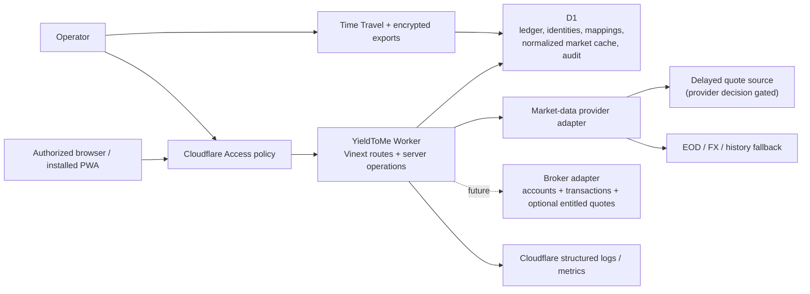
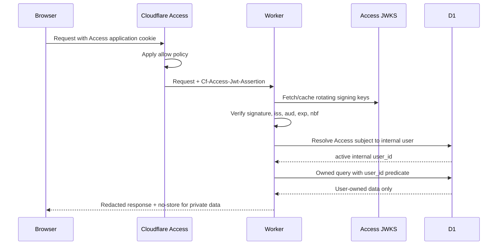

# YieldToMe architecture

Status: foundation decision  
Date: 2026-07-28

## 1. Executive decision

Build a single Cloudflare Worker application using Vinext’s Next-compatible App Router, React, and TypeScript. Use D1 as the system of record and initial normalized market-data cache. Put Cloudflare Access in front of the deployment, then validate its JWT again inside the Worker and map it to an internal user. Keep all portfolio operations server-side and owner-scoped.

Do not add R2, KV, Queues, Durable Objects, or an independent auth vendor in the first implementation slice. Add each only when its documented trigger occurs.

## 2. Context



Trust boundaries:

1. The browser is untrusted, including IDs and calculated values it submits.
2. Cloudflare Access is the outer gateway, not the application authorization layer.
3. The Worker is the policy and calculation boundary.
4. D1 constraints protect relational integrity but do not provide tenant row-level security.
5. Provider data is untrusted external input and may be stale, corrected, delayed, or contractually restricted.

## 3. Application stack

### Runtime and UI

- Vinext `0.0.50` foundation using the Next-compatible App Router.
- React `19.2` and TypeScript `5.9` in strict mode.
- Cloudflare Workers runtime and static assets.
- Server-rendered pages for initial navigation; client components only for interaction that needs browser state.
- CSS design tokens and responsive layout derived from the supplied visual style guide.
- Progressive web app metadata plus a deliberately limited service worker.

Version pins describe the scaffold date, not a perpetual latest-version promise. Dependency upgrades require build/test confirmation and a task.

### Persistence

- Cloudflare D1 / SQLite-compatible SQL.
- Drizzle schema and migrations for type-safe application access.
- Decimal financial values stored as canonical decimal text and parsed by a decimal library when calculation work begins.
- UTC ISO-8601 instants for events; separate `local_date` and IANA timezone where market/accounting dates matter.
- Public opaque IDs (UUIDv7/ULID-style text) rather than sequential row IDs in URLs.
- User settings define a home currency. Native transaction/security facts remain native; home-currency cost/value projections and snapshots are the canonical reporting amounts.

### Server operations

- Route handlers or server actions only behind the shared authenticated request context.
- A repository/service boundary receives the derived internal `user_id`; data functions do not accept a free-form owner ID from the client.
- Financial calculations live in pure domain modules with deterministic fixtures.
- Provider adapters normalize into domain records before persistence.

## 4. Request and authorization flow



### What Cloudflare Access provides

- Authentication through configured identity providers or one-time PIN.
- Administrator-controlled allow/deny policies and session gateway.
- An application JWT containing authenticated identity claims.
- Useful coarse offboarding at the edge.

### What it does not provide

- Application registration, account recovery, profile administration, acceptance of product terms, deletion workflow, household membership, or billing.
- Row-level portfolio authorization.
- Protection against a Worker/origin that trusts spoofable headers.
- A stable application data model by email alone.

Conclusion: Access is enough for a private, administrator-invited first version. It is not enough for a public or self-service SaaS. If the product later needs public registration or organization membership, introduce an application identity/session layer behind Access or replace the outer-only model through a recorded decision.

### Identity rules

- Validate `Cf-Access-Jwt-Assertion`, not merely the cookie or email header.
- Fetch JWKS from the configured team domain and support signing-key rotation.
- Validate the application audience, issuer, timestamps, and accepted token type.
- Map `(access_issuer, access_subject)` to an internal user. Email is contact/display metadata.
- Treat subject reuse/change defensively. Cloudflare documents that a subject can change if a user is removed/re-added or authenticates through a different organization.
- Reject service-token identities from interactive flows.
- After identity verification, check internal status (`active`, `disabled`, `deletion_pending`) on each session/request boundary.

### Local development

The development identity adapter may accept an explicit local fixture only when all of these are true:

- runtime is local development;
- an opt-in `LOCAL_AUTH_USER` value is set;
- host is loopback;
- production/preview environment markers are absent.

It must fail closed in preview and production. Tests use signed fixture JWTs or a test identity object injected below the verification boundary.

### CSRF and browser security

- Prefer same-origin mutations.
- Check `Origin` and `Sec-Fetch-Site` for state-changing browser requests.
- Use POST/PATCH/DELETE with JSON/form content types; GET is read-only.
- Add a synchronizer/double-submit CSRF token if the final Access cookie policy permits cross-site credential attachment.
- Require idempotency keys for import commit, reversal, provider refresh, and deletion jobs.
- Set private pages/API responses to `Cache-Control: private, no-store`.
- Use a restrictive Content Security Policy, `frame-ancestors 'none'`, `Referrer-Policy`, MIME sniffing protection, and a permissions policy.

## 5. Tenant isolation pattern

D1 has no application row-level-security policy. Isolation is enforced by query shape, schema relationships, and tests:

- `users.id` is the internal tenant principal.
- `portfolios` contains `user_id`.
- High-risk child tables also denormalize `user_id` and use composite foreign keys such as `(portfolio_id, user_id) -> portfolios(id, user_id)`.
- Owned repositories require `{ userId, resourceId }`.
- Queries join/predicate by both values in one SQL statement, avoiding a check-then-use race.
- Unique/index keys begin with `user_id` or `portfolio_id` where access patterns do.
- Audit and logs record actor and target opaque IDs, not full financial payloads.

Shared reference tables (`currencies`, `exchanges`, canonical securities) contain no user financial state. User-specific mappings, watch status, overrides, and transactions remain owned.

## 6. Domain module boundaries

```text
app/
  (public)/                 metadata/offline-safe shell
  (protected)/              authenticated portfolio routes
  api/                      narrow HTTP boundaries
domain/
  auth/                     Access verification + identity mapping
  ledger/                   transactions, cash, reversals
  lots/                     FIFO projections and matches
  market-data/              provider interfaces + normalization
  calculations/             pure decimal calculations
  dividends/                events, receipts, forecasts
  imports/                  versioned parsers and staged workflow
  snapshots/                deterministic daily projections
db/
  schema.ts                 Drizzle schema
  repositories/             owner-scoped persistence
  migrations/               generated/reviewed SQL
worker/
  index.ts                  Cloudflare entry/bindings
```

This is the intended boundary, not a requirement to create empty directories now.

## 7. Market-data architecture

The detailed, date-stamped provider comparison, first-provider decision, licensing gate, cost envelope, cache/refresh lifecycle, FX rules, and adapter contract are normative in `MARKET_DATA_STRATEGY.md`. This section records the architectural boundary.

### Capability interface

```ts
interface MarketDataProvider {
  capabilities(): ProviderCapabilities;
  searchSecurities(query: SecurityQuery): Promise<SecurityCandidate[]>;
  getDailyPrices(request: DailyPriceRequest): Promise<PriceObservation[]>;
  getLatestObservation(
    request: LatestRequest,
  ): Promise<PriceObservation | null>;
  getFxRates(request: FxRequest): Promise<FxObservation[]>;
  getDividendEvents(request: DividendRequest): Promise<DividendEventInput[]>;
  getSplitEvents(request: SplitRequest): Promise<SplitEventInput[]>;
  getFundamentals?(
    request: FundamentalRequest,
  ): Promise<FundamentalSnapshot | null>;
}
```

Adapters return normalized values and provenance, never UI-ready totals. Capabilities declare supported exchanges, history depth, delay class, adjustment support, rate limits, and licensed-use scope.

### Initial provider decision

Implement delayed-quote capability first against deterministic fixtures, with EOD/history/FX/manual fallbacks. EODHD is the preferred first adapter, but production remains blocked until its commercial display/storage terms are approved.

Do not scrape or depend on undocumented Yahoo Finance endpoints.

Provider comparison as of 2026-07-28:

| Provider      | Useful capability                                                                                        |                                                        Published entry point | Material constraint                                                                                                             | Decision                                                          |
| ------------- | -------------------------------------------------------------------------------------------------------- | ---------------------------------------------------------------------------: | ------------------------------------------------------------------------------------------------------------------------------- | ----------------------------------------------------------------- |
| EODHD         | Advertises delayed ASX plus 60+ global exchanges, EOD/history, adjusted prices, splits/dividends, and FX |       Personal: US$19.99/month EOD; US$99.99 all-in-one; commercial by quote | Personal terms prohibit group display; commercial approval must cover display, exchanges, storage, derived values, and deletion | Preferred first adapter, conditional on written commercial rights |
| Marketstack   | Global EOD, splits/dividends; ASX listed; generic commercial-use tier                                    |                                                          US$9.99/month Basic | FX is not a complete pricing feed; 10-year Basic history; ASX-specific rights still need confirmation                           | Low-cost fallback spike                                           |
| Twelve Data   | Global series, dividends, FX; explicit 20-minute delayed ASX                                             | US$229/month individual Pro or US$499/month business Venture before ASX fees | Basic free does not provide general AU display; ASX add-on/display licensing can be much more expensive                         | Clearest documented delayed candidate                             |
| FMP           | Global EOD/quotes, fundamentals, FX, dividends                                                           |                                             US$149/month Ultimate for global | Global coverage tier cost and separate display/redistribution agreement                                                         | Fundamentals-driven upgrade                                       |
| Alpha Vantage | Daily global/FX and adjusted-history APIs                                                                |                                  Free 25 requests/day; paid per-minute plans | ASX depth unverified; commercial use requires sales agreement                                                                   | Development/fallback research only                                |

Prices and terms change. Revalidate at contracting time. Primary research links:

- Cloudflare Access authorization cookie: <https://developers.cloudflare.com/cloudflare-one/access-controls/applications/http-apps/authorization-cookie/>
- Cloudflare Access JWT validation: <https://developers.cloudflare.com/cloudflare-one/access-controls/applications/http-apps/authorization-cookie/validating-json/>
- EODHD pricing: <https://eodhd.com/pricing>
- EODHD ASX/global commercial coverage: <https://eodhd.com/asx-data>
- EODHD data sources: <https://eodhd.com/financial-apis/our-data-sources-and-data-partners>
- EODHD commercial terms: <https://eodhd.com/financial-apis/commercial-vs-personal-license-use>
- EODHD terms: <https://eodhd.com/financial-apis/terms-conditions>
- EODHD ASX exchange coverage: <https://eodhd.com/financial-apis/exchanges-api-list-of-tickers-and-trading-hours>
- Marketstack pricing: <https://marketstack.com/product>
- Twelve Data pricing: <https://twelvedata.com/pricing>
- Twelve Data ASX support: <https://support.twelvedata.com/en/articles/13001919-australian-equities-market-data>
- ASX delayed-data redistribution: <https://www.asx.com.au/connectivity-and-data/information-services/price-data/delayed-price-data>
- FMP pricing: <https://site.financialmodelingprep.com/developer/docs/pricing>
- Alpha Vantage support/pricing: <https://www.alphavantage.co/support/>

### Ingestion and cache

- Normalize and upsert by provider, mapping, interval, observation timestamp/date, and adjustment state.
- Keep raw payload only transiently for parsing diagnostics; persist a payload hash and selected normalized provenance. Retain raw payloads only if contractually allowed and operationally necessary.
- Apply provider rate limiting and bounded exponential retry with jitter.
- Cache negative lookups briefly to prevent storms.
- Manual user refresh enqueues/request-coalesces a refresh operation; it does not fan out one request per row.
- Scheduled backfill/refresh starts with Cron Triggers calling a bounded worker. Add Queues when a run cannot reliably finish within Worker execution/subrequest limits or needs durable fan-out.
- Do not store provider results in browser/service-worker caches.

### Durable job and concurrency pattern

- Persist a job before returning success for import backfill, market refresh, snapshot rebuild, export, or deletion work.
- Give each logical operation a deterministic idempotency key and at most one active job row for that key/window.
- Workers acquire a bounded lease with a conditional D1 update over status/version/lease expiry; expired leases may be reclaimed.
- Process bounded chunks, commit a high-water mark, and make every retry safe from that mark.
- `ctx.waitUntil` may finish short logging/cache work but is not the sole durability mechanism for financially material work.
- Cron claims ready jobs and respects provider/Worker query budgets. Add Queues only after measurement shows that bounded Cron/request processing cannot meet reliability or latency.
- Concurrent recalculations use calculation version + affected range and coalesce overlapping invalidations; a stale run cannot publish a high-water mark over newer ledger facts.

### Price selection

Selection is deterministic:

1. active user manual override for the requested instant/date;
2. approved delayed observation within its advertised delay/staleness window;
3. approved EOD observation matching adjustment mode and security mapping;
4. prior valid trading-day observation within the permitted staleness window;
5. unavailable.

The chosen observation and fallback reason are included in the calculation explanation.

### Home-currency presentation

- `user_settings.home_currency_code` is the default reporting currency.
- A portfolio stores the effective reporting/home currency used by its projections so calculation versions remain reproducible.
- Security price observations and transaction amounts remain in native currency.
- Holding projections and portfolio snapshots store home-currency basis/value plus the selected FX evidence.
- The native/home menu toggle selects presentation fields only. It never mutates transactions, price observations, quantities, lots, or security currency.
- A historical/native price converted to home currency uses the FX observation selected for that price date.
- Changing home currency is an explicit rebase operation that invalidates/rebuilds derived projections and snapshots; it does not rewrite native ledger facts.

## 8. Future broker synchronization boundary

Broker sync is deferred from v1 but fits the same architecture:

```ts
interface BrokerAdapter {
  authorize(input: BrokerAuthorizationInput): Promise<BrokerConnectionGrant>;
  listAccounts(connection: BrokerConnection): Promise<BrokerAccount[]>;
  syncTransactions(request: BrokerSyncRequest): Promise<BrokerTransactionPage>;
  syncPositions(request: BrokerSyncRequest): Promise<BrokerPositionSnapshot>;
  syncCash(request: BrokerSyncRequest): Promise<BrokerCashSnapshot>;
  getEntitledQuotes?(request: BrokerQuoteRequest): Promise<PriceObservation[]>;
}
```

- `broker_connections` belongs to one internal user and stores only encrypted OAuth/token material. A Worker secret/KMS-style key encrypts credentials; plaintext never enters D1 logs, client code, CSVs, or audit metadata.
- `broker_accounts` maps an external account to one owned portfolio through a composite owner constraint.
- `broker_sync_runs` stores cursor, range, status, lease, counts, and idempotency.
- `external_record_mappings` keys each broker transaction/cash event by broker, account, external ID, and provider version. Corrections create ledger reversals/supersessions.
- Broker transactions enter the same staging/validation/reconciliation path as CSV/manual sources with `source_type = broker_sync`.
- Position snapshots are reconciliation evidence. They flag drift; they do not silently replace ledger-derived holdings.
- Broker quotes, when the connected user’s entitlement and terms allow them, normalize through `MarketDataProvider` and remain scoped to that user/connection.
- Revoking a connection stops sync and deletes/invalidates credentials without deleting already committed ledger facts.

This boundary prevents a later broker integration from requiring a new ledger, holdings model, or UI calculation path.

## 9. Historical-data strategy

Use a hybrid of normalized observations and derived daily snapshots:

- Ledger is source of truth for quantity, cost, and cash.
- Provider daily history is fetched from the earliest relevant transaction date, cached in D1, and refreshed for corrections.
- FX history follows the same date range.
- `portfolio_daily_snapshots` stores reproducible derived totals and coverage, keyed by portfolio, local date, and calculation version.
- A ledger, mapping, corporate-action, override, or historical-data change invalidates the affected date range.
- Recent dates can recompute eagerly; long ranges recompute in bounded chunks.
- Snapshots are disposable projections. They can be rebuilt from ledger + normalized observations + calculation version.

In v1, history is a value series, not a performance claim. It is honest only from the earliest date with complete transactions/cash and sufficient market/FX data. Incomplete imported history receives a visible boundary.

## 10. Cloudflare binding decisions

### D1 — use now

System of record, normalized cache, import staging metadata/rows, projections, audit events, and job state.

### R2 — defer

Do not store original CSVs in v1. Keep file hash, metadata, normalized source rows, and validation results in D1. This minimizes sensitive-file retention. Add encrypted R2 objects only if users require downloadable originals, files exceed practical D1 row staging, or long-term encrypted D1 exports are automated. Use short object retention and per-user object keys.

### KV — defer

Not needed for correctness-sensitive data. Consider only for non-sensitive, eventually consistent configuration/reference caches after measurement. Never use it for authorization, ledgers, idempotency, or current balances.

### Queues — defer

Add for durable provider fan-out, long imports, snapshot backfills, or deletion jobs once synchronous/Cron bounded jobs no longer meet reliability limits.

### Durable Objects — defer

Only consider for strong coordination such as provider-wide rate-limit serialization or collaborative real-time state. D1 idempotency and job leases are sufficient initially.

## 11. PWA and offline architecture

- Web manifest identifies the app and standalone display mode.
- Service worker caches an allowlist of public versioned icon/offline assets.
- Navigation requests use the network; on network failure they return a static offline information page.
- `/api/*`, protected HTML, uploaded content, and any response with authorization/private cache directives are never cached.
- Mutations are not queued offline.
- UI listens for online/offline changes and disables server mutations with an explanation.
- Staleness is data-specific and uses timestamps, not merely browser connectivity.

This intentionally avoids leaving private financial data in a broadly accessible Cache Storage database on a shared device.

## 12. Operational design

### Environments

- Local: local D1, explicit development identity, provider fixtures by default.
- Preview: separate Access application/policy, separate D1, sandbox provider keys, production auth validation.
- Production: least-privilege Access policy, production D1, Worker secrets, rights-approved provider.

Never bind preview to production data.

### Secrets

Worker secrets include Access team issuer/audience and provider API keys. Public environment variables contain only non-sensitive display configuration. Secret values are redacted at logging boundaries and never serialized to client components.

### Observability

Structured events:

- request/auth result and latency;
- owned resource operation outcome;
- import stage counts and failure category;
- provider request capability/status/latency/rate-limit metadata;
- price/FX coverage and staleness aggregate;
- snapshot invalidation/rebuild range;
- calculation version and error category.

Do not log transaction amounts, quantities, CSV contents, tokens, emails, API keys, or full provider payloads. Use request IDs and opaque internal IDs.

### Recovery

- D1 production Time Travel is automatic; current documentation provides up to 30 days on Workers Paid and 7 days on Free.
- Capture a Time Travel bookmark before and after production migrations.
- Nightly/weekly encrypted D1 exports to a separate controlled store are required for retention beyond Time Travel; R2 plus Workflows is the likely Cloudflare-native option when operations are implemented.
- Quarterly restore drill: restore into a non-production database when supported by the workflow, apply/verify schema, check ownership counts and hashes, and run representative calculation fixtures.
- Target initial RPO: 24 hours for long-term export plus Time Travel for recent changes. Target RTO: 4 hours for operator-led restore. Revisit after real usage.

Sources:

- <https://developers.cloudflare.com/d1/reference/time-travel/>
- <https://developers.cloudflare.com/d1/platform/limits/>
- <https://developers.cloudflare.com/d1/sql-api/foreign-keys/>

### Retention

- Ledger/audit: retained while account is active; correction history retained with the fact.
- Original CSV bytes: not retained in v1.
- Normalized import rows and batch evidence: retained until account deletion, subject to a later user-configurable policy.
- Provider cache: retain only within contract; purge on provider termination as required.
- Application logs: short operational window, initially 30 days, redacted.
- Exports: encrypted, access-logged, 35-day rotating operational retention unless a regulatory/business requirement changes it.
- Account deletion: disable immediately, offer/export if requested, then purge owned D1 rows and derived exports within the documented window; retain only legally required minimal audit tombstone.

## 13. Threat summary

| Threat                        | Primary controls                                                              |
| ----------------------------- | ----------------------------------------------------------------------------- |
| Spoofed Access header         | Verify JWT signature/JWKS, issuer, audience, time claims                      |
| Cross-tenant ID guessing      | Opaque IDs, composite ownership predicates/FKs, denial tests                  |
| CSRF                          | Same-origin design, Origin/Sec-Fetch checks, CSRF token as needed             |
| XSS/data exfiltration         | React escaping, CSP, no raw HTML, HttpOnly Access cookie, no SW private cache |
| CSV formula/malware payload   | Parse as data, size/type limits, escape exports, never execute content        |
| Provider poisoning/stale data | Validation, provenance, staleness, outlier flags, manual versioned override   |
| Precision drift               | Decimal strings/library, deterministic rounding, fixtures                     |
| Accidental destructive edit   | Immutable ledger, reversal, audit, idempotency, Time Travel                   |
| Secret leakage                | Worker secrets, redaction, server-only adapters, dependency review            |
| Supply-chain compromise       | Lockfile, pinned dependencies, automated audit/review, minimal packages       |

## 14. Architecture decision triggers

- Add an application auth provider when public signup, delegated invitations, organizations, or user-managed recovery is approved.
- Add R2 when original uploads or long-term encrypted exports are required.
- Add Queues when provider/import/snapshot work cannot complete reliably in bounded requests/Cron.
- Add KV only for measured, non-authoritative read caching.
- Add Durable Objects only for demonstrated strong coordination needs.
- Change market provider when coverage, accuracy, cost, rights, or contractual retention fails the production gate.
- Revisit D1 sharding/partitioning only as database size, write contention, or regional latency approaches measured limits.
- Add broker adapters only through documented OAuth/API integrations with owner-scoped encrypted connections and staged ledger reconciliation; never by screen scraping or storing broker passwords.
