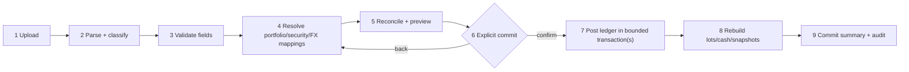

# CSV import specification

Status: normative parser/workflow definition for the supplied export  
Date: 2026-07-28  
Fixture: `docs/Example_Portfolio.csv`

## 1. Observed file

The supplied CSV has:

- one 17-column header;
- 244 physical data rows;
- 65 portfolio-security definition rows;
- 115 transaction rows;
- 64 blank separator rows;
- 101 observed buy transactions and 14 observed sell transactions;
- CRLF/LF/whitespace quirks and a padded `Notes` header;
- FIFO in the `Accounting` field on 13 sell rows;
- 33 zero values in `Purchase Exchange Rate`, treated as missing/unknown;
- at least one `Display Symbol` override (`EPR`);
- date-time strings containing a GMT offset plus a separate transaction-time field.

The sample screens/video and this CSV are independent reference fixtures. Differences in their holdings, quantities, prices, or totals are expected and irrelevant to import semantics.

The supplied 17-column header is the complete supported import contract. Fields not present in that header are outside scope and must not be inferred from visual references.

Counts above are acceptance fixtures and must be re-derived by tests from the exact file rather than hard-coded into production parsing.

## 2. Exact supplied header

The logical 17 fields, after trimming header whitespace, are:

1. `Id`
2. `Symbol`
3. `Name`
4. `Display Symbol`
5. `Exchange`
6. `Portfolio`
7. `Currency`
8. `Shares Owned`
9. `Cost Per Share`
10. `Commission`
11. `Transaction Date`
12. `Transaction Time`
13. `Purchase Exchange Rate`
14. `Type`
15. `Accounting`
16. `Accounting Execution Ids`
17. `Notes`

The physical source header is:

```text
Id,Symbol,Name,Display Symbol,Exchange,Portfolio,Currency,Shares Owned,Cost Per Share,Commission,Transaction Date,Transaction Time,Purchase Exchange Rate,Type,Accounting,Accounting Execution Ids,Notes
```

The actual `Notes` cell has trailing spaces. Matching trims BOM/outer whitespace, collapses internal header whitespace, and compares normalized names. Fields are mapped by name rather than positional index, while parser-version detection records the original order. Missing, duplicate, or unknown logical headers block parsing with a safe header report.

## 3. Field dictionary

| Field                    | Normalized type                                   | Definition-row requirement     | Transaction-row requirement    | Rules                                                                                                              |
| ------------------------ | ------------------------------------------------- | ------------------------------ | ------------------------------ | ------------------------------------------------------------------------------------------------------------------ |
| Id                       | non-empty source string                           | required                       | required                       | trim; file/source-scoped row identity; helps fingerprinting but is not globally unique                             |
| Symbol                   | non-empty string                                  | required                       | required                       | source identifier only; map with exchange/currency, never use as durable identity                                  |
| Name                     | bounded string                                    | optional                       | optional/recommended           | imported display metadata; not unique; provider canonical name may differ                                          |
| Display Symbol           | bounded string                                    | optional                       | optional                       | user-facing override; blank means no override                                                                      |
| Exchange                 | exchange alias                                    | recommended; optional for cash | recommended; optional for cash | normalize through exchange aliases; unresolved listed security blocks commit                                       |
| Portfolio                | non-empty string                                  | required                       | required                       | owner-scoped portfolio mapping key/name; does not itself define home currency                                      |
| Currency                 | currency code                                     | required                       | required                       | native holding/transaction currency; uppercase; must not be silently replaced by home currency                     |
| Shares Owned             | positive decimal                                  | blank                          | required for buy/sell          | normalized transaction quantity; greater than zero; preserve scale                                                 |
| Cost Per Share           | non-negative decimal                              | blank                          | required for buy/sell          | native transaction unit price; zero requires explicit warning/policy                                               |
| Commission               | non-negative decimal                              | blank                          | optional, default `0`          | native transaction currency unless evidence proves otherwise                                                       |
| Transaction Date         | offset-bearing date text                          | blank                          | required                       | parse enumerated format; retain raw value and derived instant/local date                                           |
| Transaction Time         | local time text                                   | blank                          | optional                       | reconcile with date offset/time under documented rule                                                              |
| Purchase Exchange Rate   | positive decimal or missing                       | blank                          | optional                       | source zero becomes unknown; direction must be confirmed/mapped                                                    |
| Type                     | enum                                              | blank                          | required                       | observed `Buy`/`Sell`; normalize case; unknown type blocks                                                         |
| Accounting               | enum                                              | blank                          | optional on sell               | observed `FIFO`; blank may default with warning; unsupported value blocks                                          |
| Accounting Execution Ids | bounded source string/list, semantics unconfirmed | optional                       | optional                       | blank throughout supplied file; preserve raw for round-trip; do not drive lot matching without confirmed semantics |
| Notes                    | bounded string                                    | optional                       | optional                       | preserve content after line-ending normalization; escape on export/display; never execute                          |

The importer never silently supplies an exchange, security currency, date timezone, or FX direction from ticker alone.

### Legacy cash pseudo-security

The supplied file’s `AUD=CASH` rows are a versioned legacy encoding, not a listed security:

- a definition row with symbol `<ISO currency>=CASH`, blank exchange, and the same `Currency` may create/map the owned portfolio’s cash account for that currency; it creates no canonical security or quote request;
- a matching transaction requires unit price exactly `1`, zero/blank commission, quantity as the cash amount, and no conflicting security fields;
- `Buy` normalizes to `cash_deposit`; `Sell` normalizes to `cash_withdrawal`;
- the original symbol/type/price remain in import provenance;
- any other `=CASH` shape blocks with `CASH_ENCODING_INVALID` rather than being guessed.

This compatibility rule applies only to this parser version. Native YieldToMe ledger events use explicit cash transaction types.

## 4. Row grammar

Parsing first preserves every physical row and all original field strings.

### Blank row

All logical fields are empty after trimming. Record it as `blank` for diagnostics and ignore on commit.

### Portfolio-security definition row

Required:

- non-empty `Id`, `Symbol`, `Portfolio`, and `Currency`;
- blank `Type`, `Transaction Date`, `Shares Owned`, and `Cost Per Share`;
- `Accounting` blank;
- no contradictory security/trade values.

Creates/maps the owned portfolio and its portfolio-security membership, including watch-only symbols. It creates no quantity, cash, cost, or transaction. Definition order does not grant ownership outside the authenticated import batch.

### Transaction row

Required:

- non-empty `Id`, `Symbol`, `Portfolio`, and `Currency`;
- supported `Type`;
- valid `Transaction Date`;
- valid positive `Shares Owned` and valid `Cost Per Share` for buy/sell;
- resolvable security candidate from symbol + exchange + currency context;
- supported/blank `Accounting` under the transaction rule.

Portfolio/security reference fields repeat definition data; batch conflicts are errors, not last-write-wins. A transaction appearing without a definition row can be staged with a warning, but no implicit cross-user mapping is allowed.

The legacy cash shape above follows the same physical transaction grammar but maps to a cash account/event instead of a portfolio security, lot, or holding.

### Unsupported row

Any nonblank row that satisfies none or multiple row grammars. It remains staged with issues and cannot be committed until the parser version or mapping decision resolves it.

Classification must use row content, never “last seen row type” alone.

## 5. Date and timezone normalization

1. Preserve original date and time strings.
2. Parse only enumerated formats observed in fixtures.
3. If `Transaction Date` carries a numeric/GMT offset, that offset determines the instant.
4. If separate `Transaction Time` supplies a time absent from the date field, combine it under the explicit offset/portfolio timezone rule.
5. If both contain time and disagree, emit `DATE_TIME_CONFLICT` and block commit unless user resolves it.
6. Derive `trade_at` in UTC and `local_trade_date` in portfolio timezone.
7. DST ambiguity without an explicit offset blocks automatic commit.

No environment-locale date parsing is allowed.

## 6. FX interpretation

The column name `Purchase Exchange Rate` does not establish direction. During mapping/preview, show:

- transaction/security currency;
- user home/reporting currency;
- source value;
- assumed equation.

The selected v1 normalized convention is:

`base amount = native amount × fx_rate_to_base`

If source examples prove the exported rate is inverse, invert with decimal arithmetic and retain:

- original rate;
- original direction;
- transformation version;
- normalized rate.

Source zero becomes missing with `FX_ZERO_TREATED_AS_UNKNOWN`. It does not block native ledger import but blocks dependent base-basis/realised calculations until resolved.

## 7. Upload constraints and safety

- Authenticated owner only.
- `.csv` extension is advisory; validate content as bounded text.
- Initial size limit: 10 MiB and 100,000 physical rows; make configurable. This release contract requires a Workers Paid production deployment because Workers Free cannot guarantee the parse/normalize/hash workload within its 10 ms CPU limit.
- A deployment configured as Workers Free rejects CSV import before reading the body. Enabling a smaller Free limit requires a separate Worker-runtime benchmark and a documented configuration profile.
- Stream/bounded parse; reject NUL/binary content and pathological field sizes.
- Support UTF-8 with optional BOM. Non-UTF-8 requires explicit future encoding support.
- Do not evaluate spreadsheet formulas, HTML, Markdown, URLs, or note content.
- Escape formula-leading characters on any later CSV export.
- Sanitize filename for display; never use it as an object path.
- Store SHA-256, size, parser version, and normalized rows; do not retain original bytes in v1.
- Redact raw values from operational logs.

## 8. Staged workflow



### Stage 1 — Upload

Create `import_batch` with owner, metadata, SHA-256, and parser version. Exact duplicate upload is reported before parsing if prior batch status allows.

### Stage 2 — Parse/classify

Normalize header, retain physical row number, preserve original strings, and classify each row. No domain records change.

### Stage 3 — Validate

Emit stable field/row issue codes. Separate:

- error: blocks affected row/batch commit;
- warning: requires visibility and sometimes acknowledgement;
- info: normalization disclosure.

### Stage 4 — Map

Resolve:

- `Portfolio` source name to a new/existing owned portfolio;
- currency/exchange aliases;
- security using exchange + symbol + currency + name/identifier evidence;
- FX direction/missing value;
- `Accounting` method and any confirmed execution-ID semantics.

Candidate confidence can sort options but cannot auto-merge ambiguous securities.

### Stage 5 — Reconcile/preview

Show:

- portfolios/securities to create or map;
- transaction counts and date range;
- buys/sells, quantities, fees/costs, and currencies;
- duplicates/skips;
- missing FX/basis warnings;
- oversells or negative cash effects;
- before/after holding quantities where meaningful;
- calculation coverage consequences.

The user must be able to download/copy an issue report without source formulas executing.

### Stage 6 — Commit

Require explicit confirmation and unique idempotency key. Reconstruct the owner-scoped reconciliation on the server and require an exact digest of its parser, rows, issues, mapping versions, owned portfolios, security memberships, and preview result. A version-shaped token is insufficient. The conditional transition to `committing` guards the row/issue/mapping counts and version totals so a concurrent review change leaves the batch `ready` and forces a new preview. Mapping writes fail once the transition wins.

### Stage 7 — Post

For each bounded chunk:

- atomically create/update authorized portfolio/reference links;
- create immutable ledger/source records;
- create cash effects;
- link each result to import row/batch;
- store commit high-water mark and audit event.

The validated row-level portfolio/security target and FX direction are the only mapping result consumed by posting. Persist durable target IDs in the same bounded unit as their ledger effect; never resolve them again from display symbols during posting. Process at most one chunk per Worker invocation so the 50-query invocation budget, 50-statement atomic-unit budget, and 100-parameter-per-query bound remain enforceable.

If the entire batch cannot be one D1 transaction, status and chunk idempotency must allow resume without duplicate effects. Batch becomes `committed` only after every intended row and rebuild job is durably recorded.

### Stage 8 — Rebuild

For every affected owned portfolio, derive the imported effective-date range and the current real ledger high-water transaction ID. Durably create one idempotent rebuild request per portfolio before marking the batch committed. Rebuild FIFO lots, holdings, cash reconciliation, and affected snapshots from the earliest imported effective date; a synthetic import row marker is not a ledger high-water value.

### Stage 9 — Summary

Show committed/skipped counts, warnings that remain, coverage impacts, and reversal action.

Import history is private, owner-scoped, and non-cacheable. Batch detail returns source rows, issues, mapping decisions, and audit events in fixed-size pages rather than loading the complete file into one Worker response. When status remains `committing`, detail also returns the durable physical-row high-water, committed/skipped/remaining counts, and the stored commit idempotency key; the resume action must reuse that key and must continue to label the batch incomplete until finalization is durable.

## 9. Issue code baseline

| Code                         | Severity | Meaning                                                  |
| ---------------------------- | -------- | -------------------------------------------------------- |
| `HEADER_MISMATCH`            | error    | logical header differs from supported 17-column version  |
| `COLUMN_COUNT`               | error    | row field count cannot be safely reconciled              |
| `ROW_UNCLASSIFIED`           | error    | nonblank row matches no grammar                          |
| `ROW_AMBIGUOUS`              | error    | row matches conflicting grammars                         |
| `PORTFOLIO_MISSING`          | error    | transaction has no definition/mapping                    |
| `PORTFOLIO_CONFLICT`         | error    | repeated name/currency/method conflict                   |
| `CURRENCY_UNKNOWN`           | error    | unsupported currency                                     |
| `EXCHANGE_UNRESOLVED`        | error    | exchange alias cannot map                                |
| `SECURITY_UNRESOLVED`        | error    | no confirmed canonical security                          |
| `SECURITY_AMBIGUOUS`         | error    | multiple candidates                                      |
| `TRANSACTION_TYPE_UNKNOWN`   | error    | unsupported type                                         |
| `DATE_INVALID`               | error    | not an enumerated date format                            |
| `DATE_TIME_CONFLICT`         | error    | embedded/separate times disagree                         |
| `QUANTITY_INVALID`           | error    | missing/nonpositive buy/sell quantity                    |
| `PRICE_INVALID`              | error    | missing/invalid price                                    |
| `FX_ZERO_TREATED_AS_UNKNOWN` | warning  | source zero normalized to missing                        |
| `FX_DIRECTION_UNCONFIRMED`   | error    | base/native interpretation unresolved                    |
| `FEE_INVALID`                | error    | negative/invalid cost                                    |
| `ACCOUNTING_UNSUPPORTED`     | error    | method is not FIFO                                       |
| `DUPLICATE_EXACT`            | info     | exact normalized row already committed                   |
| `DUPLICATE_POSSIBLE`         | warning  | close semantic match needs decision                      |
| `OVERSELL`                   | error    | sells exceed available mapped lots                       |
| `HISTORY_INCOMPLETE`         | warning  | import lacks opening cash/basis/history                  |
| `DISPLAY_SYMBOL_OVERRIDE`    | info     | display symbol differs from canonical map                |
| `CASH_ENCODING_INVALID`      | error    | legacy `=CASH` row violates the exact compatibility rule |

## 10. Idempotency and duplicate detection

### File identity

`file fingerprint = SHA-256(exact uploaded bytes)`

Same owner + fingerprint + parser version finds exact uploads. The user can inspect the existing batch rather than create ledger effects again.

### Row identity

Create a versioned canonical serialization after mapping:

`portfolio target | Type | security target | UTC trade instant | Shares Owned | Cost Per Share | Currency | Commission | source Id | Accounting | Accounting Execution Ids | Notes normalization`

Hash it with parser/fingerprint version. The fingerprint excludes cosmetic source whitespace but includes values that change financial effect.

Rules:

- exact committed fingerprint in the same portfolio: skip/report by default;
- close match: require user decision;
- duplicates within batch: block or explicitly deduplicate;
- security definition duplicates merge only when canonical target and nonconflicting values match.

### Commit identity

Unique `(batch_id, commit_idempotency_key)`. A repeated request returns the original outcome. Chunk keys derive from batch + stable chunk sequence and do not depend on retry timing.

## 11. Mapping corrections

Before commit, a decision edits only staged target fields.

After commit:

1. Create a new mapping-decision version with reason.
2. Identify all affected transactions/portfolio-security rows.
3. In one controlled operation, supersede/relink allowed facts or reverse/repost when security identity changes financial projections.
4. Invalidate lots/snapshots from earliest affected date.
5. Record audit event and before/after counts.

Never update a canonical global security because one user corrects a display label. Shared master-data changes require separate verified evidence.

## 12. Batch reversal and corrected re-import

Reversal is an explicit, idempotent operation:

1. Confirm owner, batch status, and impact.
2. Block or require a plan if later manual/other imported facts depend on lots created by this batch. Dependency ordering uses the stable ledger key `(trade_at, transaction_id)`, including when two facts share a timestamp.
3. Mark original transactions reversed through compensating/superseding ledger records.
4. Reverse linked cash entries and receipts.
5. Expire portfolio-specific relationships created only by the batch when unused.
6. Retain batch, rows, mappings, and audit.
7. Rebuild from earliest affected date.
8. Mark batch `reversed`.

A corrected file creates a new batch with `supersedes_batch_id`; it never mutates the original batch.
Each authenticated reversal request passes same-origin mutation checks and processes at most one configured transaction chunk. The chunk-size ceiling keeps its query count, total and per-atomic-unit statement counts, and bound parameters within the declared D1 limits; retries resume through the stored batch state and idempotency key.

## 13. Reconciliation

Commit acceptance checks:

- transaction counts by type match preview;
- buy/sell quantities match normalized rows;
- commissions sum by currency;
- no unintended oversell;
- holding quantity equals ledger projection;
- lot quantities reconcile;
- every financial transaction has expected cash effect or an explicit `cash_history_incomplete` exception;
- the four supplied `AUD=CASH` transactions produce cash events only and no security lots/market-data requests;
- all committed rows link to a resulting fact or explicit skip reason;
- portfolio home/reporting currency and accounting conflicts are resolved;
- audit count and batch status are consistent.

Imported CSV does not appear to contain deposits, dividend receipts, settlement dates, all corporate actions, or reliable FX for every transaction. Therefore cash balances, realised base gains, income, and full historical performance may remain incomplete. The UI must state that boundary.

## 14. Unknown-header policy

If a file does not match the confirmed 17-column signature:

- retain upload metadata;
- return `HEADER_MISMATCH` with the observed header names/count;
- do not discard, reposition, or guess fields;
- do not pass it into the 17-column parser;
- require an explicit, separately versioned schema decision before support is added.

Parser selection is by exact normalized header signature, not field count alone.
