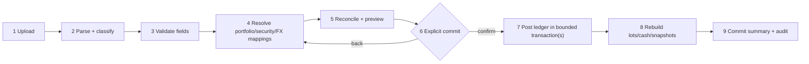

# CSV import specification

Status: normative parser/workflow definition for the supplied export  
Date: 2026-07-28  
Fixture: `docs/Example_Portfolio.csv`

## 1. Observed file

The supplied CSV has:

- one 17-column header;
- 244 physical data rows;
- 65 portfolio-security definition rows;
- 115 transaction rows;
- 64 blank separator rows;
- 101 observed buy transactions and 14 observed sell transactions;
- CRLF/LF/whitespace quirks and a padded `Notes` header;
- FIFO in the `Accounting` field on 13 sell rows;
- 33 zero values in `Purchase Exchange Rate`, treated as missing/unknown;
- at least one `Display Symbol` override (`EPR`);
- date-time strings containing a GMT offset plus a separate transaction-time field.

The sample screens/video and this CSV are independent reference fixtures. Differences in their holdings, quantities, prices, or totals are expected and irrelevant to import semantics.

The supplied 17-column header is the complete supported import contract. Fields not present in that header are outside scope and must not be inferred from visual references.

Counts above are acceptance fixtures and must be re-derived by tests from the exact file rather than hard-coded into production parsing.

## 2. Exact supplied header

The logical 17 fields, after trimming header whitespace, are:

1. `Id`
2. `Symbol`
3. `Name`
4. `Display Symbol`
5. `Exchange`
6. `Portfolio`
7. `Currency`
8. `Shares Owned`
9. `Cost Per Share`
10. `Commission`
11. `Transaction Date`
12. `Transaction Time`
13. `Purchase Exchange Rate`
14. `Type`
15. `Accounting`
16. `Accounting Execution Ids`
17. `Notes`

The physical source header is:

```text
Id,Symbol,Name,Display Symbol,Exchange,Portfolio,Currency,Shares Owned,Cost Per Share,Commission,Transaction Date,Transaction Time,Purchase Exchange Rate,Type,Accounting,Accounting Execution Ids,Notes
```

The actual `Notes` cell has trailing spaces. Matching trims BOM/outer whitespace, collapses internal header whitespace, and compares normalized names. Fields are mapped by name rather than positional index, while parser-version detection records the original order. Missing, duplicate, or unknown logical headers block parsing with a safe header report.

## 3. Field dictionary

| Field                    | Normalized type                                   | Definition-row requirement     | Transaction-row requirement    | Rules                                                                                                              |
| ------------------------ | ------------------------------------------------- | ------------------------------ | ------------------------------ | ------------------------------------------------------------------------------------------------------------------ |
| Id                       | non-empty source string                           | required                       | required                       | trim; file/source-scoped row identity; helps fingerprinting but is not globally unique                             |
| Symbol                   | non-empty string                                  | required                       | required                       | source identifier only; map with exchange/currency, never use as durable identity                                  |
| Name                     | bounded string                                    | optional                       | optional/recommended           | imported display metadata; not unique; provider canonical name may differ                                          |
| Display Symbol           | bounded string                                    | optional                       | optional                       | user-facing override; blank means no override                                                                      |
| Exchange                 | exchange alias                                    | recommended; optional for cash | recommended; optional for cash | normalize through exchange aliases; unresolved listed security blocks commit                                       |
| Portfolio                | non-empty string                                  | required                       | required                       | owner-scoped portfolio mapping key/name; does not itself define home currency                                      |
| Currency                 | currency code                                     | required                       | required                       | native holding/transaction currency; uppercase; must not be silently replaced by home currency                     |
| Shares Owned             | positive decimal                                  | blank                          | required for buy/sell          | normalized transaction quantity; greater than zero; preserve scale                                                 |
| Cost Per Share           | non-negative decimal                              | blank                          | required for buy/sell          | native transaction unit price; zero requires explicit warning/policy                                               |
| Commission               | non-negative decimal                              | blank                          | optional, default `0`          | native transaction currency unless evidence proves otherwise                                                       |
| Transaction Date         | offset-bearing date text                          | blank                          | required                       | parse enumerated format; retain raw value and derived instant/local date                                           |
| Transaction Time         | local time text                                   | blank                          | optional                       | reconcile with date offset/time under documented rule                                                              |
| Purchase Exchange Rate   | positive decimal or missing                       | blank                          | optional                       | source zero becomes unknown; direction must be confirmed/mapped                                                    |
| Type                     | enum                                              | blank                          | required                       | observed `Buy`/`Sell`; normalize case; unknown type blocks                                                         |
| Accounting               | enum                                              | blank                          | optional on sell               | observed `FIFO`; blank may default with warning; unsupported value blocks                                          |
| Accounting Execution Ids | bounded source string/list, semantics unconfirmed | optional                       | optional                       | blank throughout supplied file; preserve raw for round-trip; do not drive lot matching without confirmed semantics |
| Notes                    | bounded string                                    | optional                       | optional                       | preserve content after line-ending normalization; escape on export/display; never execute                          |

The importer never silently supplies an exchange, security currency, date timezone, or FX direction from ticker alone.

### Legacy cash pseudo-security

The supplied file’s `AUD=CASH` rows are a versioned legacy encoding, not a listed security:

- a definition row with symbol `<ISO currency>=CASH`, blank exchange, and the same `Currency` may create/map the owned portfolio’s cash account for that currency; it creates no canonical security or quote request;
- a matching transaction requires unit price exactly `1`, zero/blank commission, quantity as the cash amount, and no conflicting security fields;
- `Buy` normalizes to `cash_deposit`; `Sell` normalizes to `cash_withdrawal`;
- the original symbol/type/price remain in import provenance;
- any other `=CASH` shape blocks with `CASH_ENCODING_INVALID` rather than being guessed.

This compatibility rule applies only to this parser version. Native YieldToMe ledger events use explicit cash transaction types.

### Dividend-receipt rows (TASKS.md `IMP-006` task; requirement `IMP-007` -- the requirement id `IMP-006` was already taken by "Alternative CSV variants (deprecated)" above, so this feature's requirement is `IMP-007`, per AGENTS.md's "preserve stable requirement IDs, never reuse")

A second, backward-compatible header version supports dividend-receipt rows in the same staged import pipeline as trades: `strict-18-column-dividends-v1`, which is the exact 17-column header from §2 plus one trailing column, `Franking Credit Per Share`. Both parser versions remain permanently supported and are selected by exact header signature match (§14) -- an ordinary 17-column trade-only export keeps parsing under `strict-17-column-v1` unchanged; a `Type` value of `Dividend` is accepted under either header version, but franking data can only be supplied through the 18-column header (a `Dividend` row under the 17-column header always has unknown franking).

Column mapping for a `Dividend` row reuses the trade columns with dividend-specific meaning, so no other new columns are needed:

| Column                                               | Dividend-row meaning                                                                                                                                                                                                                                            |
| ---------------------------------------------------- | --------------------------------------------------------------------------------------------------------------------------------------------------------------------------------------------------------------------------------------------------------------- |
| `Symbol`/`Exchange`/`Currency`                       | Resolves the security exactly like a trade row (same candidate-matching rules, same `SECURITY_UNRESOLVED`-equivalent blocking issue: `SECURITY_MAPPING_REQUIRED`)                                                                                               |
| `Transaction Date`                                   | The dividend's **payment date** (same offset/timezone parsing as trades; `Transaction Time` is optional and ignored -- payment date is a calendar date, not an instant)                                                                                         |
| `Shares Owned`                                       | Shares the receipt is calculated against                                                                                                                                                                                                                        |
| `Cost Per Share`                                     | Dividend per share (native currency); must be a positive decimal -- zero is rejected (`DIVIDEND_PER_SHARE_INVALID`) since a $0 dividend is not a fact worth importing                                                                                           |
| `Franking Credit Per Share`                          | Franking credit per share (native currency), **optional**. Blank/absent = unknown, never zero (`FRANKING_INVALID` blocks a present-but-malformed or negative value; a genuinely-supplied `0` is preserved as an explicit unfranked fact, distinct from unknown) |
| `Commission`, `Purchase Exchange Rate`, `Accounting` | Unused/ignored for `Dividend` rows -- dividend rows never resolve FX at import time (see below) and never touch cost basis/lots                                                                                                                                 |

A `Dividend` row is staged/classified/previewed through the identical `transaction`-class pipeline as a trade row (same `import_rows.row_class = 'transaction'`), so no new resolution-card type exists for the reviewer UI: portfolio and security mapping decisions, and the `SECURITY_MAPPING_REQUIRED`/`SECURITY_MAPPING_AMBIGUOUS` blocking issues, all work exactly as they do for trades. The one deliberate difference is FX: because `dividend_manual_records` (see below) stores native per-share amounts only, a `Dividend` row never triggers `FX_DIRECTION_REQUIRED`/`FX_RATE_INCOMPLETE` and never consumes `Purchase Exchange Rate`. The reconciliation preview reports dividend rows in a separate `counts.dividendCreates` figure alongside `counts.transactionCreates`, and the parse summary reports a separate `summary.dividendRows` count alongside `summary.transactionRows`.

**Why `dividend_manual_records`, not `dividend_receipts`, on commit.** `dividend_receipts` (DB-005) requires a NOT NULL `dividend_event_id` foreign key to the shared, provider-populated `dividend_events` table (MKT-005). The importer has no safe way to fabricate or guess that a specific provider corporate-action event exists for an arbitrary broker CSV row, and requiring one to already exist would make dividend import fail whenever the configured provider has not ingested that exact event -- defeating the point of an import path whose purpose is filling gaps the provider missed. `dividend_manual_records` is DIV-001's own table for exactly this case ("a security/payment the provider never surfaced as an event").

**Precedence (DIV-004, 2026-08-13 -- restores the full ordering).** DIV-001's read-time derivation (`domain/dividends/history.ts`) has FIVE distinct tiers, highest first: override > manual (owner-typed) > receipt > imported > auto-derived (matching `docs/CALCULATIONS.md` §11's numbered list exactly). A CSV-imported row is a `dividend_manual_records` row with `import_batch_id` set; this is the SOLE signal the derivation uses to place it in the `imported` tier, strictly below an owner-typed manual record (`import_batch_id IS NULL`) and below a `dividend_receipts` row (actual payment evidence). Proximity dedupe (DIV-001's `PROXIMITY_WINDOW_DAYS`, 7 days) works ACROSS these tiers: an imported row that proximity-matches the same provider event as an owner-typed manual record or a receipt is consumed into that higher-tier row rather than producing a second row -- its values stay visible via the row's `dominatedImported` field, never silently dropped. The same collapse applies when neither fact is attached to a provider event: an imported row is matched directly against every standalone owner-typed manual record and standalone/orphan receipt for the security before it is allowed to become its own standalone row, so a CSV re-entry of a dividend the owner already typed by hand collapses to ONE row (owner wins) instead of two. An imported row that matches neither an event nor an owner fact wins its own row with `source: "imported"` -- still ranked above the provider's own auto-derived figure (an imported row is real evidence the provider never surfaced as an event). See `docs/CALCULATIONS.md` §11's "Derived dividend history" subsection for the full per-tier resolution algorithm.

**Preview-time near-duplicate warning (DIV-004).** Before commit, the reconciliation preview (`domain/imports/reconciliation.ts`) checks every incoming `Dividend` row, once its security has resolved, against the owner's EXISTING persisted dividend facts for that same security: non-superseded manual records (any route/batch -- see the BUG-013 correction below) and receipts, loaded by the caller (`app/import-actions.ts`'s `loadReview`). A row whose payment date falls within the same `PROXIMITY_WINDOW_DAYS` (7-day) window as an existing fact raises `DIVIDEND_NEAR_EXISTING_ENTRY`, a **warning-severity** issue -- it never blocks readiness or commit, exactly like `FRANKING_ON_NON_DIVIDEND`, because it is a proximity heuristic flagging a PROBABLE duplicate for the owner to check, not a certain one. **BUG-013 CORRECTION (2026-09-02):** this check previously excluded a nearby PREVIOUSLY-IMPORTED row (`import_batch_id` already set) on the premise that "an imported-vs-imported near match is cross-batch dedupe's job." That premise was FALSE and was this task's confirmed root cause -- see the "Cross-route dividend duplicate warning (`BUG-013`)" entry below for the full defect and fix. The filter is now `superseded_by_record_id IS NULL` only (no `import_batch_id` restriction), so an imported row is visible to this proximity check too.

**`DIVIDEND_NEAR_EXISTING_ENTRY` is advisory display evidence, excluded from `previewVersion` hashing (Orchestrator ruling, review round 1 BLOCKING B1 fix).** `evidence.existingDividendEntries` is supplied only by the page/refresh preview path; the ready-service, security-verification-service, and import-commit revalidation paths call `buildImportReview` (`domain/imports/review.ts`) without it, since the warning never gates readiness or commit. If the warning's presence changed the hashed `previewVersion`, those paths would compute a DIFFERENT version than the one the page rendered and echoed back as `expectedPreviewVersion`, permanently 409ing an affected batch's ready/commit with no recovery path. `buildImportReview` therefore excludes `DIVIDEND_NEAR_EXISTING_ENTRY` from the hash input by construction (filtered out of the preview snapshot before hashing, still present in the returned preview for rendering) so `previewVersion` is identical whether or not the warning fires. A practical consequence: an owner-typed manual record added in another tab does not invalidate an already-open preview's version -- intended, since the warning is advisory and does not change what would actually commit.

**Schema addition.** `dividend_manual_records` gained two nullable, FK-less columns for this: `import_batch_id` (which batch created the row, for reversal) and `source_reference` (the same `import-fingerprint:<row fingerprint>` idempotency key trades store on `transactions.source_reference`), plus a unique index on `(portfolio_id, source_reference)`. Both are `ALTER TABLE ADD COLUMN`s (no table rebuild), added FK-less to mirror the existing precedent of `import_rows.commit_transaction_id`/`transactions.source_reference` (neither of which carry a formal FK either); ownership and target validity are checked procedurally at commit time before the insert, the same way every other import-commit target is. Rows created by the manual-entry UI (not import) leave both columns `NULL`.

**Idempotency and duplicate detection.** A `Dividend` row's natural key is the same versioned fingerprint scheme trades use (§10 "Row identity"), extended to include the franking column; the resulting `import-fingerprint:<fingerprint>` value is stored as `dividend_manual_records.source_reference` exactly as trades store it on `transactions.source_reference`. A second import (same batch resumed, or a different batch re-exporting the identical source row -- same `Id` and same normalized values) is detected by looking up that value before inserting: an existing match causes the row to be skipped and linked (`import_rows.commit_transaction_id`) to the existing manual record's id, never a duplicate insert.

**Cross-route trade duplicate warning (`BUG-011`, 2026-09-02).** Trade dedupe at commit is keyed on `source_reference` ONLY, and the two import routes mint structurally disjoint key spaces that can never collide: CSV import hashes normalized row fields into `import-fingerprint:<sha256>` while Sharesight sync uses `import-fingerprint:sharesight-trade:<id>` (below). A real-world trade already imported through one route therefore commits AGAIN, undetected, if it is later imported through the other -- confirmed by code reading; a production check on 2026-09-02 found the defect had not yet fired on the owner's account (the account's only prior import was a `portfolio-bundle-json` restore, which preserves `source_reference` verbatim, so Sharesight keys matched and dedupe worked by coincidence). The fix is a preview-time, warning-severity `TRADE_NEAR_EXISTING_ENTRY` issue (`domain/imports/reconciliation.ts`), the trade analog of `DIVIDEND_NEAR_EXISTING_ENTRY` above: an incoming `buy`/`sell` row whose resolved security, type, local trade date, and decimal-string-normalized quantity/price (`"100"`/`"100.00"`/`"100.000"` compare equal; never binary floating point, per AGENTS.md) exactly match an existing POSTED transaction anywhere in the owner's account (any portfolio, any source route, loaded by `app/import-actions.ts`'s `loadReview`) raises the warning -- per-portfolio correctness is enforced downstream by the row's own resolved portfolio-security identity, not by scoping this comparison set to a portfolio (see the F2 correction just below). **Deliberately never an automatic skip or block** -- readiness and commit are unaffected, and the row still imports normally if the owner proceeds: the SAME production check that confirmed this account was unaffected also found two GENUINELY DIFFERENT trades sharing this exact identity (same security/date/quantity/price, distinct Sharesight trade ids `347283`/`347285` and `104900`/`104908` -- one parcel filled in two lots), so an automatic skip would have silently dropped a real trade. Like `DIVIDEND_NEAR_EXISTING_ENTRY`, this is advisory display evidence excluded from `previewVersion` hashing (`evidence.existingTradeEntries` is supplied only by the page/refresh preview path) for the identical B1-fix reason given above.

**Review round refinements (F1/F2/F4, same day).** (F1) `status = 'posted'` alone is not enough to exclude a reversal: `ledger.reverse()` re-runs `prepareLedgerPosting` on the ORIGINAL input, so the compensating mirror row it inserts is itself `status = 'posted'`, with the same type/quantity/price/date/security as the reversed trade -- the query also excludes `reverses_transaction_id IS NOT NULL`, or a genuine reverse-then-re-import (this task's own step-2 remediation) would falsely warn against the trade's own reversed self. (F2) The comparison set is capped at `MAX_EXISTING_TRADE_ENTRIES_FOR_DUPLICATE_CHECK` (5,000, `app/import-trade-duplicate-check.ts`) rows; exceeding the cap degrades the check to a visible, info-severity `TRADE_DUPLICATE_CHECK_UNAVAILABLE` issue rather than silently comparing against a truncated (and therefore unreliable) set. (F4) The decimal-string comparison (`decimalEqual`) treats an unparseable value as NOT equal rather than throwing -- defensive only, since every writer today produces canonical decimal strings, but the blast radius of an uncaught throw on this preview path is the whole review page, not just this one warning.

**F2 RULING CORRECTION (same day): the comparison set is user-wide, deliberately NOT scoped to the batch's own target portfolio.** An earlier pass of this fix scoped the query to `batch.target_portfolio_id`, on the assumption that a staged row can only ever reconcile within its own batch's target portfolio. That assumption is false: `portfolioFor` (`domain/imports/reconciliation.ts`) resolves a row's portfolio three ways -- a `kind:"portfolio"` mapping decision's `targetId` (any of the owner's OTHER portfolios; the mapping picker offers every owned portfolio and the save action accepts any owned `targetId`), the row's own `targetPortfolioId`, or a unique portfolio NAME match -- and a batch with no target at all (`target_portfolio_id IS NULL`) still resolves fully by name. Scoping to the batch's own target portfolio therefore produced silent FALSE NEGATIVES for a row that resolves elsewhere -- indistinguishable from a genuine non-match, exactly the failure mode the cap/degrade design above exists to avoid. Reverted to user-wide with no loss of precision: `portfolio_securities.id` is unique per portfolio, and `createImportReconciliationPreview`'s security-candidate resolution already filters candidates by `candidate.portfolioId === portfolio.id`, so a portfolio-A trade can never match a portfolio-B row's resolved membership id regardless of how wide this comparison set is -- per-portfolio correctness is enforced by membership identity downstream, never by this query's `WHERE` clause.

**Dividend path finding (BUG-011 investigation, 2026-09-02): the SAME cross-route gap exists for payouts, and BRK-005C's key format change did NOT close it.** `existingDividendSourceReferences` (used to seed `DIVIDEND_ALREADY_IMPORTED_MANUAL_DUPLICATE`, above) is likewise an exact-string comparison. BRK-005C changed the Sharesight payout key to `sharesight-payout:<sharesightPortfolioId>:<holdingId>:<paidOnDate>` -- an "economic-ish" key in the sense that it is stable across a payout's unconfirmed-to-confirmed transition (fixing that WITHIN-route idempotency bug) -- but a CSV-imported dividend row still keys on `import-fingerprint:<sha256 of normalized fields>`, a structurally disjoint format with no holding id, no portfolio id, and no shared component with the Sharesight key. The two key spaces still cannot collide, so the SAME real distribution imported once by CSV and once by Sharesight sync would commit twice, undetected, exactly like the trade case above. At the time this was written the fix was out of scope (`BUG-011`'s Deliver step 3 covered trades only) and this blind spot was tracked as a follow-up `TASKS.md` item; it was implemented the same day as `BUG-013` -- see immediately below.

**Cross-route dividend duplicate warning (`BUG-013`, 2026-09-02).** The dividend equivalent of `TRADE_NEAR_EXISTING_ENTRY` above, closing the blind spot the preceding paragraph identified. A preview-time, warning-severity `DIVIDEND_MATCHES_EXISTING_ENTRY` issue (`domain/imports/reconciliation.ts`) fires when an incoming `Dividend` row's resolved security, EXACT payment date, and cash-total amount match an existing `dividend_manual_records` row from ANY route/batch (not proximity-windowed, unlike `DIVIDEND_NEAR_EXISTING_ENTRY` -- this is the tighter, amount-aware economic-identity check). Two fixes were required together, both confirmed as needed by code reading before this task began:

- **The comparison-set filter was the confirmed root cause and is now widened.** `app/import-actions.ts`'s `loadReview` previously loaded `existingDividendEntries` (feeding BOTH `DIVIDEND_NEAR_EXISTING_ENTRY` above and this check) with `import_batch_id IS NULL` -- owner-typed records only. Since EVERY import-sourced dividend record (CSV or Sharesight) carries a non-NULL `import_batch_id`, that filter made a CSV-imported distribution invisible to the check when the identical distribution later arrived via Sharesight sync (or the reverse order) -- no skip, no warning, no reconciliation candidate; a fully silent double-commit. The filter is now `superseded_by_record_id IS NULL` only. DIV-016 part C's OWN reconciliation-candidates query is DELIBERATELY left unchanged (`import_batch_id IS NULL` there is a distinct, correct business rule -- only a manually entered fact can be superseded, per the DIV-016 owner ruling -- not the same bug).
- **Amount comparison reuses DIV-016 part C's own tolerance rule (`cashTotalsWithinTolerance`, `domain/imports/dividend-reconciliation.ts`), not an exact-decimal match.** Unlike a trade's price/quantity (expected byte-identical for the same real fill), a dividend's cash total can genuinely differ by rounding noise across routes (a CSV per-share recombination vs. Sharesight's own totals-mode figure) without being a different distribution -- the SAME reasoning that rule's own header comment already documents. `"1.50"`/`"1.5"` compare equal; all comparisons are decimal-string based, never binary floating point (AGENTS.md).

**Franking/FX are surfaced, never used to decide the match.** A dividend's franking credits and foreign-currency treatment legitimately differ between routes (e.g. a 17-column CSV header reports no franking at all), so a franking/currency difference never proves these are different distributions, and is never silently ignored either: when a match fires and the two records' comparable franking totals disagree (or one records franking and the other does not), or the existing record was booked with a foreign-currency conversion, the warning message appends a note naming the discrepancy for the owner to check. Currency/FX is deliberately NOT compared for equality (only disclosed when recorded on the existing side): `dividend_manual_records.currency_code` is only ever set for a Sharesight totals-mode payout foreign to its OWN SECURITY's currency (a fact requiring a DB lookup this preview's pure reconciliation function does not have), while the incoming row's `normalized.currency` is always populated regardless -- comparing the two directly would misfire on every native CSV row.

**Reversal exclusion: dividends need no trade-style mirror-row guard.** BUG-011's F1 fix had to exclude a reversed trade's compensating mirror row (`ledger.reverse()` re-inserts one, itself `status = 'posted'`). Dividends have no such concept: `db/repositories/import-reversal.ts`'s `finalize()` hard-DELETEs a reversed batch's `dividend_manual_records` rows outright (DIV-001 treats the table as an owner-mutable/deletable fact, not an immutable ledger entry) -- a reversed dividend import leaves no row behind to warn against. `superseded_by_record_id IS NULL` is the only exclusion this table needs.

**Bounded query (mirrors BUG-011 F2).** Both queries backing `existingDividendEntries` (`dividend_manual_records`, now widened, and `dividend_receipts`) were previously UNBOUNDED and are now capped at `MAX_EXISTING_DIVIDEND_ENTRIES_FOR_DUPLICATE_CHECK` (5,000, `app/import-dividend-duplicate-check.ts`, an alias of the same generic `capExistingTradeRows` decision); exceeding either cap degrades BOTH `DIVIDEND_NEAR_EXISTING_ENTRY` and `DIVIDEND_MATCHES_EXISTING_ENTRY` to a visible, info-severity `DIVIDEND_DUPLICATE_CHECK_UNAVAILABLE` issue rather than silently comparing against a truncated set.

**`DIVIDEND_MATCHES_EXISTING_ENTRY`/`DIVIDEND_DUPLICATE_CHECK_UNAVAILABLE` are advisory display evidence, excluded from `previewVersion` hashing**, for the identical B1-fix reason `DIVIDEND_NEAR_EXISTING_ENTRY`/`TRADE_NEAR_EXISTING_ENTRY` are.

**Deliberately never an automatic skip or block**, for the identical binding reason `TRADE_NEAR_EXISTING_ENTRY` is: a genuinely repeated real distribution (two separate real payments that happen to share a security, date, and amount) must stay importable on confirmation, never auto-skipped or dropped.

**Review-round correction (2026-09-02): both advisory warnings are now suppressed for a row already bound for a commit-time exact-match SKIP -- and this fix applies RETROACTIVELY to `TRADE_NEAR_EXISTING_ENTRY` (`BUG-011`), which has been live in production with this exact defect since it shipped.** Without this, a full re-sync of an ALREADY-fully-committed account (every row's own `source_reference` already present, so commit skips all of them) raised a warning on every single row -- measured on an owner-shaped fixture (18 securities x 7 quarterly payouts = 126 already-committed dividend records, re-staged as a full re-sync): 0 warnings before this fix, 252 after (`DIVIDEND_NEAR_EXISTING_ENTRY` + `DIVIDEND_MATCHES_EXISTING_ENTRY`, one of each on every row). The 2026-09-01 production trade batch staged 226 rows and committed 0 -- every one would have warned under `TRADE_NEAR_EXISTING_ENTRY`'s pre-fix behaviour. Noise at this scale on a financial decision surface trains the owner to click through warnings, defeating the surface's purpose. The fix: `app/import-actions.ts` now also loads `existingTradeSourceReferences` (the trade analog of the pre-existing `existingDividendSourceReferences`, same `${portfolioId}::${sourceReference}` key shape, sourced from `transactions` scoped to `source_type = 'csv_import'` -- matching `db/repositories/import-commit.ts`'s own trade dedupe predicate exactly, including its lack of a `status` filter); `createImportReconciliationPreview` suppresses each advisory check when the row's OWN computed commit-time `source_reference` is already present in the relevant set. Cross-route detection is UNWEAKENED: a genuinely cross-route duplicate's fingerprint/`source_reference` is, by this whole task's own root-cause finding, structurally DIFFERENT from anything already committed, so it is never present in either set and stays fully detected.

**Review-round correction (2026-09-02): the widened `existingManualRows` query's decimal columns are now parsed defensively.** The pre-widening query selected no decimal columns at all; the widening (above) is therefore NEW exposure to a corrupt/non-canonical `shares_decimal`/`dividend_per_share_decimal`/etc. reaching `parseDecimal` unguarded, which would 500 the whole `/import` review page over one bad row. `app/import-actions.ts` (and its DB-level test mirror) now use the exported, exception-safe `safeComputeDividendCashTotal` (`domain/imports/reconciliation.ts`) instead of the raw helper.

**PRF-009 follow-up (2026-09-03), CORRECTED by PRF-009's own correction round (2026-09-03): only `existingTradeSourceReferences`'s query is bounded with a FAIL-OPEN cap; `existingDividendSourceReferences`'s query is deliberately left unbounded.** BUG-013's review recorded this as a non-blocking follow-up: `existingSourceReferenceRows`/`existingTradeSourceReferenceRows` (`app/import-actions.ts`) were deliberately left uncapped, reasoning they were cheap Set-membership lookups rather than a per-row comparison loop. PRF-009's first pass capped BOTH with `LIMIT MAX + 1`, on the premise that both were pure SUPPRESSION sets; that premise was WRONG for the dividend set and the cap was reverted for it in the same task's correction round. `existingDividendSourceReferences` is a COMPARISON set (DIV-016C): `createImportReconciliationPreview` (`domain/imports/reconciliation.ts`) uses it not only to silence an advisory warning but to split the dividend matching pool into `freshRows`/`alreadyImportedRows` -- a fail-open overflow (collapsing the set to empty) would put a genuinely dedupe-bound row back into `freshRows`, letting it earn a false `DIVIDEND_RECONCILIATION_PROPOSED` ("committing will supersede the manual record") and consume/poison a manual candidate a sibling fresh row could otherwise have cleanly matched -- exactly the false promise BUG-013/DIV-016C's own B1 fix exists to prevent. Only `existingTradeSourceReferences` is a genuine pure suppression set (its sole consumer only ever silences `TRADE_NEAR_EXISTING_ENTRY`, never affecting any matching-pool split) and keeps the `LIMIT MAX + 1` fail-open cap (the same `MAX_EXISTING_TRADE_ENTRIES_FOR_DUPLICATE_CHECK` constant its sibling comparison-set caps use). The direction of that degrade is the opposite of every OTHER cap in this file: `capExistingTradeRows`/`capExistingDividendRows` fail CLOSED (a truncated COMPARISON set risks a silent false negative -- an existing entry that would have matched goes unseen, indistinguishable from a genuine non-match), so they degrade to a visible "unavailable" disclosure. A truncated pure SUPPRESSION set fails the opposite way: it can only ever ADD noise (a row that would have been silently suppressed shows its advisory warning again), never hide a duplicate, because suppression only ever silences a warning for a row already independently bound for a commit-time exact-match skip. On overflow the trade route's suppression set is therefore dropped to EMPTY (a structured `warn` log names the batch) rather than compared against a truncated, unreliable partial set -- reverting that route to the noisier pre-BUG-013 behaviour a full re-sync already regularly produced before that fix, never a fabricated or silently-partial suppression. **Consequence for BUG-013's suppression-equals-skip invariant (trade route only):** that invariant ("the suppression set is provably identical to the commit-time skip set") was proven for the un-truncated set; on overflow it weakens from equality to `suppression ⊆ skip` -- every row still in the (now-empty, in the overflow case) suppression set is still guaranteed to be skipped at commit, but a row that WOULD have been in the untruncated suppression set, and would still be skipped at commit, can now show its advisory warning anyway. The skip set itself (what `db/repositories/import-commit.ts` actually skips at commit) is completely unaffected by this preview-side cap -- only the advisory warning's visibility changes. The dividend route has no such weakening: its comparison set is exact regardless of size.

**BUG-014 fix (2026-09-03): the two remaining unguarded `computeDividendCashTotal` call sites -- the ones the BUG-013 correction just above did NOT cover -- are now guarded the same way, and an unparseable amount now surfaces an explicit "amount unavailable" state instead of vanishing silently or 500ing the page.** Both sites live in `createImportReconciliationPreview`'s own DIV-016 part C reconciliation-candidate computation (`domain/imports/reconciliation.ts`), not the `existingManualRows` query fixed above: the STAGED-row side (`dividendReconciliationRowsAll`, over every incoming `Dividend` row) and the DB-sourced side (`reconciliationCandidates`, over `dividend_manual_records`). A staged row whose `normalized_fields_json` genuinely lacks `sharesOwned` (a legacy blob predating the field, deserializing to `undefined`, which is `!== null` and so sails past the `=== null` guards) or carries a non-canonical/over-scale PER-SHARE-mode decimal, and a stored `dividend_manual_records` row with a corrupt or over-scale PER-SHARE-mode decimal column (`isDecimalString` does not bound scale; `parseDecimal` bounds it at 24 fractional digits/64 total digits), both used to throw `Invalid decimal string.` straight out of the pure preview function, 500ing the whole `/import` review page for one bad row anywhere in the owner's account. Fixed with the same `safeComputeDividendCashTotal` wrapper BUG-013 established, plus a new diagnostic layer (`safeComputeDividendCashTotalDiagnosed`) that distinguishes an actual parse failure from the pre-existing, silent, EXPECTED `null` a row/candidate that simply never carried enough data already returned (that case is unchanged and stays silent). A genuine parse failure now ALSO raises a visible warning-severity issue -- `DIVIDEND_RECONCILIATION_ROW_AMOUNT_UNAVAILABLE` (row-linked, staged side) or `DIVIDEND_RECONCILIATION_CANDIDATE_AMOUNT_UNAVAILABLE` (batch-level, DB-sourced side) -- so the owner sees WHY that one row/candidate could not be checked, rather than it silently dropping out of the matching pool exactly like a benign no-data row would. Per AGENTS.md, the unavailable amount is never rendered as zero or otherwise fabricated, the affected row still stages and renders normally, every other row is unaffected, and DIV-016C reconciliation for well-formed rows is unchanged. The candidate-side code follows `DIVIDEND_RECONCILIATION_PROPOSED`/`_AMBIGUOUS`/`_ALREADY_IMPORTED_MANUAL_DUPLICATE` into `previewVersion` hash exclusion (`domain/imports/review.ts`) since it depends on the same page-only-supplied `reconciliationCandidates`; the row-side code is NOT excluded, since it is derived purely from `evidence.rows`, present identically for every caller.

**Correction round (2026-09-03, review round FAIL, findings B1/B2): the fix above was incomplete for TOTALS-mode, and one commit-time call site was missed entirely.** The paragraph above's phrase "carries a non-canonical/over-scale decimal" OVER-CLAIMED coverage: it is accurate only for the PER-SHARE-mode fields (`sharesDecimal`/`dividendPerShareDecimal`, bound by `parseDecimal`'s 24-fractional-digit/64-total-digit "input" limit). `computeDividendCashTotal`'s TOTALS-mode branch (`totalCashDecimal !== null`) returns that field VERBATIM -- it is never parsed -- so a malformed TOTALS-mode value (a Sharesight payout's `total_cash_decimal`) never threw at either site and sailed through as a clean, comparable amount, later throwing the first time it was actually compared (`cashTotalsWithinTolerance`'s `parseDecimalResult`). **B1 fix:** `safeComputeDividendCashTotalDiagnosed` now additionally validates a non-null TOTALS-mode result before declaring it clean (see the round-3 correction below for the bound it is held to -- round 2 used `parseDecimalResult`'s wider 96-fractional-digit "result" limit here, which was wrong); the one remaining raw `cashTotalsWithinTolerance` call in `reconciliation.ts` (the `alreadyImportedRows` "would it have matched" check) now uses the safe wrapper too, and `computeDividendReconciliation` itself (`domain/imports/dividend-reconciliation.ts`) now catches a parse failure in its own match predicate as defense-in-depth, since it is also called directly by `db/repositories/import-commit.ts`'s commit-time reconciliation, which builds its own comparison pool independently of the preview path's diagnosis. **B2 fix:** that commit-time site (`import-commit.ts`'s `revalidate()`, called by every `commit()` invocation) still called the RAW, unguarded `computeDividendCashTotal` at both of its own two call sites -- a row that had already staged, warned (non-blocking), and reached `ready` via the fixed preview path could still throw `Invalid decimal string.` out of `revalidate()` at commit time, which `app/import-commit-actions.ts`'s catch-all turned into a permanent, unrecoverable 503. Fixed by using the exported `safeComputeDividendCashTotal` there too: a PER-SHARE-mode row that would have thrown is excluded from commit-time reconciliation matching (identical to a genuinely-empty row) and its own insert then fails with the honest, expected `mapping_incomplete` instead of crashing the whole commit. That claim did NOT hold for a malformed TOTALS-mode amount, which is forwarded into the commit-time pool verbatim and was still PERSISTED -- see the round-3 correction below. **Follow-up:** `DIVIDEND_RECONCILIATION_ROW_AMOUNT_UNAVAILABLE`'s message no longer tells the owner to "review the amount fields before committing" -- the import review UI has no per-field edit affordance for a staged row -- and instead names the two actual remedies (skip the row, or fix the source file and re-import); `DIVIDEND_RECONCILIATION_CANDIDATE_AMOUNT_UNAVAILABLE`'s message now names the affected record's payment date and security symbol (`ImportPreviewDividendReconciliationCandidate.securitySymbol`, an optional caller-supplied label -- `app/import-actions.ts` now `LEFT JOIN`s `portfolio_securities` for it) when available, since this is a batch-level issue the review page cannot otherwise attach row-fact context to.

**Correction round 3 (2026-09-03, review round FAIL, finding B2 -- the round-2 fix moved the crash instead of closing it, and the bound for a stored dividend amount is now stated once).** Round 2's B2 fix stopped `commit()` from throwing but did NOT stop a malformed amount from being STORED: `computeDividendCashTotal` returns a TOTALS-mode `totalCashDecimal` VERBATIM, so `safeComputeDividendCashTotal` at `import-commit.ts`'s `revalidate()` returned it NON-null and the row DID enter the commit-time matching pool -- nothing threw only because `computeDividendReconciliation`'s `cashTotalsWithinToleranceSafe` swallows the failure inside the match predicate -- and `buildDividendManualRecordImportInsertStatements` then ACCEPTED it, because `isPositiveDecimalString`/`DECIMAL_PATTERN` bound a decimal's FORM but never its SIZE. Reproduced end to end against the round-2 tree: a 97-fractional-digit `total_cash_decimal` committed as `{ ok: true, committedRows: 1 }` and was persisted, after which every `/income` render threw out of `parseDecimal` (`domain/dividends/history.ts`, `domain/dividends/history-row-derivation.ts`) -- the crash had simply moved from a recoverable `/import` failure to a permanent read-time one, since ledger facts are immutable. **The ruling: there is ONE bound for stored money on this path -- the read path's own `parseDecimal` limits (`DECIMAL_LIMITS.inputScale`/`inputDigits`: 24 fractional, 64 total), referenced, never re-hard-coded.** (1) `buildDividendManualRecordImportInsertStatements` now applies it to every amount column it writes -- `total_cash_decimal`, `total_franking_decimal`, `shares_decimal`, `dividend_per_share_decimal`, and `franking_credit_per_share_decimal` (the FX-rate column already had its own equivalent 24-place bound from BRK-010 F3) -- so an over-bound value returns `invalid_input`, which the commit surfaces as the honest, expected `mapping_incomplete`; no `dividend_manual_records` row is written. (2) The preview's TOTALS-mode validation now uses that SAME `parseDecimal` bound instead of round 2's wider `parseDecimalResult` (96-scale) self-compare, so a 25-to-96-fractional-digit total now WARNS at preview (`DIVIDEND_RECONCILIATION_ROW_AMOUNT_UNAVAILABLE`/`_CANDIDATE_AMOUNT_UNAVAILABLE`) instead of passing silently and failing only at commit; PER-SHARE mode keeps the wider bound for its COMPUTED product (two 24-scale operands can legitimately multiply out to scale 48), which is not a stored value. **Boundary follow-up (recorded, not fixed here):** `domain/sharesight/parse.ts`'s `decimalString` validator bounds form but no scale either, so an over-scale Sharesight payout amount still enters the pipeline unchallenged at the transport boundary -- it is now caught downstream at preview by (2) and at commit by (1), but bounding it at the boundary itself, where the provenance of the bad value is still known, is worth a separate task.

**BUG-022 (2026-09-03): franking-column preview warnings, and the size bound extended to the two owner-facing writers round 3 above did not touch.** Round 3 bounded every amount column `buildDividendManualRecordImportInsertStatements` writes, but that is only ONE of three `dividend_manual_records` writers -- `db/repositories/dividends.ts`'s `create()`/`supersede()` (the owner-facing manual-entry dialog and its DIV-016 correction path, both reachable from `app/dividend-assumptions-actions.ts`) still bounded their five amount columns at FORM only (`isPositiveDecimalString`/`isNonNegativeDecimalString`), never SIZE -- reproduced directly: driving `saveDividendEntryWithContext` with a 30-fractional-digit total returned `ok: true`, stored it, and `loadOwnedDividendHistory` then threw on every later `/income` render, the identical permanent failure round 3 closed for imports. Both writers' internal amount resolvers (`validateManualRecordAmounts`, `resolveSupersedeAmounts`) now apply the SAME `isWithinReadPathDecimalBounds` round 3 established (`DECIMAL_LIMITS.inputScale`/`inputDigits`, referenced not re-typed) -- this also closes the bundle/system-backup restore's non-`wasImported` branch (`app/portfolio-bundle-service.ts:~774`/`~1980`), which calls this same repository `create()`, without that file needing any change. A rejection now returns a FIELD-SPECIFIC 400 from `saveDividendEntryWithContext` (naming which of Total cash / Total franking credits / Shares / Dividend per share / Franking credit per share is out of bound and why) instead of the generic "The dividend record could not be saved." fallback. Two gaps round 3 also left: (a) the digit-count half of the bound (`DECIMAL_LIMITS.inputDigits` = 64) had no drill isolating it from the scale half -- a 65-total-digit, scale-0 value (e.g. a 65-digit whole number) is now drilled separately at every writer; (b) `fx_rate_to_portfolio_decimal` (BRK-010 F3) had a SCALE bound (`MAX_FX_RATE_DECIMAL_SCALE` = 24) but no TOTAL-digit bound, so an unbounded-length whole-number rate passed write-time validation and would still overflow `parseDecimal` at read time -- `buildDividendManualRecordImportInsertStatements` (the column's one writer) now checks both halves. **New preview warning:** a STAGED row's franking fields (`totalFrankingDecimal`/`frankingPerShare`) were never diagnosed at preview at all -- an over-scale franking value staged silently, reached `ready`, and only failed at commit with the generic `mapping_incomplete` copy, with no prior disclosure of why. `domain/imports/reconciliation.ts`'s `dividendReconciliationRowsAll` now runs the SAME diagnosed wrapper (`safeComputeDividendCashTotalDiagnosed`, reused rather than re-derived -- it is already a generic "total = given, or shares x per-unit" helper per the BUG-013 precedent) against the franking fields alongside the existing cash-total check, raising a new row-linked `DIVIDEND_RECONCILIATION_ROW_FRANKING_AMOUNT_UNAVAILABLE` warning (included in `previewVersion` hashing, like its cash-total sibling, since it is derived purely from `evidence.rows`) when the franking amount is genuinely unparseable/over-scale -- never when the row simply does not report franking at all (the common case, unchanged and silent).

### Sharesight sync (TASKS.md `BRK-005`)

A second, non-CSV batch source feeds the identical staged import pipeline: an owner-initiated read-sync against Sharesight (User API v3, via the sealed GET-only client `domain/sharesight/`) for a portfolio the owner has explicitly linked (`sharesight_sync_state.sharesight_portfolio_id`, `POST /api/portfolios/:id/sharesight-link`). `POST /api/portfolios/:id/sharesight-sync` (CSRF-first, owner-scoped) fetches that portfolio's trades and payouts, transforms them (`domain/sharesight-sync/transform.ts`) into the same `ParsedImportRow`/`NormalizedImportRow` shape a CSV upload produces, and stages them through the SAME `db/repositories/import-staging.ts` entry points (`startUpload`/`recordParseResult`) -- preview, mapping resolution, readiness, commit, and reversal are all the existing, unmodified machinery; a Sharesight-sourced batch is not a parallel pipeline. `import_batches.parser_format` records `sharesight_sync` (`parser_version` `sharesight-sync-v1`), distinguishing it from `strict-versioned-csv` batches; `app/import-ready-service.ts` and `db/repositories/import-commit.ts` each widen their `(parserFormat, parserVersion)` allowlist by exactly this one additional pair -- the only change either module needed.

**Trade mapping.** Each Sharesight trade becomes a `buy`/`sell` transaction row using `instrumentCode`/`marketCode`/`currencyCode` exactly like a CSV row's `Symbol`/`Exchange`/`Currency` (using the SAME staged-row shape and `securityKey` grouping as a CSV row, but resolved AUTOMATICALLY -- see "Non-blocking security resolution" below -- rather than through the CSV path's owner-driven candidate/verify/attest flow). Direction is confirmed from `valueDecimal`'s sign (negative = sell, live-confirmed), cross-checked against `transactionType` (when `buy`/`sell`, not `other`) and a small conservative `descriptionCode` allowlist (`BUY`/`SELL` -- an explicit ASSUMPTION, since no live evidence confirms Sharesight's full `description_code` enum). Any disagreement among the signals that are available, or no signal at all, stages the row as `unsupported` with an error-severity `TRANSACTION_TYPE_UNKNOWN` issue -- never guessed. Idempotency: `source_reference` derives from the trade's own stable Sharesight id (`import-fingerprint:sharesight-trade:<id>`), so a repeat sync of the same trade is caught by the existing cross-batch `source_reference` uniqueness, exactly like a re-uploaded CSV row.

**Non-blocking security resolution and atomic accept (TASKS.md `BRK-009B`, scoped to `sharesight_sync` batches ONLY; corrected 2026-08-18 review round -- findings B1/B2/B3, rulings F1/F2/F4/F5).** A CSV row has no stable instrument identity of its own -- two rows can only be told apart by ticker/exchange/currency text -- so CSV batches keep the pre-existing owner-driven flow completely unchanged: an unresolved candidate blocks readiness with `SECURITY_MAPPING_REQUIRED` until the owner verifies it against a market-data provider (`IMP-004B`) or attests it manually (`IMP-009`). A Sharesight row, by contrast, carries a genuinely durable instrument identity (BRK-009A's `sharesightInstrumentId`/`instrumentName`/`isin` metadata, when the live payload carries it, plus the row's own ticker/exchange/currency as a fallback), so BRK-009B replaces that owner-driven step with an automatic one: right after a sync stages a batch (and again, idempotently, as the first step of the atomic accept action below, so an older already-staged batch or a partially-completed pass still resolves), `app/security-resolution-service.ts` groups the batch's rows by distinct instrument and resolves each one through `db/repositories/security-resolution.ts`'s `resolveAndLink`, which tries THREE priority tiers, in order, stopping at the first that produces anything other than "no match" (see `docs/DATA_MODEL.md`'s `security_identifiers` entry for the full mechanics):

1. BRK-009A's strict multi-scheme resolver (`domain/securities/resolve-security.ts`, currency-enforced at every tier, global), then, only on no match, a same-user fallback (`domain/securities/resolve-security-candidate.ts`'s `resolveSecurityCandidate`) scoped to the RESOLVING OWNER's own already-linked securities -- symbol+currency agreement with no CONTRADICTING exchange evidence counts as a match.
2. Only when (1) found nothing: a cross-owner "global ticker+currency" fallback (`resolveGlobalTickerCurrencyCandidate`) -- the IDENTICAL "no contradiction = match" rule as (1), but over evidence from ANY owner, since `securities`/`security_identifiers` are a shared canonical master (IMP-004B precedent: two owners verifying the identical provider identity dedupe onto one row). A genuine disagreement, or an ambiguous multi-security match at EITHER tier, is never guessed -- it stages a blocking, error-severity `SECURITY_RESOLUTION_CONFLICT` issue (new code) naming the disagreeing tiers, exactly like a genuine parse/structural error.
3. Only when NEITHER (1) NOR (2) matched: auto-create a `securities` row (canonical name from Sharesight's `instrumentName` when present else the symbol, sanitized -- F2 below; currency validated against `currencies`, upper-normalized) plus `security_identifiers` rows carrying `source = 'sharesight'` -- always the ticker alias, and the `sharesight_instrument` identifier too when the sync carried one -- and an owner-attributed audit event; it NEVER writes a `security_provider_mappings` row (the same provenance-honesty rule `IMP-009`'s owner attestation follows: that table is provider evidence only, so an auto-created security is queryable as "not yet provider-verified" by the simple absence of a mapping, and remains eligible for the SAME provider-verify/attest upgrade path any owner-attested security already has).

Every SQL predicate this resolves through -- both tiers' evidence queries, every creation guard, and the winner-resolution used when a concurrent create races this one -- shares the SAME ticker+CURRENCY identity key (never ticker text alone: a 2026-08-18 review round found and fixed a currency-blind version of this logic that could resolve a metadata-less USD row onto an unrelated pre-existing AUD security of the same ticker text -- see `docs/DATA_MODEL.md`'s B1/B2/B3 note for the full repro and fix). A PRE-EXISTING `portfolio_securities` link is also re-validated for currency agreement before being trusted, rather than accepted blindly. `SECURITY_MAPPING_REQUIRED` is simply never emitted for a row whose candidate already carries a `security_id` (resolved or created) -- the pre-existing CSV reconciliation logic (`domain/imports/reconciliation.ts`) needed NO changes at all for this; missing name/ISIN/instrument-id metadata never blocks, only a genuine resolver conflict does. Readiness for a Sharesight batch therefore needs zero manual verification steps for a clean sync.

**Dividend-class currency exemption (BRK-010, 2026-08-19).** A security can legitimately trade in one currency and pay a dividend in another -- the owner-reported case, `sharesight_instrument` id 2964, ASX-listed (AUD trades) paying a USD dividend, which previously tripped step (1)'s currency-enforced tiers and blocked at `SECURITY_RESOLUTION_CONFLICT` on every re-sync. `app/security-resolution-service.ts` groups staged rows by `(symbol, exchange, currency)` as before, and tags a group `rowClass: "dividend"` only when EVERY row in it is a payout/dividend row -- a security's AUD trades and USD payouts naturally land in TWO SEPARATE groups (different currency). A `"dividend"`-tagged group's resolver call (`resolveSecurityCandidate`/`resolveSecurity`) is exempt from the currency-agreement check at every tier (instrument id, ISIN, FIGI, ticker+exchange) -- every OTHER safeguard is unaffected, and a TRADE-currency disagreement for the same instrument id still conflicts (genuinely suspicious). Both groups resolve to the SAME `security_id`, but `portfolio_securities_resolved_unique` permits only ONE `portfolio_securities` row per `(portfolio_id, security_id)` -- so they must never produce two rows. `db/repositories/security-resolution.ts`'s `linkResolvedSecurity` handles this: for a `rowClass: "dividend"` candidate, it first looks for an EXISTING `portfolio_securities` row for that security (any currency) and reuses it directly, rather than trying to create a second, differently-currencied row. The USD payout rows therefore commit against the SAME `portfolio_security_id` the AUD trades use -- a dividend fact's own cash currency lives entirely on `dividend_manual_records.currency_code`, never on `portfolio_securities.source_currency_code` (see `docs/DATA_MODEL.md`'s `security_identifiers`/`dividend_manual_records` entries for the full model). The pre-existing-link currency re-validation (`existing_link_currency_mismatch`) is exempted the same way, so re-running resolution against an already-linked foreign-currency payout group self-heals via F1 below rather than re-conflicting on every sync.

**F1 -- conflicts self-heal on re-resolution.** A `SECURITY_RESOLUTION_CONFLICT` issue is never permanently stuck: `app/security-resolution-service.ts` is its sole writer, and when a re-run of the resolution pass (sync-triggered, or accept-triggered) now resolves the SAME instrument successfully, it marks that instrument's previously-staged unresolved issues `resolved_at` (scoped narrowly to that code/batch/row set) and records an owner-attributed audit event. The issue's own message states the real unblock path: fix the underlying disagreement (or the unrecognized currency) upstream, then re-run the sync or accept, or exclude the affected rows (IMP-008) to commit the rest of the batch in the meantime.

**Atomic accept, scoped to Sharesight (F4).** `POST /api/import/preview/:batchId/accept` (CSRF-first, owner-scoped, `app/import-accept-service.ts`) collapses "resolve securities" (idempotent) -> "mark ready" (the existing, version-guarded `markImportReadyWithContext`) -> "commit" (the existing idempotent, chunked, resumable commit machinery, `db/repositories/import-commit.ts`, completely unmodified) into ONE owner action -- but ONLY for a `sharesight_sync` batch; a CSV (`strict-versioned-csv`) batch is rejected up front with an honest `400` ("Accept is available for Sharesight sync imports; use the review flow for CSV imports.") before any resolution/ready/commit step is even attempted, since a CSV batch's owner-driven candidate/verify/attest/skip flow has no automatic resolution step for accept to run first. It takes no client-supplied version/preview fields at all -- every step re-derives its own expected state fresh from the database immediately before acting, and the commit step's idempotency key is generated server-side, deterministically per batch (`accept:<batchId>`), so a retried or duplicated accept call always converges on the SAME commit attempt rather than racing two different keys. Works uniformly for a batch already sitting at `ready`, `committing` (resumes), or `committed` (idempotent replay, returns the existing result) -- "one owner action" covers the whole lifecycle from a freshly-synced batch through a fully committed one. A failure at any step returns the same honest error the underlying service already returns and leaves the batch in its normal recoverable state; nothing about this action is a new commit path. **F3 note:** a batch already committed OUTSIDE the accept action -- via the pre-existing `POST /api/import/commit/:batchId` route with an owner/client-generated idempotency key -- carries that MANUALLY-supplied key as its `commit_idempotency_key`, not accept's own deterministic `accept:<batchId>` value; calling accept afterward reaches commit's own `already committed` branch, finds the keys disagree, and returns `409 conflict` rather than an idempotent replay. This is expected, not a defect: idempotent replay only ever recognizes a retry using the SAME key namespace that originally committed the batch.

**Pre-acceptance "Review securities" screen (TASKS.md `BRK-009C`).** For a `sharesight_sync` batch ONLY, `app/components/import-review.tsx` renders a "Review securities" table between the preview counts and the pending-mappings section: one row per DISTINCT security the batch's own (non-excluded, transaction-class) rows reference -- Ticker / Exchange / Currency / Name, plus a row count ("N rows") and a text (never colour-alone) state. `domain/imports/security-summary.ts`'s `deriveSharesightSecuritiesSummary` is the pure, DB-free derivation; `app/import-preview.ts`'s `buildImportReviewPreview` calls it only when `batch.parserFormat === "sharesight_sync"` (`[]` for a CSV batch -- unchanged UI). Every missing value renders the literal text "Unknown", never blank/zero/fabricated. State is one of FOUR values, not the three the original ruling text named: `resolved` (matched an existing security), `created` (this batch's own BRK-009B resolution pass auto-created it -- see `db/repositories/security-resolution.ts`'s `listAutoCreatedSecurityIds`, a durable schema-level signal keyed off the `source = 'sharesight'` ticker identifier BRK-009B's `createAndLink` always stamps on creation, never on a match-only path), `conflict` (an unresolved `SECURITY_RESOLUTION_CONFLICT` issue blocks it -- links to the "Blocked rows" section below), and `unresolved` (no persisted conflict, simply not yet resolved -- e.g. a batch viewed before its first sync/accept resolution pass ran; `app/security-resolution-service.ts`'s own header comment already establishes that resolution is an explicit write step, never a side effect of reading a preview, so this is a genuine, reachable, non-blocking state, not the ruling's implied binary). Reporting an `unresolved` group as `conflict` would fabricate a blocking issue that does not exist, so the fourth state is a correctness necessity, not scope creep. **Review-round fix (finding F1):** the conflict check runs BEFORE trusting a non-null `security_id` -- `security-resolution.ts`'s own B2 fix re-validates a PRE-EXISTING link's currency agreement and reports `existing_link_currency_mismatch` as a conflict WITHOUT ever clearing the disputed `portfolio_securities.security_id` column, so a candidate can carry a stale linked id while genuinely blocked; checking conflict first ensures that case reports `conflict` (never `resolved`/`created`) and the summary's own `securityId` field is `null` whenever `state === "conflict"`, never the disputed id. Per-security verify/attest/skip affordances (IMP-004B/IMP-009/IMP-008) are UNCHANGED and remain reachable in their existing sections; `conflict`/`unresolved` rows link down to them (`#blocked-rows-title`/`#mappings-title`) rather than duplicating them. **UI-015:** the base grouping is still one row per raw (symbol, exchange, currency) tuple, but a group whose every row is a Sharesight totals-mode dividend payout (BRK-010's `isTotalsModeDividend`) matches candidates IGNORING currency, mirroring `domain/imports/reconciliation.ts`'s own committed-row matching -- when that match resolves to the SAME security as another group in the batch, the two are folded into ONE line (the non-dividend-only group's own row plus the dividend-only group's rows, row count summed) rather than rendered as a second, falsely `unresolved` line for a security that in fact already resolved; the merged line's Currency cell discloses the extra payout currency as an honest, text-only "(dividends in CUR)" suffix, never fabricated and never baked into the identity-bearing `sourceCurrencyCode` value itself (kept separate so the name-edit mutation's candidate match is unaffected). The `unresolved` state's "Awaiting resolution" link now renders only when a matching pending mapping genuinely exists in `review.preview.issues` (derived the same way the pending-mappings section itself is), naming the symbol either way -- a group whose apparent unresolved state is already satisfied by a batch-scope mapping decision shows "Not yet resolved (SYMBOL)" instead of a dead link. **Review-round deviation (F5):** a dividend-only group has no line to merge into when the batch carries no non-dividend (primary) group for that same security -- the payout-only steady state, e.g. a resync batch that is 100% foreign-currency dividends for a security whose trades already committed in an earlier batch. Such a batch can legitimately render ONE line per payout currency for the SAME security (not the "one line per security" ideal), each flagged `dividendOnly` and carrying a text-only "(dividends only)" Currency-cell hint so a payout currency is never mistaken for the security's own trading currency.

**Editable fields, and why exchange and currency have none (BRK-009C inspection finding, exchange scope corrected in review round -- finding B2).** Name is the ONLY editable field. It is offered (the UI renders the edit control at all) only when `entry.nameEditable` is true, which requires ALL THREE: `state === "created"` (this batch's own BRK-009B pass created the security -- never a `resolved` pre-existing one, which this screen has no business renaming), no ACTIVE VERIFIED `security_provider_mappings` row on it (a later provider verification makes the provider's own naming authoritative), and no OTHER user's `portfolio_securities` linked to it (a security any other owner also holds is shared canon, not privately renameable). `db/repositories/security-resolution.ts`'s `listNameEditableSecurityIds` derives this set, user-scoped, mirroring `listAttestedSecurityIds`'s technique. A name edit writes `securities.canonical_name` through the exact same `sanitizeCanonicalName` BRK-009B's own auto-create path uses (control-character-stripped, truncated to 120 characters -- never rejected, matching that function's documented TRUNCATE-over-REJECT choice). Exchange and currency BOTH have **no edit affordance at all** and render read-only: `domain/sharesight/parse.ts`'s `requiredString` gate on trades' and payouts' `market_code`/`currency_code` means a Sharesight row with no exchange OR no currency never becomes a `SharesightTrade`/`SharesightPayout` in the first place, so a `sharesight_sync` batch's rows NEVER carry either as missing -- an edit control for either would be dead UI for a state that cannot occur. (An earlier version of this screen offered an exchange edit gated only on the DISPLAYED value reading `null`; review round finding B2 removed it -- the `null`-exchange case the gate checked for cannot occur for the only batches this screen serves, so the control was dead UI whose own membership check additionally trusted an unvalidated client-supplied `portfolioId`.) `security_id` is never client-writable through this path either way -- the edit is keyed by the server's OWN re-derived batch membership (the same distinct-security summary the table itself renders from), never trusted from the request; `portfolioId` is validated against `batch.targetPortfolioId` server-side before anything else runs (review round follow-up to B2).

`POST /api/import/preview/:batchId/securities/metadata` (CSRF-first, owner-scoped, `app/import-security-metadata-service.ts`) is the single mutation route: `{ portfolioId, sourceSymbol, sourceExchangeAlias, sourceCurrencyCode, securityId, name, expectedVersion, expectedPreviewVersion }`. `expectedVersion` (batch version) and `expectedPreviewVersion` are checked for genuine staleness on hashed evidence (rows/candidates/issues), but `canonical_name` is deliberately excluded from `previewVersion`'s hash (it is display metadata, not commit-relevant evidence), so a name edit never itself changes `previewVersion` -- two concurrent name edits against the same still-current preview simply last-write-win rather than 409-conflicting with each other; this is intentional and safe because `accept` re-derives resolution state fresh and never reads `canonical_name` as identity evidence (F2 doc correction -- the route is NOT "guarded exactly like every other preview mutation" in the sense of previewVersion changing on every successful write). The batch must be `sharesight_sync` (400 otherwise); `portfolioId` must equal `batch.targetPortfolioId` (400 otherwise); the identity tuple must match one of the batch's own CURRENT distinct securities (404 otherwise -- "not part of this batch's current preview"); the edit requires `entry.nameEditable` (409 otherwise, "This security is shared or provider-verified; its name can no longer be edited here."). **B1 (BLOCKING, review round):** that 409 message is not merely a service-side derivation -- the `UPDATE securities ... WHERE` statement itself re-enforces the identical three predicates (auto-created ticker identifier present, no active verified mapping, no other user linked) at the SQL level, so a race between the read and the write, or a bug in the derivation, can never actually rename a security that fails any predicate; zero rows updated is treated as the same honest 409, never a silent no-op. Reuses `loadImportReview`'s widened `portfolio_securities` query (one added `LEFT JOIN securities` for `canonical_name`) and `listAutoCreatedSecurityIds`/`listNameEditableSecurityIds`, threaded through `buildImportReviewPreview`'s now-optional `securityNames`/`autoCreatedSecurityIds`/`nameEditableSecurityIds` inputs -- every existing mutation-service `loadImportReview` copy (`import-actions.ts`, `import-ready-service.ts`, `security-verification-service.ts`, `security-attestation-service.ts`, `import-row-exclusion-service.ts`, `import-accept-service.ts`) was widened identically so the "Review securities" table never goes stale after an unrelated mapping/verify/attest/exclude/ready mutation's response replaces the whole reviewed preview client-side.

**"Accept Import", top and bottom, one dialog (BRK-009C; gating corrected in review round -- finding B3).** The existing `POST /api/import/preview/:batchId/accept` route (BRK-009B, previously unwired to any button) now has two "Accept Import" buttons on the review component -- one before the securities table, one after -- both opening the SAME confirm dialog (`acceptDialogOpen`/`acceptDialogRef`, the established exclusion/attestation dialog pattern) and submitting through the SAME `submitAccept()` handler. Disabled ONLY while `blockedRowIssues.length > 0` (persisted, error-severity, non-excluded issues -- e.g. `SECURITY_RESOLUTION_CONFLICT`/`SHARESIGHT_PAYOUT_KEY_COLLISION`) or once pending/already committed -- deliberately NOT on `review.preview.ready`, since that COMPUTED flag also reflects `SECURITY_MAPPING_REQUIRED` for a merely `unresolved` security, which accept's own first step (the resolution pass) resolves automatically; gating the button on it would grey out "Accept Import" in the exact pre-resolution state the button exists to fix. If the server's resolution pass still cannot resolve everything, `acceptImportWithContext` returns its existing honest error and the UI surfaces it via `acceptError` -- the button being enabled is never a promise of success, only that the owner is allowed to ask the server to try. The consequence copy adapts to which case applies: `blockedRowIssues.length > 0` states how many rows are blocked ("Resolve N blocked rows below..."); otherwise, with at least one `unresolved` security, an informational (non-blocking) note states how many will resolve automatically ("N unresolved securities will be resolved automatically on accept"). Consequence copy also states what accept commits: the transaction/dividend row counts and the target portfolio name.

**UI-014 (2026-08-19, owner-reported): prefilled names no longer demand action; explicit save feedback; row-linked issue context.** Three fixes to the pre-acceptance screens above. (1) The name-edit affordance (input + Save) now renders ONLY when `entry.nameEditable` AND the name is still genuinely missing (`isSecurityNameMissing` in `import-review.tsx`: `null`/blank/the table's own "Unknown" display fallback/BRK-009B's `"Unnamed security"` auto-create sentinel) -- a name Sharesight already supplied, or one the owner already saved, renders as plain text with no input and no Save button, so a fully-prefilled table never implies outstanding action. (2) Root cause of the owner-reported "spinner then nothing": `submitSecurityMetadata` called `setMessage` on the ERROR path only, and the name `<input>` is uncontrolled (`defaultValue`), so a re-render carrying the server's updated name never changed what the input visibly showed -- a successful save was indistinguishable from a silent no-op. Fixed by (1) above (a successful rename now flips the row to plain text, a visible state change) plus an explicit `setMessage` success confirmation on the same path; the Save button now also carries `aria-busy` while its request is in flight, matching UI-013's established convention (`cursor: wait` only under `[aria-busy="true"]`, `not-allowed` for a merely-disabled state). (3) `buildImportReviewPreview` (`app/import-preview.ts`) now returns `rowSummaries: Readonly<Record<string, RowSummary>>` -- business-basics facts (symbol/type/business date/quantity/amount/currency, "Not recorded" fallbacks, never fabricated) for every row a row-linked issue (both the persisted `issues` list and the computed `preview.issues` list) actually names, derived via `summarizeRow` (moved, unchanged, from `import-history-detail.tsx` to the shared pure module `domain/imports/row-summary.ts` so UI-012's history table and this review payload derive it identically). Server-derived and bounded to rows an issue references, not the whole batch. Both the "Row and field issues" and "Blocked rows" sections render these facts inline (`.import-issue-row-facts`, text not colour) next to the issue's own message, so the owner can see what a row is actually about without opening import history.

**Payout mapping -- totals, never fabricated per-share amounts.** Sharesight payouts report a TOTAL cash amount (`amountDecimal`) and total franking credits (`frankingCreditsDecimal`), never a share count or a per-share amount. Every payout, confirmed or not, becomes a `Dividend`-type row whose `sharesOwned`/`costPerShare`/`frankingPerShare` are all `null` and whose two new fields, `totalCashDecimal`/`totalFrankingDecimal` (on `NormalizedImportRow`, always `null` for a CSV-parsed row), carry the real totals. `db/repositories/import-commit.ts`'s existing dividend-row commit branch reads `normalized.totalCashDecimal` to choose between the totals-mode and per-share-mode insert into `dividend_manual_records` -- see `docs/DATA_MODEL.md`'s `dividend_manual_records` entry for the schema and `docs/CALCULATIONS.md` §11 for the derivation rule. Idempotency (BRK-005C, see below for the full identity story): `import-fingerprint:sharesight-payout:<sharesightPortfolioId>:<holdingId>:<paidOnDate>` -- the SAME scheme for every payout, confirmed or not; the Sharesight `id` is never part of it.

**Foreign-currency payout fail-closed staging (BRK-010, 2026-08-19; review round correction, findings B1/B4).** `NormalizedImportRow.exchangeRateDecimal` carries Sharesight's own live-confirmed payout `exchange_rate` field, INVERTED at the transform boundary into this codebase's multiply-to-portfolio-base convention (`invertToPortfolioConversionRate` -- see `docs/CALCULATIONS.md` §11's B1 note for the live evidence that proved the raw wire field is the inverse; absent-tolerant, payout-only -- always `null` for a trade row and for a CSV-parsed row; VALUE-BEARING, so it IS included in `canonicalRowDigestFields`, unlike `sharesightInstrumentId` -- see §5/§6's digest note). `transformSharesightSync` blocks a payout with no USABLE rate only when conversion would ACTUALLY be needed and impossible: `payoutSecurityCurrencyProxy` builds a best-effort target, in strict priority order -- REAL, DB-resolved evidence FIRST (an instrument this user has already linked to a security in this portfolio, from any source -- queried by `app/sharesight-sync-service.ts` before the transform runs), then a same-fetch trade's currency for the same instrument when present, and otherwise `null` (genuinely no evidence -- see the round 3 correction below for why there is no further fallback); a payout whose currency differs from a NON-NULL target AND carries no usable rate stages (the row itself is NOT skipped -- its real facts stay visible and it can be excluded via IMP-008) with a blocking, error-severity `SHARESIGHT_PAYOUT_FX_RATE_MISSING` issue naming the payout's date/amount/currency -- missing FX is never zero, never guessed at 1:1 (AGENTS.md non-negotiable). A payout whose currency already matches its OWN security (e.g. a USD-denominated security paying a USD dividend, in ANY portfolio base currency) never blocks -- no conversion is ever needed at the security-native-currency level. `db/repositories/import-commit.ts`'s dividend branch is the AUTHORITATIVE gate (real DB-resolved `securities.primary_currency_code`, not a pre-resolution proxy) and implements the full three-case model (native / achievable-requires-a-rate / not-achievable-never-blocks) -- see `docs/CALCULATIONS.md` §11's B4 note; scoped to the totals-mode/Sharesight-payout branch only, a CSV per-share dividend row's pre-existing behaviour is unchanged, out of this task's scope. A same-currency (to its security) payout, or one that DOES carry a rate, commits normally -- the ORIGINAL currency total + Sharesight's own rate (`fx_rate_source: 'sharesight'`) are stored on `dividend_manual_records` (see `docs/DATA_MODEL.md`'s entry) and converted at READ time by `domain/dividends/history.ts` ONLY when achievable (see `docs/CALCULATIONS.md` §11).

**Review round 2 correction (2026-08-19, finding B1):** the FIRST version of this staging block fired whenever a payout's currency differed from the `payoutSecurityCurrencyProxy` target, WITHOUT checking that target itself was achievable (`=== portfolioBaseCurrencyCode`) -- a security-currency proxy that itself differed from the portfolio's base (e.g. an NZD-denominated security receiving a USD payout inside an AUD-base portfolio) was wrongly blocked even though no Sharesight rate could ever convert the payout into that target. Fixed: `payoutMissingFxRateIssue` now checks `targetCurrency === portfolioBaseCurrencyCode` before ever emitting the issue, mirroring `import-commit.ts`'s authoritative gate exactly. The block is a READINESS block, not a "commit-time" one -- a batch with an unresolved error-severity issue never reaches commit at all, so a wrong proxy guess does not "self-correct at commit time"; it self-corrects on the next resolution pass (the owner's F1 self-heal) once the real security currency is known. A NEGATIVE raw `exchange_rate` (malformed) is likewise staged as a visible, named error at transform time now, rather than silently falling through to a generic commit-time `mapping_incomplete` failure -- gated on the identical achievable condition.

**Review round 3 correction (2026-08-19, BLOCKING):** round 2's fix still left the proxy falling back to the portfolio's own base currency whenever THIS SAME FETCH carried no trade for a payout's instrument -- but that is the REALISTIC STEADY STATE, not a rare edge case, since trades are historical (fetched once, rarely repeated) while payouts recur indefinitely. A payout-only-evidenced security (e.g. one whose only Sharesight evidence is dividends -- a transferred-in holding, an opening balance entered outside Sharesight) therefore had this guessed target read as "case B, achievable" on EVERY sync, forever, with NOTHING inside a batch able to clear the resulting block: re-resolution and re-running accept only clear `SECURITY_RESOLUTION_CONFLICT`, never `SHARESIGHT_PAYOUT_FX_RATE_MISSING` (an earlier, also-false claim to the contrary is corrected here) -- the only way out was permanent exclusion (IMP-008) of a row that may not have needed converting at all. **Fixed:** `app/sharesight-sync-service.ts` now queries `db/repositories/security-resolution.ts`'s `loadResolvedPortfolioInstrumentCurrencies` (every instrument this user has already resolved a security for, in this portfolio, from any source) BEFORE calling the transform, and passes it in as `SharesightTransformInput.resolvedInstrumentCurrencies`; `payoutSecurityCurrencyProxy` now consults this REAL evidence FIRST, same-fetch trade evidence second, and -- this is the actual fix -- falls back to NOTHING (`null`) when neither exists, rather than guessing the portfolio base. A `null` target never blocks at staging; `import-commit.ts`'s three-case model (evaluated fresh at commit time, on the REAL resolved security) remains the sole authoritative gate and still produces a batch-level 409 (`mapping_incomplete`), NOT a row-named failure, if conversion turns out to be genuinely needed and impossible then. Two false comments this round's reviewer quoted are also corrected: `payoutSecurityCurrencyProxy`'s doc comment no longer claims the F1 self-heal clears a wrong `SHARESIGHT_PAYOUT_FX_RATE_MISSING`; `strict-versioned-parser.ts`'s doc comment for the code no longer implies a portfolio-base fallback exists at all. Separately (SMALL-1/SMALL-2): the staging gate now checks whether `invertToPortfolioConversionRate` actually returns a value, not merely whether the raw `exchange_rate` field is non-null -- covering zero, negative, malformed, and over-24dp-precision raw rates with the SAME named `SHARESIGHT_PAYOUT_FX_RATE_MISSING` issue (its wording now says "did not supply a usable conversion rate"), which previously slipped through this presence-only check to die at commit as a batch-level 409 (`mapping_incomplete`), not a row-named failure; round 2's separate ad hoc negative-rate special case in `buildPayoutRow` is removed as redundant.

**Franking on a foreign-currency payout (review round 2, finding B2).** See `docs/CALCULATIONS.md` §11's dedicated note for the full product ruling (franking-currency denomination is an explicit UNVERIFIED ASSUMPTION). At staging, a foreign-to-its-security payout with a NONZERO franking total gets a visible, NON-BLOCKING warning (`SHARESIGHT_PAYOUT_FRANKING_CURRENCY_UNVERIFIED`) naming the reason; a zero/absent franking total (the common case) never triggers it. This warning is independent of whether the CASH conversion itself is achievable -- it names an unverified franking-currency assumption, not a blocking capability gap.

**BRK-005C CORRECTION (2026-08-16, owner-confirmed against live data) -- a `null`-id payout is NOT always an unpaid distribution; the original BRK-005 text (which this paragraph replaces) was WRONG, not merely conservative.** Sharesight auto-creates a payout row from every dividend announcement and leaves it "unconfirmed" (`id: null`) until the owner manually confirms it there -- but Sharesight's own tax reports already count an unconfirmed payout as received income once its `paid_on` date has passed. The owner's real account had 99 of 118 payouts null-id, all real income; skipping every one of them (the original rule) silently dropped the large majority of the owner's dividend income. Corrected rule: a `null`-id payout whose `paidOnDate` is on or before the sync's own injected "now" (a UTC calendar-date comparison against the security's own market-local `paid_on` -- see the UTC-boundary follow-up below; never `Date.now()` inside the pure `domain/sharesight-sync/transform.ts` module) stages exactly like a confirmed payout -- same totals-only shape -- plus a provenance note ("unconfirmed in Sharesight …") appended to the row's `Notes` field so the owner can see it was never manually confirmed there. Only a FUTURE-dated (not-yet-due) `null`-id payout still skips entirely, never staged, surfaced as a batch-level warning-severity `SHARESIGHT_PAYOUT_UNCONFIRMED` issue naming the symbol/date -- its message says "future-dated (not yet paid)" rather than the original wording, which implied every unconfirmed payout was skipped.

**BRK-005C REVIEW-ROUND CORRECTION (2026-08-16, same day) -- the identity/collision scheme first shipped for the correction above FAILED review and was replaced.** That first attempt kept a confirmed payout on the pre-existing `sharesight-payout:<id>` key while giving an unconfirmed one a DIFFERENT natural key (`sharesightPortfolioId`/symbol/market/`paidOnDate`), disambiguating a same-key collision with a content-sorted `:<ordinal>` suffix. Review findings: (B1) a payout synced+committed while unconfirmed, then CONFIRMED by Sharesight before the next sync, flipped identity from the natural key to the id key -- a source_reference the cross-batch dedupe had never seen, so it committed AGAIN as a duplicate; (B2) the content-sorted ordinal was an unwarranted invented mechanism; (B3) a genuinely byte-identical duplicate payout pair would silently stage as two accepted facts. **Replacement scheme, shipped:** ONE identity key for every payout, confirmed or not -- `sharesight-payout:<sharesightPortfolioId>:<holdingId>:<paidOnDate>` (`holdingId` is Sharesight's own required, stable per-holding identifier, never a ticker -- also closing a reviewer follow-up about durable security identity). The Sharesight `id`, when present, plays no part in identity -- confirmation can never change a row's `source_reference` (B1 closed). A same-key collision (two payouts sharing one holding+date -- an interim and a special dividend, or a genuine duplicate) is NEVER auto-disambiguated (B2/B3 closed together): every colliding row stages (visible, not silently dropped) but ALSO carries its own error-severity `SHARESIGHT_PAYOUT_KEY_COLLISION` issue naming the holding, date, and collision count, which blocks readiness for THIS batch PERMANENTLY -- an uncommitted batch has no reverse/discard path (reversal only applies to an already-committed batch), so it simply stays in import history, harmless and never committable. **The block persists across every SUBSEQUENT sync too**, since each one re-fetches the identical colliding pair and blocks its own new batch the same way; verified false and removed from the guidance: neither "reverse this batch" (it was never committed) nor "enter the dividend(s) manually" (does not stop the next sync from re-staging the same ambiguity) actually fixes anything. **The only remedy that works**: resolve/deduplicate the payout inside Sharesight itself (merge or remove the duplicate so the holding reports exactly one payout for that date), then re-sync. **`IMP-008` addendum (2026-08-16):** the "permanently blocked" framing above described the ORIGINAL, sole remedy; `IMP-008` adds a second, owner-initiated one -- excluding BOTH colliding rows unblocks this batch's readiness without touching Sharesight, at the cost of neither payout being committed by this batch (a future sync still re-raises the same collision if it is not actually resolved upstream, per that task's "no sticky suppression" rule). See "Owner row-exclusion (skip)" in §8 for the full mechanism. **One-time consequence, documented per policy though moot in practice:** any row committed under the first attempt's scheme would re-stage under a different `source_reference` after this fix; the owner's database was reset the same day this correction shipped, so nothing had actually been committed under the superseded scheme before the fix landed. **Residual, documented rather than solved (reviewer follow-up):** if Sharesight ever RE-CREATES a holding (a merge or a delete-then-re-add) its `holdingId` changes, so that holding's already-committed payouts would re-commit ONCE MORE under the new id on the next sync -- a rare, bounded, one-time re-commit, not a repeating drift, and not the collision failure mode above.

**Follow-up, not resolved here: the UTC past/future boundary is an approximation.** The past/future comparison above is UTC-calendar-date-only against `paidOnDate`, which is the security's OWN market-local date (e.g. an ASX holding's Sydney-local `paid_on`). For a market ahead of UTC (ASX is UTC+10/+11), a payout already "today" locally can still read as "tomorrow" in UTC for roughly the first 10-11 local hours of that day, holding an already-paid distribution as future-dated (skipped) slightly longer than necessary. FAIL-SAFE direction only (never staged too early, only possibly held back a few hours too late) and self-heals on the next sync once UTC catches up -- accepted as a documented approximation rather than plumbed through a per-security market timezone this module does not otherwise model.

**Follow-up, corrected here: the provenance note's reach, and the Sharesight id's visibility.** `dividend_manual_records` has no notes/comments column at all (see `db/schema.ts`'s header note), so `normalized.notes` -- like a CSV dividend row's own `Notes` field -- is visible only at the STAGED import-preview layer, never after commit; `source_reference` is the only durable, post-commit signal a payout came from Sharesight at all. Since the Sharesight `id` is no longer part of identity, it is now ALSO appended to a confirmed payout's `Notes` (`"Sharesight payout id <id> (confirmed there)."`) so it stays visible at least while the row is staged.

**Provenance and watermark.** Every trade row's own `Id` field (and therefore its fingerprint) carries the Sharesight trade id. A payout row's `Id` field carries the Sharesight payout id when confirmed (non-null) and stays `null` when unconfirmed -- either way, per BRK-005C's review-round correction above, the `Id` field plays NO part in the row's fingerprint/`source_reference`, which is always the holding+paidOn identity key. `sharesight_sync_state.last_synced_at` updates on successful STAGING (not on commit, which remains a separate later owner-driven step); `last_trade_watermark` is left untouched by this task -- each sync re-fetches the full trade/payout list rather than filtering by a date cursor, relying on `source_reference` cross-batch dedupe (and the batch-level file-fingerprint — a canonical hash of the LOCAL `portfolioId`, the linked `sharesightPortfolioId`, and each row's own VALUE-BEARING normalized content, never bare trade/payout ids — which makes a no-op resync of the SAME local portfolio resolve to the SAME batch, and keeps two different local portfolios linked to the same Sharesight portfolio from colliding on one shared batch) for idempotency; narrowing the fetch itself is an unplanned incremental-sync design left for a future task. No Sharesight payload is ever logged or dumped.

**Commit atomicity.** The manual-record insert (plus its audit row) is built as `SqlStatement`s only, not executed independently -- `db/repositories/dividends.ts`'s `buildDividendManualRecordImportInsertStatements` mirrors `buildLedgerPostingStatements`'s "prepare, don't execute" shape precisely so `db/repositories/import-commit.ts` folds it into the same atomic chunk `client.batch()` call as the `import_rows` status update. A batch mixing trade and dividend rows in the same chunk commits both, or neither, atomically.

**Reversal semantics.** Dividend rows never post through the ledger, so they have no compensating reversal transaction the way trades do. DIV-001 treats `dividend_manual_records` as an owner-mutable/deletable fact (its own repository already exposes a hard `remove()` for the manual-entry UI), not an immutable ledger entry -- there is no "reversed" status column on this table, and adding one purely for import provenance was rejected as unnecessary schema surface. Reversing a batch therefore **deletes** exactly the `dividend_manual_records` rows it created (`WHERE user_id = ? AND import_batch_id = ?`) and marks the corresponding `import_rows` `commit_status = 'reversed'`, both as idempotent, self-guarded statements folded into the same atomic `finalize()` call trades' compensating-reversal statements already use -- safe to include on every invocation of a resumed/repeated reversal, including a batch containing only dividend rows (no trade transactions to reverse at all).

**`BUG-016` correction (2026-09-03): the dividend statements above only run on the FINAL chunk, never on an intermediate one.** `finalize()` is invoked on EVERY `reverse()` call, including chunked, non-final ones (`reversed` false, batch status left `reversing`) -- before this fix the dividend flip/DIV-016C-restore/DELETE statements ran unconditionally on that first call too, so a batch with more trades than the reversal chunk size (`IMPORT_REVERSAL_LIMITS.maxChunkSize`) lost every one of its dividend records after only the FIRST chunk of trades had actually reversed. If a later chunk then failed permanently (`dependent_facts` or `conflict`), the batch was stuck `reversing` with its income facts already hard-deleted and no compensating record. Fixed: the three dividend statements (and the rebuild queueing immediately below) now run ONLY when `reversed === true` (the chunk that drives `remainingTransactions` to zero) -- ordering (restore before DELETE) and idempotency are unchanged, so a resumed/repeated FINAL invocation is still a safe no-op. A non-final chunk's `import.reverse.chunk` audit metadata now names its dividend counters `pendingDividendRecordCount`/`pendingRestoredManualRecordCount` rather than `reversedDividendRecordCount`/`restoredManualRecordCount`, since nothing has actually been reversed or restored yet on that invocation.

**`BUG-016` rebuild-queueing parity with `PRF-007`.** The finalizing invocation also queues one `projection`-pipeline `calculation_runs` row (`reason = 'import_reverse'`) per portfolio whose `dividend_manual_records` rows this batch is about to delete, mirroring `PRF-007`'s identical queueing for a dividend-only COMMIT (§17 below references the analogous commit-side fix). Per `PRF-007`'s own review B3 retraction, nothing derived actually reads `dividend_manual_records` content today (`/income` reads dividends live; neither the projections repository nor the value-history/shares-held modules consume the table), so this queued run cannot change any rendered figure by itself -- it exists purely for parity with the commit-side behavior `PRF-007` already established, not because this data drives any calculation. Guarded so a trade-only reversal (no dividend rows in the batch) queues nothing extra.

**`BUG-016` review correction (2026-09-03): the rebuild queueing is a two-phase, best-effort step OUTSIDE the reversal's own atomic unit, never a fail-closed one.** The first version of the fix above folded the per-portfolio grouped `SELECT` (no `LIMIT`) and one `calculation_runs` `INSERT` per row it returned directly into `finalize()`'s single atomic `client.batch()` call -- the SAME call that flips the batch's dividend `import_rows`, restores DIV-016C supersessions, deletes `dividend_manual_records`, writes the audit row, and transitions the batch to `reversed`. That made the atomic unit's SIZE data-controlled by how many distinct portfolios a batch's dividend rows happened to span: measured 9 statements for a trade-only reversal (a single `ledger.reverse()` posting's own atomic unit, unrelated to this fix) but 12 for a batch spanning 6 dividend-bearing portfolios, against `IMPORT_REVERSAL_LIMITS.maxStatementsPerAtomicUnit = 10`. Unlike `import-commit.ts`'s analogous `revalidation_failed` fail-closed response to the identical shape of problem (its own `maxAffectedPortfolios`-bounded `SELECT ... LIMIT`), a REVERSAL must never fail closed here: this is the FINALIZING invocation, so the ledger side is already reversed, and refusing to finish would strand the batch `reversing` forever.

Fixed by splitting the work into two phases: (1) `finalize()`'s own atomic `client.batch()` call stays FIXED-SIZE at exactly 6 statements (`import_rows` trade flip, dividend flip, DIV-016C restore, the `dividend_manual_records` DELETE, the audit insert, the batch status transition) regardless of how many portfolios the batch's dividend rows span; (2) the grouped portfolio `SELECT` (now bounded with `LIMIT IMPORT_REVERSAL_LIMITS.maxAffectedPortfolios + 1`, mirroring commit's identical overflow probe) still runs BEFORE that atomic unit -- while `dividend_manual_records` still holds the batch's rows, since step (1)'s own DELETE removes them -- but the per-portfolio `calculation_runs` `INSERT`s it drives are only ISSUED afterward, once the fixed atomic unit has committed, as their own separate `client.batch()` call(s) chunked to at most `maxStatementsPerAtomicUnit` statements each. A batch spanning more than `maxAffectedPortfolios` distinct dividend-bearing portfolios still queues the first N (ordered by portfolio id) and logs a structured warning naming the batch, rather than throwing. Because the reversal's own atomic unit already committed by the time this second phase runs, a failure queueing the rebuild rows (or exceeding the portfolio ceiling) can never change the reversal's own outcome -- it is logged and the response still reports `ok: true`, with `rebuildJobIds` reflecting only the rebuild rows that actually landed. This is safe precisely because the queued run is non-essential parity, not a derived calculation anything currently reads (see the previous paragraph's `PRF-007` B3 retraction): a lost queue row costs, at most, a rebuild nothing needs, and the read-time self-heal (`CALC-003`) still covers real projections regardless. Measured after the fix: the fixed reversal atomic unit is 6 statements whether the batch has 0, 1, or 6 dividend-bearing portfolios; the deferred rebuild-queueing chunk is a separate call sized to the (bounded) portfolio count -- 1 statement for a single portfolio, 6 for six, both well under the 10-statement ceiling.

**`BUG-016` review correction (2026-09-03): what the two-phase split means for in-request advancement, and what a phase-2 failure actually costs.** Two consequences of the split above are recorded here explicitly rather than left to be inferred from the code.

First, **the reversal advances its own queued `calculation_runs` rows in-request only on the FINALIZING invocation.** `app/import-reversal-service.ts` is a third `CALC-003` trigger-1 call site alongside the two commit routes (see the dated correction in `docs/ARCHITECTURE.md`'s decision log), and it is gated on the terminal status (`result.status === "reversed"`) exactly as the commit route gates on `"committed"`. Reversals chunk at `IMPORT_REVERSAL_LIMITS.maxChunkSize` (2), so an ungated call ran a full FIFO rebuild plus publish on EVERY chunk against a ledger still mid-reversal -- measured across a 3-invocation fixture at 75/72/65 D1 queries ungated versus 46/45/65 gated, for an identical end state, because each intermediate rebuild is superseded by the next chunk's run anyway. Rows queued by a non-final chunk are not stranded: the finalizing call resolves its own run ids to their distinct portfolios and advances each portfolio's whole projection pipeline, completing or superseding the earlier rows; the read-time and cron triggers remain the backstop if the finalizing call never comes. The per-invocation D1 budgets in `IMPORT_REVERSAL_LIMITS` were re-measured at the `maxAffectedPortfolios` ceiling for the same reason -- phase-2's `INSERT`s are N extra statements on the same invocation (75 queries / 50 statements at N=25, against raised 90/60 bounds); the constant's own comment carries the measured table.

Second, **a phase-2 failure loses those rebuild rows permanently, and that is accepted.** The batch reaches its terminal `reversed` status inside phase 1, so a retry of the same reversal hits `reverse()`'s idempotent early return for an already-`reversed` batch and never re-enters `finalize()` -- there is no path that re-issues the phase-2 `INSERT`s. This is deliberate, not an oversight: those rows are commit-side PARITY (mirroring what `PRF-007` queues for a dividend-only commit), not a data dependency -- per `PRF-007`'s own review B3 retraction nothing derived reads `dividend_manual_records` content today, so a lost row costs at most a rebuild nothing needs. Real projections stay correct regardless, because `CALC-003`'s read-time self-heal advances the projection pipeline at read time whenever a portfolio's publication is not current. The failure is logged (`import.reverse.dividend_rebuild_queue_failed`, with the landed and intended counts) so the loss is observable rather than silent, and the audit row written in phase 1 names its field `intendedRebuildJobIds` -- it is written BEFORE phase 2 runs and must not claim rows that may never land.

**`BUG-016` review round-4 correction (2026-09-03): the "rows queued by a non-final chunk are not stranded" sentence in the paragraph two above was FALSE as shipped, and the code is now what that sentence claimed.** The finalizing invocation advanced `result.rebuildJobIds`, and `advanceCalculationRunsForCommit` resolves portfolios from THOSE ids only -- the finalizing chunk's own `ledger.reverse()` ids plus the dividend-parity ids. A portfolio whose transactions were ALL reversed by an EARLIER chunk contributes no id to the finalizing invocation, so its queued rows really did sit `queued` until the cron sweep. Reproduced against the shipped code: 4 trades split across two portfolios, reversed at `maxChunkSize` (2), left the first portfolio with 5 `queued` `calculation_runs` rows (its commit's `import_commit` run, two `ledger_mutation` rows from the commit's postings, and two more from the reversal) while the second portfolio completed normally. A RESUMED finalizing invocation was worse: it reverses nothing (the previous attempt's ledger work is already durable in its own atomic units), returns no ids at all, and so advanced nothing whatsoever.

Fixed by addressing the work by PORTFOLIO rather than by run id. `db/repositories/import-reversal.ts` resolves the BATCH's own affected-portfolio set on the finalizing invocation and returns it as `ImportReversalSuccess.affectedPortfolioIds`: one bounded, owner-scoped `SELECT DISTINCT` over this batch's now-`reversed` `import_rows` joined to `transactions` (the join is the discriminator for the polymorphic `commit_transaction_id`, which points at `transactions.id` for a trade row and `dividend_manual_records.id` for a dividend row), unioned with the dividend-side portfolios captured from phase 1's grouped `SELECT` before its own `DELETE` removed them. `app/import-reversal-service.ts` advances that set through a new portfolio-addressed sibling, `advanceCalculationRunsForPortfolios` -- same terminal-status gate, same best-effort `.catch`, same `POST_COMMIT_CALCULATION_BUDGET`; the two commit call sites are unchanged and still address their work by run id, which is correct for them because a commit's `rebuildJobIds` already name every portfolio its `finalize` touched. The set is bounded by the same `maxAffectedPortfolios` (25) ceiling with the same never-fail-closed degrade as the phase-2 queueing: over the ceiling, the first 25 portfolios by id are advanced and the rest logged (`import.reverse.calculation_advance_overflow`), never thrown. Cost: exactly one extra query on the finalizing invocation and none on any other (re-measured 50/52/53/57/58/61/76/76 queries at N = 0/1/2/6/7/10/25/26 dividend-bearing portfolios, statements unchanged at 25/26/27/31/32/35/50/50, against the unchanged 90/60 bounds). Two residual cases are deliberately NOT covered and stay with the read-time and cron `CALC-003` triggers: `reverse()`'s idempotent early return for an already-`reversed` batch still advances nothing (unchanged behavior -- that path returned no ids before this fix either), and a batch spanning more portfolios than the ceiling advances only the first 25.

**`BRK-019` slice 1 (2026-09-04, owner ruling: option A -- a Sharesight correction is a decision surface, never an auto-write).** Before this task, `db/repositories/sharesight-sync-state.ts`'s `loadCommittedSharesightRowValues`/`app/sharesight-sync-service.ts`'s classifier answered "does this row's identity already exist committed, and does its VALUE still match" only for the sync RESULT's own `alreadyImportedRows` count (`BRK-014`) -- a value-corrected row (a franking/trade-date/fee/FX/currency correction Sharesight reports under the SAME identity) counted as plain `newRows`, visible only as an unexplained "new" row with no indication anything had actually changed, and BOTH the preview and commit's own identity-only exact-`source_reference` skip (§10) stayed completely blind to it: accepting such a batch silently discarded the correction at the OLD committed value with no warning at all. This task closes that gap on both the read (preview) and write (commit) sides, without changing what a plain Accept ever writes:

- **Preview time.** `domain/imports/reconciliation.ts` now runs the identical field-by-field comparison (`domain/imports/committed-value-comparison.ts`'s `tradeValueDifferences`/`dividendValueDifferences`, extracted from `BRK-014`'s own classifier so preview and sync-result can never independently drift) for any row already bound for the commit-time identity skip (§10/§13). A row whose value STILL matches stays a true no-op, silently skipped exactly as before. A row whose value DIFFERS raises a NEW error-severity, row-linked issue, `ROW_DIFFERS_FROM_COMMITTED_RECORD` (committed vs incoming values named per field, both in the message and in a structured `fieldDifferences` list), which blocks readiness for THAT ROW ONLY -- the rest of the batch stays committable, matching the `IMP-008` exclusion precedent exactly (excluding the row via "Skip this row" clears the block; the committed record is left untouched). The SAME code also covers the `paidOnDate` case: a paid-date correction mints a NEW payout identity key (§3's BRK-005C note), so it is never an identity match at all -- but when the existing DIV-004 economic near-match (§13) fires against a committed record that is itself Sharesight-sourced (`source_reference` carrying the `sharesight-payout:` prefix) with the same portfolio, security, and cash total, this now ALSO escalates to `ROW_DIFFERS_FROM_COMMITTED_RECORD` rather than staying a plain advisory warning -- a near-match against a manually-entered or CSV record is UNCHANGED (stays a warning; two such legitimate economic-identity collisions are confirmed to exist on the owner's own account, so an automatic match is never safe there).
- **Commit time (the fail-closed backstop).** `db/repositories/import-commit.ts`'s existing exact-identity skip (trade and dividend branches alike) now independently re-derives the SAME comparison, live, against whatever is CURRENTLY committed -- never trusting the preview alone, since a stale preview, a resumed older batch, or a concurrent change could all let a value-changed row reach commit with no earlier warning. A row whose value differs is skipped exactly as any duplicate is (`commit_status = 'skipped'`, no write either way, old or new), but ALSO gets a persisted, distinctly-coded `import_issues` row (see the persistence note below) in the SAME atomic statement group as the skip, so the sync/commit summary can report it as its OWN bucket rather than folding it into an ordinary duplicate skip.
- **Sync-result counts.** `RunSharesightSyncResult` gains `needsDecisionRows`, a THIRD bucket alongside `newRows`/`alreadyImportedRows` (`newRows + alreadyImportedRows + needsDecisionRows === rowsStaged`, always); the panel's message composition (`app/sharesight-sync-panel-helpers.ts`) names it separately ("N new; M need a decision; K already imported") without disturbing any of the nine pre-existing message shapes (`needsDecisionRows` is optional/defaulted to 0 for every caller/fixture predating this task). The same REUSED-vs-fresh honesty discipline `BRK-014` established for `alreadyImportedRows` applies identically: on a reused batch, the classification is re-derived from the STORED staged rows (`import_rows.normalized_fields_json`), never from the just-completed fetch's in-memory transform.
- **Commit-effect counts.** `ImportCommitSuccess`/the review's `commitProgress` gain the identical `needsDecisionRows` bucket (a subset of `skippedRows`, distinct from `excludedByOwnerRows`), and the owner-facing commit receipt names it ("N rows were skipped (X excluded by owner; Y need a decision)") -- so accepting a batch with an unresolved needs-decision row commits every other row and reports the outcome honestly rather than silently.
- **Persistence decision -- no migration.** `import_rows.commit_status`'s CHECK constraint (`db/schema.ts`) is unchanged (`'staged' | 'committed' | 'skipped' | 'reversed' | 'failed'`) -- a needs-decision row commits as an ordinary `'skipped'` row, exactly like any other identity-duplicate skip. The DISTINCT disclosure rides entirely on a new, free-text `import_issues.code` value, `ROW_DIFFERS_FROM_COMMITTED_RECORD` (that column has no CHECK constraint -- see `docs/DATA_MODEL.md`'s `import_issues` entry), inserted in the same atomic statement group as the row's own skip UPDATE, guarded `WHERE NOT EXISTS` against a duplicate insert on a retried chunk. `needsDecisionRows` is then a `SUM(CASE WHEN commit_status = 'skipped' AND EXISTS (...import_issues...))` over that code, mirroring `excludedByOwnerRows`'s own derivation. No schema migration was needed or made.
- **Not in this slice.** The owner-facing **Supersede** action (a one-click reversal-plus-repost for a trade, or a `superseded_by_record_id` chain for a dividend, so a genuine correction can actually land) is tracked as `BRK-019` slice 2, still pending -- see `docs/ARCHITECTURE.md`'s decision log. Plain Accept never writes a corrected row today; excluding the row (already available via `IMP-008`) is the only owner action this slice ships, alongside leaving the row unresolved (which blocks only that row, never the rest of the batch).

## 4. Row grammar

Parsing first preserves every physical row and all original field strings.

### Blank row

All logical fields are empty after trimming. Record it as `blank` for diagnostics and ignore on commit.

### Portfolio-security definition row

Required:

- non-empty `Id`, `Symbol`, `Portfolio`, and `Currency`;
- blank `Type`, `Transaction Date`, `Shares Owned`, and `Cost Per Share`;
- `Accounting` blank;
- no contradictory security/trade values.

Creates/maps the owned portfolio and its portfolio-security membership, including watch-only symbols. It creates no quantity, cash, cost, or transaction. Definition order does not grant ownership outside the authenticated import batch.

### Transaction row

Required:

- non-empty `Id`, `Symbol`, `Portfolio`, and `Currency`;
- supported `Type`;
- valid `Transaction Date`;
- valid positive `Shares Owned` and valid `Cost Per Share` for buy/sell;
- resolvable security candidate from symbol + exchange + currency context;
- supported/blank `Accounting` under the transaction rule.

Portfolio/security reference fields repeat definition data; batch conflicts are errors, not last-write-wins. A transaction appearing without a definition row can be staged with a warning, but no implicit cross-user mapping is allowed.

The legacy cash shape above follows the same physical transaction grammar but maps to a cash account/event instead of a portfolio security, lot, or holding.

### Unsupported row

Any nonblank row that satisfies none or multiple row grammars. It remains staged with issues and cannot be committed until the parser version or mapping decision resolves it.

Classification must use row content, never “last seen row type” alone.

## 5. Date and timezone normalization

1. Preserve original date and time strings.
2. Parse only enumerated formats observed in fixtures.
3. If `Transaction Date` carries a numeric/GMT offset, that offset determines the instant.
4. If separate `Transaction Time` supplies a time absent from the date field, combine it under the explicit offset/portfolio timezone rule.
5. If both contain time and disagree, emit `DATE_TIME_CONFLICT` and block commit unless user resolves it.
6. Derive `trade_at` in UTC and `local_trade_date` in portfolio timezone.
7. DST ambiguity without an explicit offset blocks automatic commit.

No environment-locale date parsing is allowed.

## 6. FX interpretation

The column name `Purchase Exchange Rate` does not establish direction. During mapping/preview, show:

- transaction/security currency;
- user home/reporting currency;
- source value;
- assumed equation.

The selected v1 normalized convention is:

`base amount = native amount × fx_rate_to_base`

If source examples prove the exported rate is inverse, invert with decimal arithmetic and retain:

- original rate;
- original direction;
- transformation version;
- normalized rate.

Source zero becomes missing with `FX_ZERO_TREATED_AS_UNKNOWN`. It does not block native ledger import but blocks dependent base-basis/realised calculations until resolved.

**Same-currency rows (`CALC-004` fix)**: when a row's transaction currency already equals the portfolio's base currency, no `Purchase Exchange Rate` is needed or consumed -- the commit layer (`db/repositories/import-commit.ts`'s `resolveInput`) sets `fx_rate_to_base_decimal = "1"` and `fx_rate_source = "identity"` directly, matching `domain/market-data/selection.ts`'s `selectFxObservation` identity-conversion precedent for the same-currency case. Before this fix, neither FX branch applied to a same-currency row, so it persisted a `NULL` FX rate; `domain/ledger/projections.ts`'s `basisStatus` treats a null rate as `incomplete_fx` unconditionally (never distinguishing "no rate needed" from "rate genuinely unknown"), so every same-currency import's home-currency basis silently reported `missing_basis` despite the native cost being fully known.

## 7. Upload constraints and safety

- Authenticated owner only.
- `.csv` extension is advisory; validate content as bounded text.
- Initial size limit: 10 MiB and 100,000 physical rows; make configurable.
- As of `IMP-010B` (see §16), the CPU-heavy decode/normalize/hash workload described above runs in the BROWSER, not the Worker -- the historical "requires a Workers Paid production deployment because Workers Free cannot guarantee this within its 10 ms CPU limit" constraint, and the `assessCsvImportUploadStart`/`YIELDTOME_WORKERS_PLAN` gate that enforced it, no longer apply to this path (`worker/runtime-config.ts`'s `production-requires-paid-workers` deployment gate is retired accordingly -- a deliberate, owner-backed free-plan production directive, not merely an unused code path). See §16 for the full re-scope.
- Stream/bounded parse; reject NUL/binary content and pathological field sizes.
- Support UTF-8 with optional BOM. Non-UTF-8 requires explicit future encoding support.
- Do not evaluate spreadsheet formulas, HTML, Markdown, URLs, or note content.
- Escape formula-leading characters on any later CSV export.
- Sanitize filename for display; never use it as an object path.
- Store SHA-256, size, parser version, and normalized rows; do not retain original bytes in v1.
- Redact raw values from operational logs.
- Known risk: Stage 2/3 parse-persistence (`persistParsedResult`) commits every parsed row/issue in one atomic D1 `batch()` call (see `docs/DATA_MODEL.md` §11). Its statement count is bounded by the 100,000-row cap above, not by D1's verified ~1000-statement-per-batch ceiling; an upload with a large enough row/issue count can exceed that ceiling, in which case the whole call fails closed (nothing persists, the upload is retryable) rather than corrupting data. Tightening the row cap to fit one batch, or replacing this stage with a resumable multi-invocation design, is tracked as follow-up work.

## 8. Staged workflow



### Stage 1 — Upload

Create `import_batch` with owner, metadata, SHA-256, and parser version. Exact duplicate upload is reported before parsing if prior batch status allows.

### Stage 2 — Parse/classify

Normalize header, retain physical row number, preserve original strings, and classify each row. No domain records change.

### Stage 3 — Validate

Emit stable field/row issue codes. Separate:

- error: blocks affected row/batch commit;
- warning: requires visibility and sometimes acknowledgement;
- info: normalization disclosure.

### Stage 4 — Map

Resolve:

- `Portfolio` source name to a new/existing owned portfolio;
- currency/exchange aliases;
- security using exchange + symbol + currency + name/identifier evidence;
- FX direction/missing value;
- `Accounting` method and any confirmed execution-ID semantics.

Candidate confidence can sort options but cannot auto-merge ambiguous securities.

A brand-new symbol that matches no existing owned candidate (resolved or unresolved) cannot be resolved by a mapping decision alone -- the shared `securities` master is writable only through the server-verified path (`docs/DATA_MODEL.md` §4). IMP-004B's "verify security" flow (`app/security-verification-service.ts`, `POST /api/import/preview/:batchId/securities/verify`) lets the owner request that verification directly from the review screen: the server re-derives the candidate's symbol/exchange/currency from its own current preview (never the client's fields alone), looks it up against the configured market-data provider, and -- only on a currency- and exchange-agreeing match -- publishes the canonical security (or links to an already-published one for the same provider identity) and resolves the owner's candidate. An unavailable, ambiguous, or mismatched provider result is an explicit failure; the candidate stays private and unresolved, and the owner can retry or fall back to mapping the row onto a different existing candidate instead.

**Manual resolution (IMP-009).** For the two cases provider verification structurally cannot cover -- the provider is temporarily unavailable (rate-limited, outage), or the ticker is delisted and will never again resolve through a live provider lookup -- the same resolution card offers "Resolve manually" beside "Verify with market-data provider". A confirm dialog states the consequence plainly (the owner is taking responsibility for this identity; no market data -- prices, dividends, corporate actions -- will be available for it until it is later provider-verified) and collects a display name (default: the symbol). `POST /api/import/preview/:batchId/securities/attest` (`app/security-attestation-service.ts`) re-derives the candidate server-side exactly like verify (same `expectedVersion`/`expectedPreviewVersion` staleness guards, CSRF-first), publishes the security WITHOUT any `security_provider_mappings` row (provenance honesty: that table is provider evidence only -- see `docs/DATA_MODEL.md`'s `security_identifiers`/`security_provider_mappings` sections for the full write path and dedupe/upgrade mechanics), and resolves the candidate. An owner-attested security still commits and holds normally, and prices/dividends everywhere still show the existing `unavailable`/never-zero missing-data states, never a fabricated value. Today the explicit "Owner-attested identity; market data unavailable until provider-verified" label is rendered only on the import review surface (`app/components/import-review.tsx`): the manual-resolution dialog's consequence copy, the post-attest success message, and the resolved-candidate mapping option for an attested security (driven by `ImportReviewPreview.attestedSecurityIds`, `db/repositories/security-attestation.ts`'s `listAttestedSecurityIds`). Labelling the same state on holdings/dividends/other security-status surfaces outside the import review flow is not yet implemented -- tracked as future work, not a gap in the price/missing-data honesty guarantee itself (those surfaces already show `unavailable` for any security with no usable quote, attested or not). A LATER successful provider verification of the same ticker text upgrades the SAME security in place (attaches a mapping; never creates a duplicate row), after which the label naturally stops applying.

### Stage 5 — Reconcile/preview

Show:

- portfolios/securities to create or map;
- transaction counts and date range;
- buys/sells, quantities, fees/costs, and currencies;
- duplicates/skips;
- missing FX/basis warnings;
- oversells or negative cash effects;
- before/after holding quantities where meaningful;
- calculation coverage consequences.

The user must be able to download/copy an issue report without source formulas executing.

The owner explicitly moves a `parsed`/`needs_mapping` batch to `ready` once every mapping is resolved. That transition is itself server-revalidated: it recomputes the owner-scoped reconciliation and the batch's persisted validation issues straight from the database (never trusting a client-supplied preview) and only proceeds when no error-severity reconciliation issue and no unresolved persisted issue remains -- on NON-excluded rows; see "Owner row-exclusion (skip)" below. This is a preview-level precondition, not a substitute for Stage 6's commit gate: commit's revalidation independently re-checks row-level persisted state (invalid rows, error counts, unresolved transaction targets) as the final authority before committing. Only a `ready` batch can be committed.

### Owner row-exclusion (skip) (`IMP-008`)

Because a batch is locked until every error-severity issue is resolved, the owner may instead EXCLUDE the specific row(s) an issue blocks rather than resolve them -- a batch-scoped, reversible-until-commit, owner-initiated decision that a row simply never commits. Exclusion never relaxes verification: an excluded row still never posts against an unresolved security or unresolved mapping (`AGENTS.md`'s "a ticker is not a durable security ID" non-negotiable is untouched), it is simply removed from what this batch attempts to commit at all.

**Persistence.** `import_rows.excluded_by_owner_at` (nullable `text`, `NULL` = not excluded; added by a plain `ALTER TABLE ADD COLUMN` migration, no table rebuild -- see `docs/DATA_MODEL.md` §11) records the owner's decision as a dedicated column, deliberately NOT an overload of `commit_status` (which describes what COMMIT did to a row, not a pre-commit owner decision). Each exclude/un-exclude (include) mutation appends an owner-attributed `audit_events` row (`action` `import.row.exclude`/`import.row.include`, `target_type` `import_batch`, metadata naming the affected row ids), atomically with the row update. The audit metadata names only the rows `setRowExclusion` actually found eligible and changed (its own `commit_status = 'staged'`/current-exclusion-state `SELECT`), never every id the request merely asked for -- review finding B3: a request mixing one real staged row with a foreign or already-in-the-target-state id must not record an audit event naming the id(s) that never actually changed. `setRowExclusion` accepts a `buildExtraStatements(changedRowIds)` builder so the caller (the row-exclusion service) can compose the audit insert -- and the conditional `ready` -> `needs_mapping` downgrade below -- from that same actually-changed set, inside the identical atomic call.

**Mutation contract.** `POST /api/import/preview/:batchId/exclusions` (CSRF-first, owner-scoped, `app/import-row-exclusion-service.ts`) accepts `{ action: "exclude" | "include", target, expectedVersion, expectedPreviewVersion }`. `target` selects the affected rows at the two granularities the owner acts at:

- `{ kind: "securityCandidate", portfolioId, sourceSymbol, sourceExchangeAlias, sourceCurrencyCode }` -- every row currently blocked by that ONE unresolved security candidate (the "many rows, one unresolved symbol" case: one action skips all of them);
- `{ kind: "issue", issueId }` -- the single row a specific row-linked, error-severity PERSISTED issue names (e.g. `SHARESIGHT_PAYOUT_KEY_COLLISION`, see below);
- `{ kind: "rowIds", rowIds }` -- explicit row ids, used by the "Excluded rows" list to un-skip (include) a specific already-excluded row.

Like every other preview mutation, `expectedVersion`/`expectedPreviewVersion` are re-verified against a freshly reloaded batch/preview before anything is written, and a stale value 409s -- including at `ready` (see below). Exclusion is IN the canonical hashed evidence (`domain/imports/review.ts`'s `ImportReviewRow.excludedByOwnerAt` is part of what `previewVersion` hashes) -- unlike `DIVIDEND_NEAR_EXISTING_ENTRY`'s advisory-only exclusion from the hash (§ above, Stage 5), because exclusion genuinely changes what would commit, not merely what is displayed.

**Eligibility and the `ready` -> `needs_mapping` downgrade (review finding B1).** An exclusion mutation is accepted while the batch is `parsed`, `needs_mapping`, `invalid`, or `ready` -- reversible right up to the moment commit actually starts, matching `import_mapping_decisions`' own precedent of staying editable through `ready`. At `ready`, an EXCLUDE that only removes an already-resolved row from commit cannot reintroduce a blocking issue, so the batch stays `ready`; an INCLUDE (un-skip) can, if the row's original issue still applies (e.g. its security is still unresolved) -- the exclusion service simulates the post-change reconciliation result IN MEMORY before writing anything and, if the batch would no longer be genuinely ready, bundles a guarded `ready` -> `needs_mapping` `UPDATE` into the SAME atomic `client.batch()` call as the row update and audit insert, rather than a second round-trip that could race a concurrent commit request reading a stale `ready` status. `db/repositories/import-staging.ts`'s state graph records this edge (`ready: [..., "needs_mapping"]`) even though this specific downgrade is applied via a standalone guarded statement (`buildReadyToNeedsMappingStatement`) rather than through `transitionStatus`. The in-memory simulation checks the SAME predicates commit's own `revalidate()` does (review finding FU-1): both the reconciliation result and any unresolved persisted issue, AND a still-included row's own persisted `validationStatus`/`errorCount` (a row can resolve cleanly through reconciliation, with no reconciliation issue and no persisted issue row, yet still be marked invalid at the row level) -- without the row-level check, an include-at-ready of such a row could leave the batch mislabelled `ready` when commit would immediately fail-closed with `revalidation_failed`. Commit's own `revalidate()` remains the independent, fail-closed final check regardless of any race.

**Readiness and reconciliation.** `buildImportReview` (`domain/imports/review.ts`) drops every excluded row BEFORE reconciliation runs: an excluded row generates no reconciliation issue, is never an unresolved candidate, and contributes to no preview count. Readiness therefore requires zero error-severity issues on NON-excluded rows only. A row-linked PERSISTED issue (one already written to `import_issues` at parse/sync time, e.g. `SHARESIGHT_PAYOUT_KEY_COLLISION`) is filtered the same way by every readiness/commit check that inspects persisted issues (`app/import-ready-service.ts`, `db/repositories/import-commit.ts`'s `revalidate`): an issue with `row_id IS NULL` (batch-level) is never affected by row exclusion; a row-linked issue stops blocking only once ITS OWN row is excluded. Since a same-key collision issue is written as one INDEPENDENT copy per colliding row (each carries its own `row_id`), excluding only ONE side of a collision pair leaves the other side's copy still blocking -- both must be excluded to unblock. This is IMP-008's resolution path for what BRK-005C's collision detection originally left permanently blocked (§9 below).

**The `invalid` -> `needs_mapping` unblock.** A batch reaches the `invalid` status directly from Stage 2/3 parse-persistence when a row carries a PERSISTED error-severity issue (structural parser errors, and `SHARESIGHT_PAYOUT_KEY_COLLISION`) -- normally a dead end, since `invalid` has no other outgoing transition and the owner cannot "map" their way out of it. Excluding the blocking row(s) is the one exception: once every remaining blocking persisted row/issue is excluded, the exclusion service itself advances the batch `invalid` -> `needs_mapping` (never straight to `ready`, so it re-enters the ordinary Stage 5 ready gate rather than duplicating that logic). No other caller performs this transition.

**Commit.** An excluded row is never eligible to commit: `db/repositories/import-commit.ts`'s row-iteration loop marks it `commit_status = 'skipped'` with no ledger/dividend effect and no target-resolution lookup at all, checked before every other skip path. Commit metadata (`ImportCommitSuccess.excludedByOwnerRows`) and batch history both report the excluded-row count distinctly from other skip reasons (duplicate/blank/unsupported), so "N rows excluded by owner" is visible at commit time and permanently in import history (`app/import-history-service.ts`'s `excludedRowCount`, an unpaginated whole-batch count).

**Preview honesty and no sticky suppression.** The review screen states the consequence before the owner confirms: an excluded row is absent from holdings, gains, and income, exactly like any other never-committed row. The skip affordance states exactly how many rows it affects ("Skip N rows referencing SYMBOL -- they will not be committed", review finding B4), derived from the same `SECURITY_MAPPING_REQUIRED` issue count the server itself uses to resolve that target. Exclusion is scoped to the ROW (a specific `import_rows.id`), never to the security/symbol itself: a future sync or CSV upload stages entirely NEW rows in a NEW batch, which start un-excluded and re-raise the same issue if it still applies -- each batch decides independently, with no cross-batch suppression list. The "Excluded rows" list's un-skip button and its future/past-tense consequence copy are both gated on the same still-mutable statuses as the server (`parsed`/`needs_mapping`/`invalid`/`ready`, review finding B2) -- once the batch has left that window (`committing` onward), the button is withheld and the copy switches to "was not committed", since mutating it would 409 and the row genuinely was never committed rather than merely "will not be". The "Blocked rows" list (persisted row-linked error issues) applies the identical status gate to its own skip button (review finding B2-residual) -- and, since nothing ever marks such an issue `resolved_at` just because the owner excluded its row (excluding and resolving are separate mechanisms), that list also SUPPRESSES any entry whose row is already excluded, rather than continuing to assert "blocked" about a row that has been excluded for a while, possibly since before the batch committed.

**Reversal.** Excluded rows were never committed, so batch reversal never attempts to reverse them (`commit_status = 'skipped'`, not `'committed'` -- the reversal repository's own `WHERE commit_status = 'committed'` guard already excludes them, unchanged by this feature).

### Stage 6 — Commit

Require explicit confirmation and unique idempotency key. Reconstruct the owner-scoped reconciliation on the server and require an exact digest of its parser, rows, issues, mapping versions, owned portfolios, security memberships, and preview result. A version-shaped token is insufficient. The conditional transition to `committing` guards the row/issue/mapping counts and version totals so a concurrent review change leaves the batch `ready` and forces a new preview. Mapping writes fail once the transition wins.

### Stage 7 — Post

For each bounded chunk:

- atomically create/update authorized portfolio/reference links;
- create immutable ledger/source records;
- create cash effects;
- link each result to import row/batch;
- store commit high-water mark and audit event.

The validated row-level portfolio/security target and FX direction are the only mapping result consumed by posting. Persist durable target IDs in the same bounded unit as their ledger effect; never resolve them again from display symbols during posting. Process at most one chunk per Worker invocation so the 50-query invocation budget, 60-statement atomic-unit budget, and 100-parameter-per-query bound remain enforceable. (`CALC-004` review-round B2 fix: the atomic-unit budget was raised from 50 to 60 statements -- the finalization unit, which queues one `calculation_runs` row per pipeline per affected portfolio plus one audit insert plus one batch-status update, is `2 * affectedPortfolioCount + 2` statements; at the documented 25-affected-portfolio ceiling that is 52, which exceeded the original 50-statement bound and permanently stranded a 25-portfolio commit in `committing` on every retry. See `db/repositories/import-commit.ts`'s `IMPORT_COMMIT_LIMITS` doc comment.)

Stage 2/3 parse-persistence (`persistParsedResult` in `db/repositories/import-staging.ts`) is an Orchestrator-approved exception to the 50-statement atomic-unit budget above: it is one atomic `batch()` call whose statement count equals one status-transitioning `UPDATE` plus one guarded `INSERT` per parsed row/issue, bounded by the upload row cap in §7 (100,000 rows) rather than by a 50-statement chunk size. See `docs/DATA_MODEL.md` §11 ("Guard-conditional single batch") for the atomicity technique and the documented risk that an upload near the row cap can exceed D1's per-batch statement ceiling and fail closed.

If the entire batch cannot be one D1 transaction, status and chunk idempotency must allow resume without duplicate effects. Batch becomes `committed` only after every intended row and rebuild job is durably recorded.

### Stage 8 — Rebuild

For every affected owned portfolio, derive the imported effective-date range and the current real ledger high-water transaction ID. Durably create one idempotent rebuild request per portfolio before marking the batch committed. Rebuild FIFO lots, holdings, cash reconciliation, and affected snapshots from the earliest imported effective date; a synthetic import row marker is not a ledger high-water value.

### Stage 9 — Summary

Show committed/skipped counts (skipped broken out into owner-excluded vs. other skip reasons -- `IMP-008`), warnings that remain, coverage impacts, and reversal action.

Import history is private, owner-scoped, and non-cacheable. Batch detail returns source rows, issues, mapping decisions, and audit events in fixed-size pages rather than loading the complete file into one Worker response. When status remains `committing`, detail also returns the durable physical-row high-water, committed/skipped/remaining counts, and the stored commit idempotency key; the resume action must reuse that key and must continue to label the batch incomplete until finalization is durable.

## 9. Issue code baseline

| Code                                             | Severity | Meaning                                                                                                                                                                                                                                                                                                                                                                                                                                                                                                                                                                                                                                                                                                                                                                                                                                                                 |
| ------------------------------------------------ | -------- | ----------------------------------------------------------------------------------------------------------------------------------------------------------------------------------------------------------------------------------------------------------------------------------------------------------------------------------------------------------------------------------------------------------------------------------------------------------------------------------------------------------------------------------------------------------------------------------------------------------------------------------------------------------------------------------------------------------------------------------------------------------------------------------------------------------------------------------------------------------------------- |
| `HEADER_MISMATCH`                                | error    | logical header differs from supported 17-column version                                                                                                                                                                                                                                                                                                                                                                                                                                                                                                                                                                                                                                                                                                                                                                                                                 |
| `COLUMN_COUNT`                                   | error    | row field count cannot be safely reconciled                                                                                                                                                                                                                                                                                                                                                                                                                                                                                                                                                                                                                                                                                                                                                                                                                             |
| `ROW_UNCLASSIFIED`                               | error    | nonblank row matches no grammar                                                                                                                                                                                                                                                                                                                                                                                                                                                                                                                                                                                                                                                                                                                                                                                                                                         |
| `ROW_AMBIGUOUS`                                  | error    | row matches conflicting grammars                                                                                                                                                                                                                                                                                                                                                                                                                                                                                                                                                                                                                                                                                                                                                                                                                                        |
| `PORTFOLIO_MISSING`                              | error    | transaction has no definition/mapping                                                                                                                                                                                                                                                                                                                                                                                                                                                                                                                                                                                                                                                                                                                                                                                                                                   |
| `PORTFOLIO_CONFLICT`                             | error    | repeated name/currency/method conflict                                                                                                                                                                                                                                                                                                                                                                                                                                                                                                                                                                                                                                                                                                                                                                                                                                  |
| `CURRENCY_UNKNOWN`                               | error    | unsupported currency                                                                                                                                                                                                                                                                                                                                                                                                                                                                                                                                                                                                                                                                                                                                                                                                                                                    |
| `EXCHANGE_UNRESOLVED`                            | error    | exchange alias cannot map                                                                                                                                                                                                                                                                                                                                                                                                                                                                                                                                                                                                                                                                                                                                                                                                                                               |
| `SECURITY_UNRESOLVED`                            | error    | no confirmed canonical security                                                                                                                                                                                                                                                                                                                                                                                                                                                                                                                                                                                                                                                                                                                                                                                                                                         |
| `SECURITY_AMBIGUOUS`                             | error    | multiple candidates                                                                                                                                                                                                                                                                                                                                                                                                                                                                                                                                                                                                                                                                                                                                                                                                                                                     |
| `TRANSACTION_TYPE_UNKNOWN`                       | error    | unsupported type                                                                                                                                                                                                                                                                                                                                                                                                                                                                                                                                                                                                                                                                                                                                                                                                                                                        |
| `DATE_INVALID`                                   | error    | not an enumerated date format                                                                                                                                                                                                                                                                                                                                                                                                                                                                                                                                                                                                                                                                                                                                                                                                                                           |
| `DATE_TIME_CONFLICT`                             | error    | embedded/separate times disagree                                                                                                                                                                                                                                                                                                                                                                                                                                                                                                                                                                                                                                                                                                                                                                                                                                        |
| `QUANTITY_INVALID`                               | error    | missing/nonpositive buy/sell quantity                                                                                                                                                                                                                                                                                                                                                                                                                                                                                                                                                                                                                                                                                                                                                                                                                                   |
| `PRICE_INVALID`                                  | error    | missing/invalid price                                                                                                                                                                                                                                                                                                                                                                                                                                                                                                                                                                                                                                                                                                                                                                                                                                                   |
| `FX_ZERO_TREATED_AS_UNKNOWN`                     | warning  | source zero normalized to missing                                                                                                                                                                                                                                                                                                                                                                                                                                                                                                                                                                                                                                                                                                                                                                                                                                       |
| `FX_DIRECTION_UNCONFIRMED`                       | error    | base/native interpretation unresolved                                                                                                                                                                                                                                                                                                                                                                                                                                                                                                                                                                                                                                                                                                                                                                                                                                   |
| `FEE_INVALID`                                    | error    | negative/invalid cost                                                                                                                                                                                                                                                                                                                                                                                                                                                                                                                                                                                                                                                                                                                                                                                                                                                   |
| `ACCOUNTING_UNSUPPORTED`                         | error    | method is not FIFO                                                                                                                                                                                                                                                                                                                                                                                                                                                                                                                                                                                                                                                                                                                                                                                                                                                      |
| `DUPLICATE_EXACT`                                | info     | exact normalized row already committed                                                                                                                                                                                                                                                                                                                                                                                                                                                                                                                                                                                                                                                                                                                                                                                                                                  |
| `DUPLICATE_POSSIBLE`                             | warning  | close semantic match needs decision                                                                                                                                                                                                                                                                                                                                                                                                                                                                                                                                                                                                                                                                                                                                                                                                                                     |
| `OVERSELL`                                       | error    | sells exceed available mapped lots                                                                                                                                                                                                                                                                                                                                                                                                                                                                                                                                                                                                                                                                                                                                                                                                                                      |
| `HISTORY_INCOMPLETE`                             | warning  | import lacks opening cash/basis/history                                                                                                                                                                                                                                                                                                                                                                                                                                                                                                                                                                                                                                                                                                                                                                                                                                 |
| `DISPLAY_SYMBOL_OVERRIDE`                        | info     | display symbol differs from canonical map                                                                                                                                                                                                                                                                                                                                                                                                                                                                                                                                                                                                                                                                                                                                                                                                                               |
| `CASH_ENCODING_INVALID`                          | error    | legacy `=CASH` row violates the exact compatibility rule                                                                                                                                                                                                                                                                                                                                                                                                                                                                                                                                                                                                                                                                                                                                                                                                                |
| `DIVIDEND_PER_SHARE_INVALID`                     | error    | `Cost Per Share` on a `Dividend` row is zero (IMP-006)                                                                                                                                                                                                                                                                                                                                                                                                                                                                                                                                                                                                                                                                                                                                                                                                                  |
| `FRANKING_INVALID`                               | error    | `Franking Credit Per Share` present but malformed or negative -- blank stays unknown, not an error (IMP-006)                                                                                                                                                                                                                                                                                                                                                                                                                                                                                                                                                                                                                                                                                                                                                            |
| `FRANKING_ON_NON_DIVIDEND`                       | warning  | `Franking Credit Per Share` populated on a non-`Dividend` row -- surfaced, ignored, and excluded from that row's fingerprint (IMP-006)                                                                                                                                                                                                                                                                                                                                                                                                                                                                                                                                                                                                                                                                                                                                  |
| `SHARESIGHT_PAYOUT_UNCONFIRMED`                  | warning  | a Sharesight payout with no confirmed id AND a future-dated (not yet paid) `paid_on` was skipped, never staged -- a past-dated unconfirmed payout stages instead (BRK-005; corrected BRK-005C)                                                                                                                                                                                                                                                                                                                                                                                                                                                                                                                                                                                                                                                                          |
| `SHARESIGHT_PAYOUT_KEY_COLLISION`                | error    | two or more Sharesight payouts in one fetch share the SAME identity key (holding + paid_on) -- all are staged for visibility, never auto-disambiguated; blocks readiness until either the duplicate is resolved inside Sharesight itself and re-synced (BRK-005C), OR the owner excludes BOTH colliding rows (`IMP-008` supersedes BRK-005D's original "permanently blocked" framing -- see "Owner row-exclusion (skip)" above)                                                                                                                                                                                                                                                                                                                                                                                                                                         |
| `SHARESIGHT_PAYOUT_FX_RATE_MISSING`              | error    | a Sharesight payout's currency differs from its own security's currency (best-effort pre-resolution proxy -- REAL DB-resolved evidence first, same-fetch trade evidence second, `null`/no-evidence never blocks) AND that proxy target itself equals the portfolio's base currency (conversion achievable) AND Sharesight supplied no USABLE `exchange_rate` (missing, zero, negative, malformed, or over-24dp-precision all count) -- the row still stages (visible, not skipped) but readiness is blocked until the payout is confirmed in Sharesight (so it carries a valid rate) and re-synced, or excluded via IMP-008 (BRK-010; never fires when the security's currency proxy differs from BOTH the payout's currency and the portfolio's base -- no rate could ever convert that case anyway; never fires with no evidence at all -- review round 3 correction) |
| `SHARESIGHT_PAYOUT_FRANKING_CURRENCY_UNVERIFIED` | warning  | a foreign-to-its-security payout carries a NONZERO franking total -- whether Sharesight denominates foreign-payout franking in AUD or the payout's own currency is unverified, so the record's franking is treated as unknown at read time; never blocking, cash is unaffected (BRK-010 review round 2 finding B2)                                                                                                                                                                                                                                                                                                                                                                                                                                                                                                                                                      |
| `SECURITY_RESOLUTION_CONFLICT`                   | error    | a Sharesight instrument's resolver tiers disagreed (or a pre-existing link's currency disagreed) -- see "Non-blocking security resolution" above; self-heals on re-resolution (F1) once the disagreement stops reproducing, or exclude the affected rows (IMP-008)                                                                                                                                                                                                                                                                                                                                                                                                                                                                                                                                                                                                      |

## 10. Idempotency and duplicate detection

### File identity

`file fingerprint = SHA-256(exact uploaded bytes)`

Same owner + fingerprint + parser version finds exact uploads. The user can inspect the existing batch rather than create ledger effects again.

A REVERSED batch no longer counts as an existing upload (`BRK-020`, 2026-09-03): the dedup index is partial, `WHERE status <> 'reversed'` (`docs/DATA_MODEL.md`), so re-uploading the identical file -- or a Sharesight re-sync whose fetched content is unchanged -- after a reversal stages a fresh batch instead of resolving to the terminal reversed one. A batch still `'reversing'` continues to dedupe.

As of `IMP-010B` (§16), this hash is computed in the BROWSER (over the original file, before any parsing) and sent alongside the already-split rows; the server records it as supplied, since it no longer receives the raw bytes to recompute from itself. See §16 for the full trust-boundary write-up.

### Row identity

Create a versioned canonical serialization after mapping:

`portfolio target | Type | security target | UTC trade instant | Shares Owned | Cost Per Share | Currency | Commission | source Id | Accounting | Accounting Execution Ids | Notes normalization`

Hash it with parser/fingerprint version. The fingerprint excludes cosmetic source whitespace but includes values that change financial effect.

Rules:

- exact committed fingerprint in the same portfolio: skip/report by default -- **value-aware since `BRK-019` slice 1 (§3's dedicated note)**: a row whose identity matches but whose own economic value has genuinely changed (a Sharesight-side correction, or a re-uploaded CSV row sharing its predecessor's fingerprint) requires an owner decision instead of a silent skip, exactly like a close match below; only a row whose value ALSO matches stays a true silent skip;
- close match: require user decision;
- duplicates within batch: block or explicitly deduplicate;
- security definition duplicates merge only when canonical target and nonconflicting values match.

### Commit identity

Unique `(batch_id, commit_idempotency_key)`. A repeated request returns the original outcome. Chunk keys derive from batch + stable chunk sequence and do not depend on retry timing.

## 11. Mapping corrections

Before commit, a decision edits only staged target fields.

After commit:

1. Create a new mapping-decision version with reason.
2. Identify all affected transactions/portfolio-security rows.
3. In one controlled operation, supersede/relink allowed facts or reverse/repost when security identity changes financial projections.
4. Invalidate lots/snapshots from earliest affected date.
5. Record audit event and before/after counts.

Never update a canonical global security because one user corrects a display label. Shared master-data changes require separate verified evidence.

## 12. Batch reversal and corrected re-import

Reversal is an explicit, idempotent operation:

1. Confirm owner, batch status, and impact.
2. Block or require a plan if later manual/other imported facts depend on lots created by this batch. Dependency ordering uses the stable ledger key `(trade_at, transaction_id)`, including when two facts share a timestamp.
3. Mark original transactions reversed through compensating/superseding ledger records.
4. Reverse linked cash entries and receipts.
5. Expire portfolio-specific relationships created only by the batch when unused.
6. Retain batch, rows, mappings, and audit.
7. Rebuild from earliest affected date.
8. Mark batch `reversed`.

A corrected file creates a new batch with `supersedes_batch_id`; it never mutates the original batch.
Each authenticated reversal request passes same-origin mutation checks and processes at most one configured transaction chunk. The chunk-size ceiling keeps its query count, total and per-atomic-unit statement counts, and bound parameters within the declared D1 limits; retries resume through the stored batch state and idempotency key.

Rows the owner excluded (`IMP-008`, `import_rows.excluded_by_owner_at`) were never committed (`commit_status = 'skipped'`, never `'committed'`), so reversal's `WHERE commit_status = 'committed'` guard already skips them -- no reversal-specific exclusion handling was needed.

**Reverse-then-re-import of a TRADE now actually lands (`BUG-018`, 2026-09-03).** Until this fix, a reversed trade's `source_reference` permanently occupied `transactions_portfolio_source_reference_unique` -- reversal never clears it (ledger facts are immutable) -- so re-importing the identical trade skipped forever against the reversed row and created no new ledger fact, with no error surfaced. The unique index is now PARTIAL (`WHERE status <> 'reversed'`, `docs/DATA_MODEL.md`), so the identity is free the moment its owning row is reversed, and commit's own trade lookup (§10's row-identity check) gained the matching `status <> 'reversed'` predicate. A re-import after a reversal is a genuinely NEW posted transaction, reusing the SAME `source_reference`; the reversed original and its reversal mirror are never touched. A transaction still `'posted'` because an earlier chunk of a still-`'reversing'` multi-chunk reversal (`BUG-016` above) has not reached it yet is unaffected and still correctly blocks re-import until its own reversal completes. The advisory `TRADE_NEAR_EXISTING_ENTRY` suppression check (§10, `docs/DATA_MODEL.md`'s `BUG-011`/`BUG-013` notes) moved in lockstep, so a reversed row no longer silently suppresses its own warning either. Dividends needed no equivalent change: a reversed dividend distribution's `dividend_manual_records` row is hard-DELETEd outright (unlike a trade's compensating-mirror model), which already frees its `source_reference` immediately -- this was the pre-existing asymmetry `BUG-018` closed only on the trade side. For a Sharesight sync, this is the difference between a reversed batch's trades being unsyncable for the life of the account and a routine re-sync correctly reporting them, and committing them, as new rows again (§3's Sharesight sync section; `docs/ARCHITECTURE.md`'s `BRK-014` note on `loadCommittedSharesightRowValues`).

**An identical re-upload or re-sync after a reversal stages a fresh batch (`BRK-020`, 2026-09-03).** `BUG-018` freed the TRANSACTION identity but disclosed that the BATCH identity (§10's file fingerprint, `import_batches_user_file_parser_unique`) was still a full unique index: `startUpload`'s `ON CONFLICT ... DO NOTHING` resolved an upload whose hash matched a reversed batch to that terminal batch -- `reused: true`, every row already `commit_status = 'reversed'`, nothing to ready or commit. The CSV route could sidestep this only by uploading a DIFFERENT file; the `supersedesBatchId` corrected-upload path (§13) collided identically for a byte-identical corrected file, and a Sharesight re-sync (whose digest is purely the fetched content) was stuck whenever nothing else in the account had changed -- the exact case a "reverse the wrong-portfolio sync, re-link, re-sync" remediation produces. The index is now partial (`WHERE status <> 'reversed'`, `docs/DATA_MODEL.md`), the `ON CONFLICT` target repeats that predicate, and the fallback duplicate lookup excludes reversed rows, so the reversed batch stays untouched as audit history and the re-upload/re-sync mints a new batch with the same `file_sha256` that flows through the unchanged review/ready/commit path; with `BUG-018` in place, accepting it posts the trades again as new transactions. Nothing changes for a live batch: an identical upload while one is staged, committing, committed or reversing still dedupes to it.

**Chunked-reversal ordering guarantee (`BUG-016`, 2026-09-03).** A batch's dividend rows (`dividend_manual_records`) are reversed as a single, all-or-nothing step gated to the FINAL chunk of a multi-chunk reversal -- never spread across chunks, and never touched by an intermediate one. Concretely: each `reverse()` call processes at most one chunk of the batch's still-posted TRADE transactions (step 3 above); only the call whose chunk drives the trade side's `remainingTransactions` to zero also flips the batch's dividend `import_rows` to `reversed`, restores (un-supersedes) any manual record this batch's rows superseded (DIV-016C), and hard-deletes this batch's own `dividend_manual_records` rows -- all three in the SAME atomic `client.batch()` as that final chunk's trade-side statements and the batch's own `status = 'reversed'` transition. A batch whose trade count exceeds the reversal chunk size therefore never has its income facts deleted while trade reversal is still in progress; if a later chunk fails permanently (`dependent_facts`/`conflict`), the batch is left `reversing` with every dividend record it started with still intact, not partially destroyed. See §3's `BUG-016` note above for the defect this replaced and the rebuild-queueing parity added alongside it.

## 13. Reconciliation

Commit acceptance checks:

- transaction counts by type match preview;
- buy/sell quantities match normalized rows;
- commissions sum by currency;
- no unintended oversell;
- holding quantity equals ledger projection;
- lot quantities reconcile;
- every financial transaction has expected cash effect or an explicit `cash_history_incomplete` exception;
- the four supplied `AUD=CASH` transactions produce cash events only and no security lots/market-data requests;
- all committed rows link to a resulting fact or explicit skip reason;
- portfolio home/reporting currency and accounting conflicts are resolved;
- audit count and batch status are consistent.

Imported CSV does not appear to contain deposits, dividend receipts, settlement dates, all corporate actions, or reliable FX for every transaction. Therefore cash balances, realised base gains, income, and full historical performance may remain incomplete. The UI must state that boundary.

**`BRK-019` slice 1: "all committed rows link to a resulting fact or explicit skip reason" now distinguishes a value-corrected identity match from an ordinary duplicate skip.** See §3's dedicated `BRK-019` note and §10's row-identity rule above for the full mechanism (`ROW_DIFFERS_FROM_COMMITTED_RECORD`, preview-time and commit-time). In short: `createImportReconciliationPreview`'s pre-existing exact-`source_reference` suppression (the `TRADE_NEAR_EXISTING_ENTRY`/`DIVIDEND_MATCHES_EXISTING_ENTRY` guaranteed-noise guard, `BUG-013`) is now split by VALUE, not just identity -- unchanged value stays suppressed exactly as before; a changed value raises the new blocking, row-scoped issue instead. `db/repositories/import-commit.ts` independently re-derives the same finding at commit time as the authoritative, never-silent backstop.

## 14. Unknown-header policy

If a file does not match one of the confirmed header signatures -- the 17-column `strict-17-column-v1` contract (§2) or the 18-column dividend-capable `strict-18-column-dividends-v1` contract (§3a's "Dividend-receipt rows"):

- retain upload metadata;
- return `HEADER_MISMATCH` with the observed header names/count (diffed against the 17-column contract, the primary supported shape);
- do not discard, reposition, or guess fields;
- do not pass it into either supported parser;
- require an explicit, separately versioned schema decision before support for a further header shape is added.

Parser selection is by exact normalized header signature -- tried in order, first match wins -- not field count alone. A batch's `import_batches.parser_version` records exactly which of the two matched.

## 15. Owner price-history import formats (MKT-008)

**This section is a SEPARATE, standalone specification** for the "Historical
Data" section on the import page -- it shares NO parser, header contract, or
staging table with §1-14 above (the ledger transaction CSV). Two distinct
formats exist: the single-security price history (`domain/market-data/
price-csv.ts`), itself now carrying TWO header-auto-detected variants as of
`MKT-020` -- see §15.1/§15.1.1 -- and the full backup export/re-import
(`domain/market-data/price-backup-csv.ts`, §15.2). The two formats do NOT
share a splitting rule, and neither claim should be read onto the other:

- §15.1/§15.1.1 (`price-csv.ts`) are comma- OR tab-delimited (auto-detected
  per-file from the header line, tab taking priority when both delimiters
  are present) using an RFC-4180-lite quote-aware split (a field starting
  with `"` runs to its closing `"`, `""` unescapes to a literal `"`, and the
  delimiter itself is inert inside quotes) -- not a full CSV library, but
  enough for the narrow, simple numeric/date data these formats carry,
  unlike the ledger CSV's free-text fields. (Corrected 2026-08-25: this
  paragraph previously claimed a plain, quote-unaware split; that stopped
  being true for §15.1 on 2026-08-21, when the owner's real `docs/FMG.csv`
  export turned out to be RFC-4180-quoted -- see `price-csv.ts`'s header
  comment for that fix's history.)
- §15.2 (`price-backup-csv.ts`) is deliberately PLAIN comma-only, comma
  taking no quote-escaping at all -- a DIFFERENT, narrower rule, not an
  oversight: every field this format writes is a constrained token (see
  §15.2 below), so a plain split stays lossless for it without RFC4180's
  extra complexity. See `price-backup-csv.ts:15-24`'s header comment for the
  exact rationale and its fail-closed behaviour on a hostile embedded comma.

### 15.1 Single-security price history (`domain/market-data/price-csv.ts`)

Owner directive shape (Intelligent Investor's export): a header row
`DateTime,<TICKER>` or `DateTime<TAB><TICKER>` where the SECOND column's
literal name IS the ticker whose prices the file carries (e.g. `FMG`); every
column after the second is ignored. One data row per trading day:
`<date>[,| <TAB>]<price>`. The date accepts `YYYY-MM-DD HH:MM:SS` or a
bare `YYYY-MM-DD` -- when a time-of-day is present it is DISCARDED, never
treated as genuine intraday precision (see §15.3's timezone rule). The
price must be a positive decimal string (`^(0|[1-9]\d*)(\.\d+)?$` with at
least one nonzero digit) -- negative, zero, exponent-notation, and
non-decimal values all fail that row closed.

Malformed rows are counted with a reason (`wrong_column_count` |
`invalid_date` | `invalid_price` | `no_data`) and disclosed in the preview --
NEVER silently dropped, matching the ledger CSV's own malformed-row
discipline (§9). `no_data` (`EFF-001`, added 2026-08-25) is a BLANK or
explicit-zero price cell (`""`, `"0"`, `"0.00"`, ...) -- Intelligent
Investor's own convention for "no trade recorded that day" -- disclosed
separately from genuine garbage (`invalid_price`, e.g. `"N/A"` or a negative
number) as "N no-data rows omitted" rather than folded into a generic
malformed count that would wrongly suggest the file itself is corrupt; see
§15.5. Caps: 2 MiB / 20,000 rows (`DEFAULT_PRICE_CSV_LIMITS`) -- generous
headroom for a single security's entire multi-decade daily-close history,
bounded the same way §7 bounds the ledger upload. Since `IMP-010A` (see
§15.4), this parser runs in the BROWSER, so the 2 MiB byte cap is enforced
client-side, before the file is ever uploaded; the server independently
re-checks the 20,000-row cap on the received payload.

Settings accompanying the upload: exchange (defaults `ASX`) and currency
(defaults `AUD`) -- free text, matching the existing `source_exchange_alias`
convention, NOT validated against an `exchanges` table row (that table is
unpopulated in this deployment; see `docs/MARKET_DATA_STRATEGY.md` §18).

#### 15.1.1 OHLCV close-only variant (`MKT-020`, 2026-08-25, owner-directed)

A SECOND owner-supplied export shape, auto-detected from an exact
column-name signature (quoting optional -- detection runs AFTER the shared
quote-aware split above, so an unquoted header with the same eight column
names in the same order matches identically; an unrecognised header, or one
that differs in name/order/count, falls through to §15.1's own honest
`MISSING_HEADER` error, never a fuzzy/partial match against this signature):

```
"Date","Open","High","Low","Close","Volume","Daily Movement","Daily Movement (Percent)"
"24 Aug 2026","$21.15","$21.68","$21.11","$21.44","2,420,147","0.29","1.37%"
```

- **Ticker.** This format's header carries no ticker column at all (unlike
  §15.1's `DateTime,<TICKER>`, where the ticker IS the second header name).
  The ticker is instead read from the uploaded FILENAME, per the established
  `ASX-<TICKER>.csv` convention (`app/price-history-coverage-format.ts`'s
  `iiDownloadFilename` -- the same name the MKT-018B guided-download panel
  already tells the owner to expect). Exactly ONE trailing browser
  duplicate-download suffix (` (1)`, ` (2)`, ...) immediately before `.csv`
  is tolerated (`ASX-SHL (1).csv` -> `SHL`) -- the guided flow routinely
  produces this shape on a re-download; a doubled suffix
  (`ASX-SHL (1) (2).csv`) is NOT tolerated, kept deliberately tight. A
  filename that does not match this shape is an honest `TICKER_INVALID`
  error, never a guessed ticker; the preview's usual matched-security
  confirmation is the misname guard beyond that (an owner who renamed the
  file to the WRONG ticker still sees which security actually matched
  before confirming).
- **Date.** `<day> <Mon> <year>` (e.g. `24 Aug 2026`) -- a fixed, exact
  Title-case month-abbreviation table (`Jan`...`Dec`); a different casing
  (`AUG`, `aug`), an unrecognised abbreviation, a non-4-digit year (a 2-digit
  year is genuinely ambiguous and is REJECTED, never guessed), or a
  day/month combination that is not a real calendar date (`32 Aug`, `30
Feb`) are all `invalid_date` -- honestly rejected, never coerced --
  reusing the SAME calendar round-trip check §15.1's dates use. Produces the
  identical internal `YYYY-MM-DD` form.
- **Close, and ONLY Close (a deliberate owner ruling).** The `Close` column
  is read by its header position; every other column (`Open`, `High`, `Low`,
  `Volume`, `Daily Movement`, `Daily Movement (Percent)`) is read and then
  discarded -- OHLCV storage was deliberately NOT added. This deployment's
  Cloudflare free-plan constraint is ROW COUNT, not column count (see §15.5
  and `EFF-001`), so extra columns would cost nothing to store but add
  nothing the app currently uses either; owner ruling: close-only. This is
  REVERSIBLE, not data loss -- the owner's original CSVs live outside this
  app and are never deleted by an import, so the SAME files remain
  re-importable against a future OHLCV-aware parser/schema if that is ever
  wanted; today's choice costs nothing to undo later. A leading `$` is
  stripped from the `Close` cell (`"$21.44"` -> `"21.44"`); the result must
  then satisfy the EXACT SAME price grammar §15.1 already enforces
  (`isPositiveDecimal`/`isNoDataPriceCell`, `domain/market-data/
price-value-grammar.ts`) -- a stripped `"$0.00"` or a blank `Close` cell
  fall into the SAME `no_data` classification §15.1 uses, and a `Close`
  cell carrying a thousands separator (e.g. a hypothetical `"$1,234.56"`) is
  REJECTED as `invalid_price`, not silently accepted: the owner's sample
  shows thousands separators only in `Volume` (an ignored column); a real
  file showing one in `Close` would be evidence to revisit this rule, not
  something to quietly tolerate today.
- **Quoting/delimiting/caps/malformed-row disclosure** are otherwise
  identical to §15.1 (RFC-4180-lite quoted comma fields, the same
  `wrong_column_count`/`invalid_date`/`invalid_price`/`no_data` reason
  vocabulary, the same 2 MiB/20,000-row caps).
- **Server parity.** The server-side re-validator
  (`validateUploadedPriceCsvRow`/`validateUploadedPriceCsvPayload`) needed
  NO format-specific change: both variants normalize to the identical
  `{ marketDate: "YYYY-MM-DD", priceDecimal: "<positive decimal>" }` row
  shape before a payload is ever sent, so the SAME shared grammar functions
  that already re-validate §15.1's rows re-validate this variant's rows too
  -- one shared module, never a fork.

**Multi-file upload (MKT-018C):** the file picker accepts `multiple` --
selecting more than one file at once runs each file through this SAME
preview/confirm pipeline, one file at a time, in the order selected
(`app/multi-file-price-upload.ts`'s `runMultiFilePriceUpload`); it never
forks a combined-file mega-batch. Every file still gets its own explicit
owner-reviewed preview -- the run pauses on each file's preview and waits
for the owner to Confirm/Skip/Cancel before moving on, exactly like a
single-file upload's existing preview-then-confirm step, never
auto-committed. One file failing preview or confirm (a malformed CSV, a
ticker not held, etc.) is recorded against that filename with an honest
message and the run continues to the next file -- it never blocks or
aborts the remaining siblings; "Cancel remaining files" is the only way to
stop early, and it never touches files not yet reached. Per-file request/
size caps are unchanged (this section's 2 MiB / 20,000-row limits, enforced
per request); there is no additional aggregate cap on the number of files
in one run. On completion (or cancellation), `HistoricalDataPanel` re-fetches
the MKT-018B coverage panel so any tickers the run just covered drop off
the zero-history list.

### 15.2 Full backup export / re-import (`domain/market-data/price-backup-csv.ts`)

A SEPARATE, self-describing CSV format -- comma-delimited, RFC4180
quote-free (every field either a constrained token or sanitized on export;
see that module's header comment) -- for a lossless round trip of
everything MKT-008 and Sharesight's accretion (BRK-012B) have written for
the owner. Header (exact, case-sensitive):

```
format_version,provider_id,source_label,provider_symbol,provider_exchange,currency_code,market_date,price_decimal,observation_at,market_timezone,interval,quality,adjustment_state,delayed_minutes
```

`format_version` repeats `"yieldtome-price-backup-v1"` on every row (a
per-row column, not a leading comment line -- keeps the parser a plain CSV
reader). `provider_id` is restricted to an explicit allow-list
(`sharesight`, `owner-import` today -- the only providers this deployment
can honestly have exported) and re-imports under that SAME provider id,
never relabelled. Export scope: the owner's `access_scope = 'user'`
`price_observations` rows ONLY -- deployment-scoped rows (the shared
Yahoo-compatible feed) are never the owner's to export.

Re-import resolves each row's identity via the SAME same-user-scope ticker
resolver §15.1 uses (never a separate, looser rule), previews per-provider/
per-security counts, a per-reason malformed-row breakdown, and any
unresolved/ambiguous/exchange-mismatched rows before writing, and writes
with natural-key idempotent upsert -- overlaying a backup onto already-live
data (including Sharesight's own ongoing hourly accretion) is safe by
construction. Caps: 20 MiB / 130,000 rows (`DEFAULT_PRICE_BACKUP_LIMITS` --
corrected from an original, arithmetically-unreachable 500,000-row figure by
the IMP-010A review's B1 fix; see §15.4 for the honest recomputation) --
since `IMP-010A` (see §15.4), the 20 MiB byte cap is enforced client-side and
the server re-checks the 130,000-row cap on the received payload.

**Follow-up (2), the "lossless" claim's exact bound.** "Lossless" is bound
to the provider allow-list above: a row whose `provider_id` this deployment
could never honestly have exported is rejected as `unknown_provider`, so
the round trip is lossless for `sharesight`/`owner-import` facts, not a
universal guarantee that would silently extend to a hypothetical future
provider without a code change. Restoring a backup ALWAYS re-stamps
`ingested_at` to the restore's own write time -- the original ingestion
instant is never preserved verbatim. This is intentional: `ingested_at`
means "when THIS deployment ingested the fact," and a restore genuinely IS
a fresh ingestion event, not a replay of history; every other field
(`market_date`, `price_decimal`, `observation_at`, `provider_id`, quality
metadata) round-trips exactly.

### 15.3 Provenance, attribution, and reversibility

Every write is stamped `upload_batch_id` (a new `price_upload_batches` row
per upload -- see `docs/DATA_MODEL.md`), never a `price_upload_rows` staging
table: unlike the ledger CSV flow, parsing/resolution here are pure and
deterministic over the file's own bytes plus the owner's already-existing
securities, so "preview" is the identical read-only computation "confirm"
runs, with nothing an owner needs to actively adjudicate beyond confirming
the match looks right.

**Attribution is stamped on INSERT only, never reassigned by a later
overlay (review B1 fix, BLOCKING, 2026-08-21).** An upload whose write
overlays (natural-key-conflicts with) a row some OTHER upload -- or
Sharesight's own accretion, or no upload at all -- already created updates
that row's price/quote fields but leaves `upload_batch_id` untouched, so it
always still names whoever CREATED the row. Deleting an upload therefore
removes EXACTLY the rows it created, never a row it merely overlaid; the
prior design (attribution moved to whichever upload wrote most recently)
let deleting an overlaying upload silently destroy an un-refetchable
Sharesight-accreted observation the deleting upload never created -- fixed
by this ordering rule, not by adding a versioned-override history (still
out of scope: an overlaid row's PRICE is not reverted when the overlaying
upload is later deleted, only re-attributed correctly to its original
creator). The owner-facing delete confirmation states this precisely:
"Removes the N observations this upload created. Prices it changed on rows
created elsewhere are not reverted." `price_upload_batches.row_count`
and `inserted_row_count` (the subset actually created) are both recorded
and both shown when they differ.
Re-uploading the identical file after a delete reconstructs byte-identical
facts under a new batch id (market-data observations carry no
versioned-override ledger the way ledger transactions do -- "restore" means
the same facts exist again, not that the same row ids return).

**Review B3 correction (`EFF-001`, 2026-08-25): what `row_count` actually
counts, post-EFF-001.** The sentence above previously read "every valid row
the file contained" -- no longer exactly true. `row_count` is the number of
rows in THIS CONFIRM CALL's payload, i.e. whatever the browser actually
decided to SEND -- for the single-security path (§15.1), that is the
file's valid rows AFTER §15.5's client-side no-data omission (measure 4),
pre-boundary downsampling (measure 5), and delta-upload filtering
(measure 2) all ran, not a count of the original file's rows. It also does
NOT measure actual database WRITES -- see §15.5's measure 3, whose
identical-value guard can leave `written` (a confirm-response field, never
persisted to `price_upload_batches`) smaller than `row_count` for a
payload containing byte-identical re-uploads. The backup path (§15.2) is
unaffected -- measures 2/4/5 are scoped to the single-security path only
(§15.5).

`observation_at` is derived from the file's bare trading date via the
midnight-exchange-timezone convention: the UTC instant of MIDNIGHT on that
date in the exchange's own timezone (ASX -> `Australia/Sydney`, an explicit
allow-list -- `docs/MARKET_DATA_STRATEGY.md` §18) -- never a fabricated
intraday time, and never the file's own `HH:MM:SS` (an export artifact,
not real precision this app has evidence for).

### 15.4 Browser-parse / server-authority upload payloads (`IMP-010A`)

As of `IMP-010A` (2026-08-25, owner directive: "Change the project so the
CSV processing is done in browser, then uploaded as rows to the database...
to help me stay on the Cloudflare free plan"), §15.1 and §15.2's parsers
(`parsePriceCsv`, `parsePriceBackupCsv`) run in the BROWSER --
`app/components/historical-data-panel.tsx` imports them directly from
`domain/market-data/` (both modules import only the shared
`text-encoding.ts` UTF-8/UTF-16 detector, no server/DB/Node dependency) --
and POSTs their already-normalized output as JSON instead of uploading the
raw file. This is a decode/CPU-reduction move only: staging, preview/
confirm, idempotency, batch attribution, and provenance are all
byte-unchanged from §15.1-15.3 above.

**Upload payload shapes**, POSTed as the JSON request body to the SAME
routes §15.1/§15.2 already named (`/api/market-data/price-uploads/preview`
`.../confirm` `.../backup/preview` `.../backup/confirm`):

- Single-security format: `{ exchangeAlias, currencyCode, ticker, rows: [{
marketDate, priceDecimal }, ...], malformedCount }` (confirm also carries
  `sourceLabel`, `filename`). `malformedCount` is the browser's own count of
  rows it already dropped before sending -- informational/display only
  (`price_upload_batches.malformed_row_count`), never trusted for anything
  write-affecting. **Review B3 correction (`EFF-001`, 2026-08-25):** since
  measure 4 (§15.5), `malformedCount`/`malformed_row_count` counts ONLY
  genuinely malformed rows (`wrong_column_count`/`invalid_date`/
  `invalid_price`) -- rows the browser classified `no_data` (a blank/zero
  price cell) are DELIBERATELY EXCLUDED from this count, never persisted to
  `price_upload_batches` at all. That count is disclosed ONLY as a
  transient, preview/confirm-result-time UI line ("N no-data row(s)
  omitted") the owner sees in the moment, then discarded -- by design, not
  an oversight, to keep `malformed_row_count`'s meaning ("this row failed
  grammar validation") stable rather than conflating it with "this row was
  a deliberate, honest no-op".
- Backup format: `{ rows: [{ providerId, sourceLabel, providerSymbol,
providerExchange, currencyCode, marketDate, priceDecimal, observationAt,
marketTimezone, interval, quality, adjustmentState, delayedMinutes }, ...],
malformedByReason }` (confirm also carries `filename`). `malformedByReason`
  is the browser's own per-reason breakdown, same informational-only status.

**Server-side re-validation.** `app/price-upload-service.ts` no longer
decodes or splits CSV text -- it calls
`validateUploadedPriceCsvPayload`/`validateUploadedPriceBackupPayload`
(`domain/market-data/price-csv.ts`/`price-backup-csv.ts`), which re-check
EVERY field of EVERY row with the identical grammar the browser parsers
enforce (ticker pattern; date/decimal grammar via the shared
`price-value-grammar.ts`; the backup format's provider allow-list,
currency pattern, ISO-instant grammar, and `interval`/`quality`/
`adjustment_state` enums). Client output is untrusted input per AGENTS.md: a
hand-crafted request that skips the real browser parser is rejected
row-by-row, fail-closed -- a row that doesn't validate never reaches
`writePriceUploadObservations`, exactly as an equivalent malformed CSV row
never did before this task. Any server-side-detected malformed rows are
added to the (otherwise browser-reported) `malformedCount`/
`malformedByReason` shown in the preview.

**Digest/idempotency finding.** No file-level content hash existed for this
path before `IMP-010A` -- `price_observations.payload_sha256` is written
`NULL` for every `owner-import` row; idempotency has always been the
natural-key `ON CONFLICT` upsert described in §15.3 (BRK-012B, this file),
keyed off each row's own `market_date`/`price_decimal` content, not the
source file's bytes. There was therefore no digest semantics to preserve --
re-uploading the same rows dedupes identically to before this task
(pinned in `tests/imp-010a.test.ts`).

**Plan gate.** This path never imported or called the `YIELDTOME_WORKERS_PLAN`
gate -- it already ran under `"free"` before `IMP-010A`. At the time this
section was written, the ledger CSV (§7, `assessCsvImportUploadStart`) still
carried the ONLY genuine plan gate in the codebase; `IMP-010B` (§16) later
applied this same ruling to that path and retired its gate too, for the
identical underlying reason (the CPU-heavy work the gate protected moved to
the browser) -- including the deployment-level `production-requires-paid-workers`
gate in `worker/runtime-config.ts`, a deliberate free-plan production
directive, not merely an unused code path.

**Budget re-scoping and request-body defence (review round-2, BLOCKING fixes,
2026-08-25).** A row's JSON encoding runs LARGER than its raw-CSV encoding --
field names repeat on every row, unlike a CSV's one-time header line. Measured
(`tests/imp-010a.test.ts` pins the exact figure): a typical backup row is
~2.30x its raw-CSV byte size as JSON. Two blocking fixes followed from this:

- `app/price-upload-request-body.ts`'s `MAX_BACKUP_REQUEST_BYTES` raised
  24 MiB -> **64 MiB**. The original (unchanged-from-pre-`IMP-010A`) 24 MiB
  ceiling silently rejected any backup export over ~10.35 MiB with an opaque
  413 -- a genuine disaster-recovery regression, since export/backup-restore
  is this feature's whole safety-net purpose. 64 MiB honestly covers the
  20 MiB client-side file cap at the measured expansion factor
  (20 * 2.30 ~= 46 MiB) with real headroom, and stays well under Cloudflare's
  ~100 MB platform request-body limit; the existing D1 write chunking
  (`db/repositories/price-uploads.ts`'s `PRICE_UPLOAD_WRITE_LIMITS`) already
  turns a large accepted payload into bounded `batch()` calls, so no
  additional request-level chunking is needed to stay under that limit.
  `MAX_UPLOAD_REQUEST_BYTES` (the single-security format's own 8 MiB
  ceiling) needed no change -- that format's rows are tiny and its 2 MiB
  client file cap never approaches the JSON-expanded ceiling.
- The row-count cap (§15.2's now-corrected 130,000, `DEFAULT_PRICE_BACKUP_
LIMITS.maxRows`) is chosen to fit under BOTH the 20 MiB client file cap
  (which can realistically produce at most ~137,970 rows) AND the 64 MiB
  server ceiling even in the WORST case where every row hits this format's
  own per-field length bounds below (~136,400 rows) -- so for real exports
  (and any payload at the bounded fields' worst case) the row-count check
  and the byte-ceiling check never disagree about what fits. A hostile
  payload padding the few length-unbounded fields (providerSymbol,
  providerExchange, marketTimezone, observationAt fractional seconds) can
  still exceed the ceiling first -- it simply fails closed on the measured
  byte check.
  `parsePriceBackupCsv`'s row/byte-limit-exceeded messages now name the
  actual configured limit and suggest splitting the file, so this is an
  ACTIONABLE client-side pre-check (it runs in the browser, before any
  upload attempt) rather than an opaque later 413.
- The request-body size check no longer trusts the `content-length` HEADER
  alone -- attacker-controlled, and simply ABSENT on a chunked-transfer
  request, so a chunked body of any size previously sailed past that check.
  `readJsonBody` now reads the body as text and measures its ACTUAL byte
  length before ever calling `JSON.parse`.
- Two upload-row fields were previously length-unbounded and are now
  bounded: `priceDecimal` at `domain/calculations/decimal.ts`'s
  `DECIMAL_LIMITS.inputDigits` (64 -- the SAME cap every other money/price/
  quantity input in this app already enforces, reused via the shared
  `price-value-grammar.ts`, never a second number); `sourceLabel` at the
  existing `MAX_SOURCE_LABEL_LENGTH` (60, moved from `app/
price-upload-service.ts`'s `sanitizeSourceLabel` into `domain/market-data/
price-backup-csv.ts` so both the single-format batch label and the backup
  format's per-row label share one convention) -- truncated, not rejected,
  since it is a display-only field that was never persisted per row anyway.

### 15.5 Write-budget efficiency for the single-security path (`EFF-001`, 2026-08-25)

Owner ruling (verbatim): "lets do 2, 3, 4, and 5. With 5 being monthly before
2018 an configurable on import. I want to keep the option open of having a
useful database that can be shared." A holding-window default (discarding
history older than what current holdings need) was explicitly REJECTED --
full history stays the default so an export/backup of this database stays a
useful, shareable artifact on its own (see `docs/ARCHITECTURE.md`'s decision
log for the full rationale). The four measures below are all CLIENT-side
row-selection or SERVER-side write-avoidance optimizations layered on top of
§15.1's existing pipeline; none of them change what a row, once written,
means, and none of them are a correctness dependency -- disabling all four
(or the client sending full, unfiltered daily rows) still upserts and
converges exactly as §15.1/§15.3 already describe.

**(2) Delta-upload.** `previewSinglePriceUpload` now also reads the matched
security's own EXISTING owner-import (date, price) observations
(`loadOwnerImportPriceObservationsForSecurity`, `db/repositories/price-uploads.ts` --
scoped to `provider_id = 'owner-import' AND interval = 'eod'`, this owner's
`user`-scope rows only, bounded at 20,000 rows) and returns them alongside
the preview, plus how many of the previewed rows are EXACT (date, price)
duplicates of one. The preview discloses "N identical row(s) already present
-- skipped" and, per review B2, an unconditional "N row(s) will be written"
statement (`rowCount - identicalCount`) so the write-budget cost is explicit
before confirming, not merely implied. On confirm, the browser filters its
upload payload (`domain/market-data/price-csv.ts`'s `filterRowsAlreadyPresent`)
down to only the rows that are NOT exact duplicates before sending -- a
bandwidth/statement-count saving distinct from measure (3) below (which
saves D1 WRITE quota even for rows that DO get sent). If every previewed row
is an exact duplicate, the browser never calls confirm at all (an honest
"nothing new to import" result, not a POST with an empty row array the
server would otherwise reject as a malformed/empty file). This is a
HEURISTIC ONLY: a stale or skipped coverage read never blocks or corrupts an
upload -- `writePriceUploadObservations`'s upsert handles whatever rows
actually arrive, exactly as before.

**Review B1 fix (BLOCKING, 2026-08-25): comparing VALUE, not just presence.**
The first version of measure (2) filtered by `marketDate` alone -- a CSV
carrying a CORRECTED price for an already-imported date was then
indistinguishable from a genuine duplicate and silently NEVER uploaded,
while `SinglePreviewSummary`'s existing sentence ("Confirming will write
these observations ... overwriting the price on any date already imported")
kept promising otherwise. Fixed by comparing `(marketDate, priceDecimal)`
together, exact-string (never a numeric-equivalence compare, matching
measure 3's own exact-string guard so the two layers never disagree about
what counts as "identical") -- a row whose date is covered but whose price
DIFFERS is never filtered; it uploads and converges normally, exactly like
an ordinary correction always has. Review fold: the coverage read is also
scoped to `interval = 'eod'` (every owner-import write candidate is always
`interval: "eod"`) so a row of a different interval on the same date/security
can never shadow the genuine eod observation.

**(3) Identical-value upserts are free.** `writePriceUploadObservations`'s
`ON CONFLICT ... DO UPDATE SET` now carries a `WHERE` guard comparing every
column it would otherwise write (`market_date`, `market_timezone`,
`currency_code`, `close_decimal`, `quality`, `delayed_minutes`; deliberately
EXCLUDING `ingested_at`, which is bookkeeping, not a value) against
`excluded.*` with SQLite's null-safe `IS NOT`. A re-upload whose candidate
row is byte-identical to the stored row on every value column performs NO
write at all (SQLite's documented `ON CONFLICT ... DO UPDATE ... WHERE`
behaviour: a false guard abandons the upsert for that conflicting row
entirely -- neither an INSERT nor an UPDATE). `writePriceUploadObservations`
now returns `unchangedCount` alongside `written`/`insertedCount` so the
confirm result discloses the saving ("... 4 unchanged -- no write needed")
rather than letting `written` silently undercount. This guard is SCOPED to
this ONE write path (single-security AND backup-restore confirms both go
through it, so backup re-imports get the same saving for free); it shares no
SQL statement with, and needs no interaction with, MKT-011A's rollup
strictly-newer guard, MKT-015's backfill `noDowngrade` guard, or WLT-001's
prime guard -- each of those targets a DIFFERENT `ON CONFLICT` index/provider
via its own separate write function, so the guards compose by being
independent, not by combining into one WHERE expression. `tests/mkt-011a.test.ts`,
`tests/brk-012c.test.ts` (MKT-015), and `tests/wlt-001.test.ts` are
unmodified and stay green under this change. Review fold: a "no `RETURNING
id` row" result can in principle mean two DIFFERENT things -- the intended
identical-value skip, or the guard-created `security_provider_mappings` row
still being absent (structurally unreachable in ordinary operation, since
the guard-create statement always precedes the price statement in the SAME
`batch()` call, but not provably impossible). `writePriceUploadObservations`
now distinguishes them with a single follow-up verification read per chunk
(only when needed): `unchangedCount` for a confirmed-existing mapping,
`mappingMissingCount` (expected `0`) for a genuine anomaly, so the two are
never silently conflated under one ambiguous counter.

**(4) No-data-day omission.** See §15.1's `no_data` malformed reason -- a
blank/zero price cell is dropped by the BROWSER parser before ever being
sent, with an honest preview count ("N no-data row(s) omitted (blank or zero
price)"), distinct from genuinely malformed rows.

**(5) Pre-boundary downsampling to monthly, configurable, DEFAULT ON.**
`domain/market-data/price-csv.ts`'s `downsamplePriceCsvRows` keeps every row
dated on/after a boundary date UNCHANGED (daily resolution preserved) and,
for every row BEFORE it, keeps only the LAST trading observation of each
calendar month (chosen by comparing `marketDate` values, not file order --
"last" means latest date within that month, i.e. closest to month-end). The
boundary year defaults to 2018 and, together with the enable/disable toggle,
is adjustable per import (`HistoricalDataPanel`'s "Downsample history..."
checkbox and "Boundary year" field, applying to every file in a multi-file
run like the existing Exchange/Currency settings). The preview states
exactly what will be stored before the owner confirms ("Daily from
2018-01-01; monthly (last trading day of the month) before -- N row(s)
instead of M"). Stored rows carry no special marking -- they are ordinary
`price_observations` rows, just sparser; every existing consumer (§15.3's
provenance rules, snapshot valuation, dividend yield derivation) treats them
identically to a daily-imported row, since nothing about a row's own shape
changed. This is CLIENT-only: the server places no requirement on upload
cadence and never re-derives or enforces monthly spacing -- a client that
uploads full daily history regardless of this setting is not a correctness
bug, only a missed budget optimization.

_Downstream consumers checked (owner ruling required "decide honestly and
document" rather than silently assume "fine"):_

- `app/price-history-coverage-format.ts`'s `classifyPriceHistoryCoverage`
  (MKT-018B's "Download price history" panel) only compares the EARLIEST and
  LATEST observation dates against the holding's first-transaction date and
  today's staleness window -- it never inspects the SPACING between
  observations. Sparse (monthly) pre-boundary history therefore cannot ever
  trip its `partial` classification on that basis; NO code change was
  needed here. (If a future change ever adds an internal-density check to
  that function, it must be taught the boundary explicitly -- this
  observation is not a permanent guarantee, only true of the function as it
  exists today.)
- The `UI-018` price-history chart's gap classification
  (`app/price-history-chart-geometry.ts`'s `classifyPriceHistorySegments`)
  derives its "is this delta a gap" threshold from a SINGLE dataset-wide
  `bucketSize` (how heavily the LONG-RANGE display's own point cap
  downsampled the fetched series overall). A security with dense recent
  daily history plus sparse (genuinely monthly) pre-boundary history mixed
  in the same "Max"/long-range view can have its pre-boundary segments
  legitimately flagged `gap: true` and rendered dashed, because the
  uniform, index-based `bucketSize` derived from the DENSE region
  under-estimates the SPARSE region's real, deliberate cadence. This is a
  KNOWN, documented, non-blocking COSMETIC limitation: every stored point
  still renders at its correct date/price position (`scalePriceHistoryPoints`
  is date-proportional, never index-spaced), and the dashed styling is not
  factually wrong (there genuinely are no stored observations between two
  monthly points -- downsampling means exactly that), only potentially more
  visually "uncertain-looking" than the data warrants. A cadence-aware fix
  (scoping the gap floor per calendar era, or carrying a per-row density
  hint) is a future follow-up if this proves confusing in practice, not
  taken here to keep this task's change scoped to the import path.
  `tests/eff-001.test.ts` pins the ACTUAL observed behaviour for a mixed
  monthly/daily fixture (never an assumed one).

### 15.6 Historical value-history invalidation on confirm (`HIST-002`, 2026-08-25)

Both confirm paths (`app/price-upload-service.ts`'s `confirmSinglePriceUpload`
-- the single-security path §15.1/§15.1.1 describes, covering `MKT-020`'s
OHLCV variant for free since it reuses the same confirm function -- and
`confirmBackupPriceUpload`, §15.2's backup restore) now call
`invalidateStoredValueHistoryForSecurity`
(`app/historical-portfolio-value.ts`) immediately after
`writePriceUploadObservations` returns, once per distinct security touched
by the confirmed rows. This is ONE ranged `value_date BETWEEN [MIN(date),
MAX(date)]` DELETE per affected owner-scoped portfolio (review B2 follow-up:
not one DELETE per date -- a few untouched dates inside that span may be
conservatively invalidated too, safely, since they are cheaply re-derived
and free to re-store if unchanged), over the FULL set of that security's
imported market dates (not just the ones EFF-001's write-avoidance guard
actually wrote -- an unchanged-value row's date still falls inside the
invalidated span).

This exists because `docs/ARCHITECTURE.md`'s `CALC-005` entry recorded a
real defect in the OTHER (dormant) persisted-snapshot pipeline: nothing
requeues it when a price-history-only import lands, so a snapshot run
started before an import permanently misses the new prices. HIST-002
introduces a SECOND persisted cache (`portfolio_value_history`, the Overview
graph's read path ONLY -- Multi-Year's FY-end lookups never read or write
this table at all, see `docs/ARCHITECTURE.md` §9.2 and
`docs/DATA_MODEL.md`'s `portfolio_value_history` entry for why) and
deliberately does NOT repeat that mistake: every price-history confirm
invalidates the affected owner-scoped portfolios' stored rows in that date
span, delta-aware (never a whole-series wipe). This is the SAME pattern
`db/repositories/ledger.ts`/`import-commit.ts` (ledger mutations) and
`db/repositories/market-data-refresh.ts`/`intraday-price-capture.ts`
(non-CSV price writers) also use for their own write paths -- see
`docs/ARCHITECTURE.md` §9.2 for the full record of all three. Invalidation
is a DELETE only -- the next read of that portfolio's history re-derives the
affected dates through the SAME bounded backfill-on-read mechanism every
other missing date already goes through, so this confirm-time hook needs no
recompute logic of its own and stays cheap regardless of how many dates one
import touches. `tests/hist-002.test.ts` pins the end-to-end shape: a stored
value-history row exists, a re-import corrects that date's price through the
real confirm path, the stored row is gone immediately after, and the next
read reports the corrected figure.

## 16. Browser-parse / server-authority upload payload — ledger CSV (`IMP-010B`)

As of `IMP-010B` (2026-08-25, applying `IMP-010A`'s binding ruling to the
second flagged upload path), §§1-14 above's 17-column strict parser
(`parseStrictVersionedCsvImport`, `domain/imports/strict-versioned-parser.ts`)
is split into two composable halves: `splitStrictVersionedCsvRows` (byte
decode, BOM strip, RFC-4180-style quoted-field/row splitting -- the CPU-heavy
half §7 originally required a Workers Paid deployment for) and
`classifyImportRows` (header validation, per-row grammar/enum/decimal
classification, duplicate fingerprinting, summary counts -- unchanged logic,
now reusable standalone). `parseStrictVersionedCsvImport` itself keeps its
original signature and behaviour, as a thin composition of the two.

`app/components/import-review.tsx` imports `splitStrictVersionedCsvRows`
DIRECTLY (the module carries no server/DB/Node dependency at all -- verified
by a source scan, `tests/imp-010b.test.ts`), running it over the picked
file in the browser to produce `rows: string[][]` (still fully
UNCLASSIFIED -- no grammar/enum/decimal validation has happened yet) plus
`fileFingerprint` (the file's SHA-256, a side effect of the same call). The
upload and corrected-successor handlers POST this as the JSON body of the
SAME `/api/import/preview` route (unchanged CSRF, unchanged route wiring):

```
{ targetPortfolioId, supersedesBatchId, filename, fileSha256, byteSize, rows }
```

**Server-side classification authority (corrected per review round B1 --
the original entry here overstated a "browser also ran this" dual-execution
model that never existed).** `app/import-actions.ts`'s
`createImportPreviewAction` no longer reads a raw CSV body at all -- it reads
the browser-split JSON via `app/import-request-body.ts` (new, DB/auth-free,
mirroring `app/price-upload-request-body.ts`'s split-for-testability
precedent; its `readJsonBody` is REUSED BY REFERENCE from that module, never
forked) and calls `classifyImportRows` on the untrusted `rows` array. The
BROWSER NEVER CALLS `classifyImportRows` -- it only runs
`splitStrictVersionedCsvRows` (byte decode/splitting, producing unclassified
`rows: string[][]`). Classification -- header validation, per-row grammar/
enum/decimal rules, duplicate fingerprinting -- happens EXACTLY ONCE, on the
SERVER, for every upload, honest or hostile alike. This is NOT the §15.4
price-CSV path's shape either (there, `validateUploadedPriceCsvPayload`
re-validates a CLAIMED already-normalized `{marketDate, priceDecimal}` pair
the browser itself also produced); here there is no browser-side
classification run to even compare against -- a hostile payload that skips
`splitStrictVersionedCsvRows` entirely still hits the IDENTICAL,
only-ever-server-side classification path a genuine upload's rows pass
through. This single-authority shape is a STRONGER guarantee than a
browser/server dual-run would be: there is no second, independently-invoked
execution of the classification logic anywhere in the codebase to ever
disagree with the server's own. Row-count (`DEFAULT_IMPORT_LIMITS.maxRows`,
100,000), per-field-length (`.maxFieldLength`, 1 MiB), byte-volume
(`.maxBytes`, 10 MiB -- fold 4, below), and NUL/binary-content bounds are ALL
re-checked INSIDE `classifyImportRows` itself, since nothing guarantees an
untrusted `rows` payload ever passed through the browser's own
`splitStrictVersionedCsvRows` at all. Staging/preview/reconciliation/commit/
reversal semantics from normalized rows onward (§§8-13) are byte-unchanged.

**Digest/idempotency finding.** UNLIKE §15.4's price-CSV path, this path DOES
key idempotent dedupe/resume on a file-level content hash -- §10's "File
identity" (`file_sha256 = SHA-256(exact uploaded bytes)`,
`import_batches`'s `ON CONFLICT(user_id, file_sha256, parser_format,
parser_version)`). Per the binding ruling ("if it hashes raw file bytes: the
client sends the file SHA-256 + byte size alongside rows; the server records
both and uses them exactly as today"), the browser now computes this SAME
hash (`splitStrictVersionedCsvRows`'s `fileFingerprint`, still `SHA-256` over
the raw source bytes -- verified byte-identical to the pre-`IMP-010B`
server-computed value, `tests/imp-010b.test.ts`) and sends it; the server
records it VERBATIM, unverified, since it no longer has the raw bytes to
recompute from. This hash is a NATURAL-KEY DEDUP HINT ONLY, scoped
per-`user_id` by the same unique constraint it always used -- never a
financial-correctness or cross-user security boundary, since every row is
independently re-derived via `classifyImportRows` regardless of what the
hash claims. A client that lies about it can, at worst, cause ITS OWN
re-upload to wrongly dedupe against (or fail to dedupe against) a PRIOR
upload from the SAME account -- never unvalidated content reaching staging,
never another user's data. An honest client's re-upload of the identical
file dedupes/resumes exactly as before this task
(`tests/imp-010b.test.ts`'s idempotent-re-upload-and-resume case). `byteSize`
is a NEW kind of client-claimed value here (fold 1, corrects the original
entry's "always has been" framing): before this task, the server read
`file.size` straight off the real `File`/`Blob` object in a `multipart/
form-data` upload -- intrinsic to the actual transmitted bytes, not an
independently declarable number. It now arrives as an ordinary JSON field
with no tie to `rows`'s real content, so it BECOMES client-claimed here.
`app/import-request-body.ts`'s `fileMetadataFromImportBody` bounds it above
by `MAX_IMPORT_UPLOAD_REQUEST_BYTES` (fold 2) but it otherwise stays
display/audit-only (`import_batches.byte_size`), never used for any
security-critical enforcement -- the request-body byte ceiling and
`classifyImportRows`'s own row/field/byte-volume bounds are independent of
whatever this field claims.

**Plan-gate re-scope (honest, per the binding ruling's critical
investigation #2).** §7's `assessCsvImportUploadStart`
`YIELDTOME_WORKERS_PLAN === "free"` rejection existed SOLELY to avoid the
CPU-heavy raw-CSV-text decode/split described there running on the Workers
free plan -- exactly the work `splitStrictVersionedCsvRows` above moves into
the browser. `app/import-actions.ts` no longer imports
`assessCsvImportUploadStart` or reads `YIELDTOME_WORKERS_PLAN` at all
(source-scan-pinned, `tests/imp-010b.test.ts`); its remaining server-side
work (`classifyImportRows`'s per-row grammar over already-split rows, no
decode/quote-parsing) is the same weight category §15.4 already judged
plan-agnostic for the price-CSV path. **Conclusion: nothing about the ledger
CSV import path remains genuinely paid-only.** §7 is corrected accordingly.
The gate function itself (`assessCsvImportUploadStart`) is left in place,
still independently unit-tested (`tests/imports.test.ts`), but is no longer
called by any production caller.

**Deployment-profile change (review round B2 RULING -- deliberate and
owner-backed, not incidental).** The application-level gate above was not
the only place `YIELDTOME_WORKERS_PLAN` blocked production: `worker/
runtime-config.ts`'s `resolveRuntimeConfig` also hard-failed the ENTIRE
Worker -- a 503 on every single request, not just CSV import -- whenever
`environment === "production"` and `workersPlan !== "paid"`
(`production-requires-paid-workers`). This existed for the identical
reason: the documented CSV contract required Workers Paid's CPU budget.
Per the owner's explicit directive to run production on the Workers FREE
plan, and since that reason no longer applies, this gate is retired
deliberately, not merely left unreachable: `resolveRuntimeConfig` no longer
emits `production-requires-paid-workers` (removed from
`RuntimeConfigErrorCode` entirely), `worker/index.ts`'s resulting 503 path
for that reason is gone (its `!runtimeConfig.ok` handling is otherwise
unchanged), and the now-dead `RuntimeConfig.csvImport.{enabled,maxBytes,
maxRows,reason}` config -- never read by any consumer in this codebase
(confirmed by a repo-wide grep) and whose `reason` string ("Workers Free
fails closed on CSV import...") had gone FALSE the moment this task shipped
-- is removed rather than repaired. **What `YIELDTOME_WORKERS_PLAN` still
gates after this: NOTHING.** `RuntimeConfig.workersPlan` is still parsed
and validated (must be `free`/`paid` when set outside `local`, which
defaults to `free`) and carried through as recorded deployment metadata,
but no module reads it for any behavioral decision any more. Retiring the
variable entirely (the env var, `wrangler.json`'s `vars` entries, this
field, `parseWorkersPlan`) is a reasonable follow-up, deliberately NOT done
here to avoid expanding this task's scope into an unrelated config-surface
removal. `wrangler.json`'s own `env.production.vars.YIELDTOME_WORKERS_PLAN`
value is left as `"paid"` -- an actual deployment/billing lever the owner
sets directly, distinct from the code-level gate this task retires -- so
its existing alignment test (`tests/runtime-config.test.ts`'s "wrangler
source and generated worker config stay aligned" case) is unchanged.
`tests/runtime-config.test.ts` gained a direct proof that a `production`
deployment now resolves successfully under `workersPlan: "free"`, plus a
source-scan pin that `production-requires-paid-workers` never appears as an
actual code reference (as opposed to explanatory prose) again.

**Recorded (Orchestrator TASKS.md note, not a code change this task
makes).** The client-side pre-check short-circuit described below (`CSV_
IMPORT_TOO_LARGE`/`ROW_LIMIT_EXCEEDED`/`FIELD_LIMIT_EXCEEDED`/`CSV_DECODE_
FAILED`) is a genuine, deliberate audit-trail reduction versus the
pre-`IMP-010B` behaviour: those four rejections no longer create a staged
"invalid batch" `import_batches` row the way a post-upload server-side
rejection did before this task, since the browser now refuses to even
attempt the upload. Header mismatches and per-row grammar issues are
UNAFFECTED -- they still stage normally as an invalid batch, since only
server-side `classifyImportRows` can detect them.

**Budget re-scoping and request-body defence.** §7's 10 MiB / 100,000-row /
1 MiB-max-field bounds (`DEFAULT_IMPORT_LIMITS`) are now enforced CLIENT-SIDE
FIRST, inside `splitStrictVersionedCsvRows`, with pre-check messages that name
the actual configured limit and a concrete action (`CSV_IMPORT_TOO_LARGE` /
`ROW_LIMIT_EXCEEDED` / `FIELD_LIMIT_EXCEEDED` name the MiB/row/character
ceiling and suggest splitting the file or checking for a corrupted value,
matching the `IMP-010A` round-2 precedent's `formatMiB`-based wording;
`CSV_DECODE_FAILED`'s two variants name the concrete fix -- re-save as UTF-8,
or remove binary content) -- all four short-circuit in the browser before any
network request, a genuine UX improvement over the pre-`IMP-010B` behaviour,
where only the byte-size cap pre-checked via `assessCsvImportUploadStart` and
the row/field/decode bounds surfaced only AFTER upload, as a staged "invalid
batch" in the review screen; header mismatches and per-row grammar issues
still surface that same way, since only `classifyImportRows` -- necessarily
server-round-tripped -- can detect them. ALL FOUR bounds are ALSO
re-enforced SERVER-SIDE, inside `classifyImportRows` itself, using the SAME
message-building functions (never a second, drifting wording), since nothing
guarantees an untrusted `rows` payload ever passed through the real browser
parser.

**Byte-volume re-enforcement (fold 4, corrects the original entry's
"unaffected" claim).** Row-count and per-field-length bounds alone do NOT
bound total volume: up to `maxRows` (100,000) rows each near
`maxFieldLength` (1 MiB) could pass both checks individually while totalling
far more than `maxBytes` (10 MiB). `classifyImportRows` therefore
reconstructs the equivalent CSV text (fields comma-joined, rows joined by a
single `\n`) and measures its real encoded byte length against `maxBytes` too
-- a single `TextEncoder` call, cheap because it only ever runs over data
already bounded by the 24 MiB request-body ceiling below. The `\n` join is a
DELIBERATE under-estimate (every line terminator this parser accepts is at
least 1 byte, and dropped quote characters only shrink the reconstruction
further), so this check is a pure LOWER BOUND: it can only reject a payload
that is genuinely at least this large, never a false positive against a file
that legitimately passed `splitStrictVersionedCsvRows`'s own exact byte
check.

The JSON request body's own ceiling, `app/import-request-body.ts`'s new
`MAX_IMPORT_UPLOAD_REQUEST_BYTES` (24 MiB), was MEASURED (not guessed)
against this path's OWN row shape -- a plain `string[][]` (one array of 17
strings per row), materially cheaper per byte than §15.2's backup-format
named-field-object-per-row shape (~2.30x measured expansion there). Per-row
JSON quoting/comma overhead is roughly CONSTANT regardless of field content
length, so the worst case is neither the shortest-possible row (high ratio,
but capped at 100,000 rows it can never reach the full 10 MiB byte budget)
nor the longest-possible row (low ratio, fewer rows needed), but the row size
that saturates BOTH `DEFAULT_IMPORT_LIMITS.maxBytes` (10 MiB) and `.maxRows`
(100,000) SIMULTANEOUSLY: measured at ~1.34x expansion, ~13.16 MiB worst-case
total (`tests/imp-010b.test.ts`'s expansion-factor drill). 24 MiB leaves
~1.8x real headroom over that honest worst case (WIDER than the original
10 MiB raw-CSV cap alone -- the byte-volume re-enforcement above is what
keeps the EFFECTIVE ceiling at `maxBytes`, not the wider 24 MiB JSON
allowance), and stays well under Cloudflare's ~100 MB platform request-body
limit; `db/repositories/import-staging.ts`'s existing single atomic
`client.batch()` write remains bounded by the unchanged `maxRows` cap (see
§7's "Known risk" note).

## 17. Sharesight dividend reconciliation (`DIV-016` part C)

Owner rulings that govern this section (verbatim, TASKS.md `DIV-016`): "If I
later synced with sharesight it should not double count" and, once
reconciled, "sharesight should take precedence from there forward." A
manually entered dividend row and the same real-world distribution arriving
later via a Sharesight import must never both count as income evidence; once
reconciled, the Sharesight-sourced row is authoritative going forward.

**Current-behaviour finding before this task.** An imported dividend row and
an existing manual row for the same distribution were previously INDEPENDENT
facts: `db/repositories/import-commit.ts`'s dividend branch checked only
`dividend_manual_records.source_reference` for cross-BATCH (imported-vs-
imported) idempotency and never looked at owner-typed rows at all, so a
Sharesight sync of a distribution the owner had already entered by hand
created a SECOND row and both counted (DIV-004's `DIVIDEND_NEAR_EXISTING_ENTRY`
warning, §3a above, flags this case in the preview but is advisory-only and
never blocks commit).

**Matching rule.** An incoming Sharesight payout row matches an existing
manual (`dividend_manual_records`, `import_batch_id IS NULL`), non-superseded
(`superseded_by_record_id IS NULL`), same-owner row when all three hold:

1. same `portfolio_security_id` (currency is DELIBERATELY not a separate
   matching leg -- `portfolio_security_id` already pins the exact security,
   which this codebase's own single-currency-per-security invariant means a
   BRK-010 foreign-currency payout's `currency_code`/FX-rate provenance
   describes only HOW its cash total was converted into that one security
   currency, never a second identity to match on; a known, accepted
   asymmetry, matching DIV-004's near-duplicate warning's own scope);
2. same payment date, exact string equality. Sharesight payouts carry only
   `paidOnDate` (`domain/sharesight-sync/transform.ts` maps it straight to
   `localTradeDate`, live-confirmed against the transform code) -- there is
   no separate ex-date on a payout row at all, so payment date is the only
   date this matching can use, which also matches the owner's ruling to
   match on payment date rather than ex-date;
3. their comparable CASH TOTALS agree within tolerance (below). The
   comparable total for a totals-mode row (BRK-005 Sharesight shape) is
   `total_cash_decimal` verbatim; for a per-share-mode row (a manually
   entered fact, or a legacy per-share CSV import) it is `shares_decimal x
dividend_per_share_decimal`, computed via exact decimal multiplication
   (`domain/imports/dividend-reconciliation.ts`'s `computeDividendCashTotal`
   -- money is never routed through JavaScript binary floating point, per
   AGENTS.md).

**Tolerance decision: exact-match OR within 1% relative difference of the
larger absolute magnitude.** A wider band risked reconciling two genuinely
different distributions that happen to share a security and payment date; an
exact-only match risked NEVER reconciling the common real case where a
manual per-share entry's `shares x price` recombination does not reduce to
the exact cents Sharesight's own totals-mode figure reports (independent
rounding at the source, not a data error). 1% absorbs that rounding noise
while staying tight enough that a coincidental same-security/same-date match
between two materially different amounts is not silently reconciled.
Implemented in `domain/imports/dividend-reconciliation.ts`'s
`cashTotalsWithinTolerance`, using the same exact-decimal primitives as every
other financial comparison in this codebase.

Known, accepted limit (review round 1 F3): Sharesight's own payout
`amountDecimal` -- the `total_cash_decimal` this tolerance compares -- is not
confirmed to be a GROSS figure (`domain/sharesight-sync/transform.ts`'s own
open question), while a manual per-share-mode row's derived total is gross
by construction. Where withholding tax makes the two genuinely diverge by
more than 1%, this is a FAIL-SAFE outcome, not a mis-reconciliation: the
rows simply never match, the double count this feature exists to fix
persists for that one distribution, and DIV-004's `DIVIDEND_NEAR_EXISTING_ENTRY`
proximity warning (payment-date-only, no amount check) still fires to flag
it. The tolerance can only ever PREVENT a match, never fabricate one.

**Ambiguity is fail-safe -- never guessed.** A manual row matching MORE THAN
ONE incoming row, or an incoming row matching more than one manual row, is
NEVER auto-reconciled: `computeDividendReconciliation` only returns a match
for a mutual 1:1 pair (the incoming row matched exactly this one candidate,
and this candidate matched exactly this one incoming row); every row on
either side of an ambiguous match is instead surfaced to the owner (see
"Preview disclosure" below) as requiring their own judgement, and the
dividend rows involved still commit as ordinary, independent, UNRECONCILED
facts (both keep counting) rather than the commit failing outright -- the
owner can resolve the ambiguity afterward through the existing
supersede/exclude affordances.

**Preview disclosure (staged/previewed, per the CSV-import non-negotiables).**
Before commit, the reconciliation preview
(`domain/imports/reconciliation.ts`) computes the SAME matching rule against
`reconciliationCandidates` -- existing manual rows, loaded only by the page/
refresh preview path (`app/import-actions.ts`'s `loadReview`), mirroring
`existingDividendEntries`/`DIVIDEND_NEAR_EXISTING_ENTRY`'s exact scoping
(§3a above) -- and raises one `info`-severity `DIVIDEND_RECONCILIATION_PROPOSED`
issue per safe match ("committing will supersede the manual record...") and
one `warning`-severity `DIVIDEND_RECONCILIATION_AMBIGUOUS` issue per row
involved in an ambiguous match ("nothing will be linked automatically; check
which record is correct"). Both codes are, like `DIVIDEND_NEAR_EXISTING_ENTRY`,
advisory DISPLAY evidence excluded from `previewVersion`'s hash
(`domain/imports/review.ts`) -- the ACTUAL, commit-consequential
reconciliation decision is computed independently and authoritatively at
commit time, straight from live database state, by
`db/repositories/import-commit.ts`'s `revalidate()`, so omitting these
fields from any of the other `buildImportReview` callers (ready-service,
security-verification-service, mapping/exclusion services) never changes
what a commit actually does -- only what the owner sees disclosed before
approving it. The existing generic issue-rendering UI
(`app/components/import-review.tsx`) surfaces both codes with no changes
needed.

**BUG-014 fix (2026-09-03): the cash-total computation feeding this matching
rule, on BOTH the staged-row and `reconciliationCandidates` sides, is now
guarded against an unparseable amount rather than throwing out of this pure
function.** See "Preview-time near-duplicate warning (DIV-004)" in §3's
"Dividend-receipt rows" section above for the full defect/fix writeup and
the two new `warning`-severity issue codes
(`DIVIDEND_RECONCILIATION_ROW_AMOUNT_UNAVAILABLE`/
`DIVIDEND_RECONCILIATION_CANDIDATE_AMOUNT_UNAVAILABLE`) this raises instead
of a silent drop or a page-wide 500.

Asymmetry disclosure (review round 1 F1): because `revalidate()` is the sole
authority at commit time and queries live state fresh on every call, a
manual row created AFTER this preview was last shown can still be
reconciled at commit -- correctly, atomically, batch-attributably, audited,
and reversibly -- without ever having appeared here as
`DIVIDEND_RECONCILIATION_PROPOSED`. The preview is a best-effort,
point-in-time disclosure of what commit is LIKELY to do, not a contract of
exactly what it will do; the reverse case (a manual row deleted or edited
after preview) is symmetric and equally expected.

**Dedupe-skipped rows never get a false promise (review round 1 B1,
BLOCKING).** A row whose OWN cross-batch identity
(`import-fingerprint:<fingerprint>`, exactly the `source_reference`
`resolveInput`'s existingRecord check below tests) already exists from a
PRIOR import never actually inserts -- the commit loop's pre-existing
cross-batch idempotency short-circuit fires first and `continue`s BEFORE
ever reaching the supersede step. Before this fix, the preview's matching
pool did not know this and could still emit `DIVIDEND_RECONCILIATION_PROPOSED`
for such a row, promising a supersession the commit would never actually
perform -- a real double count left silently in place while the owner
believed it was resolved. Ruling (Orchestrator, review round 1 B1): "Reconciliation
supersedes ONLY via rows the CURRENT batch actually inserts." Fixed at the
root, identically in BOTH the preview (`createImportReconciliationPreview`)
and the authoritative commit-time computation (`revalidate()`): every
dividend row's matching pool is split into rows still eligible to insert
(`freshRows`) and rows already committed from a prior batch
(`alreadyImportedRows`, identified by `existingDividendSourceReferences`,
a `${portfolio_id}::${source_reference}` set queried against ALL of the
owner's `dividend_manual_records`, any batch) -- only `freshRows` ever enter
the matching algorithm, so a dedupe-bound row can neither be wrongly
proposed itself NOR wrongly consume/poison a manual candidate a sibling
fresh row could otherwise have cleanly, unambiguously matched. A
dedupe-bound row that WOULD have matched a candidate (checked directly
against the same security+date+tolerance predicate, since it can never
actually reconcile regardless of how many candidates it resembles) instead
raises a `warning`-severity `DIVIDEND_ALREADY_IMPORTED_MANUAL_DUPLICATE`
issue: "This distribution was already imported in a previous batch AND
exists as a manually entered record -- it remains double-counted... Delete
the manual record, or reverse the earlier import batch and re-import, to
resolve it." Same hash-exclusion treatment as `PROPOSED`/`AMBIGUOUS`
(advisory display evidence only).

**Commit mechanics (atomic, batch-attributable).** `revalidate()` computes
`dividendReconciliation: Record<rowId, manualRecordId>` fresh on every
invocation (every `commit()` call, including resumed/repeated ones), from
the FULL batch's staged rows (not just the current commit chunk, so
ambiguity across chunk boundaries is still caught) and a live query of
candidate manual rows. When the commit loop inserts a matched incoming
dividend row, it ALSO -- in the SAME atomic `client.batch()` chunk -- marks
the matched existing manual row `superseded_by_record_id = <new row's id>`,
guarded identically to `db/repositories/dividends.ts`'s owner-facing
`supersede()` CAS (`import_batch_id IS NULL AND superseded_by_record_id IS
NULL`), and appends a `dividend.manual_record.supersede` audit row
(`metadata.source: "import_reconciliation"`, the batch id, and the
superseded record's id). A lost race (the candidate was superseded or
deleted between `revalidate()` and this chunk executing) leaves the guard
matching zero rows -- the dividend row still commits, simply unreconciled;
never a reason to fail the whole commit. Idempotent re-commit/resume: once a
manual row is superseded, it no longer satisfies `superseded_by_record_id IS
NULL` and drops out of the LIVE candidate query on the next `revalidate()`
call, so a retried chunk cannot re-supersede it -- in practice the retried
row's own pre-existing `source_reference` short-circuits to the `commit_status
= 'skipped'` path before reconciliation is even considered again.

**From-then-forward precedence.** A reconciled-away manual row becomes an
ordinary superseded ancestor: excluded from every evidence consumer
(`dividend_manual_records.list()`'s single choke point), retained for audit,
and included in OPS-003 exports like any other ancestor. Its superseding row
is import-sourced, so Part A's own import-row edit block already prevents a
further manual edit from landing on top of it (`supersede()` rejects any
original with `import_batch_id IS NOT NULL`) -- this alone delivers the
owner's "Sharesight takes precedence from there forward" ruling; no separate
mechanism was needed.

**Reversal restores the manual row's evidence (never a silent loss).**
Reversing a Sharesight batch already hard-DELETEs the `dividend_manual_records`
rows it created (§12 above; this table is owner-mutable, not a ledger-
immutable one -- there is no "reversed" status to write). Before that
DELETE, in the SAME atomic statement set,
`db/repositories/import-reversal.ts`'s `finalize()` now also NULLs
`superseded_by_record_id` back to `NULL` on every manual row currently
pointing at one of the batch's own rows (statement ordering matters: the
restoring `UPDATE`'s subquery must run before the `DELETE` removes the rows
it is matching against) -- the manual row becomes the head of its own
lineage again and reappears in every evidence consumer immediately. Both
statements are self-guarded (only rows still in the matching state are
touched), so a resumed/repeated reversal invocation is a safe no-op. The
reversal's audit metadata gains `restoredManualRecordCount`, read the same
way `reversedDividendRecordCount` already is (before `finalize` executes),
so the audit trail never reports zero restorations for a batch that actually
restored evidence.

**Idempotent re-import.** Re-syncing an already-committed batch (or resuming
a partially-committed one) never re-reconciles or chains a second
supersession: the pre-existing `source_reference` cross-batch idempotency
check on `dividend_manual_records` fires BEFORE the reconciliation-write
step is reached for an already-committed row, and a manual row that is
already superseded is no longer a live candidate for any future batch's
`revalidate()` query.

## 18. Single-portfolio bundle export/import (`EXP-001`)

The single-portfolio export/import bundle (transactions, dividend
records, assumptions, overrides, saved what-if scenarios, portfolio
identity) is a JSON format, not CSV, and spans many tables at once rather
than one row shape per this document's sections above — its full
specification (format, the owned-table classification table, the
collision/reversibility policy, and the owner's acceptance sentence) lives
in **`docs/BACKUP_FORMAT.md`** instead of a section here. It reuses this
spec's established conventions where they apply directly: staged →
previewed → validated → idempotent → batch-attributable → reversible
(IMP-010B's browser-parses/server-is-sole-authority split), and the same
security create-if-absent resolution machinery (BRK-009B) CSV/Sharesight
imports use.

## 19. Full-system backup export/import (`EXP-002`)

The full-system backup (every portfolio, account settings, watchlist, and
price history in ONE JSON artifact — sufficient alone to restore onto a
fresh deployment, unlike EXP-001's bundle) is also a JSON format, not CSV.
It nests EXP-001's own single-portfolio bundle format UNCHANGED (one per
portfolio) and reuses MKT-008's own price-history backup CSV format
verbatim as one embedded field, rather than defining a third row shape —
its full specification (artifact shape, the extended owned-table coverage
table, the fresh-account precondition, restore ordering, per-portfolio
failure isolation, and the reversal story for each piece) lives in
**`docs/BACKUP_FORMAT.md`**'s "Full-system backup (EXP-002)" section
instead of here.
