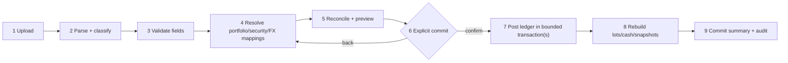

# CSV import specification

Status: normative parser/workflow definition for the supplied export  
Date: 2026-07-28  
Fixture: `docs/Example_Portfolio.csv`

## 1. Observed file

The supplied CSV has:

- one 17-column header;
- 244 physical data rows;
- 65 portfolio-security definition rows;
- 115 transaction rows;
- 64 blank separator rows;
- 101 observed buy transactions and 14 observed sell transactions;
- CRLF/LF/whitespace quirks and a padded `Notes` header;
- FIFO in the `Accounting` field on 13 sell rows;
- 33 zero values in `Purchase Exchange Rate`, treated as missing/unknown;
- at least one `Display Symbol` override (`EPR`);
- date-time strings containing a GMT offset plus a separate transaction-time field.

The sample screens/video and this CSV are independent reference fixtures. Differences in their holdings, quantities, prices, or totals are expected and irrelevant to import semantics.

The supplied 17-column header is the complete supported import contract. Fields not present in that header are outside scope and must not be inferred from visual references.

Counts above are acceptance fixtures and must be re-derived by tests from the exact file rather than hard-coded into production parsing.

## 2. Exact supplied header

The logical 17 fields, after trimming header whitespace, are:

1. `Id`
2. `Symbol`
3. `Name`
4. `Display Symbol`
5. `Exchange`
6. `Portfolio`
7. `Currency`
8. `Shares Owned`
9. `Cost Per Share`
10. `Commission`
11. `Transaction Date`
12. `Transaction Time`
13. `Purchase Exchange Rate`
14. `Type`
15. `Accounting`
16. `Accounting Execution Ids`
17. `Notes`

The physical source header is:

```text
Id,Symbol,Name,Display Symbol,Exchange,Portfolio,Currency,Shares Owned,Cost Per Share,Commission,Transaction Date,Transaction Time,Purchase Exchange Rate,Type,Accounting,Accounting Execution Ids,Notes
```

The actual `Notes` cell has trailing spaces. Matching trims BOM/outer whitespace, collapses internal header whitespace, and compares normalized names. Fields are mapped by name rather than positional index, while parser-version detection records the original order. Missing, duplicate, or unknown logical headers block parsing with a safe header report.

## 3. Field dictionary

| Field                    | Normalized type                                   | Definition-row requirement     | Transaction-row requirement    | Rules                                                                                                              |
| ------------------------ | ------------------------------------------------- | ------------------------------ | ------------------------------ | ------------------------------------------------------------------------------------------------------------------ |
| Id                       | non-empty source string                           | required                       | required                       | trim; file/source-scoped row identity; helps fingerprinting but is not globally unique                             |
| Symbol                   | non-empty string                                  | required                       | required                       | source identifier only; map with exchange/currency, never use as durable identity                                  |
| Name                     | bounded string                                    | optional                       | optional/recommended           | imported display metadata; not unique; provider canonical name may differ                                          |
| Display Symbol           | bounded string                                    | optional                       | optional                       | user-facing override; blank means no override                                                                      |
| Exchange                 | exchange alias                                    | recommended; optional for cash | recommended; optional for cash | normalize through exchange aliases; unresolved listed security blocks commit                                       |
| Portfolio                | non-empty string                                  | required                       | required                       | owner-scoped portfolio mapping key/name; does not itself define home currency                                      |
| Currency                 | currency code                                     | required                       | required                       | native holding/transaction currency; uppercase; must not be silently replaced by home currency                     |
| Shares Owned             | positive decimal                                  | blank                          | required for buy/sell          | normalized transaction quantity; greater than zero; preserve scale                                                 |
| Cost Per Share           | non-negative decimal                              | blank                          | required for buy/sell          | native transaction unit price; zero requires explicit warning/policy                                               |
| Commission               | non-negative decimal                              | blank                          | optional, default `0`          | native transaction currency unless evidence proves otherwise                                                       |
| Transaction Date         | offset-bearing date text                          | blank                          | required                       | parse enumerated format; retain raw value and derived instant/local date                                           |
| Transaction Time         | local time text                                   | blank                          | optional                       | reconcile with date offset/time under documented rule                                                              |
| Purchase Exchange Rate   | positive decimal or missing                       | blank                          | optional                       | source zero becomes unknown; direction must be confirmed/mapped                                                    |
| Type                     | enum                                              | blank                          | required                       | observed `Buy`/`Sell`; normalize case; unknown type blocks                                                         |
| Accounting               | enum                                              | blank                          | optional on sell               | observed `FIFO`; blank may default with warning; unsupported value blocks                                          |
| Accounting Execution Ids | bounded source string/list, semantics unconfirmed | optional                       | optional                       | blank throughout supplied file; preserve raw for round-trip; do not drive lot matching without confirmed semantics |
| Notes                    | bounded string                                    | optional                       | optional                       | preserve content after line-ending normalization; escape on export/display; never execute                          |

The importer never silently supplies an exchange, security currency, date timezone, or FX direction from ticker alone.

### Legacy cash pseudo-security

The supplied file’s `AUD=CASH` rows are a versioned legacy encoding, not a listed security:

- a definition row with symbol `<ISO currency>=CASH`, blank exchange, and the same `Currency` may create/map the owned portfolio’s cash account for that currency; it creates no canonical security or quote request;
- a matching transaction requires unit price exactly `1`, zero/blank commission, quantity as the cash amount, and no conflicting security fields;
- `Buy` normalizes to `cash_deposit`; `Sell` normalizes to `cash_withdrawal`;
- the original symbol/type/price remain in import provenance;
- any other `=CASH` shape blocks with `CASH_ENCODING_INVALID` rather than being guessed.

This compatibility rule applies only to this parser version. Native YieldToMe ledger events use explicit cash transaction types.

### Dividend-receipt rows (TASKS.md `IMP-006` task; requirement `IMP-007` -- the requirement id `IMP-006` was already taken by "Alternative CSV variants (deprecated)" above, so this feature's requirement is `IMP-007`, per AGENTS.md's "preserve stable requirement IDs, never reuse")

A second, backward-compatible header version supports dividend-receipt rows in the same staged import pipeline as trades: `strict-18-column-dividends-v1`, which is the exact 17-column header from §2 plus one trailing column, `Franking Credit Per Share`. Both parser versions remain permanently supported and are selected by exact header signature match (§14) -- an ordinary 17-column trade-only export keeps parsing under `strict-17-column-v1` unchanged; a `Type` value of `Dividend` is accepted under either header version, but franking data can only be supplied through the 18-column header (a `Dividend` row under the 17-column header always has unknown franking).

Column mapping for a `Dividend` row reuses the trade columns with dividend-specific meaning, so no other new columns are needed:

| Column                                               | Dividend-row meaning                                                                                                                                                                                                                                            |
| ---------------------------------------------------- | --------------------------------------------------------------------------------------------------------------------------------------------------------------------------------------------------------------------------------------------------------------- |
| `Symbol`/`Exchange`/`Currency`                       | Resolves the security exactly like a trade row (same candidate-matching rules, same `SECURITY_UNRESOLVED`-equivalent blocking issue: `SECURITY_MAPPING_REQUIRED`)                                                                                               |
| `Transaction Date`                                   | The dividend's **payment date** (same offset/timezone parsing as trades; `Transaction Time` is optional and ignored -- payment date is a calendar date, not an instant)                                                                                         |
| `Shares Owned`                                       | Shares the receipt is calculated against                                                                                                                                                                                                                        |
| `Cost Per Share`                                     | Dividend per share (native currency); must be a positive decimal -- zero is rejected (`DIVIDEND_PER_SHARE_INVALID`) since a $0 dividend is not a fact worth importing                                                                                           |
| `Franking Credit Per Share`                          | Franking credit per share (native currency), **optional**. Blank/absent = unknown, never zero (`FRANKING_INVALID` blocks a present-but-malformed or negative value; a genuinely-supplied `0` is preserved as an explicit unfranked fact, distinct from unknown) |
| `Commission`, `Purchase Exchange Rate`, `Accounting` | Unused/ignored for `Dividend` rows -- dividend rows never resolve FX at import time (see below) and never touch cost basis/lots                                                                                                                                 |

A `Dividend` row is staged/classified/previewed through the identical `transaction`-class pipeline as a trade row (same `import_rows.row_class = 'transaction'`), so no new resolution-card type exists for the reviewer UI: portfolio and security mapping decisions, and the `SECURITY_MAPPING_REQUIRED`/`SECURITY_MAPPING_AMBIGUOUS` blocking issues, all work exactly as they do for trades. The one deliberate difference is FX: because `dividend_manual_records` (see below) stores native per-share amounts only, a `Dividend` row never triggers `FX_DIRECTION_REQUIRED`/`FX_RATE_INCOMPLETE` and never consumes `Purchase Exchange Rate`. The reconciliation preview reports dividend rows in a separate `counts.dividendCreates` figure alongside `counts.transactionCreates`, and the parse summary reports a separate `summary.dividendRows` count alongside `summary.transactionRows`.

**Why `dividend_manual_records`, not `dividend_receipts`, on commit.** `dividend_receipts` (DB-005) requires a NOT NULL `dividend_event_id` foreign key to the shared, provider-populated `dividend_events` table (MKT-005). The importer has no safe way to fabricate or guess that a specific provider corporate-action event exists for an arbitrary broker CSV row, and requiring one to already exist would make dividend import fail whenever the configured provider has not ingested that exact event -- defeating the point of an import path whose purpose is filling gaps the provider missed. `dividend_manual_records` is DIV-001's own table for exactly this case ("a security/payment the provider never surfaced as an event").

**Precedence (DIV-004, 2026-08-13 -- restores the full ordering).** DIV-001's read-time derivation (`domain/dividends/history.ts`) has FIVE distinct tiers, highest first: override > manual (owner-typed) > receipt > imported > auto-derived (matching `docs/CALCULATIONS.md` §11's numbered list exactly). A CSV-imported row is a `dividend_manual_records` row with `import_batch_id` set; this is the SOLE signal the derivation uses to place it in the `imported` tier, strictly below an owner-typed manual record (`import_batch_id IS NULL`) and below a `dividend_receipts` row (actual payment evidence). Proximity dedupe (DIV-001's `PROXIMITY_WINDOW_DAYS`, 7 days) works ACROSS these tiers: an imported row that proximity-matches the same provider event as an owner-typed manual record or a receipt is consumed into that higher-tier row rather than producing a second row -- its values stay visible via the row's `dominatedImported` field, never silently dropped. The same collapse applies when neither fact is attached to a provider event: an imported row is matched directly against every standalone owner-typed manual record and standalone/orphan receipt for the security before it is allowed to become its own standalone row, so a CSV re-entry of a dividend the owner already typed by hand collapses to ONE row (owner wins) instead of two. An imported row that matches neither an event nor an owner fact wins its own row with `source: "imported"` -- still ranked above the provider's own auto-derived figure (an imported row is real evidence the provider never surfaced as an event). See `docs/CALCULATIONS.md` §11's "Derived dividend history" subsection for the full per-tier resolution algorithm.

**Preview-time near-duplicate warning (DIV-004).** Before commit, the reconciliation preview (`domain/imports/reconciliation.ts`) checks every incoming `Dividend` row, once its security has resolved, against the owner's EXISTING persisted dividend facts for that same security: owner-typed manual records (`import_batch_id IS NULL`) and receipts, loaded by the caller (`app/import-actions.ts`'s `loadReview`). A row whose payment date falls within the same `PROXIMITY_WINDOW_DAYS` (7-day) window as an existing owner fact raises `DIVIDEND_NEAR_EXISTING_ENTRY`, a **warning-severity** issue -- it never blocks readiness or commit, exactly like `FRANKING_ON_NON_DIVIDEND`, because it is a proximity heuristic flagging a PROBABLE duplicate for the owner to check, not a certain one. Deliberately excluded from this check: a nearby PREVIOUSLY-IMPORTED row (one with `import_batch_id` already set) -- an imported-vs-imported near match is cross-batch dedupe's job (the `source_reference` idempotency key checked at commit time in `db/repositories/import-commit.ts`'s `resolveInput`), not this warning's.

**`DIVIDEND_NEAR_EXISTING_ENTRY` is advisory display evidence, excluded from `previewVersion` hashing (Orchestrator ruling, review round 1 BLOCKING B1 fix).** `evidence.existingDividendEntries` is supplied only by the page/refresh preview path; the ready-service, security-verification-service, and import-commit revalidation paths call `buildImportReview` (`domain/imports/review.ts`) without it, since the warning never gates readiness or commit. If the warning's presence changed the hashed `previewVersion`, those paths would compute a DIFFERENT version than the one the page rendered and echoed back as `expectedPreviewVersion`, permanently 409ing an affected batch's ready/commit with no recovery path. `buildImportReview` therefore excludes `DIVIDEND_NEAR_EXISTING_ENTRY` from the hash input by construction (filtered out of the preview snapshot before hashing, still present in the returned preview for rendering) so `previewVersion` is identical whether or not the warning fires. A practical consequence: an owner-typed manual record added in another tab does not invalidate an already-open preview's version -- intended, since the warning is advisory and does not change what would actually commit.

**Schema addition.** `dividend_manual_records` gained two nullable, FK-less columns for this: `import_batch_id` (which batch created the row, for reversal) and `source_reference` (the same `import-fingerprint:<row fingerprint>` idempotency key trades store on `transactions.source_reference`), plus a unique index on `(portfolio_id, source_reference)`. Both are `ALTER TABLE ADD COLUMN`s (no table rebuild), added FK-less to mirror the existing precedent of `import_rows.commit_transaction_id`/`transactions.source_reference` (neither of which carry a formal FK either); ownership and target validity are checked procedurally at commit time before the insert, the same way every other import-commit target is. Rows created by the manual-entry UI (not import) leave both columns `NULL`.

**Idempotency and duplicate detection.** A `Dividend` row's natural key is the same versioned fingerprint scheme trades use (§10 "Row identity"), extended to include the franking column; the resulting `import-fingerprint:<fingerprint>` value is stored as `dividend_manual_records.source_reference` exactly as trades store it on `transactions.source_reference`. A second import (same batch resumed, or a different batch re-exporting the identical source row -- same `Id` and same normalized values) is detected by looking up that value before inserting: an existing match causes the row to be skipped and linked (`import_rows.commit_transaction_id`) to the existing manual record's id, never a duplicate insert.

### Sharesight sync (TASKS.md `BRK-005`)

A second, non-CSV batch source feeds the identical staged import pipeline: an owner-initiated read-sync against Sharesight (User API v3, via the sealed GET-only client `domain/sharesight/`) for a portfolio the owner has explicitly linked (`sharesight_sync_state.sharesight_portfolio_id`, `POST /api/portfolios/:id/sharesight-link`). `POST /api/portfolios/:id/sharesight-sync` (CSRF-first, owner-scoped) fetches that portfolio's trades and payouts, transforms them (`domain/sharesight-sync/transform.ts`) into the same `ParsedImportRow`/`NormalizedImportRow` shape a CSV upload produces, and stages them through the SAME `db/repositories/import-staging.ts` entry points (`startUpload`/`recordParseResult`) -- preview, mapping resolution, readiness, commit, and reversal are all the existing, unmodified machinery; a Sharesight-sourced batch is not a parallel pipeline. `import_batches.parser_format` records `sharesight_sync` (`parser_version` `sharesight-sync-v1`), distinguishing it from `strict-versioned-csv` batches; `app/import-ready-service.ts` and `db/repositories/import-commit.ts` each widen their `(parserFormat, parserVersion)` allowlist by exactly this one additional pair -- the only change either module needed.

**Trade mapping.** Each Sharesight trade becomes a `buy`/`sell` transaction row using `instrumentCode`/`marketCode`/`currencyCode` exactly like a CSV row's `Symbol`/`Exchange`/`Currency` (using the SAME staged-row shape and `securityKey` grouping as a CSV row, but resolved AUTOMATICALLY -- see "Non-blocking security resolution" below -- rather than through the CSV path's owner-driven candidate/verify/attest flow). Direction is confirmed from `valueDecimal`'s sign (negative = sell, live-confirmed), cross-checked against `transactionType` (when `buy`/`sell`, not `other`) and a small conservative `descriptionCode` allowlist (`BUY`/`SELL` -- an explicit ASSUMPTION, since no live evidence confirms Sharesight's full `description_code` enum). Any disagreement among the signals that are available, or no signal at all, stages the row as `unsupported` with an error-severity `TRANSACTION_TYPE_UNKNOWN` issue -- never guessed. Idempotency: `source_reference` derives from the trade's own stable Sharesight id (`import-fingerprint:sharesight-trade:<id>`), so a repeat sync of the same trade is caught by the existing cross-batch `source_reference` uniqueness, exactly like a re-uploaded CSV row.

**Non-blocking security resolution and atomic accept (TASKS.md `BRK-009B`, scoped to `sharesight_sync` batches ONLY; corrected 2026-08-18 review round -- findings B1/B2/B3, rulings F1/F2/F4/F5).** A CSV row has no stable instrument identity of its own -- two rows can only be told apart by ticker/exchange/currency text -- so CSV batches keep the pre-existing owner-driven flow completely unchanged: an unresolved candidate blocks readiness with `SECURITY_MAPPING_REQUIRED` until the owner verifies it against a market-data provider (`IMP-004B`) or attests it manually (`IMP-009`). A Sharesight row, by contrast, carries a genuinely durable instrument identity (BRK-009A's `sharesightInstrumentId`/`instrumentName`/`isin` metadata, when the live payload carries it, plus the row's own ticker/exchange/currency as a fallback), so BRK-009B replaces that owner-driven step with an automatic one: right after a sync stages a batch (and again, idempotently, as the first step of the atomic accept action below, so an older already-staged batch or a partially-completed pass still resolves), `app/security-resolution-service.ts` groups the batch's rows by distinct instrument and resolves each one through `db/repositories/security-resolution.ts`'s `resolveAndLink`, which tries THREE priority tiers, in order, stopping at the first that produces anything other than "no match" (see `docs/DATA_MODEL.md`'s `security_identifiers` entry for the full mechanics):

1. BRK-009A's strict multi-scheme resolver (`domain/securities/resolve-security.ts`, currency-enforced at every tier, global), then, only on no match, a same-user fallback (`domain/securities/resolve-security-candidate.ts`'s `resolveSecurityCandidate`) scoped to the RESOLVING OWNER's own already-linked securities -- symbol+currency agreement with no CONTRADICTING exchange evidence counts as a match.
2. Only when (1) found nothing: a cross-owner "global ticker+currency" fallback (`resolveGlobalTickerCurrencyCandidate`) -- the IDENTICAL "no contradiction = match" rule as (1), but over evidence from ANY owner, since `securities`/`security_identifiers` are a shared canonical master (IMP-004B precedent: two owners verifying the identical provider identity dedupe onto one row). A genuine disagreement, or an ambiguous multi-security match at EITHER tier, is never guessed -- it stages a blocking, error-severity `SECURITY_RESOLUTION_CONFLICT` issue (new code) naming the disagreeing tiers, exactly like a genuine parse/structural error.
3. Only when NEITHER (1) NOR (2) matched: auto-create a `securities` row (canonical name from Sharesight's `instrumentName` when present else the symbol, sanitized -- F2 below; currency validated against `currencies`, upper-normalized) plus `security_identifiers` rows carrying `source = 'sharesight'` -- always the ticker alias, and the `sharesight_instrument` identifier too when the sync carried one -- and an owner-attributed audit event; it NEVER writes a `security_provider_mappings` row (the same provenance-honesty rule `IMP-009`'s owner attestation follows: that table is provider evidence only, so an auto-created security is queryable as "not yet provider-verified" by the simple absence of a mapping, and remains eligible for the SAME provider-verify/attest upgrade path any owner-attested security already has).

Every SQL predicate this resolves through -- both tiers' evidence queries, every creation guard, and the winner-resolution used when a concurrent create races this one -- shares the SAME ticker+CURRENCY identity key (never ticker text alone: a 2026-08-18 review round found and fixed a currency-blind version of this logic that could resolve a metadata-less USD row onto an unrelated pre-existing AUD security of the same ticker text -- see `docs/DATA_MODEL.md`'s B1/B2/B3 note for the full repro and fix). A PRE-EXISTING `portfolio_securities` link is also re-validated for currency agreement before being trusted, rather than accepted blindly. `SECURITY_MAPPING_REQUIRED` is simply never emitted for a row whose candidate already carries a `security_id` (resolved or created) -- the pre-existing CSV reconciliation logic (`domain/imports/reconciliation.ts`) needed NO changes at all for this; missing name/ISIN/instrument-id metadata never blocks, only a genuine resolver conflict does. Readiness for a Sharesight batch therefore needs zero manual verification steps for a clean sync.

**Dividend-class currency exemption (BRK-010, 2026-08-19).** A security can legitimately trade in one currency and pay a dividend in another -- the owner-reported case, `sharesight_instrument` id 2964, ASX-listed (AUD trades) paying a USD dividend, which previously tripped step (1)'s currency-enforced tiers and blocked at `SECURITY_RESOLUTION_CONFLICT` on every re-sync. `app/security-resolution-service.ts` groups staged rows by `(symbol, exchange, currency)` as before, and tags a group `rowClass: "dividend"` only when EVERY row in it is a payout/dividend row -- a security's AUD trades and USD payouts naturally land in TWO SEPARATE groups (different currency). A `"dividend"`-tagged group's resolver call (`resolveSecurityCandidate`/`resolveSecurity`) is exempt from the currency-agreement check at every tier (instrument id, ISIN, FIGI, ticker+exchange) -- every OTHER safeguard is unaffected, and a TRADE-currency disagreement for the same instrument id still conflicts (genuinely suspicious). Both groups resolve to the SAME `security_id`, but `portfolio_securities_resolved_unique` permits only ONE `portfolio_securities` row per `(portfolio_id, security_id)` -- so they must never produce two rows. `db/repositories/security-resolution.ts`'s `linkResolvedSecurity` handles this: for a `rowClass: "dividend"` candidate, it first looks for an EXISTING `portfolio_securities` row for that security (any currency) and reuses it directly, rather than trying to create a second, differently-currencied row. The USD payout rows therefore commit against the SAME `portfolio_security_id` the AUD trades use -- a dividend fact's own cash currency lives entirely on `dividend_manual_records.currency_code`, never on `portfolio_securities.source_currency_code` (see `docs/DATA_MODEL.md`'s `security_identifiers`/`dividend_manual_records` entries for the full model). The pre-existing-link currency re-validation (`existing_link_currency_mismatch`) is exempted the same way, so re-running resolution against an already-linked foreign-currency payout group self-heals via F1 below rather than re-conflicting on every sync.

**F1 -- conflicts self-heal on re-resolution.** A `SECURITY_RESOLUTION_CONFLICT` issue is never permanently stuck: `app/security-resolution-service.ts` is its sole writer, and when a re-run of the resolution pass (sync-triggered, or accept-triggered) now resolves the SAME instrument successfully, it marks that instrument's previously-staged unresolved issues `resolved_at` (scoped narrowly to that code/batch/row set) and records an owner-attributed audit event. The issue's own message states the real unblock path: fix the underlying disagreement (or the unrecognized currency) upstream, then re-run the sync or accept, or exclude the affected rows (IMP-008) to commit the rest of the batch in the meantime.

**Atomic accept, scoped to Sharesight (F4).** `POST /api/import/preview/:batchId/accept` (CSRF-first, owner-scoped, `app/import-accept-service.ts`) collapses "resolve securities" (idempotent) -> "mark ready" (the existing, version-guarded `markImportReadyWithContext`) -> "commit" (the existing idempotent, chunked, resumable commit machinery, `db/repositories/import-commit.ts`, completely unmodified) into ONE owner action -- but ONLY for a `sharesight_sync` batch; a CSV (`strict-versioned-csv`) batch is rejected up front with an honest `400` ("Accept is available for Sharesight sync imports; use the review flow for CSV imports.") before any resolution/ready/commit step is even attempted, since a CSV batch's owner-driven candidate/verify/attest/skip flow has no automatic resolution step for accept to run first. It takes no client-supplied version/preview fields at all -- every step re-derives its own expected state fresh from the database immediately before acting, and the commit step's idempotency key is generated server-side, deterministically per batch (`accept:<batchId>`), so a retried or duplicated accept call always converges on the SAME commit attempt rather than racing two different keys. Works uniformly for a batch already sitting at `ready`, `committing` (resumes), or `committed` (idempotent replay, returns the existing result) -- "one owner action" covers the whole lifecycle from a freshly-synced batch through a fully committed one. A failure at any step returns the same honest error the underlying service already returns and leaves the batch in its normal recoverable state; nothing about this action is a new commit path. **F3 note:** a batch already committed OUTSIDE the accept action -- via the pre-existing `POST /api/import/commit/:batchId` route with an owner/client-generated idempotency key -- carries that MANUALLY-supplied key as its `commit_idempotency_key`, not accept's own deterministic `accept:<batchId>` value; calling accept afterward reaches commit's own `already committed` branch, finds the keys disagree, and returns `409 conflict` rather than an idempotent replay. This is expected, not a defect: idempotent replay only ever recognizes a retry using the SAME key namespace that originally committed the batch.

**Pre-acceptance "Review securities" screen (TASKS.md `BRK-009C`).** For a `sharesight_sync` batch ONLY, `app/components/import-review.tsx` renders a "Review securities" table between the preview counts and the pending-mappings section: one row per DISTINCT security the batch's own (non-excluded, transaction-class) rows reference -- Ticker / Exchange / Currency / Name, plus a row count ("N rows") and a text (never colour-alone) state. `domain/imports/security-summary.ts`'s `deriveSharesightSecuritiesSummary` is the pure, DB-free derivation; `app/import-preview.ts`'s `buildImportReviewPreview` calls it only when `batch.parserFormat === "sharesight_sync"` (`[]` for a CSV batch -- unchanged UI). Every missing value renders the literal text "Unknown", never blank/zero/fabricated. State is one of FOUR values, not the three the original ruling text named: `resolved` (matched an existing security), `created` (this batch's own BRK-009B resolution pass auto-created it -- see `db/repositories/security-resolution.ts`'s `listAutoCreatedSecurityIds`, a durable schema-level signal keyed off the `source = 'sharesight'` ticker identifier BRK-009B's `createAndLink` always stamps on creation, never on a match-only path), `conflict` (an unresolved `SECURITY_RESOLUTION_CONFLICT` issue blocks it -- links to the "Blocked rows" section below), and `unresolved` (no persisted conflict, simply not yet resolved -- e.g. a batch viewed before its first sync/accept resolution pass ran; `app/security-resolution-service.ts`'s own header comment already establishes that resolution is an explicit write step, never a side effect of reading a preview, so this is a genuine, reachable, non-blocking state, not the ruling's implied binary). Reporting an `unresolved` group as `conflict` would fabricate a blocking issue that does not exist, so the fourth state is a correctness necessity, not scope creep. **Review-round fix (finding F1):** the conflict check runs BEFORE trusting a non-null `security_id` -- `security-resolution.ts`'s own B2 fix re-validates a PRE-EXISTING link's currency agreement and reports `existing_link_currency_mismatch` as a conflict WITHOUT ever clearing the disputed `portfolio_securities.security_id` column, so a candidate can carry a stale linked id while genuinely blocked; checking conflict first ensures that case reports `conflict` (never `resolved`/`created`) and the summary's own `securityId` field is `null` whenever `state === "conflict"`, never the disputed id. Per-security verify/attest/skip affordances (IMP-004B/IMP-009/IMP-008) are UNCHANGED and remain reachable in their existing sections; `conflict`/`unresolved` rows link down to them (`#blocked-rows-title`/`#mappings-title`) rather than duplicating them.

**Editable fields, and why exchange and currency have none (BRK-009C inspection finding, exchange scope corrected in review round -- finding B2).** Name is the ONLY editable field. It is offered (the UI renders the edit control at all) only when `entry.nameEditable` is true, which requires ALL THREE: `state === "created"` (this batch's own BRK-009B pass created the security -- never a `resolved` pre-existing one, which this screen has no business renaming), no ACTIVE VERIFIED `security_provider_mappings` row on it (a later provider verification makes the provider's own naming authoritative), and no OTHER user's `portfolio_securities` linked to it (a security any other owner also holds is shared canon, not privately renameable). `db/repositories/security-resolution.ts`'s `listNameEditableSecurityIds` derives this set, user-scoped, mirroring `listAttestedSecurityIds`'s technique. A name edit writes `securities.canonical_name` through the exact same `sanitizeCanonicalName` BRK-009B's own auto-create path uses (control-character-stripped, truncated to 120 characters -- never rejected, matching that function's documented TRUNCATE-over-REJECT choice). Exchange and currency BOTH have **no edit affordance at all** and render read-only: `domain/sharesight/parse.ts`'s `requiredString` gate on trades' and payouts' `market_code`/`currency_code` means a Sharesight row with no exchange OR no currency never becomes a `SharesightTrade`/`SharesightPayout` in the first place, so a `sharesight_sync` batch's rows NEVER carry either as missing -- an edit control for either would be dead UI for a state that cannot occur. (An earlier version of this screen offered an exchange edit gated only on the DISPLAYED value reading `null`; review round finding B2 removed it -- the `null`-exchange case the gate checked for cannot occur for the only batches this screen serves, so the control was dead UI whose own membership check additionally trusted an unvalidated client-supplied `portfolioId`.) `security_id` is never client-writable through this path either way -- the edit is keyed by the server's OWN re-derived batch membership (the same distinct-security summary the table itself renders from), never trusted from the request; `portfolioId` is validated against `batch.targetPortfolioId` server-side before anything else runs (review round follow-up to B2).

`POST /api/import/preview/:batchId/securities/metadata` (CSRF-first, owner-scoped, `app/import-security-metadata-service.ts`) is the single mutation route: `{ portfolioId, sourceSymbol, sourceExchangeAlias, sourceCurrencyCode, securityId, name, expectedVersion, expectedPreviewVersion }`. `expectedVersion` (batch version) and `expectedPreviewVersion` are checked for genuine staleness on hashed evidence (rows/candidates/issues), but `canonical_name` is deliberately excluded from `previewVersion`'s hash (it is display metadata, not commit-relevant evidence), so a name edit never itself changes `previewVersion` -- two concurrent name edits against the same still-current preview simply last-write-win rather than 409-conflicting with each other; this is intentional and safe because `accept` re-derives resolution state fresh and never reads `canonical_name` as identity evidence (F2 doc correction -- the route is NOT "guarded exactly like every other preview mutation" in the sense of previewVersion changing on every successful write). The batch must be `sharesight_sync` (400 otherwise); `portfolioId` must equal `batch.targetPortfolioId` (400 otherwise); the identity tuple must match one of the batch's own CURRENT distinct securities (404 otherwise -- "not part of this batch's current preview"); the edit requires `entry.nameEditable` (409 otherwise, "This security is shared or provider-verified; its name can no longer be edited here."). **B1 (BLOCKING, review round):** that 409 message is not merely a service-side derivation -- the `UPDATE securities ... WHERE` statement itself re-enforces the identical three predicates (auto-created ticker identifier present, no active verified mapping, no other user linked) at the SQL level, so a race between the read and the write, or a bug in the derivation, can never actually rename a security that fails any predicate; zero rows updated is treated as the same honest 409, never a silent no-op. Reuses `loadImportReview`'s widened `portfolio_securities` query (one added `LEFT JOIN securities` for `canonical_name`) and `listAutoCreatedSecurityIds`/`listNameEditableSecurityIds`, threaded through `buildImportReviewPreview`'s now-optional `securityNames`/`autoCreatedSecurityIds`/`nameEditableSecurityIds` inputs -- every existing mutation-service `loadImportReview` copy (`import-actions.ts`, `import-ready-service.ts`, `security-verification-service.ts`, `security-attestation-service.ts`, `import-row-exclusion-service.ts`, `import-accept-service.ts`) was widened identically so the "Review securities" table never goes stale after an unrelated mapping/verify/attest/exclude/ready mutation's response replaces the whole reviewed preview client-side.

**"Accept Import", top and bottom, one dialog (BRK-009C; gating corrected in review round -- finding B3).** The existing `POST /api/import/preview/:batchId/accept` route (BRK-009B, previously unwired to any button) now has two "Accept Import" buttons on the review component -- one before the securities table, one after -- both opening the SAME confirm dialog (`acceptDialogOpen`/`acceptDialogRef`, the established exclusion/attestation dialog pattern) and submitting through the SAME `submitAccept()` handler. Disabled ONLY while `blockedRowIssues.length > 0` (persisted, error-severity, non-excluded issues -- e.g. `SECURITY_RESOLUTION_CONFLICT`/`SHARESIGHT_PAYOUT_KEY_COLLISION`) or once pending/already committed -- deliberately NOT on `review.preview.ready`, since that COMPUTED flag also reflects `SECURITY_MAPPING_REQUIRED` for a merely `unresolved` security, which accept's own first step (the resolution pass) resolves automatically; gating the button on it would grey out "Accept Import" in the exact pre-resolution state the button exists to fix. If the server's resolution pass still cannot resolve everything, `acceptImportWithContext` returns its existing honest error and the UI surfaces it via `acceptError` -- the button being enabled is never a promise of success, only that the owner is allowed to ask the server to try. The consequence copy adapts to which case applies: `blockedRowIssues.length > 0` states how many rows are blocked ("Resolve N blocked rows below..."); otherwise, with at least one `unresolved` security, an informational (non-blocking) note states how many will resolve automatically ("N unresolved securities will be resolved automatically on accept"). Consequence copy also states what accept commits: the transaction/dividend row counts and the target portfolio name.

**UI-014 (2026-08-19, owner-reported): prefilled names no longer demand action; explicit save feedback; row-linked issue context.** Three fixes to the pre-acceptance screens above. (1) The name-edit affordance (input + Save) now renders ONLY when `entry.nameEditable` AND the name is still genuinely missing (`isSecurityNameMissing` in `import-review.tsx`: `null`/blank/the table's own "Unknown" display fallback/BRK-009B's `"Unnamed security"` auto-create sentinel) -- a name Sharesight already supplied, or one the owner already saved, renders as plain text with no input and no Save button, so a fully-prefilled table never implies outstanding action. (2) Root cause of the owner-reported "spinner then nothing": `submitSecurityMetadata` called `setMessage` on the ERROR path only, and the name `<input>` is uncontrolled (`defaultValue`), so a re-render carrying the server's updated name never changed what the input visibly showed -- a successful save was indistinguishable from a silent no-op. Fixed by (1) above (a successful rename now flips the row to plain text, a visible state change) plus an explicit `setMessage` success confirmation on the same path; the Save button now also carries `aria-busy` while its request is in flight, matching UI-013's established convention (`cursor: wait` only under `[aria-busy="true"]`, `not-allowed` for a merely-disabled state). (3) `buildImportReviewPreview` (`app/import-preview.ts`) now returns `rowSummaries: Readonly<Record<string, RowSummary>>` -- business-basics facts (symbol/type/business date/quantity/amount/currency, "Not recorded" fallbacks, never fabricated) for every row a row-linked issue (both the persisted `issues` list and the computed `preview.issues` list) actually names, derived via `summarizeRow` (moved, unchanged, from `import-history-detail.tsx` to the shared pure module `domain/imports/row-summary.ts` so UI-012's history table and this review payload derive it identically). Server-derived and bounded to rows an issue references, not the whole batch. Both the "Row and field issues" and "Blocked rows" sections render these facts inline (`.import-issue-row-facts`, text not colour) next to the issue's own message, so the owner can see what a row is actually about without opening import history.

**Payout mapping -- totals, never fabricated per-share amounts.** Sharesight payouts report a TOTAL cash amount (`amountDecimal`) and total franking credits (`frankingCreditsDecimal`), never a share count or a per-share amount. Every payout, confirmed or not, becomes a `Dividend`-type row whose `sharesOwned`/`costPerShare`/`frankingPerShare` are all `null` and whose two new fields, `totalCashDecimal`/`totalFrankingDecimal` (on `NormalizedImportRow`, always `null` for a CSV-parsed row), carry the real totals. `db/repositories/import-commit.ts`'s existing dividend-row commit branch reads `normalized.totalCashDecimal` to choose between the totals-mode and per-share-mode insert into `dividend_manual_records` -- see `docs/DATA_MODEL.md`'s `dividend_manual_records` entry for the schema and `docs/CALCULATIONS.md` §11 for the derivation rule. Idempotency (BRK-005C, see below for the full identity story): `import-fingerprint:sharesight-payout:<sharesightPortfolioId>:<holdingId>:<paidOnDate>` -- the SAME scheme for every payout, confirmed or not; the Sharesight `id` is never part of it.

**Foreign-currency payout fail-closed staging (BRK-010, 2026-08-19; review round correction, findings B1/B4).** `NormalizedImportRow.exchangeRateDecimal` carries Sharesight's own live-confirmed payout `exchange_rate` field, INVERTED at the transform boundary into this codebase's multiply-to-portfolio-base convention (`invertToPortfolioConversionRate` -- see `docs/CALCULATIONS.md` §11's B1 note for the live evidence that proved the raw wire field is the inverse; absent-tolerant, payout-only -- always `null` for a trade row and for a CSV-parsed row; VALUE-BEARING, so it IS included in `canonicalRowDigestFields`, unlike `sharesightInstrumentId` -- see §5/§6's digest note). `transformSharesightSync` blocks a payout with no USABLE rate only when conversion would ACTUALLY be needed and impossible: `payoutSecurityCurrencyProxy` builds a best-effort target, in strict priority order -- REAL, DB-resolved evidence FIRST (an instrument this user has already linked to a security in this portfolio, from any source -- queried by `app/sharesight-sync-service.ts` before the transform runs), then a same-fetch trade's currency for the same instrument when present, and otherwise `null` (genuinely no evidence -- see the round 3 correction below for why there is no further fallback); a payout whose currency differs from a NON-NULL target AND carries no usable rate stages (the row itself is NOT skipped -- its real facts stay visible and it can be excluded via IMP-008) with a blocking, error-severity `SHARESIGHT_PAYOUT_FX_RATE_MISSING` issue naming the payout's date/amount/currency -- missing FX is never zero, never guessed at 1:1 (AGENTS.md non-negotiable). A payout whose currency already matches its OWN security (e.g. a USD-denominated security paying a USD dividend, in ANY portfolio base currency) never blocks -- no conversion is ever needed at the security-native-currency level. `db/repositories/import-commit.ts`'s dividend branch is the AUTHORITATIVE gate (real DB-resolved `securities.primary_currency_code`, not a pre-resolution proxy) and implements the full three-case model (native / achievable-requires-a-rate / not-achievable-never-blocks) -- see `docs/CALCULATIONS.md` §11's B4 note; scoped to the totals-mode/Sharesight-payout branch only, a CSV per-share dividend row's pre-existing behaviour is unchanged, out of this task's scope. A same-currency (to its security) payout, or one that DOES carry a rate, commits normally -- the ORIGINAL currency total + Sharesight's own rate (`fx_rate_source: 'sharesight'`) are stored on `dividend_manual_records` (see `docs/DATA_MODEL.md`'s entry) and converted at READ time by `domain/dividends/history.ts` ONLY when achievable (see `docs/CALCULATIONS.md` §11).

**Review round 2 correction (2026-08-19, finding B1):** the FIRST version of this staging block fired whenever a payout's currency differed from the `payoutSecurityCurrencyProxy` target, WITHOUT checking that target itself was achievable (`=== portfolioBaseCurrencyCode`) -- a security-currency proxy that itself differed from the portfolio's base (e.g. an NZD-denominated security receiving a USD payout inside an AUD-base portfolio) was wrongly blocked even though no Sharesight rate could ever convert the payout into that target. Fixed: `payoutMissingFxRateIssue` now checks `targetCurrency === portfolioBaseCurrencyCode` before ever emitting the issue, mirroring `import-commit.ts`'s authoritative gate exactly. The block is a READINESS block, not a "commit-time" one -- a batch with an unresolved error-severity issue never reaches commit at all, so a wrong proxy guess does not "self-correct at commit time"; it self-corrects on the next resolution pass (the owner's F1 self-heal) once the real security currency is known. A NEGATIVE raw `exchange_rate` (malformed) is likewise staged as a visible, named error at transform time now, rather than silently falling through to a generic commit-time `mapping_incomplete` failure -- gated on the identical achievable condition.

**Review round 3 correction (2026-08-19, BLOCKING):** round 2's fix still left the proxy falling back to the portfolio's own base currency whenever THIS SAME FETCH carried no trade for a payout's instrument -- but that is the REALISTIC STEADY STATE, not a rare edge case, since trades are historical (fetched once, rarely repeated) while payouts recur indefinitely. A payout-only-evidenced security (e.g. one whose only Sharesight evidence is dividends -- a transferred-in holding, an opening balance entered outside Sharesight) therefore had this guessed target read as "case B, achievable" on EVERY sync, forever, with NOTHING inside a batch able to clear the resulting block: re-resolution and re-running accept only clear `SECURITY_RESOLUTION_CONFLICT`, never `SHARESIGHT_PAYOUT_FX_RATE_MISSING` (an earlier, also-false claim to the contrary is corrected here) -- the only way out was permanent exclusion (IMP-008) of a row that may not have needed converting at all. **Fixed:** `app/sharesight-sync-service.ts` now queries `db/repositories/security-resolution.ts`'s `loadResolvedPortfolioInstrumentCurrencies` (every instrument this user has already resolved a security for, in this portfolio, from any source) BEFORE calling the transform, and passes it in as `SharesightTransformInput.resolvedInstrumentCurrencies`; `payoutSecurityCurrencyProxy` now consults this REAL evidence FIRST, same-fetch trade evidence second, and -- this is the actual fix -- falls back to NOTHING (`null`) when neither exists, rather than guessing the portfolio base. A `null` target never blocks at staging; `import-commit.ts`'s three-case model (evaluated fresh at commit time, on the REAL resolved security) remains the sole authoritative gate and still produces a batch-level 409 (`mapping_incomplete`), NOT a row-named failure, if conversion turns out to be genuinely needed and impossible then. Two false comments this round's reviewer quoted are also corrected: `payoutSecurityCurrencyProxy`'s doc comment no longer claims the F1 self-heal clears a wrong `SHARESIGHT_PAYOUT_FX_RATE_MISSING`; `strict-versioned-parser.ts`'s doc comment for the code no longer implies a portfolio-base fallback exists at all. Separately (SMALL-1/SMALL-2): the staging gate now checks whether `invertToPortfolioConversionRate` actually returns a value, not merely whether the raw `exchange_rate` field is non-null -- covering zero, negative, malformed, and over-24dp-precision raw rates with the SAME named `SHARESIGHT_PAYOUT_FX_RATE_MISSING` issue (its wording now says "did not supply a usable conversion rate"), which previously slipped through this presence-only check to die at commit as a batch-level 409 (`mapping_incomplete`), not a row-named failure; round 2's separate ad hoc negative-rate special case in `buildPayoutRow` is removed as redundant.

**Franking on a foreign-currency payout (review round 2, finding B2).** See `docs/CALCULATIONS.md` §11's dedicated note for the full product ruling (franking-currency denomination is an explicit UNVERIFIED ASSUMPTION). At staging, a foreign-to-its-security payout with a NONZERO franking total gets a visible, NON-BLOCKING warning (`SHARESIGHT_PAYOUT_FRANKING_CURRENCY_UNVERIFIED`) naming the reason; a zero/absent franking total (the common case) never triggers it. This warning is independent of whether the CASH conversion itself is achievable -- it names an unverified franking-currency assumption, not a blocking capability gap.

**BRK-005C CORRECTION (2026-08-16, owner-confirmed against live data) -- a `null`-id payout is NOT always an unpaid distribution; the original BRK-005 text (which this paragraph replaces) was WRONG, not merely conservative.** Sharesight auto-creates a payout row from every dividend announcement and leaves it "unconfirmed" (`id: null`) until the owner manually confirms it there -- but Sharesight's own tax reports already count an unconfirmed payout as received income once its `paid_on` date has passed. The owner's real account had 99 of 118 payouts null-id, all real income; skipping every one of them (the original rule) silently dropped the large majority of the owner's dividend income. Corrected rule: a `null`-id payout whose `paidOnDate` is on or before the sync's own injected "now" (a UTC calendar-date comparison against the security's own market-local `paid_on` -- see the UTC-boundary follow-up below; never `Date.now()` inside the pure `domain/sharesight-sync/transform.ts` module) stages exactly like a confirmed payout -- same totals-only shape -- plus a provenance note ("unconfirmed in Sharesight …") appended to the row's `Notes` field so the owner can see it was never manually confirmed there. Only a FUTURE-dated (not-yet-due) `null`-id payout still skips entirely, never staged, surfaced as a batch-level warning-severity `SHARESIGHT_PAYOUT_UNCONFIRMED` issue naming the symbol/date -- its message says "future-dated (not yet paid)" rather than the original wording, which implied every unconfirmed payout was skipped.

**BRK-005C REVIEW-ROUND CORRECTION (2026-08-16, same day) -- the identity/collision scheme first shipped for the correction above FAILED review and was replaced.** That first attempt kept a confirmed payout on the pre-existing `sharesight-payout:<id>` key while giving an unconfirmed one a DIFFERENT natural key (`sharesightPortfolioId`/symbol/market/`paidOnDate`), disambiguating a same-key collision with a content-sorted `:<ordinal>` suffix. Review findings: (B1) a payout synced+committed while unconfirmed, then CONFIRMED by Sharesight before the next sync, flipped identity from the natural key to the id key -- a source_reference the cross-batch dedupe had never seen, so it committed AGAIN as a duplicate; (B2) the content-sorted ordinal was an unwarranted invented mechanism; (B3) a genuinely byte-identical duplicate payout pair would silently stage as two accepted facts. **Replacement scheme, shipped:** ONE identity key for every payout, confirmed or not -- `sharesight-payout:<sharesightPortfolioId>:<holdingId>:<paidOnDate>` (`holdingId` is Sharesight's own required, stable per-holding identifier, never a ticker -- also closing a reviewer follow-up about durable security identity). The Sharesight `id`, when present, plays no part in identity -- confirmation can never change a row's `source_reference` (B1 closed). A same-key collision (two payouts sharing one holding+date -- an interim and a special dividend, or a genuine duplicate) is NEVER auto-disambiguated (B2/B3 closed together): every colliding row stages (visible, not silently dropped) but ALSO carries its own error-severity `SHARESIGHT_PAYOUT_KEY_COLLISION` issue naming the holding, date, and collision count, which blocks readiness for THIS batch PERMANENTLY -- an uncommitted batch has no reverse/discard path (reversal only applies to an already-committed batch), so it simply stays in import history, harmless and never committable. **The block persists across every SUBSEQUENT sync too**, since each one re-fetches the identical colliding pair and blocks its own new batch the same way; verified false and removed from the guidance: neither "reverse this batch" (it was never committed) nor "enter the dividend(s) manually" (does not stop the next sync from re-staging the same ambiguity) actually fixes anything. **The only remedy that works**: resolve/deduplicate the payout inside Sharesight itself (merge or remove the duplicate so the holding reports exactly one payout for that date), then re-sync. **`IMP-008` addendum (2026-08-16):** the "permanently blocked" framing above described the ORIGINAL, sole remedy; `IMP-008` adds a second, owner-initiated one -- excluding BOTH colliding rows unblocks this batch's readiness without touching Sharesight, at the cost of neither payout being committed by this batch (a future sync still re-raises the same collision if it is not actually resolved upstream, per that task's "no sticky suppression" rule). See "Owner row-exclusion (skip)" in §8 for the full mechanism. **One-time consequence, documented per policy though moot in practice:** any row committed under the first attempt's scheme would re-stage under a different `source_reference` after this fix; the owner's database was reset the same day this correction shipped, so nothing had actually been committed under the superseded scheme before the fix landed. **Residual, documented rather than solved (reviewer follow-up):** if Sharesight ever RE-CREATES a holding (a merge or a delete-then-re-add) its `holdingId` changes, so that holding's already-committed payouts would re-commit ONCE MORE under the new id on the next sync -- a rare, bounded, one-time re-commit, not a repeating drift, and not the collision failure mode above.

**Follow-up, not resolved here: the UTC past/future boundary is an approximation.** The past/future comparison above is UTC-calendar-date-only against `paidOnDate`, which is the security's OWN market-local date (e.g. an ASX holding's Sydney-local `paid_on`). For a market ahead of UTC (ASX is UTC+10/+11), a payout already "today" locally can still read as "tomorrow" in UTC for roughly the first 10-11 local hours of that day, holding an already-paid distribution as future-dated (skipped) slightly longer than necessary. FAIL-SAFE direction only (never staged too early, only possibly held back a few hours too late) and self-heals on the next sync once UTC catches up -- accepted as a documented approximation rather than plumbed through a per-security market timezone this module does not otherwise model.

**Follow-up, corrected here: the provenance note's reach, and the Sharesight id's visibility.** `dividend_manual_records` has no notes/comments column at all (see `db/schema.ts`'s header note), so `normalized.notes` -- like a CSV dividend row's own `Notes` field -- is visible only at the STAGED import-preview layer, never after commit; `source_reference` is the only durable, post-commit signal a payout came from Sharesight at all. Since the Sharesight `id` is no longer part of identity, it is now ALSO appended to a confirmed payout's `Notes` (`"Sharesight payout id <id> (confirmed there)."`) so it stays visible at least while the row is staged.

**Provenance and watermark.** Every trade row's own `Id` field (and therefore its fingerprint) carries the Sharesight trade id. A payout row's `Id` field carries the Sharesight payout id when confirmed (non-null) and stays `null` when unconfirmed -- either way, per BRK-005C's review-round correction above, the `Id` field plays NO part in the row's fingerprint/`source_reference`, which is always the holding+paidOn identity key. `sharesight_sync_state.last_synced_at` updates on successful STAGING (not on commit, which remains a separate later owner-driven step); `last_trade_watermark` is left untouched by this task -- each sync re-fetches the full trade/payout list rather than filtering by a date cursor, relying on `source_reference` cross-batch dedupe (and the batch-level file-fingerprint — a canonical hash of the LOCAL `portfolioId`, the linked `sharesightPortfolioId`, and each row's own VALUE-BEARING normalized content, never bare trade/payout ids — which makes a no-op resync of the SAME local portfolio resolve to the SAME batch, and keeps two different local portfolios linked to the same Sharesight portfolio from colliding on one shared batch) for idempotency; narrowing the fetch itself is an unplanned incremental-sync design left for a future task. No Sharesight payload is ever logged or dumped.

**Commit atomicity.** The manual-record insert (plus its audit row) is built as `SqlStatement`s only, not executed independently -- `db/repositories/dividends.ts`'s `buildDividendManualRecordImportInsertStatements` mirrors `buildLedgerPostingStatements`'s "prepare, don't execute" shape precisely so `db/repositories/import-commit.ts` folds it into the same atomic chunk `client.batch()` call as the `import_rows` status update. A batch mixing trade and dividend rows in the same chunk commits both, or neither, atomically.

**Reversal semantics.** Dividend rows never post through the ledger, so they have no compensating reversal transaction the way trades do. DIV-001 treats `dividend_manual_records` as an owner-mutable/deletable fact (its own repository already exposes a hard `remove()` for the manual-entry UI), not an immutable ledger entry -- there is no "reversed" status column on this table, and adding one purely for import provenance was rejected as unnecessary schema surface. Reversing a batch therefore **deletes** exactly the `dividend_manual_records` rows it created (`WHERE user_id = ? AND import_batch_id = ?`) and marks the corresponding `import_rows` `commit_status = 'reversed'`, both as idempotent, self-guarded statements folded into the same atomic `finalize()` call trades' compensating-reversal statements already use -- safe to include on every invocation of a resumed/repeated reversal, including a batch containing only dividend rows (no trade transactions to reverse at all).

## 4. Row grammar

Parsing first preserves every physical row and all original field strings.

### Blank row

All logical fields are empty after trimming. Record it as `blank` for diagnostics and ignore on commit.

### Portfolio-security definition row

Required:

- non-empty `Id`, `Symbol`, `Portfolio`, and `Currency`;
- blank `Type`, `Transaction Date`, `Shares Owned`, and `Cost Per Share`;
- `Accounting` blank;
- no contradictory security/trade values.

Creates/maps the owned portfolio and its portfolio-security membership, including watch-only symbols. It creates no quantity, cash, cost, or transaction. Definition order does not grant ownership outside the authenticated import batch.

### Transaction row

Required:

- non-empty `Id`, `Symbol`, `Portfolio`, and `Currency`;
- supported `Type`;
- valid `Transaction Date`;
- valid positive `Shares Owned` and valid `Cost Per Share` for buy/sell;
- resolvable security candidate from symbol + exchange + currency context;
- supported/blank `Accounting` under the transaction rule.

Portfolio/security reference fields repeat definition data; batch conflicts are errors, not last-write-wins. A transaction appearing without a definition row can be staged with a warning, but no implicit cross-user mapping is allowed.

The legacy cash shape above follows the same physical transaction grammar but maps to a cash account/event instead of a portfolio security, lot, or holding.

### Unsupported row

Any nonblank row that satisfies none or multiple row grammars. It remains staged with issues and cannot be committed until the parser version or mapping decision resolves it.

Classification must use row content, never “last seen row type” alone.

## 5. Date and timezone normalization

1. Preserve original date and time strings.
2. Parse only enumerated formats observed in fixtures.
3. If `Transaction Date` carries a numeric/GMT offset, that offset determines the instant.
4. If separate `Transaction Time` supplies a time absent from the date field, combine it under the explicit offset/portfolio timezone rule.
5. If both contain time and disagree, emit `DATE_TIME_CONFLICT` and block commit unless user resolves it.
6. Derive `trade_at` in UTC and `local_trade_date` in portfolio timezone.
7. DST ambiguity without an explicit offset blocks automatic commit.

No environment-locale date parsing is allowed.

## 6. FX interpretation

The column name `Purchase Exchange Rate` does not establish direction. During mapping/preview, show:

- transaction/security currency;
- user home/reporting currency;
- source value;
- assumed equation.

The selected v1 normalized convention is:

`base amount = native amount × fx_rate_to_base`

If source examples prove the exported rate is inverse, invert with decimal arithmetic and retain:

- original rate;
- original direction;
- transformation version;
- normalized rate.

Source zero becomes missing with `FX_ZERO_TREATED_AS_UNKNOWN`. It does not block native ledger import but blocks dependent base-basis/realised calculations until resolved.

**Same-currency rows (`CALC-004` fix)**: when a row's transaction currency already equals the portfolio's base currency, no `Purchase Exchange Rate` is needed or consumed -- the commit layer (`db/repositories/import-commit.ts`'s `resolveInput`) sets `fx_rate_to_base_decimal = "1"` and `fx_rate_source = "identity"` directly, matching `domain/market-data/selection.ts`'s `selectFxObservation` identity-conversion precedent for the same-currency case. Before this fix, neither FX branch applied to a same-currency row, so it persisted a `NULL` FX rate; `domain/ledger/projections.ts`'s `basisStatus` treats a null rate as `incomplete_fx` unconditionally (never distinguishing "no rate needed" from "rate genuinely unknown"), so every same-currency import's home-currency basis silently reported `missing_basis` despite the native cost being fully known.

## 7. Upload constraints and safety

- Authenticated owner only.
- `.csv` extension is advisory; validate content as bounded text.
- Initial size limit: 10 MiB and 100,000 physical rows; make configurable. This release contract requires a Workers Paid production deployment because Workers Free cannot guarantee the parse/normalize/hash workload within its 10 ms CPU limit.
- A deployment configured as Workers Free rejects CSV import before reading the body. Enabling a smaller Free limit requires a separate Worker-runtime benchmark and a documented configuration profile.
- Stream/bounded parse; reject NUL/binary content and pathological field sizes.
- Support UTF-8 with optional BOM. Non-UTF-8 requires explicit future encoding support.
- Do not evaluate spreadsheet formulas, HTML, Markdown, URLs, or note content.
- Escape formula-leading characters on any later CSV export.
- Sanitize filename for display; never use it as an object path.
- Store SHA-256, size, parser version, and normalized rows; do not retain original bytes in v1.
- Redact raw values from operational logs.
- Known risk: Stage 2/3 parse-persistence (`persistParsedResult`) commits every parsed row/issue in one atomic D1 `batch()` call (see `docs/DATA_MODEL.md` §11). Its statement count is bounded by the 100,000-row cap above, not by D1's verified ~1000-statement-per-batch ceiling; an upload with a large enough row/issue count can exceed that ceiling, in which case the whole call fails closed (nothing persists, the upload is retryable) rather than corrupting data. Tightening the row cap to fit one batch, or replacing this stage with a resumable multi-invocation design, is tracked as follow-up work.

## 8. Staged workflow



### Stage 1 — Upload

Create `import_batch` with owner, metadata, SHA-256, and parser version. Exact duplicate upload is reported before parsing if prior batch status allows.

### Stage 2 — Parse/classify

Normalize header, retain physical row number, preserve original strings, and classify each row. No domain records change.

### Stage 3 — Validate

Emit stable field/row issue codes. Separate:

- error: blocks affected row/batch commit;
- warning: requires visibility and sometimes acknowledgement;
- info: normalization disclosure.

### Stage 4 — Map

Resolve:

- `Portfolio` source name to a new/existing owned portfolio;
- currency/exchange aliases;
- security using exchange + symbol + currency + name/identifier evidence;
- FX direction/missing value;
- `Accounting` method and any confirmed execution-ID semantics.

Candidate confidence can sort options but cannot auto-merge ambiguous securities.

A brand-new symbol that matches no existing owned candidate (resolved or unresolved) cannot be resolved by a mapping decision alone -- the shared `securities` master is writable only through the server-verified path (`docs/DATA_MODEL.md` §4). IMP-004B's "verify security" flow (`app/security-verification-service.ts`, `POST /api/import/preview/:batchId/securities/verify`) lets the owner request that verification directly from the review screen: the server re-derives the candidate's symbol/exchange/currency from its own current preview (never the client's fields alone), looks it up against the configured market-data provider, and -- only on a currency- and exchange-agreeing match -- publishes the canonical security (or links to an already-published one for the same provider identity) and resolves the owner's candidate. An unavailable, ambiguous, or mismatched provider result is an explicit failure; the candidate stays private and unresolved, and the owner can retry or fall back to mapping the row onto a different existing candidate instead.

**Manual resolution (IMP-009).** For the two cases provider verification structurally cannot cover -- the provider is temporarily unavailable (rate-limited, outage), or the ticker is delisted and will never again resolve through a live provider lookup -- the same resolution card offers "Resolve manually" beside "Verify with market-data provider". A confirm dialog states the consequence plainly (the owner is taking responsibility for this identity; no market data -- prices, dividends, corporate actions -- will be available for it until it is later provider-verified) and collects a display name (default: the symbol). `POST /api/import/preview/:batchId/securities/attest` (`app/security-attestation-service.ts`) re-derives the candidate server-side exactly like verify (same `expectedVersion`/`expectedPreviewVersion` staleness guards, CSRF-first), publishes the security WITHOUT any `security_provider_mappings` row (provenance honesty: that table is provider evidence only -- see `docs/DATA_MODEL.md`'s `security_identifiers`/`security_provider_mappings` sections for the full write path and dedupe/upgrade mechanics), and resolves the candidate. An owner-attested security still commits and holds normally, and prices/dividends everywhere still show the existing `Price unavailable`/never-zero missing-data states, never a fabricated value. Today the explicit "Owner-attested identity; market data unavailable until provider-verified" label is rendered only on the import review surface (`app/components/import-review.tsx`): the manual-resolution dialog's consequence copy, the post-attest success message, and the resolved-candidate mapping option for an attested security (driven by `ImportReviewPreview.attestedSecurityIds`, `db/repositories/security-attestation.ts`'s `listAttestedSecurityIds`). Labelling the same state on holdings/dividends/other security-status surfaces outside the import review flow is not yet implemented -- tracked as future work, not a gap in the price/missing-data honesty guarantee itself (those surfaces already show `Price unavailable` for any security with no usable quote, attested or not). A LATER successful provider verification of the same ticker text upgrades the SAME security in place (attaches a mapping; never creates a duplicate row), after which the label naturally stops applying.

### Stage 5 — Reconcile/preview

Show:

- portfolios/securities to create or map;
- transaction counts and date range;
- buys/sells, quantities, fees/costs, and currencies;
- duplicates/skips;
- missing FX/basis warnings;
- oversells or negative cash effects;
- before/after holding quantities where meaningful;
- calculation coverage consequences.

The user must be able to download/copy an issue report without source formulas executing.

The owner explicitly moves a `parsed`/`needs_mapping` batch to `ready` once every mapping is resolved. That transition is itself server-revalidated: it recomputes the owner-scoped reconciliation and the batch's persisted validation issues straight from the database (never trusting a client-supplied preview) and only proceeds when no error-severity reconciliation issue and no unresolved persisted issue remains -- on NON-excluded rows; see "Owner row-exclusion (skip)" below. This is a preview-level precondition, not a substitute for Stage 6's commit gate: commit's revalidation independently re-checks row-level persisted state (invalid rows, error counts, unresolved transaction targets) as the final authority before committing. Only a `ready` batch can be committed.

### Owner row-exclusion (skip) (`IMP-008`)

Because a batch is locked until every error-severity issue is resolved, the owner may instead EXCLUDE the specific row(s) an issue blocks rather than resolve them -- a batch-scoped, reversible-until-commit, owner-initiated decision that a row simply never commits. Exclusion never relaxes verification: an excluded row still never posts against an unresolved security or unresolved mapping (`AGENTS.md`'s "a ticker is not a durable security ID" non-negotiable is untouched), it is simply removed from what this batch attempts to commit at all.

**Persistence.** `import_rows.excluded_by_owner_at` (nullable `text`, `NULL` = not excluded; added by a plain `ALTER TABLE ADD COLUMN` migration, no table rebuild -- see `docs/DATA_MODEL.md` §11) records the owner's decision as a dedicated column, deliberately NOT an overload of `commit_status` (which describes what COMMIT did to a row, not a pre-commit owner decision). Each exclude/un-exclude (include) mutation appends an owner-attributed `audit_events` row (`action` `import.row.exclude`/`import.row.include`, `target_type` `import_batch`, metadata naming the affected row ids), atomically with the row update. The audit metadata names only the rows `setRowExclusion` actually found eligible and changed (its own `commit_status = 'staged'`/current-exclusion-state `SELECT`), never every id the request merely asked for -- review finding B3: a request mixing one real staged row with a foreign or already-in-the-target-state id must not record an audit event naming the id(s) that never actually changed. `setRowExclusion` accepts a `buildExtraStatements(changedRowIds)` builder so the caller (the row-exclusion service) can compose the audit insert -- and the conditional `ready` -> `needs_mapping` downgrade below -- from that same actually-changed set, inside the identical atomic call.

**Mutation contract.** `POST /api/import/preview/:batchId/exclusions` (CSRF-first, owner-scoped, `app/import-row-exclusion-service.ts`) accepts `{ action: "exclude" | "include", target, expectedVersion, expectedPreviewVersion }`. `target` selects the affected rows at the two granularities the owner acts at:

- `{ kind: "securityCandidate", portfolioId, sourceSymbol, sourceExchangeAlias, sourceCurrencyCode }` -- every row currently blocked by that ONE unresolved security candidate (the "many rows, one unresolved symbol" case: one action skips all of them);
- `{ kind: "issue", issueId }` -- the single row a specific row-linked, error-severity PERSISTED issue names (e.g. `SHARESIGHT_PAYOUT_KEY_COLLISION`, see below);
- `{ kind: "rowIds", rowIds }` -- explicit row ids, used by the "Excluded rows" list to un-skip (include) a specific already-excluded row.

Like every other preview mutation, `expectedVersion`/`expectedPreviewVersion` are re-verified against a freshly reloaded batch/preview before anything is written, and a stale value 409s -- including at `ready` (see below). Exclusion is IN the canonical hashed evidence (`domain/imports/review.ts`'s `ImportReviewRow.excludedByOwnerAt` is part of what `previewVersion` hashes) -- unlike `DIVIDEND_NEAR_EXISTING_ENTRY`'s advisory-only exclusion from the hash (§ above, Stage 5), because exclusion genuinely changes what would commit, not merely what is displayed.

**Eligibility and the `ready` -> `needs_mapping` downgrade (review finding B1).** An exclusion mutation is accepted while the batch is `parsed`, `needs_mapping`, `invalid`, or `ready` -- reversible right up to the moment commit actually starts, matching `import_mapping_decisions`' own precedent of staying editable through `ready`. At `ready`, an EXCLUDE that only removes an already-resolved row from commit cannot reintroduce a blocking issue, so the batch stays `ready`; an INCLUDE (un-skip) can, if the row's original issue still applies (e.g. its security is still unresolved) -- the exclusion service simulates the post-change reconciliation result IN MEMORY before writing anything and, if the batch would no longer be genuinely ready, bundles a guarded `ready` -> `needs_mapping` `UPDATE` into the SAME atomic `client.batch()` call as the row update and audit insert, rather than a second round-trip that could race a concurrent commit request reading a stale `ready` status. `db/repositories/import-staging.ts`'s state graph records this edge (`ready: [..., "needs_mapping"]`) even though this specific downgrade is applied via a standalone guarded statement (`buildReadyToNeedsMappingStatement`) rather than through `transitionStatus`. The in-memory simulation checks the SAME predicates commit's own `revalidate()` does (review finding FU-1): both the reconciliation result and any unresolved persisted issue, AND a still-included row's own persisted `validationStatus`/`errorCount` (a row can resolve cleanly through reconciliation, with no reconciliation issue and no persisted issue row, yet still be marked invalid at the row level) -- without the row-level check, an include-at-ready of such a row could leave the batch mislabelled `ready` when commit would immediately fail-closed with `revalidation_failed`. Commit's own `revalidate()` remains the independent, fail-closed final check regardless of any race.

**Readiness and reconciliation.** `buildImportReview` (`domain/imports/review.ts`) drops every excluded row BEFORE reconciliation runs: an excluded row generates no reconciliation issue, is never an unresolved candidate, and contributes to no preview count. Readiness therefore requires zero error-severity issues on NON-excluded rows only. A row-linked PERSISTED issue (one already written to `import_issues` at parse/sync time, e.g. `SHARESIGHT_PAYOUT_KEY_COLLISION`) is filtered the same way by every readiness/commit check that inspects persisted issues (`app/import-ready-service.ts`, `db/repositories/import-commit.ts`'s `revalidate`): an issue with `row_id IS NULL` (batch-level) is never affected by row exclusion; a row-linked issue stops blocking only once ITS OWN row is excluded. Since a same-key collision issue is written as one INDEPENDENT copy per colliding row (each carries its own `row_id`), excluding only ONE side of a collision pair leaves the other side's copy still blocking -- both must be excluded to unblock. This is IMP-008's resolution path for what BRK-005C's collision detection originally left permanently blocked (§9 below).

**The `invalid` -> `needs_mapping` unblock.** A batch reaches the `invalid` status directly from Stage 2/3 parse-persistence when a row carries a PERSISTED error-severity issue (structural parser errors, and `SHARESIGHT_PAYOUT_KEY_COLLISION`) -- normally a dead end, since `invalid` has no other outgoing transition and the owner cannot "map" their way out of it. Excluding the blocking row(s) is the one exception: once every remaining blocking persisted row/issue is excluded, the exclusion service itself advances the batch `invalid` -> `needs_mapping` (never straight to `ready`, so it re-enters the ordinary Stage 5 ready gate rather than duplicating that logic). No other caller performs this transition.

**Commit.** An excluded row is never eligible to commit: `db/repositories/import-commit.ts`'s row-iteration loop marks it `commit_status = 'skipped'` with no ledger/dividend effect and no target-resolution lookup at all, checked before every other skip path. Commit metadata (`ImportCommitSuccess.excludedByOwnerRows`) and batch history both report the excluded-row count distinctly from other skip reasons (duplicate/blank/unsupported), so "N rows excluded by owner" is visible at commit time and permanently in import history (`app/import-history-service.ts`'s `excludedRowCount`, an unpaginated whole-batch count).

**Preview honesty and no sticky suppression.** The review screen states the consequence before the owner confirms: an excluded row is absent from holdings, gains, and income, exactly like any other never-committed row. The skip affordance states exactly how many rows it affects ("Skip N rows referencing SYMBOL -- they will not be committed", review finding B4), derived from the same `SECURITY_MAPPING_REQUIRED` issue count the server itself uses to resolve that target. Exclusion is scoped to the ROW (a specific `import_rows.id`), never to the security/symbol itself: a future sync or CSV upload stages entirely NEW rows in a NEW batch, which start un-excluded and re-raise the same issue if it still applies -- each batch decides independently, with no cross-batch suppression list. The "Excluded rows" list's un-skip button and its future/past-tense consequence copy are both gated on the same still-mutable statuses as the server (`parsed`/`needs_mapping`/`invalid`/`ready`, review finding B2) -- once the batch has left that window (`committing` onward), the button is withheld and the copy switches to "was not committed", since mutating it would 409 and the row genuinely was never committed rather than merely "will not be". The "Blocked rows" list (persisted row-linked error issues) applies the identical status gate to its own skip button (review finding B2-residual) -- and, since nothing ever marks such an issue `resolved_at` just because the owner excluded its row (excluding and resolving are separate mechanisms), that list also SUPPRESSES any entry whose row is already excluded, rather than continuing to assert "blocked" about a row that has been excluded for a while, possibly since before the batch committed.

**Reversal.** Excluded rows were never committed, so batch reversal never attempts to reverse them (`commit_status = 'skipped'`, not `'committed'` -- the reversal repository's own `WHERE commit_status = 'committed'` guard already excludes them, unchanged by this feature).

### Stage 6 — Commit

Require explicit confirmation and unique idempotency key. Reconstruct the owner-scoped reconciliation on the server and require an exact digest of its parser, rows, issues, mapping versions, owned portfolios, security memberships, and preview result. A version-shaped token is insufficient. The conditional transition to `committing` guards the row/issue/mapping counts and version totals so a concurrent review change leaves the batch `ready` and forces a new preview. Mapping writes fail once the transition wins.

### Stage 7 — Post

For each bounded chunk:

- atomically create/update authorized portfolio/reference links;
- create immutable ledger/source records;
- create cash effects;
- link each result to import row/batch;
- store commit high-water mark and audit event.

The validated row-level portfolio/security target and FX direction are the only mapping result consumed by posting. Persist durable target IDs in the same bounded unit as their ledger effect; never resolve them again from display symbols during posting. Process at most one chunk per Worker invocation so the 50-query invocation budget, 60-statement atomic-unit budget, and 100-parameter-per-query bound remain enforceable. (`CALC-004` review-round B2 fix: the atomic-unit budget was raised from 50 to 60 statements -- the finalization unit, which queues one `calculation_runs` row per pipeline per affected portfolio plus one audit insert plus one batch-status update, is `2 * affectedPortfolioCount + 2` statements; at the documented 25-affected-portfolio ceiling that is 52, which exceeded the original 50-statement bound and permanently stranded a 25-portfolio commit in `committing` on every retry. See `db/repositories/import-commit.ts`'s `IMPORT_COMMIT_LIMITS` doc comment.)

Stage 2/3 parse-persistence (`persistParsedResult` in `db/repositories/import-staging.ts`) is an Orchestrator-approved exception to the 50-statement atomic-unit budget above: it is one atomic `batch()` call whose statement count equals one status-transitioning `UPDATE` plus one guarded `INSERT` per parsed row/issue, bounded by the upload row cap in §7 (100,000 rows) rather than by a 50-statement chunk size. See `docs/DATA_MODEL.md` §11 ("Guard-conditional single batch") for the atomicity technique and the documented risk that an upload near the row cap can exceed D1's per-batch statement ceiling and fail closed.

If the entire batch cannot be one D1 transaction, status and chunk idempotency must allow resume without duplicate effects. Batch becomes `committed` only after every intended row and rebuild job is durably recorded.

### Stage 8 — Rebuild

For every affected owned portfolio, derive the imported effective-date range and the current real ledger high-water transaction ID. Durably create one idempotent rebuild request per portfolio before marking the batch committed. Rebuild FIFO lots, holdings, cash reconciliation, and affected snapshots from the earliest imported effective date; a synthetic import row marker is not a ledger high-water value.

### Stage 9 — Summary

Show committed/skipped counts (skipped broken out into owner-excluded vs. other skip reasons -- `IMP-008`), warnings that remain, coverage impacts, and reversal action.

Import history is private, owner-scoped, and non-cacheable. Batch detail returns source rows, issues, mapping decisions, and audit events in fixed-size pages rather than loading the complete file into one Worker response. When status remains `committing`, detail also returns the durable physical-row high-water, committed/skipped/remaining counts, and the stored commit idempotency key; the resume action must reuse that key and must continue to label the batch incomplete until finalization is durable.

## 9. Issue code baseline

| Code                                             | Severity | Meaning                                                                                                                                                                                                                                                                                                                                                                                                                                                                                                                                                                                                                                                                                                                                                                                                                                                                 |
| ------------------------------------------------ | -------- | ----------------------------------------------------------------------------------------------------------------------------------------------------------------------------------------------------------------------------------------------------------------------------------------------------------------------------------------------------------------------------------------------------------------------------------------------------------------------------------------------------------------------------------------------------------------------------------------------------------------------------------------------------------------------------------------------------------------------------------------------------------------------------------------------------------------------------------------------------------------------- |
| `HEADER_MISMATCH`                                | error    | logical header differs from supported 17-column version                                                                                                                                                                                                                                                                                                                                                                                                                                                                                                                                                                                                                                                                                                                                                                                                                 |
| `COLUMN_COUNT`                                   | error    | row field count cannot be safely reconciled                                                                                                                                                                                                                                                                                                                                                                                                                                                                                                                                                                                                                                                                                                                                                                                                                             |
| `ROW_UNCLASSIFIED`                               | error    | nonblank row matches no grammar                                                                                                                                                                                                                                                                                                                                                                                                                                                                                                                                                                                                                                                                                                                                                                                                                                         |
| `ROW_AMBIGUOUS`                                  | error    | row matches conflicting grammars                                                                                                                                                                                                                                                                                                                                                                                                                                                                                                                                                                                                                                                                                                                                                                                                                                        |
| `PORTFOLIO_MISSING`                              | error    | transaction has no definition/mapping                                                                                                                                                                                                                                                                                                                                                                                                                                                                                                                                                                                                                                                                                                                                                                                                                                   |
| `PORTFOLIO_CONFLICT`                             | error    | repeated name/currency/method conflict                                                                                                                                                                                                                                                                                                                                                                                                                                                                                                                                                                                                                                                                                                                                                                                                                                  |
| `CURRENCY_UNKNOWN`                               | error    | unsupported currency                                                                                                                                                                                                                                                                                                                                                                                                                                                                                                                                                                                                                                                                                                                                                                                                                                                    |
| `EXCHANGE_UNRESOLVED`                            | error    | exchange alias cannot map                                                                                                                                                                                                                                                                                                                                                                                                                                                                                                                                                                                                                                                                                                                                                                                                                                               |
| `SECURITY_UNRESOLVED`                            | error    | no confirmed canonical security                                                                                                                                                                                                                                                                                                                                                                                                                                                                                                                                                                                                                                                                                                                                                                                                                                         |
| `SECURITY_AMBIGUOUS`                             | error    | multiple candidates                                                                                                                                                                                                                                                                                                                                                                                                                                                                                                                                                                                                                                                                                                                                                                                                                                                     |
| `TRANSACTION_TYPE_UNKNOWN`                       | error    | unsupported type                                                                                                                                                                                                                                                                                                                                                                                                                                                                                                                                                                                                                                                                                                                                                                                                                                                        |
| `DATE_INVALID`                                   | error    | not an enumerated date format                                                                                                                                                                                                                                                                                                                                                                                                                                                                                                                                                                                                                                                                                                                                                                                                                                           |
| `DATE_TIME_CONFLICT`                             | error    | embedded/separate times disagree                                                                                                                                                                                                                                                                                                                                                                                                                                                                                                                                                                                                                                                                                                                                                                                                                                        |
| `QUANTITY_INVALID`                               | error    | missing/nonpositive buy/sell quantity                                                                                                                                                                                                                                                                                                                                                                                                                                                                                                                                                                                                                                                                                                                                                                                                                                   |
| `PRICE_INVALID`                                  | error    | missing/invalid price                                                                                                                                                                                                                                                                                                                                                                                                                                                                                                                                                                                                                                                                                                                                                                                                                                                   |
| `FX_ZERO_TREATED_AS_UNKNOWN`                     | warning  | source zero normalized to missing                                                                                                                                                                                                                                                                                                                                                                                                                                                                                                                                                                                                                                                                                                                                                                                                                                       |
| `FX_DIRECTION_UNCONFIRMED`                       | error    | base/native interpretation unresolved                                                                                                                                                                                                                                                                                                                                                                                                                                                                                                                                                                                                                                                                                                                                                                                                                                   |
| `FEE_INVALID`                                    | error    | negative/invalid cost                                                                                                                                                                                                                                                                                                                                                                                                                                                                                                                                                                                                                                                                                                                                                                                                                                                   |
| `ACCOUNTING_UNSUPPORTED`                         | error    | method is not FIFO                                                                                                                                                                                                                                                                                                                                                                                                                                                                                                                                                                                                                                                                                                                                                                                                                                                      |
| `DUPLICATE_EXACT`                                | info     | exact normalized row already committed                                                                                                                                                                                                                                                                                                                                                                                                                                                                                                                                                                                                                                                                                                                                                                                                                                  |
| `DUPLICATE_POSSIBLE`                             | warning  | close semantic match needs decision                                                                                                                                                                                                                                                                                                                                                                                                                                                                                                                                                                                                                                                                                                                                                                                                                                     |
| `OVERSELL`                                       | error    | sells exceed available mapped lots                                                                                                                                                                                                                                                                                                                                                                                                                                                                                                                                                                                                                                                                                                                                                                                                                                      |
| `HISTORY_INCOMPLETE`                             | warning  | import lacks opening cash/basis/history                                                                                                                                                                                                                                                                                                                                                                                                                                                                                                                                                                                                                                                                                                                                                                                                                                 |
| `DISPLAY_SYMBOL_OVERRIDE`                        | info     | display symbol differs from canonical map                                                                                                                                                                                                                                                                                                                                                                                                                                                                                                                                                                                                                                                                                                                                                                                                                               |
| `CASH_ENCODING_INVALID`                          | error    | legacy `=CASH` row violates the exact compatibility rule                                                                                                                                                                                                                                                                                                                                                                                                                                                                                                                                                                                                                                                                                                                                                                                                                |
| `DIVIDEND_PER_SHARE_INVALID`                     | error    | `Cost Per Share` on a `Dividend` row is zero (IMP-006)                                                                                                                                                                                                                                                                                                                                                                                                                                                                                                                                                                                                                                                                                                                                                                                                                  |
| `FRANKING_INVALID`                               | error    | `Franking Credit Per Share` present but malformed or negative -- blank stays unknown, not an error (IMP-006)                                                                                                                                                                                                                                                                                                                                                                                                                                                                                                                                                                                                                                                                                                                                                            |
| `FRANKING_ON_NON_DIVIDEND`                       | warning  | `Franking Credit Per Share` populated on a non-`Dividend` row -- surfaced, ignored, and excluded from that row's fingerprint (IMP-006)                                                                                                                                                                                                                                                                                                                                                                                                                                                                                                                                                                                                                                                                                                                                  |
| `SHARESIGHT_PAYOUT_UNCONFIRMED`                  | warning  | a Sharesight payout with no confirmed id AND a future-dated (not yet paid) `paid_on` was skipped, never staged -- a past-dated unconfirmed payout stages instead (BRK-005; corrected BRK-005C)                                                                                                                                                                                                                                                                                                                                                                                                                                                                                                                                                                                                                                                                          |
| `SHARESIGHT_PAYOUT_KEY_COLLISION`                | error    | two or more Sharesight payouts in one fetch share the SAME identity key (holding + paid_on) -- all are staged for visibility, never auto-disambiguated; blocks readiness until either the duplicate is resolved inside Sharesight itself and re-synced (BRK-005C), OR the owner excludes BOTH colliding rows (`IMP-008` supersedes BRK-005D's original "permanently blocked" framing -- see "Owner row-exclusion (skip)" above)                                                                                                                                                                                                                                                                                                                                                                                                                                         |
| `SHARESIGHT_PAYOUT_FX_RATE_MISSING`              | error    | a Sharesight payout's currency differs from its own security's currency (best-effort pre-resolution proxy -- REAL DB-resolved evidence first, same-fetch trade evidence second, `null`/no-evidence never blocks) AND that proxy target itself equals the portfolio's base currency (conversion achievable) AND Sharesight supplied no USABLE `exchange_rate` (missing, zero, negative, malformed, or over-24dp-precision all count) -- the row still stages (visible, not skipped) but readiness is blocked until the payout is confirmed in Sharesight (so it carries a valid rate) and re-synced, or excluded via IMP-008 (BRK-010; never fires when the security's currency proxy differs from BOTH the payout's currency and the portfolio's base -- no rate could ever convert that case anyway; never fires with no evidence at all -- review round 3 correction) |
| `SHARESIGHT_PAYOUT_FRANKING_CURRENCY_UNVERIFIED` | warning  | a foreign-to-its-security payout carries a NONZERO franking total -- whether Sharesight denominates foreign-payout franking in AUD or the payout's own currency is unverified, so the record's franking is treated as unknown at read time; never blocking, cash is unaffected (BRK-010 review round 2 finding B2)                                                                                                                                                                                                                                                                                                                                                                                                                                                                                                                                                      |
| `SECURITY_RESOLUTION_CONFLICT`                   | error    | a Sharesight instrument's resolver tiers disagreed (or a pre-existing link's currency disagreed) -- see "Non-blocking security resolution" above; self-heals on re-resolution (F1) once the disagreement stops reproducing, or exclude the affected rows (IMP-008)                                                                                                                                                                                                                                                                                                                                                                                                                                                                                                                                                                                                      |

## 10. Idempotency and duplicate detection

### File identity

`file fingerprint = SHA-256(exact uploaded bytes)`

Same owner + fingerprint + parser version finds exact uploads. The user can inspect the existing batch rather than create ledger effects again.

### Row identity

Create a versioned canonical serialization after mapping:

`portfolio target | Type | security target | UTC trade instant | Shares Owned | Cost Per Share | Currency | Commission | source Id | Accounting | Accounting Execution Ids | Notes normalization`

Hash it with parser/fingerprint version. The fingerprint excludes cosmetic source whitespace but includes values that change financial effect.

Rules:

- exact committed fingerprint in the same portfolio: skip/report by default;
- close match: require user decision;
- duplicates within batch: block or explicitly deduplicate;
- security definition duplicates merge only when canonical target and nonconflicting values match.

### Commit identity

Unique `(batch_id, commit_idempotency_key)`. A repeated request returns the original outcome. Chunk keys derive from batch + stable chunk sequence and do not depend on retry timing.

## 11. Mapping corrections

Before commit, a decision edits only staged target fields.

After commit:

1. Create a new mapping-decision version with reason.
2. Identify all affected transactions/portfolio-security rows.
3. In one controlled operation, supersede/relink allowed facts or reverse/repost when security identity changes financial projections.
4. Invalidate lots/snapshots from earliest affected date.
5. Record audit event and before/after counts.

Never update a canonical global security because one user corrects a display label. Shared master-data changes require separate verified evidence.

## 12. Batch reversal and corrected re-import

Reversal is an explicit, idempotent operation:

1. Confirm owner, batch status, and impact.
2. Block or require a plan if later manual/other imported facts depend on lots created by this batch. Dependency ordering uses the stable ledger key `(trade_at, transaction_id)`, including when two facts share a timestamp.
3. Mark original transactions reversed through compensating/superseding ledger records.
4. Reverse linked cash entries and receipts.
5. Expire portfolio-specific relationships created only by the batch when unused.
6. Retain batch, rows, mappings, and audit.
7. Rebuild from earliest affected date.
8. Mark batch `reversed`.

A corrected file creates a new batch with `supersedes_batch_id`; it never mutates the original batch.
Each authenticated reversal request passes same-origin mutation checks and processes at most one configured transaction chunk. The chunk-size ceiling keeps its query count, total and per-atomic-unit statement counts, and bound parameters within the declared D1 limits; retries resume through the stored batch state and idempotency key.

Rows the owner excluded (`IMP-008`, `import_rows.excluded_by_owner_at`) were never committed (`commit_status = 'skipped'`, never `'committed'`), so reversal's `WHERE commit_status = 'committed'` guard already skips them -- no reversal-specific exclusion handling was needed.

## 13. Reconciliation

Commit acceptance checks:

- transaction counts by type match preview;
- buy/sell quantities match normalized rows;
- commissions sum by currency;
- no unintended oversell;
- holding quantity equals ledger projection;
- lot quantities reconcile;
- every financial transaction has expected cash effect or an explicit `cash_history_incomplete` exception;
- the four supplied `AUD=CASH` transactions produce cash events only and no security lots/market-data requests;
- all committed rows link to a resulting fact or explicit skip reason;
- portfolio home/reporting currency and accounting conflicts are resolved;
- audit count and batch status are consistent.

Imported CSV does not appear to contain deposits, dividend receipts, settlement dates, all corporate actions, or reliable FX for every transaction. Therefore cash balances, realised base gains, income, and full historical performance may remain incomplete. The UI must state that boundary.

## 14. Unknown-header policy

If a file does not match one of the confirmed header signatures -- the 17-column `strict-17-column-v1` contract (§2) or the 18-column dividend-capable `strict-18-column-dividends-v1` contract (§3a's "Dividend-receipt rows"):

- retain upload metadata;
- return `HEADER_MISMATCH` with the observed header names/count (diffed against the 17-column contract, the primary supported shape);
- do not discard, reposition, or guess fields;
- do not pass it into either supported parser;
- require an explicit, separately versioned schema decision before support for a further header shape is added.

Parser selection is by exact normalized header signature -- tried in order, first match wins -- not field count alone. A batch's `import_batches.parser_version` records exactly which of the two matched.
