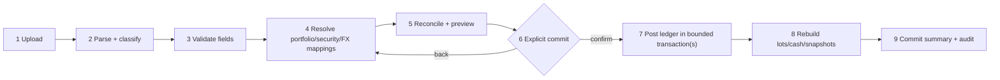

# CSV import specification

Status: normative parser/workflow definition for the supplied export  
Date: 2026-07-28  
Fixture: `docs/Example_Portfolio.csv`

## 1. Observed file

The supplied CSV has:

- one 17-column header;
- 244 physical data rows;
- 65 portfolio-security definition rows;
- 115 transaction rows;
- 64 blank separator rows;
- 101 observed buy transactions and 14 observed sell transactions;
- CRLF/LF/whitespace quirks and a padded `Notes` header;
- FIFO in the `Accounting` field on 13 sell rows;
- 33 zero values in `Purchase Exchange Rate`, treated as missing/unknown;
- at least one `Display Symbol` override (`EPR`);
- date-time strings containing a GMT offset plus a separate transaction-time field.

The sample screens/video and this CSV are independent reference fixtures. Differences in their holdings, quantities, prices, or totals are expected and irrelevant to import semantics.

The supplied 17-column header is the complete supported import contract. Fields not present in that header are outside scope and must not be inferred from visual references.

Counts above are acceptance fixtures and must be re-derived by tests from the exact file rather than hard-coded into production parsing.

## 2. Exact supplied header

The logical 17 fields, after trimming header whitespace, are:

1. `Id`
2. `Symbol`
3. `Name`
4. `Display Symbol`
5. `Exchange`
6. `Portfolio`
7. `Currency`
8. `Shares Owned`
9. `Cost Per Share`
10. `Commission`
11. `Transaction Date`
12. `Transaction Time`
13. `Purchase Exchange Rate`
14. `Type`
15. `Accounting`
16. `Accounting Execution Ids`
17. `Notes`

The physical source header is:

```text
Id,Symbol,Name,Display Symbol,Exchange,Portfolio,Currency,Shares Owned,Cost Per Share,Commission,Transaction Date,Transaction Time,Purchase Exchange Rate,Type,Accounting,Accounting Execution Ids,Notes
```

The actual `Notes` cell has trailing spaces. Matching trims BOM/outer whitespace, collapses internal header whitespace, and compares normalized names. Fields are mapped by name rather than positional index, while parser-version detection records the original order. Missing, duplicate, or unknown logical headers block parsing with a safe header report.

## 3. Field dictionary

| Field                    | Normalized type                                   | Definition-row requirement     | Transaction-row requirement    | Rules                                                                                                              |
| ------------------------ | ------------------------------------------------- | ------------------------------ | ------------------------------ | ------------------------------------------------------------------------------------------------------------------ |
| Id                       | non-empty source string                           | required                       | required                       | trim; file/source-scoped row identity; helps fingerprinting but is not globally unique                             |
| Symbol                   | non-empty string                                  | required                       | required                       | source identifier only; map with exchange/currency, never use as durable identity                                  |
| Name                     | bounded string                                    | optional                       | optional/recommended           | imported display metadata; not unique; provider canonical name may differ                                          |
| Display Symbol           | bounded string                                    | optional                       | optional                       | user-facing override; blank means no override                                                                      |
| Exchange                 | exchange alias                                    | recommended; optional for cash | recommended; optional for cash | normalize through exchange aliases; unresolved listed security blocks commit                                       |
| Portfolio                | non-empty string                                  | required                       | required                       | owner-scoped portfolio mapping key/name; does not itself define home currency                                      |
| Currency                 | currency code                                     | required                       | required                       | native holding/transaction currency; uppercase; must not be silently replaced by home currency                     |
| Shares Owned             | positive decimal                                  | blank                          | required for buy/sell          | normalized transaction quantity; greater than zero; preserve scale                                                 |
| Cost Per Share           | non-negative decimal                              | blank                          | required for buy/sell          | native transaction unit price; zero requires explicit warning/policy                                               |
| Commission               | non-negative decimal                              | blank                          | optional, default `0`          | native transaction currency unless evidence proves otherwise                                                       |
| Transaction Date         | offset-bearing date text                          | blank                          | required                       | parse enumerated format; retain raw value and derived instant/local date                                           |
| Transaction Time         | local time text                                   | blank                          | optional                       | reconcile with date offset/time under documented rule                                                              |
| Purchase Exchange Rate   | positive decimal or missing                       | blank                          | optional                       | source zero becomes unknown; direction must be confirmed/mapped                                                    |
| Type                     | enum                                              | blank                          | required                       | observed `Buy`/`Sell`; normalize case; unknown type blocks                                                         |
| Accounting               | enum                                              | blank                          | optional on sell               | observed `FIFO`; blank may default with warning; unsupported value blocks                                          |
| Accounting Execution Ids | bounded source string/list, semantics unconfirmed | optional                       | optional                       | blank throughout supplied file; preserve raw for round-trip; do not drive lot matching without confirmed semantics |
| Notes                    | bounded string                                    | optional                       | optional                       | preserve content after line-ending normalization; escape on export/display; never execute                          |

The importer never silently supplies an exchange, security currency, date timezone, or FX direction from ticker alone.

### Legacy cash pseudo-security

The supplied file’s `AUD=CASH` rows are a versioned legacy encoding, not a listed security:

- a definition row with symbol `<ISO currency>=CASH`, blank exchange, and the same `Currency` may create/map the owned portfolio’s cash account for that currency; it creates no canonical security or quote request;
- a matching transaction requires unit price exactly `1`, zero/blank commission, quantity as the cash amount, and no conflicting security fields;
- `Buy` normalizes to `cash_deposit`; `Sell` normalizes to `cash_withdrawal`;
- the original symbol/type/price remain in import provenance;
- any other `=CASH` shape blocks with `CASH_ENCODING_INVALID` rather than being guessed.

This compatibility rule applies only to this parser version. Native YieldToMe ledger events use explicit cash transaction types.

### Dividend-receipt rows (TASKS.md `IMP-006` task; requirement `IMP-007` -- the requirement id `IMP-006` was already taken by "Alternative CSV variants (deprecated)" above, so this feature's requirement is `IMP-007`, per AGENTS.md's "preserve stable requirement IDs, never reuse")

A second, backward-compatible header version supports dividend-receipt rows in the same staged import pipeline as trades: `strict-18-column-dividends-v1`, which is the exact 17-column header from §2 plus one trailing column, `Franking Credit Per Share`. Both parser versions remain permanently supported and are selected by exact header signature match (§14) -- an ordinary 17-column trade-only export keeps parsing under `strict-17-column-v1` unchanged; a `Type` value of `Dividend` is accepted under either header version, but franking data can only be supplied through the 18-column header (a `Dividend` row under the 17-column header always has unknown franking).

Column mapping for a `Dividend` row reuses the trade columns with dividend-specific meaning, so no other new columns are needed:

| Column                                               | Dividend-row meaning                                                                                                                                                                                                                                            |
| ---------------------------------------------------- | --------------------------------------------------------------------------------------------------------------------------------------------------------------------------------------------------------------------------------------------------------------- |
| `Symbol`/`Exchange`/`Currency`                       | Resolves the security exactly like a trade row (same candidate-matching rules, same `SECURITY_UNRESOLVED`-equivalent blocking issue: `SECURITY_MAPPING_REQUIRED`)                                                                                               |
| `Transaction Date`                                   | The dividend's **payment date** (same offset/timezone parsing as trades; `Transaction Time` is optional and ignored -- payment date is a calendar date, not an instant)                                                                                         |
| `Shares Owned`                                       | Shares the receipt is calculated against                                                                                                                                                                                                                        |
| `Cost Per Share`                                     | Dividend per share (native currency); must be a positive decimal -- zero is rejected (`DIVIDEND_PER_SHARE_INVALID`) since a $0 dividend is not a fact worth importing                                                                                           |
| `Franking Credit Per Share`                          | Franking credit per share (native currency), **optional**. Blank/absent = unknown, never zero (`FRANKING_INVALID` blocks a present-but-malformed or negative value; a genuinely-supplied `0` is preserved as an explicit unfranked fact, distinct from unknown) |
| `Commission`, `Purchase Exchange Rate`, `Accounting` | Unused/ignored for `Dividend` rows -- dividend rows never resolve FX at import time (see below) and never touch cost basis/lots                                                                                                                                 |

A `Dividend` row is staged/classified/previewed through the identical `transaction`-class pipeline as a trade row (same `import_rows.row_class = 'transaction'`), so no new resolution-card type exists for the reviewer UI: portfolio and security mapping decisions, and the `SECURITY_MAPPING_REQUIRED`/`SECURITY_MAPPING_AMBIGUOUS` blocking issues, all work exactly as they do for trades. The one deliberate difference is FX: because `dividend_manual_records` (see below) stores native per-share amounts only, a `Dividend` row never triggers `FX_DIRECTION_REQUIRED`/`FX_RATE_INCOMPLETE` and never consumes `Purchase Exchange Rate`. The reconciliation preview reports dividend rows in a separate `counts.dividendCreates` figure alongside `counts.transactionCreates`, and the parse summary reports a separate `summary.dividendRows` count alongside `summary.transactionRows`.

**Why `dividend_manual_records`, not `dividend_receipts`, on commit.** `dividend_receipts` (DB-005) requires a NOT NULL `dividend_event_id` foreign key to the shared, provider-populated `dividend_events` table (MKT-005). The importer has no safe way to fabricate or guess that a specific provider corporate-action event exists for an arbitrary broker CSV row, and requiring one to already exist would make dividend import fail whenever the configured provider has not ingested that exact event -- defeating the point of an import path whose purpose is filling gaps the provider missed. `dividend_manual_records` is DIV-001's own table for exactly this case ("a security/payment the provider never surfaced as an event").

**Precedence (DIV-004, 2026-08-13 -- restores the full ordering).** DIV-001's read-time derivation (`domain/dividends/history.ts`) has FIVE distinct tiers, highest first: override > manual (owner-typed) > receipt > imported > auto-derived (matching `docs/CALCULATIONS.md` §11's numbered list exactly). A CSV-imported row is a `dividend_manual_records` row with `import_batch_id` set; this is the SOLE signal the derivation uses to place it in the `imported` tier, strictly below an owner-typed manual record (`import_batch_id IS NULL`) and below a `dividend_receipts` row (actual payment evidence). Proximity dedupe (DIV-001's `PROXIMITY_WINDOW_DAYS`, 7 days) works ACROSS these tiers: an imported row that proximity-matches the same provider event as an owner-typed manual record or a receipt is consumed into that higher-tier row rather than producing a second row -- its values stay visible via the row's `dominatedImported` field, never silently dropped. The same collapse applies when neither fact is attached to a provider event: an imported row is matched directly against every standalone owner-typed manual record and standalone/orphan receipt for the security before it is allowed to become its own standalone row, so a CSV re-entry of a dividend the owner already typed by hand collapses to ONE row (owner wins) instead of two. An imported row that matches neither an event nor an owner fact wins its own row with `source: "imported"` -- still ranked above the provider's own auto-derived figure (an imported row is real evidence the provider never surfaced as an event). See `docs/CALCULATIONS.md` §11's "Derived dividend history" subsection for the full per-tier resolution algorithm.

**Preview-time near-duplicate warning (DIV-004).** Before commit, the reconciliation preview (`domain/imports/reconciliation.ts`) checks every incoming `Dividend` row, once its security has resolved, against the owner's EXISTING persisted dividend facts for that same security: owner-typed manual records (`import_batch_id IS NULL`) and receipts, loaded by the caller (`app/import-actions.ts`'s `loadReview`). A row whose payment date falls within the same `PROXIMITY_WINDOW_DAYS` (7-day) window as an existing owner fact raises `DIVIDEND_NEAR_EXISTING_ENTRY`, a **warning-severity** issue -- it never blocks readiness or commit, exactly like `FRANKING_ON_NON_DIVIDEND`, because it is a proximity heuristic flagging a PROBABLE duplicate for the owner to check, not a certain one. Deliberately excluded from this check: a nearby PREVIOUSLY-IMPORTED row (one with `import_batch_id` already set) -- an imported-vs-imported near match is cross-batch dedupe's job (the `source_reference` idempotency key checked at commit time in `db/repositories/import-commit.ts`'s `resolveInput`), not this warning's.

**`DIVIDEND_NEAR_EXISTING_ENTRY` is advisory display evidence, excluded from `previewVersion` hashing (Orchestrator ruling, review round 1 BLOCKING B1 fix).** `evidence.existingDividendEntries` is supplied only by the page/refresh preview path; the ready-service, security-verification-service, and import-commit revalidation paths call `buildImportReview` (`domain/imports/review.ts`) without it, since the warning never gates readiness or commit. If the warning's presence changed the hashed `previewVersion`, those paths would compute a DIFFERENT version than the one the page rendered and echoed back as `expectedPreviewVersion`, permanently 409ing an affected batch's ready/commit with no recovery path. `buildImportReview` therefore excludes `DIVIDEND_NEAR_EXISTING_ENTRY` from the hash input by construction (filtered out of the preview snapshot before hashing, still present in the returned preview for rendering) so `previewVersion` is identical whether or not the warning fires. A practical consequence: an owner-typed manual record added in another tab does not invalidate an already-open preview's version -- intended, since the warning is advisory and does not change what would actually commit.

**Schema addition.** `dividend_manual_records` gained two nullable, FK-less columns for this: `import_batch_id` (which batch created the row, for reversal) and `source_reference` (the same `import-fingerprint:<row fingerprint>` idempotency key trades store on `transactions.source_reference`), plus a unique index on `(portfolio_id, source_reference)`. Both are `ALTER TABLE ADD COLUMN`s (no table rebuild), added FK-less to mirror the existing precedent of `import_rows.commit_transaction_id`/`transactions.source_reference` (neither of which carry a formal FK either); ownership and target validity are checked procedurally at commit time before the insert, the same way every other import-commit target is. Rows created by the manual-entry UI (not import) leave both columns `NULL`.

**Idempotency and duplicate detection.** A `Dividend` row's natural key is the same versioned fingerprint scheme trades use (§10 "Row identity"), extended to include the franking column; the resulting `import-fingerprint:<fingerprint>` value is stored as `dividend_manual_records.source_reference` exactly as trades store it on `transactions.source_reference`. A second import (same batch resumed, or a different batch re-exporting the identical source row -- same `Id` and same normalized values) is detected by looking up that value before inserting: an existing match causes the row to be skipped and linked (`import_rows.commit_transaction_id`) to the existing manual record's id, never a duplicate insert.

### Sharesight sync (TASKS.md `BRK-005`)

A second, non-CSV batch source feeds the identical staged import pipeline: an owner-initiated read-sync against Sharesight (User API v3, via the sealed GET-only client `domain/sharesight/`) for a portfolio the owner has explicitly linked (`sharesight_sync_state.sharesight_portfolio_id`, `POST /api/portfolios/:id/sharesight-link`). `POST /api/portfolios/:id/sharesight-sync` (CSRF-first, owner-scoped) fetches that portfolio's trades and payouts, transforms them (`domain/sharesight-sync/transform.ts`) into the same `ParsedImportRow`/`NormalizedImportRow` shape a CSV upload produces, and stages them through the SAME `db/repositories/import-staging.ts` entry points (`startUpload`/`recordParseResult`) -- preview, mapping resolution, readiness, commit, and reversal are all the existing, unmodified machinery; a Sharesight-sourced batch is not a parallel pipeline. `import_batches.parser_format` records `sharesight_sync` (`parser_version` `sharesight-sync-v1`), distinguishing it from `strict-versioned-csv` batches; `app/import-ready-service.ts` and `db/repositories/import-commit.ts` each widen their `(parserFormat, parserVersion)` allowlist by exactly this one additional pair -- the only change either module needed.

**Trade mapping.** Each Sharesight trade becomes a `buy`/`sell` transaction row using `instrumentCode`/`marketCode`/`currencyCode` exactly like a CSV row's `Symbol`/`Exchange`/`Currency` (same security-resolution machinery, same `SECURITY_MAPPING_REQUIRED` blocking). Direction is confirmed from `valueDecimal`'s sign (negative = sell, live-confirmed), cross-checked against `transactionType` (when `buy`/`sell`, not `other`) and a small conservative `descriptionCode` allowlist (`BUY`/`SELL` -- an explicit ASSUMPTION, since no live evidence confirms Sharesight's full `description_code` enum). Any disagreement among the signals that are available, or no signal at all, stages the row as `unsupported` with an error-severity `TRANSACTION_TYPE_UNKNOWN` issue -- never guessed. Idempotency: `source_reference` derives from the trade's own stable Sharesight id (`import-fingerprint:sharesight-trade:<id>`), so a repeat sync of the same trade is caught by the existing cross-batch `source_reference` uniqueness, exactly like a re-uploaded CSV row.

**Payout mapping -- totals, never fabricated per-share amounts.** Sharesight payouts report a TOTAL cash amount (`amountDecimal`) and total franking credits (`frankingCreditsDecimal`), never a share count or a per-share amount. Each payout with a confirmed (non-null) `id` becomes a `Dividend`-type row whose `sharesOwned`/`costPerShare`/`frankingPerShare` are all `null` and whose two new fields, `totalCashDecimal`/`totalFrankingDecimal` (on `NormalizedImportRow`, always `null` for a CSV-parsed row), carry the real totals. `db/repositories/import-commit.ts`'s existing dividend-row commit branch reads `normalized.totalCashDecimal` to choose between the totals-mode and per-share-mode insert into `dividend_manual_records` -- see `docs/DATA_MODEL.md`'s `dividend_manual_records` entry for the schema and `docs/CALCULATIONS.md` §11 for the derivation rule. A payout with a `null` id (Sharesight's own declared-but-unconfirmed distribution -- this codebase's "estimated/declared" provider-event concept, not a paid fact) is SKIPPED entirely: never staged as a row, surfaced instead as a batch-level warning-severity `SHARESIGHT_PAYOUT_UNCONFIRMED` issue so the omission is visible, not silent. Idempotency mirrors trades: `import-fingerprint:sharesight-payout:<id>`.

**Provenance and watermark.** Every staged row's own `Id` field (and therefore its fingerprint) carries the Sharesight trade/payout id. `sharesight_sync_state.last_synced_at` updates on successful STAGING (not on commit, which remains a separate later owner-driven step); `last_trade_watermark` is left untouched by this task -- each sync re-fetches the full trade/payout list rather than filtering by a date cursor, relying on `source_reference` cross-batch dedupe (and the batch-level file-fingerprint — a canonical hash of the LOCAL `portfolioId`, the linked `sharesightPortfolioId`, and each row's own VALUE-BEARING normalized content, never bare trade/payout ids — which makes a no-op resync of the SAME local portfolio resolve to the SAME batch, and keeps two different local portfolios linked to the same Sharesight portfolio from colliding on one shared batch) for idempotency; narrowing the fetch itself is an unplanned incremental-sync design left for a future task. No Sharesight payload is ever logged or dumped.

**Commit atomicity.** The manual-record insert (plus its audit row) is built as `SqlStatement`s only, not executed independently -- `db/repositories/dividends.ts`'s `buildDividendManualRecordImportInsertStatements` mirrors `buildLedgerPostingStatements`'s "prepare, don't execute" shape precisely so `db/repositories/import-commit.ts` folds it into the same atomic chunk `client.batch()` call as the `import_rows` status update. A batch mixing trade and dividend rows in the same chunk commits both, or neither, atomically.

**Reversal semantics.** Dividend rows never post through the ledger, so they have no compensating reversal transaction the way trades do. DIV-001 treats `dividend_manual_records` as an owner-mutable/deletable fact (its own repository already exposes a hard `remove()` for the manual-entry UI), not an immutable ledger entry -- there is no "reversed" status column on this table, and adding one purely for import provenance was rejected as unnecessary schema surface. Reversing a batch therefore **deletes** exactly the `dividend_manual_records` rows it created (`WHERE user_id = ? AND import_batch_id = ?`) and marks the corresponding `import_rows` `commit_status = 'reversed'`, both as idempotent, self-guarded statements folded into the same atomic `finalize()` call trades' compensating-reversal statements already use -- safe to include on every invocation of a resumed/repeated reversal, including a batch containing only dividend rows (no trade transactions to reverse at all).

## 4. Row grammar

Parsing first preserves every physical row and all original field strings.

### Blank row

All logical fields are empty after trimming. Record it as `blank` for diagnostics and ignore on commit.

### Portfolio-security definition row

Required:

- non-empty `Id`, `Symbol`, `Portfolio`, and `Currency`;
- blank `Type`, `Transaction Date`, `Shares Owned`, and `Cost Per Share`;
- `Accounting` blank;
- no contradictory security/trade values.

Creates/maps the owned portfolio and its portfolio-security membership, including watch-only symbols. It creates no quantity, cash, cost, or transaction. Definition order does not grant ownership outside the authenticated import batch.

### Transaction row

Required:

- non-empty `Id`, `Symbol`, `Portfolio`, and `Currency`;
- supported `Type`;
- valid `Transaction Date`;
- valid positive `Shares Owned` and valid `Cost Per Share` for buy/sell;
- resolvable security candidate from symbol + exchange + currency context;
- supported/blank `Accounting` under the transaction rule.

Portfolio/security reference fields repeat definition data; batch conflicts are errors, not last-write-wins. A transaction appearing without a definition row can be staged with a warning, but no implicit cross-user mapping is allowed.

The legacy cash shape above follows the same physical transaction grammar but maps to a cash account/event instead of a portfolio security, lot, or holding.

### Unsupported row

Any nonblank row that satisfies none or multiple row grammars. It remains staged with issues and cannot be committed until the parser version or mapping decision resolves it.

Classification must use row content, never “last seen row type” alone.

## 5. Date and timezone normalization

1. Preserve original date and time strings.
2. Parse only enumerated formats observed in fixtures.
3. If `Transaction Date` carries a numeric/GMT offset, that offset determines the instant.
4. If separate `Transaction Time` supplies a time absent from the date field, combine it under the explicit offset/portfolio timezone rule.
5. If both contain time and disagree, emit `DATE_TIME_CONFLICT` and block commit unless user resolves it.
6. Derive `trade_at` in UTC and `local_trade_date` in portfolio timezone.
7. DST ambiguity without an explicit offset blocks automatic commit.

No environment-locale date parsing is allowed.

## 6. FX interpretation

The column name `Purchase Exchange Rate` does not establish direction. During mapping/preview, show:

- transaction/security currency;
- user home/reporting currency;
- source value;
- assumed equation.

The selected v1 normalized convention is:

`base amount = native amount × fx_rate_to_base`

If source examples prove the exported rate is inverse, invert with decimal arithmetic and retain:

- original rate;
- original direction;
- transformation version;
- normalized rate.

Source zero becomes missing with `FX_ZERO_TREATED_AS_UNKNOWN`. It does not block native ledger import but blocks dependent base-basis/realised calculations until resolved.

## 7. Upload constraints and safety

- Authenticated owner only.
- `.csv` extension is advisory; validate content as bounded text.
- Initial size limit: 10 MiB and 100,000 physical rows; make configurable. This release contract requires a Workers Paid production deployment because Workers Free cannot guarantee the parse/normalize/hash workload within its 10 ms CPU limit.
- A deployment configured as Workers Free rejects CSV import before reading the body. Enabling a smaller Free limit requires a separate Worker-runtime benchmark and a documented configuration profile.
- Stream/bounded parse; reject NUL/binary content and pathological field sizes.
- Support UTF-8 with optional BOM. Non-UTF-8 requires explicit future encoding support.
- Do not evaluate spreadsheet formulas, HTML, Markdown, URLs, or note content.
- Escape formula-leading characters on any later CSV export.
- Sanitize filename for display; never use it as an object path.
- Store SHA-256, size, parser version, and normalized rows; do not retain original bytes in v1.
- Redact raw values from operational logs.
- Known risk: Stage 2/3 parse-persistence (`persistParsedResult`) commits every parsed row/issue in one atomic D1 `batch()` call (see `docs/DATA_MODEL.md` §11). Its statement count is bounded by the 100,000-row cap above, not by D1's verified ~1000-statement-per-batch ceiling; an upload with a large enough row/issue count can exceed that ceiling, in which case the whole call fails closed (nothing persists, the upload is retryable) rather than corrupting data. Tightening the row cap to fit one batch, or replacing this stage with a resumable multi-invocation design, is tracked as follow-up work.

## 8. Staged workflow



### Stage 1 — Upload

Create `import_batch` with owner, metadata, SHA-256, and parser version. Exact duplicate upload is reported before parsing if prior batch status allows.

### Stage 2 — Parse/classify

Normalize header, retain physical row number, preserve original strings, and classify each row. No domain records change.

### Stage 3 — Validate

Emit stable field/row issue codes. Separate:

- error: blocks affected row/batch commit;
- warning: requires visibility and sometimes acknowledgement;
- info: normalization disclosure.

### Stage 4 — Map

Resolve:

- `Portfolio` source name to a new/existing owned portfolio;
- currency/exchange aliases;
- security using exchange + symbol + currency + name/identifier evidence;
- FX direction/missing value;
- `Accounting` method and any confirmed execution-ID semantics.

Candidate confidence can sort options but cannot auto-merge ambiguous securities.

A brand-new symbol that matches no existing owned candidate (resolved or unresolved) cannot be resolved by a mapping decision alone -- the shared `securities` master is writable only through the server-verified path (`docs/DATA_MODEL.md` §4). IMP-004B's "verify security" flow (`app/security-verification-service.ts`, `POST /api/import/preview/:batchId/securities/verify`) lets the owner request that verification directly from the review screen: the server re-derives the candidate's symbol/exchange/currency from its own current preview (never the client's fields alone), looks it up against the configured market-data provider, and -- only on a currency- and exchange-agreeing match -- publishes the canonical security (or links to an already-published one for the same provider identity) and resolves the owner's candidate. An unavailable, ambiguous, or mismatched provider result is an explicit failure; the candidate stays private and unresolved, and the owner can retry or fall back to mapping the row onto a different existing candidate instead.

### Stage 5 — Reconcile/preview

Show:

- portfolios/securities to create or map;
- transaction counts and date range;
- buys/sells, quantities, fees/costs, and currencies;
- duplicates/skips;
- missing FX/basis warnings;
- oversells or negative cash effects;
- before/after holding quantities where meaningful;
- calculation coverage consequences.

The user must be able to download/copy an issue report without source formulas executing.

The owner explicitly moves a `parsed`/`needs_mapping` batch to `ready` once every mapping is resolved. That transition is itself server-revalidated: it recomputes the owner-scoped reconciliation and the batch's persisted validation issues straight from the database (never trusting a client-supplied preview) and only proceeds when no error-severity reconciliation issue and no unresolved persisted issue remains. This is a preview-level precondition, not a substitute for Stage 6's commit gate: commit's revalidation independently re-checks row-level persisted state (invalid rows, error counts, unresolved transaction targets) as the final authority before committing. Only a `ready` batch can be committed.

### Stage 6 — Commit

Require explicit confirmation and unique idempotency key. Reconstruct the owner-scoped reconciliation on the server and require an exact digest of its parser, rows, issues, mapping versions, owned portfolios, security memberships, and preview result. A version-shaped token is insufficient. The conditional transition to `committing` guards the row/issue/mapping counts and version totals so a concurrent review change leaves the batch `ready` and forces a new preview. Mapping writes fail once the transition wins.

### Stage 7 — Post

For each bounded chunk:

- atomically create/update authorized portfolio/reference links;
- create immutable ledger/source records;
- create cash effects;
- link each result to import row/batch;
- store commit high-water mark and audit event.

The validated row-level portfolio/security target and FX direction are the only mapping result consumed by posting. Persist durable target IDs in the same bounded unit as their ledger effect; never resolve them again from display symbols during posting. Process at most one chunk per Worker invocation so the 50-query invocation budget, 50-statement atomic-unit budget, and 100-parameter-per-query bound remain enforceable.

Stage 2/3 parse-persistence (`persistParsedResult` in `db/repositories/import-staging.ts`) is an Orchestrator-approved exception to the 50-statement atomic-unit budget above: it is one atomic `batch()` call whose statement count equals one status-transitioning `UPDATE` plus one guarded `INSERT` per parsed row/issue, bounded by the upload row cap in §7 (100,000 rows) rather than by a 50-statement chunk size. See `docs/DATA_MODEL.md` §11 ("Guard-conditional single batch") for the atomicity technique and the documented risk that an upload near the row cap can exceed D1's per-batch statement ceiling and fail closed.

If the entire batch cannot be one D1 transaction, status and chunk idempotency must allow resume without duplicate effects. Batch becomes `committed` only after every intended row and rebuild job is durably recorded.

### Stage 8 — Rebuild

For every affected owned portfolio, derive the imported effective-date range and the current real ledger high-water transaction ID. Durably create one idempotent rebuild request per portfolio before marking the batch committed. Rebuild FIFO lots, holdings, cash reconciliation, and affected snapshots from the earliest imported effective date; a synthetic import row marker is not a ledger high-water value.

### Stage 9 — Summary

Show committed/skipped counts, warnings that remain, coverage impacts, and reversal action.

Import history is private, owner-scoped, and non-cacheable. Batch detail returns source rows, issues, mapping decisions, and audit events in fixed-size pages rather than loading the complete file into one Worker response. When status remains `committing`, detail also returns the durable physical-row high-water, committed/skipped/remaining counts, and the stored commit idempotency key; the resume action must reuse that key and must continue to label the batch incomplete until finalization is durable.

## 9. Issue code baseline

| Code                            | Severity | Meaning                                                                                                                                |
| ------------------------------- | -------- | -------------------------------------------------------------------------------------------------------------------------------------- |
| `HEADER_MISMATCH`               | error    | logical header differs from supported 17-column version                                                                                |
| `COLUMN_COUNT`                  | error    | row field count cannot be safely reconciled                                                                                            |
| `ROW_UNCLASSIFIED`              | error    | nonblank row matches no grammar                                                                                                        |
| `ROW_AMBIGUOUS`                 | error    | row matches conflicting grammars                                                                                                       |
| `PORTFOLIO_MISSING`             | error    | transaction has no definition/mapping                                                                                                  |
| `PORTFOLIO_CONFLICT`            | error    | repeated name/currency/method conflict                                                                                                 |
| `CURRENCY_UNKNOWN`              | error    | unsupported currency                                                                                                                   |
| `EXCHANGE_UNRESOLVED`           | error    | exchange alias cannot map                                                                                                              |
| `SECURITY_UNRESOLVED`           | error    | no confirmed canonical security                                                                                                        |
| `SECURITY_AMBIGUOUS`            | error    | multiple candidates                                                                                                                    |
| `TRANSACTION_TYPE_UNKNOWN`      | error    | unsupported type                                                                                                                       |
| `DATE_INVALID`                  | error    | not an enumerated date format                                                                                                          |
| `DATE_TIME_CONFLICT`            | error    | embedded/separate times disagree                                                                                                       |
| `QUANTITY_INVALID`              | error    | missing/nonpositive buy/sell quantity                                                                                                  |
| `PRICE_INVALID`                 | error    | missing/invalid price                                                                                                                  |
| `FX_ZERO_TREATED_AS_UNKNOWN`    | warning  | source zero normalized to missing                                                                                                      |
| `FX_DIRECTION_UNCONFIRMED`      | error    | base/native interpretation unresolved                                                                                                  |
| `FEE_INVALID`                   | error    | negative/invalid cost                                                                                                                  |
| `ACCOUNTING_UNSUPPORTED`        | error    | method is not FIFO                                                                                                                     |
| `DUPLICATE_EXACT`               | info     | exact normalized row already committed                                                                                                 |
| `DUPLICATE_POSSIBLE`            | warning  | close semantic match needs decision                                                                                                    |
| `OVERSELL`                      | error    | sells exceed available mapped lots                                                                                                     |
| `HISTORY_INCOMPLETE`            | warning  | import lacks opening cash/basis/history                                                                                                |
| `DISPLAY_SYMBOL_OVERRIDE`       | info     | display symbol differs from canonical map                                                                                              |
| `CASH_ENCODING_INVALID`         | error    | legacy `=CASH` row violates the exact compatibility rule                                                                               |
| `DIVIDEND_PER_SHARE_INVALID`    | error    | `Cost Per Share` on a `Dividend` row is zero (IMP-006)                                                                                 |
| `FRANKING_INVALID`              | error    | `Franking Credit Per Share` present but malformed or negative -- blank stays unknown, not an error (IMP-006)                           |
| `FRANKING_ON_NON_DIVIDEND`      | warning  | `Franking Credit Per Share` populated on a non-`Dividend` row -- surfaced, ignored, and excluded from that row's fingerprint (IMP-006) |
| `SHARESIGHT_PAYOUT_UNCONFIRMED` | warning  | a Sharesight payout with no confirmed id (declared/unconfirmed distribution) was skipped, never staged (BRK-005)                       |

## 10. Idempotency and duplicate detection

### File identity

`file fingerprint = SHA-256(exact uploaded bytes)`

Same owner + fingerprint + parser version finds exact uploads. The user can inspect the existing batch rather than create ledger effects again.

### Row identity

Create a versioned canonical serialization after mapping:

`portfolio target | Type | security target | UTC trade instant | Shares Owned | Cost Per Share | Currency | Commission | source Id | Accounting | Accounting Execution Ids | Notes normalization`

Hash it with parser/fingerprint version. The fingerprint excludes cosmetic source whitespace but includes values that change financial effect.

Rules:

- exact committed fingerprint in the same portfolio: skip/report by default;
- close match: require user decision;
- duplicates within batch: block or explicitly deduplicate;
- security definition duplicates merge only when canonical target and nonconflicting values match.

### Commit identity

Unique `(batch_id, commit_idempotency_key)`. A repeated request returns the original outcome. Chunk keys derive from batch + stable chunk sequence and do not depend on retry timing.

## 11. Mapping corrections

Before commit, a decision edits only staged target fields.

After commit:

1. Create a new mapping-decision version with reason.
2. Identify all affected transactions/portfolio-security rows.
3. In one controlled operation, supersede/relink allowed facts or reverse/repost when security identity changes financial projections.
4. Invalidate lots/snapshots from earliest affected date.
5. Record audit event and before/after counts.

Never update a canonical global security because one user corrects a display label. Shared master-data changes require separate verified evidence.

## 12. Batch reversal and corrected re-import

Reversal is an explicit, idempotent operation:

1. Confirm owner, batch status, and impact.
2. Block or require a plan if later manual/other imported facts depend on lots created by this batch. Dependency ordering uses the stable ledger key `(trade_at, transaction_id)`, including when two facts share a timestamp.
3. Mark original transactions reversed through compensating/superseding ledger records.
4. Reverse linked cash entries and receipts.
5. Expire portfolio-specific relationships created only by the batch when unused.
6. Retain batch, rows, mappings, and audit.
7. Rebuild from earliest affected date.
8. Mark batch `reversed`.

A corrected file creates a new batch with `supersedes_batch_id`; it never mutates the original batch.
Each authenticated reversal request passes same-origin mutation checks and processes at most one configured transaction chunk. The chunk-size ceiling keeps its query count, total and per-atomic-unit statement counts, and bound parameters within the declared D1 limits; retries resume through the stored batch state and idempotency key.

## 13. Reconciliation

Commit acceptance checks:

- transaction counts by type match preview;
- buy/sell quantities match normalized rows;
- commissions sum by currency;
- no unintended oversell;
- holding quantity equals ledger projection;
- lot quantities reconcile;
- every financial transaction has expected cash effect or an explicit `cash_history_incomplete` exception;
- the four supplied `AUD=CASH` transactions produce cash events only and no security lots/market-data requests;
- all committed rows link to a resulting fact or explicit skip reason;
- portfolio home/reporting currency and accounting conflicts are resolved;
- audit count and batch status are consistent.

Imported CSV does not appear to contain deposits, dividend receipts, settlement dates, all corporate actions, or reliable FX for every transaction. Therefore cash balances, realised base gains, income, and full historical performance may remain incomplete. The UI must state that boundary.

## 14. Unknown-header policy

If a file does not match one of the confirmed header signatures -- the 17-column `strict-17-column-v1` contract (§2) or the 18-column dividend-capable `strict-18-column-dividends-v1` contract (§3a's "Dividend-receipt rows"):

- retain upload metadata;
- return `HEADER_MISMATCH` with the observed header names/count (diffed against the 17-column contract, the primary supported shape);
- do not discard, reposition, or guess fields;
- do not pass it into either supported parser;
- require an explicit, separately versioned schema decision before support for a further header shape is added.

Parser selection is by exact normalized header signature -- tried in order, first match wins -- not field count alone. A batch's `import_batches.parser_version` records exactly which of the two matched.
