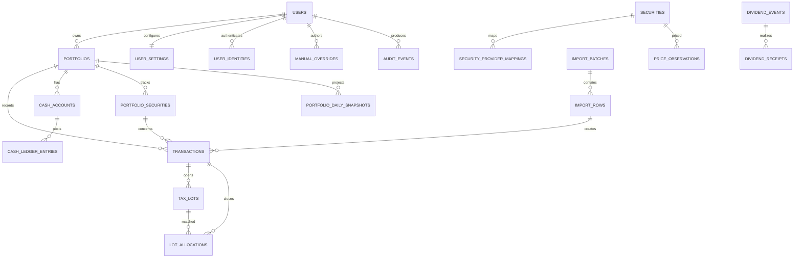

# YieldToMe data model

Status: proposed D1 schema; implement through reviewed Drizzle migrations  
Date: 2026-07-28

## 1. Conventions

- Primary IDs are opaque text identifiers generated by the application.
- Timestamps are UTC RFC 3339 text (`*_at`); market/accounting dates are ISO `YYYY-MM-DD` text (`*_date`).
- IANA timezone names are stored where local-day boundaries matter.
- Currency codes are uppercase ISO 4217 where available.
- Financial decimals are canonical strings, for example `"-1234.5600"`. Application validators reject exponent notation, NaN, infinity, and excessive scale.
- Booleans are D1 integers constrained to `0` or `1`.
- Enums are text with `CHECK` constraints and mirrored TypeScript unions.
- All mutable tables have `created_at`, `updated_at`, and usually `version`.
- Corrections use status/supersession/reversal records. Hard deletes are reserved for verified account purge.
- Shared reference data is separate from user-owned financial data.
- Every relationship that can change a user’s financial result carries enough owner/portfolio columns for a composite foreign key. Application validation adds domain rules; it does not replace enforceable ownership constraints.

Why decimal text: D1’s integers are signed 64-bit and one global scale cannot safely cover fractional quantities, FX precision, prices, and large portfolio values. SQLite `REAL` is binary floating point. Decimal text plus strict application parsing is the safest v1 representation; sortable/reporting values are derived through the domain layer, not ad hoc SQL arithmetic.

## 2. Relationship map



## 3. Identity and ownership

### `users`

| Column              | Type         | Constraints / meaning                                         |
| ------------------- | ------------ | ------------------------------------------------------------- |
| `id`                | TEXT         | PK                                                            |
| `status`            | TEXT         | `pending`, `active`, `disabled`, `deletion_pending`, `purged` |
| `display_name`      | TEXT         | nullable                                                      |
| `primary_email`     | TEXT         | contact/display only, normalized                              |
| `locale`            | TEXT         | default `en-AU`                                               |
| `timezone`          | TEXT         | IANA name                                                     |
| `terms_accepted_at` | TEXT         | nullable                                                      |
| `last_seen_at`      | TEXT         | nullable                                                      |
| timestamps/version  | TEXT/INTEGER | standard                                                      |

Indexes: status; normalized email is non-unique because it is not identity.

### `user_identities`

| Column                  | Type | Constraints / meaning         |
| ----------------------- | ---- | ----------------------------- |
| `id`                    | TEXT | PK                            |
| `user_id`               | TEXT | FK users, restrict delete     |
| `provider`              | TEXT | initially `cloudflare_access` |
| `issuer`                | TEXT | verified Access issuer        |
| `subject`               | TEXT | verified stable subject       |
| `email_at_link`         | TEXT | audit metadata                |
| `status`                | TEXT | `active`, `revoked`           |
| `last_authenticated_at` | TEXT | nullable                      |

Unique: `(provider, issuer, subject)`. Never auto-link solely on email.

### `user_settings`

One-to-one with user:

- `user_id` primary/composite owner key;
- required `home_currency_code` FK to currencies;
- IANA timezone and locale/display defaults;
- default native/home holding-price view;
- timestamps/version.

Home currency is the canonical reporting currency. Changing it is an explicit recalculation event, not a cosmetic database update.

### `portfolios`

| Column                  | Type | Constraints / meaning                                                            |
| ----------------------- | ---- | -------------------------------------------------------------------------------- |
| `id`                    | TEXT | PK                                                                               |
| `user_id`               | TEXT | FK users                                                                         |
| `code`                  | TEXT | owner-scoped stable short code                                                   |
| `name`                  | TEXT | display name                                                                     |
| `base_currency_code`    | TEXT | effective home/reporting currency, initialized from user settings; FK currencies |
| `timezone`              | TEXT | IANA                                                                             |
| `accounting_method`     | TEXT | v1 `fifo`                                                                        |
| `history_complete_from` | TEXT | nullable local date                                                              |
| `status`                | TEXT | `active`, `archived`                                                             |
| timestamps/version      |      |                                                                                  |

Unique: `(user_id, id)` for composite FKs; `(user_id, code)`. Index `(user_id, status, updated_at)`.

### `portfolio_settings`

One-to-one with portfolio, including `user_id` composite ownership:

- display currency preferences;
- quote staleness policy;
- mobile density preferences;
- feature flags that are genuinely user settings, not security switches.

Unique/FK: `(portfolio_id, user_id) -> portfolios(id, user_id)`.

Dividend assumptions are not part of the core schema. Add them only with the deferred dividend workflow.

## 4. Reference and security master

### `currencies`

Shared table: `code` PK, `numeric_code`, name, minor-unit digits, active flag. Non-ISO pseudo-currencies require an explicit namespace and are out of v1.

### `exchanges`

Shared table:

- `id`, canonical name, MIC, country code;
- timezone;
- default currency;
- trading calendar identifier;
- active flag.

Unique MIC when present.

### `securities`

Shared canonical identity:

| Column                                | Meaning                                                                |
| ------------------------------------- | ---------------------------------------------------------------------- |
| `id`                                  | durable internal security ID                                           |
| `asset_type`                          | v1 `equity`, `etf`, `fund`                                             |
| `exchange_id`                         | verified primary exchange when known; null is not an unresolved marker |
| `primary_currency_code`               | trading currency                                                       |
| `canonical_name`                      | issuer/fund name                                                       |
| `isin`                                | nullable, unique where trusted                                         |
| `status`                              | `active`, `delisted`                                                   |
| `first_trade_date`, `last_trade_date` | nullable                                                               |

Ticker deliberately does not live here as an eternal identifier.
Unresolved candidates remain private in `portfolio_securities`; they are not rows in this shared table.

### `security_identifiers`

Validity-dated identifiers:

- `security_id`;
- `scheme` (`ticker`, `isin`, `cusip`, `sedol`, `provider_symbol`, later);
- `value`;
- `exchange_id` where scheme needs it;
- `valid_from`, `valid_to`;
- source/provenance.

Unique within scheme/exchange/date model. Overlapping validity intervals are rejected in the service.

### `market_data_providers`

Provider registry:

- code/name;
- active flag;
- capability JSON limited to non-secret metadata;
- rate-limit configuration;
- technical review date and operator notes reference.

No API key in D1.

### `security_provider_mappings`

- `security_id`, `provider_id`;
- provider exchange and symbol;
- `valid_from`, `valid_to`;
- status (`candidate`, `verified`, `rejected`, `expired`);
- verification source/actor/time;
- provider metadata hash.

Unique active mapping `(provider_id, provider_exchange, provider_symbol, valid_from)`. Index `(security_id, provider_id, valid_to)`.

This shared table is writable only by a server/operator verification path. An end-user mapping choice writes an owned mapping decision and `portfolio_securities` relationship; it cannot directly publish a candidate or change another user’s canonical mapping.

### `portfolio_securities`

Owner-specific relationship:

- `id`, `user_id`, `portfolio_id`, nullable verified `security_id`;
- owner-scoped imported symbol, exchange alias, currency, and name while unresolved;
- display symbol/name override;
- watch/hidden status;
- user mapping status;
- first/last relevant date.

Composite FK to owned portfolio. Resolved memberships are unique by `(portfolio_id, security_id)`. Unresolved imported candidates remain private in this table and do not create or mutate shared canonical securities until separately verified.

## 5. Ledger, lots, and cash

### `transactions`

Immutable/versioned normalized ledger event:

| Column                                     | Meaning                                                                                                                          |
| ------------------------------------------ | -------------------------------------------------------------------------------------------------------------------------------- |
| `id`, `user_id`, `portfolio_id`            | owned identity                                                                                                                   |
| `portfolio_security_id`                    | required for security events; nullable for cash-only events; owner/portfolio-scoped composite FK                                 |
| `type`                                     | `buy`, `sell`, `cash_deposit`, `cash_withdrawal`, `fee`, `tax`, `split`, `opening_balance`; transfers and dividends are deferred |
| `status`                                   | `posted`, `reversed`, `superseded`, `void_pending`                                                                               |
| `trade_at`, `settlement_date`              | event timing                                                                                                                     |
| `local_trade_date`                         | portfolio-timezone accounting day                                                                                                |
| `quantity_decimal`                         | signed-domain input; service enforces type semantics                                                                             |
| `unit_price_decimal`                       | native quote currency                                                                                                            |
| `currency_code`                            | transaction currency                                                                                                             |
| `gross_amount_decimal`                     | optional explicit source amount                                                                                                  |
| `fee_amount_decimal`, `tax_amount_decimal` | non-negative native amounts                                                                                                      |
| `fx_rate_to_base_decimal`                  | nullable; transaction currency per one base conversion convention documented below                                               |
| `fx_rate_source`, `fx_observed_at`         | provenance                                                                                                                       |
| `source_type`                              | `manual`, `csv_import`, future `broker_sync`, `provider`, `system`                                                               |
| `source_reference`                         | nullable external/reference ID                                                                                                   |
| `idempotency_key`                          | required for new writes; immutable retry identity independent of source provenance                                               |
| `import_row_id`                            | nullable FK                                                                                                                      |
| `reverses_transaction_id`                  | nullable self-FK                                                                                                                 |
| `supersedes_transaction_id`                | nullable self-FK                                                                                                                 |
| `created_by_user_id`                       | actor                                                                                                                            |
| `calculation_version`                      | normalization rule version                                                                                                       |
| timestamps/version                         |                                                                                                                                  |

Convention: `fx_rate_to_base × native amount = portfolio-base amount`.

Checks:

- quantities/prices required for buy/sell;
- fee/tax non-negative;
- buy/sell quantity strictly positive in normalized storage (type supplies direction);
- FX strictly positive when present;
- one reversal target at most once;
- source reference unique within `(portfolio_id, source_type)` when present.
- idempotency key unique within `(user_id, portfolio_id)` when present; identical retries return the original result and a different normalized posting intent conflicts.

Indexes: `(user_id, portfolio_id, local_trade_date, id)`, `(portfolio_id, portfolio_security_id, trade_at)`, import row, reversal/supersession.

`import_row_id`, reversal/supersession targets, and any other private child reference use composite owner/portfolio foreign keys. A transaction cannot point to another portfolio’s membership, import row, or transaction even when both portfolios have the same owner.

### `transaction_versions`

Optional immutable source-version payload for editable descriptive fields:

- transaction ID and version;
- normalized field JSON (no provider secrets);
- change reason, actor, timestamp;
- previous version hash/current hash.

Financial effect changes still use reversal/replacement transactions.

### `tax_lots`

Disposable but inspectable FIFO projection:

- `id`, `user_id`, `portfolio_id`, `portfolio_security_id`;
- opening transaction ID;
- acquired timestamp/date;
- original/open quantity decimal;
- native/base total basis decimal;
- explicit `basis_status` (`complete`, `incomplete_fx`, or `incomplete_basis`);
- allocated acquisition fees/taxes;
- status;
- calculation run, version, and rebuilt time.

Unique opening lot identity within a calculation run. A buy can produce one lot in v1. LED-002B
rebuilds lots from the owner-scoped ledger high-water mark and retains closed
lots in the disposable projection so allocations remain inspectable.

### `lot_allocations`

- sell transaction ID;
- tax lot ID;
- owner, portfolio, and portfolio-security membership used in composite foreign keys to both sides;
- matched quantity;
- allocated native/base basis;
- allocated sale fees/taxes;
- native/base net proceeds;
- native/base realised gain;
- calculation version.

Unique `(sell_transaction_id, tax_lot_id, allocation_sequence, calculation_run_id)`. Sum constraints are validated transactionally by the service.

### `cash_accounts`

One per portfolio/currency:

- `id`, `user_id`, `portfolio_id`, `currency_code`;
- status and last reconciled time;
- source completeness (`complete`, `opening_balance`, `incomplete`).

Unique `(portfolio_id, currency_code)`.

### `cash_ledger_entries`

Append-only cash effect:

- owned cash account and portfolio IDs;
- linked transaction/import row; a dividend-receipt link is deferred;
- effective timestamp/date;
- type;
- signed native amount decimal;
- status and reversal link;
- source/actor.

Only one canonical posting per source effect. Cash balances are projected sums; a cached balance may exist with reconciliation metadata but is not authoritative.

### `holding_projections`

Current disposable projection:

- owner, portfolio, and portfolio-security membership;
- quantity, native open basis where meaningful, and canonical home-currency open basis;
- selected native price/home FX evidence for the current projection;
- average basis per unit;
- last ledger sequence/time;
- calculation version and rebuilt time;
- completeness status.

Unique `(portfolio_id, portfolio_security_id, calculation_run_id)`. Must reconcile to lots and posted transactions, including an owner-private unresolved membership.

Run-versioned rows remain non-current while bounded chunks are assembled.
Each chunk atomically writes at most the configured output limit and advances
the run's security/output high-water checkpoint. Publication is a single
guarded update to `projection_publications`, keyed by owned portfolio, after
the run completes at the unchanged ledger high-water mark. A stale or
lost-lease run cannot advance its checkpoint or become current; a failed
chunk can be retried without duplicating its output. Prior run rows are
disposable and may be removed later in separately bounded cleanup work.

The projection’s home-currency values are stored/rebuilt for reporting. Native security prices, transaction amounts, and lot provenance remain available. Switching the UI between native and home currency never rewrites the projection or ledger.

## 6. Prices, FX, corporate actions, and fundamentals

### `price_observations`

- security/provider/mapping IDs;
- observation scope (`deployment` or `user`) and nullable `scope_user_id`; the Yahoo-compatible source is deployment-scoped, while a future user-entitled source may be user-scoped;
- `interval` (`eod`, `delayed`, `intraday`); manual values live only in owner-scoped `manual_overrides`;
- `observation_at`, `market_date`, `market_timezone`;
- currency;
- open/high/low/close decimal text;
- previous close where explicitly supplied;
- volume decimal/integer text;
- adjustment state (`raw`, `split_adjusted`, `total_return_adjusted`);
- adjustment factor;
- quality (`observed`, `corrected`, `indicative`, `stale_candidate`);
- delayed minutes;
- ingested time, provider revision ID, payload hash.

Unique `(provider_id, security_provider_mapping_id, interval, observation_at, adjustment_state)`. Index security/date and provider/date.

### `fx_rate_observations`

- provider;
- access scope and nullable `scope_user_id` under the same rule as prices;
- base currency, quote currency;
- `rate_decimal` meaning one base equals rate quote;
- interval, observed timestamp/date/timezone;
- quality, delayed minutes, ingested time, payload hash.

Unique provider/pair/interval/observed time. Application derives and records inversion choice in calculation evidence rather than inserting duplicate inverse rows.

Provider selection uses deployment observations for the configured Yahoo-compatible source. A future user-entitled observation must match the authenticated internal user; this scope is for privacy/entitlement isolation only.

### `market_data_refresh_jobs`

Refresh jobs are durable D1 rows rather than in-memory or `waitUntil` work. Each row records the provider, price/FX target and scope, requested date range, bounded chunk size, resumable `high_water_date`, idempotency key, provider-request/observation counters, retry state, and conditional lease. A partial unique index permits at most one queued/running row for a provider/scope/target; insert-and-range-extension execute in one D1 batch so concurrent requests coalesce without a read-then-write race. Expired running leases are reclaimable.

Normalized price and FX writes use their provider/scope/date uniqueness keys with update-on-conflict semantics, so duplicate rows remain idempotent and a corrected provider observation updates the normalized value without creating a second fact. Each bounded set of observation upserts and its lease/high-water/counter checkpoint execute in one guarded D1 batch. If any statement fails or the lease/high-water guard no longer matches, neither observations nor progress publish. Runtime configuration is rejected when it would exceed the five-observation/six-statement chunk, 100 parameters per statement, or 50-query invocation budget.

Migration `0018` safely resolves any legacy duplicate active target rows before installing the unique index: the oldest row is queued to replay the union range from the beginning, and superseded active rows become failed with `coalesced_by_migration`. Replaying is intentional and correction-safe because normalized observation keys are idempotent.

### `split_events`

Deferred provider capability; this is not part of the core schema:

- security/provider;
- ex/effective date;
- numerator/denominator decimal;
- status (`declared`, `effective`, `cancelled`, `corrected`);
- source and revision/supersession.

Splits affect quantities and raw/adjusted comparison. An explicit ledger corporate-action record links implementation effect.

### `dividend_events`

Deferred capability; this is not part of the core schema:

- security/provider;
- kind (`cash`, `special`, `capital_return`, other future);
- status (`estimated`, `declared`, `paid`, `cancelled`, `corrected`);
- ex, record, payment, declaration dates;
- currency and gross per-share decimal;
- franking percentage/credit fields nullable and informational until tax rules exist;
- source/revision/supersession;
- estimate method and as-of time for estimated rows.

Declared/paid provider events and calculated estimates remain distinguishable.

### `dividend_receipts`

Deferred owner-scoped actual income:

- owner, portfolio, portfolio-security membership, event, and transaction IDs;
- eligible quantity;
- gross, withholding, other tax, net native amounts;
- native currency;
- payment-date FX and base values;
- cash ledger entry;
- actual status and source.

Only actual posted receipts affect cash and actual income. A provider event does not create an actual receipt without a user/imported/broker fact. Estimated income never creates a receipt row.

### `fundamental_snapshots`

Deferred capability:

- security/provider;
- effective/as-of dates;
- currency;
- normalized selected metrics;
- source revision and payload hash.

Do not create until a concrete Details screen requirement and provider capability exist.

## 7. Imports and mappings

### `import_batches`

- `id`, `user_id`;
- optional target portfolio;
- parser format/version;
- original filename (sanitized display value), byte size, SHA-256 hash;
- status: `uploaded`, `parsed`, `needs_mapping`, `invalid`, `ready`, `committing`, `committed`, `reversing`, `reversed`, `failed`;
- row totals by classification/severity;
- commit/reversal idempotency keys;
- uploaded/committed/reversed actors/timestamps;
- supersedes batch;
- failure category and redacted detail.

Exact file duplicate is owner-scoped unique by hash and parser version as policy permits.

### `import_rows`

- batch and physical row number;
- row class (`portfolio_security_definition`, `transaction`, `blank`, `unsupported`);
- original field values as bounded JSON (not original file bytes);
- normalized fields JSON;
- normalized fingerprint;
- validation status;
- target portfolio and owner-scoped portfolio-security membership IDs;
- commit status and resulting transaction ID;
- error/warning counts.

Unique `(batch_id, physical_row_number)` and index `(user_id, normalized_fingerprint)`.

Sensitive notes are financial user data and follow account retention.

### `import_issues`

- row/field;
- severity (`error`, `warning`, `info`);
- stable code;
- safe user message;
- suggested resolution type;
- resolved value/actor/time.

### `import_mapping_decisions`

- batch/user;
- kind (`portfolio`, `security`, `currency`, `transaction_type`, future);
- source key and normalized source value;
- target ID/value;
- scope (`row`, `batch`, `user_future`);
- confidence/source (`user`, `exact_identifier`, `system_candidate`);
- actor/time.

No ambiguous security mapping auto-commits.

## 8. Future broker-sync extension

These tables are deferred, but the current ownership/source keys reserve the boundary.

### `broker_connections`

- `id`, `user_id`, broker provider code;
- status and granted scopes;
- encrypted access/refresh token envelope or provider credential reference;
- token expiry, last authenticated/synced time;
- created/updated/revoked timestamps.

Unique connection/provider identity is owner-scoped. Plaintext credentials never persist.

### `broker_accounts`

- `id`, `user_id`, connection ID;
- provider account ID/hash and display label;
- account currency/type;
- mapped owned portfolio ID;
- status and last sync time.

Composite foreign keys ensure the connection, account, and portfolio share `user_id`.

### `broker_sync_runs`

- connection/account/portfolio/owner;
- capability (`transactions`, `cash`, `positions`, optional `quotes`);
- cursor/date range and provider high-water version;
- status, lease, attempt, counts, redacted error;
- deterministic idempotency key and timestamps.

### `external_record_mappings`

- owner, provider, broker account, external record type/ID/version;
- normalized transaction/cash record ID;
- payload hash, observed time, status, supersession.

Unique `(user_id, provider, broker_account_id, external_type, external_id, external_version)`. Repeated sync is idempotent. Positions are stored as reconciliation snapshots and never become an untracked authoritative overwrite of ledger holdings.

Broker-provided prices use the existing price-observation/provider mapping shape, plus owner/connection entitlement scope where the quote cannot legally be shared.

## 9. Snapshots, overrides, jobs, and audit

### `portfolio_daily_snapshots`

- owned portfolio/date/base currency;
- securities value, cash value, total value;
- cost basis, unrealised gain, realised gain-to-date; actual-income fields are deferred;
- daily movement with optional price/FX components;
- quote/FX/holding coverage counts and excluded value where knowable;
- completeness/status;
- ledger high-water mark;
- market-data cutoff;
- calculation version and rebuilt time.

Unique `(portfolio_id, snapshot_date, calculation_version)`. Index latest dates.

### `holding_daily_snapshots`

Per portfolio/portfolio-security/date details supporting drill-down:

- quantity, native/base value and basis;
- selected price/FX observation IDs;
- daily movement and completeness;
- calculation version.

Can be retained for relevant history or regenerated; define pruning only after measuring D1 size.

### `manual_overrides`

Generic header:

- `id`, `user_id`, optional portfolio/security;
- type (`price`, `fx_rate`, `security_mapping`, `transaction_fx`); dividend overrides are deferred;
- target key/reference;
- effective from/to;
- value JSON with type-specific validated schema;
- reason;
- status (`active`, `superseded`, `revoked`);
- supersedes ID;
- actor/timestamps/version.

Type-specific values may move to separate tables if query complexity justifies it. Generic JSON is not used for core ledger truth.

### `calculation_runs`

- portfolio, range, calculation version;
- reason/invalidation source;
- status, attempt, lease;
- ledger high-water, completed-security/output-offset checkpoints, and counts;
- started/completed timestamps;
- redacted error category.

Provides idempotent bounded rebuilds and future Queue compatibility.

### `projection_publications`

One owner-scoped current projection pointer per portfolio:

- `user_id`, `portfolio_id`, and completed `calculation_run_id`;
- calculation version and ledger high-water;
- publication timestamp.

The pointer changes in the same bounded D1 batch that completes its guarded
run. Readers join through this table so partially assembled and stale run rows
are never presented as current projections.

### `audit_events`

Append-only:

- `id`, actor user/identity;
- action code;
- target type/opaque ID and target owner ID;
- request/correlation ID;
- result;
- redacted metadata JSON;
- event timestamp;
- previous/event hash optional for tamper-evidence later.

No raw access tokens, secret values, CSV bytes, or full financial objects.

## 10. Deletion behavior

Default foreign-key actions:

- Shared reference rows: `RESTRICT`.
- User → portfolio/ledger: `RESTRICT` during normal operation; an account-purge job deletes in dependency order inside bounded batches.
- Portfolio → financial facts: `RESTRICT`; archive instead.
- Import batch → import rows/issues: `RESTRICT`; reverse, do not delete.
- Provider mapping → observations: `RESTRICT`; expire mapping.
- Projection/snapshot rows: may be deleted/rebuilt by controlled jobs.

This avoids accidental cascade deletion of financial history. The verified purge workflow is the only broad deletion path.

## 11. Transaction boundaries and invariants

One D1 transactional batch must cover:

- posting a transaction, cash effect, audit event, and projection invalidation;
- committing each bounded import chunk plus idempotency marker;
- reversing a transaction/import effect plus audit;
- installing a mapping decision that changes committed facts plus recalculation job;
- later, posting an actual dividend receipt and its cash entry.

D1 `batch()` is the bounded atomic primitive: its prepared statements execute sequentially and the sequence rolls back on failure. No design may depend on holding an interactive transaction open across requests or job chunks.

Invariants checked after each material operation:

- no negative open lot quantity;
- holding quantity equals sum of open lots;
- transaction cash effects reconcile to cash entries;
- lot allocations for a sell sum to its quantity;
- owned composite IDs agree;
- every private child link agrees on owner and portfolio, not merely on opaque ID;
- only one active override for a target/interval;
- snapshots never claim a ledger high-water mark beyond committed facts.

D1 enforces foreign keys by default. Migrations may use `PRAGMA defer_foreign_keys`, but must resolve all violations before completion.

## 12. Scaling and indexing

Expected access paths:

- owner portfolio list: `(user_id, status, updated_at)`;
- ledger screen/rebuild: `(portfolio_id, local_trade_date, id)`;
- holding lots: `(portfolio_id, portfolio_security_id, acquired_at)`;
- latest daily price: `(security_id, adjustment_state, market_date DESC)`;
- FX date lookup: `(base_currency_code, quote_currency_code, market_date DESC)`;
- import review: `(batch_id, validation_status, physical_row_number)`;
- snapshot chart: `(portfolio_id, snapshot_date)`.

Avoid N+1 provider or D1 calls. Batch query parameters within D1’s current bound-parameter and per-invocation limits. Monitor database size; current Cloudflare documentation lists 10 GB per paid D1 database and 500 MB on Free, but limits must be rechecked before scale decisions.

## 13. Proposed D1 SQL skeleton

This DDL makes the ownership and uniqueness pattern concrete. It is a design artifact, not the first migration: implementation tasks split it into reviewed Drizzle migrations, add every detailed field described above, and validate the D1/SQLite version in local integration tests.

```sql
PRAGMA foreign_keys = ON;

CREATE TABLE currencies (
  code TEXT PRIMARY KEY,
  name TEXT NOT NULL,
  minor_unit_digits INTEGER NOT NULL CHECK (minor_unit_digits BETWEEN 0 AND 8),
  is_active INTEGER NOT NULL DEFAULT 1 CHECK (is_active IN (0, 1))
);

CREATE TABLE users (
  id TEXT PRIMARY KEY,
  status TEXT NOT NULL CHECK (
    status IN ('pending', 'active', 'disabled', 'deletion_pending', 'purged')
  ),
  primary_email TEXT NOT NULL,
  display_name TEXT,
  locale TEXT NOT NULL DEFAULT 'en-AU',
  timezone TEXT NOT NULL,
  created_at TEXT NOT NULL,
  updated_at TEXT NOT NULL,
  version INTEGER NOT NULL DEFAULT 1
);

CREATE TABLE user_settings (
  user_id TEXT PRIMARY KEY REFERENCES users(id) ON DELETE RESTRICT,
  home_currency_code TEXT NOT NULL REFERENCES currencies(code) ON DELETE RESTRICT,
  timezone TEXT NOT NULL,
  default_holding_currency_view TEXT NOT NULL DEFAULT 'native'
    CHECK (default_holding_currency_view IN ('native', 'home')),
  created_at TEXT NOT NULL,
  updated_at TEXT NOT NULL,
  version INTEGER NOT NULL DEFAULT 1,
  UNIQUE (user_id, home_currency_code)
);

CREATE TABLE user_identities (
  id TEXT PRIMARY KEY,
  user_id TEXT NOT NULL REFERENCES users(id) ON DELETE RESTRICT,
  provider TEXT NOT NULL CHECK (provider = 'cloudflare_access'),
  issuer TEXT NOT NULL,
  subject TEXT NOT NULL,
  email_at_link TEXT,
  status TEXT NOT NULL CHECK (status IN ('active', 'revoked')),
  last_authenticated_at TEXT,
  created_at TEXT NOT NULL,
  UNIQUE (provider, issuer, subject)
);
CREATE INDEX idx_user_identities_user ON user_identities(user_id, status);

CREATE TABLE portfolios (
  id TEXT PRIMARY KEY,
  user_id TEXT NOT NULL REFERENCES users(id) ON DELETE RESTRICT,
  code TEXT NOT NULL,
  name TEXT NOT NULL,
  base_currency_code TEXT NOT NULL REFERENCES currencies(code) ON DELETE RESTRICT,
  timezone TEXT NOT NULL,
  accounting_method TEXT NOT NULL CHECK (accounting_method = 'fifo'),
  history_complete_from TEXT,
  status TEXT NOT NULL CHECK (status IN ('active', 'archived')),
  created_at TEXT NOT NULL,
  updated_at TEXT NOT NULL,
  version INTEGER NOT NULL DEFAULT 1,
  UNIQUE (id, user_id),
  UNIQUE (user_id, code)
);
CREATE INDEX idx_portfolios_owner_status
  ON portfolios(user_id, status, updated_at);

CREATE TABLE portfolio_settings (
  portfolio_id TEXT NOT NULL,
  user_id TEXT NOT NULL,
  quote_staleness_policy TEXT NOT NULL DEFAULT 'eod_standard',
  updated_at TEXT NOT NULL,
  PRIMARY KEY (portfolio_id),
  FOREIGN KEY (portfolio_id, user_id)
    REFERENCES portfolios(id, user_id) ON DELETE RESTRICT
);

CREATE TABLE exchanges (
  id TEXT PRIMARY KEY,
  mic TEXT,
  name TEXT NOT NULL,
  country_code TEXT NOT NULL,
  timezone TEXT NOT NULL,
  default_currency_code TEXT REFERENCES currencies(code) ON DELETE RESTRICT,
  calendar_code TEXT NOT NULL,
  is_active INTEGER NOT NULL DEFAULT 1 CHECK (is_active IN (0, 1)),
  UNIQUE (mic)
);

CREATE TABLE securities (
  id TEXT PRIMARY KEY,
  asset_type TEXT NOT NULL CHECK (asset_type IN ('equity', 'etf', 'fund')),
  exchange_id TEXT REFERENCES exchanges(id) ON DELETE RESTRICT,
  primary_currency_code TEXT NOT NULL REFERENCES currencies(code) ON DELETE RESTRICT,
  canonical_name TEXT NOT NULL,
  isin TEXT,
  status TEXT NOT NULL CHECK (status IN ('active', 'delisted')),
  first_trade_date TEXT,
  last_trade_date TEXT,
  created_at TEXT NOT NULL,
  updated_at TEXT NOT NULL,
  UNIQUE (isin)
);

CREATE TABLE security_identifiers (
  id TEXT PRIMARY KEY,
  security_id TEXT NOT NULL REFERENCES securities(id) ON DELETE RESTRICT,
  scheme TEXT NOT NULL,
  value TEXT NOT NULL,
  exchange_id TEXT REFERENCES exchanges(id) ON DELETE RESTRICT,
  valid_from TEXT NOT NULL,
  valid_to TEXT,
  source TEXT NOT NULL,
  CHECK (valid_to IS NULL OR valid_to >= valid_from)
);
CREATE INDEX idx_security_identifiers_lookup
  ON security_identifiers(scheme, value, exchange_id, valid_from, valid_to);

CREATE TABLE market_data_providers (
  id TEXT PRIMARY KEY,
  code TEXT NOT NULL UNIQUE,
  name TEXT NOT NULL,
  status TEXT NOT NULL CHECK (status IN ('disabled', 'enabled', 'suspended')),
  capabilities_json TEXT NOT NULL,
  rate_limit_json TEXT NOT NULL,
  technically_reviewed_at TEXT,
  operator_notes_reference TEXT
);

CREATE TABLE security_provider_mappings (
  id TEXT PRIMARY KEY,
  security_id TEXT NOT NULL REFERENCES securities(id) ON DELETE RESTRICT,
  provider_id TEXT NOT NULL REFERENCES market_data_providers(id) ON DELETE RESTRICT,
  provider_exchange TEXT NOT NULL,
  provider_symbol TEXT NOT NULL,
  valid_from TEXT NOT NULL,
  valid_to TEXT,
  status TEXT NOT NULL CHECK (
    status IN ('candidate', 'verified', 'rejected', 'expired')
  ),
  verified_by_user_id TEXT REFERENCES users(id) ON DELETE RESTRICT,
  verified_at TEXT,
  CHECK (valid_to IS NULL OR valid_to >= valid_from),
  UNIQUE (provider_id, provider_exchange, provider_symbol, valid_from),
  UNIQUE (id, provider_id),
  UNIQUE (id, provider_id, security_id)
);
CREATE INDEX idx_provider_mapping_security
  ON security_provider_mappings(security_id, provider_id, valid_to);

CREATE TABLE portfolio_securities (
  id TEXT PRIMARY KEY,
  user_id TEXT NOT NULL,
  portfolio_id TEXT NOT NULL,
  security_id TEXT REFERENCES securities(id) ON DELETE RESTRICT,
  source_symbol TEXT NOT NULL,
  source_exchange_alias TEXT,
  source_currency_code TEXT NOT NULL REFERENCES currencies(code) ON DELETE RESTRICT,
  source_name TEXT,
  display_symbol TEXT,
  display_name TEXT,
  status TEXT NOT NULL CHECK (status IN ('held', 'watch', 'hidden', 'unresolved')),
  first_relevant_date TEXT,
  last_relevant_date TEXT,
  created_at TEXT NOT NULL,
  updated_at TEXT NOT NULL,
  FOREIGN KEY (portfolio_id, user_id)
    REFERENCES portfolios(id, user_id) ON DELETE RESTRICT,
  UNIQUE (id, user_id, portfolio_id)
);
CREATE UNIQUE INDEX idx_portfolio_securities_resolved
  ON portfolio_securities(portfolio_id, security_id)
  WHERE security_id IS NOT NULL;

CREATE TABLE import_batches (
  id TEXT PRIMARY KEY,
  user_id TEXT NOT NULL REFERENCES users(id) ON DELETE RESTRICT,
  parser_format TEXT NOT NULL,
  parser_version INTEGER NOT NULL,
  filename TEXT NOT NULL,
  byte_size INTEGER NOT NULL CHECK (byte_size >= 0),
  file_sha256 TEXT NOT NULL,
  status TEXT NOT NULL CHECK (
    status IN (
      'uploaded', 'parsed', 'needs_mapping', 'invalid', 'ready',
      'committing', 'committed', 'reversing', 'reversed', 'failed'
    )
  ),
  commit_idempotency_key TEXT,
  reversal_idempotency_key TEXT,
  supersedes_batch_id TEXT,
  created_at TEXT NOT NULL,
  committed_at TEXT,
  reversed_at TEXT,
  FOREIGN KEY (supersedes_batch_id, user_id)
    REFERENCES import_batches(id, user_id) ON DELETE RESTRICT,
  UNIQUE (user_id, file_sha256, parser_format, parser_version),
  UNIQUE (id, user_id)
);

CREATE TABLE import_rows (
  id TEXT PRIMARY KEY,
  user_id TEXT NOT NULL,
  batch_id TEXT NOT NULL,
  physical_row_number INTEGER NOT NULL CHECK (physical_row_number > 1),
  row_class TEXT NOT NULL,
  original_fields_json TEXT NOT NULL,
  normalized_fields_json TEXT,
  normalized_fingerprint TEXT,
  validation_status TEXT NOT NULL,
  target_portfolio_id TEXT,
  target_portfolio_security_id TEXT,
  commit_status TEXT NOT NULL DEFAULT 'staged',
  FOREIGN KEY (batch_id, user_id)
    REFERENCES import_batches(id, user_id) ON DELETE RESTRICT,
  FOREIGN KEY (target_portfolio_id, user_id)
    REFERENCES portfolios(id, user_id) ON DELETE RESTRICT,
  FOREIGN KEY (
    target_portfolio_security_id, user_id, target_portfolio_id
  ) REFERENCES portfolio_securities(
    id, user_id, portfolio_id
  ) ON DELETE RESTRICT,
  UNIQUE (batch_id, physical_row_number),
  UNIQUE (id, user_id),
  UNIQUE (id, user_id, target_portfolio_id)
);
CREATE INDEX idx_import_rows_review
  ON import_rows(batch_id, validation_status, physical_row_number);
CREATE INDEX idx_import_rows_fingerprint
  ON import_rows(user_id, normalized_fingerprint);

CREATE TABLE transactions (
  id TEXT PRIMARY KEY,
  user_id TEXT NOT NULL,
  portfolio_id TEXT NOT NULL,
  portfolio_security_id TEXT,
  type TEXT NOT NULL CHECK (
    type IN (
      'buy', 'sell', 'cash_deposit', 'cash_withdrawal', 'fee', 'tax', 'split',
      'opening_balance'
    )
  ),
  status TEXT NOT NULL CHECK (
    status IN ('posted', 'reversed', 'superseded', 'void_pending')
  ),
  trade_at TEXT NOT NULL,
  local_trade_date TEXT NOT NULL,
  settlement_date TEXT,
  quantity_decimal TEXT,
  unit_price_decimal TEXT,
  currency_code TEXT NOT NULL REFERENCES currencies(code) ON DELETE RESTRICT,
  gross_amount_decimal TEXT,
  fee_amount_decimal TEXT NOT NULL DEFAULT '0',
  tax_amount_decimal TEXT NOT NULL DEFAULT '0',
  fx_rate_to_base_decimal TEXT,
  fx_rate_source TEXT,
  fx_observed_at TEXT,
  source_type TEXT NOT NULL CHECK (
    source_type IN ('manual', 'csv_import', 'broker_sync', 'provider', 'system')
  ),
  source_reference TEXT,
  idempotency_key TEXT,
  import_row_id TEXT,
  reverses_transaction_id TEXT,
  supersedes_transaction_id TEXT,
  created_by_user_id TEXT NOT NULL REFERENCES users(id) ON DELETE RESTRICT,
  calculation_version INTEGER NOT NULL,
  created_at TEXT NOT NULL,
  version INTEGER NOT NULL DEFAULT 1,
  FOREIGN KEY (portfolio_id, user_id)
    REFERENCES portfolios(id, user_id) ON DELETE RESTRICT,
  FOREIGN KEY (portfolio_security_id, user_id, portfolio_id)
    REFERENCES portfolio_securities(id, user_id, portfolio_id) ON DELETE RESTRICT,
  FOREIGN KEY (import_row_id, user_id, portfolio_id)
    REFERENCES import_rows(id, user_id, target_portfolio_id) ON DELETE RESTRICT,
  FOREIGN KEY (reverses_transaction_id, user_id, portfolio_id)
    REFERENCES transactions(id, user_id, portfolio_id) ON DELETE RESTRICT,
  FOREIGN KEY (supersedes_transaction_id, user_id, portfolio_id)
    REFERENCES transactions(id, user_id, portfolio_id) ON DELETE RESTRICT,
  UNIQUE (id, user_id),
  UNIQUE (id, user_id, portfolio_id),
  UNIQUE (id, user_id, portfolio_id, portfolio_security_id),
  UNIQUE (user_id, portfolio_id, idempotency_key),
  UNIQUE (portfolio_id, source_type, source_reference)
);
CREATE INDEX idx_transactions_ledger
  ON transactions(user_id, portfolio_id, local_trade_date, id);
CREATE INDEX idx_transactions_security
  ON transactions(portfolio_id, portfolio_security_id, trade_at);
CREATE UNIQUE INDEX idx_transactions_one_reversal
  ON transactions(reverses_transaction_id)
  WHERE reverses_transaction_id IS NOT NULL;
CREATE UNIQUE INDEX idx_transactions_one_supersession
  ON transactions(supersedes_transaction_id)
  WHERE supersedes_transaction_id IS NOT NULL;

CREATE TABLE cash_accounts (
  id TEXT PRIMARY KEY,
  user_id TEXT NOT NULL,
  portfolio_id TEXT NOT NULL,
  currency_code TEXT NOT NULL REFERENCES currencies(code) ON DELETE RESTRICT,
  completeness TEXT NOT NULL CHECK (
    completeness IN ('complete', 'opening_balance', 'incomplete')
  ),
  status TEXT NOT NULL CHECK (status IN ('active', 'closed')),
  FOREIGN KEY (portfolio_id, user_id)
    REFERENCES portfolios(id, user_id) ON DELETE RESTRICT,
  UNIQUE (id, user_id),
  UNIQUE (id, user_id, portfolio_id),
  UNIQUE (portfolio_id, currency_code)
);

CREATE TABLE cash_ledger_entries (
  id TEXT PRIMARY KEY,
  user_id TEXT NOT NULL,
  portfolio_id TEXT NOT NULL,
  cash_account_id TEXT NOT NULL,
  transaction_id TEXT,
  effective_at TEXT NOT NULL,
  local_effective_date TEXT NOT NULL,
  type TEXT NOT NULL,
  signed_amount_decimal TEXT NOT NULL,
  status TEXT NOT NULL CHECK (status IN ('posted', 'reversed')),
  reverses_entry_id TEXT,
  created_at TEXT NOT NULL,
  FOREIGN KEY (portfolio_id, user_id)
    REFERENCES portfolios(id, user_id) ON DELETE RESTRICT,
  FOREIGN KEY (cash_account_id, user_id, portfolio_id)
    REFERENCES cash_accounts(id, user_id, portfolio_id) ON DELETE RESTRICT,
  FOREIGN KEY (transaction_id, user_id, portfolio_id)
    REFERENCES transactions(id, user_id, portfolio_id) ON DELETE RESTRICT,
  FOREIGN KEY (reverses_entry_id, user_id, portfolio_id)
    REFERENCES cash_ledger_entries(id, user_id, portfolio_id) ON DELETE RESTRICT,
  UNIQUE (id, user_id, portfolio_id),
  UNIQUE (transaction_id, type)
);
CREATE INDEX idx_cash_entries_balance
  ON cash_ledger_entries(cash_account_id, effective_at, id);

CREATE TABLE tax_lots (
  id TEXT PRIMARY KEY,
  user_id TEXT NOT NULL,
  portfolio_id TEXT NOT NULL,
  portfolio_security_id TEXT NOT NULL,
  opening_transaction_id TEXT NOT NULL,
  acquired_at TEXT NOT NULL,
  original_quantity_decimal TEXT NOT NULL,
  open_quantity_decimal TEXT NOT NULL,
  native_basis_decimal TEXT,
  base_basis_decimal TEXT,
  basis_status TEXT NOT NULL CHECK (
    basis_status IN ('complete', 'incomplete_fx', 'incomplete_basis')
  ),
  status TEXT NOT NULL CHECK (status IN ('open', 'closed', 'incomplete')),
  calculation_run_id TEXT NOT NULL,
  calculation_version INTEGER NOT NULL,
  rebuilt_at TEXT NOT NULL,
  FOREIGN KEY (portfolio_id, user_id)
    REFERENCES portfolios(id, user_id) ON DELETE RESTRICT,
  FOREIGN KEY (portfolio_security_id, user_id, portfolio_id)
    REFERENCES portfolio_securities(id, user_id, portfolio_id) ON DELETE RESTRICT,
  FOREIGN KEY (
    opening_transaction_id, user_id, portfolio_id, portfolio_security_id
  ) REFERENCES transactions(
    id, user_id, portfolio_id, portfolio_security_id
  ) ON DELETE RESTRICT,
  FOREIGN KEY (calculation_run_id, user_id, portfolio_id)
    REFERENCES calculation_runs(id, user_id, portfolio_id) ON DELETE RESTRICT,
  UNIQUE (id, user_id),
  UNIQUE (id, user_id, portfolio_id, portfolio_security_id),
  UNIQUE (opening_transaction_id, calculation_run_id)
);
CREATE INDEX idx_tax_lots_fifo
  ON tax_lots(portfolio_id, portfolio_security_id, acquired_at, id);

CREATE TABLE lot_allocations (
  id TEXT PRIMARY KEY,
  user_id TEXT NOT NULL,
  portfolio_id TEXT NOT NULL,
  portfolio_security_id TEXT NOT NULL,
  sell_transaction_id TEXT NOT NULL,
  tax_lot_id TEXT NOT NULL,
  allocation_sequence INTEGER NOT NULL,
  matched_quantity_decimal TEXT NOT NULL,
  allocated_base_basis_decimal TEXT,
  base_net_proceeds_decimal TEXT,
  fee_base_decimal TEXT,
  tax_base_decimal TEXT,
  base_realised_gain_decimal TEXT,
  basis_status TEXT NOT NULL CHECK (
    basis_status IN ('complete', 'incomplete_fx', 'incomplete_basis')
  ),
  calculation_run_id TEXT NOT NULL,
  calculation_version INTEGER NOT NULL,
  FOREIGN KEY (
    sell_transaction_id, user_id, portfolio_id, portfolio_security_id
  ) REFERENCES transactions(
    id, user_id, portfolio_id, portfolio_security_id
  ) ON DELETE RESTRICT,
  FOREIGN KEY (
    tax_lot_id, user_id, portfolio_id, portfolio_security_id
  ) REFERENCES tax_lots(
    id, user_id, portfolio_id, portfolio_security_id
  ) ON DELETE RESTRICT,
  FOREIGN KEY (calculation_run_id, user_id, portfolio_id)
    REFERENCES calculation_runs(id, user_id, portfolio_id) ON DELETE RESTRICT,
  UNIQUE (
    sell_transaction_id, tax_lot_id, allocation_sequence, calculation_run_id
  )
);

CREATE TABLE holding_projections (
  id TEXT PRIMARY KEY,
  user_id TEXT NOT NULL,
  portfolio_id TEXT NOT NULL,
  portfolio_security_id TEXT NOT NULL,
  quantity_decimal TEXT NOT NULL,
  native_open_basis_decimal TEXT,
  base_open_basis_decimal TEXT,
  average_base_cost_decimal TEXT,
  completeness TEXT NOT NULL CHECK (
    completeness IN ('complete', 'partial', 'incomplete')
  ),
  status TEXT NOT NULL DEFAULT 'ready' CHECK (status IN ('ready', 'invalidated')),
  last_ledger_high_water TEXT NOT NULL,
  calculation_run_id TEXT NOT NULL,
  calculation_version INTEGER NOT NULL,
  rebuilt_at TEXT NOT NULL,
  FOREIGN KEY (portfolio_id, user_id)
    REFERENCES portfolios(id, user_id) ON DELETE RESTRICT,
  FOREIGN KEY (portfolio_security_id, user_id, portfolio_id)
    REFERENCES portfolio_securities(id, user_id, portfolio_id) ON DELETE RESTRICT,
  FOREIGN KEY (calculation_run_id, user_id, portfolio_id)
    REFERENCES calculation_runs(id, user_id, portfolio_id) ON DELETE RESTRICT,
  UNIQUE (id, user_id, portfolio_id),
  UNIQUE (portfolio_id, portfolio_security_id, calculation_run_id)
);

CREATE TABLE projection_publications (
  user_id TEXT NOT NULL,
  portfolio_id TEXT PRIMARY KEY,
  calculation_run_id TEXT NOT NULL,
  calculation_version INTEGER NOT NULL,
  ledger_high_water TEXT NOT NULL,
  published_at TEXT NOT NULL,
  FOREIGN KEY (portfolio_id, user_id)
    REFERENCES portfolios(id, user_id) ON DELETE RESTRICT,
  FOREIGN KEY (calculation_run_id, user_id, portfolio_id)
    REFERENCES calculation_runs(id, user_id, portfolio_id) ON DELETE RESTRICT,
  UNIQUE (user_id, portfolio_id)
);

CREATE TABLE price_observations (
  id TEXT PRIMARY KEY,
  provider_id TEXT NOT NULL REFERENCES market_data_providers(id) ON DELETE RESTRICT,
  access_scope TEXT NOT NULL CHECK (access_scope IN ('deployment', 'user')),
  scope_user_id TEXT REFERENCES users(id) ON DELETE RESTRICT,
  scope_key TEXT NOT NULL,
  mapping_id TEXT NOT NULL,
  security_id TEXT NOT NULL REFERENCES securities(id) ON DELETE RESTRICT,
  interval TEXT NOT NULL CHECK (interval IN ('eod', 'delayed', 'intraday')),
  observation_at TEXT NOT NULL,
  market_date TEXT NOT NULL,
  market_timezone TEXT NOT NULL,
  currency_code TEXT NOT NULL REFERENCES currencies(code) ON DELETE RESTRICT,
  close_decimal TEXT NOT NULL,
  previous_close_decimal TEXT,
  adjustment_state TEXT NOT NULL CHECK (
    adjustment_state IN ('raw', 'split_adjusted', 'total_return_adjusted')
  ),
  quality TEXT NOT NULL,
  delayed_minutes INTEGER,
  ingested_at TEXT NOT NULL,
  payload_sha256 TEXT,
  FOREIGN KEY (mapping_id, provider_id, security_id)
    REFERENCES security_provider_mappings(
      id, provider_id, security_id
    ) ON DELETE RESTRICT,
  CHECK (
    (
      access_scope = 'deployment' AND scope_user_id IS NULL AND
      scope_key = 'deployment'
    ) OR
    (
      access_scope = 'user' AND scope_user_id IS NOT NULL AND
      scope_key = scope_user_id
    )
  ),
  UNIQUE (
    provider_id, scope_key, mapping_id, interval, observation_at,
    adjustment_state
  )
);
CREATE INDEX idx_prices_security_date
  ON price_observations(security_id, adjustment_state, market_date DESC);

CREATE TABLE fx_rate_observations (
  id TEXT PRIMARY KEY,
  provider_id TEXT NOT NULL REFERENCES market_data_providers(id) ON DELETE RESTRICT,
  access_scope TEXT NOT NULL CHECK (access_scope IN ('deployment', 'user')),
  scope_user_id TEXT REFERENCES users(id) ON DELETE RESTRICT,
  scope_key TEXT NOT NULL,
  base_currency_code TEXT NOT NULL REFERENCES currencies(code) ON DELETE RESTRICT,
  quote_currency_code TEXT NOT NULL REFERENCES currencies(code) ON DELETE RESTRICT,
  rate_decimal TEXT NOT NULL,
  interval TEXT NOT NULL,
  observed_at TEXT NOT NULL,
  market_date TEXT NOT NULL,
  quality TEXT NOT NULL,
  ingested_at TEXT NOT NULL,
  payload_sha256 TEXT,
  CHECK (base_currency_code <> quote_currency_code),
  CHECK (
    (
      access_scope = 'deployment' AND scope_user_id IS NULL AND
      scope_key = 'deployment'
    ) OR
    (
      access_scope = 'user' AND scope_user_id IS NOT NULL AND
      scope_key = scope_user_id
    )
  ),
  UNIQUE (
    provider_id, scope_key, base_currency_code, quote_currency_code, interval,
    observed_at
  )
);
CREATE INDEX idx_fx_pair_date
  ON fx_rate_observations(
    base_currency_code, quote_currency_code, market_date DESC
  );

CREATE TABLE manual_overrides (
  id TEXT PRIMARY KEY,
  user_id TEXT NOT NULL REFERENCES users(id) ON DELETE RESTRICT,
  portfolio_id TEXT,
  security_id TEXT REFERENCES securities(id) ON DELETE RESTRICT,
  type TEXT NOT NULL CHECK (
    type IN ('price', 'fx_rate', 'security_mapping', 'transaction_fx')
  ),
  target_key TEXT NOT NULL,
  effective_from TEXT NOT NULL,
  effective_to TEXT,
  value_json TEXT NOT NULL,
  reason TEXT NOT NULL,
  status TEXT NOT NULL CHECK (status IN ('active', 'superseded', 'revoked')),
  supersedes_override_id TEXT REFERENCES manual_overrides(id) ON DELETE RESTRICT,
  created_at TEXT NOT NULL,
  FOREIGN KEY (portfolio_id, user_id)
    REFERENCES portfolios(id, user_id) ON DELETE RESTRICT,
  CHECK (effective_to IS NULL OR effective_to >= effective_from)
);
CREATE INDEX idx_overrides_active
  ON manual_overrides(user_id, type, target_key, status, effective_from);

CREATE TABLE portfolio_daily_snapshots (
  id TEXT PRIMARY KEY,
  user_id TEXT NOT NULL,
  portfolio_id TEXT NOT NULL,
  snapshot_date TEXT NOT NULL,
  base_currency_code TEXT NOT NULL REFERENCES currencies(code) ON DELETE RESTRICT,
  securities_value_decimal TEXT,
  cash_value_decimal TEXT,
  total_value_decimal TEXT,
  cost_basis_decimal TEXT,
  unrealised_gain_decimal TEXT,
  daily_movement_decimal TEXT,
  coverage_json TEXT NOT NULL,
  completeness TEXT NOT NULL,
  ledger_high_water TEXT NOT NULL,
  market_data_cutoff TEXT,
  calculation_version INTEGER NOT NULL,
  rebuilt_at TEXT NOT NULL,
  FOREIGN KEY (portfolio_id, user_id)
    REFERENCES portfolios(id, user_id) ON DELETE RESTRICT,
  UNIQUE (portfolio_id, snapshot_date, calculation_version)
);
CREATE INDEX idx_snapshots_chart
  ON portfolio_daily_snapshots(portfolio_id, snapshot_date);

CREATE TABLE audit_events (
  id TEXT PRIMARY KEY,
  actor_user_id TEXT REFERENCES users(id) ON DELETE RESTRICT,
  target_owner_user_id TEXT REFERENCES users(id) ON DELETE RESTRICT,
  action TEXT NOT NULL,
  target_type TEXT NOT NULL,
  target_id TEXT,
  request_id TEXT NOT NULL,
  result TEXT NOT NULL,
  metadata_json TEXT NOT NULL DEFAULT '{}',
  occurred_at TEXT NOT NULL
);
CREATE INDEX idx_audit_owner_time
  ON audit_events(target_owner_user_id, occurred_at);
```

Application validation remains necessary for decimal syntax/scale, overlapping validity intervals, one active override per target interval, transaction-type field combinations, exact reversal uniqueness, and ledger/projection reconciliation. SQL constraints are defense in depth, not the whole domain policy.

## 14. Migration rules

1. Change Drizzle schema and generate SQL.
2. Review SQL, indexes, foreign keys, data backfill, and rollback/forward-fix plan.
3. Test against a copy/fixture with foreign keys on.
4. Capture production Time Travel bookmark.
5. Apply in preview and run ownership/calculation/import smoke tests.
6. Apply production migration, capture post-migration bookmark, and monitor.
7. Prefer additive expand/migrate/contract changes; never deploy code that requires a migration not yet applied.

The LED-001B idempotency migration adds the key as nullable for compatibility, backfills only legacy rows whose stored source reference is unambiguous within the owner/portfolio scope, and requires every new service write to persist a non-empty key. Ambiguous legacy rows remain nullable because the original key was not retained and must not be guessed.
