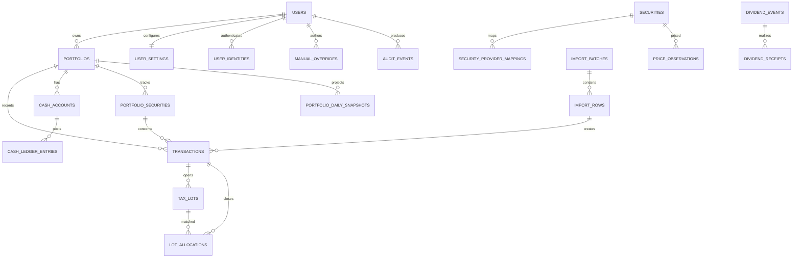

# YieldToMe data model

Status: proposed D1 schema; implement through reviewed Drizzle migrations  
Date: 2026-07-28

## 1. Conventions

- Primary IDs are opaque text identifiers generated by the application.
- Timestamps are UTC RFC 3339 text (`*_at`); market/accounting dates are ISO `YYYY-MM-DD` text (`*_date`).
- IANA timezone names are stored where local-day boundaries matter.
- Currency codes are uppercase ISO 4217 where available.
- Financial decimals are canonical strings, for example `"-1234.5600"`. Application validators reject exponent notation, NaN, infinity, and excessive scale.
- Booleans are D1 integers constrained to `0` or `1`.
- Enums are text with `CHECK` constraints and mirrored TypeScript unions.
- All mutable tables have `created_at`, `updated_at`, and usually `version`.
- Corrections use status/supersession/reversal records. Hard deletes are reserved for verified account purge.
- Shared reference data is separate from user-owned financial data.
- Every relationship that can change a user’s financial result carries enough owner/portfolio columns for a composite foreign key. Application validation adds domain rules; it does not replace enforceable ownership constraints.

Why decimal text: D1’s integers are signed 64-bit and one global scale cannot safely cover fractional quantities, FX precision, prices, and large portfolio values. SQLite `REAL` is binary floating point. Decimal text plus strict application parsing is the safest v1 representation; sortable/reporting values are derived through the domain layer, not ad hoc SQL arithmetic.

## 2. Relationship map



## 3. Identity and ownership

### `users`

| Column              | Type         | Constraints / meaning                                         |
| ------------------- | ------------ | ------------------------------------------------------------- |
| `id`                | TEXT         | PK                                                            |
| `status`            | TEXT         | `pending`, `active`, `disabled`, `deletion_pending`, `purged` |
| `display_name`      | TEXT         | nullable                                                      |
| `primary_email`     | TEXT         | contact/display only, normalized                              |
| `locale`            | TEXT         | default `en-AU`                                               |
| `timezone`          | TEXT         | IANA name                                                     |
| `terms_accepted_at` | TEXT         | nullable                                                      |
| `last_seen_at`      | TEXT         | nullable                                                      |
| timestamps/version  | TEXT/INTEGER | standard                                                      |

Indexes: status; normalized email is non-unique because it is not identity.

### `user_identities`

| Column                  | Type | Constraints / meaning         |
| ----------------------- | ---- | ----------------------------- |
| `id`                    | TEXT | PK                            |
| `user_id`               | TEXT | FK users, restrict delete     |
| `provider`              | TEXT | initially `cloudflare_access` |
| `issuer`                | TEXT | verified Access issuer        |
| `subject`               | TEXT | verified stable subject       |
| `email_at_link`         | TEXT | audit metadata                |
| `status`                | TEXT | `active`, `revoked`           |
| `last_authenticated_at` | TEXT | nullable                      |

Unique: `(provider, issuer, subject)`. Never auto-link solely on email.

### `user_settings`

One-to-one with user:

- `user_id` primary/composite owner key;
- required `home_currency_code` FK to currencies;
- IANA timezone and locale/display defaults;
- default native/home holding-price view;
- `financial_year_start_month` (integer, CHECK 1–12, default 7): the configurable financial-year start month (day is always the 1st). Per-user only — there is no per-portfolio override. The same `timezone` column on this row decides where the FY boundary falls everywhere (see `docs/CALCULATIONS.md` and requirement FY-001). Existing rows default to 7 (the Australian financial year) with no data rewrite;
- `price_source_preference` (text, CHECK IN `('yahoo_authenticated', 'yahoo_anonymous', 'sharesight_delayed')`, default `'sharesight_delayed'`, migration `0048_mkt_009b_price_source_preference.sql` — MKT-009B): which quote source `app/owned-holdings.ts`'s selection PREFERS, read through to `domain/market-data/selection.ts`'s `preferredProviderIds`. A preference, not a hard filter — a preferred source with no usable observation for a given security falls back honestly to whatever the existing freshest-wins ranking actually has. `MARKET_DATA_PROVIDER` (Worker env, `worker/runtime-config.ts`) remains the deployment-level activation gate for Yahoo entirely independent of this column. Default `sharesight_delayed` is deliberate, not arbitrary: it is a no-op for an owner with no Sharesight link (Sharesight never writes a `price_observations` row for them, so selection falls straight through to Yahoo, unchanged from before this column existed) and matches BRK-012C's existing intent for an owner who does have one — see `docs/MARKET_DATA_STRATEGY.md` §20 and `docs/ARCHITECTURE.md`'s decision note for the full reasoning. This is a genuine table rebuild (a new CHECK-constrained column, same drizzle-kit limitation FY-001A's `0029_bouncy_virginia_dare.sql` hit) — the migration hand-restores the `account_purge_lock_user_settings_*` triggers after the rebuild, following that same precedent exactly;
- `daily_capture_source` (text, default `'sharesight'`, migration `0049_mkt_011a_daily_price_capture.sql` — MKT-011A): which provider the daily intraday-capture sweep (`app/daily-price-capture-service.ts`) fetches FROM for this owner — `sharesight` | `yahoo_anonymous` | `yahoo_authenticated`. A WRITE-path choice, distinct from `price_source_preference` above (a READ-path preference among already-written observations). Deliberately a PLAIN `ADD COLUMN` with NO `CHECK` (owner/orchestrator ruling, explicitly trading off the `price_source_preference` rebuild precedent immediately above to avoid a second trigger-recreating rebuild for two more columns) — the enum is validated at the request boundary instead (`app/portfolio-action-contract.ts`'s `validateDailyCaptureSource`), same trust-boundary discipline enforced in code rather than SQL. Honest trade-off: a direct SQL write bypassing the action layer is not rejected by the database itself the way `price_source_preference` is;
- `daily_capture_interval_minutes` (integer, default `60`, same migration): sweep cadence in minutes, `30` or `60` (same ADD-COLUMN/no-CHECK trade-off, validated via `validateDailyCaptureIntervalMinutes`). The cron fires every `:25`/`:55`; a 60-minute owner's captures are gated to the `:25` tick only;
- timestamps/version.

Home currency is the canonical reporting currency. Changing it is an explicit recalculation event, not a cosmetic database update.

### `portfolios`

| Column                  | Type | Constraints / meaning                                                            |
| ----------------------- | ---- | -------------------------------------------------------------------------------- |
| `id`                    | TEXT | PK                                                                               |
| `user_id`               | TEXT | FK users                                                                         |
| `code`                  | TEXT | owner-scoped stable short code                                                   |
| `name`                  | TEXT | display name                                                                     |
| `base_currency_code`    | TEXT | effective home/reporting currency, initialized from user settings; FK currencies |
| `timezone`              | TEXT | IANA                                                                             |
| `accounting_method`     | TEXT | v1 `fifo`                                                                        |
| `history_complete_from` | TEXT | nullable local date                                                              |
| `status`                | TEXT | `active`, `archived`                                                             |
| timestamps/version      |      |                                                                                  |

Unique: `(user_id, id)` for composite FKs; `(user_id, code)`. Index `(user_id, status, updated_at)`.

### `portfolio_settings`

One-to-one with portfolio, including `user_id` composite ownership:

- display currency preferences;
- quote staleness policy;
- mobile density preferences;
- feature flags that are genuinely user settings, not security switches.

Unique/FK: `(portfolio_id, user_id) -> portfolios(id, user_id)`.

Dividend assumptions are not part of the core schema. Add them only with the deferred dividend workflow.

## 4. Reference and security master

### `currencies`

Shared table: `code` PK, `numeric_code`, name, minor-unit digits, active flag. Non-ISO pseudo-currencies require an explicit namespace and are out of v1.

### `exchanges`

Shared table:

- `id`, canonical name, MIC, country code;
- timezone;
- default currency;
- trading calendar identifier;
- active flag.

Unique MIC when present.

### `securities`

Shared canonical identity:

| Column                                | Meaning                                                                |
| ------------------------------------- | ---------------------------------------------------------------------- |
| `id`                                  | durable internal security ID                                           |
| `asset_type`                          | v1 `equity`, `etf`, `fund`                                             |
| `exchange_id`                         | verified primary exchange when known; null is not an unresolved marker |
| `primary_currency_code`               | trading currency                                                       |
| `canonical_name`                      | issuer/fund name                                                       |
| `isin`                                | nullable, unique where trusted                                         |
| `status`                              | `active`, `delisted`                                                   |
| `first_trade_date`, `last_trade_date` | nullable                                                               |

Ticker deliberately does not live here as an eternal identifier.
Unresolved candidates remain private in `portfolio_securities`; they are not rows in this shared table.

### `security_identifiers`

Validity-dated identifiers:

- `security_id`;
- `scheme` (`ticker`, `isin`, `cusip`, `sedol`, `provider_symbol`, later);
- `value`;
- `exchange_id` where scheme needs it;
- `valid_from`, `valid_to`;
- source/provenance.

Unique within scheme/exchange/date model. Overlapping validity intervals are rejected in the service.

IMP-009 adds `source = 'owner_attested'` as a distinct, non-provider identifier source: when the owner manually resolves an unresolved import candidate (provider unavailable, or a delisted ticker no provider will ever verify), `db/repositories/security-attestation.ts` writes a `scheme = 'ticker'` identifier for the owner-typed symbol with `exchange_id = NULL`, exactly like the provider-verified path's own ticker identifier, but tagged `source = 'owner_attested'` instead of a `market_data_providers.id`. A partial unique index, `security_identifiers_owner_attested_ticker_unique` on `(scheme, value) WHERE source = 'owner_attested' AND valid_to IS NULL`, is this namespace's convergence/dedupe key: two concurrent attestations of the same ticker text converge on one row via the same throw-and-reread technique `security_provider_mappings_provider_symbol_from_unique` uses for provider identity (see §11). It is scoped to `source = 'owner_attested'` specifically so it can never collide with the pre-existing provider-verified path, which legitimately writes several `scheme = 'ticker'` rows sharing the same `value` (ticker text) across different exchanges -- always with `exchange_id = NULL`, distinguished instead by `provider_exchange` on `security_provider_mappings`, a table this index does not touch. **Accepted limitation**: because an attestation carries no exchange evidence at all, `(scheme, value)` is the most precise key the schema can express for it without a new exchange-alias-carrying column -- two genuinely different securities that happen to share the same ticker text can only be told apart, even under attestation, once one of them is later provider-verified (currency agreement is still checked explicitly at link time and disagreement fails outright, but exchange disambiguation is not available to this path). See the `security_provider_mappings` section below for the full attestation write path and its provider-verify upgrade path.

**`current_ticker` semantics**: the "current ticker" for a security is its ACTIVE `scheme = 'ticker'` identifier row (`valid_to IS NULL`); a HISTORICAL ticker is any `scheme = 'ticker'` row whose `valid_to` has been set (validity-closed) because the security was later renamed to a different ticker (the "Z1P renamed to ZIP" case: `Z1P` becomes a closed row once `ZIP` is written as the new active one). Both remain queryable for resolution -- see the matching order below.

**Closed identifier-scheme set (BRK-009A, 2026-08-18)**: `scheme` has no DB CHECK constraint (kept free-text, matching this table's original design), so the accepted set of values is documented here rather than enforced structurally: `ticker`, `sharesight_instrument`, `isin`, `figi` (`cusip`/`sedol` remain reserved names from this table's original header note above but are not yet written by any code path). `sharesight_instrument`/`isin`/`figi` are three NEW scheme values added additively by BRK-009A -- no rebuild, no re-keying of the existing `ticker`/`owner_attested` rows. Each gets its own partial unique index, mirroring `security_identifiers_owner_attested_ticker_unique`'s pattern but scoped by `scheme` instead of `source`: `security_identifiers_sharesight_instrument_unique`, `security_identifiers_isin_scheme_unique`, `security_identifiers_figi_scheme_unique`, each `ON (scheme, value) WHERE scheme = '<value>' AND valid_to IS NULL` (migration `drizzle/0039_late_morlun.sql`, index-only, no trigger/rebuild hazard -- this table carries no purge-lock triggers). Unlike `ticker`, these three value-spaces are each a globally unique durable identifier with no legitimate reason for two different securities to share one ACTIVE value, so the index is scoped by `scheme` alone rather than needing a `source` carve-out. **Note**: `securities.isin` (a column directly on the `securities` table, with its own pre-existing `securities_isin_unique` index) is a separate, currently-unused reserved field from this table's original design -- BRK-009A's `scheme = 'isin'` identifier rows are the mechanism this task's resolver and BRK-009B's auto-creation path actually read/write; reconciling the two is out of this task's scope.

**Multi-scheme resolution (BRK-009A)**: `domain/securities/resolve-security.ts`'s `resolveSecurity` is a PURE function (no I/O) that matches one candidate instrument identity (symbol/exchange alias/currency plus optional `sharesightInstrumentId`/`isin`/`figi`) against caller-supplied identifier rows, in this priority order: `sharesight_instrument` -> `isin` -> `figi` -> ACTIVE ticker+exchange alias -> HISTORICAL (validity-closed) ticker+exchange alias -> no match. Currency agreement (case-insensitive) is required at every tier a value match is found; disagreement is an explicit `conflict` outcome, never a silent skip to the next tier. If two tiers (or two rows within one tier) resolve to DIFFERENT securities, the result is `conflict` naming both tiers and both ids -- tier priority only decides which tier is REPORTED when every matching tier agrees on the same security, it never decides which of two disagreeing tiers to believe. **Never-merge-on-ticker-alone**: ticker-text agreement by itself never resolves a match, on either the active or historical tier -- it additionally requires exchange agreement (case-insensitive, whatever alias/id string the caller supplies for `exchange_id`), and a ticker match without exchange agreement is simply not a match at all (not a conflict either). This task wires the resolver itself only; BRK-009B wires it into the Sharesight import pipeline's auto-resolve/auto-create decision.

**Dividend-class currency exemption and the one-`portfolio_securities`-row-per-security model (BRK-010, 2026-08-19)**: a security can legitimately trade in one currency and pay a dividend in another -- the owner-reported case, `sharesight_instrument` id 2964, ASX-listed (AUD trades) paying a USD dividend, which previously tripped `resolveSecurity`'s currency-agreement check and blocked at `SECURITY_RESOLUTION_CONFLICT` (the system failing safe: `dividend_manual_records` had no currency column at the time, so committing the USD total would have silently counted it as AUD). `ResolveSecurityCandidateIdentity.rowClass` (`"trade"` default, `"dividend"`) exempts a dividend-class identity from the currency check at every tier (`sharesight_instrument`/`isin`/`figi`/ticker+exchange) -- every OTHER safeguard (ticker+exchange agreement, durable-id value equality, same-tier/cross-tier security-id disagreement) is unaffected; a trade-currency disagreement for the same instrument id still conflicts (genuinely suspicious). `app/security-resolution-service.ts` groups staged rows by `(symbol, exchange, currency)`, unchanged, and additionally tags each group `rowClass: "dividend"` only when EVERY row in that group is a payout/dividend row (`normalized.type === "dividend"`); since grouping is currency-scoped, a security's AUD trades and USD payouts naturally land in TWO SEPARATE groups.

**Investigation finding (BINDING on the design): `portfolio_securities` cannot hold two rows for one security.** `portfolio_securities_resolved_unique` is a unique index on `(portfolio_id, security_id) WHERE security_id IS NOT NULL` -- exactly ONE row per security per portfolio, by design (every other read path -- Holdings, ledger projections, tax lots -- assumes this). So the USD payout group must NEVER try to create its own, second, differently-currencied `portfolio_securities` row for the same security the AUD trade group already links -- doing so throws the unique-index violation, which the pre-BRK-010-shaped code silently absorbed as a generic `link_conflict`/"concurrent write" `SECURITY_RESOLUTION_CONFLICT`. The fix is at the LINKING step, not the schema: `db/repositories/security-resolution.ts`'s `linkResolvedSecurity` wraps the pre-existing `linkToSecurity` and, for a `rowClass: "dividend"` candidate ONLY, first checks whether a `portfolio_securities` row already exists for `(user_id, portfolio_id, security_id)` -- REGARDLESS of that row's own `source_currency_code` -- and reuses it directly when found, never attempting the currency-keyed create/link `linkToSecurity` would otherwise run. A dividend fact's own cash currency lives entirely on `dividend_manual_records.currency_code` (see that table's entry below), never on `portfolio_securities.source_currency_code`, so reusing the trade group's row is correct, not a loss of information: the AUD trade group and the USD payout group resolve to the SAME `security_id` AND the SAME single `portfolio_securities` row -- trades and dividends both key off `portfolio_security_id` for their own effects (ledger postings vs. `dividend_manual_records`), each using its OWN row-level currency. Only when a security has NO `portfolio_securities` row in this portfolio at all yet (a brand-new holding whose only evidence so far is a dividend) does the dividend group fall through to the normal, currency-keyed create path, producing a row in the dividend's own currency -- the only evidence available in that degenerate case. `db/repositories/security-resolution.ts`'s pre-existing-link currency re-validation (`existing_link_currency_mismatch`) is likewise exempted for a dividend-class candidate, so re-running resolution (sync or accept) self-heals via the pre-existing F1 mechanism rather than re-conflicting every time. Because there is only ever ONE `portfolio_securities` row per security, `app/owned-dividend-history.ts`/Holdings need no changes at all for this task -- there is no second candidate row to merge or surface.

**Residual, documented rather than solved (review finding F4 correction -- the PREVIOUS version of this note incorrectly claimed the following case "reuses that same row via the ordinary already-resolved check, no special-casing needed").** A degenerate dividend-only creation (the paragraph above) sets `securities.primary_currency_code` to the PAYOUT's OWN currency -- the only evidence available when no trade exists yet -- which is a CAVEAT on that field's trustworthiness for such a security: it reflects a single cash event's currency, not necessarily the security's real trading currency. If a LATER sync then brings in a TRADE for that same instrument in a DIFFERENT currency (the realistic case: the dividend-only creation happened because trades hadn't synced yet, or were entered via CSV instead), that trade resolves with `rowClass: "trade"` (the strict, currency-enforced path) against the durable identifiers (e.g. `sharesight_instrument`) the dividend-only creation already wrote -- and the trade's OWN currency now disagrees with the security's `primary_currency_code` the dividend inferred. This is a genuine, VISIBLE `SECURITY_RESOLUTION_CONFLICT` (never a silent link, never silent corruption) -- fail-safe, but it requires owner intervention (there is no automatic "the dividend-only creation's inferred currency was wrong, promote the trade's currency instead" mechanism; the trade-class strict resolver treats this exactly like any other genuine currency disagreement for the same instrument id, because from its perspective that is indistinguishable from one). Promoting/repairing an auto-created security's currency once real trade evidence arrives, if wanted, is a follow-up task, not attempted here.
**`source = 'sharesight'` identifiers and auto-create provenance (BRK-009B, 2026-08-18; corrected 2026-08-18 review round -- see the B1/B2/B3 findings below)**: `db/repositories/security-resolution.ts`'s `resolveAndLink`, invoked automatically by `app/security-resolution-service.ts` for `sharesight_sync` batches only (never CSV), tries THREE priority tiers before ever creating anything -- see "Three-tier resolution" below. Only when NONE of them match does it publish a `securities` row (`canonical_name` = the Sharesight `instrumentName` when present else the symbol, sanitized -- see F2 below; `primary_currency_code` validated against `currencies`, upper-normalized before the check) plus `security_identifiers` rows tagged `source = 'sharesight'` -- ALWAYS the ticker alias (`scheme = 'ticker'`, `UPPER(value)`, `valid_from` = now, `exchange_id = NULL`, matching every other ticker-writing path's convention) and, when the sync carried one, the `sharesight_instrument` identifier too (`scheme = 'sharesight_instrument'`, `valid_from` = now). Like IMP-009's owner-attestation path, this NEVER writes a `security_provider_mappings` row -- provenance honesty: that table is provider evidence only, so an auto-created security is queryable as "not yet provider-verified" by the same absence-of-mapping join `listAttestedSecurityIds` already performs (extending naturally to `source = 'sharesight'`, not only `source = 'owner_attested'`), and remains eligible for the identical later provider-verify/IMP-009-attest upgrade path any owner-attested security already has. `securities.isin` is never populated by this path either (mirrors IMP-004B/IMP-009's identical `isin: NULL` convention -- ISIN evidence, when Sharesight supplies one, is read-only matching input to the resolver, never written back as a fresh identifier by this task). Creation is a single guarded, creation-only `client.batch()` call per distinct instrument, guarded on `WHERE NOT EXISTS` against the ticker+CURRENCY value-space (never ticker text alone -- B3, see below) and, when present, the `sharesight_instrument` value-space -- mirroring IMP-004B/IMP-009's identical technique. Concurrent syncs racing to create the SAME `sharesight_instrument` id converge hard, via the real `security_identifiers_sharesight_instrument_unique` index (BRK-009A migration `0039`); concurrent syncs racing to create the SAME (metadata-less) ticker+currency converge too, since the SAME guard governs both the creation attempt and the winner-resolution subquery -- the losing attempt's insert no-ops and the unconditional re-read (scoped to the identical ticker+currency predicate) links to the winner instead of duplicating it. **Accepted residual limitation, F3 (metadata-less rows)**: there is still no hard DB-level unique index scoped to `(ticker, currency)` the way `security_identifiers_owner_attested_ticker_unique`/the 0039 indexes scope their own namespaces -- convergence for a metadata-less create relies on the application-level guard-conditional `batch()` + re-read pattern (the same technique IMP-004B/IMP-009 already rely on for their own non-indexed edges), not a schema constraint, so it is bounded by that pattern's own known limits, not a new gap this task introduces.

**Three-tier resolution, fixed for currency-safety (BRK-009B, 2026-08-18 review round -- findings B1/B2/B3)**: `resolveAndLink` tries, IN ORDER, stopping at the first tier that produces anything other than `no_match`:

1. **Strict + same-user (F2 pre-pass)**: `domain/securities/resolve-security-candidate.ts`'s `resolveSecurityCandidate` runs BRK-009A's strict `resolveSecurity` (global, currency-enforced at every tier) first, then, only on `no_match`, its own same-user fallback -- scoped to the RESOLVING OWNER's own `portfolio_securities` rows already linked to a security (any source), joined against that security's canonical `primary_currency_code` for the currency check and `portfolio_securities.source_exchange_alias`/`security_provider_mappings.provider_exchange` for exchange evidence. Symbol + currency agreement with NO CONTRADICTING exchange evidence on either side (missing evidence on one or both sides counts as "no contradiction") is a match, reported under the `same_user_ticker` tier label; evidence that actively disagrees, or same-user evidence resolving to more than one distinct security, is a `conflict`, never guessed. Never applied beyond one owner's own data.
2. **Global ticker+currency (B1/B4 ruling)**: only consulted when (1) found `no_match`. `domain/securities/resolve-security-candidate.ts`'s `resolveGlobalTickerCurrencyCandidate` runs the IDENTICAL "no contradiction = match" evaluation as (1), but over GLOBAL (cross-owner) evidence -- `securities`/`security_identifiers` are a shared canonical master (IMP-004B precedent: two different owners verifying the identical provider identity dedupe onto ONE row), so a genuinely agreeing cross-owner ticker+currency match is a legitimate dedupe target too, reported under the distinct `global_ticker_currency` tier label. A disagreement, or more than one distinct candidate security, is a `conflict`, never a silent merge.
3. **Create** -- reached only when NEITHER (1) NOR (2) matched. See the paragraph above.

A PRE-EXISTING `portfolio_securities` link (found before any of the three tiers even runs) is also re-validated for currency agreement before being trusted -- a mismatch is reported as a `conflict` (tier `existing_link_currency_mismatch`) rather than silently accepted, so a bad link from anywhere (a bug, a direct DB edit) is never laundered into a committed batch on the next resolution pass.

**B1/B2/B3 findings, closed**: a pre-fix version of this repository resolved a create-fallback "winner" purely on `scheme = 'ticker' AND UPPER(value) = ?` -- no currency, no exchange semantics -- so a metadata-less AGL/NYSE/USD row could resolve to an unrelated, already-existing AGL/ASX/AUD security (B1: reviewer-reproduced cross-currency merge; a USD row would have committed against an AUD security), the creation guard blocked a genuinely creatable distinct-currency identity forever behind a mislabeled "concurrent update" message (B3), and the `portfolio_securities` link statement could persist that wrong link even when the guarded creates themselves correctly no-op'd (B2). Every SQL predicate this repository now uses to decide "does a ticker match already exist" -- both creation guards, the winner-resolution subquery, and the global tier's own pre-check -- shares the EXACT SAME ticker+CURRENCY join against `securities.primary_currency_code`; there is exactly one identity key this repository ever treats as sufficient for a ticker-text match, and a link statement can only ever persist a security satisfying that identical predicate (B2's "if the winner fails validation, nothing persists" is therefore true by construction, not by an extra runtime check).

**F1, stale-conflict self-healing (2026-08-18 review round)**: `app/security-resolution-service.ts` is the sole writer of `SECURITY_RESOLUTION_CONFLICT` (see below); when a re-run of the resolution pass (sync-triggered or accept-triggered) now resolves an instrument successfully for rows that PREVIOUSLY carried an unresolved `SECURITY_RESOLUTION_CONFLICT` issue, it marks those specific issues `resolved_at` (narrowly scoped to that exact code, batch, and row set -- this service never touches any other issue) and records an owner-attributed audit event (`action: "sharesight.security.conflict_resolved"`) naming the cleared count. The conflict issue's own message states the real unblock path: fix the underlying disagreement (or the unrecognized currency) then re-run the sync or accept, or exclude the affected rows (IMP-008) to commit the rest of the batch in the meantime.

**F2, canonical-name sanitization (2026-08-18 review round)**: mirrors IMP-009's owner-attested display-name cap (`security-attestation-service.ts`, <=120 characters, no control characters) with one deliberate difference -- Sharesight data has no interactive owner to correct a malformed value inline the way a form submission does, so `db/repositories/security-resolution.ts`'s `sanitizeCanonicalName` prefers TRUNCATE + STRIP over REJECT: C0/DEL control bytes are stripped, then the result is capped to 120 characters (falling back to a generic placeholder if nothing usable remains), so a malformed Sharesight instrument name degrades to a still-usable display string rather than failing the whole auto-create -- and therefore the owner's real holdings/income -- closed over a label formatting quirk.

**`SECURITY_RESOLUTION_CONFLICT` (BRK-009B)**: a new persisted `import_issues.code` value, error severity, emitted by `app/security-resolution-service.ts` (not `domain/imports/reconciliation.ts`, which needed no changes) when any of the three resolution tiers, or the pre-existing-link re-validation, reports a genuine conflict for a Sharesight-sourced instrument. Written once per affected row (mirrors `SHARESIGHT_PAYOUT_KEY_COLLISION`'s identical per-row duplication so `IMP-008`'s owner row-exclusion can skip each one independently), idempotently guarded so a re-run of the resolution pass never inserts a duplicate unresolved copy, and self-clearing per F1 above once the disagreement stops reproducing. Blocks readiness/commit through the SAME persisted-issue check every other error-severity issue already uses (`app/import-ready-service.ts`'s `hasUnresolvedPersistedIssue`, `db/repositories/import-commit.ts`'s `revalidate()`) -- no new blocking mechanism.

### `market_data_providers`

Provider registry:

- code/name;
- active flag;
- capability JSON limited to non-secret metadata;
- rate-limit configuration;
- technical review date and operator notes reference.

No API key in D1.

MKT-007: the row for the one adapter this codebase ships (`id = 'yahoo-compatible'`, `code = 'yahoo-best-effort'`, `status = 'enabled'`) is seeded as static reference data by the hand-authored, data-only migration `drizzle/0037_steady_signal.sql` (untargeted `INSERT ... ON CONFLICT DO NOTHING`, idempotent against both the `id` and `code`-unique constraints on re-apply), not by any per-deployment or test-only setup step. This row's presence/status only says the codebase knows how to talk to that provider — it does not itself enable verification or refresh; `MARKET_DATA_PROVIDER` (Worker env) remains the sole per-deployment activation gate (see `docs/MARKET_DATA_STRATEGY.md` §5 "Activation model").

Upgrading a database already at migration 0036 (i.e. created before MKT-007 shipped): apply `drizzle/0037_steady_signal.sql` on its own — `scripts/setup-local-db.mjs` is a destructive full reset (deletes and recreates the local D1 file from scratch), not an incremental upgrade path, so it is not how an existing database picks up this migration. The untargeted `ON CONFLICT DO NOTHING` also means this INSERT silently no-ops, rather than erroring, if a row with `code = 'yahoo-best-effort'` already exists under a _different_ `id` (e.g. from an old ad hoc seed): verification stays 503 in that case, since the code's `PROVIDER_ID` constant looks up `id = 'yahoo-compatible'` specifically, and an operator must reconcile the conflicting row by hand before the migration's row can take effect.

### `security_provider_mappings`

- `security_id`, `provider_id`;
- provider exchange and symbol;
- `valid_from`, `valid_to`;
- status (`candidate`, `verified`, `rejected`, `expired`);
- verification source/actor/time;
- provider metadata hash.

Unique active mapping `(provider_id, provider_exchange, provider_symbol, valid_from)`. Index `(security_id, provider_id, valid_to)`.

This shared table is writable only by a server/operator verification path. An end-user mapping choice writes an owned mapping decision and `portfolio_securities` relationship; it cannot directly publish a candidate or change another user’s canonical mapping.

IMP-004B adds the first owner-triggered instance of that server verification path: an owner can request verification of one brand-new unresolved import candidate (`app/security-verification-service.ts`, `db/repositories/security-verification.ts`). The request itself is not a write — it is a lookup key (symbol, exchange alias, currency) re-derived from the server's own current, database-backed preview, never trusted client state. The write only happens after a successful, server-executed provider identity lookup (`domain/market-data/*`'s `searchSecurities`) agrees on currency and (when supplied) exchange (`domain/securities/verify-identity.ts`); the resulting canonical currency is normalized to upper case before publication, so a lower-case provider value cannot pass the case-insensitive agreement check and then fail the `currencies` FK on write. Publication is creation-only: if a `security_provider_mappings` row already exists for that verified provider identity, the request links to the existing `security_id` instead of creating a new `securities`/`security_identifiers`/`security_provider_mappings` row, and never mutates an existing canonical row, identifier, or another user's mapping — that dedupe-link path also re-checks that the existing security's `primary_currency_code` still agrees with the freshly-verified identity's currency, failing explicitly rather than linking a private candidate to a shared security whose currency the current evidence disagrees with. A verified-published `securities` row always carries `exchange_id = NULL`: the provider's exchange string is recorded only on `security_provider_mappings.provider_exchange`, never fabricated onto the canonical row as an `exchanges`/MIC reference. Every provider-unavailable, ambiguous, or mismatched outcome is an explicit failure; the owner's `portfolio_securities` candidate stays private and unresolved. All writes (the new canonical rows, when needed, plus the owner's `portfolio_securities` link) execute as one atomic guard-conditional `batch()` call, matching §11's technique — the link statement is folded into the same call as the canonical inserts, resolving `security_id` from a live subquery against `security_provider_mappings` rather than a literal value, so it links correctly whether this call's own canonical rows win or a concurrent publish's did; a concurrent verification of the same identity either loses the unique-index race (its own batch rolls back, canonical rows and link alike, so nothing is ever published without an owner link) or observes the winner's row already published (the canonical inserts no-op while the link statement still fires against it), and links to it rather than duplicating it.

IMP-009 adds a sibling, OWNER-attested resolution path for exactly the two cases IMP-004B's provider-evidence path structurally cannot cover: the provider is temporarily unavailable (rate-limited, outage), or the ticker is delisted and will never again resolve through a live provider lookup, yet the owner's real transaction/dividend history for it must still be recorded. `db/repositories/security-attestation.ts`'s `attestAndLink` (invoked by `app/security-attestation-service.ts`'s `attestSecurityCandidateWithContext`, `POST /api/import/preview/:batchId/securities/attest`) mirrors IMP-004B's discipline exactly minus the provider round trip: the candidate is re-derived server-side from the current preview, the same `expectedVersion`/`expectedPreviewVersion` staleness guards apply, and asset type always defaults to `equity` (no provider evidence to infer `etf`/`fund` from). **Provenance honesty is the load-bearing difference: this path NEVER writes a `security_provider_mappings` row** -- that table is provider evidence only. It instead publishes `securities` (`canonical_name` = the owner-supplied/confirmed display name, default the symbol) plus a `security_identifiers` row carrying `source = 'owner_attested'` (see that table's section above for the dedupe key this implies), then links the owner's `portfolio_securities` candidate, all in one atomic guard-conditional `batch()` call identical in structure to IMP-004B's. Before ever creating a new canonical row, the lookup checks BOTH namespaces: an existing owner-attested identifier for the same ticker text converges (currency re-checked, explicit `currency_mismatch` on disagreement, never a silent link); an existing PROVIDER-VERIFIED identifier for the same ticker text also converges -- the ruling that an attestation must never duplicate a security a provider has already verified. Owner-attributed audit event (`action: "import.security.attest"`, `target_type: "import_batch"`, `target_id` = the batch id) records the candidate identity (`sourceSymbol`/`sourceExchangeAlias`/`sourceCurrencyCode`/`displayName`) and the created/linked security id in its metadata; best-effort (a write failure here does not undo the already-committed attestation). Like every audit event in this app, the metadata passes through `domain/observability/redaction.ts`'s standing key-pattern filter before being stored -- `securityId`/`portfolioSecurityId`/`portfolioId` are redacted to `[REDACTED]` at rest (same as IMP-008's row-exclusion audit only ever stores `rowIds`, never a `*Id`-shaped field name) while `sourceSymbol`/`sourceExchangeAlias`/`sourceCurrencyCode`/`displayName` survive; the durable, unredacted, and always-current answer to "which security" is `portfolio_securities.security_id`/`security_identifiers.security_id` themselves, correlated by batch id and `occurred_at`.

**Provenance signal, not a new column**: an owner-attested security is queryable as "not yet provider-verified" by the simple absence of an active (`valid_to IS NULL`, `status = 'verified'`) `security_provider_mappings` row for its `security_id` -- `db/repositories/security-attestation.ts`'s `listAttestedSecurityIds` joins exactly that check against `source = 'owner_attested'` identifiers, and `app/import-preview.ts`'s `ImportReviewPreview.attestedSecurityIds` carries the result to the review UI (label: "Owner-attested identity; market data unavailable until provider-verified"). No dedicated boolean/status column was added to `securities` or `portfolio_securities`: the audit event is the durable historical record of the decision, and the absence-of-mapping join is the queryable current-state signal, satisfying both without a schema addition that nothing else at query time actually needed.

**Upgrade path**: a LATER provider verification of the same ticker text (`security-verification.ts`'s `publishAndLink`, extended by IMP-009) looks up an owner-attested identifier BEFORE ever creating a new canonical row -- after the existing provider-mapping dedupe check finds nothing (no mapping yet, since this identity was only ever attested). On a currency agreement, it attaches a NEW `security_provider_mappings` row to the SAME `securities` row the attestation already created -- the attested `security_identifiers` row and the `securities` row itself are never touched or rewritten, only a mapping is added -- exactly the same guard-conditional/live-subquery/atomic technique as a brand-new publish. Once that mapping exists, `listAttestedSecurityIds`'s absence-of-mapping join naturally stops reporting the security as attested, with no separate "upgrade" write needed. On a currency disagreement, the verify fails explicitly (`currency_mismatch`) and never silently overwrites the owner's attested identity.

### `portfolio_securities`

Owner-specific relationship:

- `id`, `user_id`, `portfolio_id`, nullable verified `security_id`;
- owner-scoped imported symbol, exchange alias, currency, and name while unresolved;
- display symbol/name override;
- watch/hidden status;
- user mapping status;
- first/last relevant date.

Composite FK to owned portfolio. Resolved memberships are unique by `(portfolio_id, security_id)`. Unresolved imported candidates remain private in this table and do not create or mutate shared canonical securities until separately verified.

## 5. Ledger, lots, and cash

### `transactions`

Immutable/versioned normalized ledger event:

| Column                                     | Meaning                                                                                                                          |
| ------------------------------------------ | -------------------------------------------------------------------------------------------------------------------------------- |
| `id`, `user_id`, `portfolio_id`            | owned identity                                                                                                                   |
| `portfolio_security_id`                    | required for security events; nullable for cash-only events; owner/portfolio-scoped composite FK                                 |
| `type`                                     | `buy`, `sell`, `cash_deposit`, `cash_withdrawal`, `fee`, `tax`, `split`, `opening_balance`; transfers and dividends are deferred |
| `status`                                   | `posted`, `reversed`, `superseded`, `void_pending`                                                                               |
| `trade_at`, `settlement_date`              | event timing                                                                                                                     |
| `local_trade_date`                         | portfolio-timezone accounting day                                                                                                |
| `quantity_decimal`                         | signed-domain input; service enforces type semantics                                                                             |
| `unit_price_decimal`                       | native quote currency                                                                                                            |
| `currency_code`                            | transaction currency                                                                                                             |
| `gross_amount_decimal`                     | optional explicit source amount                                                                                                  |
| `fee_amount_decimal`, `tax_amount_decimal` | non-negative native amounts                                                                                                      |
| `fx_rate_to_base_decimal`                  | nullable; transaction currency per one base conversion convention documented below                                               |
| `fx_rate_source`, `fx_observed_at`         | provenance                                                                                                                       |
| `source_type`                              | `manual`, `csv_import`, future `broker_sync`, `provider`, `system`                                                               |
| `source_reference`                         | nullable external/reference ID                                                                                                   |
| `idempotency_key`                          | required for new writes; immutable retry identity independent of source provenance                                               |
| `import_row_id`                            | nullable FK                                                                                                                      |
| `reverses_transaction_id`                  | nullable self-FK                                                                                                                 |
| `supersedes_transaction_id`                | nullable self-FK                                                                                                                 |
| `created_by_user_id`                       | actor                                                                                                                            |
| `calculation_version`                      | normalization rule version                                                                                                       |
| timestamps/version                         |                                                                                                                                  |

Convention: `fx_rate_to_base × native amount = portfolio-base amount`.

Checks:

- quantities/prices required for buy/sell;
- fee/tax non-negative;
- buy/sell quantity strictly positive in normalized storage (type supplies direction);
- FX strictly positive when present;
- one reversal target at most once;
- source reference unique within `(portfolio_id, source_type)` when present.
- idempotency key unique within `(user_id, portfolio_id)` when present; identical retries return the original result and a different normalized posting intent conflicts.

Indexes: `(user_id, portfolio_id, local_trade_date, id)`, `(portfolio_id, portfolio_security_id, trade_at)`, import row, reversal/supersession.

`import_row_id`, reversal/supersession targets, and any other private child reference use composite owner/portfolio foreign keys. A transaction cannot point to another portfolio’s membership, import row, or transaction even when both portfolios have the same owner.

### `manual_ledger_mutation_keys`

Short-lived server-issued mutation grants bind a random key to `user_id`, `portfolio_id`, one purpose (`create`, `reverse`, or `supersede`), and the exact correction target when applicable. A successful ledger batch marks the grant used and links its immutable result transaction. Unused expired grants reject, while used grants remain valid only for an identical idempotent retry. The key is retry identity, not authentication; every issue and consume path still requires the authenticated owner and same-origin mutation checks.

Used grants follow ledger retention because their result FK is retry evidence. Expired unused grants contain no financial payload and may be removed by a future bounded housekeeping job; they are never accepted after expiry.

### `ledger_mutation_guards`

Ephemeral rows provide a D1 atomic assertion for security quantity changes. Before posting, the repository streams active buy/sell/split events in bounded chronological pages and calculates exact quantity. The posting batch inserts a guard whose `valid = 1` check compares the observed owner/portfolio/security transaction count and version total with current ledger state, writes the immutable fact/status transition, then removes the guard. A concurrent ledger change makes the complete batch fail and retry from fresh evidence; guard rows do not survive successful batches.

### `transaction_versions`

Optional immutable source-version payload for editable descriptive fields:

- transaction ID and version;
- normalized field JSON (no provider secrets);
- change reason, actor, timestamp;
- previous version hash/current hash.

Financial effect changes still use reversal/replacement transactions.

### `tax_lots`

Disposable but inspectable FIFO projection:

- `id`, `user_id`, `portfolio_id`, `portfolio_security_id`;
- opening transaction ID;
- acquired timestamp/date;
- original/open quantity decimal;
- native/base total basis decimal;
- explicit `basis_status` (`complete`, `incomplete_fx`, or `incomplete_basis`);
- allocated acquisition fees/taxes;
- status;
- calculation run, version, and rebuilt time.

Unique opening lot identity within a calculation run. A buy can produce one lot in v1. LED-002B
rebuilds lots from the owner-scoped ledger high-water mark and retains closed
lots in the disposable projection so allocations remain inspectable.

### `lot_allocations`

- sell transaction ID;
- tax lot ID;
- owner, portfolio, and portfolio-security membership used in composite foreign keys to both sides;
- matched quantity;
- allocated native/base basis;
- allocated sale fees/taxes;
- native/base net proceeds;
- native/base realised gain;
- calculation version.

Unique `(sell_transaction_id, tax_lot_id, allocation_sequence, calculation_run_id)`. Sum constraints are validated transactionally by the service.

### `cash_accounts`

One per portfolio/currency:

- `id`, `user_id`, `portfolio_id`, `currency_code`;
- status and last reconciled time;
- source completeness (`complete`, `opening_balance`, `incomplete`).

Unique `(portfolio_id, currency_code)`.

### `cash_ledger_entries`

Append-only cash effect:

- owned cash account and portfolio IDs;
- linked transaction/import row; a dividend-receipt link is deferred;
- effective timestamp/date;
- type;
- signed native amount decimal;
- status and reversal link;
- source/actor.

Only one canonical posting per source effect. Cash balances are projected sums; a cached balance may exist with reconciliation metadata but is not authoritative.

### `holding_projections`

Current disposable projection:

- owner, portfolio, and portfolio-security membership;
- quantity, native open basis where meaningful, and canonical home-currency open basis;
- selected native price/home FX evidence for the current projection;
- average basis per unit;
- last ledger sequence/time;
- calculation version and rebuilt time;
- completeness status.

Unique `(portfolio_id, portfolio_security_id, calculation_run_id)`. Must reconcile to lots and posted transactions, including an owner-private unresolved membership.

Run-versioned rows remain non-current while bounded chunks are assembled.
Each chunk atomically writes at most the configured output limit and advances
the run's security/output high-water checkpoint. Publication is a single
guarded update to `projection_publications`, keyed by owned portfolio, after
the run completes at the unchanged ledger high-water mark. A stale or
lost-lease run cannot advance its checkpoint or become current; a failed
chunk can be retried without duplicating its output. Prior run rows are
disposable and may be removed later in separately bounded cleanup work.

The projection’s home-currency values are stored/rebuilt for reporting. Native security prices, transaction amounts, and lot provenance remain available. Switching the UI between native and home currency never rewrites the projection or ledger.

## 6. Prices, FX, corporate actions, and fundamentals

### `price_observations`

- security/provider/mapping IDs;
- observation scope (`deployment` or `user`) and nullable `scope_user_id`; the Yahoo-compatible source is deployment-scoped, while the user-entitled Sharesight source (BRK-012B) is user-scoped -- see below;
- `interval` (`eod`, `delayed`, `intraday`); manual values live only in owner-scoped `manual_overrides`;
- `observation_at`, `market_date`, `market_timezone`;
- currency;
- open/high/low/close decimal text;
- previous close where explicitly supplied;
- volume decimal/integer text;
- adjustment state (`raw`, `split_adjusted`, `total_return_adjusted`);
- adjustment factor;
- quality (`observed`, `corrected`, `indicative`, `stale_candidate`);
- delayed minutes;
- ingested time, provider revision ID, payload hash;
- `upload_batch_id` (nullable text, MKT-008 -- the owner-upload attribution below; plain ADD COLUMN, deliberately NO FK constraint, see that task's entry).

Unique `(provider_id, security_provider_mapping_id, interval, observation_at, adjustment_state)`. Index security/date and provider/date.

**BRK-012B: Sharesight as a second, user-scoped price source (accretion-forward, no backfill).** `market_data_providers` gained a second seeded row (`id`/`code` = `sharesight`, migration `0044`, mirroring MKT-007's `yahoo-compatible` seed) alongside the FIRST-CLASS write path in `db/repositories/sharesight-price-refresh.ts`. Every row this source writes has `access_scope = 'user'`/`scope_user_id` = the owner whose Sharesight credentials fetched it -- NEVER `'deployment'`, since the underlying data is entitled to that owner's own account, not published deployment-wide the way the Yahoo-compatible EOD feed is. `interval = 'delayed'`, `delayed_minutes = NULL` (an honest unknown duration -- BRK-012A's live spike could not confirm a fixed delay), `adjustment_state = 'raw'`, `quality = 'observed'`. `observation_at` is Sharesight's own `current_price_updated_at` instant, NORMALIZED to a UTC `...Z` ISO string at write time (`domain/sharesight/price-accretion.ts`'s `normalizeTimestampToUtcIso`) -- **review correction (finding B1(a), 2026-08-20, BLOCKING):** an earlier version of this entry claimed the raw offset string was retained verbatim; it was NOT, and doing so blanked the owner's holdings view on the very first hourly write, since `app/owned-holdings.ts`'s `mapPrice` validates `observation_at` against a Z-only ISO regex that a `+10:00`-suffixed string fails (silently caught into "unavailable"). Sharesight's raw offset-preserving string is not separately retained -- `price_observations` has no spare column suited to it -- so this UTC conversion IS the documented rule. `market_date` is derived SEPARATELY and INDEPENDENTLY from that SAME timestamp's ORIGINAL, pre-conversion offset string (`deriveMarketDateFromTimestamp` -- reads the calendar-date digits directly out of the string, never via a UTC round-trip, which would misdate a late-evening positive-offset or early-morning negative-offset observation) -- the two derivations are never chained, so normalizing `observation_at` does not reintroduce the UTC-conversion date-shift bug `market_date`'s own derivation exists to avoid. `market_timezone` stores the observed numeric offset (e.g. `+10:00`) verbatim, since Sharesight supplies no IANA zone name and none is invented from the instrument's `market_code`.

Historical backfill from Sharesight is confirmed IMPOSSIBLE (`GET /instruments/:id/prices.json` is a hard HTTP 406 gate for this API client, exhaustively re-tested across every policy-compliant variant -- see `docs/ARCHITECTURE.md` §8.2's BRK-012A follow-up entry). Dailies instead ACCRETE forward: a SECOND partial unique index, `price_observations_provider_scope_mapping_date_unique` on `(provider_id, scope_key, mapping_id, interval, market_date, adjustment_state) WHERE provider_id = 'sharesight'`, lets an hourly refresh's write for the SAME trading day overwrite the prior one (converging toward the close) via `ON CONFLICT`. This index is deliberately PARTIAL, scoped to `provider_id = 'sharesight'` only -- an earlier unscoped draft of this index broke the EXISTING Yahoo-compatible correction pattern (two rows for the SAME `market_date` but a DIFFERENT `observation_at`, representing a same-day correction received later; `tests/calc-002-repository.test.ts` exercises this), which the ORIGINAL `observation_at`-keyed unique index (above) already handles correctly for every provider and remains untouched.

Scope: only securities the owner's `portfolio_securities` links (any status except `unresolved`, which by that table's own CHECK constraint carries no `security_id` to resolve anyway -- so an exited/hidden holding still in scope), resolved through `security_identifiers(scheme = 'sharesight_instrument')` (BRK-009A) -- never ticker text. An instrument Sharesight returns that matches none of the owner's identifiers is ignored, not guessed onto a nearest-ticker security.

`price_observations.mapping_id`'s hard FK into `security_provider_mappings` still applies: a security's first-ever Sharesight accretion write guard-creates a `status = 'candidate'` mapping row (`provider_exchange`/`provider_symbol` = Sharesight's own `market_code`/`code`) using the same `INSERT ... SELECT ... WHERE NOT EXISTS` technique `db/repositories/security-resolution.ts` established for guarded creates -- this is a technical join anchor, not a fresh unverified candidate awaiting the owner's provider-verify review the way a CSV-ticker mapping is, since the identity itself was already durably resolved via `sharesight_instrument` before any price write is even attempted. **Documented follow-up (BRK-012B review, 2026-08-20, fail-safe not a defect):** this mapping's `provider_exchange` becomes STATUS-AGNOSTIC exchange evidence for `domain/securities/resolve-security*.ts`'s ticker-fallback tiers (they never filter to `status = 'verified'`), so a security that previously resolved on ticker+currency alone can start surfacing a `SECURITY_RESOLUTION_CONFLICT` if a later independent resolution's own exchange evidence disagrees textually with Sharesight's `market_code` -- the resolver's existing disagreement-is-conflict rule firing exactly as designed, never silent corruption; see the in-code note at `db/repositories/sharesight-price-refresh.ts`'s guard-create site for the full explanation.

**Explicitly excluded from selection for this slice.** `app/owned-holdings.ts`'s `loadOwnedHoldings` (the holdings/overview valuation read path, ALSO the shared source `app/owned-income-projection.ts`/`app/owned-dividend-assumptions.ts` build on) and `db/repositories/snapshots.ts`'s snapshot-rebuild fact loader both genuinely read `access_scope = 'deployment'` OR `access_scope = 'user'` rows (pre-existing) -- a Sharesight accretion row would otherwise reach them. Both now carry an explicit `provider_id <> 'sharesight'` predicate (BRK-012B review round), so this storage-only slice cannot change valuation/holdings/income behavior. `app/owned-quotes.ts`'s Quotes-page read needed no such predicate -- it already reads `access_scope = 'deployment'` ONLY, so a user-scoped row could never reach it. BRK-012C (the delayed-price cache and 10-minute read gate) is the task that removes the `provider_id <> 'sharesight'` predicates as a deliberate decision, alongside its own separate cache table and a `docs/CALCULATIONS.md` update -- not by this task changing the read path.

**MKT-008: owner-uploaded price history ("Historical Data" section).** `market_data_providers` gains a THIRD seeded row (`id`/`code` = `owner-import`, migration `0046`, mirroring the 0037/0044 idempotent-seed technique) -- the single, generic provider for every owner-uploaded price-history source; the SOURCE DETAIL (e.g. `"intelligent-investor"`) lives on `price_upload_batches.source_label`, never as a second provider row. Writes are `access_scope = 'user'` (like Sharesight), `interval = 'eod'`, `quality = 'observed'`, `adjustment_state = 'raw'` -- an honest EOD daily close, unlike Sharesight's delayed intraday quote. `observation_at` is derived deterministically from the file's bare trading date via the midnight-exchange-timezone convention (`domain/market-data/exchange-timezone.ts`; ASX/`Australia/Sydney` only today, an explicit allow-list rather than invented `exchanges` table metadata -- see `docs/MARKET_DATA_STRATEGY.md` §18), so re-importing an identical date always produces the identical `observation_at` and upserts onto the SAME row via the PRE-EXISTING general unique index above -- no new partial index needed (contrast BRK-012B's Sharesight-specific date-partial index, required only because Sharesight's SAME day can legitimately receive several different `observation_at` values from repeated intraday fetches). Ticker resolution is match-only against the owner's OWN existing securities (`domain/market-data/resolve-price-upload-security.ts`) -- no auto-create tier, no cross-owner tier; a `no_match` is an honest, ticker-named error. `security_provider_mappings` guard-create follows the identical `INSERT ... SELECT ... WHERE NOT EXISTS` FK-anchor technique BRK-012B established. **Selection: participates in snapshot valuation too, unlike Sharesight.** `db/repositories/snapshots.ts`'s fact loader excludes ONLY `provider_id = 'sharesight'` (not an allow-list), so an owner-import row needed no code change to feed the Overview historical chart -- filling that gap is this feature's whole purpose.

**MKT-021: Frankfurter (ECB reference rate) FX feed.** `market_data_providers` gains a FOURTH seeded row (`id`/`code` = `frankfurter`, migration `0055`, mirroring the 0037/0044/0046 idempotent-seed technique) -- a free, no-API-key FX-rate-only source (`domain/market-data/frankfurter.ts`), required because `fx_rate_observations.provider_id` is a hard FK. Writes are `access_scope = 'deployment'` (like Yahoo's FX rows, never `'user'` -- ECB rates are public, identical for every owner), `interval = 'eod'`, `quality = 'observed'`, `delayed_minutes = NULL` (not applicable to a once-daily reference rate). `observed_at` is derived deterministically from Frankfurter's own reference date at UTC midnight (no per-pair exchange timezone exists for FX the way MKT-008 has one for ASX equities), so a same-day re-prime always upserts onto the SAME row via the table's PRE-EXISTING general unique index -- no new partial index needed, same rationale as MKT-008's owner-import rows above. See `docs/MARKET_DATA_STRATEGY.md` §25 for the full spike evidence, ToS/robots.txt permission, and the Change-column scope decision (left honestly unavailable -- see this table's `watchlist_entries` entry below).

### `price_upload_batches` (MKT-008)

Attribution record for an owner-uploaded price CSV or backup re-import -- one row per upload, mirroring `import_batches`' role for the ledger CSV flow but much smaller (no staged-row table; see `docs/MARKET_DATA_STRATEGY.md` §18 for why parsing/resolution is stateless between preview and confirm). Owner-scoped (`user_id`), purge-lock triggers hand-appended in the same migration that creates the table (0034/0045 precedent, no rebuild hazard).

- `source_label` (free text, e.g. `"intelligent-investor"`, `"backup-reimport"`);
- `format` (`single` | `backup`);
- `filename`;
- `row_count` (every valid row the upload's file/backup contained -- matched and written, whether inserted or merely overlaid an existing row);
- `inserted_row_count` (review B1 addition, 2026-08-21 -- the SUBSET of `row_count` this upload actually CREATED; CHECK `0 <= inserted_row_count <= row_count`. Written as `0` at INSERT time, then updated once the write completes -- see below);
- `malformed_row_count` (rows the parser or resolver could not use -- disclosed, never silently dropped);
- `created_at`.

`price_observations.upload_batch_id` (nullable, no FK -- see that column's own entry) is stamped on INSERT ONLY (review B1 fix, BLOCKING, 2026-08-21) -- an overlay (natural-key conflict) updates price/quote fields but NEVER reassigns attribution, so it always names whoever CREATED the row, never whoever most recently overlaid it. The PRIOR design reassigned attribution to the overlaying upload, which let deleting an overlaying upload silently destroy an observation (including an un-refetchable Sharesight-accreted one) it never created; deleting an upload now removes EXACTLY the `price_observations` rows still attributed to it (`upload_batch_id = ?`, i.e. the ones it created), leaving a row it merely overlaid untouched (that row's PRICE is not reverted -- no versioned-override history for market-data facts, documented -- but its attribution correctly still names its original creator, so a later delete of THAT upload removes it). `row_count`/`inserted_row_count` can therefore legitimately differ; both are surfaced to the owner. Export/purge: `owned` classification, `user_id`-keyed (like `sharesight_delayed_prices`), positioned in `PURGE_TABLES_IN_FK_ORDER` immediately after `price_observations` (the soft-referencing child deletes first).

**No-orphan-by-ordering, not shared-transaction atomicity.** The batch row is created via its own separate `INSERT` (`createPriceUploadBatch`) BEFORE any chunked `price_observations` `batch()` write that could reference its id -- not inside the same atomic `batch()` call. This ordering, not a shared transaction, is what prevents an orphaned `upload_batch_id`: a crash before the batch row exists writes no observations referencing it at all, and a crash partway through the chunked writes just leaves a batch row with fewer attributed rows than its file contained. `inserted_row_count` is filled in by a follow-up `UPDATE` after the write completes, once the real count is known.

**Follow-up (review, 2026-08-21): the stored `inserted_row_count` column is NEVER read for owner-facing display.** The write-then-UPDATE sequence above is a two-statement window -- a crash between them leaves a batch row whose `inserted_row_count` (e.g. `0`) no longer matches the `price_observations` rows that already carry its id. `db/repositories/price-uploads.ts`'s `listPriceUploadBatches` therefore computes `insertedRowCount` as a LIVE `SELECT COUNT(*) FROM price_observations WHERE upload_batch_id = b.id` for every batch it returns (self-healing, cheap via `price_observations_upload_batch_idx`) rather than trusting the stored column -- this is the ONLY source the past-uploads list and the delete-confirmation dialog ever read, so the number a delete would actually remove is always correct even inside that crash window. The stored column remains solely as an internal batch-summary artifact.

### `fx_rate_observations`

- provider;
- access scope and nullable `scope_user_id` under the same rule as prices;
- base currency, quote currency;
- `rate_decimal` meaning one base equals rate quote;
- interval, observed timestamp/date/timezone;
- quality, delayed minutes, ingested time, payload hash.

Unique provider/pair/interval/observed time. Application derives and records inversion choice in calculation evidence rather than inserting duplicate inverse rows.

Provider selection uses deployment observations for the configured Yahoo-compatible source. A future user-entitled observation must match the authenticated internal user; this scope is for privacy/entitlement isolation only.

### `market_data_refresh_jobs`

Refresh jobs are durable D1 rows rather than in-memory or `waitUntil` work. Each row records the provider, price/FX target and scope, requested date range, bounded chunk size, resumable `high_water_date`, idempotency key, provider-request/observation counters, retry state, and conditional lease. A partial unique index permits at most one queued/running row for a provider/scope/target; insert-and-range-extension execute in one D1 batch so concurrent requests coalesce without a read-then-write race. Expired running leases are reclaimable.

Normalized price and FX writes use their provider/scope/date uniqueness keys with update-on-conflict semantics, so duplicate rows remain idempotent and a corrected provider observation updates the normalized value without creating a second fact. Each bounded set of observation upserts and its lease/high-water/counter checkpoint execute in one guarded D1 batch. If any statement fails or the lease/high-water guard no longer matches, neither observations nor progress publish. Runtime configuration is rejected when it would exceed the five-observation/six-statement chunk, 100 parameters per statement, or 50-query invocation budget.

Migration `0018` safely resolves any legacy duplicate active target rows before installing the unique index: the oldest row is queued to replay the union range from the beginning, and superseded active rows become failed with `coalesced_by_migration`. Replaying is intentional and correction-safe because normalized observation keys are idempotent.

### `split_events` (DB-005)

**Operational consequence for account deletion:** the six new owner-scoped tables below (`dividend_receipts` through `dividend_manual_records`) are classified `owned` in `ACCOUNT_EXPORT_TABLE_CLASSIFICATIONS` (`db/repositories/account-lifecycle.ts`), so this migration (`0030`) changed the set of tables every OPS-003A export must cover. Deploying it invalidates any already-completed export bound to a pending `deletion_pending` request: `purgeAccount` fails closed with `manifest-corrupt` rather than purging without the new tables, and the owner must submit a fresh deletion request (new idempotency key, new export, new cooling-off) before it can complete — see `docs/OPS-003B_VERIFIED_DELETION_RUNBOOK.md`'s "Operational consequence of a schema-adding migration" note for the full mechanism and the operator checklist. `split_events`/`dividend_events` themselves carry no such consequence — they are shared, not owner data (see below).

Shared provider facts, security-keyed, not owner data — same "no export/purge ownership" treatment as `securities` (excluded from `ACCOUNT_EXPORT_TABLE_CLASSIFICATIONS` and never covered by an `account_purge_lock_*` trigger):

- `security_id`, `provider_id`;
- `ex_date`, `effective_date` (both required);
- `numerator_decimal`/`denominator_decimal` (positive decimal strings);
- `status` (`declared`, `effective`, `cancelled`, `superseded`);
- `observed_at`, `ingested_at`;
- `supersedes_event_id` (nullable self-reference).

Corrections never rewrite a published row in place: a corrected/cancelled observation is inserted as a new row with `supersedes_event_id` pointing at the prior row, and the prior row's `status` moves to `superseded` in the same write — the same shape `manual_overrides` uses for owner data. `createDividendEventRepository`/`createSplitEventRepository` (`db/repositories/dividends.ts`) are server/provider-write-only: they take no `userId` and are gated architecturally (not wired to any user-triggered mutation), mirroring how `security-verification.ts` writes the shared `securities` master.

**`status` is a lifecycle column, not an immutable provider fact (MKT-005 review fix).** A pure lifecycle progression — the identical natural key and every other fact (numerator/denominator for splits; amount/currency/payment-date for dividends) unchanged, only `status` advancing because the ex-date/effective-date has now passed (`declared` → `effective` for splits, `declared` → `paid` for dividends) — is applied as an in-place `UPDATE` of `status`/`observed_at` (`updateStatus` in `db/repositories/dividends.ts`), explicitly NOT a correction and NOT a supersession. Supersession (insert-new + move prior row to `superseded`) stays reserved for an actual fact change. Reusing the same event id for a lifecycle transition means no new row and no `supersedes_event_id` link is created for a simple date-crossing.

A partial unique index — `..._active_natural_key_unique` on `(security_id, provider_id, ex_date)` for `dividend_events` and on `(security_id, provider_id, effective_date)` for `split_events`, both `WHERE status <> 'superseded'` — guarantees at most one active row per natural key even under concurrent ingestion attempts (the IMP-004B verify trigger and the periodic MKT-005 refresh sweep can race on the same security); superseded rows are exempt so supersession history is never blocked.

Splits affect quantities and raw/adjusted comparison. An explicit ledger corporate-action record links implementation effect (future work; not part of this task).

### `dividend_events` (DB-005)

Shared provider facts, same non-owner-data treatment as `split_events`:

- `security_id`, `provider_id`;
- `kind` (`cash`, `special`, `capital_return`);
- `status` (`estimated`, `declared`, `paid`, `cancelled`, `superseded`);
- `ex_date`, `record_date`, `payment_date`, `declaration_date` (all nullable);
- `currency_code` and `gross_per_share_decimal` (required once `status` is `declared`/`paid`, enforced by a CHECK constraint);
- `franking_percent_decimal`/`franking_credit_per_share_decimal`, both nullable — a typed seam left present-but-unpopulated (NULL = unknown, never a silent zero) until a franking source exists (MKT-005: no current provider supplies franking);
- `observed_at`, `ingested_at`;
- `estimate_method`/`estimate_as_of`, both nullable, populated only for `estimated` rows;
- `supersedes_event_id` (nullable self-reference), same supersession shape as `split_events`.

Declared/paid provider events and calculated estimates remain distinguishable. See `split_events`' status-semantics note above (applies identically here): a pure `declared` → `paid` transition with every other fact unchanged is an in-place update, not a supersession.

### `corporate_action_refresh_state` (MKT-005 review fix)

Shared provider OPERATIONAL state — not a financial fact, not owner data; classified `excluded` in `ACCOUNT_EXPORT_TABLE_CLASSIFICATIONS` exactly like `securities`/`dividend_events`/`split_events` (no purge-lock trigger):

- `security_id` (primary key, FK to `securities`);
- `last_attempted_at` (required) — updated on every corporate-action ingestion ATTEMPT for this security (success, failure, or a no-op reconciliation), regardless of which of MKT-005's three ingestion triggers invoked it;
- `last_status` (nullable, `ok` or `failed`).

This exists solely so the periodic refresh sweep (`runDueCorporateActionRefresh`) can rank verified securities oldest-attempted-first and rotate through the full candidate set. An earlier version of this ranking derived "last attempted" from `MAX(ingested_at)` on `dividend_events`/`split_events` directly, but that watermark only advances when an ingestion attempt actually WRITES a row — a non-paying security, or one whose fetched data never changes (an "unchanged" result), never advances it and would sort first on every single sweep forever, starving every other security. `corporate_action_refresh_state` is written on every attempt independent of whether any event row changed, which fixes the starvation.

### `dividend_receipts` (DB-005 original scope)

Owner-scoped, per-share model. This is the future ledger-linked capability the "later, posting an actual dividend receipt and its cash entry" bullet in §11 describes:

- `id`, `user_id`, `portfolio_id`, `portfolio_security_id` (composite-key owned, matching the `portfolio_securities`/`tax_lots` convention);
- `dividend_event_id` (required — a receipt is always tied to a specific provider event; a repository-level check enforces the event's security matches the holding's security);
- `transaction_id` (nullable composite FK to `transactions`) — stays NULL until a later task wires actual cash posting (no `dividend` `transactions.type` value exists yet);
- `shares_decimal`, `dividend_per_share_decimal` (required decimal strings), `franking_per_share_decimal` (nullable — unknown, never zero);
- `currency_code`, `payment_date`;
- `status` fixed to `'actual'` by a CHECK constraint, so an estimate can never be persisted as a receipt;
- `source` (`manual`, `csv_import`, `broker_sync`);
- `created_at`, `updated_at`, `version` (optimistic concurrency).

DIV-001's v1 read-derived income model (owner overrides + manual records, no ledger posting) is served by `dividend_event_overrides`/`dividend_manual_records` below instead of this table. `source = 'csv_import'` is accepted by the CHECK constraint but intentionally unused in v1: the CSV importer (`IMP-006`) lands committed dividend rows as `dividend_manual_records` instead (see that table's note below and `docs/CSV_IMPORT_SPEC.md`'s "Dividend-receipt rows" section for why), so this value stays reserved for a future task that wires this table to an actual, provider-event-linked cash posting.

### `dividend_security_assumptions` / `dividend_portfolio_assumptions` (DB-005 extension a)

Portfolio-scoped dividend/growth assumption overrides, versioned like `user_settings`, never affecting ledger facts. Every field is a nullable decimal string; NULL means "fall back to provider-derived values" (DIV-003), never an implicit zero.

`dividend_security_assumptions` — one row per `portfolio_security_id` (unique):

- `id`, `user_id`, `portfolio_id`, `portfolio_security_id`;
- `dividend_yield_percent_decimal`, `franking_percent_decimal`, `dividend_growth_percent_decimal`;
- `created_at`, `updated_at`, `version`.

`franking_percent_decimal` doubles as the holding's "franking if not known" default consumed by DIV-001's per-dividend franking resolution chain (per-dividend override → this default → unknown/flagged).

`dividend_portfolio_assumptions` — one row per portfolio (`portfolio_id` primary key, same single-row-per-owner-key shape as `portfolio_settings`):

- `portfolio_id`, `user_id`;
- `value_growth_percent_decimal`, `portfolio_dividend_growth_percent_decimal`;
- `created_at`, `updated_at`, `version`.

### `dividend_fy_overrides` (DB-005 extension b)

Portfolio-scoped financial-year actual-income override, distinct from receipts, for owner-typed historical corrections:

- `id`, `user_id`, `portfolio_id`;
- `financial_year_ending_year` (integer, keyed by the FY's ending year per FY-001A's "named by its ending year" convention — Jul 2025–Jun 2026 = "FY26" = `2026`); unique per `(portfolio_id, financial_year_ending_year)`;
- `grossed_amount_decimal` (required), `franking_amount_decimal` (nullable) — amounts are in the portfolio's base currency;
- `created_at`, `updated_at`, `version`.

### `dividend_event_overrides` (DB-005 extension c)

Sparse per-dividend override, keyed to a specific provider event so overriding an old dividend never blocks new events from flowing through (DIV-001's owner dividend-history decision):

- `id`, `user_id`, `portfolio_id`, `portfolio_security_id`, `dividend_event_id`; unique per `(user_id, portfolio_id, portfolio_security_id, dividend_event_id)` — at most one override row per holding/event;
- `shares_decimal`, `dividend_per_share_decimal`, `franking_credit_per_share_decimal` — all nullable; a NULL column falls back to the read-time auto-derivation (shares held at ex-date × event gross per share);
- `exclude` (boolean) removes the event from derived history/totals entirely;
- `created_at`, `updated_at`, `version`.

**Override survival through a provider correction (MKT-005 review fix — the real mechanism, corrected here after review found the originally recorded framing backwards).** `dividend_event_id` is a hard reference to one exact event row. Supersession (see `dividend_events` above) mints a NEW event id for a corrected fact and moves the prior row's status to `superseded`; it never rewrites or re-keys an existing override. Consequently, if the provider later corrects an overridden event, the override row survives completely unchanged — but it stays keyed to the now-superseded PRIOR version's id, not the new corrected event's id. A naive lookup that only checks "is there an override for the security's current active dividend event" would therefore MISS it — the opposite of the intended "the override still wins" behaviour recorded for DIV-001. Correctly resolving this requires walking the `supersedes_event_id` chain from the current active event backward through every prior version and checking each id for an override; `collectEventLineageIds` (`domain/market-data/corporate-action-ingestion.ts`) is a small pure helper that returns exactly that ordered lineage. The actual resolution logic (matching lineage ids against `dividend_event_overrides`, deciding which value the detail view shows) is `DIV-001` scope and is a binding requirement for that task, not implemented here.

### `dividend_manual_records` (DB-005 extension d; TASKS.md `IMP-006` task / requirement `IMP-007`)

Manual dividend record for a security/payment the provider never surfaced as an event — no `dividend_event_id` link:

- `id`, `user_id`, `portfolio_id`, `portfolio_security_id`;
- `payment_date`;
- `shares_decimal`, `dividend_per_share_decimal` (both nullable — see the BRK-005 paragraph below), `franking_credit_per_share_decimal` (nullable);
- `import_batch_id`, `source_reference` (both nullable, no FK — IMP-006, migration `0032`, `ALTER TABLE ADD COLUMN` only, no rebuild): set only for a row a CSV import batch created, `NULL` for rows entered directly through the manual dividend-entry UI. `source_reference` reuses `transactions.source_reference`'s `import-fingerprint:<row fingerprint>` scheme (a unique index on `(portfolio_id, source_reference)` gives the same cross-batch/resume idempotency trades get); `import_batch_id` is what a reversal deletes by;
- `idempotency_key` (nullable, no FK — UI-009, migration `0033`, `ALTER TABLE ADD COLUMN` only, no rebuild): a client-generated key (`crypto.randomUUID()` at dialog-open time, stable across retries within one dialog session) guarding the standalone owner-facing CREATE path (`app/dividend-assumptions-actions.ts`) against a slow-but-successful save followed by a client retry after a UI-009 timeout — a retry with the same key returns the already-created record instead of creating a second one. Deliberately a SEPARATE column/mechanism from `source_reference`: that column is IMP-006's own CSV-import fingerprinting scheme, consumed by `import-commit.ts`/`import-reversal.ts`'s batch-scoped reversal accounting, and reusing it for this unrelated client-session key would conflate the two. Unique index on `(portfolio_security_id, idempotency_key)` — no owner-scope columns needed, since `portfolio_security_id` already uniquely identifies a single user+portfolio (FK below) and SQLite's default UNIQUE semantics already treat `NULL` as never equal to another `NULL`, so the vast majority of rows (no client-supplied key) never collide, the same property `source_reference`'s unique index above already relies on;
- `total_cash_decimal`, `total_franking_decimal` (both nullable — BRK-005, migration `0035`): a Sharesight payout reports only a TOTAL cash amount and total franking credits, never a share count or a per-share amount. Fabricating one from the other (or from unrelated ledger holdings) would violate AGENTS.md's "never fabricated" rule, so `shares_decimal`/`dividend_per_share_decimal` became NULLABLE in this same migration — a genuine SQLite table rebuild (`CREATE __new_… / INSERT … SELECT / DROP / RENAME`), not a plain `ADD COLUMN`, because SQLite cannot relax an existing `NOT NULL` constraint any other way. The rebuild is trigger/index-hazard-checked: all three `account_purge_lock_dividend_manual_records_*` triggers and every index are hand-recreated byte-identically in the same migration file (`tests/db-schema.test.ts` and `tests/brk-005.test.ts` both re-probe purge-lock enforcement and trigger/index presence after it). The migration also required one hand-edit to drizzle-kit's generated `INSERT … SELECT`: its auto-generated SELECT list referenced the two brand-new columns against the OLD (pre-migration) table, which does not have them yet — corrected to select literal `NULL` for both instead (documented at the edit site in `drizzle/0035_goofy_havok.sql`, per AGENTS.md's hand-edited-migration disclosure rule);
- `currency_code` (nullable, FK `currencies`), `fx_rate_to_portfolio_decimal` (nullable), `fx_rate_source` (nullable — BRK-010, migration `0042`): a security can legitimately trade in one currency and pay a dividend in another (an ASX-listed security trading in AUD that pays a USD dividend — the owner-reported RMD case, live-confirmed via `sharesight_instrument` id 2964). `NULL currency_code` means "already in the portfolio's own base currency" — every pre-BRK-010 row and every same-currency row going forward reads this way. A NON-NULL `currency_code` is set only when the row's cash total is denominated in a currency other than the committing portfolio's base currency (`db/repositories/import-commit.ts`'s dividend branch), in which case `fx_rate_to_portfolio_decimal`/`fx_rate_source` are ALWAYS set together with it — all-three-or-none, enforced by `dividend_manual_records_fx_provenance_check` AND, independently, by `buildDividendManualRecordImportInsertStatements`. `fx_rate_source` is currently only ever `'sharesight'` (Sharesight's own payout `exchange_rate`, live-confirmed BRK-008 §8.2) — `dividend_manual_records_fx_rate_source_check` keeps the value set closed. Fail-closed by construction: a foreign-currency payout with no rate never reaches this table — it stages with a blocking, IMP-008-excludable `SHARESIGHT_PAYOUT_FX_RATE_MISSING` issue instead (`domain/sharesight-sync/transform.ts`), and `import-commit.ts` re-checks the same condition defensively at commit time. Migration `0042` is a genuine table rebuild (drizzle-kit's SQLite dialect cannot add a CHECK constraint via `ALTER TABLE`), so — mirroring `0035`'s BRK-005 precedent above — the three `account_purge_lock_dividend_manual_records_*` triggers are hand-recreated byte-identically after the rename (`tests/db-schema.test.ts` and `tests/brk-010.test.ts` both re-probe purge-lock enforcement after it). Read-time conversion: `domain/dividends/history.ts`'s `convertImportedRecordToSecurityCurrency` converts a foreign-currency imported fact's `total_cash_decimal`/`total_franking_decimal` into the SECURITY's own currency (this module's existing per-security single-currency invariant — see its header note) using the stored rate, exact decimal multiplication rounded half-even at the same 24-decimal-place scale `domain/dividends/franking.ts`'s `DEFAULT_TIER_SCALE` establishes; the original currency/rate/source survive on the row as provenance (`DerivedDividendRow.originalCurrencyCode`/`fxRateToPortfolioDecimal`/`fxRateSource`) even after conversion.
- `superseded_by_record_id` (nullable, no FK — DIV-016 part A, migration `0056`, `ALTER TABLE ADD COLUMN` only, no rebuild — see the correction-convention paragraph below);
- `created_at`, `updated_at`, `version`.

**Correction convention (DIV-016 part A, 2026-08-26): supersession, never an in-place rewrite.** Before this task, the owner-facing edit path (`db/repositories/dividends.ts`'s `update()`) was a genuine in-place `UPDATE ... SET shares_decimal = ...` — a violation of AGENTS.md's ledger-immutability rule ("corrections use reversal/supersession... never silent history rewrites") that had gone unnoticed because no other table's convention had been applied to this one yet. `update()` is replaced by `supersede()`, mirroring `transactions`' `supersedesTransactionId`/`status = 'superseded'` convention (`db/repositories/ledger.ts`'s `supersede()`) but adapted to a SINGLE nullable self-referencing pointer rather than a separate `status` enum column — this table has no `status` field to reuse, and adding one with a CHECK constraint would force a genuine table rebuild (the same FY-001A hazard `import_batch_id`/`idempotency_key` above already avoided with a plain `ADD COLUMN`). `supersede()` creates a NEW row carrying the corrected facts (either amount mode — see the amount-mode invariant below, now reachable from the owner-facing dialog for BOTH modes, not only Sharesight imports) and, in the SAME atomic batch, marks the OLD row's `superseded_by_record_id` to the new row's id via a guarded `UPDATE ... WHERE version = ? AND superseded_by_record_id IS NULL` (the optimistic-concurrency CAS) — the new row's own conditional `INSERT ... SELECT ... WHERE EXISTS (...)` checks the ORIGINAL's POST-update state, so either both the mark and the new row commit or neither does; no window exists where an original reads "superseded" with no successor. The OLD row's own financial fields (`shares_decimal`, `dividend_per_share_decimal`, `total_cash_decimal`, etc.) are NEVER rewritten — only the lineage pointer and `version`/`updated_at` change, exactly mirroring `transactions.supersede()`'s "only `status`/`version` move" scope. NULL `superseded_by_record_id` means "current head of its own lineage" (every pre-DIV-016 row, and the most recent row of every lineage going forward). `db/repositories/dividends.ts`'s `list()` — the SINGLE choke point every evidence/aggregation consumer reads through (`app/owned-dividend-history.ts`'s forecast TTM/UI-046 rows, `app/owned-security-dividends.ts`'s per-security Dividends tab, `app/dividend-assumptions-actions.ts`'s proximity-duplicate check, `app/import-actions.ts`'s CSV-import proximity check) — filters `WHERE superseded_by_record_id IS NULL`, so a superseded row is excluded from every consumer exactly once without each one re-implementing the exclusion; `get()` deliberately does NOT filter (a superseded ancestor must stay directly fetchable for audit reconstruction, and `supersede()` itself needs to see a row's current lineage state regardless). The full lineage is reconstructable by walking this ONE column: forward from any row via its own `superseded_by_record_id` to find the current head, backward from any row via `WHERE superseded_by_record_id = <that row's id>` to find what it replaced. An imported row (`import_batch_id IS NOT NULL`) can never be superseded through this mechanism — `supersede()` rejects it exactly like `update()`/`remove()` already did, preserving IMP-006's reversal-only correction path for that tier; `remove()` additionally rejects a row that is ITSELF already superseded (an ancestor can never be deleted directly — doing so would destroy the only record of what it was eventually corrected TO, breaking the backward audit walk).

**DELETE semantics and the tombstone case (review follow-up).** `remove()`'s ancestor guard above does NOT prevent deleting a CURRENT HEAD that itself has an ancestor pointing at it (correct a row, then "Exclude this dividend" on the corrected row — an ordinary flow, not a defect). That case leaves the ancestor's `superseded_by_record_id` naming a row that no longer exists — a TOMBSTONE, not a bug: the ancestor was already, correctly, excluded from every evidence path (its column is non-NULL regardless of whether the named row still exists, and it is never nulled back out — the ancestor never becomes head again just because its successor was later deleted), and deleting a row is supposed to make its content genuinely gone. The only consequence is that a forward lineage-reconstruction walk starting from the ancestor terminates at a dangling id instead of a live row; any future caller doing that walk resolves each hop with `get()` and stops honestly (never fabricates a row) the moment a hop returns `null`.

**UI-009 idempotency on `supersede()` (review fix, B1 BLOCKING).** The client-generated dialog-session key (`app/components/dividend-assumptions-editor.tsx`'s `dialogIdempotencyKey`, one per dialog OPEN, sent on every submit including a create followed by one or more edits in the same session) cannot be stored verbatim as the successor's own `idempotency_key` — doing so collided with `dividend_manual_records_security_idempotency_unique`'s `(portfolio_security_id, idempotency_key)` uniqueness, which the record's own original CREATE (or an earlier correction step reusing the same session key) already claims; the very first create-then-edit in one dialog session aborted the whole `supersede()` batch with an opaque 503, silently losing the correction (reproduced against the real migrated schema). Fixed by deriving and storing `` `supersede:<id being superseded>:<raw key>` `` instead of the raw key — unique per CORRECTION STEP (scoped to which row is being replaced), so a retry-after-timeout of the SAME step re-derives an identical key and dedupes (matched by comparing the successor's own stored derived key, not by re-comparing amounts — a deliberate resubmission could legitimately match), while a SECOND, deliberate edit later in the same session (which targets the row the FIRST edit just created — a different `id`) derives a different key even though the raw session key is identical, and is never mistaken for a retry. Disclosure parity with the CREATE path: a `supersede()` dedupe additionally reports `storedDiffers`/the stored record's real values (`db/repositories/dividends.ts`'s `supersedeStoredDiffers`) when the owner edited the form between the original attempt and a timeout-triggered retry, exactly like `create()`'s existing UI-009 finishing-item-1 behaviour.

**Amount-mode invariant (BRK-005; DIV-016 part A extends TOTALS mode to owner-typed rows).** A row is either PER-SHARE (`shares_decimal` + `dividend_per_share_decimal` set, `total_cash_decimal` + `total_franking_decimal` both `NULL` — every pre-BRK-005 row, and every owner-typed/CSV-imported per-share row) or TOTALS (`shares_decimal` + `dividend_per_share_decimal` + `franking_credit_per_share_decimal` all `NULL`, `total_cash_decimal` set — originally a Sharesight payout row only; DIV-016 part A's owner-facing manual-entry dialog can now create/correct an owner-typed totals-mode row too, sharing this exact same DB shape and the SAME re-validation helper, `db/repositories/dividends.ts`'s `validateManualRecordAmounts`/`resolveSupersedeAmounts`); never both, never neither. Enforced by a table-level CHECK constraint (`dividend_manual_records_amount_mode_check`) AND, independently, by `db/repositories/dividends.ts`'s `buildDividendManualRecordImportInsertStatements` — belt-and-suspenders, not a claim that either guard alone is untrustworthy. **ASSUMPTION, not verified:** this repo's migration tests replay every migration against `node:sqlite` (Node's built-in SQLite bindings), never against a live Cloudflare D1 instance, so CHECK-constraint enforcement has only been exercised against that local shim (Cloudflare D1 is itself SQLite-based, so the constraint is EXPECTED to behave identically, but that expectation is unconfirmed) — the application-layer validation in `dividends.ts` is therefore what this codebase actually relies on in production, with the CHECK constraint as defense-in-depth on top of it, not the reverse. `domain/dividends/history.ts`'s derivation (`computeCashGrossOrTotals`) reads a `NULL` `dividend_per_share_decimal` fact as "per-share genuinely unknown" (rendered as such — never fabricated) while still using a non-null `total_cash_decimal`/`total_franking_decimal` for the row's real cash/franking totals; see `docs/CALCULATIONS.md` §11.

DIV-001's double-count guard (manual/override > imported > auto-derived — exactly one row wins for a given security/event window) is domain-layer logic, not a schema constraint; this table's read-time derivation (`domain/dividends/history.ts`) does not distinguish import-created rows from directly-entered ones — both are the `"manual"` source (DIV-004 later separated the `"imported"` tier below `"manual"` for a batch-attributed row specifically — see that task's own note). CSV-imported dividend rows land here rather than in `dividend_receipts` because that table's `dividend_event_id` is a NOT NULL reference to the shared, provider-populated `dividend_events` table, which the importer cannot safely satisfy for an arbitrary broker row (see `docs/CSV_IMPORT_SPEC.md`'s "Dividend-receipt rows (IMP-006 extension)" section for the full reasoning). Reversal deletes the rows a batch created (identified by `import_batch_id`) rather than writing a "reversed" marker — this table has no such status, matching its existing owner-mutable/deletable treatment elsewhere (its repository already exposes a hard `remove()` for the manual-entry UI).

Only actual receipts (`dividend_receipts`, once a later task wires cash posting) affect cash and lifetime-actual income; provider events, assumptions, FY overrides, event overrides, and manual records are all income-reporting facts — nothing in this section posts cash to the ledger in v1. A provider event never creates an actual receipt without a user/imported/broker fact, and estimated income is never storable as a receipt (enforced by the `dividend_receipts_status_check` CHECK constraint).

### `dividend_import_franking_overrides` (BRK-011)

Sparse, one-row-per-imported-record owner override for a FOREIGN-CURRENCY Sharesight payout's franking credit total — tier 3 of the owner's BINDING franking-currency resolution cascade (`docs/CALCULATIONS.md` §11; see `docs/ARCHITECTURE.md` §8.2's 2026-08-21 entries for the live-evidence spike). Only tier 3 is implemented: tier 1 (Sharesight-supplied AUD franking) is UNCONFIRMED (not disproven — the owner's data has no franked foreign payout to test, and a live check found the documented `tax_credit` field absent from every payout examined, foreign and franked-native alike, which is evidence but not proof); tier 2 (automatic FX conversion) is separately INCONCLUSIVE for the same no-franked-foreign-payout reason, not "ruled out." Mirrors `dividend_event_overrides`' sparse-override shape but keys to a `dividend_manual_records` row (`dividend_manual_record_id`, composite FK to `(id, user_id, portfolio_id)`) instead of a `dividend_events` row, since an imported totals-mode payout has no provider event id of its own for a franking-only figure the OWNER supplies. Migration `drizzle/0047_broad_zeigeist.sql` (CREATE-only, no rebuild): the three `account_purge_lock_dividend_import_franking_overrides_*` triggers are hand-appended in the SAME migration that creates the table, mirroring `sharesight_sync_state`'s (BRK-004, migration `0034`) identical CREATE-only precedent — no rebuild-drops-the-trigger hazard.

Columns: `portfolio_security_id` (composite FK, ownership/read convenience), `dividend_manual_record_id` (the target imported record), `franking_total_decimal` (**required**, unlike `dividend_event_overrides`' sparse nullable columns — this table's only purpose is recording a known conversion, so a row with nothing to say has no reason to exist; clearing an override means deleting the row, not writing a null one — no delete path is exposed yet, a documented v1 scope limit), `version` (optimistic concurrency, mirroring every other owner-scoped override table).

**Ledger-immutability (AGENTS.md).** `dividend_manual_records` itself is NEVER mutated by this table — `db/repositories/dividends.ts`'s `dividendManualRecords.supersede()` (DIV-016 part A; see that table's own correction-convention paragraph above) already structurally rejects any imported (`import_batch_id IS NOT NULL`) row. This table is a pure OVERLAY: `domain/dividends/history.ts`'s read-time derivation applies `franking_total_decimal` on top of (never in place of) the immutable imported fact, via a new `applyFrankingCurrencyOverride` pre-pass that runs BEFORE BRK-010's unverified-nonzero-foreign guard and DIV-007's absent-value inference — an owner's deliberate resolution always wins and is never re-nulled or re-derived by either. Provenance surfaces via `DerivedDividendRow.frankingCurrencySource: "owner_manual" | null` (and the equivalent `DominatedImported` field), distinguishing an owner-entered figure from a Sharesight-reported one at every consumer.

**Write path.** `db/repositories/dividends.ts`'s `createDividendImportFrankingOverrideRepository` (`get`/`list`/`save`) enforces the target is an OWNED, IMPORTED record (`ownedImportedManualRecord`: `dividend_manual_records WHERE ... AND import_batch_id IS NOT NULL`) before ever accepting a save — an owner-typed manual record already has its own direct correction path via `dividendManualRecords.supersede()` (DIV-016 part A) and must never gain a second, competing override mechanism. `save()`'s `expectedVersion: null` creates, a number updates (mirroring `dividend_event_overrides.save()`'s convention, without that function's tri-state-field machinery since there is only one required field here). Exposed via `POST /api/portfolios/:portfolioId/dividend-franking-override` (`app/dividend-assumptions-actions.ts`'s `saveDividendFrankingOverrideAction`, CSRF-gated).

Classified `owned` for OPS-003 export/purge (`db/repositories/account-lifecycle.ts`'s `OWNED_TABLES`/`PURGE_TABLES_IN_FK_ORDER`, purged BEFORE `dividend_manual_records` since it references that table with `ON DELETE RESTRICT`).

### `fundamental_snapshots`

Deferred capability:

- security/provider;
- effective/as-of dates;
- currency;
- normalized selected metrics;
- source revision and payload hash.

Do not create until a concrete Details screen requirement and provider capability exist.

## 7. Imports and mappings

### `import_batches`

- `id`, `user_id`;
- optional target portfolio;
- parser format/version;
- original filename (sanitized display value), byte size, SHA-256 hash;
- status: `uploaded`, `parsed`, `needs_mapping`, `invalid`, `ready`, `committing`, `committed`, `reversing`, `reversed`, `failed`;
- row totals by classification/severity;
- commit/reversal idempotency keys;
- uploaded/committed/reversed actors/timestamps;
- supersedes batch;
- failure category and redacted detail.

Exact file duplicate is owner-scoped unique by hash and parser version as policy permits.

### `import_rows`

- batch and physical row number;
- row class (`portfolio_security_definition`, `transaction`, `blank`, `unsupported`);
- original field values as bounded JSON (not original file bytes);
- normalized fields JSON;
- normalized fingerprint;
- validation status;
- target portfolio and owner-scoped portfolio-security membership IDs;
- commit status and resulting transaction ID;
- error/warning counts;
- `excluded_by_owner_at` (`IMP-008`): nullable ISO timestamp, `NULL` = not excluded from commit. A dedicated column rather than an overload of `commit_status` -- `commit_status` describes what COMMIT did to a row; this records a pre-commit OWNER decision, reversible until commit (un-skip clears it back to `NULL`). Added by a plain `ALTER TABLE ADD COLUMN` (no rebuild); see `docs/CSV_IMPORT_SPEC.md` §8 "Owner row-exclusion (skip)" for the full readiness/commit/reversal semantics this column drives.

Unique `(batch_id, physical_row_number)` and index `(user_id, normalized_fingerprint)`.

Sensitive notes are financial user data and follow account retention.

### `import_issues`

- row/field;
- severity (`error`, `warning`, `info`);
- stable code;
- safe user message;
- suggested resolution type;
- resolved value/actor/time.

### `import_mapping_decisions`

- batch/user;
- kind (`portfolio`, `security`, `currency`, `transaction_type`, future);
- source key and normalized source value;
- target ID/value;
- scope (`row`, `batch`, `user_future`);
- confidence/source (`user`, `exact_identifier`, `system_candidate`);
- actor/time.

No ambiguous security mapping auto-commits.

The commit-ready preview version is a SHA-256 digest over the owner-scoped parser/batch state, staged row versions and targets, issue versions/resolution state, mapping versions, owned portfolio/security candidates, and deterministic reconciliation result. The `ready` → `committing` update also guards row, issue, and mapping counts/version totals; mapping inserts and updates are rejected after that transition. Each resumable chunk persists only its validated row targets, immutable ledger effects, chunk marker, audit, and physical-row high-water in one bounded D1 batch.

Final import invalidation is portfolio-specific. For each affected portfolio, `calculation_runs.ledger_high_water_start` stores the actual latest committed transaction ID under the ledger ordering, while `invalidation_source` retains the import batch ID. The batch reaches `committed` only in the same bounded finalization batch that durably inserts every required portfolio rebuild request.

## 8. Future broker-sync extension

These tables are deferred, but the current ownership/source keys reserve the boundary.

### `broker_connections`

- `id`, `user_id`, broker provider code;
- status and granted scopes;
- encrypted access/refresh token envelope or provider credential reference;
- token expiry, last authenticated/synced time;
- created/updated/revoked timestamps.

Unique connection/provider identity is owner-scoped. Plaintext credentials never persist.

### `broker_accounts`

- `id`, `user_id`, connection ID;
- provider account ID/hash and display label;
- account currency/type;
- mapped owned portfolio ID;
- status and last sync time.

Composite foreign keys ensure the connection, account, and portfolio share `user_id`.

### `broker_sync_runs`

- connection/account/portfolio/owner;
- capability (`transactions`, `cash`, `positions`, optional `quotes`);
- cursor/date range and provider high-water version;
- status, lease, attempt, counts, redacted error;
- deterministic idempotency key and timestamps.

### `external_record_mappings`

- owner, provider, broker account, external record type/ID/version;
- normalized transaction/cash record ID;
- payload hash, observed time, status, supersession.

Unique `(user_id, provider, broker_account_id, external_type, external_id, external_version)`. Repeated sync is idempotent. Positions are stored as reconciliation snapshots and never become an untracked authoritative overwrite of ledger holdings.

Broker-provided prices use the existing price-observation/provider mapping shape, plus owner/connection entitlement scope where the quote cannot legally be shared.

### 8.1 SPK-003 spike validation (no schema change in this pass)

`SPK-003` (design spike) validated the shape above with pure TypeScript contract types and planning functions in `domain/broker-sync/` and `tests/spk-003.test.ts`, without adding any table to `db/schema.ts` or generating a migration — these tables remain deferred until a future implementation task is promoted. The spike confirmed:

- `TokenEnvelopeRef` (`domain/broker-sync/contracts.ts`) matches `broker_connections`' "encrypted access/refresh token envelope or provider credential reference" column: an opaque `envelope_id` reference plus expiry/status, never a raw token value. Application code never has a typed path to a plaintext credential.
- **Idempotency-key semantics** (chosen to fix two review-caught defects — a caller-array-order-dependent duplicate bug and unbounded reversal churn on cursor restarts): storage keeps its documented 6-tuple uniqueness — `(user_id, provider, broker_account_id, external_type, external_id, external_version)` — with one persisted row per reported version, so correction/deletion history stays fully auditable. The _planner_, given a batch of such rows for a user, groups them by the 5-tuple WITHOUT `external_version` and resolves each group to its single currently-effective row by `status = 'active'` (never by array position, which D1's unordered `SELECT` cannot guarantee); it then compares the incoming record's `external_version` numerically against that active row's version. A version at or below the active version is always a no-op (an exact replay or a stale/older cursor page); only a strictly newer version can plan a reversal-based effect. Payload-hash equality is retained on records/mappings for audit/debugging but is no longer what decides whether an effect is planned — version order is the single source of truth for staging decisions, so out-of-order redelivery can never re-open an already-superseded correction. See `planBrokerLedgerSync`, `mappingLookupKey`, and `selectActiveMapping` in `domain/broker-sync/reconciliation-plan.ts`.
- **Persistence invariant — what a `reverse_only`/`reverse_and_replace` effect leaves behind**, made explicit after a review-caught "ghost resurrection" defect: applying `create` inserts one new `active` row. Applying `reverse_and_replace` flips the previously-active row to `superseded` and inserts one new `active` row at the corrected version — exactly one `active` row exists afterward. Applying `reverse_only` (a broker-reported deletion) flips the previously-active row to `reversed` AND inserts a new row for the deletion event itself, ALSO `reversed` — so **no row is ever `active` again for that identity**, and a group that has history but no `active` row always means "fully reversed," never "never seen." The planner must not conflate those two states: for a group with history but no active row, it compares the incoming record's version against the group's _highest known version regardless of row status_ — anything at or below that highest version is a no-op (`skip_reversed_history`, whether the incoming record is a re-served older page or a replayed deletion), and only a version strictly above it may plan a fresh `create` (a genuine broker re-issue of the same external ID). Only a truly empty group (no row of any status) is treated as never-seen. See `highestKnownVersion` in `domain/broker-sync/reconciliation-plan.ts` and the `ExternalRecordMappingRecord` docstring in `contracts.ts` for the full invariant statement.
- A broker-reported deletion with no active mapping to reverse plans an explicit no-op — `skip_deleted_unseen` for a truly unseen identity, `skip_reversed_history` for one with already-fully-reversed history — never a ledger create; only a deletion at a newer version than an existing active mapping plans a reversal.
- `broker_sync_runs.capability` (`transactions | cash | positions | quotes`) is exactly the `BrokerCapability` union used by the contract's `BrokerSyncRequest`.
- Position reconciliation compares broker snapshot quantities against ledger-derived quantities using the same exact-decimal comparison as the rest of the codebase (`domain/calculations/decimal.ts`, not string equality) and reports `match | drift | broker_only | ledger_only | unresolved_security | unparseable_quantity`; a broker position whose security hasn't been resolved to an internal ID is never silently dropped — it always contributes a flagged `unresolved_security` entry. Adapter-boundary quantity strings are not guaranteed canonical (`""`, `"N/A"`, exponent notation, thousands separators all fail to parse); a value that fails to parse is flagged as `unparseable_quantity` rather than throwing and losing the entire reconciliation report. There is no code path from a broker position record to a direct write of `portfolio_securities` or a ledger table.
- Broker/account/portfolio ownership must be checked against the caller's authenticated `user_id`, independently for the connection, the account, and the portfolio, plus the account-to-connection relationship — not inferred from any one of those rows alone. The connection's lifecycle `status` is checked in the same validation step, so a revoked/expired connection is rejected for sync at the validation layer. See `validateBrokerAccountMapping`.

If a future implementation task's schema differs from §8 above (for example, additional indexing or a different envelope-key shape driven by the eventually-selected broker's real token lifecycle), that task documents the change here rather than the spike silently assuming it.

### 8.2 `sharesight_sync_state` (BRK-004; implemented, narrower than §8's deferred shape)

`BRK-004` selected Sharesight, real OAuth `client_credentials` only (BRK-008 simplified this materially — no `authorization_code`/`refresh_token` custody in the real Worker wiring), so `broker_connections`' "encrypted access/refresh token envelope" column above does not apply: client id/secret live as Worker secrets (`worker/sharesight-config.ts`), and the negotiated access token is held in-memory for the lifetime of a single `SharesightTokenProvider`, never persisted. `broker_connections`, `broker_accounts`, `broker_sync_runs`, and `external_record_mappings` above therefore REMAIN deferred as designed — this task implements only the one piece of durable state a `client_credentials`-only integration actually needs: a sync cursor.

- `id`, `user_id`, `portfolio_id`, `sharesight_portfolio_id` (Sharesight's OWN portfolio identifier — an opaque broker-side id, not a foreign key into any local table, stored as a decimal string per `domain/sharesight/parse.ts`'s `requiredIntegerIdDecimalString` normalization);
- `enabled` (boolean; the field a user action mutates directly — connect/disconnect);
- `last_synced_at`, `last_trade_watermark` (nullable text; `BRK-005`, which is blocked on this task, decides the watermark's actual semantics — this task only reserves the column);
- `last_price_refresh_at`, `last_price_refresh_status`, `last_price_refresh_error_kind` (BRK-012B, `ADD COLUMN`-only, all nullable; see below);
- `created_at`, `updated_at`, `version` (optimistic concurrency, uniform across the whole row rather than special-cased per field, matching every other owner-scoped single-row-per-key table in this schema, e.g. `dividend_portfolio_assumptions`).

Unique `(id, user_id, portfolio_id)` and `(user_id, portfolio_id, sharesight_portfolio_id)` — at most one cursor row per connected Sharesight portfolio per owned portfolio. Owner-scoped index on `(user_id, portfolio_id)`. FK `(portfolio_id, user_id) → portfolios(id, user_id)`, `ON DELETE RESTRICT`. CREATE-only migration (`drizzle/0034_fast_moon_knight.sql`) with hand-appended `account_purge_lock_*` triggers in the SAME migration (the established pattern — see `drizzle/0030_ambitious_wiccan.sql`); classified `owned` for export/purge (`ACCOUNT_EXPORT_TABLE_CLASSIFICATIONS`/`PURGE_TABLES_IN_FK_ORDER` in `db/repositories/account-lifecycle.ts`). `db/repositories/sharesight-sync-state.ts` provides a deliberately minimal owner-scoped `get`/`list`/`upsert` repository, version-guarded on the whole row; `BRK-005` extends this with the actual bounded/resumable sync-run machinery rather than this task guessing at that shape.

**BRK-012B: price-refresh watermark (`drizzle/0043_daily_tinkerer.sql`, plain `ALTER TABLE ADD COLUMN`, no rebuild, no CHECK constraint).** Reuses this table rather than a new one, since the hourly price refresh calls `listUserInstruments` once per Sharesight ACCOUNT and then records the SAME attempt's outcome on every ENABLED link belonging to that owner (an owner can link several local portfolios to one Sharesight account). `last_price_refresh_status` is `'ok'` or `'failed'` (nullable — no attempt yet), validated in application code (`db/repositories/sharesight-price-refresh.ts`) rather than a DB `CHECK`: SQLite cannot add a table-level `CHECK` via `ALTER TABLE ADD COLUMN` at all, and drizzle-kit's only way to add one is a genuine table REBUILD, which would drop and require hand-recreating this table's three `account_purge_lock_*` triggers (the exact hazard `0035`/`0042`'s disclosure comments document) — three plain `ADD COLUMN` statements avoid that rebuild entirely. Never partial-silent: a failed fetch writes `status = 'failed'` plus `last_price_refresh_error_kind` (a `SharesightErrorKind`) exactly like a success writes `status = 'ok'`, on every enabled row. Deliberately does NOT bump `version` — that column guards owner-initiated mutations (enable/disable); a background watermark write is system-internal and must never make an owner's concurrent `expectedVersion`-guarded save spuriously conflict.

**BRK-012C: single-flight read-gate lease (`drizzle/0045_brk_012c_sharesight_delayed_prices.sql`, plain `ALTER TABLE ADD COLUMN` x2, no rebuild, no CHECK constraint).** `price_refresh_lease_owner`/`price_refresh_lease_expires_at` (both nullable text) let `app/sharesight-price-gate-service.ts`'s 10-minute read gate CAS-claim a single-flight lease on the owner's FIRST enabled row (`ORDER BY id ASC LIMIT 1`), using the identical conditional-`UPDATE ... WHERE lease_owner IS NULL OR lease_expires_at <= ?` pattern `calculation_runs.claim()` (§ below) already uses — `changes = 1` means this invocation won the race. Released (`SET ... = NULL`) in a `finally` after the refresh attempt, success or failure; an unreleased lease (a crashed request) simply expires after its own fixed duration, never blocking longer than that. Like the BRK-012B watermark trio, this deliberately does NOT bump `version`, for the identical reason.

**BRK-012C review round (2026-08-20, B1, BLOCKING): the read gate's OWN 10-minute staleness check reuses the pre-existing `last_price_refresh_at`/`last_price_refresh_status`/`last_price_refresh_error_kind` trio (BRK-012B, above) rather than adding a fourth new column set.** Both the hourly cron and the read gate represent the identical fact — "when did we last attempt a Sharesight price fetch for this owner, and did it succeed" — so sharing the column means an hourly cron sweep automatically "resets the gate clock": the very next portfolio load sees a fresh watermark and serves cached/already-accreted data with zero Sharesight calls, with no second, near-duplicate field to ever risk drifting from the first. This replaces an earlier, INCORRECT per-security design that checked `sharesight_delayed_prices` (this table) directly for staleness — a held security Sharesight never matches structurally can never have a row there, so that check reported "stale" on every load of any mixed portfolio; see this table's own entry above for the full correction.

### `sharesight_delayed_prices` (BRK-012C)

The delayed-price CACHE + 10-minute read-gate store: one row per (user, security) — the owner's latest observed Sharesight price and WHEN it was fetched. Deliberately a SEPARATE table from `price_observations` rather than a read against it: `price_observations` already receives Sharesight data via BRK-012B's accretion path (one row per security per TRADING DAY, converging toward the close as the day progresses), which is the wrong shape for a cheap "is this stale" freshness check — this table gives that check ONE indexed query instead of scanning multi-row daily history.

- `id`, `user_id`, `security_id`, `price_decimal` (validated decimal string, per the AGENTS.md money-as-decimal-string rule), `currency_code`;
- `quote_at` (nullable text — Sharesight's own `current_price_updated_at`, UTC-normalized identically to `price_observations.observation_at`'s BRK-012B rule; "when supplied" per the ruling, though every live sample to date has always supplied it);
- `fetched_at` (text, NOT NULL — the row's OWN ingestion time; this, and ONLY this, is what the 10-minute gate compares against — never `quote_at`, since Sharesight's quote can legitimately stay unchanged across several fetches when the market has not moved, which is not staleness);
- `provider_id` (text, default/CHECK-constrained to `'sharesight'` — the only delayed-price source today; kept as a real column rather than an assumed constant so a future second source needs no schema rebuild);
- `created_at`, `updated_at`.

FKs: `user_id → users(id)`, `security_id → securities(id)`, `currency_code → currencies(code)`, all `ON DELETE RESTRICT`. Unique `(user_id, security_id)` (the cache's natural key — an upsert overwrites the prior row entirely, never accumulates history). Owner-scoped index on `user_id`. CREATE-only migration (`drizzle/0045_brk_012c_sharesight_delayed_prices.sql`) with hand-appended `account_purge_lock_*` triggers in the SAME migration, following `sharesight_sync_state`'s (`0034`) established precedent exactly. Classified `owned` (ownerColumn `user_id`) for export/purge.

**Display: this table does NOT feed holdings/overview valuation directly.** `app/owned-holdings.ts` still reads `price_observations` for CURRENT-value selection (see §17's BRK-012C entry in `docs/MARKET_DATA_STRATEGY.md` and `docs/CALCULATIONS.md` for the selection-semantics change) — the read gate's refresh call piggybacks the SAME `price_observations` accretion write BRK-012B's hourly cron already makes, so that table stays bounded to ≤10 minutes stale (while actively viewed) as a side effect of the gate's own freshness check. This table's sole job is an honest "latest quote" audit record, one row per (user, security); it is not itself read as a valuation input by any current surface.

**Review round correction (2026-08-20, B1, BLOCKING): this table is no longer what the read gate's 10-minute staleness check reads.** An earlier version of the gate scanned this cache per-security -- a held security Sharesight never matches (no `sharesight_instrument` identifier) can structurally never have a row here, so that check reported "stale" on every single load of a mixed portfolio, collapsing the whole 10-minute window down to just the 2-minute single-flight lease's own bound. The gate's staleness decision now reads a single-row PER-OWNER watermark instead (`sharesight_sync_state.last_price_refresh_at`, see that table's entry below) -- this table's row shape/purpose is otherwise unchanged; a held-but-unmatched security simply never gets a row here, exactly as documented above.

### `intraday_price_points` (MKT-011A)

The daily-price-capture INTRADAY cache: one row per (user, security, provider, observed_at) captured tick, gathered by the `25,55 * * * *` sweep (`app/daily-price-capture-service.ts`) across each security's own market-timezone 10:25–16:25 local-wall-clock window. This is where `MKT-011B`'s "today" price graph reads from -- deliberately NOT `price_observations` (Orchestrator ruling): that table's job stays ONE durable, honestly-labelled closing observation per (security, market_date, provider), never a same-day intraday tick series. Retention is "today only" -- the end-of-day rollup promotes exactly the day's LAST captured point per security into `price_observations` (`interval = 'delayed'`, never `'eod'`), then PURGES every cached row for that (user, security, provider, market_date). A crashed/missed 16:25 tick is not lost: the SAME rollup function runs on every sweep tick regardless of the current window state, so the first sweep of a LATER day still finds and promotes the previous day's abandoned points before purging them.

- `id`, `user_id`, `security_id`, `provider_id` (`'sharesight'` | `'yahoo-compatible'`, CHECK-constrained -- a fresh `CREATE TABLE`, so unlike the `user_settings` columns above, a `CHECK` here costs nothing), `price_decimal` (validated decimal string), `currency_code`;
- `market_date` (text -- the SOURCE's own reported trading day; the capture step only ever inserts a row when this equals TODAY in the security's own market timezone, never a stale/future date);
- `market_timezone` (text -- whatever timezone identifier the SOURCE itself reported, provenance only; the window-GATING decision uses this app's OWN stored `exchanges.timezone` instead, joined via `securities.exchange_id`, never this column -- see `domain/market-data/daily-capture-window.ts`);
- `observed_at` (text, UTC `...Z` ISO -- the source's own observation instant; paired with `(user_id, security_id, provider_id)` in this table's unique index so a re-captured, UNCHANGED tick is a harmless no-op, never a duplicate row);
- `captured_at` (text -- this row's own ingestion time, distinct from `observed_at`, same provenance-pair discipline as `sharesight_delayed_prices.fetched_at`/`.quote_at`);
- `delayed_minutes` (nullable integer, CHECK `>= 0` when present) and `quality` (text, CHECK-constrained to the same enum `price_observations.quality` uses, default `'observed'`) -- carried through from the source adapter's own observation (Yahoo: `exchangeDataDelayedBy`; Sharesight never supplies a delay figure, so this is NULL for sharesight-sourced rows, never fabricated);
- `provider_revision_id` (nullable text) -- carried through VERBATIM from the capturing observation's own `PriceObservation.providerRevisionId`. For `yahoo-compatible` this is MKT-009B's `session:authenticated`/`session:anonymous`/`null` tag, which `app/owned-holdings.ts`'s session-state action-required logic reads; the end-of-day rollup copies this column's value verbatim into `price_observations.provider_revision_id` so a perfectly-authenticated capture never reads back as "not configured". Always NULL for `sharesight` captures (BRK-012B precedent).

No FK to `security_provider_mappings`/`mapping_id` (unlike `price_observations`): resolving the mapping only matters at ROLLUP time, and by construction a row can only exist here if a usable mapping already existed at CAPTURE time (Yahoo: the capture query itself requires an existing verified `security_provider_mappings` row to build the request; Sharesight: the capture step performs the SAME guarded `security_provider_mappings` insert BRK-012B's accretion write does, before writing this row). FKs: `user_id → users(id)`, `security_id → securities(id)`, `currency_code → currencies(code)`, `provider_id → market_data_providers(id)`, all `ON DELETE RESTRICT`. Unique `(user_id, security_id, provider_id, observed_at)` (the idempotent-capture key). Index on `(user_id, provider_id, market_date, security_id)` for the rollup/purge query shape. CREATE-only migration (`drizzle/0049_mkt_011a_daily_price_capture.sql`) with hand-appended `account_purge_lock_*` triggers in the SAME migration, following `sharesight_delayed_prices`'s (`0045`) established precedent exactly. Classified `owned` (ownerColumn `user_id`) for export/purge.

**Rollup idempotency is enforced STRUCTURALLY for BOTH providers (review round 2 correction, 2026-08-22 -- an earlier version of this note described an application-level convergence check for `yahoo-compatible` that a round-2 review traced and disproved the premise of)** -- price observations are a CONVERGING CACHE here, not immutable ledger facts, and both providers now converge through a dedicated PARTIAL unique index with `ON CONFLICT ... DO UPDATE`:

- `sharesight` rollups target BRK-012B's own partial date-scoped unique index (`price_observations_provider_scope_mapping_date_unique`, `WHERE provider_id = 'sharesight'`) -- required because BRK-012B's hourly refresh already writes/overwrites the SAME row through that SAME index all day, so targeting the plain exact-`observation_at` index instead throws on that near-certain collision and wedges the whole rollup loop (review finding B1).
- `yahoo-compatible` rollups target a NEW, symmetric partial index, `price_observations_yahoo_scope_mapping_date_unique` (migration `0050_mkt_011a_yahoo_rollup_index.sql`, `WHERE provider_id = 'yahoo-compatible' AND interval = 'delayed'`). Round-1 of this task's review incorrectly assumed a pre-existing multi-row-per-day `yahoo-compatible` `delayed` writer that this new index would collide with; round-2 traced the actual write paths and found NONE existed AT THE TIME -- the ordinary hourly Yahoo refresh writes only `interval = 'eod'` rows (`getDailyPrices`, hardcoded), and `getLatestObservation` (the only producer of a `delayed` yahoo row) had no call site anywhere in this codebase except MKT-011A's own sweep. **Correction (WLT-001 review round 2, 2026-08-22): this is no longer the only call site.** `app/watchlist-actions.ts`'s `primeWatchlistSecurityPrice` (a watch-only security's best-effort on-add price fetch) is a SECOND producer of a `yahoo-compatible`/`delayed` row. This is safe precisely BECAUSE of the converge semantics this section describes, not despite them: that second writer targets this SAME partial index with the identical `WHERE excluded.observation_at > price_observations.observation_at` guard (below), so the two writers converge onto ONE row per (security, market_date) rather than either one throwing on the other's row -- exactly the collision class this index's `market_date` scoping exists to converge, not merely tolerate. The index is therefore scoped to `interval = 'delayed'` (narrower than the `sharesight` index, which needs only `provider_id` since Sharesight never writes `eod` rows) specifically so `yahoo-compatible`'s OWN pre-existing `eod` same-day-correction pattern (two rows, same `market_date`, different `observation_at` -- the ORIGINAL unique index's whole reason for existing, see this table's §6 entry above) stays completely untouched.

The `DO UPDATE ... WHERE excluded.observation_at > price_observations.observation_at` guard on the `yahoo-compatible` branch makes an out-of-order arrival (an older capture landing after a newer one) a safe no-op (SQLite's upsert `RETURNING` reports zero affected rows when the `WHERE` guard suppresses the update) while a genuinely newer arrival converges the SAME row -- this is also what makes two different owners' Yahoo captures for the same security+day converge onto ONE row rather than accumulating duplicates, since both are `access_scope = 'deployment'`. See `docs/MARKET_DATA_STRATEGY.md` §21 for the full mechanism.

### `watchlist_entries` (WLT-001)

The owner's watchlist -- INTEREST only, never a position. Owner ruling (2026-08-22, verbatim): "The Quotes tab is a watch list, for stocks and currencies ... it does not record a position, just an interest." USER-scoped (keyed directly by `user_id`, no `portfolio_id` column at all): the watchlist exists independently of any portfolio, so a brand-new owner with zero portfolios can still build one. One row per (user, target), where target is either a security or an ISO currency pair.

- `id`, `user_id`, `kind` (`'security'` | `'currency_pair'`, CHECK-constrained);
- `security_id` (nullable FK `securities(id)`) for a `'security'` row; `base_currency_code` / `quote_currency_code` (nullable FKs `currencies(code)`) for a `'currency_pair'` row -- a shape `CHECK` enforces exactly one of these two forms (never both, never neither, and `base_currency_code <> quote_currency_code`);
- `display_order` (integer, owner-controlled row order -- not DB-unique; a duplicate/gap is harmless, the read path orders by this then `created_at` for a stable tie-break) and `created_at`;
- `version` (integer, default 1) for optimistic-concurrency removal.

No quantity/position column exists on this table, and none ever should -- quote data itself is never stored here either. Reads join through the SAME `price_observations`/`selectPriceObservation` (MKT-009B `preferredProviderIds` + MKT-012 owner-import tier, all folded into ONE selection call over a merged deployment-scope + this-owner's-own-user-scope observation set, mirroring `app/owned-holdings.ts`'s selection inputs) and `fx_rate_observations`/`selectFxObservation` selection every other quote surface in this codebase uses (`app/owned-watchlist.ts`) -- never a parallel quote path. Day change for a security is the selected observation's `previous_close_decimal` when present, else the honest em-dash state (never zero, never a second query for a guessed prior date). `FxObservation` carries no previous-rate field anywhere in this codebase's domain contracts, so a currency-pair row's change is ALWAYS the em-dash state -- documented, not a gap to silently fill later with a derived prior-date lookup (AGENTS.md: never a guessed prior date). **MKT-021 (2026-08-26) update:** a currency-pair row now actually gets a `fx_rate_observations` row written for it -- `app/watchlist-actions.ts`'s `primeWatchlistCurrencyPairRate`, the FX sibling of this section's `primeWatchlistSecurityPrice` best-effort on-add prime, calls the new Frankfurter (ECB reference-rate) client (`domain/market-data/frankfurter.ts`) and writes one converging row via the table's pre-existing general unique index (no new partial index needed -- see `docs/MARKET_DATA_STRATEGY.md` §25 for why `observed_at` needs no ordering guard here). The Change-column decision above is UNCHANGED by this -- Frankfurter's historical endpoint could supply a real previous-day rate, but doing so would mean extending the shared `FxObservation` contract for every FX source, not just this one, so it is left as a reported follow-up rather than implemented (§25).

Adding a security reuses the existing provider-search machinery (`app/security-verification-service.ts`'s `resolveConfiguredProvider`/`searchSecurities`/`evaluateSecurityIdentityCandidates`) and the securities/provider-mapping resolution rules -- a ticker is not a durable ID. `SecurityVerificationRepository.publishOnly` (`db/repositories/security-verification.ts`) performs the SAME creation-only shared-master resolution `publishAndLink` does (dedupe against an existing provider mapping, then an owner-attested ticker, then a fresh publish) but never touches `portfolio_securities` -- adding to the watchlist must never create or link a holding. Adding a currency pair validates two distinct ISO codes against the `currencies` table directly, no provider search involved. Removal is a row affordance, version-guarded; reordering submits the owner's whole desired order in one atomic batch, guarded by set-equality against the owner's current full id set (a stale/mismatched submission is rejected as a conflict) rather than a per-row version, since it touches every row at once.

FKs: `user_id → users(id)`, `security_id → securities(id)`, `base_currency_code`/`quote_currency_code → currencies(code)`, all `ON DELETE RESTRICT`. Partial unique indexes `(user_id, security_id) WHERE kind = 'security'` and `(user_id, base_currency_code, quote_currency_code) WHERE kind = 'currency_pair'` (idempotent add: a repeat add of an already-watched target returns the pre-existing row, never a duplicate). Index on `(user_id, display_order)` for the ordered list read. CREATE-only migration (`drizzle/0051_wlt_001_watchlist_entries.sql`) with hand-appended `account_purge_lock_*` triggers in the SAME migration, following `intraday_price_points`'s (`0049`) established precedent exactly. Classified `owned` (ownerColumn `user_id`) for export/purge, positioned in the purge FK-order list anywhere before `users` (references only users/securities/currencies, all shared reference data or deleted last).

### `income_whatif_scenarios` (DIV-014)

The owner's SAVED multi-year income what-if scenarios -- durable, portfolio-scoped (`app/components/income-multi-year.tsx`'s "Save Scenario" area, below the What-If/Add-Remove-Capital subsections). Owner ruling (2026-08-24, verbatim): "each saved scenario is a row (name, amount invested, yield, capital and dividend growth %) with an x to delete; clicking a row loads it and scraps the current scenario with NO confirmation." Stores ONLY the scenario's INPUTS, never a computed projection output -- the same "recompute at read time, never cache a result" principle every other what-if surface in this codebase already follows.

- `id`, `user_id`, `portfolio_id`, `name` (CHECK: `length(trim(name)) > 0`, non-empty enforced at BOTH the action layer and this defense-in-depth constraint);
- `capital_rows_json` (the DIV-013 "Add/Remove Capital" parcel rows, JSON-encoded as `domain/dividends/projection.ts`'s `CapitalEventInput[]` shape VERBATIM -- each parcel's own `capitalGrowthPercentDecimal`/`dividendGrowthPercentDecimal` stay `null` exactly when that parcel's own blank-follows-portfolio flag was set, never resolved/flattened at save time);
- `reinvest_dividends` (integer 0/1, CHECK-constrained) -- DIV-013's reinvest toggle;
- `value_growth_percent_decimal` / `dividend_growth_percent_decimal` (nullable decimal strings) -- the two top-level what-if growth axes (`.income-whatif`'s "Portfolio growth % / yr" / "Dividend growth % / yr" inputs). **Untouched/touched contract (owner ruling: "decide and document how an untouched axis is stored so a loaded scenario still follows the portfolio assumption"):** `NULL` means the owner never edited that axis away from its portfolio-assumption seed before saving -- a LOADED scenario resolves a `NULL` axis back to whatever the portfolio's OWN growth assumption is AT LOAD TIME (live-follows, never a frozen copy of what it happened to be at save time); a non-`NULL` decimal string is the owner's own frozen edit, restored verbatim and touched. See `app/income-whatif.ts`'s `resolveLoadedScenarioGrowthField` for the one function implementing both directions of this contract, and its inverse save-time half in `app/components/income-multi-year.tsx`'s `handleSaveScenario` (`axisTouched ? resolvedValue : null`).
- `created_at`, `version` (integer, default 1) for optimistic-concurrency deletion.

No update path exists (create-only + version-guarded delete) -- the owner spec has no "edit a saved scenario" affordance, only save-as-new/load/delete. Loading a scenario (`handleLoadScenario`) replaces the component's ENTIRE current what-if state wholesale -- capital rows, reinvest flag, both growth axes' touched/input state -- with NO confirmation (owner ruling), and re-uses DIV-013's EXISTING sessionStorage persistence mechanism (the same save effect, gated on `hydratedKeyRef`) rather than a second, parallel one, so the loaded scenario survives a page reload within the session exactly like a freshly-typed what-if would.

**Row-summary derivation (owner ruling: "derive honestly for mixed-parcel scenarios ... never a fabricated average presented as exact"):** the saved-scenario list row's "amount invested" is the NET signed sum of every parcel's own signed `amountDecimal` (`app/income-whatif.ts`'s `sumCapitalEventAmounts` -- additions positive, removals negative, netting against each other per DIV-013's own signed-amount convention; an empty scenario sums to exact "0"; this is honestly a NET figure, never a fabricated gross "total contributed"). "Yield" is derived per-parcel via `deriveIncomeScenarioYieldSummary`: `"none"` when the scenario has zero parcels, `"single"` when every parcel shares the IDENTICAL yield (compared as decimal VALUES, not raw strings, so "2" and "2.00" still count as the same yield), or `"mixed"` otherwise -- deliberately never an averaged number, which would misrepresent genuinely different per-parcel yields as one exact figure. "Capital growth %"/"Dividend growth %" in the row are the SCENARIO-LEVEL `value_growth_percent_decimal`/`dividend_growth_percent_decimal` columns directly (rendered as "Follows portfolio" when `NULL`), never a per-parcel figure -- the two are visually distinct columns for a reason: a parcel's own growth axis and the scenario's top-level growth axis are different, independently-blank-follows-able inputs.

FKs: composite `(portfolio_id, user_id) → portfolios(id, user_id)` `ON DELETE RESTRICT`, mirroring `dividend_fy_overrides`'s identical owner-scoped, portfolio-scoped shape (defense in depth: a caller can never pass a `portfolioId` belonging to a different `userId`). Index on `(portfolio_id, user_id, created_at)` for the ordered list read (most-recently-saved first). CREATE-only migration (`drizzle/0053_div_014_income_whatif_scenarios.sql`) with hand-appended `account_purge_lock_*` triggers in the SAME migration, following `watchlist_entries`'s (`0051`) established precedent exactly. Classified `owned` (ownerColumn `user_id`) for export/purge, positioned in the purge FK-order list anywhere before `portfolios` (references only `portfolios`/`users`, no other table references it).

### `portfolio_value_history` (HIST-002)

A durable, owner-scoped CACHE of `domain/snapshots/historical-portfolio-value.ts`'s read-time historical-valuation derivation (see `docs/ARCHITECTURE.md` §9.2 and `docs/CALCULATIONS.md`'s HIST-002 subsection for the full design record) -- never a second formula, never a display string. One row per (portfolio, date) the derivation resolved a non-null value for; a date it could not resolve at all has NO row here -- the honesty invariant carried into storage: a gap is the ABSENCE of a row, never a `NULL`-valued placeholder.

- `id`, `user_id`, `portfolio_id`, `value_date` (`YYYY-MM-DD`);
- `value_decimal` -- the portfolio's SECURITIES-ONLY total for this date (BUG-002 owner ruling: cash stays out of this table exactly as it stays out of the derivation that feeds it -- no cash columns, ever);
- `completeness` (`'complete' | 'partial'`) -- copied verbatim from `HistoricalPortfolioValuePoint.completeness`; a `'partial'` row IS still stored (the derivation resolved a real, if understated, sum for it -- only a fully-unresolved date has no row at all);
- `held_security_count`, `priced_security_count` (integers, CHECK `priced_security_count <= held_security_count`) -- the derivation's own coverage counts, copied verbatim;
- `computed_at` -- when this row was last (re)computed; provenance/audit only, never displayed.

Natural key `(portfolio_id, value_date)` (unique index); `id` stays a surrogate per this codebase's universal PK convention. FK: composite `(portfolio_id, user_id) → portfolios(id, user_id)` `ON DELETE RESTRICT`, mirroring `income_whatif_scenarios`'s identical shape immediately above. Index on `(user_id, portfolio_id, value_date)` for the bounded range read the Overview graph uses. CREATE-only migration (`drizzle/0054_hist_002_portfolio_value_history.sql`) with hand-appended `account_purge_lock_*` triggers in the SAME migration, following `income_whatif_scenarios`'s (`0053`) established precedent exactly (`tests/hist-002.test.ts` pins both trigger existence and that an in-flight purge blocks a write -- since the read path now writes, a purge in flight makes an as-yet-uncovered graph read fall to `app/authenticated-workspace.ts`'s existing honest "unavailable" fallback, never a wrong or half-written series). Classified `owned` (ownerColumn `user_id`) for export/purge, same treatment as the analogous `portfolio_daily_snapshots` cache below -- positioned in the purge FK-order list anywhere before `portfolios` (references only `portfolios`/`users`, no other table references it).

**Write paths (idempotent, natural-key upserts with an EFF-001-style identical-value `WHERE` guard -- an unchanged re-derivation performs zero writes):**

1. `app/historical-portfolio-value.ts`'s `loadHistoricalPortfolioValueSeries` -- on every Overview graph read, derives and persists up to `MAX_DERIVE_DATES_PER_READ` (400) of the newest candidate dates NOT yet stored (this is both the initial backfill and every later day's incremental append -- ONE mechanism, not two). A fully-covered range skips derivation entirely and serves stored rows directly. This is the ONLY reader of this table -- Multi-Year's FY-end lookups never read it (see below).
2. Invalidation, at every write path that can make a stored row wrong (review B2; three shapes, `db/repositories/portfolio-value-history.ts`):
   - `app/price-upload-service.ts`'s `confirmSinglePriceUpload`/`confirmBackupPriceUpload` (MKT-008/MKT-020) call `invalidateStoredValueHistoryForSecurity`, ONE ranged `BETWEEN [MIN(date), MAX(date)]` DELETE per affected owner-scoped portfolio.
   - `db/repositories/ledger.ts`'s `persist` (post/reverse/supersede) and `buildLedgerPostingStatements` (ledger-CSV per-row posting), plus `db/repositories/import-commit.ts`'s `finalize` (whole-commit batch-level queueing), each push a `value_date >= fromDate` ranged DELETE into the SAME atomic batch as the mutation itself -- a share-quantity change is never confined to one date.
   - `db/repositories/market-data-refresh.ts`'s Yahoo-compatible rollup and `db/repositories/intraday-price-capture.ts`'s MKT-011A capture invalidate every owner holding the affected security (a deployment-scope write is not owner-specific; ownership is still derived only from `portfolio_securities`'s own column).

   Every path DELETEs only -- never a recompute of its own; a deleted row is indistinguishable from a never-backfilled one to write path (1), so the next read re-derives it honestly (the CALC-005 requeue-gap lesson applied deliberately here, see `docs/ARCHITECTURE.md` §9.2).

**Multi-Year's FY-end lookups (`loadHistoricalPortfolioValueAtDates`, `priceToleranceDays: 7`) never read OR write this table, at all.** An earlier version consulted it for an exact date match before falling back to the tolerance-7 derivation; review B1 reproduced that as a real correctness bug (a stored tolerance-0 row can silently under-count a tolerance-7 answer for the identical date -- different securities can each resolve their own nearest-within-tolerance price on a different calendar date, so no single stored row is ever a valid substitute; see `docs/CALCULATIONS.md`'s HIST-002 subsection for the full argument). The tolerance-7 derivation is now the sole, unconditional authority for every FY-end value.

## 9. Snapshots, overrides, jobs, and audit

### `portfolio_daily_snapshots`

- owned portfolio/date/base currency;
- securities value, cash value, total value;
- cost basis, unrealised gain, realised gain-to-date; actual-income fields are deferred;
- daily movement with optional price/FX components;
- quote/FX/holding coverage counts and excluded value where knowable;
- completeness/status;
- ledger high-water mark;
- market-data cutoff;
- calculation run identity;
- calculation version and rebuilt time.

New rebuild rows are unique by `(portfolio_id, snapshot_date, calculation_version, calculation_run_id)`.
`snapshot_publications` atomically points each owner/version to the completed
run, so same-version replacements cannot overwrite a readable series before
publication. Legacy rows may retain a null run identity.

### `holding_daily_snapshots`

Per portfolio/portfolio-security/date details supporting drill-down:

- quantity, native/base value and basis;
- selected price/FX observation IDs;
- selected exchange/MIC session ID, market date, close instant, and the pinned
  calendar-evidence version;
- calculation run identity;
- daily movement and completeness;
- calculation version.

Can be retained for relevant history or regenerated; define pruning only after measuring D1 size.

### `snapshot_publications`

One owner-scoped pointer per portfolio/calculation version to the completed
snapshot run and its ledger high-water. Replacing this pointer is the chart
publication switch; rows from queued, running, or failed runs are not selected.

### `manual_overrides`

Generic header:

- `id`, `user_id`, optional portfolio/security;
- type (`price`, `fx_rate`, `security_mapping`, `transaction_fx`); dividend overrides are deferred;
- target key/reference;
- effective from/to;
- value JSON with type-specific validated schema;
- reason;
- status (`active`, `superseded`, `revoked`);
- supersedes ID;
- actor/timestamps/version.

Type-specific values may move to separate tables if query complexity justifies it. Generic JSON is not used for core ledger truth.

### `calculation_runs`

- portfolio, range, calculation version;
- reason/invalidation source;
- `pipeline` (`CALC-004`, migration 0040): discriminates which of the two
  resumable pipelines that share this row shape a row belongs to --
  `projection` (holdings/lots/allocations, `projection_publications`) or
  `snapshot` (the Overview daily-history chart, `snapshot_publications`).
  `NOT NULL DEFAULT 'projection'` so every pre-CALC-004 row/writer keeps its
  existing identity unchanged. `claim()`/`complete()` transition a run to a
  terminal `completed` status exactly once, and the two pipelines' checkpoint
  columns below are mutually incompatible on one row (see the columns'
  own description), so they cannot safely share a row -- every queueing
  site (ledger posting/reversal, import commit) now inserts ONE row per
  pipeline per triggering event, and every coalescing/claim query
  (`nextClaimable`, `hasNewerRun`, `supersedeStaleQueuedRuns`,
  `listClaimablePortfolios`) is scoped by this column so a newer run in one
  pipeline never supersedes, or is mistaken for progress on, an in-progress
  run in the other;
- status, attempt, lease;
- `stall_count`/`stall_checkpoint` (`CALC-004` review-round B1 fix, migration
  0041 -- a plain `ALTER TABLE ADD COLUMN`, no new CHECK constraint, so no
  recreate-table/trigger-hazard risk): `attempt` above increments on EVERY
  claim, including ordinary budget-exhaustion re-claims that make real
  forward progress -- the snapshot pipeline is DESIGNED to need many of
  those (a multi-year history can legitimately need on the order of a
  hundred claims at a small budget), so `attempt` alone cannot distinguish
  a healthy, slowly-progressing run from a genuinely poisoned one. At each
  claim, a fingerprint of every checkpoint column either pipeline's
  rebuild can advance (`processed_snapshot_count`/`processed_holding_count`/
  `processed_ledger_count`/`projection_output_offset`/
  `projection_cursor_security_id`/`projection_active_security_id`) is
  compared against `stall_checkpoint` (the fingerprint recorded at the
  PREVIOUS claim): unchanged increments `stall_count`; any movement resets
  it to 0. Only `stall_count` crossing the executor's threshold
  (`MAX_STALL_CLAIMS = 5` consecutive zero-progress claims) terminates a
  run;
- ledger high-water, completed-security/output-offset checkpoints, and counts
  -- `processed_snapshot_count`/`processed_holding_count` carry INCOMPATIBLE
  meanings depending on `pipeline`: for `snapshot` runs they are absolute
  per-date-range cursors keyed off `range_from`/`range_to` (`processed_snapshot_count`
  = how many of the range's dates are done; `processed_holding_count` = the
  in-progress date's own holding-row offset, resetting to 0 each date); for
  `projection` runs `processed_holding_count` increments cumulatively across
  the whole rebuild instead, alongside the projection-only
  `projection_cursor_security_id`/`projection_active_security_id`/
  `projection_output_offset` cursor (unused, left at defaults, for `snapshot`
  runs);
- immutable market-data ingestion cutoff and bounded canonical version-2
  trading-calendar session evidence JSON captured when the run is requested.
  Each validity-dated exchange/MIC entry carries timezone, provenance/revision,
  and session open/close instants; the payload is shared across holdings rather
  than a duplicated per-holding market-date map;
- started/completed timestamps;
- redacted error category -- includes `stall_limit_exceeded` (`CALC-004`
  review-round B1 fix, replacing an earlier, INCORRECT `attempt_limit_exceeded`
  design that counted `attempt` directly and would have terminated any
  real multi-year snapshot backfill as "poisoned" -- see `stall_count`
  above): a run whose checkpoint has not moved for `MAX_STALL_CLAIMS` (5)
  CONSECUTIVE claims is failed terminally rather than being re-claimed by
  every future trigger forever, so a genuinely poisoned run cannot starve
  a portfolio+pipeline's queue of a later, healthy run -- while a run
  making real, if slow, progress every claim is never mistaken for one.

Provides idempotent bounded rebuilds and future Queue compatibility. For the
snapshot pipeline specifically, the requested `range_from`/`range_to` is the
portfolio's FULL known history (its `history_complete_from` marker, or its
earliest posted/reversed transaction date, capped at ~10 years back) through
"today" in the portfolio's own IANA timezone at queue time -- never just the
triggering event's own touched dates -- because a completed snapshot run
publishes exactly the date range it was asked to compute; an incremental
"just today" range would silently drop every earlier chart point the next
time the portfolio republishes (`db/repositories/snapshots.ts`'s
`computeSnapshotRunRange`/`resolveSnapshotRunRange`).

### `projection_publications`

One owner-scoped current projection pointer per portfolio:

- `user_id`, `portfolio_id`, and completed `calculation_run_id`;
- calculation version and ledger high-water;
- publication timestamp.

The pointer changes in the same bounded D1 batch that completes its guarded
run. Readers join through this table so partially assembled and stale run rows
are never presented as current projections.

### `audit_events`

Append-only:

- `id`, actor user/identity;
- action code;
- target type/opaque ID and target owner ID;
- request/correlation ID;
- result;
- redacted metadata JSON;
- event timestamp;
- previous/event hash optional for tamper-evidence later.

No raw access tokens, secret values, CSV bytes, or full financial objects.

### `account_lifecycle_requests`

Immutable, owner-scoped records for `disable`, `deletion`, and `export` requests.
Each row carries the verified actor, owner, request idempotency key, export
option, bounded job reference, and creation timestamps. Final exact row/object
counts and the SHA-256 chain manifest digest live on the export job and manifest,
not on the immutable intent row. Export jobs persist resumable cursors, expiry, manifests,
and bounded chunks; no whole export is stored in a single D1 value or returned
in one response. A unique owner/type/key constraint makes retries deterministic;
database triggers reject request updates and deletes. Export classification
explicitly includes ledger, normalized import evidence, projections, and
user-scoped price, FX, refresh, and verified mapping observations while
classifying shared reference and mutable export-control tables with explicit
retention. Original CSV bytes and provider payloads are not stored.

`account_export_jobs`, `account_export_manifest`, and `account_export_chunks`
are bounded, owner-linked operational artifacts. Jobs persist before the
request succeeds, advance deterministic table/row cursors, reconcile source
counts/digests before completion, then advance a persisted finalization
chunk cursor and SHA-256 accumulator over at most 100 chunk records per
checkpoint. Oversized rows persist at most four fragments in one checkpoint
and resume from `capture_fragment_offset`. Downloads expose cursor pages and
deterministic numbered parts without assembling the export in Worker memory until the
35-day `operational-35-days` artifact expiry. These artifacts are retained as later purge inputs;
OPS-003A never removes source financial rows.
Process/download audit access is separately represented as the operational
`audit_events.process_download` manifest input and is excluded from the normal
financial snapshot cutoff, so access logging cannot make reconciliation loop.
Its manifest row stores the exact audit-rowid high-water in `cutoff_cursor`;
access audits written after finalization remain attributable but do not change
the frozen count/digest supplied to OPS-003B. Other operational rows record the
export-job version used as their cutoff.

Temporary artifacts remain in D1, which Cloudflare documents as AES-256-GCM
encrypted at rest and TLS encrypted in transit; downloaded pages rely on HTTPS.
No external long-term export store or additional binding/product is introduced.
<https://developers.cloudflare.com/d1/reference/data-security/>

`account_purge_jobs` is the durable OPS-003B state machine and completion
proof. It stores opaque owner/request/export IDs, the SHA-256 deletion-key
digest, exact manifest digest, bounded phase/cursors and counts, a redacted
failure code, and confirmation/eligibility/completion times. It deliberately
has no foreign keys to rows the purge removes. `account_purge_audit_guards` is
an ephemeral checked capability inserted and removed in the same D1 batch as a
checkpoint. The audit delete trigger joins the guard to the exact live purge
owner, job, version, status, and phase; a syntactically valid guard grants no
authority by itself. Ordinary audit updates and deletes remain prohibited.
Per-owner source-lock triggers reject mutation between bounded validation and
deletion checkpoints unless that exact guard is active.
UPDATE triggers evaluate old and new owner columns separately; authority for
one active purge owner never authorizes reassignment into or out of another.
Purge job/guard tables are classified for schema completeness but are not
OPS-003A capture inputs, preserving exact manifests completed before those
tables existed.

The append-only lifecycle triggers are intentionally appended to the generated
Drizzle migration because the schema DSL cannot express immutable intent. The
same still-uncommitted task migration was regenerated as the bounded
finalization fields were added, then its trigger statements were re-appended;
the generated schema and trigger statements are applied and tested together;
the trigger source is never hidden in runtime setup.

## 10. Deletion behavior

Default foreign-key actions:

- Shared reference rows: `RESTRICT`.
- User → portfolio/ledger: `RESTRICT` during normal operation; an account-purge job deletes in dependency order inside bounded batches.
- Portfolio → financial facts: `RESTRICT`; archive instead.
- Import batch → import rows/issues: `RESTRICT`; reverse, do not delete.
- Provider mapping → observations: `RESTRICT`; expire mapping.
- Projection/snapshot rows: may be deleted/rebuilt by controlled jobs.

This avoids accidental cascade deletion of financial history. The verified purge workflow is the only broad deletion path.

OPS-003B deletes manifest-classified owner rows in an explicit child-before-
parent order, at most 100 rows per checkpoint. User-scoped market rows use
`scope_user_id`. A provider mapping is deleted only when no remaining row
references it; otherwise it is shared reference data and stays byte-for-byte
unchanged. Export artifacts are removed after independent absence checks.
Identity email/authentication time and user contact/display fields are redacted
while issuer/subject linkage and immutable deletion intent remain for exact
revoked-principal retries.
Artifact cleanup is separately resumable and deletes no more than 100 rows per
checkpoint. It retains the exact deletion intent and removes unrelated disable,
export, or superseded deletion requests. Audit ownership uses
`target_owner_user_id`; actor-only involvement never targets another owner's
evidence.

## 11. Transaction boundaries and invariants

One D1 transactional batch must cover:

- posting a transaction, cash effect, audit event, and projection invalidation;
- persisting each bounded chunk of staged import rows/issues plus the batch's status transition;
- committing each bounded import chunk plus idempotency marker;
- finalizing an import plus every affected portfolio's real-ledger-high-water rebuild request;
- reversing a transaction/import effect plus audit;
- installing a mapping decision that changes committed facts plus recalculation job;
- publishing a verified `securities`/`security_identifiers`/`security_provider_mappings` row plus the owner's `portfolio_securities` link (IMP-004B, `db/repositories/security-verification.ts`);
- later, posting an actual dividend receipt and its cash entry.

D1 `batch()` is the bounded atomic primitive: its prepared statements execute sequentially and the sequence rolls back on failure. No design may depend on holding an interactive transaction open across requests or job chunks — repository `withTransaction`/`atomic` helpers gather all reads first, then apply every write as a single `client.batch([...])` call (or, when a write set exceeds the per-invocation statement budget below, as several sequential bounded `batch()` calls). SQL-level `BEGIN`/`COMMIT`/`ROLLBACK` are never issued against `SqlClient`; D1 rejects them outright, and every `SqlClient` implementation (D1, `node:sqlite`) is required to provide `batch()`.

Where a write's precondition cannot be re-expressed as a single `WHERE version = ?` guard on the write itself (for example, inserting several child rows only if a parent row is still in the expected state), two D1-compatible techniques are used instead of holding a lock across statements:

- **Guard row + `CHECK` constraint**: insert a row whose `valid` column is computed as `CASE WHEN EXISTS(precondition) THEN 1 ELSE 0 END`, backed by a `CHECK(valid = 1)` constraint, as the first statement in the batch, and delete it as the last. If the precondition is false, the guard insert itself violates the constraint and D1 rolls back every statement in the batch atomically. Used by `account_export_checkpoint_guards` and `account_purge_audit_guards` (`db/repositories/account-lifecycle.ts`).
- **Guard-conditional single batch**: `persistParsedResult` in `db/repositories/import-staging.ts` (Stage 2/3 parse-persistence) issues one guarded `INSERT` per parsed row/issue FIRST — `INSERT INTO import_rows/import_issues (...) SELECT <literal values> WHERE EXISTS (SELECT 1 FROM import_batches WHERE id = ? AND user_id = ? AND version = <expectedVersion> AND status = 'uploaded')`, guarded on the batch's PRE-state — followed by the version/status-checked `import_batches` `UPDATE ... WHERE id = ? AND user_id = ? AND version = <expectedVersion> AND status = 'uploaded' RETURNING ...` (bumping `version`) as the _last_ statement of one `batch()` call. Because every statement in a `batch()` call executes as one indivisible unit with no interleaving from other writers, the PRE-state predicate (`version = <expectedVersion> AND status = 'uploaded'`) uniquely identifies "no other writer has touched this batch since the caller's read": if it holds, every guarded `INSERT` fires, and the closing `UPDATE` — checking that identical `version = <expectedVersion> AND status = 'uploaded'` predicate directly in its own `WHERE` clause, not merely as an inferred consequence of the guarded inserts having fired — necessarily also matches, since nothing else could have changed the row in between. If a concurrent writer already bumped the version (or changed status) before this call started, that same precondition is stale for every statement in the batch, so the inserts AND the closing `UPDATE` all no-op together — the batch is a true no-op rather than a partial write. (An earlier revision of this guard ran the closing `UPDATE` first and guarded the inserts on the version it would bump _to_; that construction was unsound, because a concurrent writer's own single bump could independently land on that exact post-bump value, letting the guarded inserts fire even though this call's own `UPDATE` had no-opped against the now-stale version it still checked — rows/issues could persist into a batch whose state this call never actually wrote.) This replaced an earlier chunk-and-compensate design (bounded `batch()` calls per chunk, with a best-effort compensating `DELETE` if a later chunk failed after earlier ones committed); that design was unsound on two counts — a compensating `DELETE ... IN (...)` over enough accumulated row/issue IDs exceeds D1's 100-bound-parameter-per-statement limit exactly when compensation is needed, and a zero-row closing `UPDATE` after successful chunks left all preceding inserts committed with no compensation at all. The guard-conditional single batch has no compensation step because nothing can partially commit: `persistParsedResult`'s statement count (one `INSERT` per parsed row/issue plus one closing `UPDATE`) is bounded by the CSV upload row cap — `DEFAULT_IMPORT_LIMITS.maxRows = 100,000` (`domain/imports/strict-versioned-parser.ts`; see also `docs/CSV_IMPORT_SPEC.md` §7) — and by whatever per-`batch()` statement ceiling workerd D1 enforces. **[Assumption, not verified in this repository]** workerd D1 is understood to accept on the order of ~1000 statements per `batch()` call; no in-repo test or committed provider documentation confirms an exact ceiling, so this figure is inference, not observation. That row cap is far larger than one batch call can hold regardless of the exact ceiling; a legitimate upload near the row cap can produce a statement count past D1's per-batch limit, in which case `client.batch()` throws and the operation fails closed (`atomic_failure`, nothing persisted) rather than partially applying. This is a scale limitation, not a correctness defect — every outcome is still all-or-nothing — and is tracked as a documented follow-up (tighten the effective import row cap to fit one batch, confirm D1's actual per-batch statement ceiling, or design a resumable multi-invocation parse-persistence job like Stage 6/7's chunked commit/reversal). This technique differs from Stage 6/7's commit/reversal chunking, which persists a durable high-water cursor so a _new_ invocation can resume mid-sequence; Stage 2/3 parse-persistence instead retries the whole call on `atomic_failure`, since it is not exposed as a resumable multi-invocation job.

`db/repositories/security-verification.ts`'s `publishAndLink` (IMP-004B) uses a creation-only variant of the same guard-conditional single-batch technique: every `securities`/`security_identifiers`/`security_provider_mappings` insert is guarded on `WHERE NOT EXISTS (SELECT 1 FROM security_provider_mappings WHERE provider_id = ? AND provider_exchange = ? AND provider_symbol = ?)`, so a concurrent publish of the same verified provider identity either wins outright (its batch commits first) or loses the race on the `security_provider_mappings_provider_symbol_from_unique` index (its whole batch throws and rolls back atomically, including the `securities`/`security_identifiers` rows it would otherwise have orphaned). The owner's `portfolio_securities` link statement (an `UPDATE` when the candidate row already exists unresolved, an `INSERT ... SELECT ... WHERE NOT EXISTS` otherwise) is appended as a FOURTH statement in the exact same `batch()` call, guarded on `WHERE EXISTS (SELECT 1 FROM security_provider_mappings WHERE ...)` and resolving `security_id` from a live subquery against that same table rather than a literal value passed in from before the batch ran — so it links correctly whether this call's own canonical rows are the ones still standing when it runs, or a concurrent publish's are (in which case the canonical inserts no-op on their own guards while the link statement's guard is still satisfied and fires). This closes the gap an earlier, two-`batch()`-call revision of this path left open: publishing the canonical rows and linking the owner's candidate as separate calls meant a crash, an abort, or a `portfolio_securities_resolved_unique` violation between them could leave a published canonical row with no owner ever linked to it. Folding the link into the same call makes that impossible — the canonical rows and the link commit or roll back together. After the attempt, the caller unconditionally re-reads the mapping and, for the case where the owner's candidate was already resolved to a different security (nothing this attempt could ever have linked, so no link statement was included in the batch), resolves the outcome from that re-read with reads only. Either way no duplicate canonical row or duplicate mapping is ever created and the loser never publishes a second time.

`db/repositories/security-attestation.ts`'s `attestAndLink` (IMP-009) is the same technique again, keyed on `security_identifiers_owner_attested_ticker_unique` instead of the provider-mapping unique index: the `securities`/`security_identifiers` inserts are guarded on `WHERE NOT EXISTS (SELECT 1 FROM security_identifiers WHERE scheme = 'ticker' AND value = ? AND valid_to IS NULL)` (checking BOTH the owner-attested and provider-verified namespaces, so this repository's own insert never blindly races a same-instant provider publish it could still observe), and the folded `portfolio_securities` link statement resolves `security_id` from a live subquery against `security_identifiers` rather than a literal value, for the identical reason. `security-verification.ts`'s `publishAndLink` was itself extended by IMP-009 with a THIRD lookup branch — after the existing provider-mapping dedupe check finds nothing, it checks for an owner-attested identifier for the same ticker text and, on currency agreement, ATTACHES a new `security_provider_mappings` row to that existing `securities` row instead of creating a duplicate (the upgrade path; see the `security_provider_mappings` section above for the full write-path narrative). **Residual, accepted race**: a genuinely simultaneous first-time attest and first-time provider-verify for the same brand-new ticker text (neither namespace populated yet when either reads) can each pass their own guard and each insert their own `security_identifiers` row under a different `source`, since the provider path's own guard does not check the owner-attested namespace (and vice versa is intentionally checked, per the paragraph above, but only after an existing row is found, not as a write-time mutual exclusion lock). This is a narrow window (both requests landing at literally the same instant for a brand-new symbol) rather than the steady-state case either upgrade path or either dedupe-link path is exercised against, and is not closed by this task; a future tightening would need the provider path's own creation guard to also check `security_identifiers` regardless of source.

Invariants checked after each material operation:

- no negative open lot quantity;
- holding quantity equals sum of open lots;
- transaction cash effects reconcile to cash entries;
- lot allocations for a sell sum to its quantity;
- owned composite IDs agree;
- every private child link agrees on owner and portfolio, not merely on opaque ID;
- only one active override for a target/interval;
- snapshots never claim a ledger high-water mark beyond committed facts.

D1 enforces foreign keys by default. Migrations may use `PRAGMA defer_foreign_keys`, but must resolve all violations before completion.

## 12. Scaling and indexing

Expected access paths:

- owner portfolio list: `(user_id, status, updated_at)`;
- ledger screen/rebuild: `(portfolio_id, local_trade_date, id)`;
- holding lots: `(portfolio_id, portfolio_security_id, acquired_at)`;
- latest daily price: `(security_id, adjustment_state, market_date DESC)`;
- FX date lookup: `(base_currency_code, quote_currency_code, market_date DESC)`;
- import review: `(batch_id, validation_status, physical_row_number)`;
- snapshot chart: `(portfolio_id, snapshot_date)`.

Avoid N+1 provider or D1 calls. Batch query parameters within D1’s current bound-parameter and per-invocation limits. Monitor database size; current Cloudflare documentation lists 10 GB per paid D1 database and 500 MB on Free, but limits must be rechecked before scale decisions.

## 13. Proposed D1 SQL skeleton

This DDL makes the ownership and uniqueness pattern concrete. It is a design artifact, not the first migration: implementation tasks split it into reviewed Drizzle migrations, add every detailed field described above, and validate the D1/SQLite version in local integration tests.

```sql
PRAGMA foreign_keys = ON;

CREATE TABLE currencies (
  code TEXT PRIMARY KEY,
  name TEXT NOT NULL,
  minor_unit_digits INTEGER NOT NULL CHECK (minor_unit_digits BETWEEN 0 AND 8),
  is_active INTEGER NOT NULL DEFAULT 1 CHECK (is_active IN (0, 1))
);

CREATE TABLE users (
  id TEXT PRIMARY KEY,
  status TEXT NOT NULL CHECK (
    status IN ('pending', 'active', 'disabled', 'deletion_pending', 'purged')
  ),
  primary_email TEXT NOT NULL,
  display_name TEXT,
  locale TEXT NOT NULL DEFAULT 'en-AU',
  timezone TEXT NOT NULL,
  created_at TEXT NOT NULL,
  updated_at TEXT NOT NULL,
  version INTEGER NOT NULL DEFAULT 1
);

CREATE TABLE user_settings (
  user_id TEXT PRIMARY KEY REFERENCES users(id) ON DELETE RESTRICT,
  home_currency_code TEXT NOT NULL REFERENCES currencies(code) ON DELETE RESTRICT,
  timezone TEXT NOT NULL,
  default_holding_currency_view TEXT NOT NULL DEFAULT 'native'
    CHECK (default_holding_currency_view IN ('native', 'home')),
  financial_year_start_month INTEGER NOT NULL DEFAULT 7
    CHECK (financial_year_start_month BETWEEN 1 AND 12),
  price_source_preference TEXT NOT NULL DEFAULT 'sharesight_delayed'
    CHECK (price_source_preference IN (
      'yahoo_authenticated', 'yahoo_anonymous', 'sharesight_delayed'
    )),
  -- MKT-011A: no CHECK here (unlike price_source_preference above) --
  -- validated at the request boundary instead; see this table's §3 entry.
  daily_capture_source TEXT NOT NULL DEFAULT 'sharesight',
  daily_capture_interval_minutes INTEGER NOT NULL DEFAULT 60,
  created_at TEXT NOT NULL,
  updated_at TEXT NOT NULL,
  version INTEGER NOT NULL DEFAULT 1,
  UNIQUE (user_id, home_currency_code)
);

-- MKT-011A: owner-scoped intraday capture cache; see this table's §8 entry
-- for full column rationale.
CREATE TABLE intraday_price_points (
  id TEXT PRIMARY KEY,
  user_id TEXT NOT NULL REFERENCES users(id) ON DELETE RESTRICT,
  security_id TEXT NOT NULL REFERENCES securities(id) ON DELETE RESTRICT,
  provider_id TEXT NOT NULL REFERENCES market_data_providers(id) ON DELETE RESTRICT
    CHECK (provider_id IN ('sharesight', 'yahoo-compatible')),
  price_decimal TEXT NOT NULL,
  currency_code TEXT NOT NULL REFERENCES currencies(code) ON DELETE RESTRICT,
  market_date TEXT NOT NULL,
  market_timezone TEXT NOT NULL,
  observed_at TEXT NOT NULL,
  captured_at TEXT NOT NULL,
  delayed_minutes INTEGER CHECK (delayed_minutes IS NULL OR delayed_minutes >= 0),
  quality TEXT NOT NULL DEFAULT 'observed'
    CHECK (quality IN ('observed', 'corrected', 'indicative', 'stale_candidate')),
  provider_revision_id TEXT,
  UNIQUE (user_id, security_id, provider_id, observed_at)
);

CREATE TABLE user_identities (
  id TEXT PRIMARY KEY,
  user_id TEXT NOT NULL REFERENCES users(id) ON DELETE RESTRICT,
  provider TEXT NOT NULL CHECK (provider = 'cloudflare_access'),
  issuer TEXT NOT NULL,
  subject TEXT NOT NULL,
  email_at_link TEXT,
  status TEXT NOT NULL CHECK (status IN ('active', 'revoked')),
  last_authenticated_at TEXT,
  created_at TEXT NOT NULL,
  UNIQUE (provider, issuer, subject)
);
CREATE INDEX idx_user_identities_user ON user_identities(user_id, status);

CREATE TABLE portfolios (
  id TEXT PRIMARY KEY,
  user_id TEXT NOT NULL REFERENCES users(id) ON DELETE RESTRICT,
  code TEXT NOT NULL,
  name TEXT NOT NULL,
  base_currency_code TEXT NOT NULL REFERENCES currencies(code) ON DELETE RESTRICT,
  timezone TEXT NOT NULL,
  accounting_method TEXT NOT NULL CHECK (accounting_method = 'fifo'),
  history_complete_from TEXT,
  status TEXT NOT NULL CHECK (status IN ('active', 'archived')),
  created_at TEXT NOT NULL,
  updated_at TEXT NOT NULL,
  version INTEGER NOT NULL DEFAULT 1,
  UNIQUE (id, user_id),
  UNIQUE (user_id, code)
);
CREATE INDEX idx_portfolios_owner_status
  ON portfolios(user_id, status, updated_at);

CREATE TABLE portfolio_settings (
  portfolio_id TEXT NOT NULL,
  user_id TEXT NOT NULL,
  quote_staleness_policy TEXT NOT NULL DEFAULT 'eod_standard',
  updated_at TEXT NOT NULL,
  PRIMARY KEY (portfolio_id),
  FOREIGN KEY (portfolio_id, user_id)
    REFERENCES portfolios(id, user_id) ON DELETE RESTRICT
);

CREATE TABLE exchanges (
  id TEXT PRIMARY KEY,
  mic TEXT,
  name TEXT NOT NULL,
  country_code TEXT NOT NULL,
  timezone TEXT NOT NULL,
  default_currency_code TEXT REFERENCES currencies(code) ON DELETE RESTRICT,
  calendar_code TEXT NOT NULL,
  is_active INTEGER NOT NULL DEFAULT 1 CHECK (is_active IN (0, 1)),
  UNIQUE (mic)
);

CREATE TABLE securities (
  id TEXT PRIMARY KEY,
  asset_type TEXT NOT NULL CHECK (asset_type IN ('equity', 'etf', 'fund')),
  exchange_id TEXT REFERENCES exchanges(id) ON DELETE RESTRICT,
  primary_currency_code TEXT NOT NULL REFERENCES currencies(code) ON DELETE RESTRICT,
  canonical_name TEXT NOT NULL,
  isin TEXT,
  status TEXT NOT NULL CHECK (status IN ('active', 'delisted')),
  first_trade_date TEXT,
  last_trade_date TEXT,
  created_at TEXT NOT NULL,
  updated_at TEXT NOT NULL,
  UNIQUE (isin)
);

CREATE TABLE security_identifiers (
  id TEXT PRIMARY KEY,
  security_id TEXT NOT NULL REFERENCES securities(id) ON DELETE RESTRICT,
  scheme TEXT NOT NULL,
  value TEXT NOT NULL,
  exchange_id TEXT REFERENCES exchanges(id) ON DELETE RESTRICT,
  valid_from TEXT NOT NULL,
  valid_to TEXT,
  source TEXT NOT NULL,
  CHECK (valid_to IS NULL OR valid_to >= valid_from)
);
CREATE INDEX idx_security_identifiers_lookup
  ON security_identifiers(scheme, value, exchange_id, valid_from, valid_to);

CREATE TABLE market_data_providers (
  id TEXT PRIMARY KEY,
  code TEXT NOT NULL UNIQUE,
  name TEXT NOT NULL,
  status TEXT NOT NULL CHECK (status IN ('disabled', 'enabled', 'suspended')),
  capabilities_json TEXT NOT NULL,
  rate_limit_json TEXT NOT NULL,
  technically_reviewed_at TEXT,
  operator_notes_reference TEXT
);

CREATE TABLE security_provider_mappings (
  id TEXT PRIMARY KEY,
  security_id TEXT NOT NULL REFERENCES securities(id) ON DELETE RESTRICT,
  provider_id TEXT NOT NULL REFERENCES market_data_providers(id) ON DELETE RESTRICT,
  provider_exchange TEXT NOT NULL,
  provider_symbol TEXT NOT NULL,
  valid_from TEXT NOT NULL,
  valid_to TEXT,
  status TEXT NOT NULL CHECK (
    status IN ('candidate', 'verified', 'rejected', 'expired')
  ),
  verified_by_user_id TEXT REFERENCES users(id) ON DELETE RESTRICT,
  verified_at TEXT,
  CHECK (valid_to IS NULL OR valid_to >= valid_from),
  UNIQUE (provider_id, provider_exchange, provider_symbol, valid_from),
  UNIQUE (id, provider_id),
  UNIQUE (id, provider_id, security_id)
);
CREATE INDEX idx_provider_mapping_security
  ON security_provider_mappings(security_id, provider_id, valid_to);

CREATE TABLE portfolio_securities (
  id TEXT PRIMARY KEY,
  user_id TEXT NOT NULL,
  portfolio_id TEXT NOT NULL,
  security_id TEXT REFERENCES securities(id) ON DELETE RESTRICT,
  source_symbol TEXT NOT NULL,
  source_exchange_alias TEXT,
  source_currency_code TEXT NOT NULL REFERENCES currencies(code) ON DELETE RESTRICT,
  source_name TEXT,
  display_symbol TEXT,
  display_name TEXT,
  status TEXT NOT NULL CHECK (status IN ('held', 'watch', 'hidden', 'unresolved')),
  first_relevant_date TEXT,
  last_relevant_date TEXT,
  created_at TEXT NOT NULL,
  updated_at TEXT NOT NULL,
  FOREIGN KEY (portfolio_id, user_id)
    REFERENCES portfolios(id, user_id) ON DELETE RESTRICT,
  UNIQUE (id, user_id, portfolio_id)
);
CREATE UNIQUE INDEX idx_portfolio_securities_resolved
  ON portfolio_securities(portfolio_id, security_id)
  WHERE security_id IS NOT NULL;

CREATE TABLE import_batches (
  id TEXT PRIMARY KEY,
  user_id TEXT NOT NULL REFERENCES users(id) ON DELETE RESTRICT,
  parser_format TEXT NOT NULL,
  parser_version INTEGER NOT NULL,
  filename TEXT NOT NULL,
  byte_size INTEGER NOT NULL CHECK (byte_size >= 0),
  file_sha256 TEXT NOT NULL,
  status TEXT NOT NULL CHECK (
    status IN (
      'uploaded', 'parsed', 'needs_mapping', 'invalid', 'ready',
      'committing', 'committed', 'reversing', 'reversed', 'failed'
    )
  ),
  commit_idempotency_key TEXT,
  reversal_idempotency_key TEXT,
  supersedes_batch_id TEXT,
  created_at TEXT NOT NULL,
  committed_at TEXT,
  reversed_at TEXT,
  FOREIGN KEY (supersedes_batch_id, user_id)
    REFERENCES import_batches(id, user_id) ON DELETE RESTRICT,
  UNIQUE (user_id, file_sha256, parser_format, parser_version),
  UNIQUE (id, user_id)
);

CREATE TABLE import_rows (
  id TEXT PRIMARY KEY,
  user_id TEXT NOT NULL,
  batch_id TEXT NOT NULL,
  physical_row_number INTEGER NOT NULL CHECK (physical_row_number > 1),
  row_class TEXT NOT NULL,
  original_fields_json TEXT NOT NULL,
  normalized_fields_json TEXT,
  normalized_fingerprint TEXT,
  validation_status TEXT NOT NULL,
  target_portfolio_id TEXT,
  target_portfolio_security_id TEXT,
  commit_status TEXT NOT NULL DEFAULT 'staged',
  FOREIGN KEY (batch_id, user_id)
    REFERENCES import_batches(id, user_id) ON DELETE RESTRICT,
  FOREIGN KEY (target_portfolio_id, user_id)
    REFERENCES portfolios(id, user_id) ON DELETE RESTRICT,
  FOREIGN KEY (
    target_portfolio_security_id, user_id, target_portfolio_id
  ) REFERENCES portfolio_securities(
    id, user_id, portfolio_id
  ) ON DELETE RESTRICT,
  UNIQUE (batch_id, physical_row_number),
  UNIQUE (id, user_id),
  UNIQUE (id, user_id, target_portfolio_id)
);
CREATE INDEX idx_import_rows_review
  ON import_rows(batch_id, validation_status, physical_row_number);
CREATE INDEX idx_import_rows_fingerprint
  ON import_rows(user_id, normalized_fingerprint);

CREATE TABLE transactions (
  id TEXT PRIMARY KEY,
  user_id TEXT NOT NULL,
  portfolio_id TEXT NOT NULL,
  portfolio_security_id TEXT,
  type TEXT NOT NULL CHECK (
    type IN (
      'buy', 'sell', 'cash_deposit', 'cash_withdrawal', 'fee', 'tax', 'split',
      'opening_balance'
    )
  ),
  status TEXT NOT NULL CHECK (
    status IN ('posted', 'reversed', 'superseded', 'void_pending')
  ),
  trade_at TEXT NOT NULL,
  local_trade_date TEXT NOT NULL,
  settlement_date TEXT,
  quantity_decimal TEXT,
  unit_price_decimal TEXT,
  currency_code TEXT NOT NULL REFERENCES currencies(code) ON DELETE RESTRICT,
  gross_amount_decimal TEXT,
  fee_amount_decimal TEXT NOT NULL DEFAULT '0',
  tax_amount_decimal TEXT NOT NULL DEFAULT '0',
  fx_rate_to_base_decimal TEXT,
  fx_rate_source TEXT,
  fx_observed_at TEXT,
  source_type TEXT NOT NULL CHECK (
    source_type IN ('manual', 'csv_import', 'broker_sync', 'provider', 'system')
  ),
  source_reference TEXT,
  idempotency_key TEXT,
  import_row_id TEXT,
  reverses_transaction_id TEXT,
  supersedes_transaction_id TEXT,
  created_by_user_id TEXT NOT NULL REFERENCES users(id) ON DELETE RESTRICT,
  calculation_version INTEGER NOT NULL,
  created_at TEXT NOT NULL,
  version INTEGER NOT NULL DEFAULT 1,
  FOREIGN KEY (portfolio_id, user_id)
    REFERENCES portfolios(id, user_id) ON DELETE RESTRICT,
  FOREIGN KEY (portfolio_security_id, user_id, portfolio_id)
    REFERENCES portfolio_securities(id, user_id, portfolio_id) ON DELETE RESTRICT,
  FOREIGN KEY (import_row_id, user_id, portfolio_id)
    REFERENCES import_rows(id, user_id, target_portfolio_id) ON DELETE RESTRICT,
  FOREIGN KEY (reverses_transaction_id, user_id, portfolio_id)
    REFERENCES transactions(id, user_id, portfolio_id) ON DELETE RESTRICT,
  FOREIGN KEY (supersedes_transaction_id, user_id, portfolio_id)
    REFERENCES transactions(id, user_id, portfolio_id) ON DELETE RESTRICT,
  UNIQUE (id, user_id),
  UNIQUE (id, user_id, portfolio_id),
  UNIQUE (id, user_id, portfolio_id, portfolio_security_id),
  UNIQUE (user_id, portfolio_id, idempotency_key),
  UNIQUE (portfolio_id, source_type, source_reference)
);
CREATE INDEX idx_transactions_ledger
  ON transactions(user_id, portfolio_id, local_trade_date, id);
CREATE INDEX idx_transactions_security
  ON transactions(portfolio_id, portfolio_security_id, trade_at);
CREATE UNIQUE INDEX idx_transactions_one_reversal
  ON transactions(reverses_transaction_id)
  WHERE reverses_transaction_id IS NOT NULL;
CREATE UNIQUE INDEX idx_transactions_one_supersession
  ON transactions(supersedes_transaction_id)
  WHERE supersedes_transaction_id IS NOT NULL;

CREATE TABLE cash_accounts (
  id TEXT PRIMARY KEY,
  user_id TEXT NOT NULL,
  portfolio_id TEXT NOT NULL,
  currency_code TEXT NOT NULL REFERENCES currencies(code) ON DELETE RESTRICT,
  completeness TEXT NOT NULL CHECK (
    completeness IN ('complete', 'opening_balance', 'incomplete')
  ),
  status TEXT NOT NULL CHECK (status IN ('active', 'closed')),
  FOREIGN KEY (portfolio_id, user_id)
    REFERENCES portfolios(id, user_id) ON DELETE RESTRICT,
  UNIQUE (id, user_id),
  UNIQUE (id, user_id, portfolio_id),
  UNIQUE (portfolio_id, currency_code)
);

CREATE TABLE cash_ledger_entries (
  id TEXT PRIMARY KEY,
  user_id TEXT NOT NULL,
  portfolio_id TEXT NOT NULL,
  cash_account_id TEXT NOT NULL,
  transaction_id TEXT,
  effective_at TEXT NOT NULL,
  local_effective_date TEXT NOT NULL,
  type TEXT NOT NULL,
  signed_amount_decimal TEXT NOT NULL,
  status TEXT NOT NULL CHECK (status IN ('posted', 'reversed')),
  reverses_entry_id TEXT,
  created_at TEXT NOT NULL,
  FOREIGN KEY (portfolio_id, user_id)
    REFERENCES portfolios(id, user_id) ON DELETE RESTRICT,
  FOREIGN KEY (cash_account_id, user_id, portfolio_id)
    REFERENCES cash_accounts(id, user_id, portfolio_id) ON DELETE RESTRICT,
  FOREIGN KEY (transaction_id, user_id, portfolio_id)
    REFERENCES transactions(id, user_id, portfolio_id) ON DELETE RESTRICT,
  FOREIGN KEY (reverses_entry_id, user_id, portfolio_id)
    REFERENCES cash_ledger_entries(id, user_id, portfolio_id) ON DELETE RESTRICT,
  UNIQUE (id, user_id, portfolio_id),
  UNIQUE (transaction_id, type)
);
CREATE INDEX idx_cash_entries_balance
  ON cash_ledger_entries(cash_account_id, effective_at, id);

CREATE TABLE tax_lots (
  id TEXT PRIMARY KEY,
  user_id TEXT NOT NULL,
  portfolio_id TEXT NOT NULL,
  portfolio_security_id TEXT NOT NULL,
  opening_transaction_id TEXT NOT NULL,
  acquired_at TEXT NOT NULL,
  original_quantity_decimal TEXT NOT NULL,
  open_quantity_decimal TEXT NOT NULL,
  native_basis_decimal TEXT,
  base_basis_decimal TEXT,
  basis_status TEXT NOT NULL CHECK (
    basis_status IN ('complete', 'incomplete_fx', 'incomplete_basis')
  ),
  status TEXT NOT NULL CHECK (status IN ('open', 'closed', 'incomplete')),
  calculation_run_id TEXT NOT NULL,
  calculation_version INTEGER NOT NULL,
  rebuilt_at TEXT NOT NULL,
  FOREIGN KEY (portfolio_id, user_id)
    REFERENCES portfolios(id, user_id) ON DELETE RESTRICT,
  FOREIGN KEY (portfolio_security_id, user_id, portfolio_id)
    REFERENCES portfolio_securities(id, user_id, portfolio_id) ON DELETE RESTRICT,
  FOREIGN KEY (
    opening_transaction_id, user_id, portfolio_id, portfolio_security_id
  ) REFERENCES transactions(
    id, user_id, portfolio_id, portfolio_security_id
  ) ON DELETE RESTRICT,
  FOREIGN KEY (calculation_run_id, user_id, portfolio_id)
    REFERENCES calculation_runs(id, user_id, portfolio_id) ON DELETE RESTRICT,
  UNIQUE (id, user_id),
  UNIQUE (id, user_id, portfolio_id, portfolio_security_id),
  UNIQUE (opening_transaction_id, calculation_run_id)
);
CREATE INDEX idx_tax_lots_fifo
  ON tax_lots(portfolio_id, portfolio_security_id, acquired_at, id);

CREATE TABLE lot_allocations (
  id TEXT PRIMARY KEY,
  user_id TEXT NOT NULL,
  portfolio_id TEXT NOT NULL,
  portfolio_security_id TEXT NOT NULL,
  sell_transaction_id TEXT NOT NULL,
  tax_lot_id TEXT NOT NULL,
  allocation_sequence INTEGER NOT NULL,
  matched_quantity_decimal TEXT NOT NULL,
  allocated_base_basis_decimal TEXT,
  base_net_proceeds_decimal TEXT,
  fee_base_decimal TEXT,
  tax_base_decimal TEXT,
  base_realised_gain_decimal TEXT,
  basis_status TEXT NOT NULL CHECK (
    basis_status IN ('complete', 'incomplete_fx', 'incomplete_basis')
  ),
  calculation_run_id TEXT NOT NULL,
  calculation_version INTEGER NOT NULL,
  FOREIGN KEY (
    sell_transaction_id, user_id, portfolio_id, portfolio_security_id
  ) REFERENCES transactions(
    id, user_id, portfolio_id, portfolio_security_id
  ) ON DELETE RESTRICT,
  FOREIGN KEY (
    tax_lot_id, user_id, portfolio_id, portfolio_security_id
  ) REFERENCES tax_lots(
    id, user_id, portfolio_id, portfolio_security_id
  ) ON DELETE RESTRICT,
  FOREIGN KEY (calculation_run_id, user_id, portfolio_id)
    REFERENCES calculation_runs(id, user_id, portfolio_id) ON DELETE RESTRICT,
  UNIQUE (
    sell_transaction_id, tax_lot_id, allocation_sequence, calculation_run_id
  )
);

CREATE TABLE holding_projections (
  id TEXT PRIMARY KEY,
  user_id TEXT NOT NULL,
  portfolio_id TEXT NOT NULL,
  portfolio_security_id TEXT NOT NULL,
  quantity_decimal TEXT NOT NULL,
  native_open_basis_decimal TEXT,
  base_open_basis_decimal TEXT,
  average_base_cost_decimal TEXT,
  completeness TEXT NOT NULL CHECK (
    completeness IN ('complete', 'partial', 'incomplete')
  ),
  status TEXT NOT NULL DEFAULT 'ready' CHECK (status IN ('ready', 'invalidated')),
  last_ledger_high_water TEXT NOT NULL,
  calculation_run_id TEXT NOT NULL,
  calculation_version INTEGER NOT NULL,
  rebuilt_at TEXT NOT NULL,
  FOREIGN KEY (portfolio_id, user_id)
    REFERENCES portfolios(id, user_id) ON DELETE RESTRICT,
  FOREIGN KEY (portfolio_security_id, user_id, portfolio_id)
    REFERENCES portfolio_securities(id, user_id, portfolio_id) ON DELETE RESTRICT,
  FOREIGN KEY (calculation_run_id, user_id, portfolio_id)
    REFERENCES calculation_runs(id, user_id, portfolio_id) ON DELETE RESTRICT,
  UNIQUE (id, user_id, portfolio_id),
  UNIQUE (portfolio_id, portfolio_security_id, calculation_run_id)
);

CREATE TABLE projection_publications (
  user_id TEXT NOT NULL,
  portfolio_id TEXT PRIMARY KEY,
  calculation_run_id TEXT NOT NULL,
  calculation_version INTEGER NOT NULL,
  ledger_high_water TEXT NOT NULL,
  published_at TEXT NOT NULL,
  FOREIGN KEY (portfolio_id, user_id)
    REFERENCES portfolios(id, user_id) ON DELETE RESTRICT,
  FOREIGN KEY (calculation_run_id, user_id, portfolio_id)
    REFERENCES calculation_runs(id, user_id, portfolio_id) ON DELETE RESTRICT,
  UNIQUE (user_id, portfolio_id)
);

CREATE TABLE price_observations (
  id TEXT PRIMARY KEY,
  provider_id TEXT NOT NULL REFERENCES market_data_providers(id) ON DELETE RESTRICT,
  access_scope TEXT NOT NULL CHECK (access_scope IN ('deployment', 'user')),
  scope_user_id TEXT REFERENCES users(id) ON DELETE RESTRICT,
  scope_key TEXT NOT NULL,
  mapping_id TEXT NOT NULL,
  security_id TEXT NOT NULL REFERENCES securities(id) ON DELETE RESTRICT,
  interval TEXT NOT NULL CHECK (interval IN ('eod', 'delayed', 'intraday')),
  observation_at TEXT NOT NULL,
  market_date TEXT NOT NULL,
  market_timezone TEXT NOT NULL,
  currency_code TEXT NOT NULL REFERENCES currencies(code) ON DELETE RESTRICT,
  close_decimal TEXT NOT NULL,
  previous_close_decimal TEXT,
  adjustment_state TEXT NOT NULL CHECK (
    adjustment_state IN ('raw', 'split_adjusted', 'total_return_adjusted')
  ),
  quality TEXT NOT NULL,
  delayed_minutes INTEGER,
  ingested_at TEXT NOT NULL,
  payload_sha256 TEXT,
  FOREIGN KEY (mapping_id, provider_id, security_id)
    REFERENCES security_provider_mappings(
      id, provider_id, security_id
    ) ON DELETE RESTRICT,
  CHECK (
    (
      access_scope = 'deployment' AND scope_user_id IS NULL AND
      scope_key = 'deployment'
    ) OR
    (
      access_scope = 'user' AND scope_user_id IS NOT NULL AND
      scope_key = scope_user_id
    )
  ),
  UNIQUE (
    provider_id, scope_key, mapping_id, interval, observation_at,
    adjustment_state
  )
);
CREATE INDEX idx_prices_security_date
  ON price_observations(security_id, adjustment_state, market_date DESC);
-- BRK-012B: accretion-forward convergence index, scoped to Sharesight only
-- (a plain, unscoped market_date-keyed unique index would break every other
-- provider's legitimate same-day "correction received later" pattern --
-- see this section's narrative note above).
CREATE UNIQUE INDEX price_observations_provider_scope_mapping_date_unique
  ON price_observations(
    provider_id, scope_key, mapping_id, interval, market_date,
    adjustment_state
  )
  WHERE provider_id = 'sharesight';
-- MKT-011A (migration 0050): the SAME convergence pattern for
-- yahoo-compatible's own `delayed`-interval rollup rows, scoped ALSO by
-- `interval = 'delayed'` (narrower than the Sharesight index above) so this
-- provider's pre-existing `eod` same-day-correction pattern stays
-- untouched -- see this section's narrative note above.
CREATE UNIQUE INDEX price_observations_yahoo_scope_mapping_date_unique
  ON price_observations(
    provider_id, scope_key, mapping_id, interval, market_date,
    adjustment_state
  )
  WHERE provider_id = 'yahoo-compatible' AND interval = 'delayed';

CREATE TABLE fx_rate_observations (
  id TEXT PRIMARY KEY,
  provider_id TEXT NOT NULL REFERENCES market_data_providers(id) ON DELETE RESTRICT,
  access_scope TEXT NOT NULL CHECK (access_scope IN ('deployment', 'user')),
  scope_user_id TEXT REFERENCES users(id) ON DELETE RESTRICT,
  scope_key TEXT NOT NULL,
  base_currency_code TEXT NOT NULL REFERENCES currencies(code) ON DELETE RESTRICT,
  quote_currency_code TEXT NOT NULL REFERENCES currencies(code) ON DELETE RESTRICT,
  rate_decimal TEXT NOT NULL,
  interval TEXT NOT NULL,
  observed_at TEXT NOT NULL,
  market_date TEXT NOT NULL,
  quality TEXT NOT NULL,
  ingested_at TEXT NOT NULL,
  payload_sha256 TEXT,
  CHECK (base_currency_code <> quote_currency_code),
  CHECK (
    (
      access_scope = 'deployment' AND scope_user_id IS NULL AND
      scope_key = 'deployment'
    ) OR
    (
      access_scope = 'user' AND scope_user_id IS NOT NULL AND
      scope_key = scope_user_id
    )
  ),
  UNIQUE (
    provider_id, scope_key, base_currency_code, quote_currency_code, interval,
    observed_at
  )
);
CREATE INDEX idx_fx_pair_date
  ON fx_rate_observations(
    base_currency_code, quote_currency_code, market_date DESC
  );

CREATE TABLE manual_overrides (
  id TEXT PRIMARY KEY,
  user_id TEXT NOT NULL REFERENCES users(id) ON DELETE RESTRICT,
  portfolio_id TEXT,
  security_id TEXT REFERENCES securities(id) ON DELETE RESTRICT,
  type TEXT NOT NULL CHECK (
    type IN ('price', 'fx_rate', 'security_mapping', 'transaction_fx')
  ),
  target_key TEXT NOT NULL,
  effective_from TEXT NOT NULL,
  effective_to TEXT,
  value_json TEXT NOT NULL,
  reason TEXT NOT NULL,
  status TEXT NOT NULL CHECK (status IN ('active', 'superseded', 'revoked')),
  supersedes_override_id TEXT REFERENCES manual_overrides(id) ON DELETE RESTRICT,
  created_at TEXT NOT NULL,
  FOREIGN KEY (portfolio_id, user_id)
    REFERENCES portfolios(id, user_id) ON DELETE RESTRICT,
  CHECK (effective_to IS NULL OR effective_to >= effective_from)
);
CREATE INDEX idx_overrides_active
  ON manual_overrides(user_id, type, target_key, status, effective_from);

CREATE TABLE portfolio_daily_snapshots (
  id TEXT PRIMARY KEY,
  user_id TEXT NOT NULL,
  portfolio_id TEXT NOT NULL,
  snapshot_date TEXT NOT NULL,
  base_currency_code TEXT NOT NULL REFERENCES currencies(code) ON DELETE RESTRICT,
  securities_value_decimal TEXT,
  cash_value_decimal TEXT,
  total_value_decimal TEXT,
  cost_basis_decimal TEXT,
  unrealised_gain_decimal TEXT,
  daily_movement_decimal TEXT,
  coverage_json TEXT NOT NULL,
  completeness TEXT NOT NULL,
  ledger_high_water TEXT NOT NULL,
  market_data_cutoff TEXT,
  calculation_version INTEGER NOT NULL,
  rebuilt_at TEXT NOT NULL,
  FOREIGN KEY (portfolio_id, user_id)
    REFERENCES portfolios(id, user_id) ON DELETE RESTRICT,
  UNIQUE (portfolio_id, snapshot_date, calculation_version)
);
CREATE INDEX idx_snapshots_chart
  ON portfolio_daily_snapshots(portfolio_id, snapshot_date);

CREATE TABLE audit_events (
  id TEXT PRIMARY KEY,
  actor_user_id TEXT REFERENCES users(id) ON DELETE RESTRICT,
  target_owner_user_id TEXT REFERENCES users(id) ON DELETE RESTRICT,
  action TEXT NOT NULL,
  target_type TEXT NOT NULL,
  target_id TEXT,
  request_id TEXT NOT NULL,
  result TEXT NOT NULL,
  metadata_json TEXT NOT NULL DEFAULT '{}',
  occurred_at TEXT NOT NULL
);
CREATE INDEX idx_audit_owner_time
  ON audit_events(target_owner_user_id, occurred_at);
```

Application validation remains necessary for decimal syntax/scale, overlapping validity intervals, one active override per target interval, transaction-type field combinations, exact reversal uniqueness, and ledger/projection reconciliation. SQL constraints are defense in depth, not the whole domain policy.

## 14. Migration rules

1. Change Drizzle schema and generate SQL.
2. Review SQL, indexes, foreign keys, data backfill, and rollback/forward-fix plan.
3. Test against a copy/fixture with foreign keys on.
4. Capture production Time Travel bookmark.
5. Apply in preview and run ownership/calculation/import smoke tests.
6. Apply production migration, capture post-migration bookmark, and monitor.
7. Prefer additive expand/migrate/contract changes; never deploy code that requires a migration not yet applied.

The LED-001B idempotency migration adds the key as nullable for compatibility, backfills only legacy rows whose stored source reference is unambiguous within the owner/portfolio scope, and requires every new service write to persist a non-empty key. Ambiguous legacy rows remain nullable because the original key was not retained and must not be guessed.
