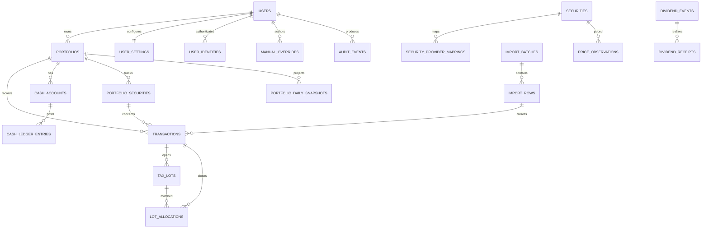

# YieldToMe data model

Status: proposed D1 schema; implement through reviewed Drizzle migrations  
Date: 2026-07-28

## 1. Conventions

- Primary IDs are opaque text identifiers generated by the application.
- Timestamps are UTC RFC 3339 text (`*_at`); market/accounting dates are ISO `YYYY-MM-DD` text (`*_date`).
- IANA timezone names are stored where local-day boundaries matter.
- Currency codes are uppercase ISO 4217 where available.
- Financial decimals are canonical strings, for example `"-1234.5600"`. Application validators reject exponent notation, NaN, infinity, and excessive scale.
- Booleans are D1 integers constrained to `0` or `1`.
- Enums are text with `CHECK` constraints and mirrored TypeScript unions.
- All mutable tables have `created_at`, `updated_at`, and usually `version`.
- Corrections use status/supersession/reversal records. Hard deletes are reserved for verified account purge.
- Shared reference data is separate from user-owned financial data.
- Every relationship that can change a user’s financial result carries enough owner/portfolio columns for a composite foreign key. Application validation adds domain rules; it does not replace enforceable ownership constraints.

Why decimal text: D1’s integers are signed 64-bit and one global scale cannot safely cover fractional quantities, FX precision, prices, and large portfolio values. SQLite `REAL` is binary floating point. Decimal text plus strict application parsing is the safest v1 representation; sortable/reporting values are derived through the domain layer, not ad hoc SQL arithmetic.

## 2. Relationship map



## 3. Identity and ownership

### `users`

| Column              | Type         | Constraints / meaning                                         |
| ------------------- | ------------ | ------------------------------------------------------------- |
| `id`                | TEXT         | PK                                                            |
| `status`            | TEXT         | `pending`, `active`, `disabled`, `deletion_pending`, `purged` |
| `display_name`      | TEXT         | nullable                                                      |
| `primary_email`     | TEXT         | contact/display only, normalized                              |
| `locale`            | TEXT         | default `en-AU`                                               |
| `timezone`          | TEXT         | IANA name                                                     |
| `terms_accepted_at` | TEXT         | nullable                                                      |
| `last_seen_at`      | TEXT         | nullable                                                      |
| timestamps/version  | TEXT/INTEGER | standard                                                      |

Indexes: status; normalized email is non-unique because it is not identity.

### `user_identities`

| Column                  | Type | Constraints / meaning         |
| ----------------------- | ---- | ----------------------------- |
| `id`                    | TEXT | PK                            |
| `user_id`               | TEXT | FK users, restrict delete     |
| `provider`              | TEXT | initially `cloudflare_access` |
| `issuer`                | TEXT | verified Access issuer        |
| `subject`               | TEXT | verified stable subject       |
| `email_at_link`         | TEXT | audit metadata                |
| `status`                | TEXT | `active`, `revoked`           |
| `last_authenticated_at` | TEXT | nullable                      |

Unique: `(provider, issuer, subject)`. Never auto-link solely on email.

### `user_settings`

One-to-one with user:

- `user_id` primary/composite owner key;
- required `home_currency_code` FK to currencies;
- IANA timezone and locale/display defaults;
- default native/home holding-price view;
- `financial_year_start_month` (integer, CHECK 1–12, default 7): the configurable financial-year start month (day is always the 1st). Per-user only — there is no per-portfolio override. The same `timezone` column on this row decides where the FY boundary falls everywhere (see `docs/CALCULATIONS.md` and requirement FY-001). Existing rows default to 7 (the Australian financial year) with no data rewrite;
- timestamps/version.

Home currency is the canonical reporting currency. Changing it is an explicit recalculation event, not a cosmetic database update.

### `portfolios`

| Column                  | Type | Constraints / meaning                                                            |
| ----------------------- | ---- | -------------------------------------------------------------------------------- |
| `id`                    | TEXT | PK                                                                               |
| `user_id`               | TEXT | FK users                                                                         |
| `code`                  | TEXT | owner-scoped stable short code                                                   |
| `name`                  | TEXT | display name                                                                     |
| `base_currency_code`    | TEXT | effective home/reporting currency, initialized from user settings; FK currencies |
| `timezone`              | TEXT | IANA                                                                             |
| `accounting_method`     | TEXT | v1 `fifo`                                                                        |
| `history_complete_from` | TEXT | nullable local date                                                              |
| `status`                | TEXT | `active`, `archived`                                                             |
| timestamps/version      |      |                                                                                  |

Unique: `(user_id, id)` for composite FKs; `(user_id, code)`. Index `(user_id, status, updated_at)`.

### `portfolio_settings`

One-to-one with portfolio, including `user_id` composite ownership:

- display currency preferences;
- quote staleness policy;
- mobile density preferences;
- feature flags that are genuinely user settings, not security switches.

Unique/FK: `(portfolio_id, user_id) -> portfolios(id, user_id)`.

Dividend assumptions are not part of the core schema. Add them only with the deferred dividend workflow.

## 4. Reference and security master

### `currencies`

Shared table: `code` PK, `numeric_code`, name, minor-unit digits, active flag. Non-ISO pseudo-currencies require an explicit namespace and are out of v1.

### `exchanges`

Shared table:

- `id`, canonical name, MIC, country code;
- timezone;
- default currency;
- trading calendar identifier;
- active flag.

Unique MIC when present.

### `securities`

Shared canonical identity:

| Column                                | Meaning                                                                |
| ------------------------------------- | ---------------------------------------------------------------------- |
| `id`                                  | durable internal security ID                                           |
| `asset_type`                          | v1 `equity`, `etf`, `fund`                                             |
| `exchange_id`                         | verified primary exchange when known; null is not an unresolved marker |
| `primary_currency_code`               | trading currency                                                       |
| `canonical_name`                      | issuer/fund name                                                       |
| `isin`                                | nullable, unique where trusted                                         |
| `status`                              | `active`, `delisted`                                                   |
| `first_trade_date`, `last_trade_date` | nullable                                                               |

Ticker deliberately does not live here as an eternal identifier.
Unresolved candidates remain private in `portfolio_securities`; they are not rows in this shared table.

### `security_identifiers`

Validity-dated identifiers:

- `security_id`;
- `scheme` (`ticker`, `isin`, `cusip`, `sedol`, `provider_symbol`, later);
- `value`;
- `exchange_id` where scheme needs it;
- `valid_from`, `valid_to`;
- source/provenance.

Unique within scheme/exchange/date model. Overlapping validity intervals are rejected in the service.

### `market_data_providers`

Provider registry:

- code/name;
- active flag;
- capability JSON limited to non-secret metadata;
- rate-limit configuration;
- technical review date and operator notes reference.

No API key in D1.

### `security_provider_mappings`

- `security_id`, `provider_id`;
- provider exchange and symbol;
- `valid_from`, `valid_to`;
- status (`candidate`, `verified`, `rejected`, `expired`);
- verification source/actor/time;
- provider metadata hash.

Unique active mapping `(provider_id, provider_exchange, provider_symbol, valid_from)`. Index `(security_id, provider_id, valid_to)`.

This shared table is writable only by a server/operator verification path. An end-user mapping choice writes an owned mapping decision and `portfolio_securities` relationship; it cannot directly publish a candidate or change another user’s canonical mapping.

IMP-004B adds the first owner-triggered instance of that server verification path: an owner can request verification of one brand-new unresolved import candidate (`app/security-verification-service.ts`, `db/repositories/security-verification.ts`). The request itself is not a write — it is a lookup key (symbol, exchange alias, currency) re-derived from the server's own current, database-backed preview, never trusted client state. The write only happens after a successful, server-executed provider identity lookup (`domain/market-data/*`'s `searchSecurities`) agrees on currency and (when supplied) exchange (`domain/securities/verify-identity.ts`); the resulting canonical currency is normalized to upper case before publication, so a lower-case provider value cannot pass the case-insensitive agreement check and then fail the `currencies` FK on write. Publication is creation-only: if a `security_provider_mappings` row already exists for that verified provider identity, the request links to the existing `security_id` instead of creating a new `securities`/`security_identifiers`/`security_provider_mappings` row, and never mutates an existing canonical row, identifier, or another user's mapping — that dedupe-link path also re-checks that the existing security's `primary_currency_code` still agrees with the freshly-verified identity's currency, failing explicitly rather than linking a private candidate to a shared security whose currency the current evidence disagrees with. A verified-published `securities` row always carries `exchange_id = NULL`: the provider's exchange string is recorded only on `security_provider_mappings.provider_exchange`, never fabricated onto the canonical row as an `exchanges`/MIC reference. Every provider-unavailable, ambiguous, or mismatched outcome is an explicit failure; the owner's `portfolio_securities` candidate stays private and unresolved. All writes (the new canonical rows, when needed, plus the owner's `portfolio_securities` link) execute as one atomic guard-conditional `batch()` call, matching §11's technique — the link statement is folded into the same call as the canonical inserts, resolving `security_id` from a live subquery against `security_provider_mappings` rather than a literal value, so it links correctly whether this call's own canonical rows win or a concurrent publish's did; a concurrent verification of the same identity either loses the unique-index race (its own batch rolls back, canonical rows and link alike, so nothing is ever published without an owner link) or observes the winner's row already published (the canonical inserts no-op while the link statement still fires against it), and links to it rather than duplicating it.

### `portfolio_securities`

Owner-specific relationship:

- `id`, `user_id`, `portfolio_id`, nullable verified `security_id`;
- owner-scoped imported symbol, exchange alias, currency, and name while unresolved;
- display symbol/name override;
- watch/hidden status;
- user mapping status;
- first/last relevant date.

Composite FK to owned portfolio. Resolved memberships are unique by `(portfolio_id, security_id)`. Unresolved imported candidates remain private in this table and do not create or mutate shared canonical securities until separately verified.

## 5. Ledger, lots, and cash

### `transactions`

Immutable/versioned normalized ledger event:

| Column                                     | Meaning                                                                                                                          |
| ------------------------------------------ | -------------------------------------------------------------------------------------------------------------------------------- |
| `id`, `user_id`, `portfolio_id`            | owned identity                                                                                                                   |
| `portfolio_security_id`                    | required for security events; nullable for cash-only events; owner/portfolio-scoped composite FK                                 |
| `type`                                     | `buy`, `sell`, `cash_deposit`, `cash_withdrawal`, `fee`, `tax`, `split`, `opening_balance`; transfers and dividends are deferred |
| `status`                                   | `posted`, `reversed`, `superseded`, `void_pending`                                                                               |
| `trade_at`, `settlement_date`              | event timing                                                                                                                     |
| `local_trade_date`                         | portfolio-timezone accounting day                                                                                                |
| `quantity_decimal`                         | signed-domain input; service enforces type semantics                                                                             |
| `unit_price_decimal`                       | native quote currency                                                                                                            |
| `currency_code`                            | transaction currency                                                                                                             |
| `gross_amount_decimal`                     | optional explicit source amount                                                                                                  |
| `fee_amount_decimal`, `tax_amount_decimal` | non-negative native amounts                                                                                                      |
| `fx_rate_to_base_decimal`                  | nullable; transaction currency per one base conversion convention documented below                                               |
| `fx_rate_source`, `fx_observed_at`         | provenance                                                                                                                       |
| `source_type`                              | `manual`, `csv_import`, future `broker_sync`, `provider`, `system`                                                               |
| `source_reference`                         | nullable external/reference ID                                                                                                   |
| `idempotency_key`                          | required for new writes; immutable retry identity independent of source provenance                                               |
| `import_row_id`                            | nullable FK                                                                                                                      |
| `reverses_transaction_id`                  | nullable self-FK                                                                                                                 |
| `supersedes_transaction_id`                | nullable self-FK                                                                                                                 |
| `created_by_user_id`                       | actor                                                                                                                            |
| `calculation_version`                      | normalization rule version                                                                                                       |
| timestamps/version                         |                                                                                                                                  |

Convention: `fx_rate_to_base × native amount = portfolio-base amount`.

Checks:

- quantities/prices required for buy/sell;
- fee/tax non-negative;
- buy/sell quantity strictly positive in normalized storage (type supplies direction);
- FX strictly positive when present;
- one reversal target at most once;
- source reference unique within `(portfolio_id, source_type)` when present.
- idempotency key unique within `(user_id, portfolio_id)` when present; identical retries return the original result and a different normalized posting intent conflicts.

Indexes: `(user_id, portfolio_id, local_trade_date, id)`, `(portfolio_id, portfolio_security_id, trade_at)`, import row, reversal/supersession.

`import_row_id`, reversal/supersession targets, and any other private child reference use composite owner/portfolio foreign keys. A transaction cannot point to another portfolio’s membership, import row, or transaction even when both portfolios have the same owner.

### `manual_ledger_mutation_keys`

Short-lived server-issued mutation grants bind a random key to `user_id`, `portfolio_id`, one purpose (`create`, `reverse`, or `supersede`), and the exact correction target when applicable. A successful ledger batch marks the grant used and links its immutable result transaction. Unused expired grants reject, while used grants remain valid only for an identical idempotent retry. The key is retry identity, not authentication; every issue and consume path still requires the authenticated owner and same-origin mutation checks.

Used grants follow ledger retention because their result FK is retry evidence. Expired unused grants contain no financial payload and may be removed by a future bounded housekeeping job; they are never accepted after expiry.

### `ledger_mutation_guards`

Ephemeral rows provide a D1 atomic assertion for security quantity changes. Before posting, the repository streams active buy/sell/split events in bounded chronological pages and calculates exact quantity. The posting batch inserts a guard whose `valid = 1` check compares the observed owner/portfolio/security transaction count and version total with current ledger state, writes the immutable fact/status transition, then removes the guard. A concurrent ledger change makes the complete batch fail and retry from fresh evidence; guard rows do not survive successful batches.

### `transaction_versions`

Optional immutable source-version payload for editable descriptive fields:

- transaction ID and version;
- normalized field JSON (no provider secrets);
- change reason, actor, timestamp;
- previous version hash/current hash.

Financial effect changes still use reversal/replacement transactions.

### `tax_lots`

Disposable but inspectable FIFO projection:

- `id`, `user_id`, `portfolio_id`, `portfolio_security_id`;
- opening transaction ID;
- acquired timestamp/date;
- original/open quantity decimal;
- native/base total basis decimal;
- explicit `basis_status` (`complete`, `incomplete_fx`, or `incomplete_basis`);
- allocated acquisition fees/taxes;
- status;
- calculation run, version, and rebuilt time.

Unique opening lot identity within a calculation run. A buy can produce one lot in v1. LED-002B
rebuilds lots from the owner-scoped ledger high-water mark and retains closed
lots in the disposable projection so allocations remain inspectable.

### `lot_allocations`

- sell transaction ID;
- tax lot ID;
- owner, portfolio, and portfolio-security membership used in composite foreign keys to both sides;
- matched quantity;
- allocated native/base basis;
- allocated sale fees/taxes;
- native/base net proceeds;
- native/base realised gain;
- calculation version.

Unique `(sell_transaction_id, tax_lot_id, allocation_sequence, calculation_run_id)`. Sum constraints are validated transactionally by the service.

### `cash_accounts`

One per portfolio/currency:

- `id`, `user_id`, `portfolio_id`, `currency_code`;
- status and last reconciled time;
- source completeness (`complete`, `opening_balance`, `incomplete`).

Unique `(portfolio_id, currency_code)`.

### `cash_ledger_entries`

Append-only cash effect:

- owned cash account and portfolio IDs;
- linked transaction/import row; a dividend-receipt link is deferred;
- effective timestamp/date;
- type;
- signed native amount decimal;
- status and reversal link;
- source/actor.

Only one canonical posting per source effect. Cash balances are projected sums; a cached balance may exist with reconciliation metadata but is not authoritative.

### `holding_projections`

Current disposable projection:

- owner, portfolio, and portfolio-security membership;
- quantity, native open basis where meaningful, and canonical home-currency open basis;
- selected native price/home FX evidence for the current projection;
- average basis per unit;
- last ledger sequence/time;
- calculation version and rebuilt time;
- completeness status.

Unique `(portfolio_id, portfolio_security_id, calculation_run_id)`. Must reconcile to lots and posted transactions, including an owner-private unresolved membership.

Run-versioned rows remain non-current while bounded chunks are assembled.
Each chunk atomically writes at most the configured output limit and advances
the run's security/output high-water checkpoint. Publication is a single
guarded update to `projection_publications`, keyed by owned portfolio, after
the run completes at the unchanged ledger high-water mark. A stale or
lost-lease run cannot advance its checkpoint or become current; a failed
chunk can be retried without duplicating its output. Prior run rows are
disposable and may be removed later in separately bounded cleanup work.

The projection’s home-currency values are stored/rebuilt for reporting. Native security prices, transaction amounts, and lot provenance remain available. Switching the UI between native and home currency never rewrites the projection or ledger.

## 6. Prices, FX, corporate actions, and fundamentals

### `price_observations`

- security/provider/mapping IDs;
- observation scope (`deployment` or `user`) and nullable `scope_user_id`; the Yahoo-compatible source is deployment-scoped, while a future user-entitled source may be user-scoped;
- `interval` (`eod`, `delayed`, `intraday`); manual values live only in owner-scoped `manual_overrides`;
- `observation_at`, `market_date`, `market_timezone`;
- currency;
- open/high/low/close decimal text;
- previous close where explicitly supplied;
- volume decimal/integer text;
- adjustment state (`raw`, `split_adjusted`, `total_return_adjusted`);
- adjustment factor;
- quality (`observed`, `corrected`, `indicative`, `stale_candidate`);
- delayed minutes;
- ingested time, provider revision ID, payload hash.

Unique `(provider_id, security_provider_mapping_id, interval, observation_at, adjustment_state)`. Index security/date and provider/date.

### `fx_rate_observations`

- provider;
- access scope and nullable `scope_user_id` under the same rule as prices;
- base currency, quote currency;
- `rate_decimal` meaning one base equals rate quote;
- interval, observed timestamp/date/timezone;
- quality, delayed minutes, ingested time, payload hash.

Unique provider/pair/interval/observed time. Application derives and records inversion choice in calculation evidence rather than inserting duplicate inverse rows.

Provider selection uses deployment observations for the configured Yahoo-compatible source. A future user-entitled observation must match the authenticated internal user; this scope is for privacy/entitlement isolation only.

### `market_data_refresh_jobs`

Refresh jobs are durable D1 rows rather than in-memory or `waitUntil` work. Each row records the provider, price/FX target and scope, requested date range, bounded chunk size, resumable `high_water_date`, idempotency key, provider-request/observation counters, retry state, and conditional lease. A partial unique index permits at most one queued/running row for a provider/scope/target; insert-and-range-extension execute in one D1 batch so concurrent requests coalesce without a read-then-write race. Expired running leases are reclaimable.

Normalized price and FX writes use their provider/scope/date uniqueness keys with update-on-conflict semantics, so duplicate rows remain idempotent and a corrected provider observation updates the normalized value without creating a second fact. Each bounded set of observation upserts and its lease/high-water/counter checkpoint execute in one guarded D1 batch. If any statement fails or the lease/high-water guard no longer matches, neither observations nor progress publish. Runtime configuration is rejected when it would exceed the five-observation/six-statement chunk, 100 parameters per statement, or 50-query invocation budget.

Migration `0018` safely resolves any legacy duplicate active target rows before installing the unique index: the oldest row is queued to replay the union range from the beginning, and superseded active rows become failed with `coalesced_by_migration`. Replaying is intentional and correction-safe because normalized observation keys are idempotent.

### `split_events` (DB-005)

**Operational consequence for account deletion:** the six new owner-scoped tables below (`dividend_receipts` through `dividend_manual_records`) are classified `owned` in `ACCOUNT_EXPORT_TABLE_CLASSIFICATIONS` (`db/repositories/account-lifecycle.ts`), so this migration (`0030`) changed the set of tables every OPS-003A export must cover. Deploying it invalidates any already-completed export bound to a pending `deletion_pending` request: `purgeAccount` fails closed with `manifest-corrupt` rather than purging without the new tables, and the owner must submit a fresh deletion request (new idempotency key, new export, new cooling-off) before it can complete — see `docs/OPS-003B_VERIFIED_DELETION_RUNBOOK.md`'s "Operational consequence of a schema-adding migration" note for the full mechanism and the operator checklist. `split_events`/`dividend_events` themselves carry no such consequence — they are shared, not owner data (see below).

Shared provider facts, security-keyed, not owner data — same "no export/purge ownership" treatment as `securities` (excluded from `ACCOUNT_EXPORT_TABLE_CLASSIFICATIONS` and never covered by an `account_purge_lock_*` trigger):

- `security_id`, `provider_id`;
- `ex_date`, `effective_date` (both required);
- `numerator_decimal`/`denominator_decimal` (positive decimal strings);
- `status` (`declared`, `effective`, `cancelled`, `superseded`);
- `observed_at`, `ingested_at`;
- `supersedes_event_id` (nullable self-reference).

Corrections never rewrite a published row in place: a corrected/cancelled observation is inserted as a new row with `supersedes_event_id` pointing at the prior row, and the prior row's `status` moves to `superseded` in the same write — the same shape `manual_overrides` uses for owner data. `createDividendEventRepository`/`createSplitEventRepository` (`db/repositories/dividends.ts`) are server/provider-write-only: they take no `userId` and are gated architecturally (not wired to any user-triggered mutation), mirroring how `security-verification.ts` writes the shared `securities` master.

**`status` is a lifecycle column, not an immutable provider fact (MKT-005 review fix).** A pure lifecycle progression — the identical natural key and every other fact (numerator/denominator for splits; amount/currency/payment-date for dividends) unchanged, only `status` advancing because the ex-date/effective-date has now passed (`declared` → `effective` for splits, `declared` → `paid` for dividends) — is applied as an in-place `UPDATE` of `status`/`observed_at` (`updateStatus` in `db/repositories/dividends.ts`), explicitly NOT a correction and NOT a supersession. Supersession (insert-new + move prior row to `superseded`) stays reserved for an actual fact change. Reusing the same event id for a lifecycle transition means no new row and no `supersedes_event_id` link is created for a simple date-crossing.

A partial unique index — `..._active_natural_key_unique` on `(security_id, provider_id, ex_date)` for `dividend_events` and on `(security_id, provider_id, effective_date)` for `split_events`, both `WHERE status <> 'superseded'` — guarantees at most one active row per natural key even under concurrent ingestion attempts (the IMP-004B verify trigger and the periodic MKT-005 refresh sweep can race on the same security); superseded rows are exempt so supersession history is never blocked.

Splits affect quantities and raw/adjusted comparison. An explicit ledger corporate-action record links implementation effect (future work; not part of this task).

### `dividend_events` (DB-005)

Shared provider facts, same non-owner-data treatment as `split_events`:

- `security_id`, `provider_id`;
- `kind` (`cash`, `special`, `capital_return`);
- `status` (`estimated`, `declared`, `paid`, `cancelled`, `superseded`);
- `ex_date`, `record_date`, `payment_date`, `declaration_date` (all nullable);
- `currency_code` and `gross_per_share_decimal` (required once `status` is `declared`/`paid`, enforced by a CHECK constraint);
- `franking_percent_decimal`/`franking_credit_per_share_decimal`, both nullable — a typed seam left present-but-unpopulated (NULL = unknown, never a silent zero) until a franking source exists (MKT-005: no current provider supplies franking);
- `observed_at`, `ingested_at`;
- `estimate_method`/`estimate_as_of`, both nullable, populated only for `estimated` rows;
- `supersedes_event_id` (nullable self-reference), same supersession shape as `split_events`.

Declared/paid provider events and calculated estimates remain distinguishable. See `split_events`' status-semantics note above (applies identically here): a pure `declared` → `paid` transition with every other fact unchanged is an in-place update, not a supersession.

### `corporate_action_refresh_state` (MKT-005 review fix)

Shared provider OPERATIONAL state — not a financial fact, not owner data; classified `excluded` in `ACCOUNT_EXPORT_TABLE_CLASSIFICATIONS` exactly like `securities`/`dividend_events`/`split_events` (no purge-lock trigger):

- `security_id` (primary key, FK to `securities`);
- `last_attempted_at` (required) — updated on every corporate-action ingestion ATTEMPT for this security (success, failure, or a no-op reconciliation), regardless of which of MKT-005's three ingestion triggers invoked it;
- `last_status` (nullable, `ok` or `failed`).

This exists solely so the periodic refresh sweep (`runDueCorporateActionRefresh`) can rank verified securities oldest-attempted-first and rotate through the full candidate set. An earlier version of this ranking derived "last attempted" from `MAX(ingested_at)` on `dividend_events`/`split_events` directly, but that watermark only advances when an ingestion attempt actually WRITES a row — a non-paying security, or one whose fetched data never changes (an "unchanged" result), never advances it and would sort first on every single sweep forever, starving every other security. `corporate_action_refresh_state` is written on every attempt independent of whether any event row changed, which fixes the starvation.

### `dividend_receipts` (DB-005 original scope)

Owner-scoped, per-share model. This is the future ledger-linked capability the "later, posting an actual dividend receipt and its cash entry" bullet in §11 describes:

- `id`, `user_id`, `portfolio_id`, `portfolio_security_id` (composite-key owned, matching the `portfolio_securities`/`tax_lots` convention);
- `dividend_event_id` (required — a receipt is always tied to a specific provider event; a repository-level check enforces the event's security matches the holding's security);
- `transaction_id` (nullable composite FK to `transactions`) — stays NULL until a later task wires actual cash posting (no `dividend` `transactions.type` value exists yet);
- `shares_decimal`, `dividend_per_share_decimal` (required decimal strings), `franking_per_share_decimal` (nullable — unknown, never zero);
- `currency_code`, `payment_date`;
- `status` fixed to `'actual'` by a CHECK constraint, so an estimate can never be persisted as a receipt;
- `source` (`manual`, `csv_import`, `broker_sync`);
- `created_at`, `updated_at`, `version` (optimistic concurrency).

DIV-001's v1 read-derived income model (owner overrides + manual records, no ledger posting) is served by `dividend_event_overrides`/`dividend_manual_records` below instead of this table. `source = 'csv_import'` is accepted by the CHECK constraint but intentionally unused in v1: the CSV importer (`IMP-006`) lands committed dividend rows as `dividend_manual_records` instead (see that table's note below and `docs/CSV_IMPORT_SPEC.md`'s "Dividend-receipt rows" section for why), so this value stays reserved for a future task that wires this table to an actual, provider-event-linked cash posting.

### `dividend_security_assumptions` / `dividend_portfolio_assumptions` (DB-005 extension a)

Portfolio-scoped dividend/growth assumption overrides, versioned like `user_settings`, never affecting ledger facts. Every field is a nullable decimal string; NULL means "fall back to provider-derived values" (DIV-003), never an implicit zero.

`dividend_security_assumptions` — one row per `portfolio_security_id` (unique):

- `id`, `user_id`, `portfolio_id`, `portfolio_security_id`;
- `dividend_yield_percent_decimal`, `franking_percent_decimal`, `dividend_growth_percent_decimal`;
- `created_at`, `updated_at`, `version`.

`franking_percent_decimal` doubles as the holding's "franking if not known" default consumed by DIV-001's per-dividend franking resolution chain (per-dividend override → this default → unknown/flagged).

`dividend_portfolio_assumptions` — one row per portfolio (`portfolio_id` primary key, same single-row-per-owner-key shape as `portfolio_settings`):

- `portfolio_id`, `user_id`;
- `value_growth_percent_decimal`, `portfolio_dividend_growth_percent_decimal`;
- `created_at`, `updated_at`, `version`.

### `dividend_fy_overrides` (DB-005 extension b)

Portfolio-scoped financial-year actual-income override, distinct from receipts, for owner-typed historical corrections:

- `id`, `user_id`, `portfolio_id`;
- `financial_year_ending_year` (integer, keyed by the FY's ending year per FY-001A's "named by its ending year" convention — Jul 2025–Jun 2026 = "FY26" = `2026`); unique per `(portfolio_id, financial_year_ending_year)`;
- `grossed_amount_decimal` (required), `franking_amount_decimal` (nullable) — amounts are in the portfolio's base currency;
- `created_at`, `updated_at`, `version`.

### `dividend_event_overrides` (DB-005 extension c)

Sparse per-dividend override, keyed to a specific provider event so overriding an old dividend never blocks new events from flowing through (DIV-001's owner dividend-history decision):

- `id`, `user_id`, `portfolio_id`, `portfolio_security_id`, `dividend_event_id`; unique per `(user_id, portfolio_id, portfolio_security_id, dividend_event_id)` — at most one override row per holding/event;
- `shares_decimal`, `dividend_per_share_decimal`, `franking_credit_per_share_decimal` — all nullable; a NULL column falls back to the read-time auto-derivation (shares held at ex-date × event gross per share);
- `exclude` (boolean) removes the event from derived history/totals entirely;
- `created_at`, `updated_at`, `version`.

**Override survival through a provider correction (MKT-005 review fix — the real mechanism, corrected here after review found the originally recorded framing backwards).** `dividend_event_id` is a hard reference to one exact event row. Supersession (see `dividend_events` above) mints a NEW event id for a corrected fact and moves the prior row's status to `superseded`; it never rewrites or re-keys an existing override. Consequently, if the provider later corrects an overridden event, the override row survives completely unchanged — but it stays keyed to the now-superseded PRIOR version's id, not the new corrected event's id. A naive lookup that only checks "is there an override for the security's current active dividend event" would therefore MISS it — the opposite of the intended "the override still wins" behaviour recorded for DIV-001. Correctly resolving this requires walking the `supersedes_event_id` chain from the current active event backward through every prior version and checking each id for an override; `collectEventLineageIds` (`domain/market-data/corporate-action-ingestion.ts`) is a small pure helper that returns exactly that ordered lineage. The actual resolution logic (matching lineage ids against `dividend_event_overrides`, deciding which value the detail view shows) is `DIV-001` scope and is a binding requirement for that task, not implemented here.

### `dividend_manual_records` (DB-005 extension d; TASKS.md `IMP-006` task / requirement `IMP-007`)

Manual dividend record for a security/payment the provider never surfaced as an event — no `dividend_event_id` link:

- `id`, `user_id`, `portfolio_id`, `portfolio_security_id`;
- `payment_date`;
- `shares_decimal`, `dividend_per_share_decimal` (required), `franking_credit_per_share_decimal` (nullable);
- `import_batch_id`, `source_reference` (both nullable, no FK — IMP-006, migration `0032`, `ALTER TABLE ADD COLUMN` only, no rebuild): set only for a row a CSV import batch created, `NULL` for rows entered directly through the manual dividend-entry UI. `source_reference` reuses `transactions.source_reference`'s `import-fingerprint:<row fingerprint>` scheme (a unique index on `(portfolio_id, source_reference)` gives the same cross-batch/resume idempotency trades get); `import_batch_id` is what a reversal deletes by;
- `created_at`, `updated_at`, `version`.

DIV-001's double-count guard (manual/override > imported > auto-derived — exactly one row wins for a given security/event window) is domain-layer logic, not a schema constraint; this table's read-time derivation (`domain/dividends/history.ts`) does not distinguish import-created rows from directly-entered ones — both are the `"manual"` source. CSV-imported dividend rows land here rather than in `dividend_receipts` because that table's `dividend_event_id` is a NOT NULL reference to the shared, provider-populated `dividend_events` table, which the importer cannot safely satisfy for an arbitrary broker row (see `docs/CSV_IMPORT_SPEC.md`'s "Dividend-receipt rows (IMP-006 extension)" section for the full reasoning). Reversal deletes the rows a batch created (identified by `import_batch_id`) rather than writing a "reversed" marker — this table has no such status, matching its existing owner-mutable/deletable treatment elsewhere (its repository already exposes a hard `remove()` for the manual-entry UI).

Only actual receipts (`dividend_receipts`, once a later task wires cash posting) affect cash and lifetime-actual income; provider events, assumptions, FY overrides, event overrides, and manual records are all income-reporting facts — nothing in this section posts cash to the ledger in v1. A provider event never creates an actual receipt without a user/imported/broker fact, and estimated income is never storable as a receipt (enforced by the `dividend_receipts_status_check` CHECK constraint).

### `fundamental_snapshots`

Deferred capability:

- security/provider;
- effective/as-of dates;
- currency;
- normalized selected metrics;
- source revision and payload hash.

Do not create until a concrete Details screen requirement and provider capability exist.

## 7. Imports and mappings

### `import_batches`

- `id`, `user_id`;
- optional target portfolio;
- parser format/version;
- original filename (sanitized display value), byte size, SHA-256 hash;
- status: `uploaded`, `parsed`, `needs_mapping`, `invalid`, `ready`, `committing`, `committed`, `reversing`, `reversed`, `failed`;
- row totals by classification/severity;
- commit/reversal idempotency keys;
- uploaded/committed/reversed actors/timestamps;
- supersedes batch;
- failure category and redacted detail.

Exact file duplicate is owner-scoped unique by hash and parser version as policy permits.

### `import_rows`

- batch and physical row number;
- row class (`portfolio_security_definition`, `transaction`, `blank`, `unsupported`);
- original field values as bounded JSON (not original file bytes);
- normalized fields JSON;
- normalized fingerprint;
- validation status;
- target portfolio and owner-scoped portfolio-security membership IDs;
- commit status and resulting transaction ID;
- error/warning counts.

Unique `(batch_id, physical_row_number)` and index `(user_id, normalized_fingerprint)`.

Sensitive notes are financial user data and follow account retention.

### `import_issues`

- row/field;
- severity (`error`, `warning`, `info`);
- stable code;
- safe user message;
- suggested resolution type;
- resolved value/actor/time.

### `import_mapping_decisions`

- batch/user;
- kind (`portfolio`, `security`, `currency`, `transaction_type`, future);
- source key and normalized source value;
- target ID/value;
- scope (`row`, `batch`, `user_future`);
- confidence/source (`user`, `exact_identifier`, `system_candidate`);
- actor/time.

No ambiguous security mapping auto-commits.

The commit-ready preview version is a SHA-256 digest over the owner-scoped parser/batch state, staged row versions and targets, issue versions/resolution state, mapping versions, owned portfolio/security candidates, and deterministic reconciliation result. The `ready` → `committing` update also guards row, issue, and mapping counts/version totals; mapping inserts and updates are rejected after that transition. Each resumable chunk persists only its validated row targets, immutable ledger effects, chunk marker, audit, and physical-row high-water in one bounded D1 batch.

Final import invalidation is portfolio-specific. For each affected portfolio, `calculation_runs.ledger_high_water_start` stores the actual latest committed transaction ID under the ledger ordering, while `invalidation_source` retains the import batch ID. The batch reaches `committed` only in the same bounded finalization batch that durably inserts every required portfolio rebuild request.

## 8. Future broker-sync extension

These tables are deferred, but the current ownership/source keys reserve the boundary.

### `broker_connections`

- `id`, `user_id`, broker provider code;
- status and granted scopes;
- encrypted access/refresh token envelope or provider credential reference;
- token expiry, last authenticated/synced time;
- created/updated/revoked timestamps.

Unique connection/provider identity is owner-scoped. Plaintext credentials never persist.

### `broker_accounts`

- `id`, `user_id`, connection ID;
- provider account ID/hash and display label;
- account currency/type;
- mapped owned portfolio ID;
- status and last sync time.

Composite foreign keys ensure the connection, account, and portfolio share `user_id`.

### `broker_sync_runs`

- connection/account/portfolio/owner;
- capability (`transactions`, `cash`, `positions`, optional `quotes`);
- cursor/date range and provider high-water version;
- status, lease, attempt, counts, redacted error;
- deterministic idempotency key and timestamps.

### `external_record_mappings`

- owner, provider, broker account, external record type/ID/version;
- normalized transaction/cash record ID;
- payload hash, observed time, status, supersession.

Unique `(user_id, provider, broker_account_id, external_type, external_id, external_version)`. Repeated sync is idempotent. Positions are stored as reconciliation snapshots and never become an untracked authoritative overwrite of ledger holdings.

Broker-provided prices use the existing price-observation/provider mapping shape, plus owner/connection entitlement scope where the quote cannot legally be shared.

### 8.1 SPK-003 spike validation (no schema change in this pass)

`SPK-003` (design spike) validated the shape above with pure TypeScript contract types and planning functions in `domain/broker-sync/` and `tests/spk-003.test.ts`, without adding any table to `db/schema.ts` or generating a migration — these tables remain deferred until a future implementation task is promoted. The spike confirmed:

- `TokenEnvelopeRef` (`domain/broker-sync/contracts.ts`) matches `broker_connections`' "encrypted access/refresh token envelope or provider credential reference" column: an opaque `envelope_id` reference plus expiry/status, never a raw token value. Application code never has a typed path to a plaintext credential.
- **Idempotency-key semantics** (chosen to fix two review-caught defects — a caller-array-order-dependent duplicate bug and unbounded reversal churn on cursor restarts): storage keeps its documented 6-tuple uniqueness — `(user_id, provider, broker_account_id, external_type, external_id, external_version)` — with one persisted row per reported version, so correction/deletion history stays fully auditable. The _planner_, given a batch of such rows for a user, groups them by the 5-tuple WITHOUT `external_version` and resolves each group to its single currently-effective row by `status = 'active'` (never by array position, which D1's unordered `SELECT` cannot guarantee); it then compares the incoming record's `external_version` numerically against that active row's version. A version at or below the active version is always a no-op (an exact replay or a stale/older cursor page); only a strictly newer version can plan a reversal-based effect. Payload-hash equality is retained on records/mappings for audit/debugging but is no longer what decides whether an effect is planned — version order is the single source of truth for staging decisions, so out-of-order redelivery can never re-open an already-superseded correction. See `planBrokerLedgerSync`, `mappingLookupKey`, and `selectActiveMapping` in `domain/broker-sync/reconciliation-plan.ts`.
- **Persistence invariant — what a `reverse_only`/`reverse_and_replace` effect leaves behind**, made explicit after a review-caught "ghost resurrection" defect: applying `create` inserts one new `active` row. Applying `reverse_and_replace` flips the previously-active row to `superseded` and inserts one new `active` row at the corrected version — exactly one `active` row exists afterward. Applying `reverse_only` (a broker-reported deletion) flips the previously-active row to `reversed` AND inserts a new row for the deletion event itself, ALSO `reversed` — so **no row is ever `active` again for that identity**, and a group that has history but no `active` row always means "fully reversed," never "never seen." The planner must not conflate those two states: for a group with history but no active row, it compares the incoming record's version against the group's _highest known version regardless of row status_ — anything at or below that highest version is a no-op (`skip_reversed_history`, whether the incoming record is a re-served older page or a replayed deletion), and only a version strictly above it may plan a fresh `create` (a genuine broker re-issue of the same external ID). Only a truly empty group (no row of any status) is treated as never-seen. See `highestKnownVersion` in `domain/broker-sync/reconciliation-plan.ts` and the `ExternalRecordMappingRecord` docstring in `contracts.ts` for the full invariant statement.
- A broker-reported deletion with no active mapping to reverse plans an explicit no-op — `skip_deleted_unseen` for a truly unseen identity, `skip_reversed_history` for one with already-fully-reversed history — never a ledger create; only a deletion at a newer version than an existing active mapping plans a reversal.
- `broker_sync_runs.capability` (`transactions | cash | positions | quotes`) is exactly the `BrokerCapability` union used by the contract's `BrokerSyncRequest`.
- Position reconciliation compares broker snapshot quantities against ledger-derived quantities using the same exact-decimal comparison as the rest of the codebase (`domain/calculations/decimal.ts`, not string equality) and reports `match | drift | broker_only | ledger_only | unresolved_security | unparseable_quantity`; a broker position whose security hasn't been resolved to an internal ID is never silently dropped — it always contributes a flagged `unresolved_security` entry. Adapter-boundary quantity strings are not guaranteed canonical (`""`, `"N/A"`, exponent notation, thousands separators all fail to parse); a value that fails to parse is flagged as `unparseable_quantity` rather than throwing and losing the entire reconciliation report. There is no code path from a broker position record to a direct write of `portfolio_securities` or a ledger table.
- Broker/account/portfolio ownership must be checked against the caller's authenticated `user_id`, independently for the connection, the account, and the portfolio, plus the account-to-connection relationship — not inferred from any one of those rows alone. The connection's lifecycle `status` is checked in the same validation step, so a revoked/expired connection is rejected for sync at the validation layer. See `validateBrokerAccountMapping`.

If a future implementation task's schema differs from §8 above (for example, additional indexing or a different envelope-key shape driven by the eventually-selected broker's real token lifecycle), that task documents the change here rather than the spike silently assuming it.

## 9. Snapshots, overrides, jobs, and audit

### `portfolio_daily_snapshots`

- owned portfolio/date/base currency;
- securities value, cash value, total value;
- cost basis, unrealised gain, realised gain-to-date; actual-income fields are deferred;
- daily movement with optional price/FX components;
- quote/FX/holding coverage counts and excluded value where knowable;
- completeness/status;
- ledger high-water mark;
- market-data cutoff;
- calculation run identity;
- calculation version and rebuilt time.

New rebuild rows are unique by `(portfolio_id, snapshot_date, calculation_version, calculation_run_id)`.
`snapshot_publications` atomically points each owner/version to the completed
run, so same-version replacements cannot overwrite a readable series before
publication. Legacy rows may retain a null run identity.

### `holding_daily_snapshots`

Per portfolio/portfolio-security/date details supporting drill-down:

- quantity, native/base value and basis;
- selected price/FX observation IDs;
- selected exchange/MIC session ID, market date, close instant, and the pinned
  calendar-evidence version;
- calculation run identity;
- daily movement and completeness;
- calculation version.

Can be retained for relevant history or regenerated; define pruning only after measuring D1 size.

### `snapshot_publications`

One owner-scoped pointer per portfolio/calculation version to the completed
snapshot run and its ledger high-water. Replacing this pointer is the chart
publication switch; rows from queued, running, or failed runs are not selected.

### `manual_overrides`

Generic header:

- `id`, `user_id`, optional portfolio/security;
- type (`price`, `fx_rate`, `security_mapping`, `transaction_fx`); dividend overrides are deferred;
- target key/reference;
- effective from/to;
- value JSON with type-specific validated schema;
- reason;
- status (`active`, `superseded`, `revoked`);
- supersedes ID;
- actor/timestamps/version.

Type-specific values may move to separate tables if query complexity justifies it. Generic JSON is not used for core ledger truth.

### `calculation_runs`

- portfolio, range, calculation version;
- reason/invalidation source;
- status, attempt, lease;
- ledger high-water, completed-security/output-offset checkpoints, and counts;
- immutable market-data ingestion cutoff and bounded canonical version-2
  trading-calendar session evidence JSON captured when the run is requested.
  Each validity-dated exchange/MIC entry carries timezone, provenance/revision,
  and session open/close instants; the payload is shared across holdings rather
  than a duplicated per-holding market-date map;
- started/completed timestamps;
- redacted error category.

Provides idempotent bounded rebuilds and future Queue compatibility.

### `projection_publications`

One owner-scoped current projection pointer per portfolio:

- `user_id`, `portfolio_id`, and completed `calculation_run_id`;
- calculation version and ledger high-water;
- publication timestamp.

The pointer changes in the same bounded D1 batch that completes its guarded
run. Readers join through this table so partially assembled and stale run rows
are never presented as current projections.

### `audit_events`

Append-only:

- `id`, actor user/identity;
- action code;
- target type/opaque ID and target owner ID;
- request/correlation ID;
- result;
- redacted metadata JSON;
- event timestamp;
- previous/event hash optional for tamper-evidence later.

No raw access tokens, secret values, CSV bytes, or full financial objects.

### `account_lifecycle_requests`

Immutable, owner-scoped records for `disable`, `deletion`, and `export` requests.
Each row carries the verified actor, owner, request idempotency key, export
option, bounded job reference, and creation timestamps. Final exact row/object
counts and the SHA-256 chain manifest digest live on the export job and manifest,
not on the immutable intent row. Export jobs persist resumable cursors, expiry, manifests,
and bounded chunks; no whole export is stored in a single D1 value or returned
in one response. A unique owner/type/key constraint makes retries deterministic;
database triggers reject request updates and deletes. Export classification
explicitly includes ledger, normalized import evidence, projections, and
user-scoped price, FX, refresh, and verified mapping observations while
classifying shared reference and mutable export-control tables with explicit
retention. Original CSV bytes and provider payloads are not stored.

`account_export_jobs`, `account_export_manifest`, and `account_export_chunks`
are bounded, owner-linked operational artifacts. Jobs persist before the
request succeeds, advance deterministic table/row cursors, reconcile source
counts/digests before completion, then advance a persisted finalization
chunk cursor and SHA-256 accumulator over at most 100 chunk records per
checkpoint. Oversized rows persist at most four fragments in one checkpoint
and resume from `capture_fragment_offset`. Downloads expose cursor pages and
deterministic numbered parts without assembling the export in Worker memory until the
35-day `operational-35-days` artifact expiry. These artifacts are retained as later purge inputs;
OPS-003A never removes source financial rows.
Process/download audit access is separately represented as the operational
`audit_events.process_download` manifest input and is excluded from the normal
financial snapshot cutoff, so access logging cannot make reconciliation loop.
Its manifest row stores the exact audit-rowid high-water in `cutoff_cursor`;
access audits written after finalization remain attributable but do not change
the frozen count/digest supplied to OPS-003B. Other operational rows record the
export-job version used as their cutoff.

Temporary artifacts remain in D1, which Cloudflare documents as AES-256-GCM
encrypted at rest and TLS encrypted in transit; downloaded pages rely on HTTPS.
No external long-term export store or additional binding/product is introduced.
<https://developers.cloudflare.com/d1/reference/data-security/>

`account_purge_jobs` is the durable OPS-003B state machine and completion
proof. It stores opaque owner/request/export IDs, the SHA-256 deletion-key
digest, exact manifest digest, bounded phase/cursors and counts, a redacted
failure code, and confirmation/eligibility/completion times. It deliberately
has no foreign keys to rows the purge removes. `account_purge_audit_guards` is
an ephemeral checked capability inserted and removed in the same D1 batch as a
checkpoint. The audit delete trigger joins the guard to the exact live purge
owner, job, version, status, and phase; a syntactically valid guard grants no
authority by itself. Ordinary audit updates and deletes remain prohibited.
Per-owner source-lock triggers reject mutation between bounded validation and
deletion checkpoints unless that exact guard is active.
UPDATE triggers evaluate old and new owner columns separately; authority for
one active purge owner never authorizes reassignment into or out of another.
Purge job/guard tables are classified for schema completeness but are not
OPS-003A capture inputs, preserving exact manifests completed before those
tables existed.

The append-only lifecycle triggers are intentionally appended to the generated
Drizzle migration because the schema DSL cannot express immutable intent. The
same still-uncommitted task migration was regenerated as the bounded
finalization fields were added, then its trigger statements were re-appended;
the generated schema and trigger statements are applied and tested together;
the trigger source is never hidden in runtime setup.

## 10. Deletion behavior

Default foreign-key actions:

- Shared reference rows: `RESTRICT`.
- User → portfolio/ledger: `RESTRICT` during normal operation; an account-purge job deletes in dependency order inside bounded batches.
- Portfolio → financial facts: `RESTRICT`; archive instead.
- Import batch → import rows/issues: `RESTRICT`; reverse, do not delete.
- Provider mapping → observations: `RESTRICT`; expire mapping.
- Projection/snapshot rows: may be deleted/rebuilt by controlled jobs.

This avoids accidental cascade deletion of financial history. The verified purge workflow is the only broad deletion path.

OPS-003B deletes manifest-classified owner rows in an explicit child-before-
parent order, at most 100 rows per checkpoint. User-scoped market rows use
`scope_user_id`. A provider mapping is deleted only when no remaining row
references it; otherwise it is shared reference data and stays byte-for-byte
unchanged. Export artifacts are removed after independent absence checks.
Identity email/authentication time and user contact/display fields are redacted
while issuer/subject linkage and immutable deletion intent remain for exact
revoked-principal retries.
Artifact cleanup is separately resumable and deletes no more than 100 rows per
checkpoint. It retains the exact deletion intent and removes unrelated disable,
export, or superseded deletion requests. Audit ownership uses
`target_owner_user_id`; actor-only involvement never targets another owner's
evidence.

## 11. Transaction boundaries and invariants

One D1 transactional batch must cover:

- posting a transaction, cash effect, audit event, and projection invalidation;
- persisting each bounded chunk of staged import rows/issues plus the batch's status transition;
- committing each bounded import chunk plus idempotency marker;
- finalizing an import plus every affected portfolio's real-ledger-high-water rebuild request;
- reversing a transaction/import effect plus audit;
- installing a mapping decision that changes committed facts plus recalculation job;
- publishing a verified `securities`/`security_identifiers`/`security_provider_mappings` row plus the owner's `portfolio_securities` link (IMP-004B, `db/repositories/security-verification.ts`);
- later, posting an actual dividend receipt and its cash entry.

D1 `batch()` is the bounded atomic primitive: its prepared statements execute sequentially and the sequence rolls back on failure. No design may depend on holding an interactive transaction open across requests or job chunks — repository `withTransaction`/`atomic` helpers gather all reads first, then apply every write as a single `client.batch([...])` call (or, when a write set exceeds the per-invocation statement budget below, as several sequential bounded `batch()` calls). SQL-level `BEGIN`/`COMMIT`/`ROLLBACK` are never issued against `SqlClient`; D1 rejects them outright, and every `SqlClient` implementation (D1, `node:sqlite`) is required to provide `batch()`.

Where a write's precondition cannot be re-expressed as a single `WHERE version = ?` guard on the write itself (for example, inserting several child rows only if a parent row is still in the expected state), two D1-compatible techniques are used instead of holding a lock across statements:

- **Guard row + `CHECK` constraint**: insert a row whose `valid` column is computed as `CASE WHEN EXISTS(precondition) THEN 1 ELSE 0 END`, backed by a `CHECK(valid = 1)` constraint, as the first statement in the batch, and delete it as the last. If the precondition is false, the guard insert itself violates the constraint and D1 rolls back every statement in the batch atomically. Used by `account_export_checkpoint_guards` and `account_purge_audit_guards` (`db/repositories/account-lifecycle.ts`).
- **Guard-conditional single batch**: `persistParsedResult` in `db/repositories/import-staging.ts` (Stage 2/3 parse-persistence) issues one guarded `INSERT` per parsed row/issue FIRST — `INSERT INTO import_rows/import_issues (...) SELECT <literal values> WHERE EXISTS (SELECT 1 FROM import_batches WHERE id = ? AND user_id = ? AND version = <expectedVersion> AND status = 'uploaded')`, guarded on the batch's PRE-state — followed by the version/status-checked `import_batches` `UPDATE ... WHERE id = ? AND user_id = ? AND version = <expectedVersion> AND status = 'uploaded' RETURNING ...` (bumping `version`) as the _last_ statement of one `batch()` call. Because every statement in a `batch()` call executes as one indivisible unit with no interleaving from other writers, the PRE-state predicate (`version = <expectedVersion> AND status = 'uploaded'`) uniquely identifies "no other writer has touched this batch since the caller's read": if it holds, every guarded `INSERT` fires, and the closing `UPDATE` — checking that identical `version = <expectedVersion> AND status = 'uploaded'` predicate directly in its own `WHERE` clause, not merely as an inferred consequence of the guarded inserts having fired — necessarily also matches, since nothing else could have changed the row in between. If a concurrent writer already bumped the version (or changed status) before this call started, that same precondition is stale for every statement in the batch, so the inserts AND the closing `UPDATE` all no-op together — the batch is a true no-op rather than a partial write. (An earlier revision of this guard ran the closing `UPDATE` first and guarded the inserts on the version it would bump _to_; that construction was unsound, because a concurrent writer's own single bump could independently land on that exact post-bump value, letting the guarded inserts fire even though this call's own `UPDATE` had no-opped against the now-stale version it still checked — rows/issues could persist into a batch whose state this call never actually wrote.) This replaced an earlier chunk-and-compensate design (bounded `batch()` calls per chunk, with a best-effort compensating `DELETE` if a later chunk failed after earlier ones committed); that design was unsound on two counts — a compensating `DELETE ... IN (...)` over enough accumulated row/issue IDs exceeds D1's 100-bound-parameter-per-statement limit exactly when compensation is needed, and a zero-row closing `UPDATE` after successful chunks left all preceding inserts committed with no compensation at all. The guard-conditional single batch has no compensation step because nothing can partially commit: `persistParsedResult`'s statement count (one `INSERT` per parsed row/issue plus one closing `UPDATE`) is bounded by the CSV upload row cap — `DEFAULT_IMPORT_LIMITS.maxRows = 100,000` (`domain/imports/strict-versioned-parser.ts`; see also `docs/CSV_IMPORT_SPEC.md` §7) — and by whatever per-`batch()` statement ceiling workerd D1 enforces. **[Assumption, not verified in this repository]** workerd D1 is understood to accept on the order of ~1000 statements per `batch()` call; no in-repo test or committed provider documentation confirms an exact ceiling, so this figure is inference, not observation. That row cap is far larger than one batch call can hold regardless of the exact ceiling; a legitimate upload near the row cap can produce a statement count past D1's per-batch limit, in which case `client.batch()` throws and the operation fails closed (`atomic_failure`, nothing persisted) rather than partially applying. This is a scale limitation, not a correctness defect — every outcome is still all-or-nothing — and is tracked as a documented follow-up (tighten the effective import row cap to fit one batch, confirm D1's actual per-batch statement ceiling, or design a resumable multi-invocation parse-persistence job like Stage 6/7's chunked commit/reversal). This technique differs from Stage 6/7's commit/reversal chunking, which persists a durable high-water cursor so a _new_ invocation can resume mid-sequence; Stage 2/3 parse-persistence instead retries the whole call on `atomic_failure`, since it is not exposed as a resumable multi-invocation job.

`db/repositories/security-verification.ts`'s `publishAndLink` (IMP-004B) uses a creation-only variant of the same guard-conditional single-batch technique: every `securities`/`security_identifiers`/`security_provider_mappings` insert is guarded on `WHERE NOT EXISTS (SELECT 1 FROM security_provider_mappings WHERE provider_id = ? AND provider_exchange = ? AND provider_symbol = ?)`, so a concurrent publish of the same verified provider identity either wins outright (its batch commits first) or loses the race on the `security_provider_mappings_provider_symbol_from_unique` index (its whole batch throws and rolls back atomically, including the `securities`/`security_identifiers` rows it would otherwise have orphaned). The owner's `portfolio_securities` link statement (an `UPDATE` when the candidate row already exists unresolved, an `INSERT ... SELECT ... WHERE NOT EXISTS` otherwise) is appended as a FOURTH statement in the exact same `batch()` call, guarded on `WHERE EXISTS (SELECT 1 FROM security_provider_mappings WHERE ...)` and resolving `security_id` from a live subquery against that same table rather than a literal value passed in from before the batch ran — so it links correctly whether this call's own canonical rows are the ones still standing when it runs, or a concurrent publish's are (in which case the canonical inserts no-op on their own guards while the link statement's guard is still satisfied and fires). This closes the gap an earlier, two-`batch()`-call revision of this path left open: publishing the canonical rows and linking the owner's candidate as separate calls meant a crash, an abort, or a `portfolio_securities_resolved_unique` violation between them could leave a published canonical row with no owner ever linked to it. Folding the link into the same call makes that impossible — the canonical rows and the link commit or roll back together. After the attempt, the caller unconditionally re-reads the mapping and, for the case where the owner's candidate was already resolved to a different security (nothing this attempt could ever have linked, so no link statement was included in the batch), resolves the outcome from that re-read with reads only. Either way no duplicate canonical row or duplicate mapping is ever created and the loser never publishes a second time.

Invariants checked after each material operation:

- no negative open lot quantity;
- holding quantity equals sum of open lots;
- transaction cash effects reconcile to cash entries;
- lot allocations for a sell sum to its quantity;
- owned composite IDs agree;
- every private child link agrees on owner and portfolio, not merely on opaque ID;
- only one active override for a target/interval;
- snapshots never claim a ledger high-water mark beyond committed facts.

D1 enforces foreign keys by default. Migrations may use `PRAGMA defer_foreign_keys`, but must resolve all violations before completion.

## 12. Scaling and indexing

Expected access paths:

- owner portfolio list: `(user_id, status, updated_at)`;
- ledger screen/rebuild: `(portfolio_id, local_trade_date, id)`;
- holding lots: `(portfolio_id, portfolio_security_id, acquired_at)`;
- latest daily price: `(security_id, adjustment_state, market_date DESC)`;
- FX date lookup: `(base_currency_code, quote_currency_code, market_date DESC)`;
- import review: `(batch_id, validation_status, physical_row_number)`;
- snapshot chart: `(portfolio_id, snapshot_date)`.

Avoid N+1 provider or D1 calls. Batch query parameters within D1’s current bound-parameter and per-invocation limits. Monitor database size; current Cloudflare documentation lists 10 GB per paid D1 database and 500 MB on Free, but limits must be rechecked before scale decisions.

## 13. Proposed D1 SQL skeleton

This DDL makes the ownership and uniqueness pattern concrete. It is a design artifact, not the first migration: implementation tasks split it into reviewed Drizzle migrations, add every detailed field described above, and validate the D1/SQLite version in local integration tests.

```sql
PRAGMA foreign_keys = ON;

CREATE TABLE currencies (
  code TEXT PRIMARY KEY,
  name TEXT NOT NULL,
  minor_unit_digits INTEGER NOT NULL CHECK (minor_unit_digits BETWEEN 0 AND 8),
  is_active INTEGER NOT NULL DEFAULT 1 CHECK (is_active IN (0, 1))
);

CREATE TABLE users (
  id TEXT PRIMARY KEY,
  status TEXT NOT NULL CHECK (
    status IN ('pending', 'active', 'disabled', 'deletion_pending', 'purged')
  ),
  primary_email TEXT NOT NULL,
  display_name TEXT,
  locale TEXT NOT NULL DEFAULT 'en-AU',
  timezone TEXT NOT NULL,
  created_at TEXT NOT NULL,
  updated_at TEXT NOT NULL,
  version INTEGER NOT NULL DEFAULT 1
);

CREATE TABLE user_settings (
  user_id TEXT PRIMARY KEY REFERENCES users(id) ON DELETE RESTRICT,
  home_currency_code TEXT NOT NULL REFERENCES currencies(code) ON DELETE RESTRICT,
  timezone TEXT NOT NULL,
  default_holding_currency_view TEXT NOT NULL DEFAULT 'native'
    CHECK (default_holding_currency_view IN ('native', 'home')),
  financial_year_start_month INTEGER NOT NULL DEFAULT 7
    CHECK (financial_year_start_month BETWEEN 1 AND 12),
  created_at TEXT NOT NULL,
  updated_at TEXT NOT NULL,
  version INTEGER NOT NULL DEFAULT 1,
  UNIQUE (user_id, home_currency_code)
);

CREATE TABLE user_identities (
  id TEXT PRIMARY KEY,
  user_id TEXT NOT NULL REFERENCES users(id) ON DELETE RESTRICT,
  provider TEXT NOT NULL CHECK (provider = 'cloudflare_access'),
  issuer TEXT NOT NULL,
  subject TEXT NOT NULL,
  email_at_link TEXT,
  status TEXT NOT NULL CHECK (status IN ('active', 'revoked')),
  last_authenticated_at TEXT,
  created_at TEXT NOT NULL,
  UNIQUE (provider, issuer, subject)
);
CREATE INDEX idx_user_identities_user ON user_identities(user_id, status);

CREATE TABLE portfolios (
  id TEXT PRIMARY KEY,
  user_id TEXT NOT NULL REFERENCES users(id) ON DELETE RESTRICT,
  code TEXT NOT NULL,
  name TEXT NOT NULL,
  base_currency_code TEXT NOT NULL REFERENCES currencies(code) ON DELETE RESTRICT,
  timezone TEXT NOT NULL,
  accounting_method TEXT NOT NULL CHECK (accounting_method = 'fifo'),
  history_complete_from TEXT,
  status TEXT NOT NULL CHECK (status IN ('active', 'archived')),
  created_at TEXT NOT NULL,
  updated_at TEXT NOT NULL,
  version INTEGER NOT NULL DEFAULT 1,
  UNIQUE (id, user_id),
  UNIQUE (user_id, code)
);
CREATE INDEX idx_portfolios_owner_status
  ON portfolios(user_id, status, updated_at);

CREATE TABLE portfolio_settings (
  portfolio_id TEXT NOT NULL,
  user_id TEXT NOT NULL,
  quote_staleness_policy TEXT NOT NULL DEFAULT 'eod_standard',
  updated_at TEXT NOT NULL,
  PRIMARY KEY (portfolio_id),
  FOREIGN KEY (portfolio_id, user_id)
    REFERENCES portfolios(id, user_id) ON DELETE RESTRICT
);

CREATE TABLE exchanges (
  id TEXT PRIMARY KEY,
  mic TEXT,
  name TEXT NOT NULL,
  country_code TEXT NOT NULL,
  timezone TEXT NOT NULL,
  default_currency_code TEXT REFERENCES currencies(code) ON DELETE RESTRICT,
  calendar_code TEXT NOT NULL,
  is_active INTEGER NOT NULL DEFAULT 1 CHECK (is_active IN (0, 1)),
  UNIQUE (mic)
);

CREATE TABLE securities (
  id TEXT PRIMARY KEY,
  asset_type TEXT NOT NULL CHECK (asset_type IN ('equity', 'etf', 'fund')),
  exchange_id TEXT REFERENCES exchanges(id) ON DELETE RESTRICT,
  primary_currency_code TEXT NOT NULL REFERENCES currencies(code) ON DELETE RESTRICT,
  canonical_name TEXT NOT NULL,
  isin TEXT,
  status TEXT NOT NULL CHECK (status IN ('active', 'delisted')),
  first_trade_date TEXT,
  last_trade_date TEXT,
  created_at TEXT NOT NULL,
  updated_at TEXT NOT NULL,
  UNIQUE (isin)
);

CREATE TABLE security_identifiers (
  id TEXT PRIMARY KEY,
  security_id TEXT NOT NULL REFERENCES securities(id) ON DELETE RESTRICT,
  scheme TEXT NOT NULL,
  value TEXT NOT NULL,
  exchange_id TEXT REFERENCES exchanges(id) ON DELETE RESTRICT,
  valid_from TEXT NOT NULL,
  valid_to TEXT,
  source TEXT NOT NULL,
  CHECK (valid_to IS NULL OR valid_to >= valid_from)
);
CREATE INDEX idx_security_identifiers_lookup
  ON security_identifiers(scheme, value, exchange_id, valid_from, valid_to);

CREATE TABLE market_data_providers (
  id TEXT PRIMARY KEY,
  code TEXT NOT NULL UNIQUE,
  name TEXT NOT NULL,
  status TEXT NOT NULL CHECK (status IN ('disabled', 'enabled', 'suspended')),
  capabilities_json TEXT NOT NULL,
  rate_limit_json TEXT NOT NULL,
  technically_reviewed_at TEXT,
  operator_notes_reference TEXT
);

CREATE TABLE security_provider_mappings (
  id TEXT PRIMARY KEY,
  security_id TEXT NOT NULL REFERENCES securities(id) ON DELETE RESTRICT,
  provider_id TEXT NOT NULL REFERENCES market_data_providers(id) ON DELETE RESTRICT,
  provider_exchange TEXT NOT NULL,
  provider_symbol TEXT NOT NULL,
  valid_from TEXT NOT NULL,
  valid_to TEXT,
  status TEXT NOT NULL CHECK (
    status IN ('candidate', 'verified', 'rejected', 'expired')
  ),
  verified_by_user_id TEXT REFERENCES users(id) ON DELETE RESTRICT,
  verified_at TEXT,
  CHECK (valid_to IS NULL OR valid_to >= valid_from),
  UNIQUE (provider_id, provider_exchange, provider_symbol, valid_from),
  UNIQUE (id, provider_id),
  UNIQUE (id, provider_id, security_id)
);
CREATE INDEX idx_provider_mapping_security
  ON security_provider_mappings(security_id, provider_id, valid_to);

CREATE TABLE portfolio_securities (
  id TEXT PRIMARY KEY,
  user_id TEXT NOT NULL,
  portfolio_id TEXT NOT NULL,
  security_id TEXT REFERENCES securities(id) ON DELETE RESTRICT,
  source_symbol TEXT NOT NULL,
  source_exchange_alias TEXT,
  source_currency_code TEXT NOT NULL REFERENCES currencies(code) ON DELETE RESTRICT,
  source_name TEXT,
  display_symbol TEXT,
  display_name TEXT,
  status TEXT NOT NULL CHECK (status IN ('held', 'watch', 'hidden', 'unresolved')),
  first_relevant_date TEXT,
  last_relevant_date TEXT,
  created_at TEXT NOT NULL,
  updated_at TEXT NOT NULL,
  FOREIGN KEY (portfolio_id, user_id)
    REFERENCES portfolios(id, user_id) ON DELETE RESTRICT,
  UNIQUE (id, user_id, portfolio_id)
);
CREATE UNIQUE INDEX idx_portfolio_securities_resolved
  ON portfolio_securities(portfolio_id, security_id)
  WHERE security_id IS NOT NULL;

CREATE TABLE import_batches (
  id TEXT PRIMARY KEY,
  user_id TEXT NOT NULL REFERENCES users(id) ON DELETE RESTRICT,
  parser_format TEXT NOT NULL,
  parser_version INTEGER NOT NULL,
  filename TEXT NOT NULL,
  byte_size INTEGER NOT NULL CHECK (byte_size >= 0),
  file_sha256 TEXT NOT NULL,
  status TEXT NOT NULL CHECK (
    status IN (
      'uploaded', 'parsed', 'needs_mapping', 'invalid', 'ready',
      'committing', 'committed', 'reversing', 'reversed', 'failed'
    )
  ),
  commit_idempotency_key TEXT,
  reversal_idempotency_key TEXT,
  supersedes_batch_id TEXT,
  created_at TEXT NOT NULL,
  committed_at TEXT,
  reversed_at TEXT,
  FOREIGN KEY (supersedes_batch_id, user_id)
    REFERENCES import_batches(id, user_id) ON DELETE RESTRICT,
  UNIQUE (user_id, file_sha256, parser_format, parser_version),
  UNIQUE (id, user_id)
);

CREATE TABLE import_rows (
  id TEXT PRIMARY KEY,
  user_id TEXT NOT NULL,
  batch_id TEXT NOT NULL,
  physical_row_number INTEGER NOT NULL CHECK (physical_row_number > 1),
  row_class TEXT NOT NULL,
  original_fields_json TEXT NOT NULL,
  normalized_fields_json TEXT,
  normalized_fingerprint TEXT,
  validation_status TEXT NOT NULL,
  target_portfolio_id TEXT,
  target_portfolio_security_id TEXT,
  commit_status TEXT NOT NULL DEFAULT 'staged',
  FOREIGN KEY (batch_id, user_id)
    REFERENCES import_batches(id, user_id) ON DELETE RESTRICT,
  FOREIGN KEY (target_portfolio_id, user_id)
    REFERENCES portfolios(id, user_id) ON DELETE RESTRICT,
  FOREIGN KEY (
    target_portfolio_security_id, user_id, target_portfolio_id
  ) REFERENCES portfolio_securities(
    id, user_id, portfolio_id
  ) ON DELETE RESTRICT,
  UNIQUE (batch_id, physical_row_number),
  UNIQUE (id, user_id),
  UNIQUE (id, user_id, target_portfolio_id)
);
CREATE INDEX idx_import_rows_review
  ON import_rows(batch_id, validation_status, physical_row_number);
CREATE INDEX idx_import_rows_fingerprint
  ON import_rows(user_id, normalized_fingerprint);

CREATE TABLE transactions (
  id TEXT PRIMARY KEY,
  user_id TEXT NOT NULL,
  portfolio_id TEXT NOT NULL,
  portfolio_security_id TEXT,
  type TEXT NOT NULL CHECK (
    type IN (
      'buy', 'sell', 'cash_deposit', 'cash_withdrawal', 'fee', 'tax', 'split',
      'opening_balance'
    )
  ),
  status TEXT NOT NULL CHECK (
    status IN ('posted', 'reversed', 'superseded', 'void_pending')
  ),
  trade_at TEXT NOT NULL,
  local_trade_date TEXT NOT NULL,
  settlement_date TEXT,
  quantity_decimal TEXT,
  unit_price_decimal TEXT,
  currency_code TEXT NOT NULL REFERENCES currencies(code) ON DELETE RESTRICT,
  gross_amount_decimal TEXT,
  fee_amount_decimal TEXT NOT NULL DEFAULT '0',
  tax_amount_decimal TEXT NOT NULL DEFAULT '0',
  fx_rate_to_base_decimal TEXT,
  fx_rate_source TEXT,
  fx_observed_at TEXT,
  source_type TEXT NOT NULL CHECK (
    source_type IN ('manual', 'csv_import', 'broker_sync', 'provider', 'system')
  ),
  source_reference TEXT,
  idempotency_key TEXT,
  import_row_id TEXT,
  reverses_transaction_id TEXT,
  supersedes_transaction_id TEXT,
  created_by_user_id TEXT NOT NULL REFERENCES users(id) ON DELETE RESTRICT,
  calculation_version INTEGER NOT NULL,
  created_at TEXT NOT NULL,
  version INTEGER NOT NULL DEFAULT 1,
  FOREIGN KEY (portfolio_id, user_id)
    REFERENCES portfolios(id, user_id) ON DELETE RESTRICT,
  FOREIGN KEY (portfolio_security_id, user_id, portfolio_id)
    REFERENCES portfolio_securities(id, user_id, portfolio_id) ON DELETE RESTRICT,
  FOREIGN KEY (import_row_id, user_id, portfolio_id)
    REFERENCES import_rows(id, user_id, target_portfolio_id) ON DELETE RESTRICT,
  FOREIGN KEY (reverses_transaction_id, user_id, portfolio_id)
    REFERENCES transactions(id, user_id, portfolio_id) ON DELETE RESTRICT,
  FOREIGN KEY (supersedes_transaction_id, user_id, portfolio_id)
    REFERENCES transactions(id, user_id, portfolio_id) ON DELETE RESTRICT,
  UNIQUE (id, user_id),
  UNIQUE (id, user_id, portfolio_id),
  UNIQUE (id, user_id, portfolio_id, portfolio_security_id),
  UNIQUE (user_id, portfolio_id, idempotency_key),
  UNIQUE (portfolio_id, source_type, source_reference)
);
CREATE INDEX idx_transactions_ledger
  ON transactions(user_id, portfolio_id, local_trade_date, id);
CREATE INDEX idx_transactions_security
  ON transactions(portfolio_id, portfolio_security_id, trade_at);
CREATE UNIQUE INDEX idx_transactions_one_reversal
  ON transactions(reverses_transaction_id)
  WHERE reverses_transaction_id IS NOT NULL;
CREATE UNIQUE INDEX idx_transactions_one_supersession
  ON transactions(supersedes_transaction_id)
  WHERE supersedes_transaction_id IS NOT NULL;

CREATE TABLE cash_accounts (
  id TEXT PRIMARY KEY,
  user_id TEXT NOT NULL,
  portfolio_id TEXT NOT NULL,
  currency_code TEXT NOT NULL REFERENCES currencies(code) ON DELETE RESTRICT,
  completeness TEXT NOT NULL CHECK (
    completeness IN ('complete', 'opening_balance', 'incomplete')
  ),
  status TEXT NOT NULL CHECK (status IN ('active', 'closed')),
  FOREIGN KEY (portfolio_id, user_id)
    REFERENCES portfolios(id, user_id) ON DELETE RESTRICT,
  UNIQUE (id, user_id),
  UNIQUE (id, user_id, portfolio_id),
  UNIQUE (portfolio_id, currency_code)
);

CREATE TABLE cash_ledger_entries (
  id TEXT PRIMARY KEY,
  user_id TEXT NOT NULL,
  portfolio_id TEXT NOT NULL,
  cash_account_id TEXT NOT NULL,
  transaction_id TEXT,
  effective_at TEXT NOT NULL,
  local_effective_date TEXT NOT NULL,
  type TEXT NOT NULL,
  signed_amount_decimal TEXT NOT NULL,
  status TEXT NOT NULL CHECK (status IN ('posted', 'reversed')),
  reverses_entry_id TEXT,
  created_at TEXT NOT NULL,
  FOREIGN KEY (portfolio_id, user_id)
    REFERENCES portfolios(id, user_id) ON DELETE RESTRICT,
  FOREIGN KEY (cash_account_id, user_id, portfolio_id)
    REFERENCES cash_accounts(id, user_id, portfolio_id) ON DELETE RESTRICT,
  FOREIGN KEY (transaction_id, user_id, portfolio_id)
    REFERENCES transactions(id, user_id, portfolio_id) ON DELETE RESTRICT,
  FOREIGN KEY (reverses_entry_id, user_id, portfolio_id)
    REFERENCES cash_ledger_entries(id, user_id, portfolio_id) ON DELETE RESTRICT,
  UNIQUE (id, user_id, portfolio_id),
  UNIQUE (transaction_id, type)
);
CREATE INDEX idx_cash_entries_balance
  ON cash_ledger_entries(cash_account_id, effective_at, id);

CREATE TABLE tax_lots (
  id TEXT PRIMARY KEY,
  user_id TEXT NOT NULL,
  portfolio_id TEXT NOT NULL,
  portfolio_security_id TEXT NOT NULL,
  opening_transaction_id TEXT NOT NULL,
  acquired_at TEXT NOT NULL,
  original_quantity_decimal TEXT NOT NULL,
  open_quantity_decimal TEXT NOT NULL,
  native_basis_decimal TEXT,
  base_basis_decimal TEXT,
  basis_status TEXT NOT NULL CHECK (
    basis_status IN ('complete', 'incomplete_fx', 'incomplete_basis')
  ),
  status TEXT NOT NULL CHECK (status IN ('open', 'closed', 'incomplete')),
  calculation_run_id TEXT NOT NULL,
  calculation_version INTEGER NOT NULL,
  rebuilt_at TEXT NOT NULL,
  FOREIGN KEY (portfolio_id, user_id)
    REFERENCES portfolios(id, user_id) ON DELETE RESTRICT,
  FOREIGN KEY (portfolio_security_id, user_id, portfolio_id)
    REFERENCES portfolio_securities(id, user_id, portfolio_id) ON DELETE RESTRICT,
  FOREIGN KEY (
    opening_transaction_id, user_id, portfolio_id, portfolio_security_id
  ) REFERENCES transactions(
    id, user_id, portfolio_id, portfolio_security_id
  ) ON DELETE RESTRICT,
  FOREIGN KEY (calculation_run_id, user_id, portfolio_id)
    REFERENCES calculation_runs(id, user_id, portfolio_id) ON DELETE RESTRICT,
  UNIQUE (id, user_id),
  UNIQUE (id, user_id, portfolio_id, portfolio_security_id),
  UNIQUE (opening_transaction_id, calculation_run_id)
);
CREATE INDEX idx_tax_lots_fifo
  ON tax_lots(portfolio_id, portfolio_security_id, acquired_at, id);

CREATE TABLE lot_allocations (
  id TEXT PRIMARY KEY,
  user_id TEXT NOT NULL,
  portfolio_id TEXT NOT NULL,
  portfolio_security_id TEXT NOT NULL,
  sell_transaction_id TEXT NOT NULL,
  tax_lot_id TEXT NOT NULL,
  allocation_sequence INTEGER NOT NULL,
  matched_quantity_decimal TEXT NOT NULL,
  allocated_base_basis_decimal TEXT,
  base_net_proceeds_decimal TEXT,
  fee_base_decimal TEXT,
  tax_base_decimal TEXT,
  base_realised_gain_decimal TEXT,
  basis_status TEXT NOT NULL CHECK (
    basis_status IN ('complete', 'incomplete_fx', 'incomplete_basis')
  ),
  calculation_run_id TEXT NOT NULL,
  calculation_version INTEGER NOT NULL,
  FOREIGN KEY (
    sell_transaction_id, user_id, portfolio_id, portfolio_security_id
  ) REFERENCES transactions(
    id, user_id, portfolio_id, portfolio_security_id
  ) ON DELETE RESTRICT,
  FOREIGN KEY (
    tax_lot_id, user_id, portfolio_id, portfolio_security_id
  ) REFERENCES tax_lots(
    id, user_id, portfolio_id, portfolio_security_id
  ) ON DELETE RESTRICT,
  FOREIGN KEY (calculation_run_id, user_id, portfolio_id)
    REFERENCES calculation_runs(id, user_id, portfolio_id) ON DELETE RESTRICT,
  UNIQUE (
    sell_transaction_id, tax_lot_id, allocation_sequence, calculation_run_id
  )
);

CREATE TABLE holding_projections (
  id TEXT PRIMARY KEY,
  user_id TEXT NOT NULL,
  portfolio_id TEXT NOT NULL,
  portfolio_security_id TEXT NOT NULL,
  quantity_decimal TEXT NOT NULL,
  native_open_basis_decimal TEXT,
  base_open_basis_decimal TEXT,
  average_base_cost_decimal TEXT,
  completeness TEXT NOT NULL CHECK (
    completeness IN ('complete', 'partial', 'incomplete')
  ),
  status TEXT NOT NULL DEFAULT 'ready' CHECK (status IN ('ready', 'invalidated')),
  last_ledger_high_water TEXT NOT NULL,
  calculation_run_id TEXT NOT NULL,
  calculation_version INTEGER NOT NULL,
  rebuilt_at TEXT NOT NULL,
  FOREIGN KEY (portfolio_id, user_id)
    REFERENCES portfolios(id, user_id) ON DELETE RESTRICT,
  FOREIGN KEY (portfolio_security_id, user_id, portfolio_id)
    REFERENCES portfolio_securities(id, user_id, portfolio_id) ON DELETE RESTRICT,
  FOREIGN KEY (calculation_run_id, user_id, portfolio_id)
    REFERENCES calculation_runs(id, user_id, portfolio_id) ON DELETE RESTRICT,
  UNIQUE (id, user_id, portfolio_id),
  UNIQUE (portfolio_id, portfolio_security_id, calculation_run_id)
);

CREATE TABLE projection_publications (
  user_id TEXT NOT NULL,
  portfolio_id TEXT PRIMARY KEY,
  calculation_run_id TEXT NOT NULL,
  calculation_version INTEGER NOT NULL,
  ledger_high_water TEXT NOT NULL,
  published_at TEXT NOT NULL,
  FOREIGN KEY (portfolio_id, user_id)
    REFERENCES portfolios(id, user_id) ON DELETE RESTRICT,
  FOREIGN KEY (calculation_run_id, user_id, portfolio_id)
    REFERENCES calculation_runs(id, user_id, portfolio_id) ON DELETE RESTRICT,
  UNIQUE (user_id, portfolio_id)
);

CREATE TABLE price_observations (
  id TEXT PRIMARY KEY,
  provider_id TEXT NOT NULL REFERENCES market_data_providers(id) ON DELETE RESTRICT,
  access_scope TEXT NOT NULL CHECK (access_scope IN ('deployment', 'user')),
  scope_user_id TEXT REFERENCES users(id) ON DELETE RESTRICT,
  scope_key TEXT NOT NULL,
  mapping_id TEXT NOT NULL,
  security_id TEXT NOT NULL REFERENCES securities(id) ON DELETE RESTRICT,
  interval TEXT NOT NULL CHECK (interval IN ('eod', 'delayed', 'intraday')),
  observation_at TEXT NOT NULL,
  market_date TEXT NOT NULL,
  market_timezone TEXT NOT NULL,
  currency_code TEXT NOT NULL REFERENCES currencies(code) ON DELETE RESTRICT,
  close_decimal TEXT NOT NULL,
  previous_close_decimal TEXT,
  adjustment_state TEXT NOT NULL CHECK (
    adjustment_state IN ('raw', 'split_adjusted', 'total_return_adjusted')
  ),
  quality TEXT NOT NULL,
  delayed_minutes INTEGER,
  ingested_at TEXT NOT NULL,
  payload_sha256 TEXT,
  FOREIGN KEY (mapping_id, provider_id, security_id)
    REFERENCES security_provider_mappings(
      id, provider_id, security_id
    ) ON DELETE RESTRICT,
  CHECK (
    (
      access_scope = 'deployment' AND scope_user_id IS NULL AND
      scope_key = 'deployment'
    ) OR
    (
      access_scope = 'user' AND scope_user_id IS NOT NULL AND
      scope_key = scope_user_id
    )
  ),
  UNIQUE (
    provider_id, scope_key, mapping_id, interval, observation_at,
    adjustment_state
  )
);
CREATE INDEX idx_prices_security_date
  ON price_observations(security_id, adjustment_state, market_date DESC);

CREATE TABLE fx_rate_observations (
  id TEXT PRIMARY KEY,
  provider_id TEXT NOT NULL REFERENCES market_data_providers(id) ON DELETE RESTRICT,
  access_scope TEXT NOT NULL CHECK (access_scope IN ('deployment', 'user')),
  scope_user_id TEXT REFERENCES users(id) ON DELETE RESTRICT,
  scope_key TEXT NOT NULL,
  base_currency_code TEXT NOT NULL REFERENCES currencies(code) ON DELETE RESTRICT,
  quote_currency_code TEXT NOT NULL REFERENCES currencies(code) ON DELETE RESTRICT,
  rate_decimal TEXT NOT NULL,
  interval TEXT NOT NULL,
  observed_at TEXT NOT NULL,
  market_date TEXT NOT NULL,
  quality TEXT NOT NULL,
  ingested_at TEXT NOT NULL,
  payload_sha256 TEXT,
  CHECK (base_currency_code <> quote_currency_code),
  CHECK (
    (
      access_scope = 'deployment' AND scope_user_id IS NULL AND
      scope_key = 'deployment'
    ) OR
    (
      access_scope = 'user' AND scope_user_id IS NOT NULL AND
      scope_key = scope_user_id
    )
  ),
  UNIQUE (
    provider_id, scope_key, base_currency_code, quote_currency_code, interval,
    observed_at
  )
);
CREATE INDEX idx_fx_pair_date
  ON fx_rate_observations(
    base_currency_code, quote_currency_code, market_date DESC
  );

CREATE TABLE manual_overrides (
  id TEXT PRIMARY KEY,
  user_id TEXT NOT NULL REFERENCES users(id) ON DELETE RESTRICT,
  portfolio_id TEXT,
  security_id TEXT REFERENCES securities(id) ON DELETE RESTRICT,
  type TEXT NOT NULL CHECK (
    type IN ('price', 'fx_rate', 'security_mapping', 'transaction_fx')
  ),
  target_key TEXT NOT NULL,
  effective_from TEXT NOT NULL,
  effective_to TEXT,
  value_json TEXT NOT NULL,
  reason TEXT NOT NULL,
  status TEXT NOT NULL CHECK (status IN ('active', 'superseded', 'revoked')),
  supersedes_override_id TEXT REFERENCES manual_overrides(id) ON DELETE RESTRICT,
  created_at TEXT NOT NULL,
  FOREIGN KEY (portfolio_id, user_id)
    REFERENCES portfolios(id, user_id) ON DELETE RESTRICT,
  CHECK (effective_to IS NULL OR effective_to >= effective_from)
);
CREATE INDEX idx_overrides_active
  ON manual_overrides(user_id, type, target_key, status, effective_from);

CREATE TABLE portfolio_daily_snapshots (
  id TEXT PRIMARY KEY,
  user_id TEXT NOT NULL,
  portfolio_id TEXT NOT NULL,
  snapshot_date TEXT NOT NULL,
  base_currency_code TEXT NOT NULL REFERENCES currencies(code) ON DELETE RESTRICT,
  securities_value_decimal TEXT,
  cash_value_decimal TEXT,
  total_value_decimal TEXT,
  cost_basis_decimal TEXT,
  unrealised_gain_decimal TEXT,
  daily_movement_decimal TEXT,
  coverage_json TEXT NOT NULL,
  completeness TEXT NOT NULL,
  ledger_high_water TEXT NOT NULL,
  market_data_cutoff TEXT,
  calculation_version INTEGER NOT NULL,
  rebuilt_at TEXT NOT NULL,
  FOREIGN KEY (portfolio_id, user_id)
    REFERENCES portfolios(id, user_id) ON DELETE RESTRICT,
  UNIQUE (portfolio_id, snapshot_date, calculation_version)
);
CREATE INDEX idx_snapshots_chart
  ON portfolio_daily_snapshots(portfolio_id, snapshot_date);

CREATE TABLE audit_events (
  id TEXT PRIMARY KEY,
  actor_user_id TEXT REFERENCES users(id) ON DELETE RESTRICT,
  target_owner_user_id TEXT REFERENCES users(id) ON DELETE RESTRICT,
  action TEXT NOT NULL,
  target_type TEXT NOT NULL,
  target_id TEXT,
  request_id TEXT NOT NULL,
  result TEXT NOT NULL,
  metadata_json TEXT NOT NULL DEFAULT '{}',
  occurred_at TEXT NOT NULL
);
CREATE INDEX idx_audit_owner_time
  ON audit_events(target_owner_user_id, occurred_at);
```

Application validation remains necessary for decimal syntax/scale, overlapping validity intervals, one active override per target interval, transaction-type field combinations, exact reversal uniqueness, and ledger/projection reconciliation. SQL constraints are defense in depth, not the whole domain policy.

## 14. Migration rules

1. Change Drizzle schema and generate SQL.
2. Review SQL, indexes, foreign keys, data backfill, and rollback/forward-fix plan.
3. Test against a copy/fixture with foreign keys on.
4. Capture production Time Travel bookmark.
5. Apply in preview and run ownership/calculation/import smoke tests.
6. Apply production migration, capture post-migration bookmark, and monitor.
7. Prefer additive expand/migrate/contract changes; never deploy code that requires a migration not yet applied.

The LED-001B idempotency migration adds the key as nullable for compatibility, backfills only legacy rows whose stored source reference is unambiguous within the owner/portfolio scope, and requires every new service write to persist a non-empty key. Ambiguous legacy rows remain nullable because the original key was not retained and must not be guessed.
