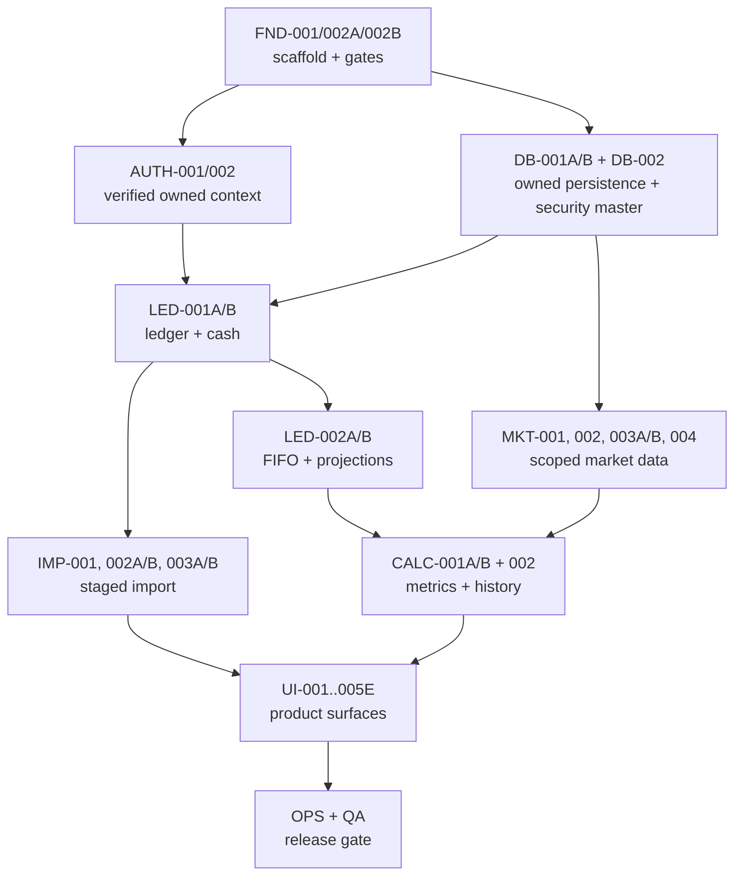

# YieldToMe implementation plan

Status: sequenced delivery plan  
Date: 2026-07-29
Executable backlog: `TASKS.md`

## 1. Delivery strategy

Build in vertical, reversible slices. The immediate milestone is a deliberately read-only, fixture-backed CSV portfolio preview that can be evaluated as a product before the production dependency spine resumes. It parses the supplied CSV, creates an in-memory sample portfolio, uses deterministic local price and FX fixtures, and exposes the Overview, Holdings, and holding-detail flow locally and in a Cloudflare preview deployment. It uses the approved dense mobile layout and clearly identifies fixture market data.

This preview does not introduce production authentication, D1 import commit, live market-data ingestion, background jobs, advanced historical performance, deletion workflows, or operational hardening. Those remain the subsequent production phases below. The preview route is intentionally unavailable in production.

After the preview milestone, establish identity and ownership before financial endpoints; establish immutable ledger truth before projections; establish deterministic calculations before rich UI; establish the explicit owner/source scope before production ingestion.

The private production deployment supports a small administrator-invited user set. Tenant isolation is proved with real request context plus synthetic preview/test users. Provider access has no source-specific user-count, owner-binding, deployment-mode, monetization, redistribution, or external-use gate. The release can deliver ledger value without genuine real-time quotes, dividend forecasts, news, public registration, broker sync, or advanced performance metrics.

## 2. Phase gates

### Immediate milestone — Demonstrable CSV portfolio preview

Tasks: `VSL-001` through `VSL-006` in `TASKS.md`

Gate:

- the supplied CSV is parsed by the completed strict parser into a non-persistent sample portfolio;
- deterministic decimal price, previous-close, and FX fixtures calculate quantity, cost, current value, daily movement, and gain;
- the approved dense Overview and Holdings screens and holding detail use those shared results at iPhone widths;
- mocked/fixture market data is visibly identified without routine provider/timestamp clutter;
- a Cloudflare preview URL and 320/390/430 screenshots provide owner-review evidence.

Checkpoint cadence: evaluate the parsed/valued sample after `VSL-002`, the local interactive screens after `VSL-004`, and the deployed preview after `VSL-006`. Do not promote later production tasks solely because preview dependencies are complete.

### Phase 0 — Foundation and decisions

Tasks: `FND-001`, `FND-002A`, `FND-002B`, `SPK-001`, `SPK-002`

Gate:

- scaffold builds and routes responsively;
- config is fail-closed;
- Wrangler-generated types and Worker configuration agree, with the unapproved `IMAGES` path removed and no undeclared binding reference;
- the production profile declares Workers Paid for the 10 MiB/100,000-row import contract and Free profile rejects that upload path;
- Yahoo best-effort technical behavior and free fallback policy recorded;
- the exact supplied 17-column header is locked as the complete supported import contract.

Parallelism: the provider-technical and CSV-format spikes can run independently from code foundation. Do not begin a production provider adapter before `SPK-002`.

### Phase 1 — Identity and owned persistence

Tasks: `DB-001A`, `DB-001B`, `AUTH-001`, `AUTH-002`, `OPS-001`

Gate:

- verified Access JWT becomes an internal active user;
- portfolio CRUD is owner-scoped;
- cross-user denial integration tests pass;
- material mutations generate redacted audit records.

Sequencing: schema can be designed alongside JWT verification, but owned repositories require both. No financial API should precede this gate.

### Phase 2 — Ledger and import truth

Tasks: `DB-002`, `MKT-001`, `LED-001A`, `LED-001B`, `IMP-001`, `IMP-002A`, `IMP-002B`, `LED-002A`, `LED-002B`, `IMP-003A`, `IMP-003B`

Gate:

- supplied 17-column CSV parses with expected classifications;
- mapping/preview is non-mutating;
- commit is idempotent and reversible;
- cash, holdings, and FIFO lots reconcile;
- incomplete source history is explicit.

Parallelism: the security master/provider contract and pure parser fixtures can proceed alongside ledger implementation. Commit/reversal depends on their stable contracts.

### Phase 3 — Market data and financial calculations

Tasks: `DB-003`, `DB-004`, `MKT-002`, `MKT-003A`, `MKT-003B`, `MKT-004`, `CALC-001A`, `CALC-001B`, `CALC-002`

Gate:

- owner-scoped provider data normalizes with provenance;
- the freshest validated observation is preferred, while compact views generally suppress timestamps and routine provider/delay/fallback labels;
- manual fallback works;
- price/FX gaps produce partial coverage, not zero;
- FIFO/current/daily/history fixtures pass;
- snapshots rebuild deterministically by calculation version.

Parallelism: pure calculation work can use fixtures before live provider integration. Provider interface and schema can proceed together.

### Phase 4 — Product surfaces

Tasks: `UI-001`, `UI-002`, `UI-003`, `UI-004`, `UI-005A`, `UI-005B`, `UI-005C`, `UI-005D`, `UI-005E`, `PWA-001`

Gate:

- reference navigation and workflows operate end to end;
- mobile and desktop hierarchy is usable;
- missing/stale/partial states are clear;
- service worker stores no private data;
- News is honestly unavailable unless separately approved.

UI screens may proceed in parallel once shared response contracts and shell are stable. Details/import depends on import services; Quotes depends on market selection; Overview/Holdings depend on calculations.

### Phase 5 — Operations and release

Tasks: `OPS-002`, `OPS-003A`, `OPS-003B`, `QA-001A`, `QA-001B`, `QA-002`

Gate:

- restore/deletion drills pass;
- provider retention obligations are operational;
- accessibility/security checks pass;
- preview UAT covers supplied CSV and iPhone/desktop;
- all required automated checks pass.

## 3. Dependency spine

## 4. Traceability matrix

| Requirement | Task(s)                                                                              |
| ----------- | ------------------------------------------------------------------------------------ |
| PRD-001     | AUTH-002, DB-001A, DB-001B, QA-001A                                                  |
| PRD-002     | AUTH-002, UI-001                                                                     |
| PRD-003     | FND-001, UI-001                                                                      |
| PRD-004     | FND-001, UI-001, UI-002, UI-003, QA-001B                                             |
| PRD-005     | DB-001A, DB-001B, CALC-001B, UI-001, UI-003                                          |
| AUTH-001    | AUTH-001                                                                             |
| AUTH-002    | AUTH-002                                                                             |
| AUTH-003    | AUTH-002, DB-001B, QA-001A                                                           |
| AUTH-004    | FND-002B, AUTH-001, IMP-003A, QA-001A                                                |
| AUTH-005    | AUTH-002, OPS-003A                                                                   |
| LED-001     | LED-001A, LED-001B, IMP-003A, UI-005E                                                |
| LED-002     | LED-001A, LED-001B, CALC-001B, UI-005E                                               |
| LED-003     | LED-001A, LED-001B, LED-002A, UI-005E                                                |
| LED-004     | LED-002A, LED-002B, UI-005E                                                          |
| LED-005     | LED-001A, LED-001B, CALC-002, UI-005E                                                |
| MKT-001     | DB-002, MKT-001                                                                      |
| MKT-002     | MKT-001, MKT-002                                                                     |
| MKT-003     | DB-003, MKT-002, MKT-003B, UI-004                                                    |
| MKT-004     | DB-003, MKT-004, CALC-001B                                                           |
| MKT-005     | MKT-003A, MKT-003B, CALC-002, UI-002, UI-003, UI-004                                 |
| MKT-006     | DB-003, MKT-003A, UI-004                                                             |
| MKT-007     | SPK-002, MKT-001                                                                     |
| MKT-008     | SPK-002, MKT-001, MKT-002, MKT-003A, MKT-003B, UI-004                                |
| CALC-001    | CALC-001A                                                                            |
| CALC-002    | CALC-001A, CALC-001B, UI-002, UI-003                                                 |
| CALC-003    | LED-002A, LED-002B, CALC-001A                                                        |
| CALC-004    | LED-002A, LED-002B, CALC-001A                                                        |
| CALC-005    | CALC-001B, CALC-002                                                                  |
| CALC-006    | CALC-002, UI-002                                                                     |
| CALC-007    | CALC-001A, UI-002                                                                    |
| DIV-001     | DB-005, DIV-001                                                                      |
| DIV-002     | DB-005, MKT-005, DIV-001                                                             |
| IMP-001     | IMP-001                                                                              |
| IMP-002     | IMP-002A, IMP-002B, UI-005B, UI-005C                                                 |
| IMP-003     | IMP-002B, UI-005B                                                                    |
| IMP-004     | IMP-001, IMP-002A, IMP-003A, UI-005C                                                 |
| IMP-005     | IMP-003B, UI-005D                                                                    |
| IMP-006     | SPK-001, IMP-001                                                                     |
| BRK-001     | SPK-003                                                                              |
| PLAT-001    | FND-001, FND-002A, DB-001A                                                           |
| PLAT-002    | FND-001, PWA-001                                                                     |
| OPS-001     | OPS-001, IMP-003A, IMP-003B, MKT-003A                                                |
| OPS-002     | OPS-001, QA-002                                                                      |
| OPS-003     | OPS-002, QA-002                                                                      |
| OPS-004     | OPS-003A, OPS-003B                                                                   |
| QUAL-001    | UI-001, UI-002, UI-003, UI-004, UI-005A, UI-005B, UI-005C, UI-005D, UI-005E, QA-001B |
| QUAL-002    | FND-002A, FND-002B, QA-002                                                           |

Every requirement has an implementation owner. `TASKS.md` gives acceptance and test details.

## 5. First release slices

### Slice A — Secure empty portfolio

Verified identity, internal user, portfolio CRUD, audit, responsive shell, no financial data. This proves tenant isolation.

### Slice B — Imported ledger

Staged import of the supplied file, mapping, idempotent commit/reversal, cash incompleteness warning, FIFO projections. Market values remain unavailable until Slice C.

### Slice C — Best-effort/EOD valuation

Owner-scoped provider/fixtures, security mapping, preferred validated observation with EOD/manual fallback, date-appropriate FX, native/home display, current value/cost/gain/daily movement, and coverage. Compact views generally suppress timestamps and routine source/delay/fallback labels.

### Slice D — History

Daily snapshots and historical value chart with explicit incomplete-history boundaries. Dividend events, receipts, and forecasts remain deferred.

### Slice E — Release hardening

Details/import history, PWA offline safety, recovery/deletion, accessibility/security/UAT.

## 6. Market-data rollout

1. Record the Yahoo best-effort technical and free fallback decision (`SPK-002`).
2. Implement provider-neutral contracts and fixtures (`MKT-001`).
3. Implement latest/previous-close and raw daily price capabilities only (`MKT-002`).
4. Implement required directional FX pairs only (`MKT-004`).
5. Backfill only securities, FX pairs, and date ranges owned by an active portfolio.
6. Refresh no faster than the source/rate budget permits; coalesce canonical requests and collect bounded daily correction windows.
7. Add Queues only if measured refresh/backfill cannot be reliably bounded by D1 jobs and Cron.
8. Keep normal quote/holding views compact: generally suppress timestamps and routine source/delay/fallback labels; keep explanation data on demand; show inline status only when action is required and `unavailable` when no usable value exists.
9. Keep genuine real-time data as a separate entitlement; do not call best-effort polling live.

External provider-use decisions are handled separately by the operator. The product implements no source-specific user-count, owner-binding, deployment-mode, monetization, redistribution, or external-use gate.

## 7. Security implementation checklist

- Access application and allow policy configured per environment.
- Worker JWT verification with remote JWKS cache and key rotation.
- Internal status and identity mapping on every protected request.
- Composite owner query and foreign-key patterns.
- Same-origin mutation/CSRF controls.
- CSP and private no-store response headers.
- Input schemas and bounded payloads.
- Server-only secrets and provider calls.
- Dependency lock and review.
- Cross-tenant test matrix for every repository/route.
- Structured redacted audit and operational logs.
- Account disable/delete and provider purge paths; OPS-003A currently stops after immediate identity revocation and immutable owner-scoped export/deletion manifests, with no financial-data purge.

## 8. Testing strategy

### Unit

- decimal parsing/format/rounding;
- FIFO and fee allocation;
- price/FX selection and staleness;
- current/daily/history formulas;
- CSV header/row/date/fingerprint logic;
- authorization policy functions.

### Integration

- D1 migrations/foreign keys/index assumptions;
- identity JIT provisioning and disabled states;
- owned repositories and cross-user denials;
- transaction/cash/lot invariants;
- import state machine/idempotency/reversal;
- provider normalization/retry/rate-limit behavior;
- snapshot invalidation/rebuild.

### Route/render

- all navigation routes;
- empty/missing/stale/partial/error states;
- security headers/no-store;
- unauthenticated and forbidden behavior;
- semantic HTML.

### End-to-end/UAT

- supplied CSV stage → map → commit → reverse;
- desktop and 320 px/iPhone viewport;
- keyboard-only core workflows;
- PWA install metadata and offline reload;
- Access session/offboarding in preview;
- recovery/deletion drills.

Network data is never required for deterministic calculation/import tests.

## 9. Risks and mitigations

| Risk                                          | Impact                            | Mitigation / owner task                                                                                                        |
| --------------------------------------------- | --------------------------------- | ------------------------------------------------------------------------------------------------------------------------------ |
| Yahoo endpoints are unavailable or unsuitable | Best-effort valuation unavailable | Circuit breaker, `unavailable`, manual fallback; add a second source only through a measured-need task (`MKT-002`, `MKT-003B`) |
| Incomplete cash/split history                 | Misleading returns/history        | Completeness boundary and partial metrics (`IMP-002B`, `CALC-002`)                                                             |
| Access treated as full user system            | Tenant/account flaws              | Internal identity/status and owned repos (`AUTH-001/002`)                                                                      |
| Ticker changes/delistings                     | Mispriced historical holdings     | Canonical security + validity mappings (`DB-002`)                                                                              |
| D1 write/job limits                           | Refresh/import failures           | Bounded chunks, idempotency, measured Queue trigger (`IMP-003A`, `MKT-003B`)                                                   |
| Decimal/rounding drift                        | Financial mismatch                | Decimal domain + fixtures (`CALC-001A`)                                                                                        |
| Service worker leaks private data             | Shared-device exposure            | Public allowlist only (`PWA-001`, `QA-001A`)                                                                                   |
| Destructive correction/deletion               | Lost audit/history                | Reversals, Time Travel, exports (`IMP-003B`, `OPS-002`, `OPS-003A/B`)                                                          |
| Mobile desktop-table copy                     | Poor iPhone usability             | Distinct card hierarchy and device UAT (`UI-003`, `QA-002`)                                                                    |

## 10. Deferred backlog triggers

These are not active tasks:

- News: add only with an attributable source, caching, and privacy decision.
- Dividend forecasts/franking analytics: add only after DB-005/MKT-005 validate actual receipt workflow and provider event quality.
- TWR/XIRR: add only after complete valuations and external-flow classification.
- Self-service identity: add only if product leaves admin-invited private mode.
- R2 originals: add only for a proven retention/download need and encrypted lifecycle.
- Intraday quotes: add only when measured product need and provider capability justify them.
- Broker synchronization: preserve the adapter/source boundary now; implement only after broker/API/security scope is selected (`SPK-003`).
- Fundamentals: add only when a specified Details view justifies the provider tier.
- Offline private data: add only after a separate encrypted-storage/conflict threat model.
- New asset classes: add through explicit ledger/calculation/corporate-action extensions.

## 11. Stop rule for this foundation pass

This repository pass ends after:

- consolidated documentation and task traceability;
- AGENTS instructions;
- minimal branded responsive scaffold and safe PWA foundation;
- local lint, production build, and smoke tests.

It does not create production Cloudflare resources, implement financial features, choose user data on their behalf, or deploy.
