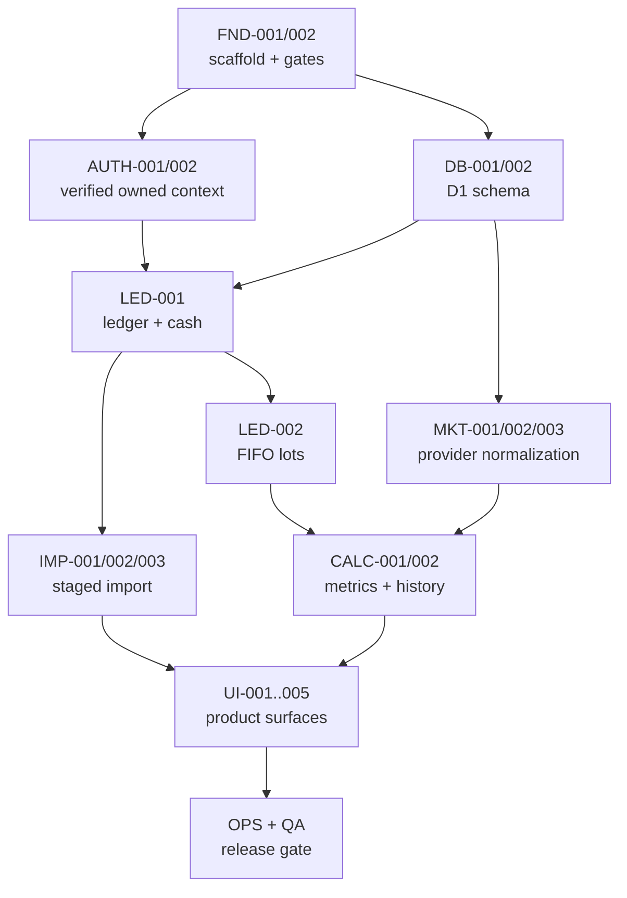

# YieldToMe implementation plan

Status: sequenced delivery plan  
Date: 2026-07-28  
Executable backlog: `TASKS.md`

## 1. Delivery strategy

Build in vertical, reversible slices. Establish identity and ownership before financial endpoints; establish immutable ledger truth before projections; establish deterministic calculations before rich UI; establish provider rights before production ingestion.

The first working release is administrator-invited and delayed-quote-first where a lawful provider is available, with labelled end-of-day/manual fallback. It can deliver ledger value without genuine real-time quotes, news, public registration, broker sync, or advanced performance metrics.

## 2. Phase gates

### Phase 0 — Foundation and decisions

Tasks: `FND-001`, `FND-002`, `SPK-001`, `SPK-002`

Gate:

- scaffold builds and routes responsively;
- config is fail-closed;
- EODHD commercial rights, international coverage, and total cost decision recorded;
- the exact supplied 17-column header is locked as the complete supported import contract.

Parallelism: the market-rights and CSV-format spikes can run independently from code foundation. Do not begin a production provider adapter before `SPK-002`.

### Phase 1 — Identity and owned persistence

Tasks: `AUTH-001`, `DB-001`, `AUTH-002`, `OPS-001`

Gate:

- verified Access JWT becomes an internal active user;
- portfolio CRUD is owner-scoped;
- cross-user denial integration tests pass;
- material mutations generate redacted audit records.

Sequencing: schema can be designed alongside JWT verification, but owned repositories require both. No financial API should precede this gate.

### Phase 2 — Ledger and import truth

Tasks: `DB-002`, `MKT-001`, `LED-001`, `IMP-001`, `IMP-002`, `IMP-003`, `LED-002`

Gate:

- supplied 17-column CSV parses with expected classifications;
- mapping/preview is non-mutating;
- commit is idempotent and reversible;
- cash, holdings, and FIFO lots reconcile;
- incomplete source history is explicit.

Parallelism: the security master/provider contract and pure parser fixtures can proceed alongside ledger implementation. Commit/reversal depends on their stable contracts.

### Phase 3 — Market data and financial calculations

Tasks: `DB-003`, `DB-004`, `MKT-002`, `MKT-003`, `CALC-001`, `CALC-002`, `DIV-001`

Gate:

- approved provider data normalizes with provenance;
- delayed observations are preferred and explicitly labelled when supported;
- manual fallback works;
- price/FX gaps produce partial coverage, not zero;
- FIFO/current/daily/history/dividend fixtures pass;
- snapshots rebuild deterministically by calculation version.

Parallelism: pure calculation work can use fixtures before live provider integration. Provider interface and schema can proceed together. Adapter implementation is blocked by the rights gate.

### Phase 4 — Product surfaces

Tasks: `UI-001`, `UI-002`, `UI-003`, `UI-004`, `UI-005`, `PWA-001`

Gate:

- reference navigation and workflows operate end to end;
- mobile and desktop hierarchy is usable;
- missing/stale/estimated states are clear;
- service worker stores no private data;
- News is honestly unavailable unless separately approved.

UI screens may proceed in parallel once shared response contracts and shell are stable. Details/import depends on import services; Quotes depends on market selection; Overview/Holdings depend on calculations.

### Phase 5 — Operations and release

Tasks: `OPS-002`, `OPS-003`, `QA-001`, `QA-002`

Gate:

- restore/deletion drills pass;
- provider retention obligations are operational;
- accessibility/security checks pass;
- preview UAT covers supplied CSV and iPhone/desktop;
- all required automated checks pass.

## 3. Dependency spine

## 4. Traceability matrix

| Requirement | Task(s)                                    |
| ----------- | ------------------------------------------ |
| PRD-001     | AUTH-002, DB-001, QA-001                   |
| PRD-002     | AUTH-002, UI-001                           |
| PRD-003     | FND-001, UI-001                            |
| PRD-004     | FND-001, UI-001, UI-002, UI-003, QA-001    |
| PRD-005     | DB-001, CALC-001, UI-001, UI-003           |
| AUTH-001    | AUTH-001                                   |
| AUTH-002    | AUTH-002                                   |
| AUTH-003    | AUTH-002, DB-001, QA-001                   |
| AUTH-004    | FND-002, AUTH-001, IMP-003, QA-001         |
| AUTH-005    | AUTH-002, OPS-003                          |
| LED-001     | LED-001, IMP-003                           |
| LED-002     | LED-001, CALC-001                          |
| LED-003     | LED-001, LED-002                           |
| LED-004     | LED-002                                    |
| LED-005     | LED-001, CALC-002                          |
| MKT-001     | DB-002, MKT-001                            |
| MKT-002     | MKT-001, MKT-002                           |
| MKT-003     | DB-003, MKT-002, UI-004                    |
| MKT-004     | DB-003, MKT-002, CALC-001                  |
| MKT-005     | MKT-003, CALC-002, UI-002, UI-003, UI-004  |
| MKT-006     | DB-003, MKT-003, UI-004, UI-005            |
| MKT-007     | SPK-002, MKT-001, OPS-003                  |
| MKT-008     | SPK-002, MKT-001, MKT-002, MKT-003, UI-004 |
| CALC-001    | CALC-001                                   |
| CALC-002    | CALC-001, UI-002, UI-003                   |
| CALC-003    | LED-002, CALC-001                          |
| CALC-004    | LED-002, CALC-001                          |
| CALC-005    | CALC-001, CALC-002                         |
| CALC-006    | CALC-002, UI-002                           |
| CALC-007    | CALC-001, UI-002                           |
| DIV-001     | DB-004, DIV-001, LED-001                   |
| DIV-002     | DB-004, DIV-001, UI-002, UI-003            |
| IMP-001     | IMP-001                                    |
| IMP-002     | IMP-002                                    |
| IMP-003     | IMP-002                                    |
| IMP-004     | IMP-001, IMP-003                           |
| IMP-005     | IMP-003                                    |
| IMP-006     | SPK-001, IMP-001                           |
| BRK-001     | SPK-003                                    |
| PLAT-001    | FND-001, FND-002, DB-001                   |
| PLAT-002    | FND-001, PWA-001                           |
| OPS-001     | OPS-001, IMP-003, MKT-003                  |
| OPS-002     | OPS-001, QA-002                            |
| OPS-003     | OPS-002, QA-002                            |
| OPS-004     | OPS-003                                    |
| QUAL-001    | UI-001..005, QA-001                        |
| QUAL-002    | FND-002, QA-002                            |

Every requirement has an implementation owner. `TASKS.md` gives acceptance and test details.

## 5. First release slices

### Slice A — Secure empty portfolio

Verified identity, internal user, portfolio CRUD, audit, responsive shell, no financial data. This proves tenant isolation.

### Slice B — Imported ledger

Staged import of the supplied file, mapping, idempotent commit/reversal, cash incompleteness warning, FIFO projections. Market values remain unavailable until Slice C.

### Slice C — Delayed/EOD valuation

Rights-approved provider/fixtures, security mapping, preferred delayed observation with EOD/manual fallback, date-appropriate FX, native/home display, current value/cost/gain/daily movement, and coverage.

### Slice D — History and income

Daily snapshots, historical chart, declared/actual/estimated dividends with distinct labels.

### Slice E — Release hardening

Details/import history, PWA offline safety, recovery/deletion, accessibility/security/UAT.

## 6. Market-data rollout

1. Record the EODHD commercial contract/rights/coverage decision (`SPK-002`).
2. Implement provider-neutral contracts and fixtures (`MKT-001`).
3. Implement only the approved delayed provider capabilities (`MKT-002`): delayed/latest quote, symbol reference, daily history, FX, dividends, and splits as contracted.
4. Backfill only securities and date ranges owned by an active portfolio.
5. Refresh delayed observations no faster than the advertised delay/rate budget; coalesce canonical securities, then collect the completed EOD window.
6. Add Queues only if refresh/backfill cannot be reliably bounded.
7. Expose `Delayed 20 min` (or actual delay), previous close, EOD/manual fallback, source, and as-of labels.
8. Keep genuine real-time data as a separate entitlement; do not call delayed polling live.

Production stop condition: if lawful delayed storage/display rights are not obtained at an approved cost, keep provider fixtures and ship only explicitly approved EOD/manual data. Do not scrape a public delayed website to satisfy the free-data preference.

## 7. Security implementation checklist

- Access application and allow policy configured per environment.
- Worker JWT verification with remote JWKS cache and key rotation.
- Internal status and identity mapping on every protected request.
- Composite owner query and foreign-key patterns.
- Same-origin mutation/CSRF controls.
- CSP and private no-store response headers.
- Input schemas and bounded payloads.
- Server-only secrets and provider calls.
- Dependency lock and review.
- Cross-tenant test matrix for every repository/route.
- Structured redacted audit and operational logs.
- Account disable/delete and provider purge paths.

## 8. Testing strategy

### Unit

- decimal parsing/format/rounding;
- FIFO and fee allocation;
- price/FX selection and staleness;
- current/daily/history formulas;
- dividends;
- CSV header/row/date/fingerprint logic;
- authorization policy functions.

### Integration

- D1 migrations/foreign keys/index assumptions;
- identity JIT provisioning and disabled states;
- owned repositories and cross-user denials;
- transaction/cash/lot invariants;
- import state machine/idempotency/reversal;
- provider normalization/retry/rate-limit behavior;
- snapshot invalidation/rebuild.

### Route/render

- all navigation routes;
- empty/missing/stale/partial/error states;
- security headers/no-store;
- unauthenticated and forbidden behavior;
- semantic HTML.

### End-to-end/UAT

- supplied CSV stage → map → commit → reverse;
- desktop and 320 px/iPhone viewport;
- keyboard-only core workflows;
- PWA install metadata and offline reload;
- Access session/offboarding in preview;
- recovery/deletion drills.

Network data is never required for deterministic calculation/import tests.

## 9. Risks and mitigations

| Risk                                              | Impact                            | Mitigation / owner task                                                                                           |
| ------------------------------------------------- | --------------------------------- | ----------------------------------------------------------------------------------------------------------------- |
| Low-cost global delayed rights are unavailable    | Preferred quote freshness blocked | EODHD commercial-rights/cost gate, delayed-first abstraction, explicit EOD/manual fallback (`SPK-002`, `MKT-001`) |
| Incomplete cash/dividend/corporate-action history | Misleading returns/history        | Completeness boundary and partial metrics (`IMP-002`, `CALC-002`)                                                 |
| Access treated as full user system                | Tenant/account flaws              | Internal identity/status and owned repos (`AUTH-001/002`)                                                         |
| Ticker changes/delistings                         | Mispriced historical holdings     | Canonical security + validity mappings (`DB-002`)                                                                 |
| D1 write/job limits                               | Refresh/import failures           | Bounded chunks, idempotency, measured Queue trigger (`IMP-003`, `MKT-003`)                                        |
| Decimal/rounding drift                            | Financial mismatch                | Decimal domain + fixtures (`CALC-001`)                                                                            |
| Service worker leaks private data                 | Shared-device exposure            | Public allowlist only (`PWA-001`, `QA-001`)                                                                       |
| Destructive correction/deletion                   | Lost audit/history                | Reversals, Time Travel, exports (`IMP-003`, `OPS-002/003`)                                                        |
| Mobile desktop-table copy                         | Poor iPhone usability             | Distinct card hierarchy and device UAT (`UI-003`, `QA-002`)                                                       |

## 10. Deferred backlog triggers

These are not active tasks:

- News: add only with licensed source, attribution, caching, and privacy decision.
- TWR/XIRR: add only after complete valuations and external-flow classification.
- Self-service identity: add only if product leaves admin-invited private mode.
- R2 originals: add only for a proven retention/download need and encrypted lifecycle.
- Intraday quotes: add only with exchange/provider display rights and a cost decision.
- Broker synchronization: preserve the adapter/source boundary now; implement only after broker/API/security scope is selected (`SPK-003`).
- Fundamentals: add only when a specified Details view justifies the provider tier.
- Offline private data: add only after a separate encrypted-storage/conflict threat model.
- New asset classes: add through explicit ledger/calculation/corporate-action extensions.

## 11. Stop rule for this foundation pass

This repository pass ends after:

- consolidated documentation and task traceability;
- AGENTS instructions;
- minimal branded responsive scaffold and safe PWA foundation;
- local lint, production build, and smoke tests.

It does not create production Cloudflare resources, implement financial features, choose user data on their behalf, or deploy.
